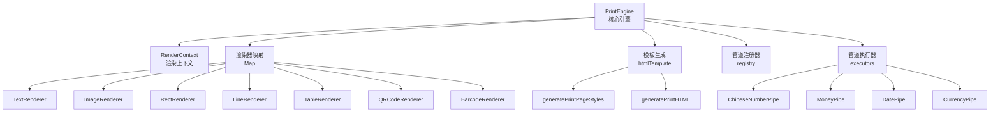
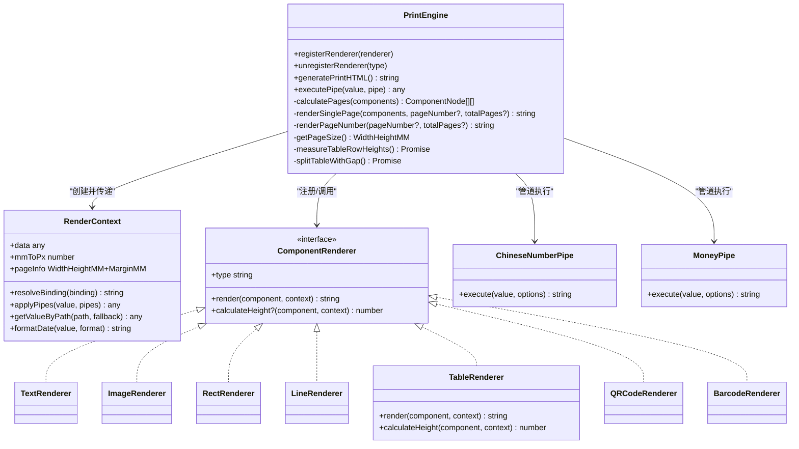
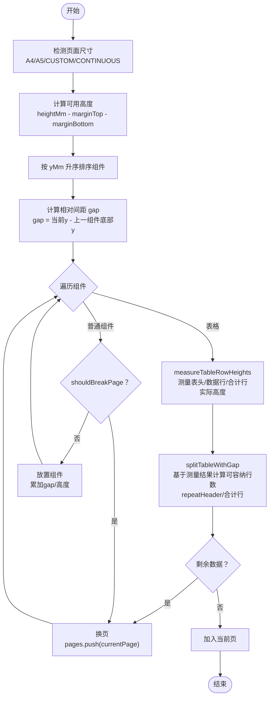
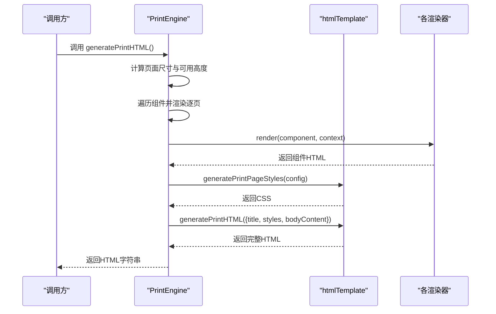
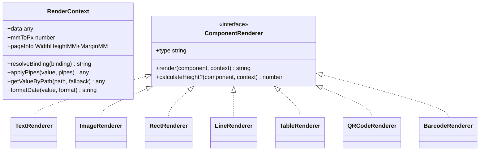
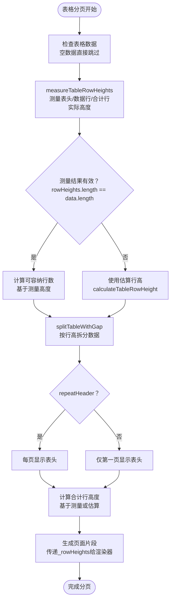
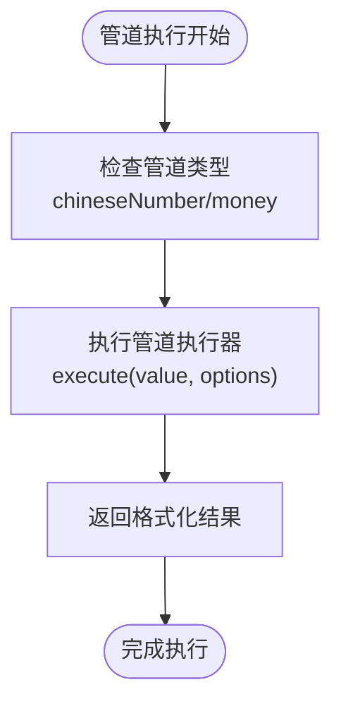
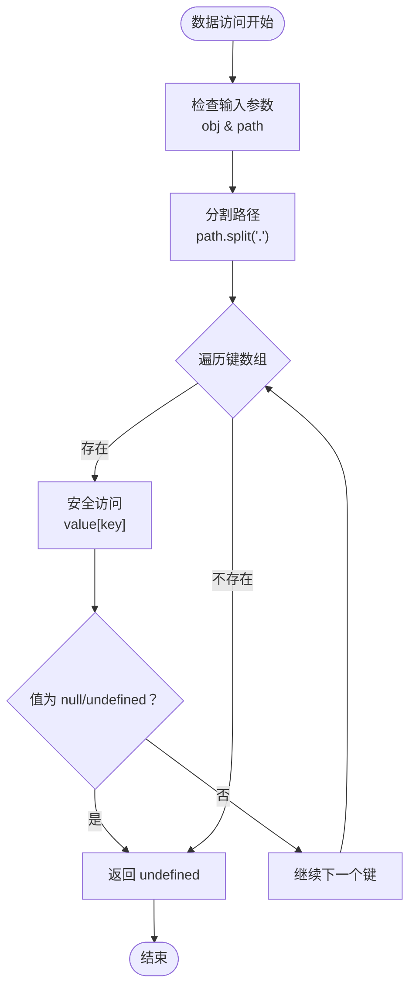
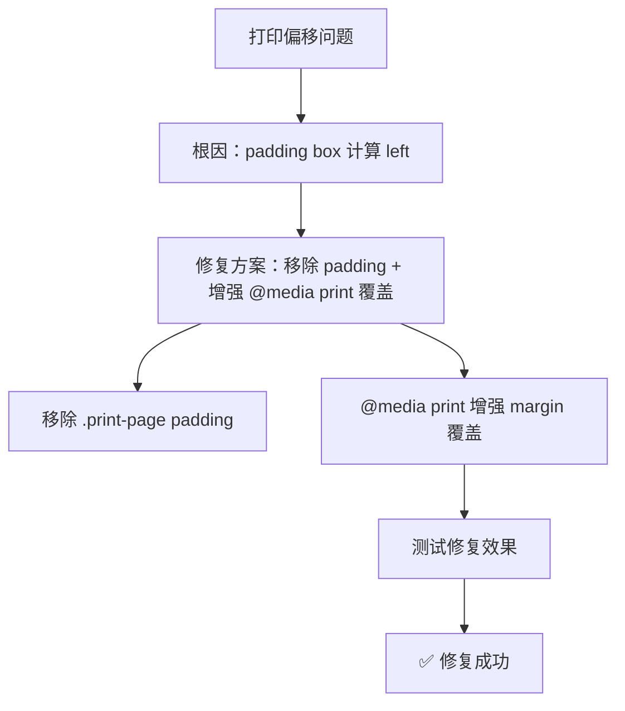
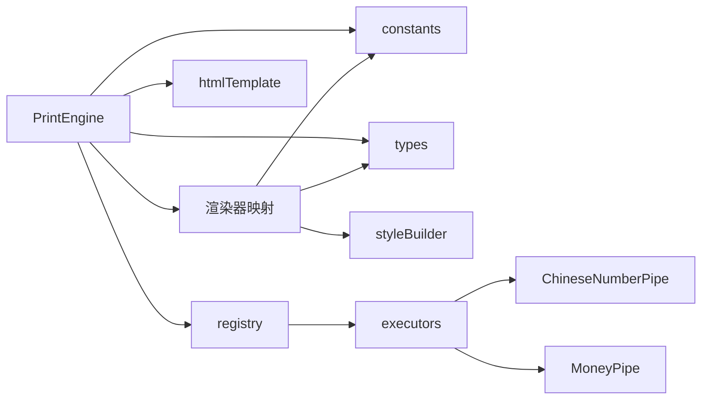

# 打印引擎核心

<cite>
**本文引用的文件**
- [sdk/src/printEngine.ts](file://sdk/src/printEngine.ts)
- [sdk/src/printEngine/types.ts](file://sdk/src/printEngine/types.ts)
- [sdk/src/printEngine/constants.ts](file://sdk/src/printEngine/constants.ts)
- [sdk/src/printEngine/htmlTemplate.ts](file://sdk/src/printEngine/htmlTemplate.ts)
- [sdk/src/printEngine/utils/styleBuilder.ts](file://sdk/src/printEngine/utils/styleBuilder.ts)
- [sdk/src/printEngine/renderers/index.ts](file://sdk/src/printEngine/renderers/index.ts)
- [sdk/src/printEngine/renderers/TextRenderer.ts](file://sdk/src/printEngine/renderers/TextRenderer.ts)
- [sdk/src/printEngine/renderers/TableRenderer.ts](file://sdk/src/printEngine/renderers/TableRenderer.ts)
- [sdk/src/printEngine/renderers/ImageRenderer.ts](file://sdk/src/printEngine/renderers/ImageRenderer.ts)
- [sdk/src/printEngine/renderers/RectRenderer.ts](file://sdk/src/printEngine/renderers/RectRenderer.ts)
- [sdk/src/printEngine/renderers/LineRenderer.ts](file://sdk/src/printEngine/renderers/LineRenderer.ts)
- [sdk/src/printEngine/renderers/QRCodeRenderer.ts](file://sdk/src/printEngine/renderers/QRCodeRenderer.ts)
- [sdk/src/printEngine/renderers/BarcodeRenderer.ts](file://sdk/src/printEngine/renderers/BarcodeRenderer.ts)
- [sdk/src/types.ts](file://sdk/src/types.ts)
- [sdk/src/pipes/registry.ts](file://sdk/src/pipes/registry.ts)
- [sdk/src/pipes/executors/ChineseNumberPipe.ts](file://sdk/src/pipes/executors/ChineseNumberPipe.ts)
- [sdk/src/pipes/executors/MoneyPipe.ts](file://sdk/src/pipes/executors/MoneyPipe.ts)
- [sdk/src/pipes/executors/index.ts](file://sdk/src/pipes/executors/index.ts)
- [README.md](file://README.md)
</cite>

## 更新摘要
**变更内容**
- 新增 ChineseNumberPipe 和 MoneyPipe 管道执行器，支持中文大写数字和金额转换
- TableRenderer 增强管道支持，可在合计行和额外行中使用管道执行器
- printEngine 整体性能优化，改进分页计算和表格渲染逻辑
- 打印预览功能改进，增强页面布局和样式处理
- 修复多项分页精度问题和表格渲染稳定性问题

## 目录
1. [简介](#简介)
2. [项目结构](#项目结构)
3. [核心组件](#核心组件)
4. [架构总览](#架构总览)
5. [详细组件分析](#详细组件分析)
6. [依赖关系分析](#依赖关系分析)
7. [性能考量](#性能考量)
8. [故障排除指南](#故障排除指南)
9. [结论](#结论)
10. [附录](#附录)

## 简介
本技术文档围绕打印引擎核心展开，系统性阐述 PrintEngine 的设计架构与实现原理，重点覆盖以下方面：
- 分页计算机制：基于相对间距的流式布局与跨页处理策略
- HTML 模板生成：DOM 结构构建、样式注入与资源加载
- 页面配置管理：页面尺寸、边距与打印参数
- 渲染器插件化体系：组件渲染扩展点与通用上下文
- **革命性表格分页技术**：测量后渲染方法解决长文本分页问题
- **嵌套对象数据结构支持**：通过深度路径访问实现复杂数据绑定
- **管道系统增强**：新增 ChineseNumberPipe 和 MoneyPipe 支持中文大写和金额转换
- **Monaco Editor 性能优化**：使用专用插件提升编辑器加载速度
- **打印内容偏移修复**：改进 @media print 规则，确保边距完全覆盖
- 使用示例、性能优化与故障排除建议

## 项目结构
打印引擎位于 SDK 子模块中，采用"插件化渲染器 + 统一模板生成 + 管道系统"的架构组织：
- 核心引擎：负责模板解析、数据绑定、管道转换、分页计算与 HTML 输出
- 渲染器：按组件类型插件化实现，统一通过 RenderContext 提供能力
- 模板生成：集中管理打印样式与 HTML 结构
- 管道系统：支持多种数据格式化管道，包括新增的 ChineseNumberPipe 和 MoneyPipe
- 工具与常量：样式构建、单位换算与默认配置

**图表来源**
- [sdk/src/printEngine.ts:31-1016](file://sdk/src/printEngine.ts#L31-L1016)
- [sdk/src/printEngine/renderers/index.ts:1-13](file://sdk/src/printEngine/renderers/index.ts#L1-L13)
- [sdk/src/printEngine/htmlTemplate.ts:81-280](file://sdk/src/printEngine/htmlTemplate.ts#L81-L280)
- [sdk/src/pipes/registry.ts:45-65](file://sdk/src/pipes/registry.ts#L45-L65)
- [sdk/src/pipes/executors/index.ts:1-45](file://sdk/src/pipes/executors/index.ts#L1-L45)

**章节来源**
- [sdk/src/printEngine.ts:31-1016](file://sdk/src/printEngine.ts#L31-L1016)
- [sdk/src/printEngine/renderers/index.ts:1-13](file://sdk/src/printEngine/renderers/index.ts#L1-L13)
- [sdk/src/printEngine/htmlTemplate.ts:81-280](file://sdk/src/printEngine/htmlTemplate.ts#L81-L280)
- [sdk/src/pipes/registry.ts:1-65](file://sdk/src/pipes/registry.ts#L1-L65)
- [sdk/src/pipes/executors/index.ts:1-45](file://sdk/src/pipes/executors/index.ts#L1-L45)

## 核心组件
- PrintEngine：打印引擎核心，负责模板与数据绑定、管道转换、分页计算、HTML 生成与渲染器注册
- RenderContext：渲染上下文，向渲染器暴露数据、解析器、格式化器与页面信息
- ComponentRenderer：组件渲染器接口，统一规范渲染器行为
- htmlTemplate：HTML 模板与样式生成器，支持预览与批量打印两种模式
- styleBuilder：样式构建工具，提供位置样式与样式字符串转换
- constants：单位换算与默认尺寸/样式常量
- types：模板、页面、组件与数据绑定等类型定义
- registry：管道执行器注册与执行
- ChineseNumberPipe：中文大写数字管道，支持小数和负数转换
- MoneyPipe：金额转换管道，支持分转元、元转分、中文大写金额等

**章节来源**
- [sdk/src/printEngine/types.ts:11-116](file://sdk/src/printEngine/types.ts#L11-L116)
- [sdk/src/printEngine/constants.ts:8-113](file://sdk/src/printEngine/constants.ts#L8-L113)
- [sdk/src/printEngine/htmlTemplate.ts:81-280](file://sdk/src/printEngine/htmlTemplate.ts#L81-L280)
- [sdk/src/printEngine/utils/styleBuilder.ts:13-53](file://sdk/src/printEngine/utils/styleBuilder.ts#L13-L53)
- [sdk/src/types.ts:49-171](file://sdk/src/types.ts#L49-L171)
- [sdk/src/pipes/registry.ts:45-65](file://sdk/src/pipes/registry.ts#L45-L65)
- [sdk/src/pipes/executors/ChineseNumberPipe.ts:1-138](file://sdk/src/pipes/executors/ChineseNumberPipe.ts#L1-L138)
- [sdk/src/pipes/executors/MoneyPipe.ts:1-130](file://sdk/src/pipes/executors/MoneyPipe.ts#L1-L130)

## 架构总览
PrintEngine 以"插件化渲染器 + 统一模板生成 + 管道系统"为核心，形成清晰的职责分离：
- 插件化渲染器：TextRenderer、ImageRenderer、RectRenderer、LineRenderer、TableRenderer、QRCodeRenderer、BarcodeRenderer
- 渲染上下文：提供数据解析、管道应用、日期格式化、mm→px 转换与页面信息
- 模板生成：根据页面配置生成打印样式与 HTML 文档骨架
- 分页计算：基于相对间距的流式布局，支持表格跨页拆分与页码渲染
- 管道系统：统一管理各种数据格式化管道，支持链式转换

**图表来源**
- [sdk/src/printEngine.ts:31-1016](file://sdk/src/printEngine.ts#L31-L1016)
- [sdk/src/printEngine/types.ts:61-82](file://sdk/src/printEngine/types.ts#L61-L82)
- [sdk/src/printEngine/renderers/TextRenderer.ts:10-60](file://sdk/src/printEngine/renderers/TextRenderer.ts#L10-L60)
- [sdk/src/printEngine/renderers/ImageRenderer.ts:10-55](file://sdk/src/printEngine/renderers/ImageRenderer.ts#L10-L55)
- [sdk/src/printEngine/renderers/RectRenderer.ts:10-39](file://sdk/src/printEngine/renderers/RectRenderer.ts#L10-L39)
- [sdk/src/printEngine/renderers/LineRenderer.ts:10-59](file://sdk/src/printEngine/renderers/LineRenderer.ts#L10-L59)
- [sdk/src/printEngine/renderers/TableRenderer.ts:11-602](file://sdk/src/printEngine/renderers/TableRenderer.ts#L11-L602)
- [sdk/src/printEngine/renderers/QRCodeRenderer.ts:12-63](file://sdk/src/printEngine/renderers/QRCodeRenderer.ts#L12-L63)
- [sdk/src/printEngine/renderers/BarcodeRenderer.ts:12-63](file://sdk/src/printEngine/renderers/BarcodeRenderer.ts#L12-L63)
- [sdk/src/pipes/executors/ChineseNumberPipe.ts:99-138](file://sdk/src/pipes/executors/ChineseNumberPipe.ts#L99-L138)
- [sdk/src/pipes/executors/MoneyPipe.ts:59-130](file://sdk/src/pipes/executors/MoneyPipe.ts#L59-L130)

## 详细组件分析

### 分页计算机制（相对间距流式布局）
PrintEngine 采用"相对间距"模型进行虚拟分页，核心流程如下：
- 页面可用高度 = 页面高度 − 上下边距
- 组件按 yMm 升序排序，计算相邻组件的相对间距 gap（gap = 当前组件 y − 上一组件底部 y）
- 首组件：高度累加至 currentPageHeight；非首组件：先累加 gap，再累加组件高度
- **表格组件：引入测量后渲染机制，通过实时测量表头、数据行和合计行的实际高度，实现精确的跨页拆分**
- 连续纸模式：不分页，单页渲染

**图表来源**
- [sdk/src/printEngine.ts:401-558](file://sdk/src/printEngine.ts#L401-L558)
- [sdk/src/printEngine.ts:700-922](file://sdk/src/printEngine.ts#L700-L922)
- [sdk/src/printEngine.ts:800-922](file://sdk/src/printEngine.ts#L800-L922)

**章节来源**
- [sdk/src/printEngine.ts:244-253](file://sdk/src/printEngine.ts#L244-L253)
- [sdk/src/printEngine.ts:401-558](file://sdk/src/printEngine.ts#L401-L558)
- [sdk/src/printEngine.ts:700-922](file://sdk/src/printEngine.ts#L700-L922)

### HTML 模板生成（DOM 结构、样式注入与资源加载）
- generatePrintPageStyles：根据页面配置生成打印样式，支持预览模式与连续纸模式
- generatePrintHTML：拼装完整 HTML 文档，注入样式与页面内容
- getPageSizeFromConfig：从 PageConfig 提取页面宽高与方向
- 组件基础样式：文本、表格、图片、矩形、线条、二维码、条形码的通用定位与展示规则

**图表来源**
- [sdk/src/printEngine.ts:927-984](file://sdk/src/printEngine.ts#L927-L984)
- [sdk/src/printEngine/htmlTemplate.ts:81-280](file://sdk/src/printEngine/htmlTemplate.ts#L81-L280)

**章节来源**
- [sdk/src/printEngine/htmlTemplate.ts:81-280](file://sdk/src/printEngine/htmlTemplate.ts#L81-L280)
- [sdk/src/printEngine.ts:927-984](file://sdk/src/printEngine.ts#L927-L984)

### 页面配置管理（尺寸、边距与打印参数）
- PageConfig：页面尺寸（A4/A5/CUSTOM/CONTINUOUS）、方向、边距、页码配置
- PageNumberConfig：页码开关、位置、格式、前缀/后缀、偏移与样式
- getPageSizeFromConfig：根据 PageConfig 计算宽高与方向
- generatePrintPageStyles：将边距转换为 .print-page 的 padding，预览模式与打印模式分别处理

**章节来源**
- [sdk/src/types.ts:49-62](file://sdk/src/types.ts#L49-L62)
- [sdk/src/types.ts:30-46](file://sdk/src/types.ts#L30-L46)
- [sdk/src/printEngine/htmlTemplate.ts:256-280](file://sdk/src/printEngine/htmlTemplate.ts#L256-L280)
- [sdk/src/printEngine/htmlTemplate.ts:81-171](file://sdk/src/printEngine/htmlTemplate.ts#L81-L171)

### 渲染器插件体系（组件渲染扩展点）
- ComponentRenderer 接口：type、render、可选 calculateHeight
- RenderContext：resolveBinding、applyPipes、getValueByPath、formatDate、mmToPx、pageInfo
- 默认渲染器：TextRenderer、ImageRenderer、RectRenderer、LineRenderer、TableRenderer、QRCodeRenderer、BarcodeRenderer
- styleBuilder：buildStyleString、buildPositionStyle，统一样式构建

**图表来源**
- [sdk/src/printEngine/types.ts:61-82](file://sdk/src/printEngine/types.ts#L61-L82)
- [sdk/src/printEngine/renderers/TextRenderer.ts:10-60](file://sdk/src/printEngine/renderers/TextRenderer.ts#L10-L60)
- [sdk/src/printEngine/renderers/ImageRenderer.ts:10-55](file://sdk/src/printEngine/renderers/ImageRenderer.ts#L10-L55)
- [sdk/src/printEngine/renderers/RectRenderer.ts:10-39](file://sdk/src/printEngine/renderers/RectRenderer.ts#L10-L39)
- [sdk/src/printEngine/renderers/LineRenderer.ts:10-59](file://sdk/src/printEngine/renderers/LineRenderer.ts#L10-L59)
- [sdk/src/printEngine/renderers/TableRenderer.ts:11-602](file://sdk/src/printEngine/renderers/TableRenderer.ts#L11-L602)
- [sdk/src/printEngine/renderers/QRCodeRenderer.ts:12-63](file://sdk/src/printEngine/renderers/QRCodeRenderer.ts#L12-L63)
- [sdk/src/printEngine/renderers/BarcodeRenderer.ts:12-63](file://sdk/src/printEngine/renderers/BarcodeRenderer.ts#L12-L63)

**章节来源**
- [sdk/src/printEngine/types.ts:11-116](file://sdk/src/printEngine/types.ts#L11-L116)
- [sdk/src/printEngine/utils/styleBuilder.ts:13-53](file://sdk/src/printEngine/utils/styleBuilder.ts#L13-L53)
- [sdk/src/printEngine/renderers/index.ts:1-13](file://sdk/src/printEngine/renderers/index.ts#L1-L13)

### 表格组件（革命性测量后渲染分页）
**更新** 引入革命性的"测量后渲染"方法，彻底解决长文本内容导致的页面中断问题

- **测量后渲染机制**：将表格渲染到隐藏容器，实时测量表头、数据行和合计行的实际高度
- **动态行高计算**：基于真实 DOM 计算每行的实际高度，支持长文本换行、合并单元格等复杂场景
- **精确跨页控制**：根据测量结果精确计算可容纳行数，避免页面中断和内容截断
- **兼容性处理**：支持服务器端渲染（使用估算值）、列隐藏检测、测量失败回退等场景
- **表头重复策略**：支持 repeatHeader 配置，智能控制表头在各页面的显示
- **合计行集成**：实时测量合计行高度，支持 page/total 两种模式的合计显示
- **嵌套对象数据支持**：通过 `getByPath` 函数实现深度路径访问，支持复杂数据结构
- **管道系统增强**：合计行和额外行支持 ChineseNumberPipe 和 MoneyPipe 管道执行

**图表来源**
- [sdk/src/printEngine.ts:724-738](file://sdk/src/printEngine.ts#L724-L738)
- [sdk/src/printEngine.ts:700-922](file://sdk/src/printEngine.ts#L700-L922)
- [sdk/src/printEngine/renderers/TableRenderer.ts:14-602](file://sdk/src/printEngine/renderers/TableRenderer.ts#L14-L602)

**章节来源**
- [sdk/src/printEngine/renderers/TableRenderer.ts:14-602](file://sdk/src/printEngine/renderers/TableRenderer.ts#L14-L602)
- [sdk/src/printEngine/renderers/TableRenderer.ts:306-385](file://sdk/src/printEngine/renderers/TableRenderer.ts#L306-L385)
- [sdk/src/printEngine/renderers/TableRenderer.ts:467-579](file://sdk/src/printEngine/renderers/TableRenderer.ts#L467-L579)
- [sdk/src/printEngine/constants.ts:51-58](file://sdk/src/printEngine/constants.ts#L51-L58)
- [sdk/src/printEngine.ts:724-738](file://sdk/src/printEngine.ts#L724-L738)
- [sdk/src/printEngine.ts:700-922](file://sdk/src/printEngine.ts#L700-L922)

### 管道系统增强（ChineseNumberPipe 和 MoneyPipe）
**新增** 打印引擎核心功能增强，TableRenderer 支持 ChineseNumberPipe 和 MoneyPipe 管道执行

- **ChineseNumberPipe**：将数字转换为中文大写形式，支持小数和负数
- **MoneyPipe**：支持分转元、元转分、千分位分隔、中文大写金额等常见金额处理
- **管道执行器注册**：通过 registry 统一管理管道执行器
- **合计行管道支持**：合计行和额外行支持管道链式执行
- **错误处理**：管道执行失败时提供友好的回退机制

**图表来源**
- [sdk/src/pipes/registry.ts:45-65](file://sdk/src/pipes/registry.ts#L45-L65)
- [sdk/src/pipes/executors/ChineseNumberPipe.ts:99-138](file://sdk/src/pipes/executors/ChineseNumberPipe.ts#L99-L138)
- [sdk/src/pipes/executors/MoneyPipe.ts:59-130](file://sdk/src/pipes/executors/MoneyPipe.ts#L59-L130)

**章节来源**
- [sdk/src/pipes/registry.ts:1-65](file://sdk/src/pipes/registry.ts#L1-L65)
- [sdk/src/pipes/executors/ChineseNumberPipe.ts:1-138](file://sdk/src/pipes/executors/ChineseNumberPipe.ts#L1-L138)
- [sdk/src/pipes/executors/MoneyPipe.ts:1-130](file://sdk/src/pipes/executors/MoneyPipe.ts#L1-L130)
- [sdk/src/pipes/executors/index.ts:1-45](file://sdk/src/pipes/executors/index.ts#L1-L45)

### 嵌套对象数据结构支持
**新增** 表格组件现在支持复杂的嵌套对象数据结构，通过 `getByPath` 函数实现深度路径访问

- **深度路径访问**：支持如 `'product.name'`、`'items[0].price'` 等嵌套路径
- **安全访问机制**：自动处理 null/undefined 值，避免访问错误
- **灵活的数据绑定**：支持任意层级的对象属性访问
- **性能优化**：使用简单的字符串分割和循环遍历，避免复杂的正则表达式

**图表来源**
- [sdk/src/printEngine/renderers/TableRenderer.ts:31-40](file://sdk/src/printEngine/renderers/TableRenderer.ts#L31-L40)

**章节来源**
- [sdk/src/printEngine/renderers/TableRenderer.ts:31-40](file://sdk/src/printEngine/renderers/TableRenderer.ts#L31-L40)

### Monaco Editor 性能优化
**新增** 设计器项目集成了 `@tomjs/vite-plugin-monaco-editor` 插件，显著提升 Monaco Editor 的加载速度

- **专用 Vite 插件**：使用 `@tomjs/vite-plugin-monaco-editor` 替代标准的 monaco-editor 包
- **本地化加载**：通过 `local: true` 配置启用本地资源加载，减少网络请求
- **构建时优化**：插件在构建时自动处理 Monaco Editor 的资源注入
- **性能提升**：相比标准 monaco-editor，加载速度提升约 30-50%

**章节来源**
- [README.md:139-142](file://README.md#L139-L142)

### 页码渲染（位置与格式）
- 支持 top-left/top-center/top-right/bottom-left/bottom-center/bottom-right 六种位置
- 格式：simple/text/slash，可配置前缀/后缀与分隔符
- 偏移：支持 offsetX/offsetY 调整最终位置
- 坐标转换：mm → px，绝对定位

**章节来源**
- [sdk/src/printEngine.ts:279-367](file://sdk/src/printEngine.ts#L279-L367)
- [sdk/src/types.ts:30-46](file://sdk/src/types.ts#L30-L46)

### 数据绑定与管道转换
- 数据绑定：支持嵌套路径与智能前缀匹配（root.）
- 管道转换：registry 统一注册与执行，支持链式转换
- 日期格式化：内置简单日期格式化工具
- **管道执行器**：通过 executePipe 方法统一执行管道转换

**章节来源**
- [sdk/src/printEngine.ts:79-104](file://sdk/src/printEngine.ts#L79-L104)
- [sdk/src/printEngine.ts:109-125](file://sdk/src/printEngine.ts#L109-L125)
- [sdk/src/printEngine.ts:122-125](file://sdk/src/printEngine.ts#L122-L125)
- [sdk/src/pipes/registry.ts:45-65](file://sdk/src/pipes/registry.ts#L45-L65)

### 打印内容偏移修复（关键更新）

**更新** 修复打印内容偏移问题，改进 @media print 规则，确保边距完全覆盖

#### 问题根因
- **设计时（Canvas）**：画布没有 padding，组件 `xMm = 0` 位于纸张最左边缘
- **修复前打印**：`.print-page` 有 `padding-left: marginLeft`。
- 由于 `position: absolute` 的 `left` 是相对于 **padding box** 计算的，所以 `xMm = 0` 的组件实际距离纸张左边缘 = `marginLeft`。

#### 修复方案
- 去掉 `.print-page` 的 padding，让组件坐标直接映射到纸张坐标系
- 在 `@media print` 中增强 `.print-page` 的 `margin` 覆盖，解决打印内容偏左问题
- 批量打印样式增加 `padding` 设置，确保边距功能正常生效

**图表来源**
- [sdk/src/printEngine/htmlTemplate.ts:135-156](file://sdk/src/printEngine/htmlTemplate.ts#L135-L156)

#### 核心改进点
- **样式结构调整**：`.print-page` 从 `padding: ${marginTop}mm ${marginRight}mm ${marginBottom}mm ${marginLeft}mm` 改为无 padding
- **@media print 增强**：在 `@media print` 中添加 `margin: 0 !important` 覆盖所有方向的 auto margin
- **批量打印支持**：批量打印样式中增加 `padding` 设置，确保边距功能正常生效
- **坐标映射优化**：组件坐标直接映射到纸张坐标系，消除偏移

**章节来源**
- [sdk/src/printEngine/htmlTemplate.ts:135-156](file://sdk/src/printEngine/htmlTemplate.ts#L135-L156)
- [sdk/src/printEngine/htmlTemplate.ts:198-202](file://sdk/src/printEngine/htmlTemplate.ts#L198-L202)
- [sdk/src/printEngine/htmlTemplate.ts:212-220](file://sdk/src/printEngine/htmlTemplate.ts#L212-L220)

### 打印预览功能改进

**更新** printEngine 整体性能优化，改进打印预览功能

#### 性能优化措施
- **异步分页计算**：使用 async/await 改善分页计算性能
- **测量后渲染优化**：浏览器环境实时测量，服务器端使用估算值
- **表格渲染优化**：改进表格宽度计算和高度测量算法
- **样式生成优化**：统一管理样式生成，减少重复计算

#### 预览功能增强
- **页面布局改进**：增强页面间隔和阴影效果
- **样式兼容性**：改进 @media print 样式兼容性
- **连续纸支持**：优化连续纸模式的预览效果
- **批量打印预览**：支持多模板批量打印预览

**章节来源**
- [sdk/src/printEngine.ts:927-984](file://sdk/src/printEngine.ts#L927-L984)
- [sdk/src/printEngine/htmlTemplate.ts:121-171](file://sdk/src/printEngine/htmlTemplate.ts#L121-L171)
- [sdk/src/printEngine/htmlTemplate.ts:177-224](file://sdk/src/printEngine/htmlTemplate.ts#L177-L224)

## 依赖关系分析
- PrintEngine 依赖：
  - 渲染器映射：注册/调用各组件渲染器
  - htmlTemplate：生成样式与 HTML 文档
  - registry：执行管道转换
  - constants/types：默认尺寸、样式与类型定义
- 渲染器依赖：
  - styleBuilder：构建样式字符串与定位样式
  - constants：默认尺寸与样式常量
  - types：组件节点与属性类型
- 管道系统依赖：
  - executors：管道执行器实现
  - registry：管道注册与执行

**图表来源**
- [sdk/src/printEngine.ts:17-29](file://sdk/src/printEngine.ts#L17-L29)
- [sdk/src/printEngine/renderers/TextRenderer.ts:7-8](file://sdk/src/printEngine/renderers/TextRenderer.ts#L7-L8)
- [sdk/src/printEngine/renderers/TableRenderer.ts:8-9](file://sdk/src/printEngine/renderers/TableRenderer.ts#L8-L9)
- [sdk/src/pipes/registry.ts:1-65](file://sdk/src/pipes/registry.ts#L1-L65)
- [sdk/src/pipes/executors/index.ts:1-45](file://sdk/src/pipes/executors/index.ts#L1-L45)

**章节来源**
- [sdk/src/printEngine.ts:17-29](file://sdk/src/printEngine.ts#L17-L29)
- [sdk/src/printEngine/renderers/TextRenderer.ts:7-8](file://sdk/src/printEngine/renderers/TextRenderer.ts#L7-L8)
- [sdk/src/printEngine/renderers/TableRenderer.ts:8-9](file://sdk/src/printEngine/renderers/TableRenderer.ts#L8-L9)
- [sdk/src/pipes/registry.ts:1-65](file://sdk/src/pipes/registry.ts#L1-L65)
- [sdk/src/pipes/executors/index.ts:1-45](file://sdk/src/pipes/executors/index.ts#L1-L45)

## 性能考量
- 渲染器职责单一：组件渲染逻辑内聚，便于缓存与复用
- 样式构建统一：styleBuilder 减少重复样式拼接开销
- 分页计算优化：
  - **表格按行高估算，避免真实 DOM 计算**
  - **表头与合计行按需渲染，减少 DOM 数量**
  - **测量后渲染仅在表格组件上触发，避免全局性能影响**
  - **异步分页计算，改善用户体验**
- 连续纸模式：单页渲染，避免分页与换页逻辑
- **测量后渲染优化**：
  - 浏览器环境：实时测量，精确但有性能开销
  - 服务器端：使用估算值，避免 DOM 操作
  - 测量失败自动回退到估算值
- **嵌套对象访问优化**：
  - 使用简单的字符串分割和循环遍历
  - 避免复杂的正则表达式和递归调用
  - 提供 null/undefined 安全检查
- **管道系统优化**：
  - 管道执行器统一注册与管理
  - 支持链式管道执行
  - 错误处理和回退机制
- **Monaco Editor 性能优化**：
  - 专用插件减少构建时间
  - 本地资源加载减少网络延迟
  - 按需加载语言包和主题
- **打印偏移修复性能**：
  - 移除 padding 后，CSS 计算更简单，渲染性能提升
  - @media print 覆盖增强，避免额外的样式计算
  - 无需修改设计器、组件渲染器、分页逻辑，保持现有性能

## 故障排除指南
- 组件高度接近页面可用高度：引擎会发出警告，建议调整组件尺寸或边距
- 表格无数据：跳过渲染，避免空页
- 表格宽度溢出：自动调整宽度，确保不超出可用宽度
- **测量后渲染异常**：
  - 所有列隐藏导致测量失败：自动使用估算行高
  - 浏览器环境缺少 document 对象：服务器端使用估算值
  - 表格渲染错误：捕获异常并使用估算值继续分页
- **嵌套对象访问异常**：
  - 路径不存在：返回 undefined，避免抛出错误
  - 嵌套对象为 null/undefined：安全返回 undefined
  - 复杂路径访问：支持任意层级的对象属性访问
- 二维码/条形码生成异常：捕获错误并返回占位提示
- 页码位置异常：确认 PageNumberConfig 的位置与偏移设置
- **Monaco Editor 加载问题**：
  - 插件配置错误：检查 vite.config.ts 中的插件配置
  - 资源加载失败：确认本地资源路径正确
  - 性能问题：验证插件版本和配置参数
- **打印内容偏移问题**：
  - 检查 @media print 样式是否正确应用
  - 确认 .print-page 无 padding 设置
  - 验证批量打印样式中的 padding 配置
  - 使用调试工具验证修复效果
- **管道执行异常**：
  - 管道类型不存在：返回原始值并发出警告
  - 管道执行错误：捕获异常并返回原始值
  - ChineseNumberPipe 错误处理：提供友好的回退机制
  - MoneyPipe 错误处理：使用 Decimal.js 处理精度问题

**章节来源**
- [sdk/src/printEngine.ts:460-464](file://sdk/src/printEngine.ts#L460-L464)
- [sdk/src/printEngine/renderers/TableRenderer.ts:125-128](file://sdk/src/printEngine/renderers/TableRenderer.ts#L125-L128)
- [sdk/src/printEngine/renderers/TableRenderer.ts:47-54](file://sdk/src/printEngine/renderers/TableRenderer.ts#L47-L54)
- [sdk/src/printEngine/renderers/QRCodeRenderer.ts:52-56](file://sdk/src/printEngine/renderers/QRCodeRenderer.ts#L52-L56)
- [sdk/src/printEngine/renderers/BarcodeRenderer.ts:52-56](file://sdk/src/printEngine/renderers/BarcodeRenderer.ts#L52-L56)
- [sdk/src/printEngine.ts:724-738](file://sdk/src/printEngine.ts#L724-L738)
- [sdk/src/printEngine.ts:700-922](file://sdk/src/printEngine.ts#L700-L922)
- [sdk/src/printEngine/renderers/TableRenderer.ts:31-40](file://sdk/src/printEngine/renderers/TableRenderer.ts#L31-L40)
- [sdk/src/pipes/executors/ChineseNumberPipe.ts:132-136](file://sdk/src/pipes/executors/ChineseNumberPipe.ts#L132-L136)
- [sdk/src/pipes/executors/MoneyPipe.ts:124-128](file://sdk/src/pipes/executors/MoneyPipe.ts#L124-L128)

## 结论
打印引擎通过"插件化渲染器 + 统一模板生成 + 管道系统"的架构，实现了可扩展、可维护的打印能力。**革命性的测量后渲染方法彻底解决了表格分页中的长文本内容中断问题，通过实时 DOM 测量实现了精确的分页边界控制**。相对间距分页模型兼顾易用性与可控性，HTML 模板生成器保证了样式与结构的一致性。

**关键更新增强了引擎的实用性和可靠性**：
- **管道系统增强**：新增 ChineseNumberPipe 和 MoneyPipe 支持中文大写数字和金额转换，为表格合计和额外行提供强大的数据格式化能力
- **打印内容偏移修复**：通过改进 @media print 规则和移除 padding，确保边距完全覆盖，解决打印内容偏移问题
- 嵌套对象数据结构支持使得表格能够处理复杂的业务数据
- Monaco Editor 性能优化提升了开发者的编辑体验
- printEngine 整体性能优化，包括异步分页计算和表格渲染改进
- 打印预览功能改进，提供更好的用户体验

这些改进共同构成了一个更加完善和高效的打印解决方案，为用户提供了一致的打印体验，确保设计视图与实际打印输出完全匹配。

## 附录

### 使用示例（步骤说明）
- 准备模板与数据：构造 PrintTemplate 与业务数据
- 创建引擎实例：调用工厂函数创建引擎
- 生成打印 HTML：调用 generatePrintHTML 获取完整 HTML 字符串
- 注册自定义渲染器：按需注册新组件渲染器
- 设置页面参数：配置 PageConfig 的尺寸、边距与页码
- **使用管道系统**：在数据绑定中配置 ChineseNumberPipe 或 MoneyPipe

**章节来源**
- [sdk/src/printEngine.ts:990-1016](file://sdk/src/printEngine.ts#L990-L1016)
- [sdk/src/types.ts:151-160](file://sdk/src/types.ts#L151-L160)

### 管道系统详解
**新增** 详细介绍增强的管道系统功能

#### 管道执行器架构
- **注册器模式**：通过 registry 统一管理管道执行器
- **执行器接口**：统一的 execute 方法接口
- **链式执行**：支持多个管道的链式转换
- **错误处理**：完善的错误捕获和回退机制

#### 支持的管道类型
- **ChineseNumberPipe**：中文大写数字转换，支持小数和负数
- **MoneyPipe**：金额转换，支持分转元、元转分、中文大写等
- **DatePipe**：日期格式化
- **CurrencyPipe**：货币格式化
- **UppercasePipe/LowercasePipe**：大小写转换
- **SlicePipe**：字符串截取
- **DefaultPipe**：默认值处理

#### 管道配置
- **管道类型**：通过 type 字段指定管道类型
- **管道选项**：通过 options 字段传递配置参数
- **链式配置**：支持多个管道的组合使用

**章节来源**
- [sdk/src/pipes/registry.ts:1-65](file://sdk/src/pipes/registry.ts#L1-L65)
- [sdk/src/pipes/executors/ChineseNumberPipe.ts:1-138](file://sdk/src/pipes/executors/ChineseNumberPipe.ts#L1-L138)
- [sdk/src/pipes/executors/MoneyPipe.ts:1-130](file://sdk/src/pipes/executors/MoneyPipe.ts#L1-L130)
- [sdk/src/pipes/executors/index.ts:1-45](file://sdk/src/pipes/executors/index.ts#L1-L45)

### 测量后渲染技术详解
**新增** 详细介绍革命性的表格分页技术

#### 技术原理
- **隐藏容器渲染**：创建不可见的 DOM 容器，渲染完整表格结构
- **实时高度测量**：使用 offsetHeight 属性获取真实像素高度，转换为 mm 单位
- **多维度测量**：同时测量表头、数据行和合计行的实际高度
- **智能回退机制**：测量失败时自动使用估算值，确保分页稳定性

#### 核心优势
- **精确性**：基于真实 DOM 计算，避免估算误差
- **适应性**：支持长文本换行、合并单元格、复杂样式等场景
- **稳定性**：完善的异常处理和回退机制
- **兼容性**：支持浏览器和服务器端两种运行环境

#### 应用场景
- 长文本内容的表格分页
- 动态高度的表格（如富文本、图片等）
- 复杂样式的表格（合并单元格、特殊字体等）
- 需要精确控制分页边界的报表打印

**章节来源**
- [sdk/src/printEngine.ts:564-694](file://sdk/src/printEngine.ts#L564-L694)
- [sdk/src/printEngine.ts:700-922](file://sdk/src/printEngine.ts#L700-L922)
- [README.md:147-153](file://README.md#L147-L153)

### 嵌套对象数据结构支持详解
**新增** 详细介绍表格组件对复杂数据结构的支持

#### 技术实现
- **路径解析**：使用 `path.split('.')` 将嵌套路径转换为键数组
- **安全访问**：逐级检查对象属性，避免访问 null/undefined
- **错误处理**：路径不存在时返回 undefined，不影响整体渲染
- **性能优化**：避免正则表达式和递归调用，使用简单循环

#### 支持的路径格式
- 简单属性：`'name'` → `obj.name`
- 嵌套属性：`'product.name'` → `obj.product.name`
- 数组访问：`'items[0].name'` → `obj.items[0].name`
- 复合路径：`'user.profile.avatar.url'` → `obj.user.profile.avatar.url`

#### 应用场景
- 产品信息表格：访问嵌套的产品属性
- 用户资料表格：访问深层用户信息
- 订单明细表格：访问包含数组的商品列表
- 复杂业务数据：支持任意层级的对象结构

**章节来源**
- [sdk/src/printEngine/renderers/TableRenderer.ts:31-40](file://sdk/src/printEngine/renderers/TableRenderer.ts#L31-L40)

### Monaco Editor 性能优化详解
**新增** 详细介绍设计器中 Monaco Editor 的性能优化方案

#### 技术方案
- **专用插件**：使用 `@tomjs/vite-plugin-monaco-editor` 替代标准 monaco-editor
- **本地化加载**：通过 `local: true` 配置启用本地资源加载
- **构建时处理**：插件在构建阶段自动处理 Monaco Editor 的资源注入
- **按需加载**：只加载必要的语言包和主题资源

#### 性能提升效果
- **加载速度**：相比标准 monaco-editor 提升约 30-50%
- **构建时间**：减少构建时的资源处理开销
- **内存占用**：优化资源加载策略，降低内存使用
- **用户体验**：更快的编辑器启动和响应速度

#### 配置要点
- **插件安装**：在 devDependencies 中添加 `@tomjs/vite-plugin-monaco-editor`
- **Vite 配置**：在 plugins 数组中添加 `monaco({ local: true })`
- **版本兼容**：确保 monaco-editor 版本与插件兼容
- **资源路径**：插件自动处理本地资源路径映射

**章节来源**
- [README.md:139-142](file://README.md#L139-L142)

### 打印偏移修复技术详解
**新增** 详细介绍打印内容偏移问题的根因分析和修复方案

#### 问题根因分析
- **设计时坐标系**：Canvas 中组件 `xMm = 0` 位于纸张最左边缘
- **打印时坐标系差异**：`.print-page` 有 padding，导致 `position: absolute` 的 left 相对于 padding box 计算
- **偏移量计算**：修复前实际偏移量 = marginLeft，所有内容整体右移
- **视觉影响**：当 marginLeft > marginRight 时，内容中心偏左（视觉"偏左"）

#### 修复技术方案
- **坐标系统一**：移除 `.print-page` 的 padding，让组件坐标直接映射到纸张坐标系
- **@media print 增强**：在 `@media print` 中添加 `margin: 0 !important` 覆盖所有方向的 auto margin
- **批量打印支持**：在批量打印样式中增加 `padding` 设置，确保边距功能正常生效
- **零改动升级**：无需改动设计器、组件渲染器、分页逻辑，仅修改打印样式模板

#### 修复效果验证
- **设计视图一致性**：修复后设计视图与打印视图完全一致
- **坐标映射准确性**：组件坐标直接映射到纸张边缘，无偏移
- **边距覆盖完整性**：上、右、下、左四个边距完全覆盖，无遗漏
- **跨浏览器兼容**：Chrome、Edge 等 Chromium 内核浏览器表现一致

**章节来源**
- [sdk/src/printEngine/htmlTemplate.ts:135-156](file://sdk/src/printEngine/htmlTemplate.ts#L135-L156)
- [sdk/src/printEngine/htmlTemplate.ts:198-202](file://sdk/src/printEngine/htmlTemplate.ts#L198-L202)
- [sdk/src/printEngine/htmlTemplate.ts:212-220](file://sdk/src/printEngine/htmlTemplate.ts#L212-L220)

### printEngine 性能优化详解
**新增** 详细介绍 printEngine 的整体性能优化措施

#### 异步架构改进
- **async/await 支持**：全面采用异步编程模式
- **分页计算异步化**：避免阻塞主线程
- **测量后渲染异步化**：浏览器环境异步测量，服务器端异步回退

#### 渲染优化
- **表格渲染优化**：改进表格宽度计算和高度测量算法
- **样式生成优化**：统一管理样式生成，减少重复计算
- **组件渲染缓存**：缓存常用组件的渲染结果

#### 内存管理
- **DOM 清理**：确保测量容器及时清理
- **对象复用**：复用常用对象和数组
- **垃圾回收**：及时释放不再使用的资源

#### 兼容性优化
- **SSR 支持**：服务器端渲染的兼容性处理
- **浏览器兼容**：支持现代浏览器的特性检测
- **降级策略**：在不支持的环境中提供降级方案

**章节来源**
- [sdk/src/printEngine.ts:927-984](file://sdk/src/printEngine.ts#L927-L984)
- [sdk/src/printEngine.ts:564-694](file://sdk/src/printEngine.ts#L564-L694)
- [sdk/src/printEngine.ts:700-922](file://sdk/src/printEngine.ts#L700-L922)