# 渲染器插件系统

<cite>
**本文引用的文件**
- [renderers/index.ts](file://sdk/src/printEngine/renderers/index.ts)
- [TextRenderer.ts](file://sdk/src/printEngine/renderers/TextRenderer.ts)
- [TableRenderer.ts](file://sdk/src/printEngine/renderers/TableRenderer.ts)
- [ImageRenderer.ts](file://sdk/src/printEngine/renderers/ImageRenderer.ts)
- [BarcodeRenderer.ts](file://sdk/src/printEngine/renderers/BarcodeRenderer.ts)
- [QRCodeRenderer.ts](file://sdk/src/printEngine/renderers/QRCodeRenderer.ts)
- [LineRenderer.ts](file://sdk/src/printEngine/renderers/LineRenderer.ts)
- [RectRenderer.ts](file://sdk/src/printEngine/renderers/RectRenderer.ts)
- [PageNumberRenderer.ts](file://sdk/src/printEngine/renderers/PageNumberRenderer.ts)
- [types.ts](file://sdk/src/printEngine/types.ts)
- [constants.ts](file://sdk/src/printEngine/constants.ts)
- [styleBuilder.ts](file://sdk/src/printEngine/utils/styleBuilder.ts)
- [registry.ts](file://sdk/src/pipes/registry.ts)
- [TextPreview.tsx](file://designer/src/pages/Designer/components/Canvas/componentRenderers/TextPreview.tsx)
- [BarcodePreview.tsx](file://designer/src/pages/Designer/components/Canvas/componentRenderers/BarcodePreview.tsx)
- [ImagePreview.tsx](file://designer/src/pages/Designer/components/Canvas/componentRenderers/ImagePreview.tsx)
- [LinePreview.tsx](file://designer/src/pages/Designer/components/Canvas/componentRenderers/LinePreview.tsx)
- [QRCodePreview.tsx](file://designer/src/pages/Designer/components/Canvas/componentRenderers/QRCodePreview.tsx)
</cite>

## 目录
1. [简介](#简介)
2. [项目结构](#项目结构)
3. [核心组件](#核心组件)
4. [架构总览](#架构总览)
5. [详细组件分析](#详细组件分析)
6. [依赖关系分析](#依赖关系分析)
7. [性能考量](#性能考量)
8. [故障排查指南](#故障排查指南)
9. [结论](#结论)
10. [附录](#附录)

## 简介
本文件面向渲染器插件系统的开发者与维护者，系统性阐述打印引擎中的渲染器插件架构与实现细节。重点包括：
- 插件化扩展机制与注册器模式的应用
- 各组件渲染器（TextRenderer、TableRenderer、ImageRenderer、BarcodeRenderer、QRCodeRenderer、LineRenderer、RectRenderer、PageNumberRenderer）的实现原理与行为特征
- 渲染器接口设计（render 方法签名、参数传递、返回值规范）
- 渲染器注册机制（动态注册流程与生命周期管理）
- 自定义渲染器开发指南（接口实现、测试方法与集成示例）

## 项目结构
渲染器插件系统位于 SDK 的 printEngine/renderers 目录，采用“按功能模块划分”的组织方式，每个组件一个类文件，统一通过入口导出。

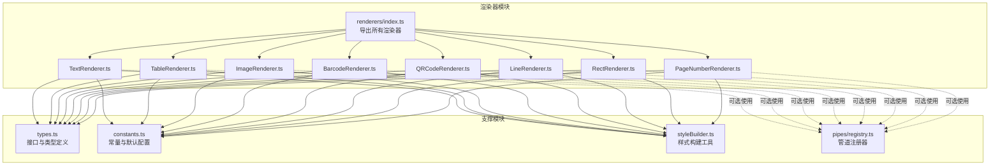

图表来源
- [renderers/index.ts:1-13](file://sdk/src/printEngine/renderers/index.ts#L1-L13)
- [TextRenderer.ts:1-60](file://sdk/src/printEngine/renderers/TextRenderer.ts#L1-L60)
- [TableRenderer.ts:1-275](file://sdk/src/printEngine/renderers/TableRenderer.ts#L1-L275)
- [ImageRenderer.ts:1-55](file://sdk/src/printEngine/renderers/ImageRenderer.ts#L1-L55)
- [BarcodeRenderer.ts:1-63](file://sdk/src/printEngine/renderers/BarcodeRenderer.ts#L1-L63)
- [QRCodeRenderer.ts:1-63](file://sdk/src/printEngine/renderers/QRCodeRenderer.ts#L1-L63)
- [LineRenderer.ts:1-59](file://sdk/src/printEngine/renderers/LineRenderer.ts#L1-L59)
- [RectRenderer.ts:1-39](file://sdk/src/printEngine/renderers/RectRenderer.ts#L1-L39)
- [PageNumberRenderer.ts:1-105](file://sdk/src/printEngine/renderers/PageNumberRenderer.ts#L1-L105)
- [types.ts:1-116](file://sdk/src/printEngine/types.ts#L1-L116)
- [constants.ts:1-113](file://sdk/src/printEngine/constants.ts#L1-L113)
- [styleBuilder.ts:1-54](file://sdk/src/printEngine/utils/styleBuilder.ts#L1-L54)
- [registry.ts:1-64](file://sdk/src/pipes/registry.ts#L1-L64)

章节来源
- [renderers/index.ts:1-13](file://sdk/src/printEngine/renderers/index.ts#L1-L13)

## 核心组件
本节概述各渲染器的核心职责与关键实现要点：
- 文本渲染器：支持标签前缀、flex 布局下的文本对齐、默认样式与尺寸回退。
- 表格渲染器：支持跨页分页数据、可见列过滤、表头/表体/合计行渲染、精度计算与溢出保护。
- 图片渲染器：严格按模板尺寸渲染，避免自适应导致排版错乱，支持占位提示。
- 条形码渲染器：基于浏览器同步生成 base64 图片，错误时返回占位图。
- 二维码渲染器：基于浏览器同步生成 base64 图片，错误时返回占位图。
- 线条渲染器：使用 border 实现水平/垂直线条，双层结构便于定位。
- 矩形渲染器：输出带边框与背景的矩形容器。
- 页码渲染器：支持 simple/text/slash 三种格式，注入当前页与总页数。

章节来源
- [TextRenderer.ts:10-60](file://sdk/src/printEngine/renderers/TextRenderer.ts#L10-L60)
- [TableRenderer.ts:11-275](file://sdk/src/printEngine/renderers/TableRenderer.ts#L11-L275)
- [ImageRenderer.ts:10-55](file://sdk/src/printEngine/renderers/ImageRenderer.ts#L10-L55)
- [BarcodeRenderer.ts:12-63](file://sdk/src/printEngine/renderers/BarcodeRenderer.ts#L12-L63)
- [QRCodeRenderer.ts:12-63](file://sdk/src/printEngine/renderers/QRCodeRenderer.ts#L12-L63)
- [LineRenderer.ts:10-59](file://sdk/src/printEngine/renderers/LineRenderer.ts#L10-L59)
- [RectRenderer.ts:10-39](file://sdk/src/printEngine/renderers/RectRenderer.ts#L10-L39)
- [PageNumberRenderer.ts:14-105](file://sdk/src/printEngine/renderers/PageNumberRenderer.ts#L14-L105)

## 架构总览
渲染器插件系统遵循“接口约束 + 工具函数 + 常量配置”的分层设计。渲染器通过统一的 ComponentRenderer 接口对外暴露能力；样式构建与定位通过工具函数完成；默认尺寸与样式通过常量模块集中管理；渲染上下文 RenderContext 提供数据解析、管道应用与页面信息等能力。

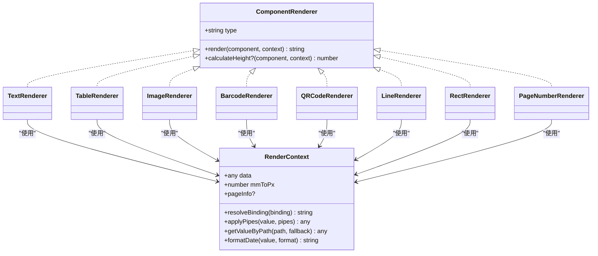

图表来源
- [types.ts:61-82](file://sdk/src/printEngine/types.ts#L61-L82)
- [TextRenderer.ts:10-60](file://sdk/src/printEngine/renderers/TextRenderer.ts#L10-L60)
- [TableRenderer.ts:11-275](file://sdk/src/printEngine/renderers/TableRenderer.ts#L11-L275)
- [ImageRenderer.ts:10-55](file://sdk/src/printEngine/renderers/ImageRenderer.ts#L10-L55)
- [BarcodeRenderer.ts:12-63](file://sdk/src/printEngine/renderers/BarcodeRenderer.ts#L12-L63)
- [QRCodeRenderer.ts:12-63](file://sdk/src/printEngine/renderers/QRCodeRenderer.ts#L12-L63)
- [LineRenderer.ts:10-59](file://sdk/src/printEngine/renderers/LineRenderer.ts#L10-L59)
- [RectRenderer.ts:10-39](file://sdk/src/printEngine/renderers/RectRenderer.ts#L10-L39)
- [PageNumberRenderer.ts:14-105](file://sdk/src/printEngine/renderers/PageNumberRenderer.ts#L14-L105)

## 详细组件分析

### 文本渲染器（TextRenderer）
- 设计要点
  - 支持 label 前缀与数据绑定，优先使用绑定值，其次使用 props.text。
  - 使用 flex 布局实现文本对齐，将 textAlign 映射为 justifyContent。
  - 默认尺寸与样式来自常量模块，定位样式通过 buildPositionStyle 生成。
- 关键流程

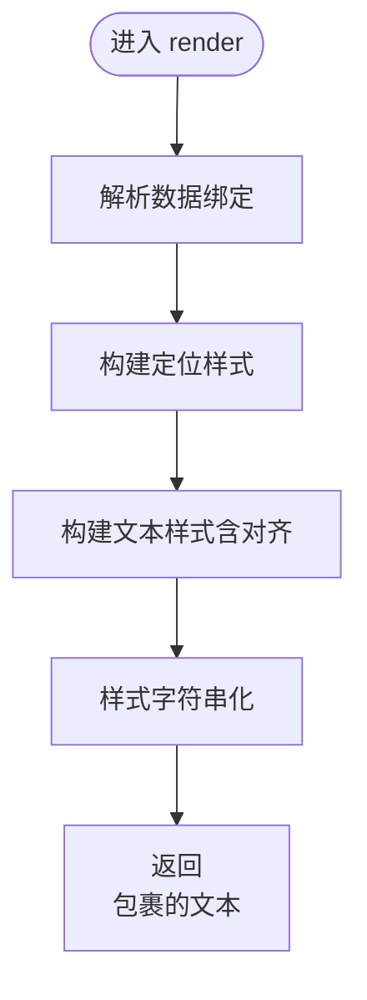

图表来源
- [TextRenderer.ts:13-53](file://sdk/src/printEngine/renderers/TextRenderer.ts#L13-L53)
- [styleBuilder.ts:31-53](file://sdk/src/printEngine/utils/styleBuilder.ts#L31-L53)
- [constants.ts:13-78](file://sdk/src/printEngine/constants.ts#L13-L78)

章节来源
- [TextRenderer.ts:10-60](file://sdk/src/printEngine/renderers/TextRenderer.ts#L10-L60)

### 表格渲染器（TableRenderer）
- 设计要点
  - 支持跨页分页数据（_pageData）与完整数据（binding.path），自动检测溢出并调整宽度。
  - 表头/表体/合计行三段式渲染，合计计算使用高精度 Decimal.js。
  - 行高与表头高度按 mm 计算并转换为 px，保证打印一致性。
- 关键流程

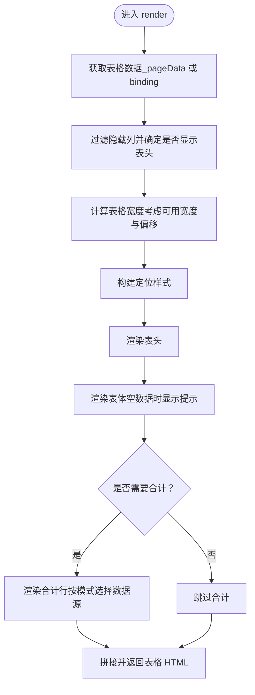

图表来源
- [TableRenderer.ts:14-151](file://sdk/src/printEngine/renderers/TableRenderer.ts#L14-L151)
- [styleBuilder.ts:31-53](file://sdk/src/printEngine/utils/styleBuilder.ts#L31-L53)
- [constants.ts:51-92](file://sdk/src/printEngine/constants.ts#L51-L92)

章节来源
- [TableRenderer.ts:11-275](file://sdk/src/printEngine/renderers/TableRenderer.ts#L11-L275)

### 图片渲染器（ImageRenderer）
- 设计要点
  - 优先使用绑定值作为图片源，其次使用 props.src。
  - 容器严格按模板尺寸渲染，内部 img 使用 object-fit 控制填充策略。
  - 无图片时返回占位提示，避免布局塌陷。
- 关键流程

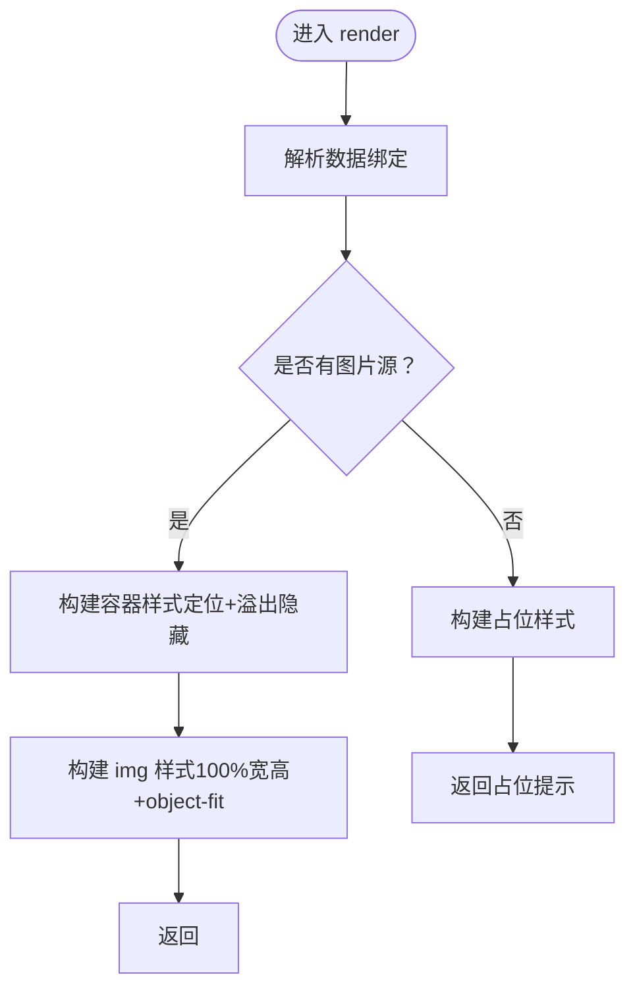

图表来源
- [ImageRenderer.ts:13-49](file://sdk/src/printEngine/renderers/ImageRenderer.ts#L13-L49)
- [styleBuilder.ts:31-53](file://sdk/src/printEngine/utils/styleBuilder.ts#L31-L53)
- [constants.ts:19-46](file://sdk/src/printEngine/constants.ts#L19-L46)

章节来源
- [ImageRenderer.ts:10-55](file://sdk/src/printEngine/renderers/ImageRenderer.ts#L10-L55)

### 条形码渲染器（BarcodeRenderer）
- 设计要点
  - 使用浏览器端同步生成 canvas，再转为 base64，直接嵌入 img 标签。
  - 错误时返回带边框的占位提示，便于调试。
  - 宽高与格式通过 props 与常量控制。
- 关键流程

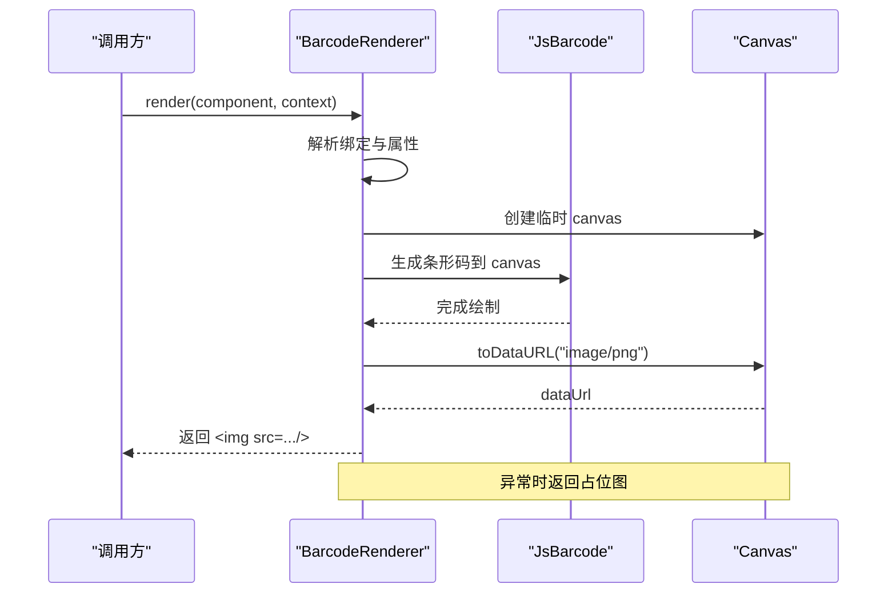

图表来源
- [BarcodeRenderer.ts:15-57](file://sdk/src/printEngine/renderers/BarcodeRenderer.ts#L15-L57)
- [constants.ts:95-104](file://sdk/src/printEngine/constants.ts#L95-L104)

章节来源
- [BarcodeRenderer.ts:12-63](file://sdk/src/printEngine/renderers/BarcodeRenderer.ts#L12-L63)

### 二维码渲染器（QRCodeRenderer）
- 设计要点
  - 使用浏览器端同步生成 canvas，再转为 base64，直接嵌入 img 标签。
  - 错误时返回带边框的占位提示，便于调试。
  - 尺寸与内容通过 props 与常量控制。
- 关键流程

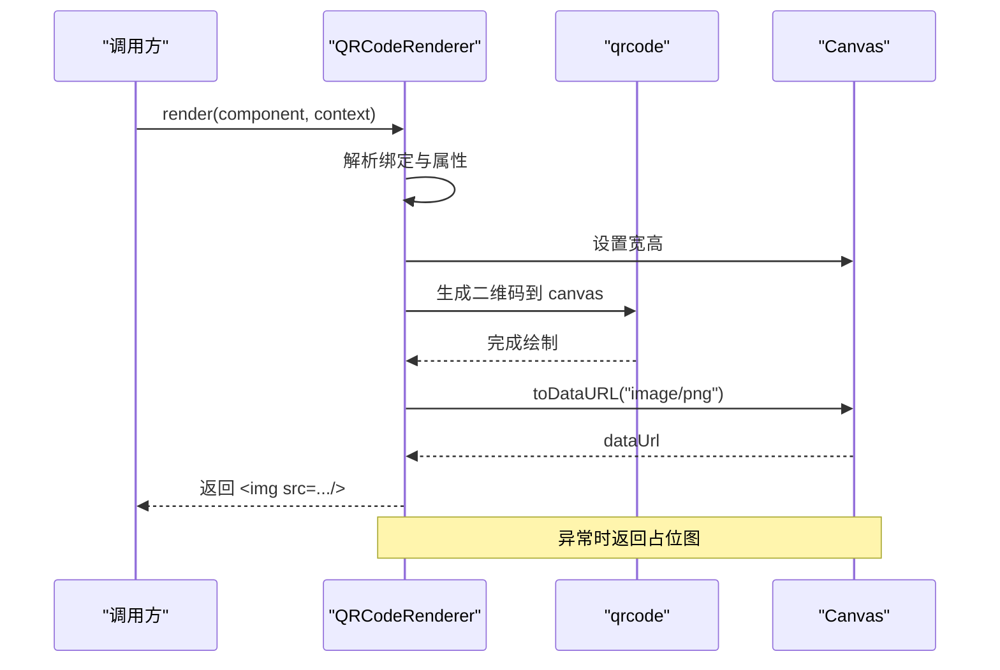

图表来源
- [QRCodeRenderer.ts:15-57](file://sdk/src/printEngine/renderers/QRCodeRenderer.ts#L15-L57)
- [constants.ts:107-113](file://sdk/src/printEngine/constants.ts#L107-L113)

章节来源
- [QRCodeRenderer.ts:12-63](file://sdk/src/printEngine/renderers/QRCodeRenderer.ts#L12-L63)

### 线条渲染器（LineRenderer）
- 设计要点
  - 使用 border 实现水平/垂直线条，外层容器使用 flex 居中，确保定位准确。
  - 双层结构（容器 + 线条）使 calculateHeight 返回外层容器高度。
- 关键流程

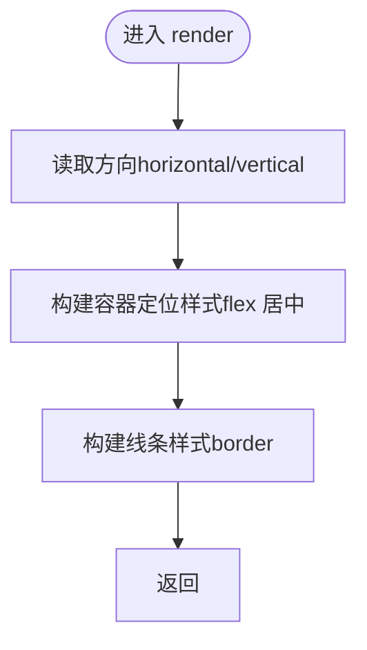

图表来源
- [LineRenderer.ts:13-51](file://sdk/src/printEngine/renderers/LineRenderer.ts#L13-L51)
- [styleBuilder.ts:31-53](file://sdk/src/printEngine/utils/styleBuilder.ts#L31-L53)
- [constants.ts:29-32](file://sdk/src/printEngine/constants.ts#L29-L32)

章节来源
- [LineRenderer.ts:10-59](file://sdk/src/printEngine/renderers/LineRenderer.ts#L10-L59)

### 矩形渲染器（RectRenderer）
- 设计要点
  - 输出纯容器，样式由边框与背景组合，定位严格按模板尺寸。
- 关键流程

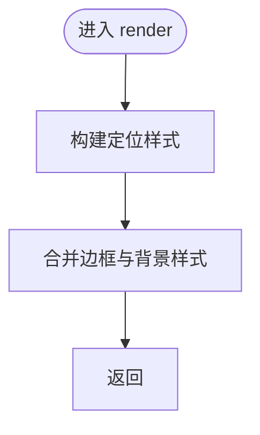

图表来源
- [RectRenderer.ts:13-33](file://sdk/src/printEngine/renderers/RectRenderer.ts#L13-L33)
- [styleBuilder.ts:31-53](file://sdk/src/printEngine/utils/styleBuilder.ts#L31-L53)
- [constants.ts:24-27](file://sdk/src/printEngine/constants.ts#L24-L27)

章节来源
- [RectRenderer.ts:10-39](file://sdk/src/printEngine/renderers/RectRenderer.ts#L10-L39)

### 页码渲染器（PageNumberRenderer）
- 设计要点
  - 从 props 注入当前页与总页数，支持 simple/text/slash 三种格式。
  - 文本对齐与字体样式来自 props 与默认值，使用 HTML 转义防止注入。
- 关键流程

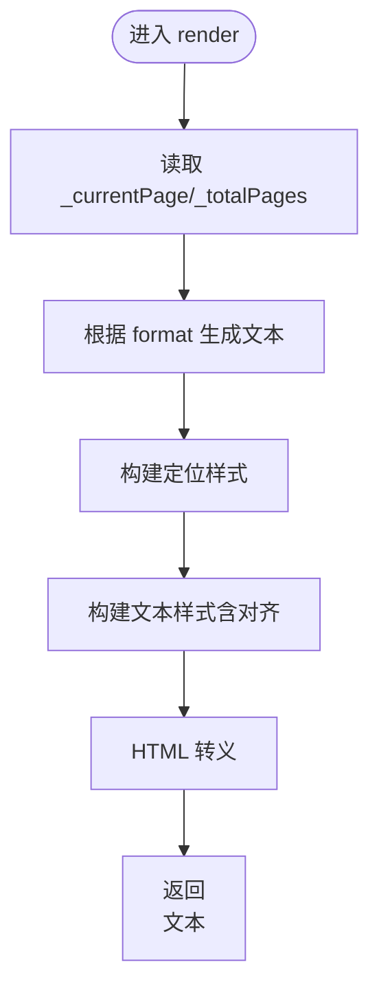

图表来源
- [PageNumberRenderer.ts:17-104](file://sdk/src/printEngine/renderers/PageNumberRenderer.ts#L17-L104)
- [styleBuilder.ts:31-53](file://sdk/src/printEngine/utils/styleBuilder.ts#L31-L53)
- [constants.ts:63-78](file://sdk/src/printEngine/constants.ts#L63-L78)

章节来源
- [PageNumberRenderer.ts:14-105](file://sdk/src/printEngine/renderers/PageNumberRenderer.ts#L14-L105)

## 依赖关系分析
- 渲染器与工具函数
  - 所有渲染器均依赖样式构建工具（buildStyleString、buildPositionStyle）以生成 CSS 字符串与定位样式。
- 渲染器与常量配置
  - 默认尺寸、表格默认值、样式默认值、条码/二维码配置均来自 constants 模块。
- 渲染器与渲染上下文
  - 渲染器通过 RenderContext 获取业务数据、解析绑定、应用管道、格式化日期与页面信息。
- 管道注册器（与渲染器的关系）
  - 管道注册器负责管理管道执行器，渲染器可通过 RenderContext.applyPipes 应用管道转换（如需）。

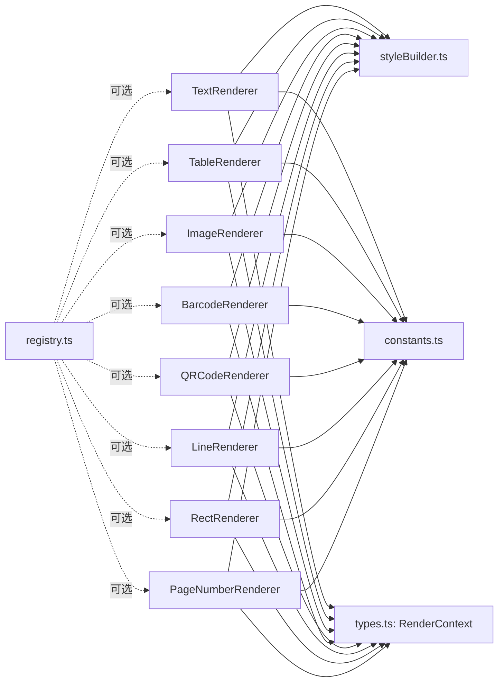

图表来源
- [TextRenderer.ts:7-8](file://sdk/src/printEngine/renderers/TextRenderer.ts#L7-L8)
- [TableRenderer.ts:8-9](file://sdk/src/printEngine/renderers/TableRenderer.ts#L8-L9)
- [ImageRenderer.ts:7-8](file://sdk/src/printEngine/renderers/ImageRenderer.ts#L7-L8)
- [BarcodeRenderer.ts:9-10](file://sdk/src/printEngine/renderers/BarcodeRenderer.ts#L9-L10)
- [QRCodeRenderer.ts:9-10](file://sdk/src/printEngine/renderers/QRCodeRenderer.ts#L9-L10)
- [LineRenderer.ts:7-8](file://sdk/src/printEngine/renderers/LineRenderer.ts#L7-L8)
- [RectRenderer.ts:7-8](file://sdk/src/printEngine/renderers/RectRenderer.ts#L7-L8)
- [PageNumberRenderer.ts:11-12](file://sdk/src/printEngine/renderers/PageNumberRenderer.ts#L11-L12)
- [styleBuilder.ts:1-54](file://sdk/src/printEngine/utils/styleBuilder.ts#L1-L54)
- [constants.ts:1-113](file://sdk/src/printEngine/constants.ts#L1-L113)
- [types.ts:11-55](file://sdk/src/printEngine/types.ts#L11-L55)
- [registry.ts:1-64](file://sdk/src/pipes/registry.ts#L1-L64)

章节来源
- [types.ts:11-82](file://sdk/src/printEngine/types.ts#L11-L82)
- [constants.ts:1-113](file://sdk/src/printEngine/constants.ts#L1-L113)
- [styleBuilder.ts:1-54](file://sdk/src/printEngine/utils/styleBuilder.ts#L1-L54)
- [registry.ts:1-64](file://sdk/src/pipes/registry.ts#L1-L64)

## 性能考量
- 样式构建
  - buildStyleString 与 buildPositionStyle 为 O(n) 的字符串拼接，n 为样式键数量，开销极低。
- 表格渲染
  - 表头/表体/合计行三段式渲染，合计计算使用 Decimal.js 保证精度，但会带来额外的数值处理成本。
- 二维码/条形码
  - 浏览器端同步生成 canvas 并转为 base64，CPU 密集型操作，建议在空闲时段或批量渲染时进行。
- 定位与尺寸
  - 所有尺寸以 mm 为单位，通过 mmToPx 转换为 px，减少浮点误差累积。

## 故障排查指南
- 表格宽度溢出
  - 现象：控制台警告并自动调整宽度。
  - 处理：检查布局 xMm 与 widthMm，确保不超过可用宽度。
- 二维码/条形码生成失败
  - 现象：返回占位图并记录错误日志。
  - 处理：确认内容非空、格式正确，检查网络与浏览器兼容性。
- 图片为空
  - 现象：显示“暂无图片”占位提示。
  - 处理：检查绑定路径与 src，确保资源可访问。
- 文本对齐异常
  - 现象：flex 对齐与预期不符。
  - 处理：确认 textAlign 与 justifyContent 的映射逻辑，必要时在 props 中显式指定。

章节来源
- [TableRenderer.ts:48-55](file://sdk/src/printEngine/renderers/TableRenderer.ts#L48-L55)
- [BarcodeRenderer.ts:52-56](file://sdk/src/printEngine/renderers/BarcodeRenderer.ts#L52-L56)
- [QRCodeRenderer.ts:52-56](file://sdk/src/printEngine/renderers/QRCodeRenderer.ts#L52-L56)
- [ImageRenderer.ts:43-48](file://sdk/src/printEngine/renderers/ImageRenderer.ts#L43-L48)
- [TextRenderer.ts:32-48](file://sdk/src/printEngine/renderers/TextRenderer.ts#L32-L48)

## 结论
渲染器插件系统通过清晰的接口约束、统一的工具函数与常量配置，实现了高内聚、低耦合的组件化渲染能力。各渲染器在保持一致的 API 行为的同时，针对不同组件特性提供了定制化的实现策略。结合 RenderContext 的数据与管道能力，系统能够灵活应对多样化的打印场景。

## 附录

### 渲染器接口设计规范
- 接口名称：ComponentRenderer
- 必备属性
  - type: string（组件类型标识）
- 必备方法
  - render(component, context): string（将组件渲染为 HTML 字符串）
- 可选方法
  - calculateHeight?(component, context): number（返回组件高度，单位 mm，用于分页）

章节来源
- [types.ts:61-82](file://sdk/src/printEngine/types.ts#L61-L82)

### 渲染上下文（RenderContext）能力
- 数据与绑定
  - data: any（业务数据根）
  - resolveBinding(binding): string（解析数据绑定）
  - getValueByPath(path, fallback): any（按路径取值）
- 管道与格式化
  - applyPipes(value, pipes): any（应用管道转换）
  - formatDate(value, format): string（格式化日期）
- 环境信息
  - mmToPx: number（mm 到 px 的换算系数）
  - pageInfo?: { widthMm, heightMm, marginMm }（页面信息）

章节来源
- [types.ts:11-55](file://sdk/src/printEngine/types.ts#L11-L55)

### 渲染器注册机制与生命周期
- 注册器模式
  - 通过 renderers/index.ts 统一导出所有渲染器，便于上层按类型查找与实例化。
  - 管道注册器（registry.ts）展示了注册器模式的通用实践：Map 存储、动态注册、按类型检索与执行。
- 生命周期
  - 渲染器生命周期由调用方控制：初始化后重复调用 render/calculateHeight，无需手动销毁。
  - 若需扩展新渲染器，遵循 ComponentRenderer 接口即可无缝接入。

章节来源
- [renderers/index.ts:5-12](file://sdk/src/printEngine/renderers/index.ts#L5-L12)
- [registry.ts:12-52](file://sdk/src/pipes/registry.ts#L12-L52)

### 自定义渲染器开发指南
- 步骤
  - 实现 ComponentRenderer 接口（type、render、可选 calculateHeight）。
  - 使用 styleBuilder 构建样式，使用 constants 提供的默认值。
  - 在 renderers/index.ts 中导出新渲染器，确保被统一注册。
  - 在设计器预览组件中提供对应 Preview（参考现有 TextPreview/BarcodePreview/ImagePreview/LinePreview/QRCodePreview）。
- 测试方法
  - 单元测试：构造 ComponentNode 与 RenderContext，断言输出 HTML 结构与样式片段。
  - 集成测试：在模板中放置自定义组件，验证渲染结果与分页行为。
- 集成示例
  - 在设计器 Canvas 中添加自定义组件节点，预览与渲染应一致。
  - 如需管道转换，可在 RenderContext.applyPipes 中配置相应管道。

章节来源
- [TextRenderer.ts:10-60](file://sdk/src/printEngine/renderers/TextRenderer.ts#L10-L60)
- [TextPreview.tsx:10-31](file://designer/src/pages/Designer/components/Canvas/componentRenderers/TextPreview.tsx#L10-L31)
- [BarcodePreview.tsx:11-26](file://designer/src/pages/Designer/components/Canvas/componentRenderers/BarcodePreview.tsx#L11-L26)
- [ImagePreview.tsx:10-34](file://designer/src/pages/Designer/components/Canvas/componentRenderers/ImagePreview.tsx#L10-L34)
- [LinePreview.tsx:10-31](file://designer/src/pages/Designer/components/Canvas/componentRenderers/LinePreview.tsx#L10-L31)
- [QRCodePreview.tsx:11-17](file://designer/src/pages/Designer/components/Canvas/componentRenderers/QRCodePreview.tsx#L11-L17)