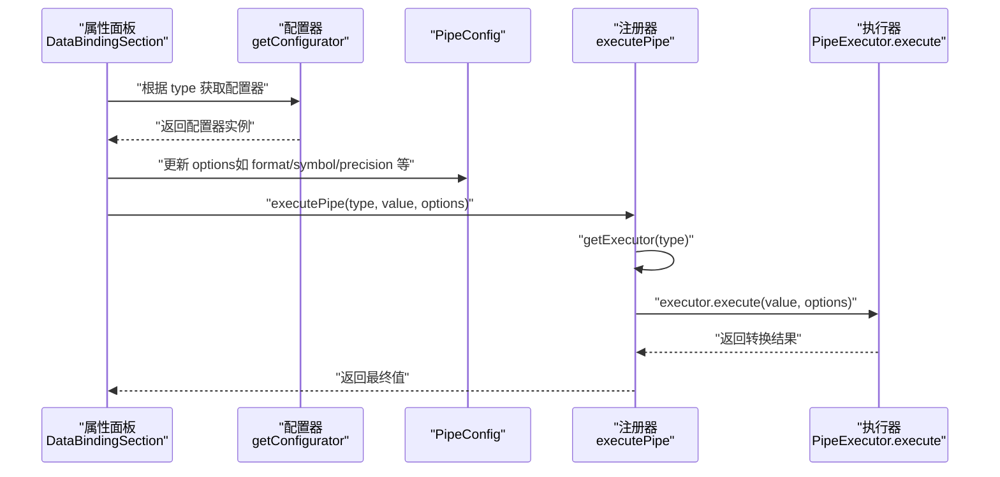
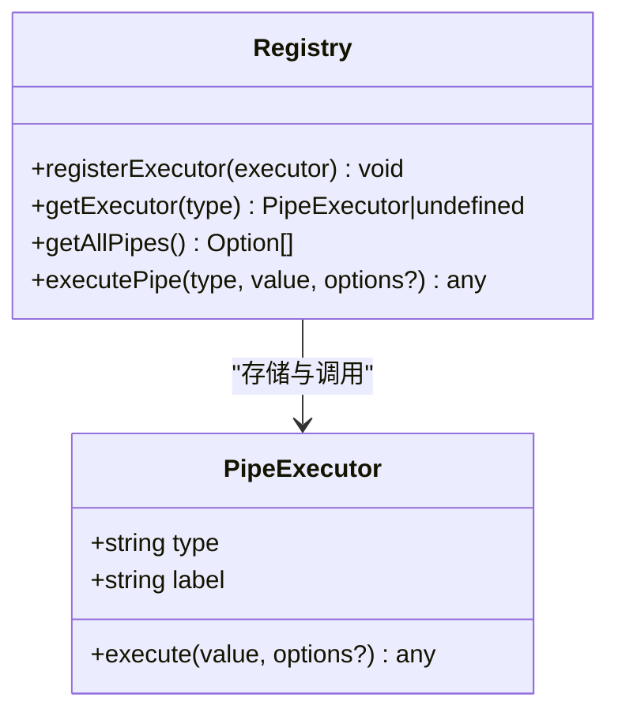
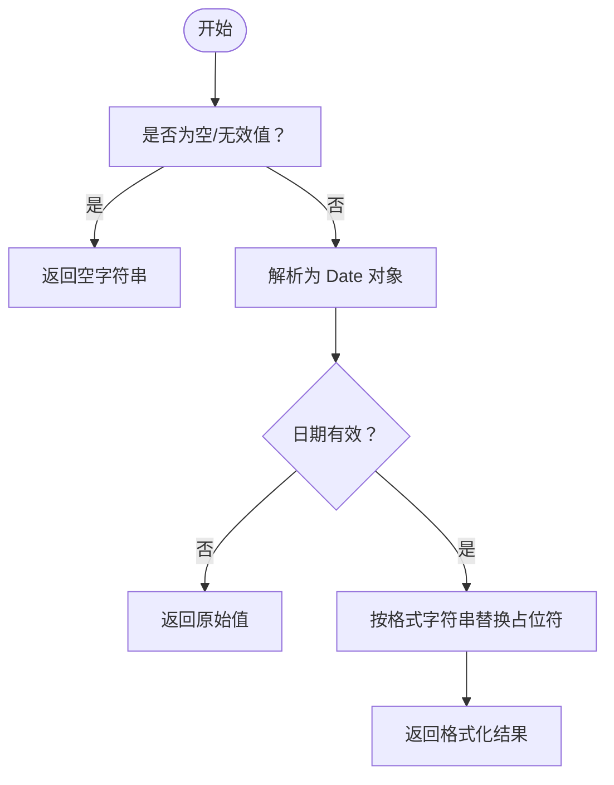
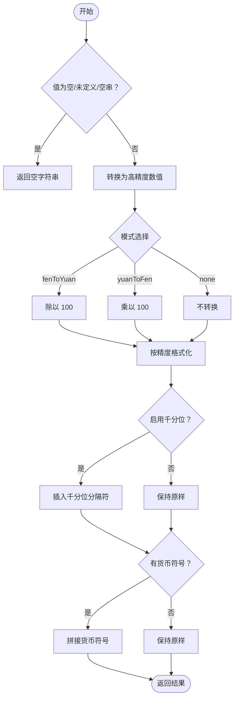
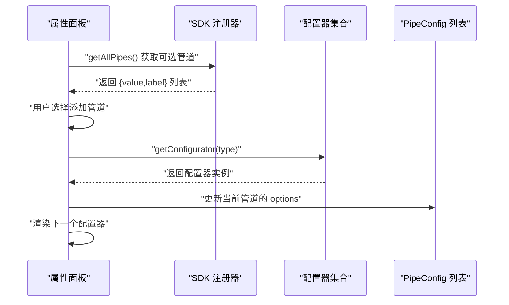
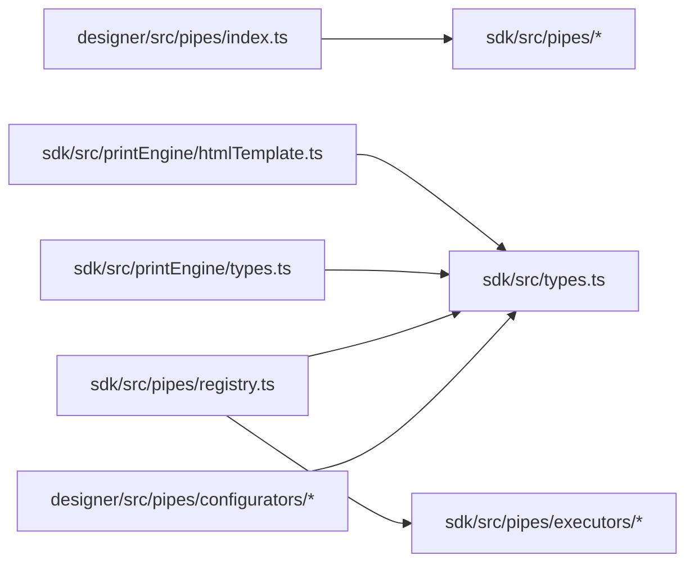

# 管道系统

<cite>
**本文引用的文件**
- [sdk/src/pipes/index.ts](file://sdk/src/pipes/index.ts)
- [sdk/src/pipes/types.ts](file://sdk/src/pipes/types.ts)
- [sdk/src/pipes/registry.ts](file://sdk/src/pipes/registry.ts)
- [sdk/src/pipes/executors/index.ts](file://sdk/src/pipes/executors/index.ts)
- [sdk/src/pipes/executors/DatePipe.ts](file://sdk/src/pipes/executors/DatePipe.ts)
- [sdk/src/pipes/executors/CurrencyPipe.ts](file://sdk/src/pipes/executors/CurrencyPipe.ts)
- [sdk/src/pipes/executors/MoneyPipe.ts](file://sdk/src/pipes/executors/MoneyPipe.ts)
- [designer/src/pipes/index.ts](file://designer/src/pipes/index.ts)
- [designer/src/pipes/configurators/index.tsx](file://designer/src/pipes/configurators/index.tsx)
- [designer/src/pipes/configurators/DatePipeConfigurator.tsx](file://designer/src/pipes/configurators/DatePipeConfigurator.tsx)
- [designer/src/pipes/configurators/CurrencyPipeConfigurator.tsx](file://designer/src/pipes/configurators/CurrencyPipeConfigurator.tsx)
- [designer/src/pipes/configurators/MoneyPipeConfigurator.tsx](file://designer/src/pipes/configurators/MoneyPipeConfigurator.tsx)
- [sdk/src/types.ts](file://sdk/src/types.ts)
- [sdk/src/printEngine/types.ts](file://sdk/src/printEngine/types.ts)
- [sdk/src/printEngine/htmlTemplate.ts](file://sdk/src/printEngine/htmlTemplate.ts)
- [designer/src/pages/Designer/components/PropertyPanel/DataBindingSection.tsx](file://designer/src/pages/Designer/components/PropertyPanel/DataBindingSection.tsx)
</cite>

## 目录
1. [简介](#简介)
2. [项目结构](#项目结构)
3. [核心组件](#核心组件)
4. [架构总览](#架构总览)
5. [详细组件分析](#详细组件分析)
6. [依赖分析](#依赖分析)
7. [性能考虑](#性能考虑)
8. [故障排查指南](#故障排查指南)
9. [结论](#结论)
10. [附录](#附录)

## 简介
本文件系统性地介绍“管道系统”的设计与实现，涵盖注册器模式与执行器模式的应用；详解内置执行器（DatePipe、CurrencyPipe、MoneyPipe 等）的设计原理与行为；阐述管道注册机制（执行器注册流程、参数校验与错误处理）；介绍管道配置系统（管道链组合、参数传递与执行顺序控制）；并提供自定义管道开发指南（接口实现、注册方法与测试策略），以及性能优化与最佳实践建议。

## 项目结构
管道系统由两部分组成：
- SDK 端（后端/通用能力）：定义类型、注册器、执行器集合与内置执行器。
- Designer 端（前端 UI）：提供管道配置器（UI 组件），负责可视化配置与参数收集，并通过 SDK 的注册器与执行器完成实际转换。

```mermaid
graph TB
subgraph "SDK 管道模块"
PIdx["sdk/src/pipes/index.ts"]
PTypes["sdk/src/pipes/types.ts"]
PReg["sdk/src/pipes/registry.ts"]
PExecIdx["sdk/src/pipes/executors/index.ts"]
PExecDate["sdk/src/pipes/executors/DatePipe.ts"]
PExecCur["sdk/src/pipes/executors/CurrencyPipe.ts"]
PExecMon["sdk/src/pipes/executors/MoneyPipe.ts"]
end
subgraph "Designer 管道模块"
DIdx["designer/src/pipes/index.ts"]
DConfIdx["designer/src/pipes/configurators/index.tsx"]
DConfDate["designer/src/pipes/configurators/DatePipeConfigurator.tsx"]
DConfCur["designer/src/pipes/configurators/CurrencyPipeConfigurator.tsx"]
DConfMon["designer/src/pipes/configurators/MoneyPipeConfigurator.tsx"]
end
subgraph "类型与渲染上下文"
STypes["sdk/src/types.ts"]
SPrintTypes["sdk/src/printEngine/types.ts"]
SHtmlTpl["sdk/src/printEngine/htmlTemplate.ts"]
end
DIdx --> PIdx
DConfIdx --> DConfDate
DConfIdx --> DConfCur
DConfIdx --> DConfMon
PReg --> PExecIdx
PExecIdx --> PExecDate
PExecIdx --> PExecCur
PExecIdx --> PExecMon
DConfIdx --> STypes
PReg --> STypes
SPrintTypes --> STypes
SHtmlTpl --> STypes
```

图表来源
- [sdk/src/pipes/index.ts:1-9](file://sdk/src/pipes/index.ts#L1-L9)
- [sdk/src/pipes/registry.ts:1-64](file://sdk/src/pipes/registry.ts#L1-L64)
- [sdk/src/pipes/executors/index.ts:1-44](file://sdk/src/pipes/executors/index.ts#L1-L44)
- [sdk/src/pipes/executors/DatePipe.ts:1-35](file://sdk/src/pipes/executors/DatePipe.ts#L1-L35)
- [sdk/src/pipes/executors/CurrencyPipe.ts:1-17](file://sdk/src/pipes/executors/CurrencyPipe.ts#L1-L17)
- [sdk/src/pipes/executors/MoneyPipe.ts:1-62](file://sdk/src/pipes/executors/MoneyPipe.ts#L1-L62)
- [designer/src/pipes/index.ts:1-11](file://designer/src/pipes/index.ts#L1-L11)
- [designer/src/pipes/configurators/index.tsx:1-83](file://designer/src/pipes/configurators/index.tsx#L1-L83)
- [sdk/src/types.ts:66-75](file://sdk/src/types.ts#L66-L75)
- [sdk/src/printEngine/types.ts:11-55](file://sdk/src/printEngine/types.ts#L11-L55)
- [sdk/src/printEngine/htmlTemplate.ts:1-274](file://sdk/src/printEngine/htmlTemplate.ts#L1-L274)

章节来源
- [sdk/src/pipes/index.ts:1-9](file://sdk/src/pipes/index.ts#L1-L9)
- [designer/src/pipes/index.ts:1-11](file://designer/src/pipes/index.ts#L1-L11)

## 核心组件
- 管道执行器接口（PipeExecutor）：统一定义 type、label 与 execute 方法，确保所有执行器具备一致的调用契约。
- 管道注册器（registry）：提供注册、查询、遍历与执行能力；内置初始化时注册全部内置执行器。
- 执行器集合（executors）：集中导出内置执行器，并提供若干简单执行器（如大小写、截取、默认值）。
- 配置器（configurators）：UI 层的配置界面，负责渲染每个管道的参数输入控件，并将变更回调回写到 PipeConfig。
- 类型系统（types）：定义 PipeConfig、DataBinding、ComponentNode 等关键类型，支撑管道链与数据绑定。
- 渲染上下文（RenderContext）：打印引擎向渲染器暴露的公共能力，其中包含应用管道链的方法。

章节来源
- [sdk/src/pipes/types.ts:11-29](file://sdk/src/pipes/types.ts#L11-L29)
- [sdk/src/pipes/registry.ts:12-52](file://sdk/src/pipes/registry.ts#L12-L52)
- [sdk/src/pipes/executors/index.ts:6-44](file://sdk/src/pipes/executors/index.ts#L6-L44)
- [designer/src/pipes/configurators/index.tsx:16-82](file://designer/src/pipes/configurators/index.tsx#L16-L82)
- [sdk/src/types.ts:66-75](file://sdk/src/types.ts#L66-L75)
- [sdk/src/printEngine/types.ts:11-26](file://sdk/src/printEngine/types.ts#L11-L26)

## 架构总览
管道系统采用“注册器模式 + 执行器模式”：
- 注册器模式：集中维护执行器映射表，提供注册、查询与遍历能力；支持在应用启动时批量注册内置执行器。
- 执行器模式：每个执行器实现统一接口，负责具体的数据转换逻辑；执行器之间解耦，便于扩展与替换。
- 配置器模式：UI 层通过配置器渲染参数控件，将用户输入写回到 PipeConfig，形成可序列化的管道链。
- 打印引擎集成：渲染上下文提供 applyPipes 方法，按顺序对数据进行链式转换。

图表来源
- [designer/src/pages/Designer/components/PropertyPanel/DataBindingSection.tsx:20-127](file://designer/src/pages/Designer/components/PropertyPanel/DataBindingSection.tsx#L20-L127)
- [designer/src/pipes/configurators/index.tsx:70-82](file://designer/src/pipes/configurators/index.tsx#L70-L82)
- [sdk/src/pipes/registry.ts:45-52](file://sdk/src/pipes/registry.ts#L45-L52)
- [sdk/src/pipes/types.ts:11-29](file://sdk/src/pipes/types.ts#L11-L29)

## 详细组件分析

### 管道执行器接口与注册器
- 接口职责：type（唯一标识）、label（展示名称）、execute（转换逻辑）。
- 注册器职责：Map 存储执行器；提供注册、查询、遍历（用于 UI 下拉）、执行（带兜底）。
- 初始化注册：在注册器文件末尾集中注册所有内置执行器，保证系统启动即可用。

图表来源
- [sdk/src/pipes/types.ts:11-29](file://sdk/src/pipes/types.ts#L11-L29)
- [sdk/src/pipes/registry.ts:12-52](file://sdk/src/pipes/registry.ts#L12-L52)

章节来源
- [sdk/src/pipes/types.ts:11-29](file://sdk/src/pipes/types.ts#L11-L29)
- [sdk/src/pipes/registry.ts:12-52](file://sdk/src/pipes/registry.ts#L12-L52)

### 内置执行器：DatePipe
- 功能：将输入值解析为日期，按格式字符串替换占位符（如 YYYY、MM、DD、HH、mm、ss）输出。
- 参数：format（默认格式）。
- 错误处理：空值返回空字符串；非法日期保持原值；非法格式按替换规则输出。

图表来源
- [sdk/src/pipes/executors/DatePipe.ts:11-34](file://sdk/src/pipes/executors/DatePipe.ts#L11-L34)

章节来源
- [sdk/src/pipes/executors/DatePipe.ts:7-34](file://sdk/src/pipes/executors/DatePipe.ts#L7-L34)

### 内置执行器：CurrencyPipe
- 功能：货币格式化，支持货币符号与精度。
- 参数：symbol（默认货币符号）、precision（默认精度）。
- 行为：数值为空或非数字时按默认值处理；最终以指定精度格式化。

章节来源
- [sdk/src/pipes/executors/CurrencyPipe.ts:7-16](file://sdk/src/pipes/executors/CurrencyPipe.ts#L7-L16)

### 内置执行器：MoneyPipe
- 功能：金额转换与格式化，支持分转元、元转分、千分位分隔与货币符号。
- 参数：mode（默认分转元）、precision（默认精度）、symbol（货币符号）、separator（千分位开关）。
- 处理流程：使用高精度库进行计算；根据模式切换；格式化后按需加千分位与货币符号；异常时回退为原始值。

图表来源
- [sdk/src/pipes/executors/MoneyPipe.ts:13-61](file://sdk/src/pipes/executors/MoneyPipe.ts#L13-L61)

章节来源
- [sdk/src/pipes/executors/MoneyPipe.ts:9-61](file://sdk/src/pipes/executors/MoneyPipe.ts#L9-L61)

### 管道配置系统与 UI 配置器
- PipeConfig：包含 type 与 options，描述单个管道及其参数。
- DataBinding：包含字段路径、管道链数组与回退值。
- UI 配置器：根据管道类型渲染对应参数控件（如日期格式、货币符号、金额模式、精度、千分位等），并将变更写回 PipeConfig。
- 管道链组合：在属性面板中，用户通过下拉选择添加多个管道，每个管道拥有独立配置；渲染时按顺序依次执行。

图表来源
- [designer/src/pages/Designer/components/PropertyPanel/DataBindingSection.tsx:20-127](file://designer/src/pages/Designer/components/PropertyPanel/DataBindingSection.tsx#L20-L127)
- [designer/src/pipes/configurators/index.tsx:68-82](file://designer/src/pipes/configurators/index.tsx#L68-L82)
- [sdk/src/pipes/registry.ts:31-40](file://sdk/src/pipes/registry.ts#L31-L40)

章节来源
- [sdk/src/types.ts:66-75](file://sdk/src/types.ts#L66-L75)
- [designer/src/pipes/configurators/index.tsx:16-82](file://designer/src/pipes/configurators/index.tsx#L16-L82)
- [designer/src/pages/Designer/components/PropertyPanel/DataBindingSection.tsx:20-127](file://designer/src/pages/Designer/components/PropertyPanel/DataBindingSection.tsx#L20-L127)

### 渲染上下文中的管道应用
- RenderContext.applyPipes：接收原始值与管道链，按顺序调用 executePipe，前一个结果作为下一个管道的输入。
- 与 PrintEngine 集成：渲染器在生成组件内容前，先通过 applyPipes 完成数据格式化，再继续布局与绘制。

章节来源
- [sdk/src/printEngine/types.ts:25](file://sdk/src/printEngine/types.ts#L25)
- [sdk/src/printEngine/types.ts:11-26](file://sdk/src/printEngine/types.ts#L11-L26)

## 依赖分析
- 设计耦合：
  - Designer 仅依赖 SDK 的类型与执行器，不直接实现执行器逻辑，降低耦合。
  - 配置器与执行器通过 type 关联，遵循“类型即契约”的约定。
- 运行时依赖：
  - MoneyPipe 依赖高精度计算库；DatePipe 依赖浏览器原生 Date；CurrencyPipe 依赖数值格式化。
- 循环依赖：
  - 注册器在初始化阶段注册执行器，属于一次性静态初始化，不存在运行时循环依赖风险。

图表来源
- [designer/src/pipes/index.ts:6-7](file://designer/src/pipes/index.ts#L6-L7)
- [sdk/src/pipes/registry.ts:6-7](file://sdk/src/pipes/registry.ts#L6-L7)
- [sdk/src/printEngine/types.ts:5](file://sdk/src/printEngine/types.ts#L5)
- [sdk/src/printEngine/htmlTemplate.ts:6](file://sdk/src/printEngine/htmlTemplate.ts#L6)

章节来源
- [designer/src/pipes/index.ts:6-7](file://designer/src/pipes/index.ts#L6-L7)
- [sdk/src/pipes/registry.ts:6-7](file://sdk/src/pipes/registry.ts#L6-L7)
- [sdk/src/printEngine/types.ts:5](file://sdk/src/printEngine/types.ts#L5)
- [sdk/src/printEngine/htmlTemplate.ts:6](file://sdk/src/printEngine/htmlTemplate.ts#L6)

## 性能考虑
- 执行器幂等与轻量：内置执行器尽量保持纯函数式与无副作用，避免频繁创建对象，减少 GC 压力。
- 高精度计算：MoneyPipe 使用高精度库，避免浮点误差，但注意其开销高于普通数值运算；仅在需要精确金额计算时启用。
- 日期格式化：DatePipe 采用字符串替换，复杂度低；若需国际化或复杂格式，建议在上层做缓存或预编译格式。
- 管道链长度：过长的管道链会增加多次字符串与数值转换成本；建议合并相近功能或在上层做批处理。
- UI 渲染节流：配置器在频繁变更时可通过防抖减少不必要的重渲染（可在上层实现）。
- 缓存策略：对于重复的格式化结果（如固定格式的日期），可在业务层引入缓存以降低重复计算。

## 故障排查指南
- 执行器未找到：
  - 现象：executePipe 返回原始值并输出警告日志。
  - 排查：确认执行器是否已注册；检查 type 是否正确；确认注册器初始化是否在使用前完成。
- 日期格式化异常：
  - 现象：非法日期返回原始值或格式化失败。
  - 排查：确认输入值可被解析为有效日期；检查 format 字符串是否包含合法占位符。
- 货币/金额格式化异常：
  - 现象：异常时回退为原始值。
  - 排查：确认数值可转换为高精度数；检查 mode 与 precision 合法范围；确认千分位与货币符号设置。
- UI 配置器不生效：
  - 现象：添加管道后无法渲染配置控件。
  - 排查：确认 type 与配置器注册表匹配；确认配置器集合已注册对应类型。

章节来源
- [sdk/src/pipes/registry.ts:45-52](file://sdk/src/pipes/registry.ts#L45-L52)
- [sdk/src/pipes/executors/DatePipe.ts:11-34](file://sdk/src/pipes/executors/DatePipe.ts#L11-L34)
- [sdk/src/pipes/executors/MoneyPipe.ts:56-61](file://sdk/src/pipes/executors/MoneyPipe.ts#L56-L61)
- [designer/src/pipes/configurators/index.tsx:70-82](file://designer/src/pipes/configurators/index.tsx#L70-L82)

## 结论
该管道系统通过注册器模式与执行器模式实现了清晰的职责分离与良好的扩展性；UI 配置器与执行器解耦，既保证了易用性又便于维护；内置执行器覆盖常用格式化需求，并提供高精度金额处理能力。结合渲染上下文的管道链应用，系统能够稳定地完成数据格式化与展示准备。

## 附录

### 自定义管道开发指南
- 实现执行器接口：
  - 定义 type（唯一标识）、label（展示名称）、execute（转换逻辑）。
  - 在执行器文件中导出常量实例。
- 注册执行器：
  - 在注册器中调用 registerExecutor 注册；或在初始化段落集中注册，确保系统启动即可用。
- 参数与错误处理：
  - 明确 options 的键与默认值；对空值、非法值进行显式处理并给出合理回退。
- UI 配置器：
  - 在配置器集合中新增类型与渲染控件；将用户输入写回 PipeConfig.options。
- 测试策略：
  - 单元测试：覆盖正常路径、边界值与异常路径；对 MoneyPipe 的高精度路径进行重点测试。
  - 集成测试：在渲染上下文中构造管道链，验证顺序与结果。
  - 回归测试：新增执行器后，确保 getAllPipes 与 executePipe 正常工作。

章节来源
- [sdk/src/pipes/types.ts:11-29](file://sdk/src/pipes/types.ts#L11-L29)
- [sdk/src/pipes/registry.ts:17-19](file://sdk/src/pipes/registry.ts#L17-L19)
- [sdk/src/pipes/registry.ts:54-63](file://sdk/src/pipes/registry.ts#L54-L63)
- [designer/src/pipes/configurators/index.tsx:68-82](file://designer/src/pipes/configurators/index.tsx#L68-L82)