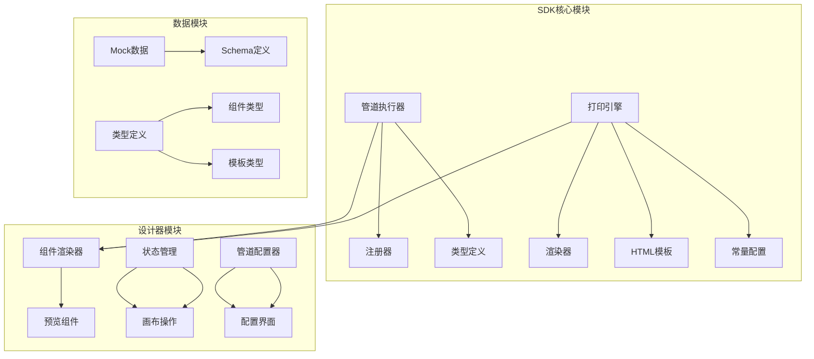
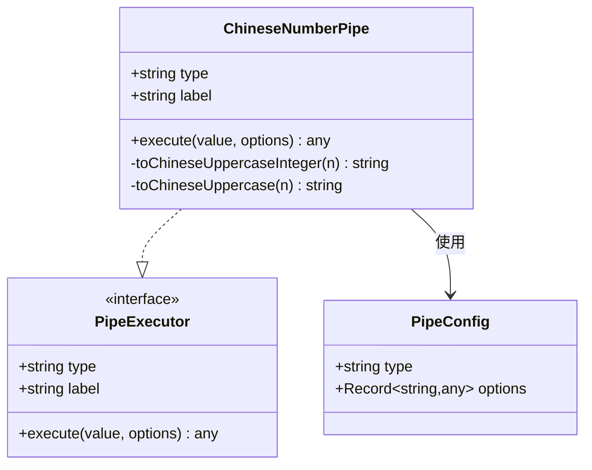
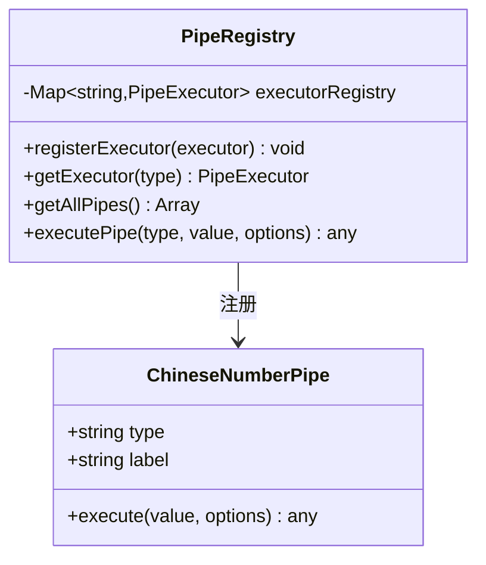
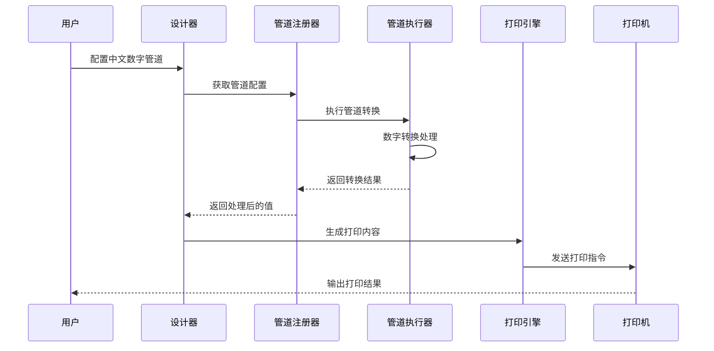
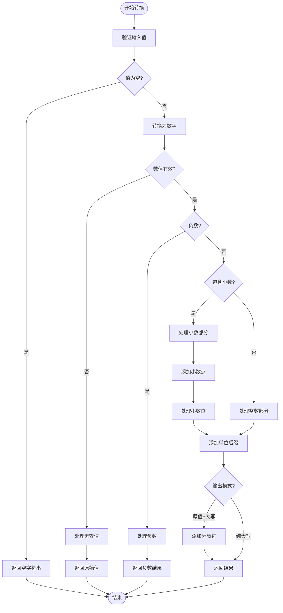
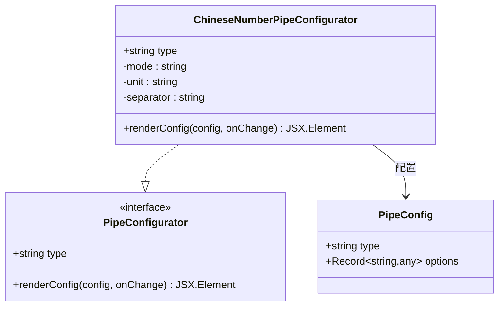
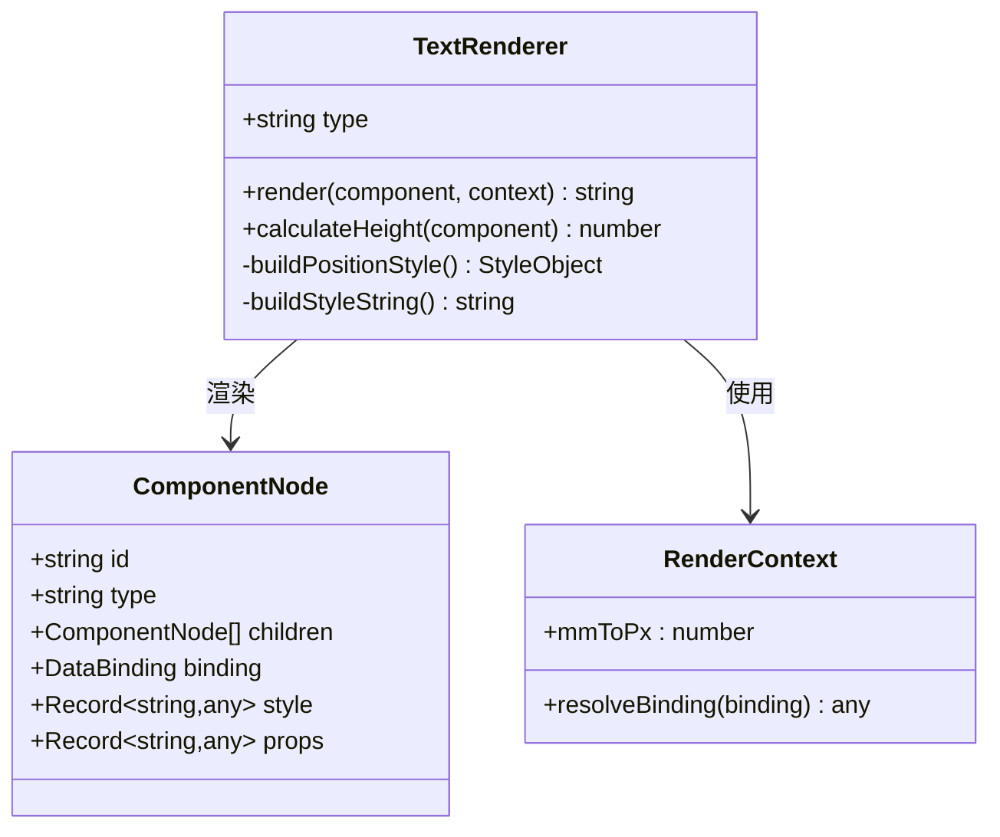
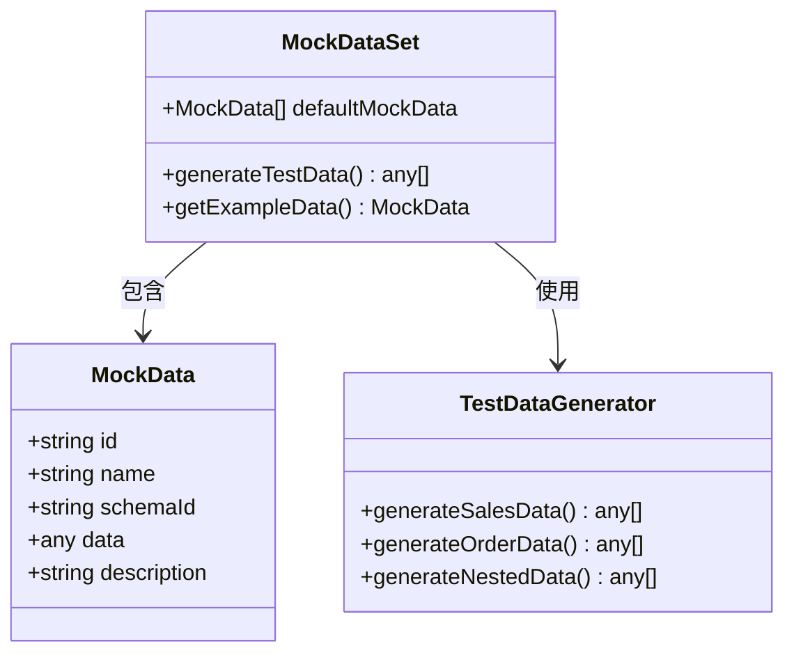
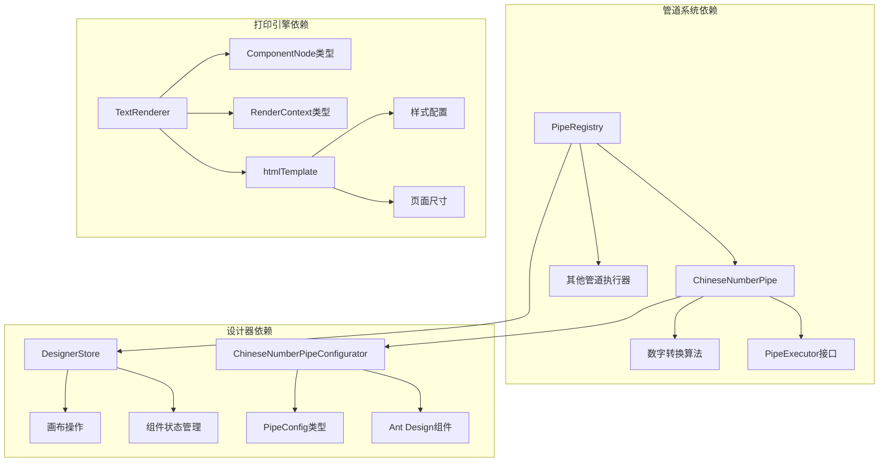

# 中文数字管道系统

<cite>
**本文档引用的文件**
- [ChineseNumberPipe.ts](file://sdk/src/pipes/executors/ChineseNumberPipe.ts)
- [ChineseNumberPipeConfigurator.tsx](file://designer/src/pipes/configurators/ChineseNumberPipeConfigurator.tsx)
- [registry.ts](file://sdk/src/pipes/registry.ts)
- [types.ts](file://sdk/src/pipes/types.ts)
- [index.ts](file://sdk/src/pipes/executors/index.ts)
- [htmlTemplate.ts](file://sdk/src/printEngine/htmlTemplate.ts)
- [constants.ts](file://sdk/src/printEngine/constants.ts)
- [TextRenderer.ts](file://sdk/src/printEngine/renderers/TextRenderer.ts)
- [TextPreview.tsx](file://designer/src/pages/Designer/components/Canvas/componentRenderers/TextPreview.tsx)
- [mockData.ts](file://designer/src/services/mock/mockData.ts)
- [designer.ts](file://designer/src/store/designer.ts)
- [index.ts](file://designer/src/types/index.ts)
- [BarcodePreview.tsx](file://designer/src/pages/Designer/components/Canvas/componentRenderers/BarcodePreview.tsx)
- [QRCodePreview.tsx](file://designer/src/pages/Designer/components/Canvas/componentRenderers/QRCodePreview.tsx)
</cite>

## 目录
1. [简介](#简介)
2. [项目结构](#项目结构)
3. [核心组件](#核心组件)
4. [架构概览](#架构概览)
5. [详细组件分析](#详细组件分析)
6. [依赖分析](#依赖分析)
7. [性能考虑](#性能考虑)
8. [故障排除指南](#故障排除指南)
9. [结论](#结论)

## 简介

中文数字管道系统是一个专门设计用于将阿拉伯数字转换为中文大写形式的完整解决方案。该系统不仅提供了强大的数字转换功能，还集成了完整的设计器界面、打印引擎和数据管道系统。

系统的核心特色包括：
- **精确的中文大写转换**：支持整数和小数的准确转换
- **灵活的输出模式**：支持纯大写、原值+大写等多种显示方式
- **完整的设计器集成**：提供直观的可视化编辑界面
- **强大的打印功能**：支持多种纸张尺寸和打印模式
- **丰富的数据管道**：提供多种数据格式化选项

## 项目结构

该项目采用模块化的架构设计，主要分为以下核心模块：

**图表来源**
- [registry.ts:1-65](file://sdk/src/pipes/registry.ts#L1-L65)
- [designer.ts:1-637](file://designer/src/store/designer.ts#L1-L637)

**章节来源**
- [registry.ts:1-65](file://sdk/src/pipes/registry.ts#L1-L65)
- [designer.ts:1-637](file://designer/src/store/designer.ts#L1-L637)

## 核心组件

### 中文数字管道执行器

中文数字管道是整个系统的核心组件，负责将阿拉伯数字转换为中文大写形式。

**图表来源**
- [ChineseNumberPipe.ts:99-138](file://sdk/src/pipes/executors/ChineseNumberPipe.ts#L99-L138)
- [types.ts:11-29](file://sdk/src/pipes/types.ts#L11-L29)

### 管道注册系统

管道注册器负责管理所有可用的管道执行器，提供统一的访问接口。

**图表来源**
- [registry.ts:12-52](file://sdk/src/pipes/registry.ts#L12-L52)

**章节来源**
- [ChineseNumberPipe.ts:1-138](file://sdk/src/pipes/executors/ChineseNumberPipe.ts#L1-L138)
- [registry.ts:1-65](file://sdk/src/pipes/registry.ts#L1-L65)

## 架构概览

系统采用分层架构设计，从底层的管道执行器到上层的设计器界面，形成了完整的数据处理链路。

**图表来源**
- [registry.ts:45-52](file://sdk/src/pipes/registry.ts#L45-L52)
- [ChineseNumberPipe.ts:103-137](file://sdk/src/pipes/executors/ChineseNumberPipe.ts#L103-L137)

系统的主要特点：
- **模块化设计**：每个组件都有明确的职责分工
- **可扩展性**：支持新增管道执行器和组件类型
- **类型安全**：使用TypeScript确保类型安全
- **配置灵活**：支持多种输出模式和自定义选项

## 详细组件分析

### 中文数字转换算法

中文数字转换算法是系统最核心的功能模块，实现了精确的数字到中文大写的转换。

**图表来源**
- [ChineseNumberPipe.ts:70-97](file://sdk/src/pipes/executors/ChineseNumberPipe.ts#L70-L97)

#### 转换规则详解

系统遵循严格的中文数字转换规则：

1. **基本数字映射**：零到九的中文大写对应关系
2. **单位系统**：拾、佰、仟、万、亿的层级结构
3. **零的处理**：连续零的省略和适当插入规则
4. **小数处理**：小数点的特殊标记和逐位读法

**章节来源**
- [ChineseNumberPipe.ts:17-62](file://sdk/src/pipes/executors/ChineseNumberPipe.ts#L17-L62)

### 设计器集成组件

设计器提供了直观的可视化界面，用户可以通过图形化方式配置中文数字管道。

**图表来源**
- [ChineseNumberPipeConfigurator.tsx:11-57](file://designer/src/pipes/configurators/ChineseNumberPipeConfigurator.tsx#L11-L57)

#### 配置选项说明

设计器提供了三种主要的配置选项：

1. **输出模式选择**：纯大写显示或原值+大写组合显示
2. **连接符设置**：自定义原值和大写之间的分隔符号
3. **单位后缀**：为转换结果添加货币单位或其他标识

**章节来源**
- [ChineseNumberPipeConfigurator.tsx:1-58](file://designer/src/pipes/configurators/ChineseNumberPipeConfigurator.tsx#L1-L58)

### 打印引擎集成

打印引擎负责将转换后的中文数字正确地渲染到打印页面上。

**图表来源**
- [TextRenderer.ts:10-59](file://sdk/src/printEngine/renderers/TextRenderer.ts#L10-L59)

#### 渲染流程

打印引擎的渲染过程包括以下步骤：

1. **数据解析**：从组件绑定中提取需要转换的数值
2. **管道执行**：调用中文数字管道进行转换
3. **样式应用**：根据组件配置应用相应的CSS样式
4. **位置计算**：计算组件在页面上的绝对位置
5. **HTML生成**：生成最终的HTML输出

**章节来源**
- [TextRenderer.ts:13-53](file://sdk/src/printEngine/renderers/TextRenderer.ts#L13-L53)

### Mock数据系统

系统内置了丰富的Mock数据，用于测试各种场景下的中文数字转换效果。

**图表来源**
- [mockData.ts:6-562](file://designer/src/services/mock/mockData.ts#L6-L562)

#### 数据结构特点

Mock数据系统包含了多种类型的测试数据：

1. **标准销售订单**：包含完整的商品明细和金额信息
2. **大数据量报表**：用于测试大量数据的处理能力
3. **简单测试数据**：最小化的数据集，便于快速验证
4. **批量打印数据**：多份不同订单的组合数据
5. **嵌套对象数据**：演示复杂数据结构的处理

**章节来源**
- [mockData.ts:1-562](file://designer/src/services/mock/mockData.ts#L1-L562)

## 依赖分析

系统采用了清晰的依赖关系设计，确保各个模块之间的松耦合。

**图表来源**
- [registry.ts:6-7](file://sdk/src/pipes/registry.ts#L6-L7)
- [ChineseNumberPipeConfigurator.tsx:5-7](file://designer/src/pipes/configurators/ChineseNumberPipeConfigurator.tsx#L5-L7)

### 依赖关系特点

1. **接口驱动**：通过PipeExecutor接口实现管道的标准化
2. **类型安全**：使用TypeScript类型系统确保编译时安全
3. **模块化导入**：采用ES6模块系统实现清晰的依赖关系
4. **向后兼容**：保持API的稳定性，支持版本演进

**章节来源**
- [types.ts:1-30](file://sdk/src/pipes/types.ts#L1-L30)
- [index.ts:1-45](file://sdk/src/pipes/executors/index.ts#L1-L45)

## 性能考虑

系统在设计时充分考虑了性能优化，特别是在处理大量数据和复杂渲染场景时。

### 数字转换性能优化

1. **算法效率**：使用字符串遍历而非递归，避免栈溢出风险
2. **内存管理**：避免创建不必要的中间变量和临时数组
3. **边界检查**：提前验证输入参数，减少无效计算

### 渲染性能优化

1. **样式缓存**：复用CSS样式字符串，减少DOM操作
2. **组件复用**：通过预览组件实现高效的UI更新
3. **增量更新**：只更新发生变化的组件，而非全量重绘

### 内存使用优化

1. **对象池**：对于频繁创建的对象使用对象池模式
2. **懒加载**：按需加载管道执行器，减少初始内存占用
3. **垃圾回收**：及时清理不再使用的临时变量和闭包

## 故障排除指南

### 常见问题及解决方案

#### 数字转换异常

**问题现象**：中文数字转换结果不符合预期

**可能原因**：
1. 输入值超出支持范围（超过9位数）
2. 包含特殊字符或非数字字符
3. 小数点位置错误

**解决方法**：
1. 检查输入值是否为有效的数字格式
2. 确认数值范围在系统支持的范围内
3. 验证小数点的使用是否正确

#### 设计器配置错误

**问题现象**：中文数字管道配置无法保存或显示异常

**可能原因**：
1. 配置选项格式不正确
2. 管道类型识别失败
3. 状态管理异常

**解决方法**：
1. 检查配置选项的JSON格式
2. 确认管道类型字符串匹配
3. 重新加载设计器状态

#### 打印输出问题

**问题现象**：转换后的中文数字在打印时显示异常

**可能原因**：
1. 字体不支持中文字符
2. 页面尺寸设置错误
3. CSS样式冲突

**解决方法**：
1. 确保使用支持中文的字体
2. 检查页面配置的尺寸设置
3. 排查CSS样式冲突问题

**章节来源**
- [ChineseNumberPipe.ts:117-136](file://sdk/src/pipes/executors/ChineseNumberPipe.ts#L117-L136)
- [ChineseNumberPipeConfigurator.tsx:14-57](file://designer/src/pipes/configurators/ChineseNumberPipeConfigurator.tsx#L14-L57)

## 结论

中文数字管道系统是一个设计精良、功能完整的解决方案，它成功地将复杂的数字转换需求转化为简单易用的工具。系统的主要优势包括：

1. **功能完整性**：从数据转换到打印输出的全流程覆盖
2. **用户体验优秀**：直观的设计器界面和灵活的配置选项
3. **技术架构先进**：模块化设计和类型安全保证
4. **扩展性强**：支持新增管道和组件类型的扩展能力

该系统特别适用于需要大量中文数字显示的业务场景，如财务票据、销售订单、报表生成等应用场景。通过其精确的转换算法和完善的错误处理机制，能够确保数字转换的准确性和可靠性。

未来的发展方向可以包括：
- 支持更多语言和地区的数字格式
- 增加更多的数据管道类型
- 优化大数据量处理的性能表现
- 扩展移动端的适配能力