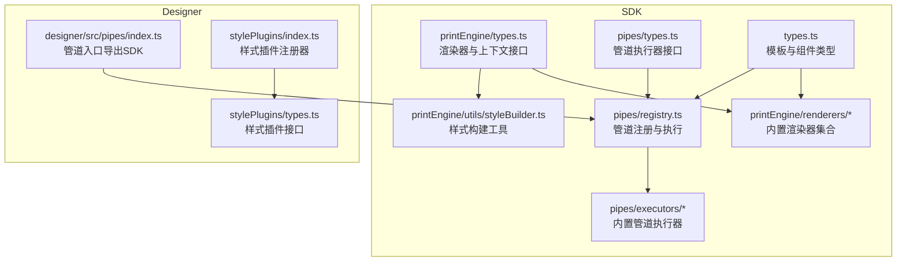
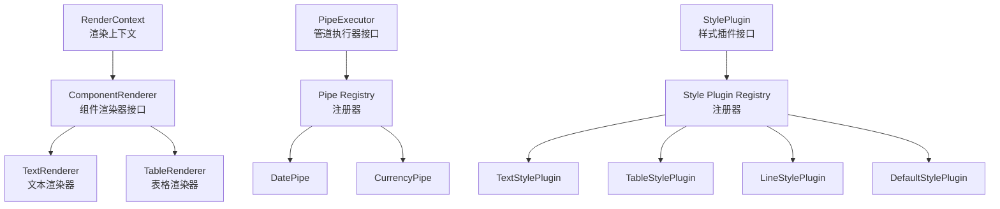
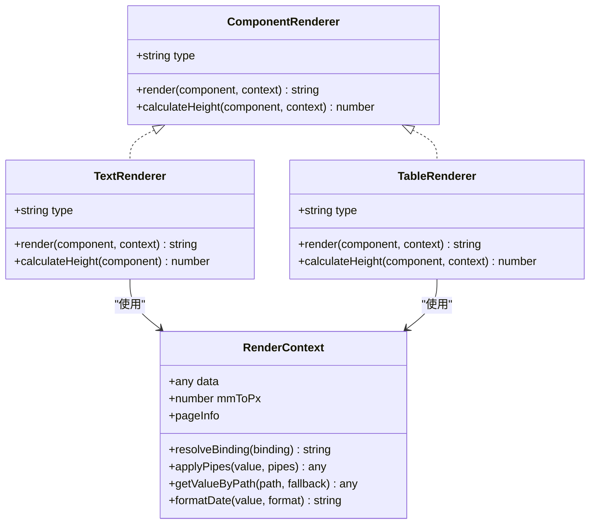
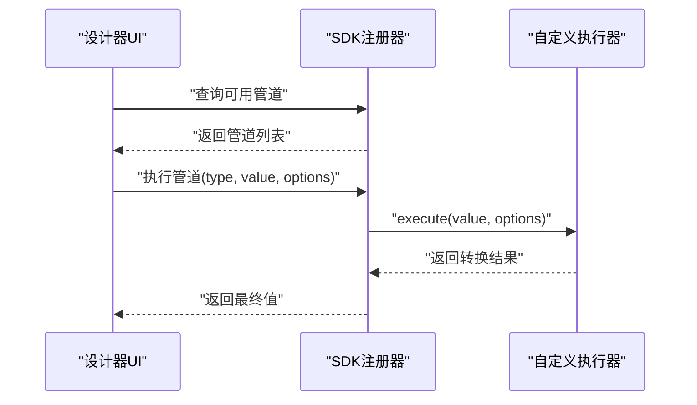
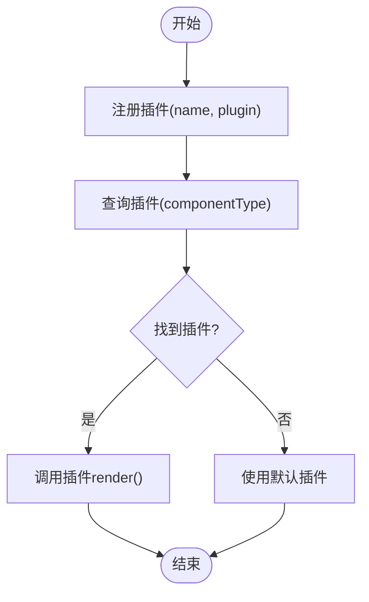
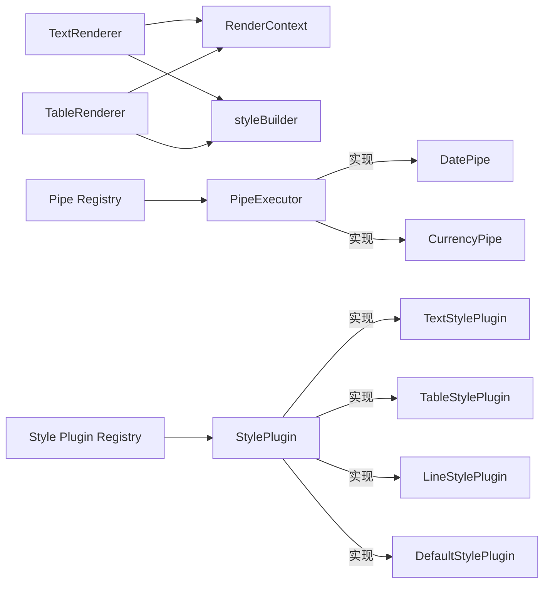

# 扩展开发指南

<cite>
**本文引用的文件**
- [sdk/src/printEngine/types.ts](file://sdk/src/printEngine/types.ts)
- [sdk/src/printEngine/renderers/index.ts](file://sdk/src/printEngine/renderers/index.ts)
- [sdk/src/printEngine/renderers/TextRenderer.ts](file://sdk/src/printEngine/renderers/TextRenderer.ts)
- [sdk/src/printEngine/renderers/TableRenderer.ts](file://sdk/src/printEngine/renderers/TableRenderer.ts)
- [sdk/src/printEngine/utils/styleBuilder.ts](file://sdk/src/printEngine/utils/styleBuilder.ts)
- [sdk/src/pipes/types.ts](file://sdk/src/pipes/types.ts)
- [sdk/src/pipes/registry.ts](file://sdk/src/pipes/registry.ts)
- [sdk/src/pipes/executors/CurrencyPipe.ts](file://sdk/src/pipes/executors/CurrencyPipe.ts)
- [sdk/src/pipes/executors/DatePipe.ts](file://sdk/src/pipes/executors/DatePipe.ts)
- [sdk/src/types.ts](file://sdk/src/types.ts)
- [designer/src/pipes/index.ts](file://designer/src/pipes/index.ts)
- [designer/src/pages/Designer/components/PropertyPanel/stylePlugins/index.ts](file://designer/src/pages/Designer/components/PropertyPanel/stylePlugins/index.ts)
- [designer/src/pages/Designer/components/PropertyPanel/stylePlugins/types.ts](file://designer/src/pages/Designer/components/PropertyPanel/stylePlugins/types.ts)
</cite>

## 目录
1. [简介](#简介)
2. [项目结构](#项目结构)
3. [核心组件](#核心组件)
4. [架构总览](#架构总览)
5. [详细组件分析](#详细组件分析)
6. [依赖分析](#依赖分析)
7. [性能考虑](#性能考虑)
8. [故障排查指南](#故障排查指南)
9. [结论](#结论)
10. [附录](#附录)

## 简介
本指南面向希望为打印平台开发扩展的工程师，系统讲解三类扩展能力：自定义渲染器、自定义管道、以及样式插件（插件系统）。内容涵盖接口规范、注册流程、执行机制、测试方法、调试技巧与性能优化建议，并提供可直接对照的源码路径以便快速落地。

## 项目结构
打印平台的扩展能力主要分布在 SDK 与 Designer 两个子工程中：
- SDK 提供渲染引擎、管道系统、类型定义与工具函数，是扩展的核心实现区域。
- Designer 提供可视化设计器界面，负责扩展的 UI 层配置与展示。

图表来源
- [sdk/src/printEngine/types.ts:58-82](file://sdk/src/printEngine/types.ts#L58-L82)
- [sdk/src/printEngine/renderers/index.ts:1-13](file://sdk/src/printEngine/renderers/index.ts#L1-L13)
- [sdk/src/printEngine/utils/styleBuilder.ts:1-54](file://sdk/src/printEngine/utils/styleBuilder.ts#L1-L54)
- [sdk/src/pipes/types.ts:7-29](file://sdk/src/pipes/types.ts#L7-L29)
- [sdk/src/pipes/registry.ts:1-64](file://sdk/src/pipes/registry.ts#L1-L64)
- [sdk/src/pipes/executors/CurrencyPipe.ts:1-17](file://sdk/src/pipes/executors/CurrencyPipe.ts#L1-L17)
- [sdk/src/pipes/executors/DatePipe.ts:1-35](file://sdk/src/pipes/executors/DatePipe.ts#L1-L35)
- [sdk/src/types.ts:134-171](file://sdk/src/types.ts#L134-L171)
- [designer/src/pipes/index.ts:1-11](file://designer/src/pipes/index.ts#L1-L11)
- [designer/src/pages/Designer/components/PropertyPanel/stylePlugins/index.ts:1-47](file://designer/src/pages/Designer/components/PropertyPanel/stylePlugins/index.ts#L1-L47)
- [designer/src/pages/Designer/components/PropertyPanel/stylePlugins/types.ts:1-31](file://designer/src/pages/Designer/components/PropertyPanel/stylePlugins/types.ts#L1-L31)

章节来源
- [sdk/src/printEngine/types.ts:1-116](file://sdk/src/printEngine/types.ts#L1-L116)
- [sdk/src/printEngine/renderers/index.ts:1-13](file://sdk/src/printEngine/renderers/index.ts#L1-L13)
- [sdk/src/pipes/registry.ts:1-64](file://sdk/src/pipes/registry.ts#L1-L64)
- [sdk/src/types.ts:1-171](file://sdk/src/types.ts#L1-L171)
- [designer/src/pipes/index.ts:1-11](file://designer/src/pipes/index.ts#L1-L11)
- [designer/src/pages/Designer/components/PropertyPanel/stylePlugins/index.ts:1-47](file://designer/src/pages/Designer/components/PropertyPanel/stylePlugins/index.ts#L1-L47)

## 核心组件
- 渲染器接口与上下文
  - 接口定义位于渲染引擎类型文件中，包含组件渲染器与渲染上下文两大接口，用于约束扩展渲染器的行为与能力。
  - 关键点：type 标识、render 方法、可选的 calculateHeight 方法。
- 管道执行器接口与注册器
  - 管道执行器接口定义 type、label 与 execute 方法；注册器提供注册、查询、遍历与执行能力。
  - 内置执行器通过注册器集中初始化，便于扩展者按相同模式注册自定义执行器。
- 样式插件接口与注册器
  - 设计器侧提供样式插件接口与注册器，支持按组件类型映射到对应样式配置 UI 插件。
- 工具函数
  - 样式构建工具提供样式对象到 CSS 字符串的转换与绝对定位样式的生成，减少重复实现。

章节来源
- [sdk/src/printEngine/types.ts:58-82](file://sdk/src/printEngine/types.ts#L58-L82)
- [sdk/src/printEngine/types.ts:11-55](file://sdk/src/printEngine/types.ts#L11-L55)
- [sdk/src/pipes/types.ts:7-29](file://sdk/src/pipes/types.ts#L7-L29)
- [sdk/src/pipes/registry.ts:1-64](file://sdk/src/pipes/registry.ts#L1-L64)
- [designer/src/pages/Designer/components/PropertyPanel/stylePlugins/types.ts:7-30](file://designer/src/pages/Designer/components/PropertyPanel/stylePlugins/types.ts#L7-L30)
- [designer/src/pages/Designer/components/PropertyPanel/stylePlugins/index.ts:1-47](file://designer/src/pages/Designer/components/PropertyPanel/stylePlugins/index.ts#L1-L47)
- [sdk/src/printEngine/utils/styleBuilder.ts:1-54](file://sdk/src/printEngine/utils/styleBuilder.ts#L1-L54)

## 架构总览
下图展示了渲染器、管道与样式插件在系统中的交互关系与职责边界：

图表来源
- [sdk/src/printEngine/types.ts:58-82](file://sdk/src/printEngine/types.ts#L58-L82)
- [sdk/src/printEngine/renderers/TextRenderer.ts:10-59](file://sdk/src/printEngine/renderers/TextRenderer.ts#L10-L59)
- [sdk/src/printEngine/renderers/TableRenderer.ts:11-275](file://sdk/src/printEngine/renderers/TableRenderer.ts#L11-L275)
- [sdk/src/pipes/types.ts:7-29](file://sdk/src/pipes/types.ts#L7-L29)
- [sdk/src/pipes/registry.ts:1-64](file://sdk/src/pipes/registry.ts#L1-L64)
- [sdk/src/pipes/executors/DatePipe.ts:7-34](file://sdk/src/pipes/executors/DatePipe.ts#L7-L34)
- [sdk/src/pipes/executors/CurrencyPipe.ts:7-16](file://sdk/src/pipes/executors/CurrencyPipe.ts#L7-L16)
- [designer/src/pages/Designer/components/PropertyPanel/stylePlugins/types.ts:7-30](file://designer/src/pages/Designer/components/PropertyPanel/stylePlugins/types.ts#L7-L30)
- [designer/src/pages/Designer/components/PropertyPanel/stylePlugins/index.ts:1-47](file://designer/src/pages/Designer/components/PropertyPanel/stylePlugins/index.ts#L1-L47)

## 详细组件分析

### 自定义渲染器开发指南
- 实现步骤
  - 实现渲染器接口：确保提供 type 标识与 render 方法；如需参与分页，实现可选的 calculateHeight。
  - 使用样式构建工具：通过样式构建工具生成 CSS 字符串，保证定位与尺寸换算一致。
  - 使用渲染上下文：通过上下文解析数据绑定、应用管道、读取页面信息等。
- 开发要点
  - 统一使用 mm 到 px 的换算系数，避免布局漂移。
  - 对表格等复杂组件，注意跨页渲染时的数据切片与高度估算。
- 示例参考
  - 文本渲染器展示了基础定位、样式拼装与文本输出的完整流程。
  - 表格渲染器展示了复杂布局、列宽计算、合计行渲染与高度估算的完整流程。
- 注册与集成
  - 渲染器导出入口统一在渲染器集合中导出，便于上层按 type 查找与调用。
- 测试建议
  - 单元测试：针对 render 输出的 HTML 结构进行断言；对 calculateHeight 进行边界值测试。
  - 集成测试：结合模板与数据，验证跨页分页与布局一致性。
- 调试技巧
  - 在渲染器内利用上下文提供的页面信息进行边界检查与告警输出。
  - 使用最小可复现数据集定位布局异常。

图表来源
- [sdk/src/printEngine/types.ts:58-82](file://sdk/src/printEngine/types.ts#L58-L82)
- [sdk/src/printEngine/types.ts:11-55](file://sdk/src/printEngine/types.ts#L11-L55)
- [sdk/src/printEngine/renderers/TextRenderer.ts:10-59](file://sdk/src/printEngine/renderers/TextRenderer.ts#L10-L59)
- [sdk/src/printEngine/renderers/TableRenderer.ts:11-275](file://sdk/src/printEngine/renderers/TableRenderer.ts#L11-L275)

章节来源
- [sdk/src/printEngine/types.ts:58-82](file://sdk/src/printEngine/types.ts#L58-L82)
- [sdk/src/printEngine/types.ts:11-55](file://sdk/src/printEngine/types.ts#L11-L55)
- [sdk/src/printEngine/renderers/index.ts:1-13](file://sdk/src/printEngine/renderers/index.ts#L1-L13)
- [sdk/src/printEngine/renderers/TextRenderer.ts:10-59](file://sdk/src/printEngine/renderers/TextRenderer.ts#L10-L59)
- [sdk/src/printEngine/renderers/TableRenderer.ts:11-275](file://sdk/src/printEngine/renderers/TableRenderer.ts#L11-L275)
- [sdk/src/printEngine/utils/styleBuilder.ts:1-54](file://sdk/src/printEngine/utils/styleBuilder.ts#L1-L54)

### 自定义管道开发指南
- 实现步骤
  - 实现管道执行器接口：提供 type、label 与 execute 方法。
  - 在注册器中注册：通过注册器的注册方法完成注册。
  - 在模板中使用：在数据绑定中配置管道链路，由注册器统一执行。
- 执行流程
  - 设计器侧仅保留 UI 配置器，执行器来自 SDK 导出，避免重复实现。
- 示例参考
  - 日期格式化与货币格式化管道展示了如何基于 options 执行格式化。
- 注册与执行
  - 注册器提供查询、遍历与执行方法；执行时若未找到执行器会回退原值并告警。
- 测试建议
  - 单元测试：覆盖多种输入与 options 组合，验证输出格式与边界条件。
  - 集成测试：在模板中串联多个管道，验证链式转换顺序与结果。
- 调试技巧
  - 在 execute 中增加日志，定位输入与输出差异。
  - 使用设计器 UI 验证配置项与执行器 label 的一致性。

图表来源
- [sdk/src/pipes/registry.ts:31-52](file://sdk/src/pipes/registry.ts#L31-L52)
- [sdk/src/pipes/types.ts:7-29](file://sdk/src/pipes/types.ts#L7-L29)
- [sdk/src/pipes/executors/DatePipe.ts:7-34](file://sdk/src/pipes/executors/DatePipe.ts#L7-L34)
- [sdk/src/pipes/executors/CurrencyPipe.ts:7-16](file://sdk/src/pipes/executors/CurrencyPipe.ts#L7-L16)
- [designer/src/pipes/index.ts:6-10](file://designer/src/pipes/index.ts#L6-L10)

章节来源
- [sdk/src/pipes/types.ts:7-29](file://sdk/src/pipes/types.ts#L7-L29)
- [sdk/src/pipes/registry.ts:1-64](file://sdk/src/pipes/registry.ts#L1-L64)
- [sdk/src/pipes/executors/DatePipe.ts:1-35](file://sdk/src/pipes/executors/DatePipe.ts#L1-L35)
- [sdk/src/pipes/executors/CurrencyPipe.ts:1-17](file://sdk/src/pipes/executors/CurrencyPipe.ts#L1-L17)
- [designer/src/pipes/index.ts:1-11](file://designer/src/pipes/index.ts#L1-L11)

### 插件系统（样式插件）扩展指南
- 开发规范
  - 实现样式插件接口：提供 name 与 render 方法，render 返回对应组件的样式配置 UI。
  - 以组件类型作为插件映射键，确保与组件类型一致。
- 注册流程
  - 使用注册器注册插件；注册器提供查询与遍历能力；未匹配时回退到默认插件。
- 生命周期管理
  - 注册器在初始化阶段集中注册内置插件；扩展插件应在应用启动时尽早注册，确保被查询到。
- 示例参考
  - 文本、表格、线条与默认样式插件展示了不同组件类型的配置 UI 映射。
- 测试建议
  - 单元测试：验证 getPlugin 能正确返回对应插件或默认插件。
  - 集成测试：在设计器中切换组件类型，确认样式面板正确更新。
- 调试技巧
  - 在 render 中输出当前组件类型与插件名称，核对映射关系。
  - 检查插件名称与组件 type 是否一致。

图表来源
- [designer/src/pages/Designer/components/PropertyPanel/stylePlugins/index.ts:18-33](file://designer/src/pages/Designer/components/PropertyPanel/stylePlugins/index.ts#L18-L33)
- [designer/src/pages/Designer/components/PropertyPanel/stylePlugins/types.ts:7-30](file://designer/src/pages/Designer/components/PropertyPanel/stylePlugins/types.ts#L7-L30)

章节来源
- [designer/src/pages/Designer/components/PropertyPanel/stylePlugins/types.ts:1-31](file://designer/src/pages/Designer/components/PropertyPanel/stylePlugins/types.ts#L1-L31)
- [designer/src/pages/Designer/components/PropertyPanel/stylePlugins/index.ts:1-47](file://designer/src/pages/Designer/components/PropertyPanel/stylePlugins/index.ts#L1-L47)

## 依赖分析
- 渲染器依赖
  - 渲染器依赖渲染上下文与样式构建工具，确保定位、尺寸与样式的一致性。
- 管道依赖
  - 管道执行器通过注册器集中管理；设计器仅导出 UI 配置器，执行器来自 SDK。
- 样式插件依赖
  - 样式插件通过注册器按组件类型映射；未匹配时回退默认插件。

图表来源
- [sdk/src/printEngine/renderers/TextRenderer.ts:10-59](file://sdk/src/printEngine/renderers/TextRenderer.ts#L10-L59)
- [sdk/src/printEngine/renderers/TableRenderer.ts:11-275](file://sdk/src/printEngine/renderers/TableRenderer.ts#L11-L275)
- [sdk/src/printEngine/utils/styleBuilder.ts:1-54](file://sdk/src/printEngine/utils/styleBuilder.ts#L1-L54)
- [sdk/src/printEngine/types.ts:11-55](file://sdk/src/printEngine/types.ts#L11-L55)
- [sdk/src/pipes/registry.ts:1-64](file://sdk/src/pipes/registry.ts#L1-L64)
- [sdk/src/pipes/executors/DatePipe.ts:7-34](file://sdk/src/pipes/executors/DatePipe.ts#L7-L34)
- [sdk/src/pipes/executors/CurrencyPipe.ts:7-16](file://sdk/src/pipes/executors/CurrencyPipe.ts#L7-L16)
- [designer/src/pages/Designer/components/PropertyPanel/stylePlugins/index.ts:1-47](file://designer/src/pages/Designer/components/PropertyPanel/stylePlugins/index.ts#L1-L47)

章节来源
- [sdk/src/printEngine/renderers/TextRenderer.ts:10-59](file://sdk/src/printEngine/renderers/TextRenderer.ts#L10-L59)
- [sdk/src/printEngine/renderers/TableRenderer.ts:11-275](file://sdk/src/printEngine/renderers/TableRenderer.ts#L11-L275)
- [sdk/src/printEngine/utils/styleBuilder.ts:1-54](file://sdk/src/printEngine/utils/styleBuilder.ts#L1-L54)
- [sdk/src/pipes/registry.ts:1-64](file://sdk/src/pipes/registry.ts#L1-L64)
- [designer/src/pages/Designer/components/PropertyPanel/stylePlugins/index.ts:1-47](file://designer/src/pages/Designer/components/PropertyPanel/stylePlugins/index.ts#L1-L47)

## 性能考虑
- 渲染器
  - 避免在 render 中进行昂贵计算，尽量将可缓存逻辑前置到模板准备阶段。
  - 合理使用 calculateHeight，避免对大数据集进行逐行计算。
- 管道
  - execute 中避免频繁创建临时对象，尽量复用结构；对数值计算使用高精度库时注意开销。
- 样式插件
  - render 中避免触发不必要的重排与重绘，优先批量更新状态。
- 通用建议
  - 使用最小数据集进行性能压测，识别瓶颈。
  - 在设计器中启用性能监控，观察组件渲染与管道执行耗时。

## 故障排查指南
- 渲染器
  - 若出现布局溢出或尺寸异常，检查页面信息与定位样式生成逻辑。
  - 若分页异常，核查 calculateHeight 的估算逻辑与跨页数据切片。
- 管道
  - 若管道未生效，确认 type 是否与注册器中的 type 一致；查看执行器是否存在。
  - 若输出不符合预期，检查 options 与输入值类型。
- 样式插件
  - 若样式面板不显示，确认插件名称与组件 type 是否一致；检查注册器是否正确注册。
  - 若默认插件生效，确认自定义插件是否在初始化阶段注册。

章节来源
- [sdk/src/printEngine/renderers/TableRenderer.ts:42-55](file://sdk/src/printEngine/renderers/TableRenderer.ts#L42-L55)
- [sdk/src/pipes/registry.ts:45-52](file://sdk/src/pipes/registry.ts#L45-L52)
- [designer/src/pages/Designer/components/PropertyPanel/stylePlugins/index.ts:31-33](file://designer/src/pages/Designer/components/PropertyPanel/stylePlugins/index.ts#L31-L33)

## 结论
通过遵循本文档的接口规范与注册流程，开发者可以高效地扩展渲染器、管道与样式插件。建议在开发过程中以最小可行单元进行测试与验证，并结合性能与调试建议持续优化扩展质量。

## 附录
- 快速对照清单
  - 渲染器：实现接口 → 使用样式工具 → 在导出集合中注册 → 编写单元与集成测试。
  - 管道：实现执行器 → 注册器注册 → 设计器 UI 配置 → 链式测试。
  - 样式插件：实现接口 → 注册器注册 → 组件类型映射 → 面板联动测试。