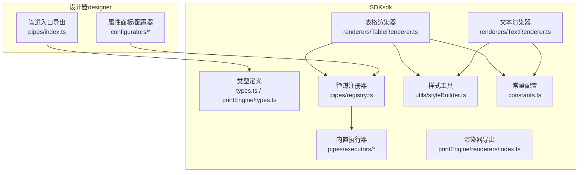
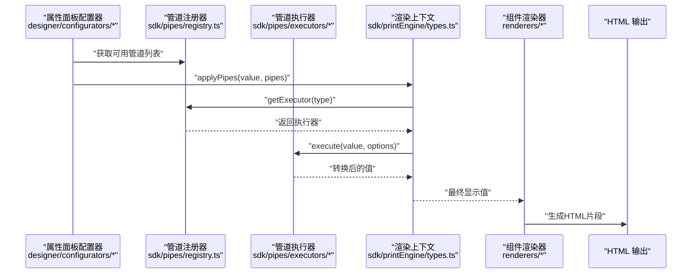
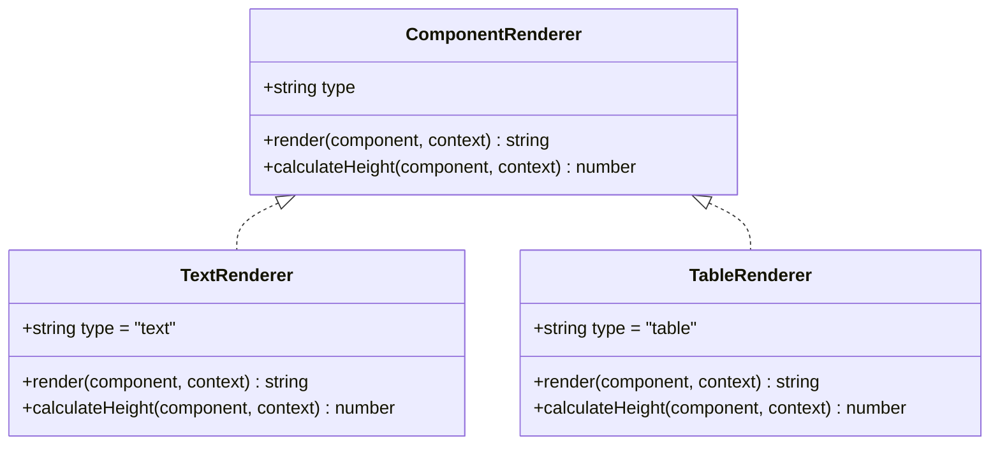
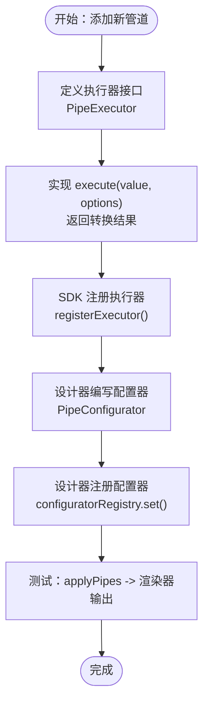
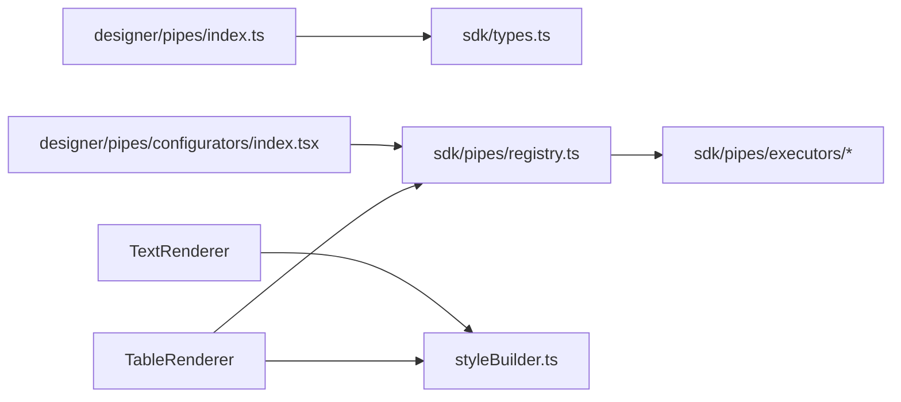

# 扩展开发指南

<cite>
**本文引用的文件**
- [designer/src/pipes/index.ts](file://designer/src/pipes/index.ts)
- [designer/src/pipes/configurators/index.tsx](file://designer/src/pipes/configurators/index.tsx)
- [designer/src/pipes/configurators/ChineseNumberPipeConfigurator.tsx](file://designer/src/pipes/configurators/ChineseNumberPipeConfigurator.tsx)
- [sdk/src/pipes/index.ts](file://sdk/src/pipes/index.ts)
- [sdk/src/pipes/registry.ts](file://sdk/src/pipes/registry.ts)
- [sdk/src/pipes/types.ts](file://sdk/src/pipes/types.ts)
- [sdk/src/pipes/executors/CurrencyPipe.ts](file://sdk/src/pipes/executors/CurrencyPipe.ts)
- [sdk/src/pipes/executors/ChineseNumberPipe.ts](file://sdk/src/pipes/executors/ChineseNumberPipe.ts)
- [sdk/src/printEngine/types.ts](file://sdk/src/printEngine/types.ts)
- [sdk/src/printEngine/renderers/index.ts](file://sdk/src/printEngine/renderers/index.ts)
- [sdk/src/printEngine/renderers/TextRenderer.ts](file://sdk/src/printEngine/renderers/TextRenderer.ts)
- [sdk/src/printEngine/renderers/TableRenderer.ts](file://sdk/src/printEngine/renderers/TableRenderer.ts)
- [sdk/src/printEngine/utils/styleBuilder.ts](file://sdk/src/printEngine/utils/styleBuilder.ts)
- [sdk/src/printEngine/constants.ts](file://sdk/src/printEngine/constants.ts)
- [sdk/src/types.ts](file://sdk/src/types.ts)
- [designer/src/types/index.ts](file://designer/src/types/index.ts)
</cite>

## 目录
1. [简介](#简介)
2. [项目结构](#项目结构)
3. [核心组件](#核心组件)
4. [架构总览](#架构总览)
5. [详细组件分析](#详细组件分析)
6. [依赖分析](#依赖分析)
7. [性能考虑](#性能考虑)
8. [故障排查指南](#故障排查指南)
9. [结论](#结论)
10. [附录](#附录)

## 简介
本指南面向希望为打印设计器项目开发“自定义组件渲染器”和“自定义数据管道执行器”的扩展开发者。文档基于现有代码库的接口规范、实现模式与注册机制，提供从接口设计、实现步骤、注册流程到最佳实践、测试与调试、发布维护的完整路线图，并给出可直接对照的源码路径与示例。

## 项目结构
该项目采用“设计器前端 + SDK 后端执行”的双包结构：
- 设计器（designer）：负责可视化编辑器界面、组件拖拽、属性面板、数据绑定与管道配置器（UI）等。
- SDK（sdk）：负责打印模板解析、渲染器插件化、数据管道执行器注册与执行、HTML 输出等。

**图表来源**
- [designer/src/pipes/index.ts:1-11](file://designer/src/pipes/index.ts#L1-L11)
- [sdk/src/pipes/registry.ts:1-65](file://sdk/src/pipes/registry.ts#L1-L65)
- [sdk/src/printEngine/renderers/index.ts:1-13](file://sdk/src/printEngine/renderers/index.ts#L1-L13)
- [sdk/src/printEngine/renderers/TextRenderer.ts:1-60](file://sdk/src/printEngine/renderers/TextRenderer.ts#L1-L60)
- [sdk/src/printEngine/renderers/TableRenderer.ts:1-602](file://sdk/src/printEngine/renderers/TableRenderer.ts#L1-L602)
- [sdk/src/printEngine/utils/styleBuilder.ts:1-54](file://sdk/src/printEngine/utils/styleBuilder.ts#L1-L54)
- [sdk/src/printEngine/constants.ts:1-113](file://sdk/src/printEngine/constants.ts#L1-L113)

**章节来源**
- [designer/src/pipes/index.ts:1-11](file://designer/src/pipes/index.ts#L1-L11)
- [sdk/src/pipes/index.ts:1-9](file://sdk/src/pipes/index.ts#L1-L9)

## 核心组件
- 管道系统（Pipeline）
  - 设计器侧：提供 UI 配置器（PipeConfigurator），用于在属性面板中配置管道参数。
  - SDK 侧：提供执行器接口（PipeExecutor）、注册器（registry）与内置执行器，负责实际数据转换。
- 渲染器系统（Renderer）
  - SDK 侧：定义 ComponentRenderer 接口，提供多种内置渲染器（文本、表格、图片等），统一输出 HTML 字符串。

**章节来源**
- [designer/src/pipes/configurators/index.tsx:14-85](file://designer/src/pipes/configurators/index.tsx#L14-L85)
- [sdk/src/pipes/types.ts:7-30](file://sdk/src/pipes/types.ts#L7-L30)
- [sdk/src/pipes/registry.ts:9-65](file://sdk/src/pipes/registry.ts#L9-L65)
- [sdk/src/printEngine/types.ts:57-82](file://sdk/src/printEngine/types.ts#L57-L82)

## 架构总览
以下序列图展示了“数据绑定 + 管道转换 + 渲染器输出”的关键流程，体现扩展点的接入位置与调用链。

**图表来源**
- [designer/src/pipes/configurators/index.tsx:67-85](file://designer/src/pipes/configurators/index.tsx#L67-L85)
- [sdk/src/pipes/registry.ts:21-52](file://sdk/src/pipes/registry.ts#L21-L52)
- [sdk/src/printEngine/types.ts:11-55](file://sdk/src/printEngine/types.ts#L11-L55)

## 详细组件分析

### 自定义组件渲染器开发指南
目标：为新组件类型（如“进度条”、“签名区”）开发渲染器，实现 ComponentRenderer 接口并在 SDK 中注册。

- 接口规范
  - 必须实现 readonly type、render(component, context) 方法；可选实现 calculateHeight(...)。
  - 渲染器通过 RenderContext 访问数据、应用管道、解析绑定、获取页面信息等。
- 实现步骤
  1) 定义渲染器类，实现 ComponentRenderer 接口。
  2) 在 render 中根据组件配置与上下文生成 HTML 字符串。
  3) 如需参与分页，实现 calculateHeight。
  4) 在渲染器导出入口注册新渲染器。
- 注册机制
  - 在渲染器导出入口集中导出新渲染器，供打印引擎按 type 查找并调用。
- 示例参考
  - 文本渲染器：[sdk/src/printEngine/renderers/TextRenderer.ts:10-60](file://sdk/src/printEngine/renderers/TextRenderer.ts#L10-L60)
  - 表格渲染器：[sdk/src/printEngine/renderers/TableRenderer.ts:147-602](file://sdk/src/printEngine/renderers/TableRenderer.ts#L147-L602)
  - 渲染器导出入口：[sdk/src/printEngine/renderers/index.ts:1-13](file://sdk/src/printEngine/renderers/index.ts#L1-L13)
  - 渲染上下文接口：[sdk/src/printEngine/types.ts:11-55](file://sdk/src/printEngine/types.ts#L11-L55)
  - 样式工具：[sdk/src/printEngine/utils/styleBuilder.ts:13-53](file://sdk/src/printEngine/utils/styleBuilder.ts#L13-L53)
  - 常量配置：[sdk/src/printEngine/constants.ts:13-92](file://sdk/src/printEngine/constants.ts#L13-L92)

**图表来源**
- [sdk/src/printEngine/types.ts:57-82](file://sdk/src/printEngine/types.ts#L57-L82)
- [sdk/src/printEngine/renderers/TextRenderer.ts:10-60](file://sdk/src/printEngine/renderers/TextRenderer.ts#L10-L60)
- [sdk/src/printEngine/renderers/TableRenderer.ts:147-602](file://sdk/src/printEngine/renderers/TableRenderer.ts#L147-L602)

**章节来源**
- [sdk/src/printEngine/types.ts:57-82](file://sdk/src/printEngine/types.ts#L57-L82)
- [sdk/src/printEngine/renderers/TextRenderer.ts:10-60](file://sdk/src/printEngine/renderers/TextRenderer.ts#L10-L60)
- [sdk/src/printEngine/renderers/TableRenderer.ts:147-602](file://sdk/src/printEngine/renderers/TableRenderer.ts#L147-L602)
- [sdk/src/printEngine/renderers/index.ts:1-13](file://sdk/src/printEngine/renderers/index.ts#L1-L13)
- [sdk/src/printEngine/utils/styleBuilder.ts:13-53](file://sdk/src/printEngine/utils/styleBuilder.ts#L13-L53)
- [sdk/src/printEngine/constants.ts:13-92](file://sdk/src/printEngine/constants.ts#L13-L92)

### 自定义数据管道执行器开发指南
目标：为新业务场景（如“中文大写数字”、“百分比格式化”）开发管道执行器，提供 UI 配置器并在 SDK 中注册。

- 接口设计
  - PipeExecutor：包含 type、label、execute(value, options)。
  - PipeConfigurator（UI）：包含 type、renderConfig(config, onChange)。
- 实现步骤
  1) 编写执行器类，实现 PipeExecutor 接口，提供唯一 type 与可读 label。
  2) 在设计器侧编写配置器组件，使用 onChange 回调更新 options。
  3) 在 SDK 侧注册执行器，在设计器侧注册 UI 配置器。
- 集成方法
  - SDK：通过 registerExecutor 注册执行器；通过 getAllPipes/getExecutor 获取可用管道。
  - 设计器：通过 getConfigurator(type) 获取配置器；导出本地配置器集合。
- 示例参考
  - 执行器接口：[sdk/src/pipes/types.ts:11-29](file://sdk/src/pipes/types.ts#L11-L29)
  - 管道注册器：[sdk/src/pipes/registry.ts:17-65](file://sdk/src/pipes/registry.ts#L17-L65)
  - 货币格式化执行器：[sdk/src/pipes/executors/CurrencyPipe.ts:7-17](file://sdk/src/pipes/executors/CurrencyPipe.ts#L7-L17)
  - 中文大写执行器：[sdk/src/pipes/executors/ChineseNumberPipe.ts:99-138](file://sdk/src/pipes/executors/ChineseNumberPipe.ts#L99-L138)
  - 中文大写配置器：[designer/src/pipes/configurators/ChineseNumberPipeConfigurator.tsx:11-58](file://designer/src/pipes/configurators/ChineseNumberPipeConfigurator.tsx#L11-L58)
  - 设计器管道入口导出：[designer/src/pipes/index.ts:6-11](file://designer/src/pipes/index.ts#L6-L11)
  - 设计器配置器注册表：[designer/src/pipes/configurators/index.tsx:67-85](file://designer/src/pipes/configurators/index.tsx#L67-L85)

**图表来源**
- [sdk/src/pipes/types.ts:11-29](file://sdk/src/pipes/types.ts#L11-L29)
- [sdk/src/pipes/registry.ts:17-65](file://sdk/src/pipes/registry.ts#L17-L65)
- [designer/src/pipes/configurators/index.tsx:67-85](file://designer/src/pipes/configurators/index.tsx#L67-L85)

**章节来源**
- [sdk/src/pipes/types.ts:11-29](file://sdk/src/pipes/types.ts#L11-L29)
- [sdk/src/pipes/registry.ts:17-65](file://sdk/src/pipes/registry.ts#L17-L65)
- [designer/src/pipes/configurators/index.tsx:67-85](file://designer/src/pipes/configurators/index.tsx#L67-L85)
- [designer/src/pipes/configurators/ChineseNumberPipeConfigurator.tsx:11-58](file://designer/src/pipes/configurators/ChineseNumberPipeConfigurator.tsx#L11-L58)
- [sdk/src/pipes/executors/CurrencyPipe.ts:7-17](file://sdk/src/pipes/executors/CurrencyPipe.ts#L7-L17)
- [sdk/src/pipes/executors/ChineseNumberPipe.ts:99-138](file://sdk/src/pipes/executors/ChineseNumberPipe.ts#L99-L138)
- [designer/src/pipes/index.ts:6-11](file://designer/src/pipes/index.ts#L6-L11)

### 第三方组件集成与兼容性处理
- 渲染器集成
  - 新增渲染器时，保持与 RenderContext 的解耦，仅依赖公开 API（resolveBinding、applyPipes、getValueByPath、formatDate、mmToPx、pageInfo）。
  - 对外部资源（如图片、二维码）使用资源加载工具，避免硬编码路径。
- 管道集成
  - 执行器应健壮处理异常输入（null/undefined/NaN/非有限数），并提供默认行为。
  - 与表格合计/额外行联动时，注意对数值精度使用高精度库，避免浮点误差。
- 兼容性建议
  - 统一使用 mm 作为布局单位，通过 mmToPx 转换为像素。
  - 表格宽度计算遵循现有算法，避免溢出页边距。
  - 对齐方式与 flex 布局配合，确保文本对齐一致性。

**章节来源**
- [sdk/src/printEngine/types.ts:11-55](file://sdk/src/printEngine/types.ts#L11-L55)
- [sdk/src/printEngine/renderers/TableRenderer.ts:150-327](file://sdk/src/printEngine/renderers/TableRenderer.ts#L150-L327)
- [sdk/src/printEngine/constants.ts:8-92](file://sdk/src/printEngine/constants.ts#L8-L92)

### 测试方法与调试技巧
- 单元测试
  - 管道执行器：构造边界值（空值、负数、极大值、非数字）与 options 组合，验证输出与异常捕获。
  - 渲染器：构造不同布局、样式、数据绑定场景，断言 HTML 结构与样式字符串。
- 集成测试
  - 从属性面板配置器出发，调用 applyPipes，再经渲染器输出 HTML，校验最终 DOM。
  - 表格渲染：验证列宽计算、合计行、额外行、跨页重复表头等分支。
- 调试技巧
  - 使用浏览器开发者工具检查生成的 HTML 与样式。
  - 在渲染器与执行器中增加日志（谨慎使用），定位数据流问题。
  - 对表格合计使用高精度库，确保格式化与管道链路正确。

**章节来源**
- [sdk/src/pipes/executors/ChineseNumberPipe.ts:103-136](file://sdk/src/pipes/executors/ChineseNumberPipe.ts#L103-L136)
- [sdk/src/printEngine/renderers/TableRenderer.ts:332-579](file://sdk/src/printEngine/renderers/TableRenderer.ts#L332-L579)

### 扩展开发示例与应用场景
- 场景一：新增“中文大写数字”渲染器
  - 渲染器职责：将金额以中文大写形式渲染为文本。
  - 实现要点：复用现有样式工具与常量，遵循 RenderContext 规范。
  - 参考：文本渲染器实现路径 [sdk/src/printEngine/renderers/TextRenderer.ts:10-60](file://sdk/src/printEngine/renderers/TextRenderer.ts#L10-L60)。
- 场景二：新增“百分比格式化”管道
  - 执行器：接收数值与 precision，输出带百分号的字符串。
  - 配置器：提供 precision 与显示前缀/后缀的输入。
  - 参考：货币格式化执行器 [sdk/src/pipes/executors/CurrencyPipe.ts:7-17](file://sdk/src/pipes/executors/CurrencyPipe.ts#L7-L17)，中文大写配置器 [designer/src/pipes/configurators/ChineseNumberPipeConfigurator.tsx:11-58](file://designer/src/pipes/configurators/ChineseNumberPipeConfigurator.tsx#L11-L58)。

**章节来源**
- [sdk/src/printEngine/renderers/TextRenderer.ts:10-60](file://sdk/src/printEngine/renderers/TextRenderer.ts#L10-L60)
- [sdk/src/pipes/executors/CurrencyPipe.ts:7-17](file://sdk/src/pipes/executors/CurrencyPipe.ts#L7-L17)
- [designer/src/pipes/configurators/ChineseNumberPipeConfigurator.tsx:11-58](file://designer/src/pipes/configurators/ChineseNumberPipeConfigurator.tsx#L11-L58)

### 发布与维护建议
- 版本管理
  - 为新增渲染器与执行器提供清晰的 type 标识与语义化版本，避免冲突。
- 文档与示例
  - 为每个扩展提供最小可运行示例与配置说明，便于复用。
- 兼容性
  - 保持对 RenderContext 的稳定接口，避免破坏性变更。
- 性能
  - 渲染器尽量减少 DOM 操作与字符串拼接次数，必要时引入缓存策略。
- 回归测试
  - 每次变更后运行既有测试集，确保渲染器与管道链路不受影响。

## 依赖分析
- 设计器对 SDK 的依赖
  - 设计器导出统一入口，导入 SDK 的类型与执行器；同时导出本地配置器集合。
- SDK 内部依赖
  - 渲染器依赖样式工具与常量；表格渲染器进一步依赖管道注册器与高精度计算库。
- 耦合与内聚
  - 渲染器与执行器通过接口解耦，注册器集中管理，便于扩展与替换。

**图表来源**
- [designer/src/pipes/index.ts:6-11](file://designer/src/pipes/index.ts#L6-L11)
- [designer/src/pipes/configurators/index.tsx:67-85](file://designer/src/pipes/configurators/index.tsx#L67-L85)
- [sdk/src/pipes/registry.ts:17-65](file://sdk/src/pipes/registry.ts#L17-L65)
- [sdk/src/printEngine/renderers/TextRenderer.ts:7-8](file://sdk/src/printEngine/renderers/TextRenderer.ts#L7-L8)
- [sdk/src/printEngine/renderers/TableRenderer.ts:10](file://sdk/src/printEngine/renderers/TableRenderer.ts#L10)

**章节来源**
- [designer/src/pipes/index.ts:6-11](file://designer/src/pipes/index.ts#L6-L11)
- [sdk/src/pipes/registry.ts:17-65](file://sdk/src/pipes/registry.ts#L17-L65)

## 性能考虑
- 渲染器
  - 合理使用样式字符串构建，避免频繁 DOM 查询；表格渲染中批量拼接 HTML。
- 管道
  - 对数值计算使用高精度库，减少浮点误差；对异常输入快速返回默认值。
- 分页
  - 表格渲染器提供估算高度与精确测量结合的策略，平衡性能与准确性。

**章节来源**
- [sdk/src/printEngine/renderers/TableRenderer.ts:390-463](file://sdk/src/printEngine/renderers/TableRenderer.ts#L390-L463)
- [sdk/src/printEngine/renderers/TableRenderer.ts:581-600](file://sdk/src/printEngine/renderers/TableRenderer.ts#L581-L600)

## 故障排查指南
- 管道未找到
  - 现象：执行管道时报“未找到执行器”警告。
  - 处理：确认执行器已通过 registerExecutor 注册，type 与配置一致。
- 表格溢出页边距
  - 现象：表格右侧超出页边距，出现警告或显示异常。
  - 处理：调整布局 xMm 或 widthMm，确保 xMm + widthMm ≤ 页面宽度 - 右边距。
- 合计计算错误
  - 现象：合计行显示“计算错误”。
  - 处理：检查数据类型与精度，确保数值可转换且管道链路正确。

**章节来源**
- [sdk/src/pipes/registry.ts:45-52](file://sdk/src/pipes/registry.ts#L45-L52)
- [sdk/src/printEngine/renderers/TableRenderer.ts:195-228](file://sdk/src/printEngine/renderers/TableRenderer.ts#L195-L228)
- [sdk/src/printEngine/renderers/TableRenderer.ts:429-433](file://sdk/src/printEngine/renderers/TableRenderer.ts#L429-L433)

## 结论
通过遵循本文提供的接口规范、实现步骤与注册机制，开发者可以高效地扩展组件渲染器与数据管道执行器。建议在开发过程中重视健壮性、可测试性与可维护性，充分利用现有工具与常量，确保扩展与现有系统保持良好兼容。

## 附录
- 关键类型与接口参考
  - 渲染上下文与渲染器接口：[sdk/src/printEngine/types.ts:11-82](file://sdk/src/printEngine/types.ts#L11-L82)
  - 管道执行器接口：[sdk/src/pipes/types.ts:11-29](file://sdk/src/pipes/types.ts#L11-L29)
  - 设计器类型定义（Schema、组件、管道等）：[designer/src/types/index.ts:146-378](file://designer/src/types/index.ts#L146-L378)
  - SDK 类型定义（简化版）：[sdk/src/types.ts:77-228](file://sdk/src/types.ts#L77-L228)