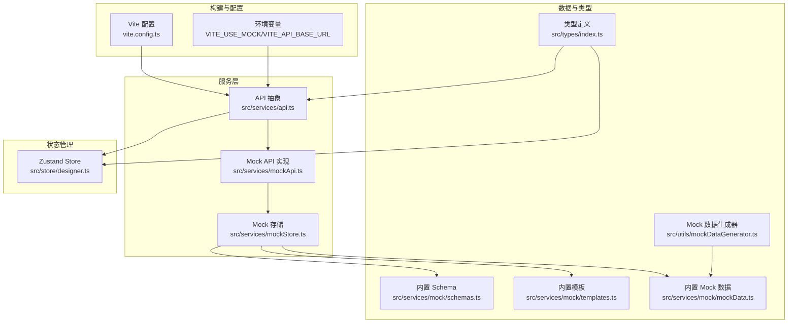
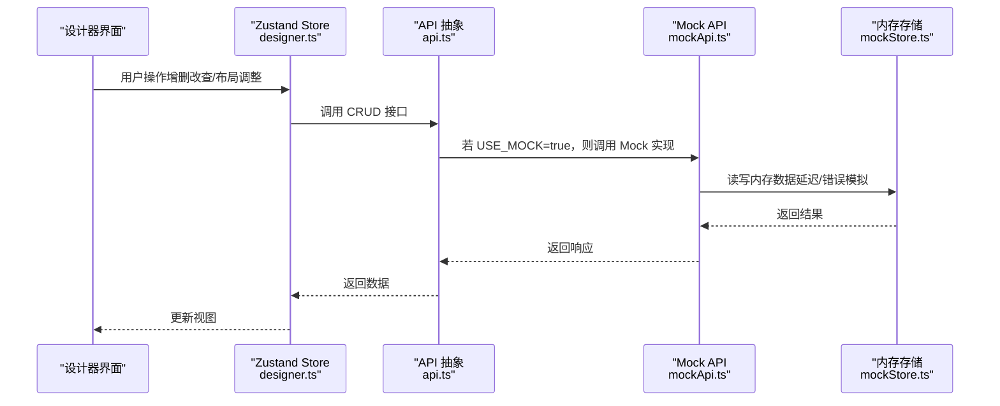
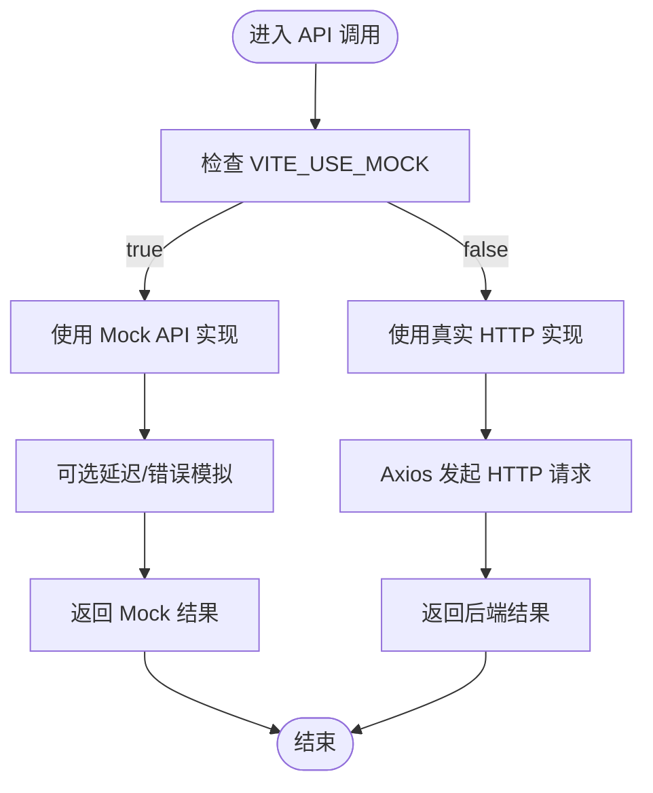
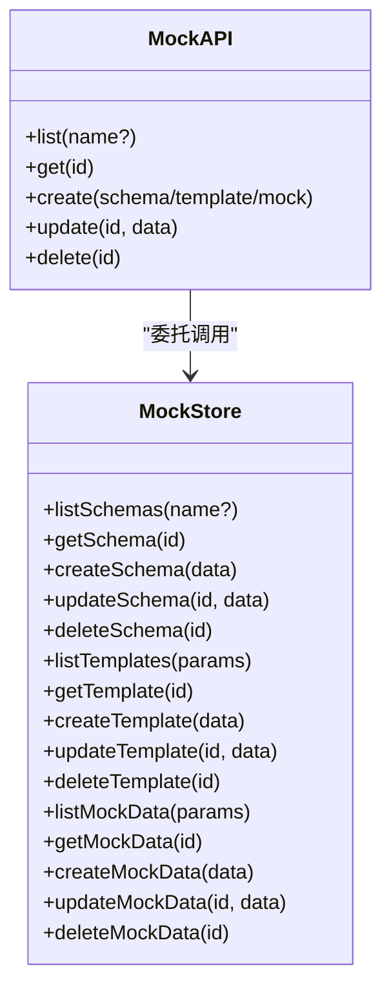
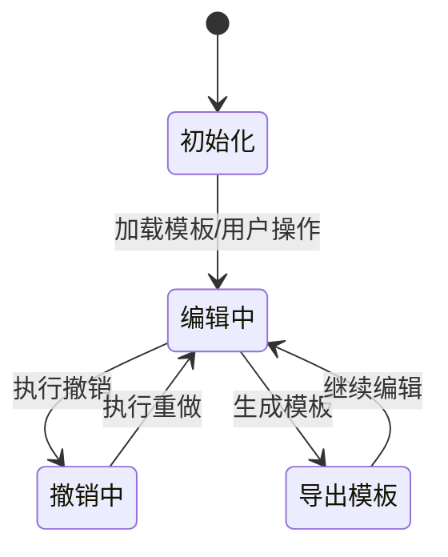
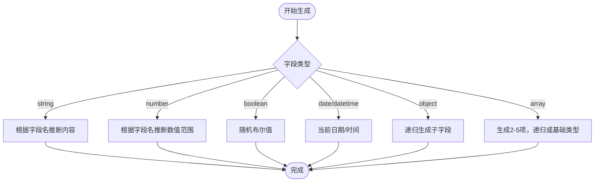
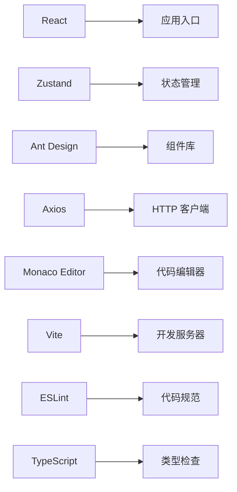

# 扩展测试与调试

<cite>
**本文档引用的文件**
- [package.json](file://designer/package.json)
- [vite.config.ts](file://designer/vite.config.ts)
- [api.ts](file://designer/src/services/api.ts)
- [mockApi.ts](file://designer/src/services/mockApi.ts)
- [mockStore.ts](file://designer/src/services/mockStore.ts)
- [mock/index.ts](file://designer/src/services/mock/index.ts)
- [schemas.ts](file://designer/src/services/mock/schemas.ts)
- [templates.ts](file://designer/src/services/mock/templates.ts)
- [mockData.ts](file://designer/src/services/mock/mockData.ts)
- [mockDataGenerator.ts](file://designer/src/utils/mockDataGenerator.ts)
- [designer.ts](file://designer/src/store/designer.ts)
- [index.ts](file://designer/src/types/index.ts)
</cite>

## 目录
1. [引言](#引言)
2. [项目结构](#项目结构)
3. [核心组件](#核心组件)
4. [架构概览](#架构概览)
5. [详细组件分析](#详细组件分析)
6. [依赖分析](#依赖分析)
7. [性能考虑](#性能考虑)
8. [故障排除指南](#故障排除指南)
9. [结论](#结论)
10. [附录](#附录)

## 引言
本指南面向扩展开发团队，提供一套完整的测试与调试方法论，覆盖单元测试、集成测试、调试工具使用、Mock 数据生成与使用、性能测试与基准测试，以及发布前质量保证流程。项目采用前端 Mock API 与内存存储，结合 Vite 插件实现本地开发与演示站点的统一测试体验。

## 项目结构
项目采用基于功能域的组织方式，核心测试相关模块包括：
- 服务层：API 抽象与 Mock 实现
- 存储层：Zustand 状态管理（设计器画布与模板）
- 工具层：Mock 数据生成器
- 类型层：统一的数据模型定义
- 构建层：Vite 配置与 Mock 插件

**图表来源**
- [vite.config.ts:1-29](file://designer/vite.config.ts#L1-L29)
- [api.ts:1-134](file://designer/src/services/api.ts#L1-L134)
- [mockApi.ts:1-103](file://designer/src/services/mockApi.ts#L1-L103)
- [mockStore.ts:1-135](file://designer/src/services/mockStore.ts#L1-L135)
- [schemas.ts:1-147](file://designer/src/services/mock/schemas.ts#L1-L147)
- [templates.ts:1-800](file://designer/src/services/mock/templates.ts#L1-L800)
- [mockData.ts:1-639](file://designer/src/services/mock/mockData.ts#L1-L639)
- [mockDataGenerator.ts:1-113](file://designer/src/utils/mockDataGenerator.ts#L1-L113)
- [designer.ts:1-773](file://designer/src/store/designer.ts#L1-L773)
- [index.ts:1-378](file://designer/src/types/index.ts#L1-L378)

**章节来源**
- [vite.config.ts:1-29](file://designer/vite.config.ts#L1-L29)
- [package.json:1-46](file://designer/package.json#L1-L46)

## 核心组件
- API 抽象层：根据环境变量动态选择真实 HTTP 或前端 Mock 实现，统一对外暴露 Schema、模板、Mock 数据的 CRUD 接口。
- Mock API 与存储：提供带延迟与错误模拟的内存实现，便于本地开发与演示站点测试。
- Zustand Store：管理设计器画布、模板、页面配置、网格缩放、撤销重做等状态。
- Mock 数据生成器：根据 Schema 自动推断字段含义，生成贴近业务的真实测试数据。
- 内置数据：提供多种 Schema、模板与 Mock 数据，覆盖典型业务场景与边界条件。

**章节来源**
- [api.ts:1-134](file://designer/src/services/api.ts#L1-L134)
- [mockApi.ts:1-103](file://designer/src/services/mockApi.ts#L1-L103)
- [mockStore.ts:1-135](file://designer/src/services/mockStore.ts#L1-L135)
- [designer.ts:1-773](file://designer/src/store/designer.ts#L1-L773)
- [mockDataGenerator.ts:1-113](file://designer/src/utils/mockDataGenerator.ts#L1-L113)
- [schemas.ts:1-147](file://designer/src/services/mock/schemas.ts#L1-L147)
- [templates.ts:1-800](file://designer/src/services/mock/templates.ts#L1-L800)
- [mockData.ts:1-639](file://designer/src/services/mock/mockData.ts#L1-L639)

## 架构概览
下图展示测试与调试相关的运行时架构：API 层根据环境变量切换实现；Mock API 使用内存存储；Zustand Store 提供状态持久化与历史快照；Mock 数据生成器与内置数据为组件渲染与打印预览提供输入。

**图表来源**
- [api.ts:131-134](file://designer/src/services/api.ts#L131-L134)
- [mockApi.ts:19-42](file://designer/src/services/mockApi.ts#L19-L42)
- [mockStore.ts:29-134](file://designer/src/services/mockStore.ts#L29-L134)
- [designer.ts:108-773](file://designer/src/store/designer.ts#L108-L773)

## 详细组件分析

### API 抽象与 Mock 切换机制
- 环境变量控制：通过 VITE_USE_MOCK 切换前端 Mock 与真实 HTTP；VITE_API_BASE_URL 控制后端基地址。
- 统一接口：Schema、模板、Mock 数据三类资源均提供 list/get/create/update/delete 方法，便于测试覆盖。
- 错误模拟：Mock API 对不存在资源抛出带响应结构的错误，模拟真实 HTTP 错误。

**图表来源**
- [api.ts:13-134](file://designer/src/services/api.ts#L13-L134)
- [mockApi.ts:4-14](file://designer/src/services/mockApi.ts#L4-L14)

**章节来源**
- [api.ts:1-134](file://designer/src/services/api.ts#L1-L134)

### Mock API 与内存存储
- Mock API：为 Schema、模板、Mock 数据提供 CRUD，内部使用延迟与错误模拟，提升测试稳定性与边界条件覆盖。
- 内存存储：集中管理三类数据，提供查询、过滤、增删改能力，并支持重置为默认数据。

**图表来源**
- [mockApi.ts:19-102](file://designer/src/services/mockApi.ts#L19-L102)
- [mockStore.ts:29-134](file://designer/src/services/mockStore.ts#L29-L134)

**章节来源**
- [mockApi.ts:1-103](file://designer/src/services/mockApi.ts#L1-L103)
- [mockStore.ts:1-135](file://designer/src/services/mockStore.ts#L1-L135)

### Zustand 设计器状态管理
- 功能覆盖：组件增删改、选择与多选、复制粘贴、层级管理、对齐与分布、网格与缩放、撤销重做、模板加载与生成。
- 历史机制：保存最多 20 步全量状态快照，支持撤销与重做。
- 区域感知：页头/内容/页脚三区域组件管理与约束。

**图表来源**
- [designer.ts:508-548](file://designer/src/store/designer.ts#L508-L548)

**章节来源**
- [designer.ts:1-773](file://designer/src/store/designer.ts#L1-L773)

### Mock 数据生成器
- 输入：Schema 字段定义（含类型、子字段、枚举等）。
- 输出：与 Schema 结构匹配的测试数据，依据字段名推断内容语义（如姓名、电话、邮箱、地址、编号、URL、状态等）。
- 复杂类型：对象与数组递归生成，数组长度随机（2-5），子元素遵循上述规则。

**图表来源**
- [mockDataGenerator.ts:3-21](file://designer/src/utils/mockDataGenerator.ts#L3-L21)

**章节来源**
- [mockDataGenerator.ts:1-113](file://designer/src/utils/mockDataGenerator.ts#L1-L113)

### 内置数据与测试场景
- Schema：销售出库单、采购订单（嵌套对象）等，覆盖复杂嵌套与枚举。
- 模板：A4、快递面单、产品标签、页眉页脚等，覆盖不同页面尺寸与布局。
- Mock 数据：标准样例、大数据量、批量打印、嵌套对象、连续纸等，覆盖边界与性能场景。

**章节来源**
- [schemas.ts:1-147](file://designer/src/services/mock/schemas.ts#L1-L147)
- [templates.ts:1-800](file://designer/src/services/mock/templates.ts#L1-L800)
- [mockData.ts:1-639](file://designer/src/services/mock/mockData.ts#L1-L639)

## 依赖分析
- 构建与运行时依赖：React、Zustand、Ant Design、Axios、Monaco Editor 等。
- 开发依赖：Vite、React 插件、TypeScript、ESLint 等。
- Mock 插件：Vite Mock Server 插件，提供本地 Mock API 服务与环境变量注入。

**图表来源**
- [package.json:13-44](file://designer/package.json#L13-L44)
- [vite.config.ts:1-29](file://designer/vite.config.ts#L1-L29)

**章节来源**
- [package.json:1-46](file://designer/package.json#L1-L46)
- [vite.config.ts:1-29](file://designer/vite.config.ts#L1-L29)

## 性能考虑
- 渲染性能
  - 大表格与大数据量：内置 Mock 数据包含大量明细项，可用于验证表格渲染与滚动性能。
  - 连续纸与多页：内置模板覆盖连续纸与页眉页脚场景，验证跨页渲染与分页策略。
- 内存使用
  - Zustand 历史快照：最多保存 20 步全量快照，注意在长会话中清理历史或限制操作频率。
  - Mock 数据体积：内置 Mock 数据体量较大，建议在测试中按需加载或分批加载。
- 响应时间
  - Mock API 延迟：通过可配置延迟模拟网络抖动，便于评估前端节流与加载状态。
  - 错误路径：通过 404 错误模拟与异常处理，验证错误提示与降级策略。

[本节为通用性能讨论，无需列出具体文件来源]

## 故障排除指南
- Mock 切换无效
  - 确认 VITE_USE_MOCK 环境变量设置正确；演示模式下由 Vite 插件强制注入。
- 网络请求失败
  - 检查 VITE_API_BASE_URL；若使用 Mock，确保未误设为真实后端地址。
- 数据不更新
  - 确认 Mock 存储未被意外重置；必要时调用重置函数恢复默认数据。
- 撤销/重做异常
  - 检查历史索引与快照一致性；避免跨区域对齐导致的状态不一致。
- 调试工具
  - 浏览器开发者工具：检查网络请求、Console 错误、性能面板。
  - React DevTools：查看组件树、Props/State 变化与渲染次数。
  - 专用调试面板：设计器内置调试面板用于观察组件布局与绑定数据。

**章节来源**
- [api.ts:13-20](file://designer/src/services/api.ts#L13-L20)
- [mockStore.ts:18-23](file://designer/src/services/mockStore.ts#L18-L23)
- [designer.ts:508-548](file://designer/src/store/designer.ts#L508-L548)

## 结论
本项目通过 API 抽象与 Mock 切换、Zustand 状态管理、Mock 数据生成与内置数据，形成了完善的测试与调试基础设施。建议在开发过程中充分利用 Mock 数据与内置模板，结合浏览器与 React DevTools 进行端到端验证，并通过性能测试与回归测试保障质量。

[本节为总结性内容，无需列出具体文件来源]

## 附录

### 单元测试编写指南
- 测试框架选择
  - 推荐使用 Vitest（与 Vite 生态契合）或 Jest（通用生态成熟）。
- 测试用例设计
  - 覆盖 Mock API 的 CRUD、延迟与错误分支。
  - 覆盖 Zustand Store 的状态变更、历史快照与边界条件。
  - 覆盖 Mock 数据生成器的类型分支与边界值。
- 模拟数据准备
  - 使用内置 Schema 与模板作为输入，结合 Mock 数据生成器构造多样化测试数据。

**章节来源**
- [mockApi.ts:1-103](file://designer/src/services/mockApi.ts#L1-L103)
- [mockStore.ts:1-135](file://designer/src/services/mockStore.ts#L1-L135)
- [mockDataGenerator.ts:1-113](file://designer/src/utils/mockDataGenerator.ts#L1-L113)
- [designer.ts:1-773](file://designer/src/store/designer.ts#L1-L773)

### 集成测试实施策略
- 组件间交互测试
  - 通过 Zustand Store 触发组件增删改，验证 Mock API 的联动更新。
- 数据流测试
  - 以内置模板为载体，验证数据绑定、管道转换与渲染输出。
- 边界条件测试
  - 使用大数据量 Mock 数据与复杂嵌套 Schema，验证表格与布局稳定性。

**章节来源**
- [templates.ts:1-800](file://designer/src/services/mock/templates.ts#L1-L800)
- [mockData.ts:1-639](file://designer/src/services/mock/mockData.ts#L1-L639)
- [schemas.ts:1-147](file://designer/src/services/mock/schemas.ts#L1-L147)

### 调试工具使用指南
- 浏览器开发者工具
  - Network：观察 Mock API 请求与响应、延迟与错误。
  - Elements：检查组件渲染与样式。
  - Performance：分析渲染性能与内存占用。
- React DevTools
  - Profiler：识别高成本组件与频繁重渲染。
  - Components：查看组件 Props/State 变化。
- 专用调试面板
  - 设计器内置调试面板：观察组件布局、绑定路径与数据预览。

**章节来源**
- [designer.ts:1-773](file://designer/src/store/designer.ts#L1-L773)

### Mock 数据生成与使用
- 模拟 API 响应
  - 使用 Mock API 的 list/get/create/update/delete，结合内置 Schema 与模板。
- 测试数据构造
  - 使用 Mock 数据生成器根据 Schema 自动生成测试数据。
- 测试环境配置
  - 通过 VITE_USE_MOCK 与 VITE_API_BASE_URL 控制环境行为。

**章节来源**
- [mockApi.ts:1-103](file://designer/src/services/mockApi.ts#L1-L103)
- [mockDataGenerator.ts:1-113](file://designer/src/utils/mockDataGenerator.ts#L1-L113)
- [api.ts:13-20](file://designer/src/services/api.ts#L13-L20)

### 性能测试与基准测试
- 渲染性能评估
  - 使用内置大数据量 Mock 数据与复杂模板，测量渲染时间与帧率。
- 内存使用监控
  - 监控长时间操作后的内存增长，优化历史快照与组件卸载。
- 响应时间测试
  - 通过可配置延迟模拟网络波动，评估前端节流与加载状态。

**章节来源**
- [mockData.ts:1-639](file://designer/src/services/mock/mockData.ts#L1-L639)
- [mockApi.ts:4-7](file://designer/src/services/mockApi.ts#L4-L7)

### 发布前质量保证流程
- 代码审查
  - 关注 Mock 切换逻辑、错误处理与状态管理边界。
- 自动化测试
  - 单测覆盖 Mock API、Store 与数据生成器；集成测覆盖模板渲染与数据绑定。
- 回归测试
  - 使用内置数据与模板进行回归验证，确保新增功能不影响既有场景。

**章节来源**
- [api.ts:1-134](file://designer/src/services/api.ts#L1-L134)
- [designer.ts:1-773](file://designer/src/store/designer.ts#L1-L773)
- [mockData.ts:1-639](file://designer/src/services/mock/mockData.ts#L1-L639)