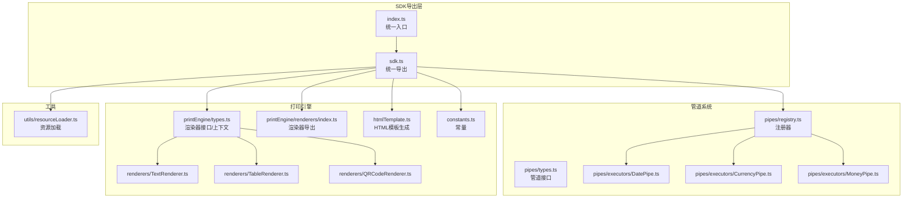
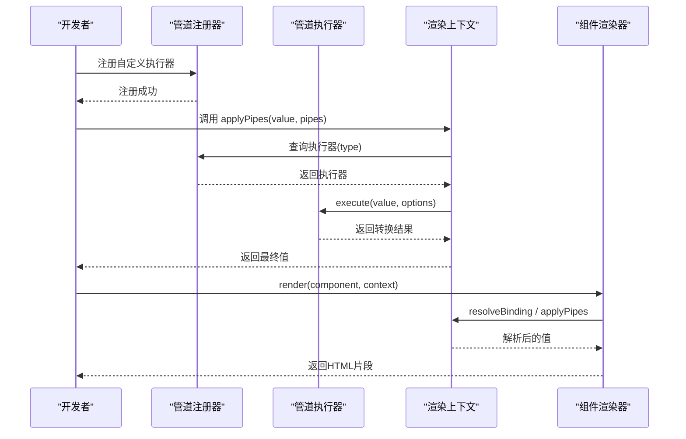
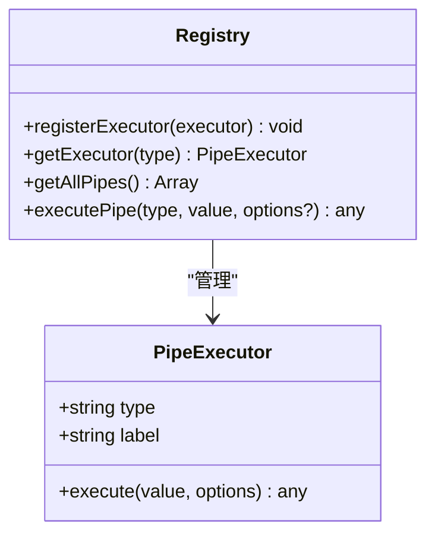
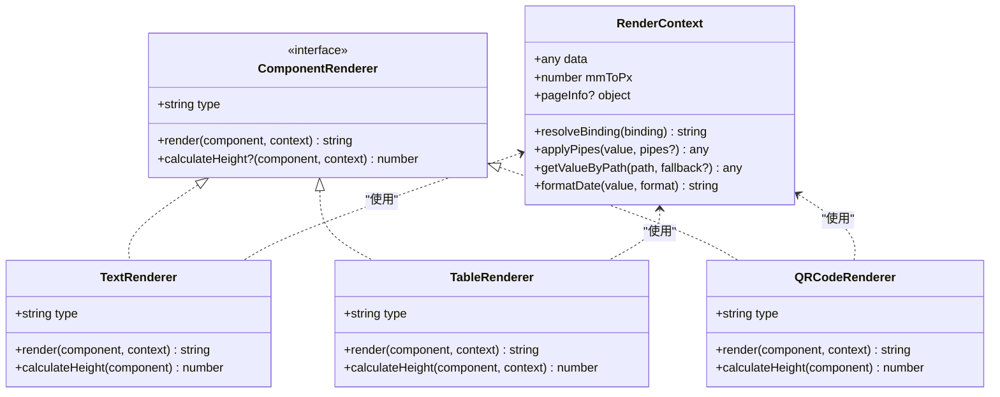
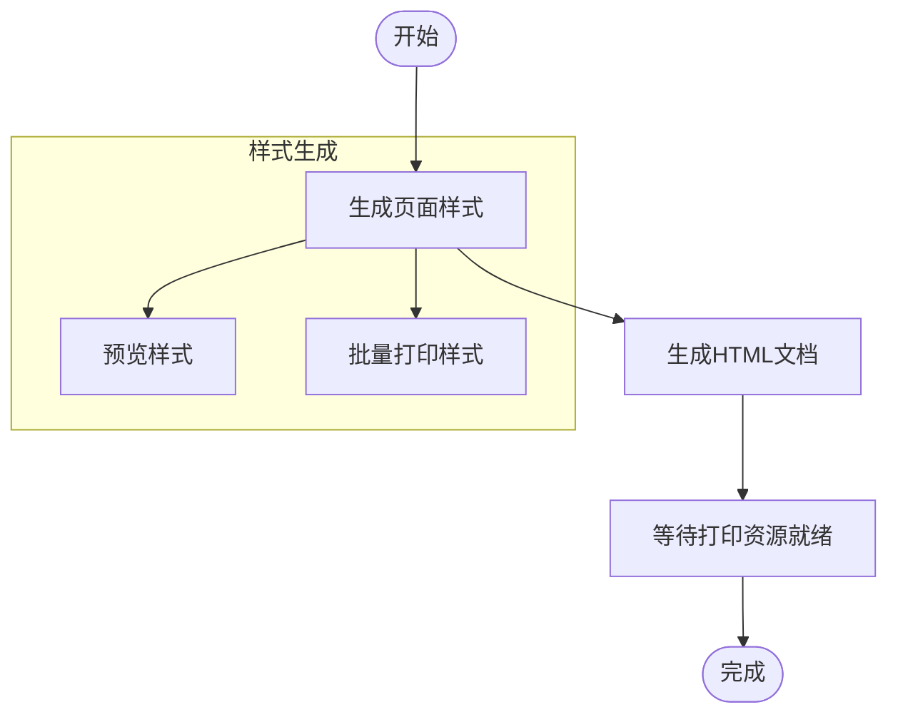
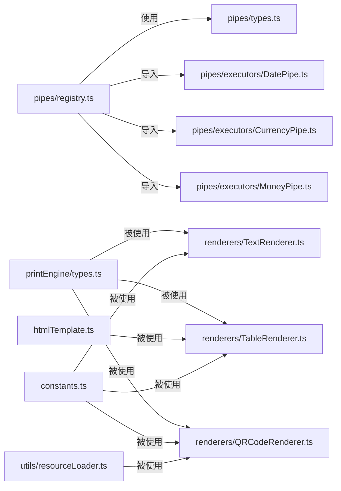

# 插件系统扩展

<cite>
**本文引用的文件**
- [sdk/src/index.ts](file://sdk/src/index.ts)
- [sdk/src/sdk.ts](file://sdk/src/sdk.ts)
- [sdk/src/pipes/registry.ts](file://sdk/src/pipes/registry.ts)
- [sdk/src/pipes/types.ts](file://sdk/src/pipes/types.ts)
- [sdk/src/pipes/executors/CurrencyPipe.ts](file://sdk/src/pipes/executors/CurrencyPipe.ts)
- [sdk/src/pipes/executors/DatePipe.ts](file://sdk/src/pipes/executors/DatePipe.ts)
- [sdk/src/pipes/executors/MoneyPipe.ts](file://sdk/src/pipes/executors/MoneyPipe.ts)
- [sdk/src/printEngine/types.ts](file://sdk/src/printEngine/types.ts)
- [sdk/src/printEngine/renderers/index.ts](file://sdk/src/printEngine/renderers/index.ts)
- [sdk/src/printEngine/renderers/TextRenderer.ts](file://sdk/src/printEngine/renderers/TextRenderer.ts)
- [sdk/src/printEngine/renderers/TableRenderer.ts](file://sdk/src/printEngine/renderers/TableRenderer.ts)
- [sdk/src/printEngine/renderers/QRCodeRenderer.ts](file://sdk/src/printEngine/renderers/QRCodeRenderer.ts)
- [sdk/src/printEngine/htmlTemplate.ts](file://sdk/src/printEngine/htmlTemplate.ts)
- [sdk/src/printEngine/constants.ts](file://sdk/src/printEngine/constants.ts)
- [sdk/src/utils/resourceLoader.ts](file://sdk/src/utils/resourceLoader.ts)
- [sdk/package.json](file://sdk/package.json)
</cite>

## 目录
1. [简介](#简介)
2. [项目结构](#项目结构)
3. [核心组件](#核心组件)
4. [架构总览](#架构总览)
5. [组件详解](#组件详解)
6. [依赖关系分析](#依赖关系分析)
7. [性能考量](#性能考量)
8. [故障排查指南](#故障排查指南)
9. [结论](#结论)
10. [附录](#附录)

## 简介
本指南面向希望在现有打印SDK中扩展“插件系统”的开发者，围绕以下目标展开：
- 深入解析插件系统的架构设计与扩展机制，重点说明注册器模式与插件生命周期管理。
- 明确插件开发规范：接口定义、配置格式、依赖管理与版本兼容策略。
- 提供完整的插件开发示例：插件类实现、初始化、卸载等关键步骤。
- 阐述插件注册流程、调用机制与插件间通信思路。
- 给出测试方法、调试技巧与性能监控建议。
- 总结最佳实践：插件隔离、错误处理、资源管理等。

## 项目结构
SDK采用模块化组织，核心分为三层：
- 管道系统（pipes）：负责数据转换与格式化，支持注册器模式动态扩展。
- 打印引擎（printEngine）：负责将模板与数据渲染为HTML，并通过统一的渲染器接口扩展组件类型。
- 工具与导出（utils、sdk、types）：提供资源加载、HTML模板生成、常量与类型定义，以及对外统一导出。

图表来源
- [sdk/src/index.ts:1-22](file://sdk/src/index.ts#L1-L22)
- [sdk/src/sdk.ts:1-63](file://sdk/src/sdk.ts#L1-L63)
- [sdk/src/pipes/registry.ts:1-64](file://sdk/src/pipes/registry.ts#L1-L64)
- [sdk/src/pipes/types.ts:1-30](file://sdk/src/pipes/types.ts#L1-L30)
- [sdk/src/printEngine/types.ts:1-116](file://sdk/src/printEngine/types.ts#L1-L116)
- [sdk/src/printEngine/renderers/index.ts:1-13](file://sdk/src/printEngine/renderers/index.ts#L1-L13)
- [sdk/src/printEngine/htmlTemplate.ts:1-274](file://sdk/src/printEngine/htmlTemplate.ts#L1-L274)
- [sdk/src/printEngine/constants.ts:1-113](file://sdk/src/printEngine/constants.ts#L1-L113)
- [sdk/src/utils/resourceLoader.ts:1-90](file://sdk/src/utils/resourceLoader.ts#L1-L90)

章节来源
- [sdk/src/index.ts:1-22](file://sdk/src/index.ts#L1-L22)
- [sdk/src/sdk.ts:1-63](file://sdk/src/sdk.ts#L1-L63)

## 核心组件
- 管道注册器与执行器
  - 注册器负责维护执行器映射、查询与批量导出，支持动态注册与默认内置注册。
  - 执行器接口定义了类型标识、显示名称与执行方法，便于扩展新管道。
- 渲染器接口与上下文
  - 统一的渲染器接口定义组件类型与渲染方法；渲染上下文提供数据解析、管道应用、尺寸换算等能力。
  - 渲染器导出集中管理，便于按需扩展新组件类型。
- HTML模板与常量
  - 统一生成打印样式与页面结构，提供批量打印与预览模式的差异化处理。
  - 常量模块集中管理单位换算、默认尺寸与组件默认配置。
- 资源加载工具
  - 提供图片加载等待与打印资源就绪检测，保障渲染质量与稳定性。

章节来源
- [sdk/src/pipes/registry.ts:1-64](file://sdk/src/pipes/registry.ts#L1-L64)
- [sdk/src/pipes/types.ts:1-30](file://sdk/src/pipes/types.ts#L1-L30)
- [sdk/src/printEngine/types.ts:1-116](file://sdk/src/printEngine/types.ts#L1-L116)
- [sdk/src/printEngine/renderers/index.ts:1-13](file://sdk/src/printEngine/renderers/index.ts#L1-L13)
- [sdk/src/printEngine/htmlTemplate.ts:1-274](file://sdk/src/printEngine/htmlTemplate.ts#L1-L274)
- [sdk/src/printEngine/constants.ts:1-113](file://sdk/src/printEngine/constants.ts#L1-L113)
- [sdk/src/utils/resourceLoader.ts:1-90](file://sdk/src/utils/resourceLoader.ts#L1-L90)

## 架构总览
插件系统以“注册器模式”为核心，结合“渲染器接口”实现可扩展的组件渲染体系。整体流程如下：
- 管道侧：通过注册器集中管理执行器，提供查询与执行能力；默认内置多个执行器，同时支持外部动态注册。
- 渲染侧：通过统一的渲染器接口与渲染上下文，将组件节点渲染为HTML字符串；渲染器导出集中管理，便于扩展新组件类型。
- 工具侧：提供HTML模板生成与资源加载能力，确保渲染输出符合打印要求。

图表来源
- [sdk/src/pipes/registry.ts:45-52](file://sdk/src/pipes/registry.ts#L45-L52)
- [sdk/src/pipes/types.ts:11-29](file://sdk/src/pipes/types.ts#L11-L29)
- [sdk/src/printEngine/types.ts:11-55](file://sdk/src/printEngine/types.ts#L11-L55)
- [sdk/src/printEngine/types.ts:61-82](file://sdk/src/printEngine/types.ts#L61-L82)

## 组件详解

### 管道系统（注册器模式）
- 注册器职责
  - 维护执行器映射表，提供注册、查询、导出与执行能力。
  - 内置默认执行器集合，保证开箱即用。
- 执行器接口
  - type：唯一标识。
  - label：展示名称。
  - execute：执行转换逻辑。
- 使用建议
  - 在应用启动阶段完成插件注册，避免运行期缺失。
  - 为执行器提供健壮的错误处理与降级策略。

图表来源
- [sdk/src/pipes/types.ts:11-29](file://sdk/src/pipes/types.ts#L11-L29)
- [sdk/src/pipes/registry.ts:12-52](file://sdk/src/pipes/registry.ts#L12-L52)

章节来源
- [sdk/src/pipes/registry.ts:1-64](file://sdk/src/pipes/registry.ts#L1-L64)
- [sdk/src/pipes/types.ts:1-30](file://sdk/src/pipes/types.ts#L1-L30)
- [sdk/src/pipes/executors/DatePipe.ts:1-35](file://sdk/src/pipes/executors/DatePipe.ts#L1-L35)
- [sdk/src/pipes/executors/CurrencyPipe.ts:1-17](file://sdk/src/pipes/executors/CurrencyPipe.ts#L1-L17)
- [sdk/src/pipes/executors/MoneyPipe.ts:1-62](file://sdk/src/pipes/executors/MoneyPipe.ts#L1-L62)

### 渲染器系统（组件插件）
- 接口与上下文
  - ComponentRenderer：定义组件类型与渲染方法，可选提供高度计算能力。
  - RenderContext：提供数据解析、管道应用、尺寸换算与页面信息。
- 内置渲染器
  - 文本、表格、二维码等组件均实现统一接口，便于扩展新的组件类型。
- 开发要点
  - 渲染器应尽量无副作用，避免访问全局状态。
  - 合理使用上下文提供的工具函数与常量，确保一致的渲染行为。

图表来源
- [sdk/src/printEngine/types.ts:11-82](file://sdk/src/printEngine/types.ts#L11-L82)
- [sdk/src/printEngine/renderers/TextRenderer.ts:10-60](file://sdk/src/printEngine/renderers/TextRenderer.ts#L10-L60)
- [sdk/src/printEngine/renderers/TableRenderer.ts:11-275](file://sdk/src/printEngine/renderers/TableRenderer.ts#L11-L275)
- [sdk/src/printEngine/renderers/QRCodeRenderer.ts:12-63](file://sdk/src/printEngine/renderers/QRCodeRenderer.ts#L12-L63)

章节来源
- [sdk/src/printEngine/types.ts:1-116](file://sdk/src/printEngine/types.ts#L1-L116)
- [sdk/src/printEngine/renderers/index.ts:1-13](file://sdk/src/printEngine/renderers/index.ts#L1-L13)
- [sdk/src/printEngine/renderers/TextRenderer.ts:1-60](file://sdk/src/printEngine/renderers/TextRenderer.ts#L1-L60)
- [sdk/src/printEngine/renderers/TableRenderer.ts:1-275](file://sdk/src/printEngine/renderers/TableRenderer.ts#L1-L275)
- [sdk/src/printEngine/renderers/QRCodeRenderer.ts:1-63](file://sdk/src/printEngine/renderers/QRCodeRenderer.ts#L1-L63)

### HTML模板与资源加载
- HTML模板
  - 提供预览与批量打印两种样式生成策略，统一页面结构与组件样式。
  - 支持从页面配置中提取尺寸信息，适配A4/A5/CUSTOM/CONTINUOUS等。
- 资源加载
  - 提供图片加载等待与打印资源就绪检测，避免因异步资源导致的渲染问题。

图表来源
- [sdk/src/printEngine/htmlTemplate.ts:81-218](file://sdk/src/printEngine/htmlTemplate.ts#L81-L218)
- [sdk/src/utils/resourceLoader.ts:12-89](file://sdk/src/utils/resourceLoader.ts#L12-L89)

章节来源
- [sdk/src/printEngine/htmlTemplate.ts:1-274](file://sdk/src/printEngine/htmlTemplate.ts#L1-L274)
- [sdk/src/utils/resourceLoader.ts:1-90](file://sdk/src/utils/resourceLoader.ts#L1-L90)

## 依赖关系分析
- 模块耦合
  - 管道注册器与执行器之间为松耦合，通过type键关联。
  - 渲染器与上下文为强依赖，渲染器通过上下文完成数据解析与格式化。
  - HTML模板与常量模块被渲染器间接依赖，确保渲染一致性。
- 外部依赖
  - 管道系统依赖decimal.js进行高精度计算。
  - 渲染器依赖qrcode与jsbarcode生成二维码与条形码。
- 版本与兼容
  - 通过统一导出与类型定义，降低版本升级带来的破坏性影响。
  - 建议在插件开发中遵循语义化版本，明确变更范围。

图表来源
- [sdk/src/pipes/registry.ts:7-64](file://sdk/src/pipes/registry.ts#L7-L64)
- [sdk/src/pipes/types.ts:5-6](file://sdk/src/pipes/types.ts#L5-L6)
- [sdk/src/printEngine/types.ts:5-6](file://sdk/src/printEngine/types.ts#L5-L6)
- [sdk/src/printEngine/renderers/TextRenderer.ts:5-8](file://sdk/src/printEngine/renderers/TextRenderer.ts#L5-L8)
- [sdk/src/printEngine/renderers/TableRenderer.ts:5-9](file://sdk/src/printEngine/renderers/TableRenderer.ts#L5-L9)
- [sdk/src/printEngine/renderers/QRCodeRenderer.ts:6-10](file://sdk/src/printEngine/renderers/QRCodeRenderer.ts#L6-L10)
- [sdk/src/printEngine/htmlTemplate.ts:6-7](file://sdk/src/printEngine/htmlTemplate.ts#L6-L7)
- [sdk/src/printEngine/constants.ts:8-113](file://sdk/src/printEngine/constants.ts#L8-L113)
- [sdk/src/utils/resourceLoader.ts:6-7](file://sdk/src/utils/resourceLoader.ts#L6-L7)

章节来源
- [sdk/src/pipes/registry.ts:1-64](file://sdk/src/pipes/registry.ts#L1-L64)
- [sdk/src/printEngine/types.ts:1-116](file://sdk/src/printEngine/types.ts#L1-L116)
- [sdk/src/printEngine/htmlTemplate.ts:1-274](file://sdk/src/printEngine/htmlTemplate.ts#L1-L274)
- [sdk/src/printEngine/constants.ts:1-113](file://sdk/src/printEngine/constants.ts#L1-L113)
- [sdk/src/utils/resourceLoader.ts:1-90](file://sdk/src/utils/resourceLoader.ts#L1-L90)
- [sdk/package.json:49-53](file://sdk/package.json#L49-L53)

## 性能考量
- 渲染性能
  - 合理使用calculateHeight估算组件高度，减少分页计算成本。
  - 控制表格数据规模与列数，避免过长的HTML拼接。
- 资源加载
  - 使用资源加载工具等待图片加载，避免打印时出现空白。
  - 二维码与条形码在渲染时同步生成，注意控制尺寸与并发数量。
- 管道执行
  - 执行器应避免复杂I/O操作，保持纯函数式转换，必要时进行缓存优化。

## 故障排查指南
- 管道执行器缺失
  - 现象：执行管道时报“未找到执行器”警告。
  - 处理：确认执行器已在启动阶段注册，或检查type是否正确。
- 渲染异常
  - 现象：组件渲染为空或样式错乱。
  - 处理：检查组件布局参数与上下文提供的页面信息，确保尺寸换算一致。
- 资源加载超时
  - 现象：图片加载超时或部分失败。
  - 处理：适当延长超时时间，检查图片URL与网络状态；关注错误日志中的失败统计。
- 金额计算异常
  - 现象：金额转换结果不准确。
  - 处理：使用高精度库进行计算，检查输入值与精度配置。

章节来源
- [sdk/src/pipes/registry.ts:45-52](file://sdk/src/pipes/registry.ts#L45-L52)
- [sdk/src/utils/resourceLoader.ts:28-42](file://sdk/src/utils/resourceLoader.ts#L28-L42)
- [sdk/src/printEngine/renderers/TableRenderer.ts:245-248](file://sdk/src/printEngine/renderers/TableRenderer.ts#L245-L248)

## 结论
该SDK通过注册器模式与统一渲染器接口，构建了清晰、可扩展的插件化架构。开发者可在不破坏现有功能的前提下，安全地扩展管道与组件类型。建议在实际工程中严格遵循开发规范、做好依赖与版本管理，并结合测试与监控持续优化插件质量。

## 附录

### 插件开发规范
- 接口定义
  - 管道执行器：实现type、label与execute方法。
  - 渲染器：实现type与render方法，必要时提供calculateHeight。
- 配置格式
  - 管道配置：包含type与options。
  - 组件节点：包含布局、样式、数据绑定与属性。
- 依赖管理
  - 明确外部依赖，避免引入不必要的包。
  - 使用统一导出，减少版本冲突风险。
- 版本兼容
  - 遵循语义化版本，变更前评估影响范围。
  - 通过类型定义与常量模块，降低破坏性更新概率。

章节来源
- [sdk/src/pipes/types.ts:11-29](file://sdk/src/pipes/types.ts#L11-L29)
- [sdk/src/printEngine/types.ts:61-82](file://sdk/src/printEngine/types.ts#L61-L82)
- [sdk/src/types.ts:66-75](file://sdk/src/types.ts#L66-L75)
- [sdk/src/types.ts:134-149](file://sdk/src/types.ts#L134-L149)

### 插件开发示例（步骤指引）
- 实现插件类
  - 管道执行器：定义type、label与execute。
  - 渲染器：定义type与render，必要时提供calculateHeight。
- 初始化
  - 在应用启动阶段注册执行器；在渲染前准备上下文与页面信息。
- 卸载
  - 清理定时器、事件监听与DOM引用，避免内存泄漏。
- 调用机制
  - 管道：通过注册器查询并执行。
  - 渲染：通过渲染器接口完成组件渲染。

章节来源
- [sdk/src/pipes/registry.ts:17-26](file://sdk/src/pipes/registry.ts#L17-L26)
- [sdk/src/pipes/registry.ts:45-52](file://sdk/src/pipes/registry.ts#L45-L52)
- [sdk/src/printEngine/types.ts:11-55](file://sdk/src/printEngine/types.ts#L11-L55)
- [sdk/src/printEngine/types.ts:61-82](file://sdk/src/printEngine/types.ts#L61-L82)

### 插件注册流程与调用机制
- 动态注册
  - 管道：调用注册器注册执行器。
  - 渲染器：在导出入口集中注册，便于按需扩展。
- 插件发现
  - 管道：通过getAllPipes导出可用列表。
  - 渲染器：通过导出入口集中管理。
- 插件间通信
  - 建议通过共享上下文或中间件传递数据，避免直接耦合。

章节来源
- [sdk/src/pipes/registry.ts:31-40](file://sdk/src/pipes/registry.ts#L31-L40)
- [sdk/src/printEngine/renderers/index.ts:5-12](file://sdk/src/printEngine/renderers/index.ts#L5-L12)

### 测试方法与调试技巧
- 测试
  - 单元测试：针对执行器的execute方法与渲染器的render/calculateHeight。
  - 集成测试：验证HTML模板生成与资源加载流程。
- 调试
  - 关注控制台日志，特别是资源加载与管道执行的警告与错误。
  - 使用断点定位渲染器内部的数据解析与样式拼装过程。

章节来源
- [sdk/src/utils/resourceLoader.ts:28-42](file://sdk/src/utils/resourceLoader.ts#L28-L42)
- [sdk/src/pipes/registry.ts:47-51](file://sdk/src/pipes/registry.ts#L47-L51)