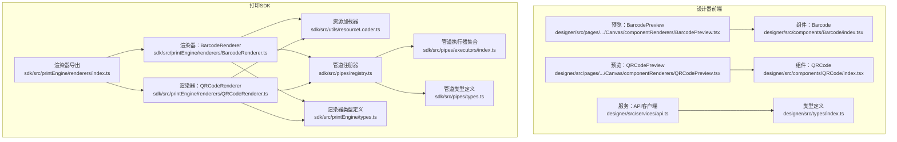
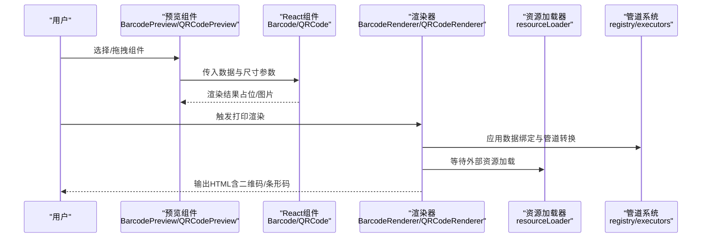
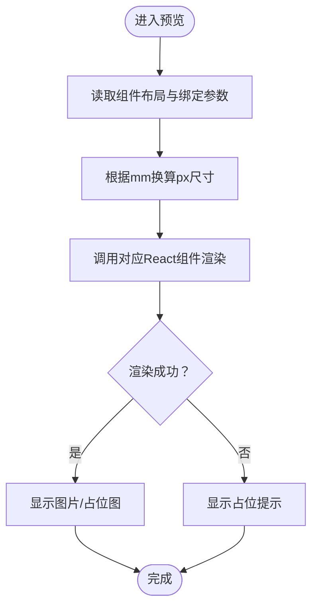
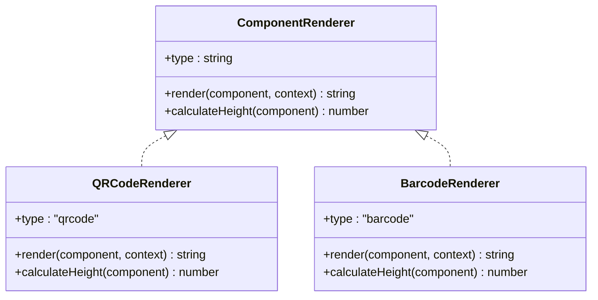
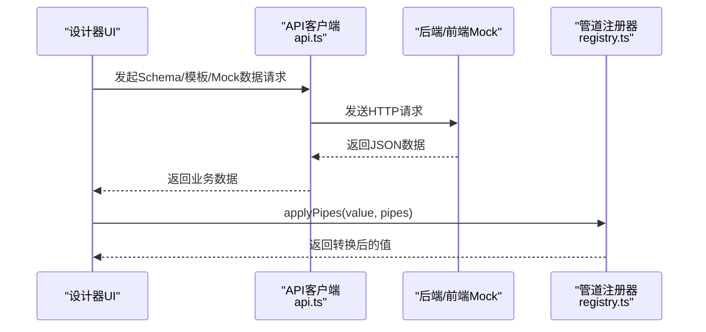
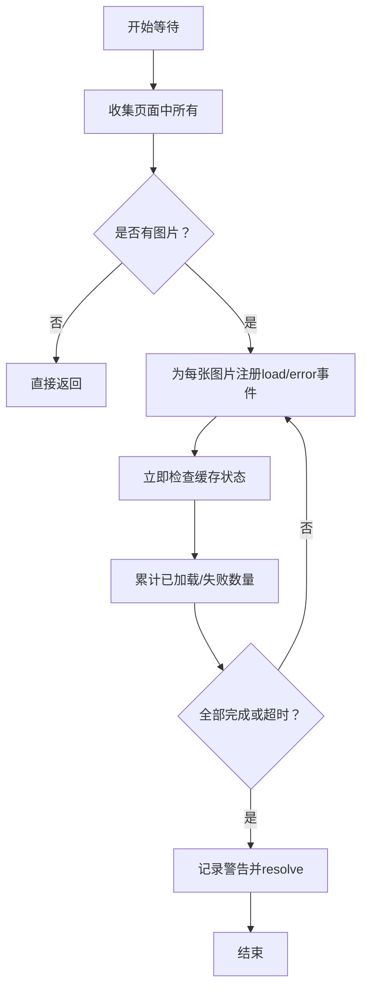
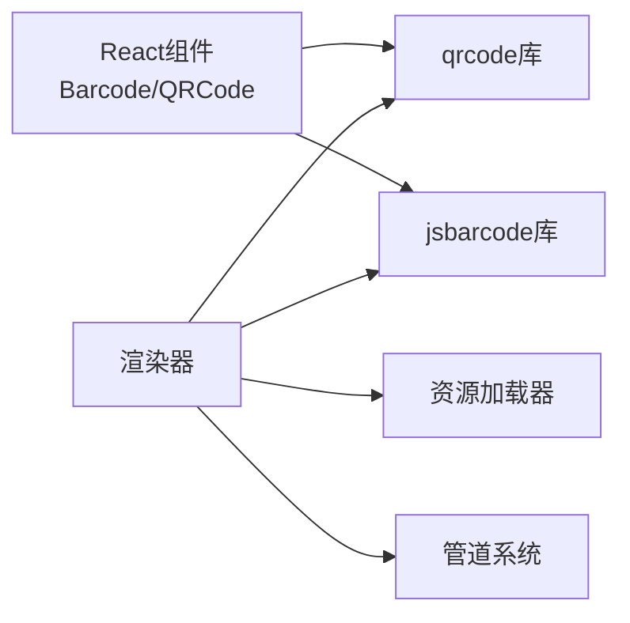

# 第三方组件集成方案

<cite>
**本文引用的文件**
- [designer/src/components/Barcode/index.tsx](file://designer/src/components/Barcode/index.tsx)
- [designer/src/components/QRCode/index.tsx](file://designer/src/components/QRCode/index.tsx)
- [designer/src/pages/Designer/components/Canvas/componentRenderers/BarcodePreview.tsx](file://designer/src/pages/Designer/components/Canvas/componentRenderers/BarcodePreview.tsx)
- [designer/src/pages/Designer/components/Canvas/componentRenderers/QRCodePreview.tsx](file://designer/src/pages/Designer/components/Canvas/componentRenderers/QRCodePreview.tsx)
- [sdk/src/printEngine/renderers/BarcodeRenderer.ts](file://sdk/src/printEngine/renderers/BarcodeRenderer.ts)
- [sdk/src/printEngine/renderers/QRCodeRenderer.ts](file://sdk/src/printEngine/renderers/QRCodeRenderer.ts)
- [sdk/src/printEngine/renderers/index.ts](file://sdk/src/printEngine/renderers/index.ts)
- [sdk/src/utils/resourceLoader.ts](file://sdk/src/utils/resourceLoader.ts)
- [sdk/src/pipes/registry.ts](file://sdk/src/pipes/registry.ts)
- [sdk/src/pipes/executors/index.ts](file://sdk/src/pipes/executors/index.ts)
- [sdk/src/pipes/types.ts](file://sdk/src/pipes/types.ts)
- [sdk/src/printEngine/types.ts](file://sdk/src/printEngine/types.ts)
- [designer/src/services/api.ts](file://designer/src/services/api.ts)
- [designer/src/types/index.ts](file://designer/src/types/index.ts)
</cite>

## 目录
1. [简介](#简介)
2. [项目结构](#项目结构)
3. [核心组件](#核心组件)
4. [架构总览](#架构总览)
5. [详细组件分析](#详细组件分析)
6. [依赖分析](#依赖分析)
7. [性能考量](#性能考量)
8. [故障排查指南](#故障排查指南)
9. [结论](#结论)
10. [附录](#附录)

## 简介
本指南面向需要将第三方组件库（如图表库、富文本编辑器、地图组件等）集成到打印设计器中的开发者，基于现有代码库的组件适配器设计模式、接口封装方法与兼容性策略，提供一套可复用的集成方案。内容涵盖：
- 组件适配器与渲染器接口设计
- 数据管道与外部API集成方法
- 资源加载器与缓存策略
- 组件注册与管理机制（动态加载、版本与依赖）
- 完整集成示例（以二维码/条形码为例）
- 测试、性能监控与故障排查建议

## 项目结构
打印设计器由“设计器前端”和“打印SDK”两部分组成：
- 设计器前端负责可视化编辑、组件预览与数据绑定
- 打印SDK负责将模板渲染为HTML并输出打印

**图表来源**
- [designer/src/pages/Designer/components/Canvas/componentRenderers/BarcodePreview.tsx:1-26](file://designer/src/pages/Designer/components/Canvas/componentRenderers/BarcodePreview.tsx#L1-L26)
- [designer/src/pages/Designer/components/Canvas/componentRenderers/QRCodePreview.tsx:1-17](file://designer/src/pages/Designer/components/Canvas/componentRenderers/QRCodePreview.tsx#L1-L17)
- [designer/src/components/Barcode/index.tsx:1-66](file://designer/src/components/Barcode/index.tsx#L1-L66)
- [designer/src/components/QRCode/index.tsx:1-52](file://designer/src/components/QRCode/index.tsx#L1-L52)
- [sdk/src/printEngine/renderers/index.ts:1-13](file://sdk/src/printEngine/renderers/index.ts#L1-L13)
- [sdk/src/printEngine/renderers/BarcodeRenderer.ts:1-63](file://sdk/src/printEngine/renderers/BarcodeRenderer.ts#L1-L63)
- [sdk/src/printEngine/renderers/QRCodeRenderer.ts:1-63](file://sdk/src/printEngine/renderers/QRCodeRenderer.ts#L1-L63)
- [sdk/src/utils/resourceLoader.ts:1-90](file://sdk/src/utils/resourceLoader.ts#L1-L90)
- [sdk/src/pipes/registry.ts:1-65](file://sdk/src/pipes/registry.ts#L1-L65)
- [sdk/src/pipes/executors/index.ts:1-45](file://sdk/src/pipes/executors/index.ts#L1-L45)
- [sdk/src/pipes/types.ts:1-30](file://sdk/src/pipes/types.ts#L1-L30)
- [sdk/src/printEngine/types.ts:1-116](file://sdk/src/printEngine/types.ts#L1-L116)

**章节来源**
- [designer/src/services/api.ts:1-134](file://designer/src/services/api.ts#L1-L134)
- [designer/src/types/index.ts:1-378](file://designer/src/types/index.ts#L1-L378)

## 核心组件
- 组件适配器与预览组件：设计器前端通过预览组件将模板中的组件映射到React组件，实现所见即所得的编辑体验。
- 渲染器：打印SDK中的渲染器负责将模板节点渲染为HTML字符串，并处理尺寸、样式与数据绑定。
- 资源加载器：统一等待图片等异步资源加载完成，确保打印前资源就绪。
- 数据管道：提供可扩展的管道执行器注册机制，支持数据格式化与转换。

**章节来源**
- [designer/src/pages/Designer/components/Canvas/componentRenderers/BarcodePreview.tsx:1-26](file://designer/src/pages/Designer/components/Canvas/componentRenderers/BarcodePreview.tsx#L1-L26)
- [designer/src/pages/Designer/components/Canvas/componentRenderers/QRCodePreview.tsx:1-17](file://designer/src/pages/Designer/components/Canvas/componentRenderers/QRCodePreview.tsx#L1-L17)
- [sdk/src/printEngine/renderers/BarcodeRenderer.ts:1-63](file://sdk/src/printEngine/renderers/BarcodeRenderer.ts#L1-L63)
- [sdk/src/printEngine/renderers/QRCodeRenderer.ts:1-63](file://sdk/src/printEngine/renderers/QRCodeRenderer.ts#L1-L63)
- [sdk/src/utils/resourceLoader.ts:1-90](file://sdk/src/utils/resourceLoader.ts#L1-L90)
- [sdk/src/pipes/registry.ts:1-65](file://sdk/src/pipes/registry.ts#L1-L65)

## 架构总览
第三方组件集成遵循“预览适配器 + 渲染器 + 资源/管道”的分层架构：
- 预览层：将模板节点映射为React组件，便于设计器交互与实时预览
- 渲染层：将模板节点渲染为HTML，处理数据绑定、样式与尺寸
- 资源层：统一等待外部资源加载，保证打印质量
- 管道层：提供可插拔的数据转换能力

**图表来源**
- [designer/src/pages/Designer/components/Canvas/componentRenderers/BarcodePreview.tsx:1-26](file://designer/src/pages/Designer/components/Canvas/componentRenderers/BarcodePreview.tsx#L1-L26)
- [designer/src/pages/Designer/components/Canvas/componentRenderers/QRCodePreview.tsx:1-17](file://designer/src/pages/Designer/components/Canvas/componentRenderers/QRCodePreview.tsx#L1-L17)
- [designer/src/components/Barcode/index.tsx:1-66](file://designer/src/components/Barcode/index.tsx#L1-L66)
- [designer/src/components/QRCode/index.tsx:1-52](file://designer/src/components/QRCode/index.tsx#L1-L52)
- [sdk/src/printEngine/renderers/BarcodeRenderer.ts:1-63](file://sdk/src/printEngine/renderers/BarcodeRenderer.ts#L1-L63)
- [sdk/src/printEngine/renderers/QRCodeRenderer.ts:1-63](file://sdk/src/printEngine/renderers/QRCodeRenderer.ts#L1-L63)
- [sdk/src/utils/resourceLoader.ts:1-90](file://sdk/src/utils/resourceLoader.ts#L1-L90)
- [sdk/src/pipes/registry.ts:1-65](file://sdk/src/pipes/registry.ts#L1-L65)

## 详细组件分析

### 组件适配器与预览组件
- 预览组件负责将模板节点映射到React组件，传递尺寸与内容参数，实现即时渲染与占位提示。
- 预览组件与实际渲染器共享数据绑定逻辑，确保设计阶段与打印阶段一致。

**图表来源**
- [designer/src/pages/Designer/components/Canvas/componentRenderers/BarcodePreview.tsx:1-26](file://designer/src/pages/Designer/components/Canvas/componentRenderers/BarcodePreview.tsx#L1-L26)
- [designer/src/pages/Designer/components/Canvas/componentRenderers/QRCodePreview.tsx:1-17](file://designer/src/pages/Designer/components/Canvas/componentRenderers/QRCodePreview.tsx#L1-L17)
- [designer/src/components/Barcode/index.tsx:1-66](file://designer/src/components/Barcode/index.tsx#L1-L66)
- [designer/src/components/QRCode/index.tsx:1-52](file://designer/src/components/QRCode/index.tsx#L1-L52)

**章节来源**
- [designer/src/pages/Designer/components/Canvas/componentRenderers/BarcodePreview.tsx:1-26](file://designer/src/pages/Designer/components/Canvas/componentRenderers/BarcodePreview.tsx#L1-L26)
- [designer/src/pages/Designer/components/Canvas/componentRenderers/QRCodePreview.tsx:1-17](file://designer/src/pages/Designer/components/Canvas/componentRenderers/QRCodePreview.tsx#L1-L17)
- [designer/src/components/Barcode/index.tsx:1-66](file://designer/src/components/Barcode/index.tsx#L1-L66)
- [designer/src/components/QRCode/index.tsx:1-52](file://designer/src/components/QRCode/index.tsx#L1-L52)

### 渲染器与组件适配器
- 渲染器实现统一接口，负责将组件节点渲染为HTML字符串，并处理尺寸与样式。
- 渲染器内部可调用资源加载器等待外部资源，或在浏览器环境中同步生成二维码/条形码为base64并内嵌到img标签。

**图表来源**
- [sdk/src/printEngine/types.ts:58-82](file://sdk/src/printEngine/types.ts#L58-L82)
- [sdk/src/printEngine/renderers/QRCodeRenderer.ts:12-62](file://sdk/src/printEngine/renderers/QRCodeRenderer.ts#L12-L62)
- [sdk/src/printEngine/renderers/BarcodeRenderer.ts:12-62](file://sdk/src/printEngine/renderers/BarcodeRenderer.ts#L12-L62)

**章节来源**
- [sdk/src/printEngine/renderers/QRCodeRenderer.ts:1-63](file://sdk/src/printEngine/renderers/QRCodeRenderer.ts#L1-L63)
- [sdk/src/printEngine/renderers/BarcodeRenderer.ts:1-63](file://sdk/src/printEngine/renderers/BarcodeRenderer.ts#L1-L63)
- [sdk/src/printEngine/renderers/index.ts:1-13](file://sdk/src/printEngine/renderers/index.ts#L1-L13)
- [sdk/src/printEngine/types.ts:58-82](file://sdk/src/printEngine/types.ts#L58-L82)

### 数据管道与外部API集成
- 管道注册器提供注册、查询与执行能力，支持内置与自定义管道执行器。
- 外部API通过统一的Axios客户端访问，支持开发/生产与Mock模式切换。

**图表来源**
- [designer/src/services/api.ts:1-134](file://designer/src/services/api.ts#L1-L134)
- [sdk/src/pipes/registry.ts:1-65](file://sdk/src/pipes/registry.ts#L1-L65)
- [sdk/src/pipes/executors/index.ts:1-45](file://sdk/src/pipes/executors/index.ts#L1-L45)
- [sdk/src/pipes/types.ts:1-30](file://sdk/src/pipes/types.ts#L1-L30)

**章节来源**
- [sdk/src/pipes/registry.ts:1-65](file://sdk/src/pipes/registry.ts#L1-L65)
- [sdk/src/pipes/executors/index.ts:1-45](file://sdk/src/pipes/executors/index.ts#L1-L45)
- [sdk/src/pipes/types.ts:1-30](file://sdk/src/pipes/types.ts#L1-L30)
- [designer/src/services/api.ts:1-134](file://designer/src/services/api.ts#L1-L134)

### 资源加载器与缓存策略
- 资源加载器统一等待图片资源加载完成，支持超时与错误统计，避免打印时出现未加载资源。
- 二维码/条形码在渲染阶段已同步生成为base64，减少运行时异步等待。

**图表来源**
- [sdk/src/utils/resourceLoader.ts:12-89](file://sdk/src/utils/resourceLoader.ts#L12-L89)

**章节来源**
- [sdk/src/utils/resourceLoader.ts:1-90](file://sdk/src/utils/resourceLoader.ts#L1-L90)

### 组件注册与管理机制
- 渲染器通过集中导出与类型约束实现注册与发现；新增组件只需实现统一接口并加入导出列表。
- 管道执行器通过注册器集中管理，支持动态扩展与版本化配置。

**章节来源**
- [sdk/src/printEngine/renderers/index.ts:1-13](file://sdk/src/printEngine/renderers/index.ts#L1-L13)
- [sdk/src/pipes/registry.ts:1-65](file://sdk/src/pipes/registry.ts#L1-L65)

## 依赖分析
- 预览组件依赖React与第三方库（如qrcode、jsbarcode），并在useEffect中进行异步生成与缓存。
- 渲染器依赖浏览器环境与第三方库，在渲染阶段同步生成图片并内嵌到HTML。
- 资源加载器与管道系统解耦于具体组件，通过接口契约实现松耦合。

**图表来源**
- [designer/src/components/Barcode/index.tsx:1-66](file://designer/src/components/Barcode/index.tsx#L1-L66)
- [designer/src/components/QRCode/index.tsx:1-52](file://designer/src/components/QRCode/index.tsx#L1-L52)
- [sdk/src/printEngine/renderers/QRCodeRenderer.ts:1-63](file://sdk/src/printEngine/renderers/QRCodeRenderer.ts#L1-L63)
- [sdk/src/printEngine/renderers/BarcodeRenderer.ts:1-63](file://sdk/src/printEngine/renderers/BarcodeRenderer.ts#L1-L63)
- [sdk/src/utils/resourceLoader.ts:1-90](file://sdk/src/utils/resourceLoader.ts#L1-L90)
- [sdk/src/pipes/registry.ts:1-65](file://sdk/src/pipes/registry.ts#L1-L65)

**章节来源**
- [designer/src/components/Barcode/index.tsx:1-66](file://designer/src/components/Barcode/index.tsx#L1-L66)
- [designer/src/components/QRCode/index.tsx:1-52](file://designer/src/components/QRCode/index.tsx#L1-L52)
- [sdk/src/printEngine/renderers/QRCodeRenderer.ts:1-63](file://sdk/src/printEngine/renderers/QRCodeRenderer.ts#L1-L63)
- [sdk/src/printEngine/renderers/BarcodeRenderer.ts:1-63](file://sdk/src/printEngine/renderers/BarcodeRenderer.ts#L1-L63)

## 性能考量
- 预览阶段缓存：预览组件使用memo与缓存键避免重复生成图片，降低CPU与内存消耗。
- 渲染阶段同步生成：二维码/条形码在渲染阶段同步生成为base64，减少打印时的异步等待。
- 资源等待超时：资源加载器设置超时阈值，避免长时间阻塞打印流程。
- 管道执行器：通过注册器集中管理，避免重复初始化与全局污染。

**章节来源**
- [designer/src/components/Barcode/index.tsx:15-34](file://designer/src/components/Barcode/index.tsx#L15-L34)
- [designer/src/components/QRCode/index.tsx:13-20](file://designer/src/components/QRCode/index.tsx#L13-L20)
- [sdk/src/utils/resourceLoader.ts:28-32](file://sdk/src/utils/resourceLoader.ts#L28-L32)
- [sdk/src/pipes/registry.ts:17-26](file://sdk/src/pipes/registry.ts#L17-L26)

## 故障排查指南
- 二维码/条形码渲染失败：检查内容参数、尺寸与格式配置，查看渲染器异常日志与占位提示。
- 图片资源未加载：确认URL可访问、CORS策略与缓存状态，调整资源等待超时参数。
- 数据管道未生效：确认管道类型与选项配置正确，检查注册器是否已注册对应执行器。
- Mock与真实API切换：确认环境变量设置，验证请求路径与响应格式一致性。

**章节来源**
- [sdk/src/printEngine/renderers/QRCodeRenderer.ts:52-56](file://sdk/src/printEngine/renderers/QRCodeRenderer.ts#L52-L56)
- [sdk/src/printEngine/renderers/BarcodeRenderer.ts:52-56](file://sdk/src/printEngine/renderers/BarcodeRenderer.ts#L52-L56)
- [sdk/src/utils/resourceLoader.ts:62-66](file://sdk/src/utils/resourceLoader.ts#L62-L66)
- [sdk/src/pipes/registry.ts:45-52](file://sdk/src/pipes/registry.ts#L45-L52)
- [designer/src/services/api.ts:13-134](file://designer/src/services/api.ts#L13-L134)

## 结论
通过“预览适配器 + 渲染器 + 资源/管道”的分层架构，第三方组件可被高效、稳定地集成到打印设计器中。预览与渲染保持一致的数据绑定与样式策略，资源加载器与管道系统提供可靠的运行时保障。按照本文提供的设计模式与最佳实践，可快速扩展图表库、富文本编辑器等组件。

## 附录

### 集成步骤清单（以二维码/条形码为例）
- 预览适配器
  - 新建预览组件，接收布局与绑定参数，调用第三方React组件渲染
  - 参考路径：[designer/src/pages/Designer/components/Canvas/componentRenderers/QRCodePreview.tsx:1-17](file://designer/src/pages/Designer/components/Canvas/componentRenderers/QRCodePreview.tsx#L1-L17)
- 渲染器
  - 实现ComponentRenderer接口，使用第三方库在渲染阶段同步生成图片
  - 参考路径：[sdk/src/printEngine/renderers/QRCodeRenderer.ts:1-63](file://sdk/src/printEngine/renderers/QRCodeRenderer.ts#L1-L63)
- 资源等待
  - 在打印前调用资源加载器等待图片资源，避免未加载
  - 参考路径：[sdk/src/utils/resourceLoader.ts:82-89](file://sdk/src/utils/resourceLoader.ts#L82-L89)
- 管道集成
  - 如需数据转换，通过管道注册器注册执行器并配置到组件绑定
  - 参考路径：[sdk/src/pipes/registry.ts:1-65](file://sdk/src/pipes/registry.ts#L1-L65)

### 兼容性与安全注意事项
- 预览与渲染参数保持一致，避免设计期与打印期差异
- 第三方库版本锁定与升级测试，确保渲染稳定性
- 资源加载器对跨域与CORS进行校验，避免安全风险
- 管道执行器需对输入进行健壮性校验，防止异常传播