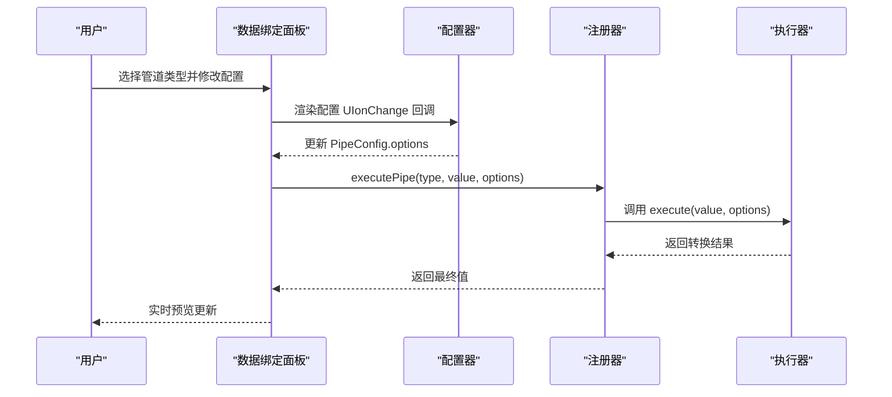
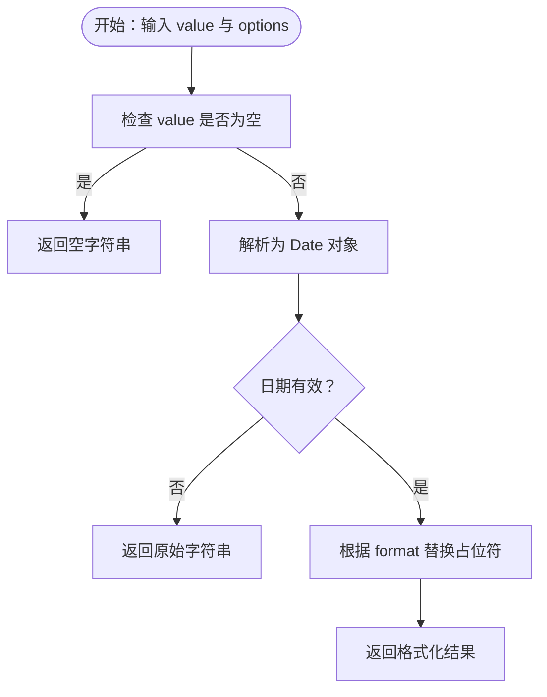
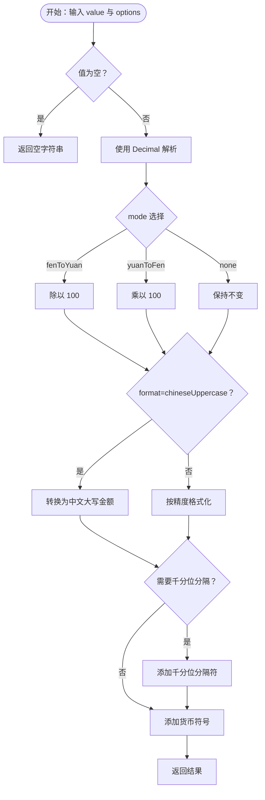
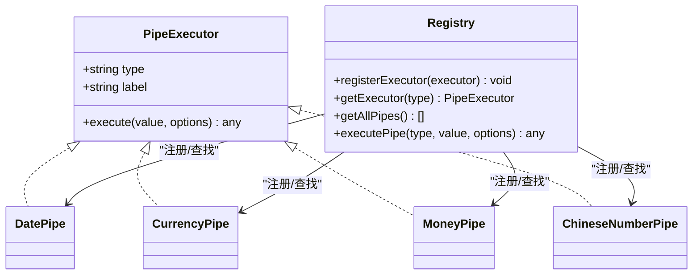

# 自定义数据管道执行器开发

<cite>
**本文引用的文件**
- [sdk/src/pipes/types.ts](file://sdk/src/pipes/types.ts)
- [sdk/src/pipes/registry.ts](file://sdk/src/pipes/registry.ts)
- [sdk/src/pipes/executors/index.ts](file://sdk/src/pipes/executors/index.ts)
- [sdk/src/pipes/executors/DatePipe.ts](file://sdk/src/pipes/executors/DatePipe.ts)
- [sdk/src/pipes/executors/CurrencyPipe.ts](file://sdk/src/pipes/executors/CurrencyPipe.ts)
- [sdk/src/pipes/executors/MoneyPipe.ts](file://sdk/src/pipes/executors/MoneyPipe.ts)
- [sdk/src/pipes/executors/ChineseNumberPipe.ts](file://sdk/src/pipes/executors/ChineseNumberPipe.ts)
- [designer/src/pipes/configurators/index.tsx](file://designer/src/pipes/configurators/index.tsx)
- [designer/src/pipes/configurators/DatePipeConfigurator.tsx](file://designer/src/pipes/configurators/DatePipeConfigurator.tsx)
- [designer/src/pipes/configurators/CurrencyPipeConfigurator.tsx](file://designer/src/pipes/configurators/CurrencyPipeConfigurator.tsx)
- [designer/src/pipes/configurators/MoneyPipeConfigurator.tsx](file://designer/src/pipes/configurators/MoneyPipeConfigurator.tsx)
- [designer/src/pipes/configurators/ChineseNumberPipeConfigurator.tsx](file://designer/src/pipes/configurators/ChineseNumberPipeConfigurator.tsx)
- [sdk/src/types.ts](file://sdk/src/types.ts)
- [designer/src/types/index.ts](file://designer/src/types/index.ts)
- [designer/src/pages/Designer/components/PropertyPanel/DataBindingSection.tsx](file://designer/src/pages/Designer/components/PropertyPanel/DataBindingSection.tsx)
</cite>

## 目录
1. [简介](#简介)
2. [项目结构](#项目结构)
3. [核心组件](#核心组件)
4. [架构总览](#架构总览)
5. [详细组件分析](#详细组件分析)
6. [依赖分析](#依赖分析)
7. [性能考虑](#性能考虑)
8. [故障排查指南](#故障排查指南)
9. [结论](#结论)
10. [附录](#附录)

## 简介
本指南面向希望扩展或自定义“数据管道执行器”的开发者，系统讲解了管道执行器的接口设计、实现规范、配置器设计、UI 集成与实时预览、错误处理、性能优化与缓存策略，并提供从接口定义到配置器实现的完整开发流程与示例路径，帮助快速实现日期格式化、货币转换、金额大写等常见场景。

## 项目结构
- SDK 端（执行器与类型定义）
  - 管道类型与执行器接口：[sdk/src/pipes/types.ts](file://sdk/src/pipes/types.ts)
  - 执行器注册与执行：[sdk/src/pipes/registry.ts](file://sdk/src/pipes/registry.ts)
  - 内置执行器集合与简单执行器：[sdk/src/pipes/executors/index.ts](file://sdk/src/pipes/executors/index.ts)
  - 具体执行器实现：日期、货币、金额、中文大写
    - [sdk/src/pipes/executors/DatePipe.ts](file://sdk/src/pipes/executors/DatePipe.ts)
    - [sdk/src/pipes/executors/CurrencyPipe.ts](file://sdk/src/pipes/executors/CurrencyPipe.ts)
    - [sdk/src/pipes/executors/MoneyPipe.ts](file://sdk/src/pipes/executors/MoneyPipe.ts)
    - [sdk/src/pipes/executors/ChineseNumberPipe.ts](file://sdk/src/pipes/executors/ChineseNumberPipe.ts)
  - SDK 类型定义（含 PipeConfig、DataBinding 等）：[sdk/src/types.ts](file://sdk/src/types.ts)

- 设计器端（配置器与 UI 集成）
  - 配置器接口与注册表、内置配置器：[designer/src/pipes/configurators/index.tsx](file://designer/src/pipes/configurators/index.tsx)
  - 各配置器实现：日期、货币、金额、中文大写
    - [designer/src/pipes/configurators/DatePipeConfigurator.tsx](file://designer/src/pipes/configurators/DatePipeConfigurator.tsx)
    - [designer/src/pipes/configurators/CurrencyPipeConfigurator.tsx](file://designer/src/pipes/configurators/CurrencyPipeConfigurator.tsx)
    - [designer/src/pipes/configurators/MoneyPipeConfigurator.tsx](file://designer/src/pipes/configurators/MoneyPipeConfigurator.tsx)
    - [designer/src/pipes/configurators/ChineseNumberPipeConfigurator.tsx](file://designer/src/pipes/configurators/ChineseNumberPipeConfigurator.tsx)
  - 设计器侧类型定义（与 SDK 类型保持一致）：[designer/src/types/index.ts](file://designer/src/types/index.ts)
  - 数据绑定面板（集成管道配置 UI 与实时预览）：[designer/src/pages/Designer/components/PropertyPanel/DataBindingSection.tsx](file://designer/src/pages/Designer/components/PropertyPanel/DataBindingSection.tsx)

```mermaid
graph TB
subgraph "SDK 端"
T["类型定义<br/>sdk/src/pipes/types.ts"]
R["注册器<br/>sdk/src/pipes/registry.ts"]
EIdx["执行器集合导出<br/>sdk/src/pipes/executors/index.ts"]
D["DatePipe<br/>sdk/src/pipes/executors/DatePipe.ts"]
C["CurrencyPipe<br/>sdk/src/pipes/executors/CurrencyPipe.ts"]
M["MoneyPipe<br/>sdk/src/pipes/executors/MoneyPipe.ts"]
CN["ChineseNumberPipe<br/>sdk/src/pipes/executors/ChineseNumberPipe.ts"]
ST["SDK 类型定义<br/>sdk/src/types.ts"]
end
subgraph "设计器端"
CI["配置器接口与注册表<br/>designer/src/pipes/configurators/index.tsx"]
DCfg["DatePipeConfigurator<br/>designer/src/pipes/configurators/DatePipeConfigurator.tsx"]
CCfg["CurrencyPipeConfigurator<br/>designer/src/pipes/configurators/CurrencyPipeConfigurator.tsx"]
MCfg["MoneyPipeConfigurator<br/>designer/src/pipes/configurators/MoneyPipeConfigurator.tsx"]
CNCfg["ChineseNumberPipeConfigurator<br/>designer/src/pipes/configurators/ChineseNumberPipeConfigurator.tsx"]
DT["设计器类型定义<br/>designer/src/types/index.ts"]
DBS["数据绑定面板<br/>designer/src/pages/Designer/components/PropertyPanel/DataBindingSection.tsx"]
end
T --> R
R --> D
R --> C
R --> M
R --> CN
EIdx --> D
EIdx --> C
EIdx --> M
EIdx --> CN
CI --> DCfg
CI --> CCfg
CI --> MCfg
CI --> CNCfg
ST --> DBS
DT --> DBS
CI --> DBS
R --> DBS
```

图表来源
- [sdk/src/pipes/types.ts:1-30](file://sdk/src/pipes/types.ts#L1-L30)
- [sdk/src/pipes/registry.ts:1-65](file://sdk/src/pipes/registry.ts#L1-L65)
- [sdk/src/pipes/executors/index.ts:1-45](file://sdk/src/pipes/executors/index.ts#L1-L45)
- [sdk/src/pipes/executors/DatePipe.ts:1-35](file://sdk/src/pipes/executors/DatePipe.ts#L1-L35)
- [sdk/src/pipes/executors/CurrencyPipe.ts:1-17](file://sdk/src/pipes/executors/CurrencyPipe.ts#L1-L17)
- [sdk/src/pipes/executors/MoneyPipe.ts:1-130](file://sdk/src/pipes/executors/MoneyPipe.ts#L1-L130)
- [sdk/src/pipes/executors/ChineseNumberPipe.ts:1-138](file://sdk/src/pipes/executors/ChineseNumberPipe.ts#L1-L138)
- [sdk/src/types.ts:77-86](file://sdk/src/types.ts#L77-L86)
- [designer/src/pipes/configurators/index.tsx:1-85](file://designer/src/pipes/configurators/index.tsx#L1-L85)
- [designer/src/pipes/configurators/DatePipeConfigurator.tsx:1-23](file://designer/src/pipes/configurators/DatePipeConfigurator.tsx#L1-L23)
- [designer/src/pipes/configurators/CurrencyPipeConfigurator.tsx:1-23](file://designer/src/pipes/configurators/CurrencyPipeConfigurator.tsx#L1-L23)
- [designer/src/pipes/configurators/MoneyPipeConfigurator.tsx:1-143](file://designer/src/pipes/configurators/MoneyPipeConfigurator.tsx#L1-L143)
- [designer/src/pipes/configurators/ChineseNumberPipeConfigurator.tsx:1-58](file://designer/src/pipes/configurators/ChineseNumberPipeConfigurator.tsx#L1-L58)
- [designer/src/types/index.ts:142-164](file://designer/src/types/index.ts#L142-L164)
- [designer/src/pages/Designer/components/PropertyPanel/DataBindingSection.tsx:1-127](file://designer/src/pages/Designer/components/PropertyPanel/DataBindingSection.tsx#L1-L127)

章节来源
- [sdk/src/pipes/types.ts:1-30](file://sdk/src/pipes/types.ts#L1-L30)
- [sdk/src/pipes/registry.ts:1-65](file://sdk/src/pipes/registry.ts#L1-L65)
- [sdk/src/pipes/executors/index.ts:1-45](file://sdk/src/pipes/executors/index.ts#L1-L45)
- [designer/src/pipes/configurators/index.tsx:1-85](file://designer/src/pipes/configurators/index.tsx#L1-L85)
- [designer/src/pages/Designer/components/PropertyPanel/DataBindingSection.tsx:1-127](file://designer/src/pages/Designer/components/PropertyPanel/DataBindingSection.tsx#L1-L127)

## 核心组件
- 管道执行器接口（PipeExecutor）
  - 负责执行数据转换逻辑，包含 type、label、execute 方法
  - 接口定义参见：[sdk/src/pipes/types.ts:11-29](file://sdk/src/pipes/types.ts#L11-L29)

- 管道注册器（Registry）
  - 提供注册、查询、遍历与执行管道的方法
  - 注册与执行逻辑参见：[sdk/src/pipes/registry.ts:17-52](file://sdk/src/pipes/registry.ts#L17-L52)

- 内置执行器集合
  - 包含日期、货币、金额、中文大写等执行器
  - 导出与简单执行器参见：[sdk/src/pipes/executors/index.ts:6-44](file://sdk/src/pipes/executors/index.ts#L6-L44)

- 管道配置（PipeConfig）
  - 结构包含 type 与 options，用于 UI 配置传递给执行器
  - 类型定义参见：[sdk/src/types.ts:77-80](file://sdk/src/types.ts#L77-L80)、[designer/src/types/index.ts:146-151](file://designer/src/types/index.ts#L146-L151)

章节来源
- [sdk/src/pipes/types.ts:11-29](file://sdk/src/pipes/types.ts#L11-L29)
- [sdk/src/pipes/registry.ts:17-52](file://sdk/src/pipes/registry.ts#L17-L52)
- [sdk/src/pipes/executors/index.ts:6-44](file://sdk/src/pipes/executors/index.ts#L6-L44)
- [sdk/src/types.ts:77-80](file://sdk/src/types.ts#L77-L80)
- [designer/src/types/index.ts:146-151](file://designer/src/types/index.ts#L146-L151)

## 架构总览
管道系统采用“执行器 + 配置器”的双层设计：
- 执行器（SDK）：负责实际的数据转换逻辑，通过统一接口与注册表管理
- 配置器（设计器）：负责渲染配置 UI，将用户输入映射为 PipeConfig.options
- 数据绑定面板：将配置器与执行器串联，支持实时预览与多管道链式执行

图表来源
- [designer/src/pages/Designer/components/PropertyPanel/DataBindingSection.tsx:20-127](file://designer/src/pages/Designer/components/PropertyPanel/DataBindingSection.tsx#L20-L127)
- [designer/src/pipes/configurators/index.tsx:69-84](file://designer/src/pipes/configurators/index.tsx#L69-L84)
- [sdk/src/pipes/registry.ts:45-52](file://sdk/src/pipes/registry.ts#L45-L52)
- [sdk/src/pipes/types.ts:22-28](file://sdk/src/pipes/types.ts#L22-L28)

## 详细组件分析

### 接口设计与实现规范
- PipeExecutor 接口
  - 字段与职责
    - type：管道类型标识，用于注册与查找
    - label：显示名称，用于 UI 下拉选择
    - execute(value, options?)：执行转换，返回任意类型
  - 参考路径：[sdk/src/pipes/types.ts:11-29](file://sdk/src/pipes/types.ts#L11-L29)

- 注册与执行
  - 注册：registerExecutor(executor)
  - 查询：getExecutor(type)
  - 遍历：getAllPipes() 用于 UI 下拉
  - 执行：executePipe(type, value, options)
  - 参考路径：[sdk/src/pipes/registry.ts:17-52](file://sdk/src/pipes/registry.ts#L17-L52)

- 参数处理机制
  - execute 方法接收两个参数：value（原始值）与 options（可选配置）
  - options 由配置器渲染并传入，执行器内部应做健壮性校验
  - 参考路径：[sdk/src/pipes/types.ts:22-28](file://sdk/src/pipes/types.ts#L22-L28)

章节来源
- [sdk/src/pipes/types.ts:11-29](file://sdk/src/pipes/types.ts#L11-L29)
- [sdk/src/pipes/registry.ts:17-52](file://sdk/src/pipes/registry.ts#L17-L52)

### 管道开发流程（从接口到配置器）
- 步骤一：定义执行器
  - 创建新的执行器对象，实现 PipeExecutor 接口
  - 示例参考：[sdk/src/pipes/executors/DatePipe.ts:7-34](file://sdk/src/pipes/executors/DatePipe.ts#L7-L34)
- 步骤二：注册执行器
  - 在注册表中注册新执行器
  - 参考现有注册方式：[sdk/src/pipes/registry.ts:56-64](file://sdk/src/pipes/registry.ts#L56-L64)
- 步骤三：编写配置器
  - 实现 PipeConfigurator 接口，renderConfig(config, onChange) 渲染 UI
  - 参考现有配置器：[designer/src/pipes/configurators/DatePipeConfigurator.tsx:9-22](file://designer/src/pipes/configurators/DatePipeConfigurator.tsx#L9-L22)
- 步骤四：注册配置器
  - 将配置器加入注册表
  - 参考现有注册方式：[designer/src/pipes/configurators/index.tsx:72-77](file://designer/src/pipes/configurators/index.tsx#L72-L77)
- 步骤五：在 UI 中使用
  - 数据绑定面板会根据 getAllPipes() 与 getConfigurator(type) 动态渲染
  - 参考路径：[designer/src/pages/Designer/components/PropertyPanel/DataBindingSection.tsx:80-118](file://designer/src/pages/Designer/components/PropertyPanel/DataBindingSection.tsx#L80-L118)

章节来源
- [sdk/src/pipes/executors/DatePipe.ts:7-34](file://sdk/src/pipes/executors/DatePipe.ts#L7-L34)
- [sdk/src/pipes/registry.ts:56-64](file://sdk/src/pipes/registry.ts#L56-L64)
- [designer/src/pipes/configurators/DatePipeConfigurator.tsx:9-22](file://designer/src/pipes/configurators/DatePipeConfigurator.tsx#L9-L22)
- [designer/src/pipes/configurators/index.tsx:72-77](file://designer/src/pipes/configurators/index.tsx#L72-L77)
- [designer/src/pages/Designer/components/PropertyPanel/DataBindingSection.tsx:80-118](file://designer/src/pages/Designer/components/PropertyPanel/DataBindingSection.tsx#L80-L118)

### 具体示例：日期格式化
- 执行器实现要点
  - 处理空值与非法日期
  - 默认格式与占位替换
  - 参考路径：[sdk/src/pipes/executors/DatePipe.ts:11-33](file://sdk/src/pipes/executors/DatePipe.ts#L11-L33)
- 配置器实现要点
  - 输入格式字符串（如 YYYY-MM-DD HH:mm:ss）
  - 参考路径：[designer/src/pipes/configurators/DatePipeConfigurator.tsx:12-20](file://designer/src/pipes/configurators/DatePipeConfigurator.tsx#L12-L20)

图表来源
- [sdk/src/pipes/executors/DatePipe.ts:11-33](file://sdk/src/pipes/executors/DatePipe.ts#L11-L33)

章节来源
- [sdk/src/pipes/executors/DatePipe.ts:11-33](file://sdk/src/pipes/executors/DatePipe.ts#L11-L33)
- [designer/src/pipes/configurators/DatePipeConfigurator.tsx:12-20](file://designer/src/pipes/configurators/DatePipeConfigurator.tsx#L12-L20)

### 具体示例：货币转换
- 执行器实现要点
  - 支持货币符号与精度
  - 参考路径：[sdk/src/pipes/executors/CurrencyPipe.ts:11-14](file://sdk/src/pipes/executors/CurrencyPipe.ts#L11-L14)
- 配置器实现要点
  - 输入货币符号
  - 参考路径：[designer/src/pipes/configurators/CurrencyPipeConfigurator.tsx:12-20](file://designer/src/pipes/configurators/CurrencyPipeConfigurator.tsx#L12-L20)

章节来源
- [sdk/src/pipes/executors/CurrencyPipe.ts:11-14](file://sdk/src/pipes/executors/CurrencyPipe.ts#L11-L14)
- [designer/src/pipes/configurators/CurrencyPipeConfigurator.tsx:12-20](file://designer/src/pipes/configurators/CurrencyPipeConfigurator.tsx#L12-L20)

### 具体示例：金额转换（分/元互转、中文大写、千分位、货币符号）
- 执行器实现要点
  - 模式切换：fenToYuan、yuanToFen、none
  - 精度与货币符号
  - 千分位分隔
  - 中文大写金额（含角分与整）
  - 错误处理与回退
  - 参考路径：[sdk/src/pipes/executors/MoneyPipe.ts:63-128](file://sdk/src/pipes/executors/MoneyPipe.ts#L63-L128)
- 配置器实现要点
  - 输出格式：数字/中文大写
  - 转换模式：分→元、元→分、不转换
  - 中文大写输出模式：仅大写、原值+大写（可配置连接符）
  - 数字格式专属：小数位数、货币符号、千分位分隔
  - 参考路径：[designer/src/pipes/configurators/MoneyPipeConfigurator.tsx:12-141](file://designer/src/pipes/configurators/MoneyPipeConfigurator.tsx#L12-L141)

图表来源
- [sdk/src/pipes/executors/MoneyPipe.ts:63-128](file://sdk/src/pipes/executors/MoneyPipe.ts#L63-L128)

章节来源
- [sdk/src/pipes/executors/MoneyPipe.ts:63-128](file://sdk/src/pipes/executors/MoneyPipe.ts#L63-L128)
- [designer/src/pipes/configurators/MoneyPipeConfigurator.tsx:12-141](file://designer/src/pipes/configurators/MoneyPipeConfigurator.tsx#L12-L141)

### 具体示例：中文大写数字
- 执行器实现要点
  - 支持整数与小数部分
  - 支持负数与单位后缀
  - 输出模式：仅大写、原值+大写（可配置连接符）
  - 参考路径：[sdk/src/pipes/executors/ChineseNumberPipe.ts:103-136](file://sdk/src/pipes/executors/ChineseNumberPipe.ts#L103-L136)
- 配置器实现要点
  - 输出模式选择与连接符配置
  - 单位后缀输入
  - 参考路径：[designer/src/pipes/configurators/ChineseNumberPipeConfigurator.tsx:14-56](file://designer/src/pipes/configurators/ChineseNumberPipeConfigurator.tsx#L14-L56)

章节来源
- [sdk/src/pipes/executors/ChineseNumberPipe.ts:103-136](file://sdk/src/pipes/executors/ChineseNumberPipe.ts#L103-L136)
- [designer/src/pipes/configurators/ChineseNumberPipeConfigurator.tsx:14-56](file://designer/src/pipes/configurators/ChineseNumberPipeConfigurator.tsx#L14-L56)

### UI 集成与实时预览
- 数据绑定面板
  - 提供“添加管道”下拉（基于 getAllPipes()）
  - 为每个管道渲染对应配置器 UI
  - onChange 回调更新 PipeConfig.options 并触发重新渲染
  - 参考路径：[designer/src/pages/Designer/components/PropertyPanel/DataBindingSection.tsx:20-127](file://designer/src/pages/Designer/components/PropertyPanel/DataBindingSection.tsx#L20-L127)
- 配置器注册表
  - 将配置器按 type 注册，便于动态查找
  - 参考路径：[designer/src/pipes/configurators/index.tsx:69-84](file://designer/src/pipes/configurators/index.tsx#L69-L84)

章节来源
- [designer/src/pages/Designer/components/PropertyPanel/DataBindingSection.tsx:20-127](file://designer/src/pages/Designer/components/PropertyPanel/DataBindingSection.tsx#L20-L127)
- [designer/src/pipes/configurators/index.tsx:69-84](file://designer/src/pipes/configurators/index.tsx#L69-L84)

## 依赖分析
- 组件耦合关系
  - 执行器与注册器：通过 type 建立强关联
  - 配置器与 UI：通过 renderConfig 与 onChange 建立弱耦合
  - 数据绑定面板：依赖注册器与配置器，实现 UI 与执行器的桥接
- 外部依赖
  - 数值计算：MoneyPipe 使用 decimal.js
  - UI 组件：Ant Design 的 Input/InputNumber/Radio/Checkbox/Select/Space 等

图表来源
- [sdk/src/pipes/types.ts:11-29](file://sdk/src/pipes/types.ts#L11-L29)
- [sdk/src/pipes/registry.ts:17-52](file://sdk/src/pipes/registry.ts#L17-L52)
- [sdk/src/pipes/executors/DatePipe.ts:7-34](file://sdk/src/pipes/executors/DatePipe.ts#L7-L34)
- [sdk/src/pipes/executors/CurrencyPipe.ts:7-16](file://sdk/src/pipes/executors/CurrencyPipe.ts#L7-L16)
- [sdk/src/pipes/executors/MoneyPipe.ts:59-129](file://sdk/src/pipes/executors/MoneyPipe.ts#L59-L129)
- [sdk/src/pipes/executors/ChineseNumberPipe.ts:99-137](file://sdk/src/pipes/executors/ChineseNumberPipe.ts#L99-L137)

章节来源
- [sdk/src/pipes/types.ts:11-29](file://sdk/src/pipes/types.ts#L11-L29)
- [sdk/src/pipes/registry.ts:17-52](file://sdk/src/pipes/registry.ts#L17-L52)
- [sdk/src/pipes/executors/DatePipe.ts:7-34](file://sdk/src/pipes/executors/DatePipe.ts#L7-L34)
- [sdk/src/pipes/executors/CurrencyPipe.ts:7-16](file://sdk/src/pipes/executors/CurrencyPipe.ts#L7-L16)
- [sdk/src/pipes/executors/MoneyPipe.ts:59-129](file://sdk/src/pipes/executors/MoneyPipe.ts#L59-L129)
- [sdk/src/pipes/executors/ChineseNumberPipe.ts:99-137](file://sdk/src/pipes/executors/ChineseNumberPipe.ts#L99-L137)

## 性能考虑
- 数值计算
  - 金额转换使用 decimal.js 保证高精度，避免浮点误差
  - 参考路径：[sdk/src/pipes/executors/MoneyPipe.ts:6](file://sdk/src/pipes/executors/MoneyPipe.ts#L6)
- 字符串处理
  - 日期格式化采用占位符替换，避免复杂正则
  - 参考路径：[sdk/src/pipes/executors/DatePipe.ts:26-32](file://sdk/src/pipes/executors/DatePipe.ts#L26-L32)
- UI 渲染
  - 配置器使用受控组件，onChange 精准更新 options，减少不必要的重渲染
  - 参考路径：[designer/src/pipes/configurators/MoneyPipeConfigurator.tsx:12-141](file://designer/src/pipes/configurators/MoneyPipeConfigurator.tsx#L12-L141)
- 缓存机制
  - 当前未实现执行器结果缓存；若存在高频重复计算场景，可在上层引入缓存策略（如基于 value+options 的键）

## 故障排查指南
- 执行器未找到
  - 现象：executePipe 会发出警告并回退为原始值
  - 排查：确认 type 是否正确、执行器是否已注册
  - 参考路径：[sdk/src/pipes/registry.ts:45-51](file://sdk/src/pipes/registry.ts#L45-L51)
- 日期格式化异常
  - 现象：非法日期返回原始字符串
  - 排查：确认输入可被 Date 解析、format 字符串合法
  - 参考路径：[sdk/src/pipes/executors/DatePipe.ts:17](file://sdk/src/pipes/executors/DatePipe.ts#L17)
- 金额转换异常
  - 现象：异常时记录错误并回退为原始字符串
  - 排查：确认数值可解析、模式与精度配置合理
  - 参考路径：[sdk/src/pipes/executors/MoneyPipe.ts:124-127](file://sdk/src/pipes/executors/MoneyPipe.ts#L124-L127)
- 中文大写异常
  - 现象：异常时记录警告并回退为原始字符串
  - 排查：确认数值有效、模式与连接符配置合理
  - 参考路径：[sdk/src/pipes/executors/ChineseNumberPipe.ts:132-135](file://sdk/src/pipes/executors/ChineseNumberPipe.ts#L132-L135)

章节来源
- [sdk/src/pipes/registry.ts:45-51](file://sdk/src/pipes/registry.ts#L45-L51)
- [sdk/src/pipes/executors/DatePipe.ts:17](file://sdk/src/pipes/executors/DatePipe.ts#L17)
- [sdk/src/pipes/executors/MoneyPipe.ts:124-127](file://sdk/src/pipes/executors/MoneyPipe.ts#L124-L127)
- [sdk/src/pipes/executors/ChineseNumberPipe.ts:132-135](file://sdk/src/pipes/executors/ChineseNumberPipe.ts#L132-L135)

## 结论
通过统一的 PipeExecutor 接口与注册器机制，结合插件化的配置器与数据绑定面板，系统实现了“可扩展、可配置、可预览”的数据管道体系。开发者只需遵循接口规范、完成执行器与配置器实现，并在注册表中登记，即可快速扩展新的管道能力，满足多样化的数据格式化需求。

## 附录
- 开发清单
  - 实现执行器：[sdk/src/pipes/types.ts:11-29](file://sdk/src/pipes/types.ts#L11-L29)
  - 注册执行器：[sdk/src/pipes/registry.ts:56-64](file://sdk/src/pipes/registry.ts#L56-L64)
  - 实现配置器：[designer/src/pipes/configurators/index.tsx:17-20](file://designer/src/pipes/configurators/index.tsx#L17-L20)
  - 注册配置器：[designer/src/pipes/configurators/index.tsx:72-77](file://designer/src/pipes/configurators/index.tsx#L72-L77)
  - 在 UI 中使用：[designer/src/pages/Designer/components/PropertyPanel/DataBindingSection.tsx:80-118](file://designer/src/pages/Designer/components/PropertyPanel/DataBindingSection.tsx#L80-L118)