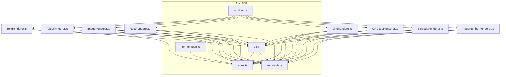
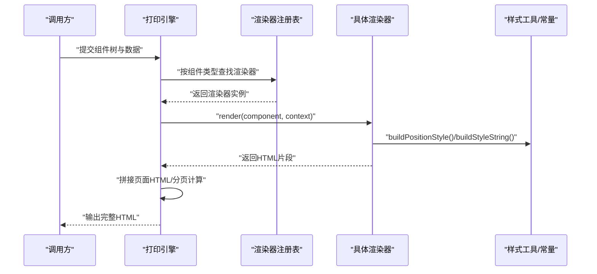
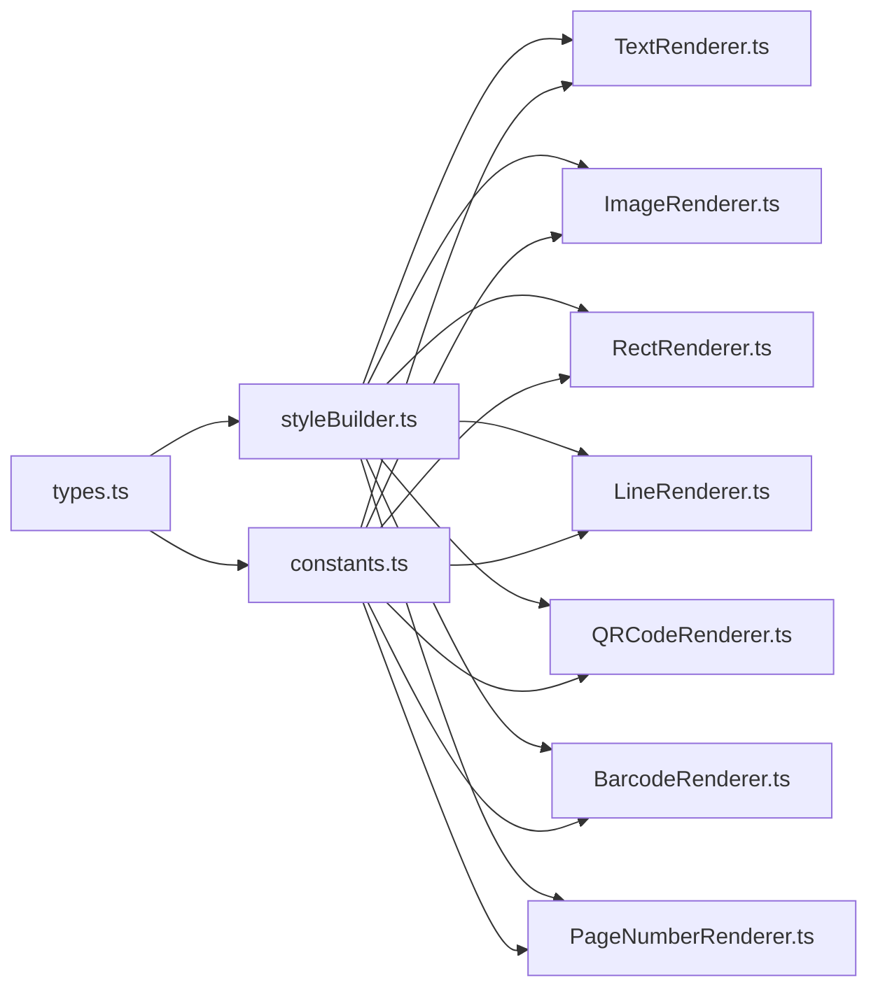

# 自定义渲染器开发

<cite>
**本文引用的文件**
- [renderers/index.ts](file://sdk/src/printEngine/renderers/index.ts)
- [types.ts](file://sdk/src/printEngine/types.ts)
- [constants.ts](file://sdk/src/printEngine/constants.ts)
- [htmlTemplate.ts](file://sdk/src/printEngine/htmlTemplate.ts)
- [styleBuilder.ts](file://sdk/src/printEngine/utils/styleBuilder.ts)
- [TextRenderer.ts](file://sdk/src/printEngine/renderers/TextRenderer.ts)
- [TableRenderer.ts](file://sdk/src/printEngine/renderers/TableRenderer.ts)
- [ImageRenderer.ts](file://sdk/src/printEngine/renderers/ImageRenderer.ts)
- [RectRenderer.ts](file://sdk/src/printEngine/renderers/RectRenderer.ts)
- [LineRenderer.ts](file://sdk/src/printEngine/renderers/LineRenderer.ts)
- [QRCodeRenderer.ts](file://sdk/src/printEngine/renderers/QRCodeRenderer.ts)
- [BarcodeRenderer.ts](file://sdk/src/printEngine/renderers/BarcodeRenderer.ts)
- [PageNumberRenderer.ts](file://sdk/src/printEngine/renderers/PageNumberRenderer.ts)
</cite>

## 目录
1. [简介](#简介)
2. [项目结构](#项目结构)
3. [核心组件](#核心组件)
4. [架构总览](#架构总览)
5. [详细组件分析](#详细组件分析)
6. [依赖关系分析](#依赖关系分析)
7. [性能考量](#性能考量)
8. [故障排查指南](#故障排查指南)
9. [结论](#结论)
10. [附录](#附录)

## 简介
本指南面向需要扩展或自定义打印引擎渲染能力的开发者，系统讲解渲染器接口设计与实现规范、生命周期管理、注册与调用流程、样式与事件处理、测试与调试方法以及性能优化建议。通过阅读本指南，您将能够：
- 理解渲染器接口与渲染上下文的设计原则
- 掌握从组件解析到 HTML 生成的完整流程
- 基于现有渲染器实现编写自定义渲染器
- 正确注册并使用自定义渲染器
- 针对复杂场景进行测试、调试与性能优化

## 项目结构
打印引擎位于 SDK 子模块中，渲染器集中于 printEngine/renderers 目录，并通过统一入口导出；样式构建与页面模板分别位于 utils 与 htmlTemplate 中；类型定义集中在 types.ts。

图表来源
- [renderers/index.ts:1-13](file://sdk/src/printEngine/renderers/index.ts#L1-L13)
- [types.ts:1-116](file://sdk/src/printEngine/types.ts#L1-L116)
- [constants.ts:1-113](file://sdk/src/printEngine/constants.ts#L1-L113)
- [styleBuilder.ts:1-54](file://sdk/src/printEngine/utils/styleBuilder.ts#L1-L54)
- [htmlTemplate.ts:1-274](file://sdk/src/printEngine/htmlTemplate.ts#L1-L274)

章节来源
- [renderers/index.ts:1-13](file://sdk/src/printEngine/renderers/index.ts#L1-L13)
- [types.ts:1-116](file://sdk/src/printEngine/types.ts#L1-L116)
- [constants.ts:1-113](file://sdk/src/printEngine/constants.ts#L1-L113)
- [styleBuilder.ts:1-54](file://sdk/src/printEngine/utils/styleBuilder.ts#L1-L54)
- [htmlTemplate.ts:1-274](file://sdk/src/printEngine/htmlTemplate.ts#L1-L274)

## 核心组件
本节聚焦渲染器接口与上下文，阐明自定义渲染器必须遵循的契约与可用能力。

- 渲染器接口 ComponentRenderer
  - 必须实现的属性与方法
    - type: 只读字符串，标识组件类型
    - render(component, context): 将组件节点渲染为 HTML 字符串
    - calculateHeight(component, context)?: 可选，用于分页计算组件高度（mm）
  - 参数说明
    - component: 组件节点，包含布局、样式、属性与数据绑定等
    - context: 渲染上下文，提供数据解析、管道应用、路径取值、日期格式化、单位换算与页面信息等能力

- 渲染上下文 RenderContext
  - data: 业务数据根对象
  - resolveBinding(binding): 解析数据绑定，返回最终值
  - applyPipes(value, pipes): 应用管道转换
  - getValueByPath(path, fallback): 按路径取值
  - formatDate(value, format): 格式化日期
  - mmToPx: mm 到 px 的换算系数
  - pageInfo: 页面信息（宽度、高度、页边距），用于计算可用宽度

- 样式与定位
  - 使用 buildPositionStyle(xMm, yMm, widthMm?, heightMm?, mmToPx?) 生成绝对定位样式
  - 使用 buildStyleString(styleObj) 将样式对象转为 CSS 字符串
  - 常量与默认值：COMPONENT_DEFAULT_SIZE、STYLE_DEFAULT、TABLE_DEFAULT 等

章节来源
- [types.ts:58-82](file://sdk/src/printEngine/types.ts#L58-L82)
- [types.ts:11-55](file://sdk/src/printEngine/types.ts#L11-L55)
- [styleBuilder.ts:13-53](file://sdk/src/printEngine/utils/styleBuilder.ts#L13-L53)
- [constants.ts:13-92](file://sdk/src/printEngine/constants.ts#L13-L92)

## 架构总览
渲染器的生命周期从“组件解析”到“HTML 生成”的整体流程如下：

图表来源
- [renderers/index.ts:5-12](file://sdk/src/printEngine/renderers/index.ts#L5-L12)
- [types.ts:61-82](file://sdk/src/printEngine/types.ts#L61-L82)
- [styleBuilder.ts:13-53](file://sdk/src/printEngine/utils/styleBuilder.ts#L13-L53)
- [constants.ts:8-46](file://sdk/src/printEngine/constants.ts#L8-L46)

## 详细组件分析

### 渲染器接口与通用实现模式
- 接口契约
  - 所有渲染器必须实现 ComponentRenderer 接口，提供 type 与 render 方法；如需分页，实现 calculateHeight
- 通用实现模式
  - 读取组件布局与样式，结合上下文解析绑定值
  - 使用 buildPositionStyle 生成绝对定位样式，再用 buildStyleString 转换为 CSS 字符串
  - 输出符合页面样式的 HTML 片段

```mermaid
classDiagram
class ComponentRenderer {
+string type
+render(component, context) string
+calculateHeight?(component, context) number
}
class TextRenderer {
+type = "text"
+render(component, context) string
+calculateHeight(component) number
}
class TableRenderer {
+type = "table"
+render(component, context) string
+calculateHeight(component, context) number
}
class ImageRenderer {
+type = "image"
+render(component, context) string
+calculateHeight(component) number
}
class RectRenderer {
+type = "rect"
+render(component, context) string
+calculateHeight(component) number
}
class LineRenderer {
+type = "line"
+render(component, context) string
+calculateHeight(component, context) number
}
class QRCodeRenderer {
+type = "qrcode"
+render(component, context) string
+calculateHeight(component) number
}
class BarcodeRenderer {
+type = "barcode"
+render(component, context) string
+calculateHeight(component) number
}
class PageNumberRenderer {
+type = "pageNumber"
+render(component, context) string
+calculateHeight(component) number
}
ComponentRenderer <|.. TextRenderer
ComponentRenderer <|.. TableRenderer
ComponentRenderer <|.. ImageRenderer
ComponentRenderer <|.. RectRenderer
ComponentRenderer <|.. LineRenderer
ComponentRenderer <|.. QRCodeRenderer
ComponentRenderer <|.. BarcodeRenderer
ComponentRenderer <|.. PageNumberRenderer
```

图表来源
- [types.ts:61-82](file://sdk/src/printEngine/types.ts#L61-L82)
- [TextRenderer.ts:10-59](file://sdk/src/printEngine/renderers/TextRenderer.ts#L10-L59)
- [TableRenderer.ts:11-274](file://sdk/src/printEngine/renderers/TableRenderer.ts#L11-L274)
- [ImageRenderer.ts:10-54](file://sdk/src/printEngine/renderers/ImageRenderer.ts#L10-L54)
- [RectRenderer.ts:10-38](file://sdk/src/printEngine/renderers/RectRenderer.ts#L10-L38)
- [LineRenderer.ts:10-58](file://sdk/src/printEngine/renderers/LineRenderer.ts#L10-L58)
- [QRCodeRenderer.ts:12-62](file://sdk/src/printEngine/renderers/QRCodeRenderer.ts#L12-L62)
- [BarcodeRenderer.ts:12-62](file://sdk/src/printEngine/renderers/BarcodeRenderer.ts#L12-L62)
- [PageNumberRenderer.ts:14-104](file://sdk/src/printEngine/renderers/PageNumberRenderer.ts#L14-L104)

章节来源
- [types.ts:61-82](file://sdk/src/printEngine/types.ts#L61-L82)
- [renderers/index.ts:5-12](file://sdk/src/printEngine/renderers/index.ts#L5-L12)

### 文本渲染器（TextRenderer）
- 关键点
  - 解析绑定值，支持 label 前缀
  - 使用 flex 布局实现对齐，基于 textAlign 映射到 justifyContent
  - 默认字体、颜色、行高来自 STYLE_DEFAULT
- 高度计算
  - 使用布局高度或默认值

章节来源
- [TextRenderer.ts:13-58](file://sdk/src/printEngine/renderers/TextRenderer.ts#L13-L58)
- [constants.ts:63-78](file://sdk/src/printEngine/constants.ts#L63-L78)
- [styleBuilder.ts:31-53](file://sdk/src/printEngine/utils/styleBuilder.ts#L31-L53)

### 表格渲染器（TableRenderer）
- 关键点
  - 支持跨页分段：优先使用 props._pageData；否则从绑定路径取值
  - 自动宽度：若未设置宽度，则占满可用宽度（考虑 xMm 偏移与页边距）
  - 表头/表体/合计行：按配置渲染，合计使用 Decimal.js 精确计算
  - 行高与表头高度：使用 TABLE_DEFAULT 常量乘以 mmToPx
- 高度计算
  - 基于 showHeader、showSummary 与数据行数估算

章节来源
- [TableRenderer.ts:14-150](file://sdk/src/printEngine/renderers/TableRenderer.ts#L14-L150)
- [TableRenderer.ts:203-257](file://sdk/src/printEngine/renderers/TableRenderer.ts#L203-L257)
- [TableRenderer.ts:259-273](file://sdk/src/printEngine/renderers/TableRenderer.ts#L259-L273)
- [constants.ts:51-58](file://sdk/src/printEngine/constants.ts#L51-L58)
- [constants.ts:83-92](file://sdk/src/printEngine/constants.ts#L83-L92)

### 图片渲染器（ImageRenderer）
- 关键点
  - 图片源优先级：绑定值 > props.src
  - 容器使用绝对定位，图片使用 object-fit 控制裁剪
  - 无图片时显示占位提示
- 高度计算
  - 使用布局高度或默认值

章节来源
- [ImageRenderer.ts:13-49](file://sdk/src/printEngine/renderers/ImageRenderer.ts#L13-L49)
- [constants.ts:19-22](file://sdk/src/printEngine/constants.ts#L19-L22)

### 矩形渲染器（RectRenderer）
- 关键点
  - 绝对定位容器，支持边框与背景
- 高度计算
  - 使用布局高度或默认值

章节来源
- [RectRenderer.ts:13-32](file://sdk/src/printEngine/renderers/RectRenderer.ts#L13-L32)
- [constants.ts:24-27](file://sdk/src/printEngine/constants.ts#L24-L27)

### 线条渲染器（LineRenderer）
- 关键点
  - 通过容器 flex 居中，内部使用 border 实现线条
  - 支持水平/垂直方向
- 高度计算
  - 返回外层容器高度（布局高度或默认）

章节来源
- [LineRenderer.ts:13-50](file://sdk/src/printEngine/renderers/LineRenderer.ts#L13-L50)
- [LineRenderer.ts:53-57](file://sdk/src/printEngine/renderers/LineRenderer.ts#L53-L57)
- [constants.ts:29-32](file://sdk/src/printEngine/constants.ts#L29-L32)

### 二维码渲染器（QRCodeRenderer）
- 关键点
  - 使用 qrcode 库在内存 canvas 上同步生成二维码，转为 base64 并嵌入 img
  - 异常时返回占位提示
- 高度计算
  - 使用布局高度或默认值

章节来源
- [QRCodeRenderer.ts:15-56](file://sdk/src/printEngine/renderers/QRCodeRenderer.ts#L15-L56)
- [constants.ts:34-35](file://sdk/src/printEngine/constants.ts#L34-L35)
- [constants.ts:107-112](file://sdk/src/printEngine/constants.ts#L107-L112)

### 条形码渲染器（BarcodeRenderer）
- 关键点
  - 使用 jsbarcode 在内存 canvas 上同步生成条形码，转为 base64 并嵌入 img
  - 异常时返回占位提示
- 高度计算
  - 使用布局高度或默认值

章节来源
- [BarcodeRenderer.ts:15-56](file://sdk/src/printEngine/renderers/BarcodeRenderer.ts#L15-L56)
- [constants.ts:37-40](file://sdk/src/printEngine/constants.ts#L37-L40)
- [constants.ts:95-104](file://sdk/src/printEngine/constants.ts#L95-L104)

### 页码渲染器（PageNumberRenderer）
- 关键点
  - 从 props._currentPage 与 _totalPages 注入的上下文中取值
  - 支持 simple/text/slash 三种格式，支持前缀/后缀与分隔符
  - 使用 HTML 转义防止 XSS
- 高度计算
  - 使用布局高度或默认值

章节来源
- [PageNumberRenderer.ts:17-56](file://sdk/src/printEngine/renderers/PageNumberRenderer.ts#L17-L56)
- [PageNumberRenderer.ts:66-94](file://sdk/src/printEngine/renderers/PageNumberRenderer.ts#L66-L94)
- [PageNumberRenderer.ts:99-103](file://sdk/src/printEngine/renderers/PageNumberRenderer.ts#L99-L103)
- [constants.ts:14-17](file://sdk/src/printEngine/constants.ts#L14-L17)

### 渲染器注册与调用流程
- 导出入口
  - renderers/index.ts 统一导出各渲染器类，便于外部引入与注册
- 注册机制
  - 在打印引擎初始化阶段，将自定义渲染器映射到组件类型字符串
  - 调用时按 component.type 查找对应渲染器实例
- 调用流程
  - 传入 component 与 RenderContext
  - 渲染器内部完成样式构建与 HTML 生成
  - 引擎负责拼接页面、分页与输出

章节来源
- [renderers/index.ts:5-12](file://sdk/src/printEngine/renderers/index.ts#L5-L12)
- [types.ts:61-82](file://sdk/src/printEngine/types.ts#L61-L82)

### 自定义渲染器开发示例（步骤指引）
- 步骤一：实现渲染器类
  - 定义只读 type 字段，匹配目标组件类型
  - 实现 render(component, context)：解析绑定、读取样式、生成定位样式、输出 HTML
  - 如需分页，实现 calculateHeight(component, context)
- 步骤二：样式处理
  - 使用 buildPositionStyle 生成绝对定位样式
  - 使用 buildStyleString 将样式对象转为 CSS 字符串
  - 参考 STYLE_DEFAULT、COMPONENT_DEFAULT_SIZE 等常量
- 步骤三：事件绑定
  - 若需要交互，可在输出的 HTML 中添加事件属性（如 onclick/onchange），并在引擎侧统一处理
- 步骤四：注册与使用
  - 在引擎初始化时，将自定义渲染器注册到组件类型映射表
  - 确保 renderers/index.ts 导出新渲染器，便于外部引用
- 步骤五：测试与调试
  - 单元测试：验证 render 输出的 HTML 结构与样式片段
  - 集成测试：构造 RenderContext 与组件节点，验证完整页面输出
  - 调试技巧：利用 console.warn/console.error 输出关键信息，检查定位与溢出

章节来源
- [types.ts:11-55](file://sdk/src/printEngine/types.ts#L11-L55)
- [styleBuilder.ts:13-53](file://sdk/src/printEngine/utils/styleBuilder.ts#L13-L53)
- [constants.ts:63-92](file://sdk/src/printEngine/constants.ts#L63-L92)
- [renderers/index.ts:5-12](file://sdk/src/printEngine/renderers/index.ts#L5-L12)

## 依赖关系分析
渲染器之间的耦合度低，均依赖样式工具与常量配置，且通过统一接口与上下文交互。

图表来源
- [types.ts:5-116](file://sdk/src/printEngine/types.ts#L5-L116)
- [styleBuilder.ts:1-54](file://sdk/src/printEngine/utils/styleBuilder.ts#L1-L54)
- [constants.ts:1-113](file://sdk/src/printEngine/constants.ts#L1-L113)
- [TextRenderer.ts:1-60](file://sdk/src/printEngine/renderers/TextRenderer.ts#L1-L60)
- [ImageRenderer.ts:1-55](file://sdk/src/printEngine/renderers/ImageRenderer.ts#L1-L55)
- [RectRenderer.ts:1-39](file://sdk/src/printEngine/renderers/RectRenderer.ts#L1-L39)
- [LineRenderer.ts:1-59](file://sdk/src/printEngine/renderers/LineRenderer.ts#L1-L59)
- [QRCodeRenderer.ts:1-63](file://sdk/src/printEngine/renderers/QRCodeRenderer.ts#L1-L63)
- [BarcodeRenderer.ts:1-63](file://sdk/src/printEngine/renderers/BarcodeRenderer.ts#L1-L63)
- [PageNumberRenderer.ts:1-105](file://sdk/src/printEngine/renderers/PageNumberRenderer.ts#L1-L105)

章节来源
- [renderers/index.ts:5-12](file://sdk/src/printEngine/renderers/index.ts#L5-L12)

## 性能考量
- 样式构建
  - 避免重复创建样式对象，尽量复用常量与默认值
  - 使用 buildStyleString 一次性转换，减少 DOM 操作
- 定位计算
  - 使用 buildPositionStyle 统一转换 mm 到 px，减少重复计算
- 复杂组件
  - 表格渲染涉及循环与条件判断，注意在 calculateHeight 中做快速估算，避免深度遍历
- 外部库
  - 二维码/条形码生成在内存 canvas 上进行，避免 DOM 插入，减少重绘
- 分页策略
  - 合理使用 calculateHeight 估算高度，避免页面溢出与回流

## 故障排查指南
- 常见问题
  - 样式不生效：检查样式对象键名是否为驼峰，buildStyleString 会自动转为短横线命名
  - 定位偏移：确认 xMm/yMm 与 mmToPx 的换算一致
  - 表格溢出：当 xMm + widthMm 超过可用宽度时会自动调整，必要时手动设置宽度
  - 无数据占位：表格无数据时显示“暂无数据”，确保绑定路径正确
  - 二维码/条形码异常：捕获生成错误并返回占位提示
- 调试建议
  - 在关键路径输出日志，如表格宽度、页码格式化、合计计算
  - 使用最小可复现组件与数据，逐步排除问题

章节来源
- [TableRenderer.ts:42-55](file://sdk/src/printEngine/renderers/TableRenderer.ts#L42-L55)
- [TableRenderer.ts:125-128](file://sdk/src/printEngine/renderers/TableRenderer.ts#L125-L128)
- [QRCodeRenderer.ts:52-56](file://sdk/src/printEngine/renderers/QRCodeRenderer.ts#L52-L56)
- [BarcodeRenderer.ts:52-56](file://sdk/src/printEngine/renderers/BarcodeRenderer.ts#L52-L56)
- [PageNumberRenderer.ts:25-29](file://sdk/src/printEngine/renderers/PageNumberRenderer.ts#L25-L29)

## 结论
通过统一的渲染器接口与上下文，打印引擎实现了组件化的可扩展渲染体系。开发者只需遵循接口契约、合理使用样式工具与常量、在 calculateHeight 中提供准确的高度估算，即可快速实现自定义渲染器并安全地集成到引擎中。配合完善的测试与调试策略，可有效保障渲染质量与性能。

## 附录
- 页面样式生成
  - generatePrintPageStyles 与 generateBatchPrintStyles 提供预览与批量打印的页面样式
  - generatePrintHTML 生成完整 HTML 文档骨架
- 页面尺寸与边距
  - getPageSizeFromConfig 从 PageConfig 提取页面宽高，支持横向与连续纸

章节来源
- [htmlTemplate.ts:81-170](file://sdk/src/printEngine/htmlTemplate.ts#L81-L170)
- [htmlTemplate.ts:176-218](file://sdk/src/printEngine/htmlTemplate.ts#L176-L218)
- [htmlTemplate.ts:223-245](file://sdk/src/printEngine/htmlTemplate.ts#L223-L245)
- [htmlTemplate.ts:247-273](file://sdk/src/printEngine/htmlTemplate.ts#L247-L273)