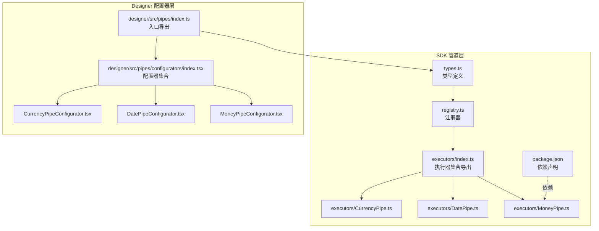
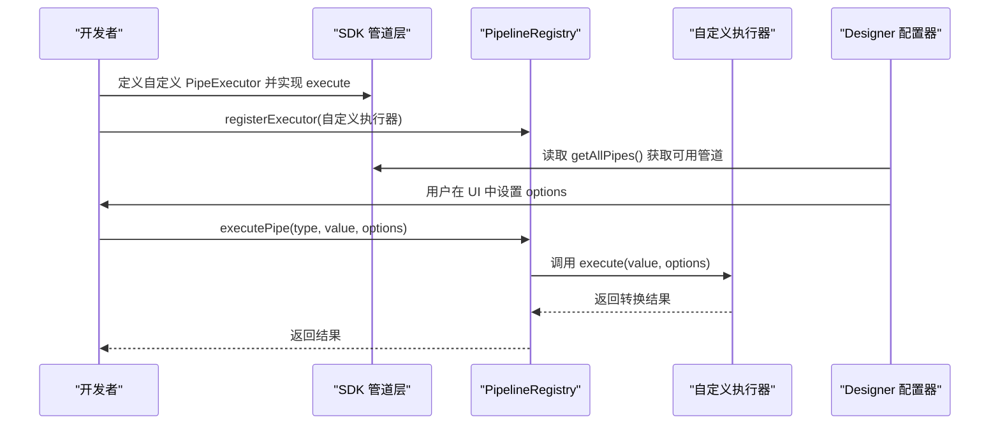
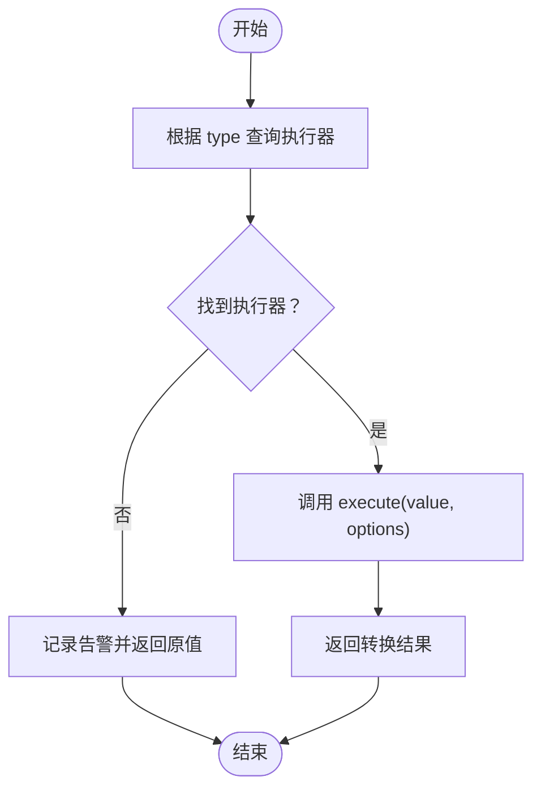
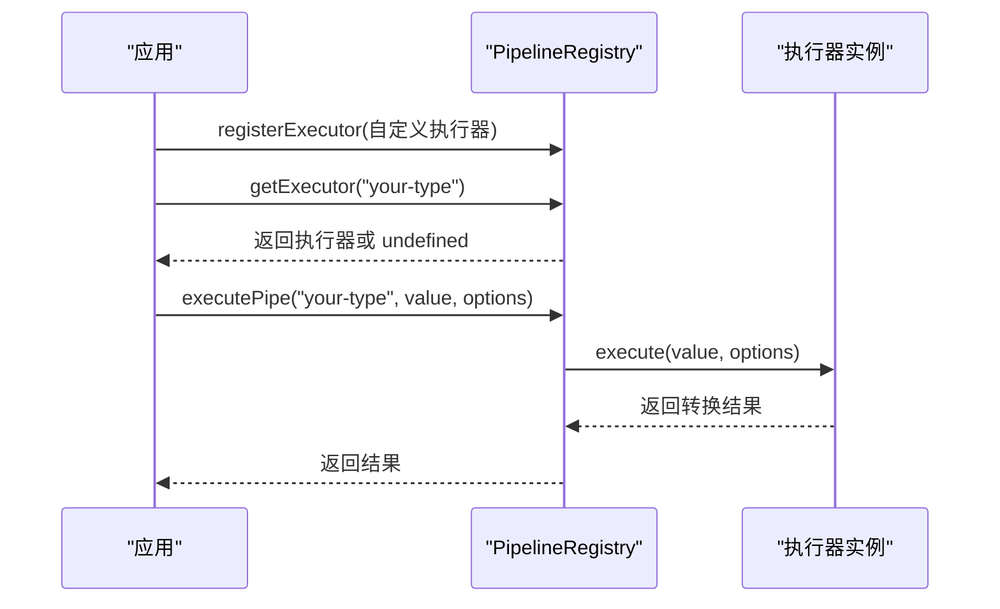
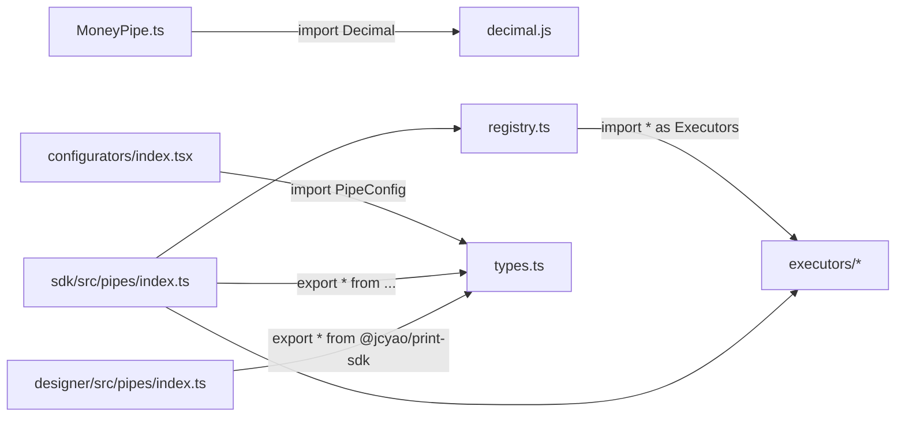

# 自定义管道开发

<cite>
**本文引用的文件**
- [sdk/src/pipes/types.ts](file://sdk/src/pipes/types.ts)
- [sdk/src/pipes/registry.ts](file://sdk/src/pipes/registry.ts)
- [sdk/src/pipes/executors/index.ts](file://sdk/src/pipes/executors/index.ts)
- [sdk/src/pipes/executors/CurrencyPipe.ts](file://sdk/src/pipes/executors/CurrencyPipe.ts)
- [sdk/src/pipes/executors/DatePipe.ts](file://sdk/src/pipes/executors/DatePipe.ts)
- [sdk/src/pipes/executors/MoneyPipe.ts](file://sdk/src/pipes/executors/MoneyPipe.ts)
- [sdk/src/pipes/index.ts](file://sdk/src/pipes/index.ts)
- [sdk/src/types.ts](file://sdk/src/types.ts)
- [designer/src/pipes/configurators/index.tsx](file://designer/src/pipes/configurators/index.tsx)
- [designer/src/pipes/configurators/CurrencyPipeConfigurator.tsx](file://designer/src/pipes/configurators/CurrencyPipeConfigurator.tsx)
- [designer/src/pipes/configurators/DatePipeConfigurator.tsx](file://designer/src/pipes/configurators/DatePipeConfigurator.tsx)
- [designer/src/pipes/configurators/MoneyPipeConfigurator.tsx](file://designer/src/pipes/configurators/MoneyPipeConfigurator.tsx)
- [designer/src/pipes/index.ts](file://designer/src/pipes/index.ts)
- [sdk/package.json](file://sdk/package.json)
</cite>

## 目录
1. [简介](#简介)
2. [项目结构](#项目结构)
3. [核心组件](#核心组件)
4. [架构总览](#架构总览)
5. [详细组件分析](#详细组件分析)
6. [依赖分析](#依赖分析)
7. [性能考虑](#性能考虑)
8. [故障排查指南](#故障排查指南)
9. [结论](#结论)
10. [附录](#附录)

## 简介
本指南面向需要在打印模板系统中扩展“数据管道”的开发者，系统性讲解管道执行器的设计与实现规范、管道配置系统（参数定义、校验与默认值）、注册与调用流程，并提供可直接参考的实现范式与最佳实践。读者将学会如何：
- 定义符合规范的 PipeExecutor 接口实现
- 在 PipelineRegistry 中注册与使用自定义管道
- 通过 UI 配置器为管道提供可视化配置
- 处理错误与边界情况，进行性能优化与测试

## 项目结构
打印 SDK 的“管道”能力位于 sdk/src/pipes 下，采用“执行器 + 注册器 + 类型定义”的分层设计；Designer 侧提供对应的 UI 配置器，二者通过统一的类型与入口文件协同工作。

图表来源
- [sdk/src/pipes/types.ts:1-29](file://sdk/src/pipes/types.ts#L1-L29)
- [sdk/src/pipes/registry.ts:1-64](file://sdk/src/pipes/registry.ts#L1-L64)
- [sdk/src/pipes/executors/index.ts:1-44](file://sdk/src/pipes/executors/index.ts#L1-L44)
- [sdk/src/pipes/executors/CurrencyPipe.ts:1-17](file://sdk/src/pipes/executors/CurrencyPipe.ts#L1-L17)
- [sdk/src/pipes/executors/DatePipe.ts:1-35](file://sdk/src/pipes/executors/DatePipe.ts#L1-L35)
- [sdk/src/pipes/executors/MoneyPipe.ts:1-62](file://sdk/src/pipes/executors/MoneyPipe.ts#L1-L62)
- [sdk/src/pipes/index.ts:1-9](file://sdk/src/pipes/index.ts#L1-L9)
- [sdk/src/types.ts:66-75](file://sdk/src/types.ts#L66-L75)
- [designer/src/pipes/index.ts:1-11](file://designer/src/pipes/index.ts#L1-L11)
- [designer/src/pipes/configurators/index.tsx:1-83](file://designer/src/pipes/configurators/index.tsx#L1-L83)
- [sdk/package.json:49-53](file://sdk/package.json#L49-L53)

章节来源
- [sdk/src/pipes/index.ts:1-9](file://sdk/src/pipes/index.ts#L1-L9)
- [sdk/src/types.ts:66-75](file://sdk/src/types.ts#L66-L75)
- [designer/src/pipes/index.ts:1-11](file://designer/src/pipes/index.ts#L1-L11)

## 核心组件
- PipeExecutor 接口：定义管道的 type、label 与 execute 方法签名，是所有管道实现的契约。
- PipelineRegistry：提供注册、查询、遍历与执行管道的能力，内置注册了多种执行器。
- 执行器集合：包含日期、货币、金额、大小写、截取、默认值等内置实现，便于直接使用或作为自定义实现的参考。
- 类型定义：PipeConfig、DataBinding 等，支撑管道在模板中的配置与绑定。
- UI 配置器：在 Designer 侧提供可视化的配置界面，与 SDK 的执行器解耦。

章节来源
- [sdk/src/pipes/types.ts:11-29](file://sdk/src/pipes/types.ts#L11-L29)
- [sdk/src/pipes/registry.ts:12-52](file://sdk/src/pipes/registry.ts#L12-L52)
- [sdk/src/pipes/executors/index.ts:6-43](file://sdk/src/pipes/executors/index.ts#L6-L43)
- [sdk/src/types.ts:66-75](file://sdk/src/types.ts#L66-L75)
- [designer/src/pipes/configurators/index.tsx:14-82](file://designer/src/pipes/configurators/index.tsx#L14-L82)

## 架构总览
SDK 与 Designer 的协作关系如下：
- SDK 提供类型、执行器与注册器，负责“执行”。
- Designer 提供配置器，负责“配置”，两者通过统一的 PipeConfig 结构互通。
- 通过入口文件统一导出，保证双方对齐。

图表来源
- [sdk/src/pipes/registry.ts:17-52](file://sdk/src/pipes/registry.ts#L17-L52)
- [sdk/src/pipes/types.ts:11-29](file://sdk/src/pipes/types.ts#L11-L29)
- [sdk/src/pipes/index.ts:6-8](file://sdk/src/pipes/index.ts#L6-L8)
- [designer/src/pipes/configurators/index.tsx:30-82](file://designer/src/pipes/configurators/index.tsx#L30-L82)

## 详细组件分析

### PipeExecutor 接口与实现规范
- 必备字段：type（唯一标识）、label（显示名称）。
- 必备方法：execute(value, options?)，返回转换后的值。
- 设计要点：
  - 保持纯函数特性，避免副作用。
  - 对输入进行安全处理（空值、非法类型）。
  - options 应支持默认值与可选参数，确保健壮性。
  - 错误时返回原始值或安全值，避免中断渲染链路。

章节来源
- [sdk/src/pipes/types.ts:11-29](file://sdk/src/pipes/types.ts#L11-L29)

### PipelineRegistry 注册与调用
- 注册：registerExecutor(executor)，以 type 为键存入 Map。
- 查询：getExecutor(type) 返回执行器或 undefined。
- 遍历：getAllPipes() 返回 { value, label } 列表，用于 UI 下拉。
- 执行：executePipe(type, value, options)，若未找到执行器则回退原值并告警。

图表来源
- [sdk/src/pipes/registry.ts:24-52](file://sdk/src/pipes/registry.ts#L24-L52)

章节来源
- [sdk/src/pipes/registry.ts:12-52](file://sdk/src/pipes/registry.ts#L12-L52)

### 内置执行器参考
- 日期格式化：支持格式模板替换，包含年月日时分秒占位符。
- 货币格式化：支持符号与精度，默认符号与精度可配置。
- 金额转换：基于高精度库，支持分/元互转、精度控制、千分位分隔与货币符号。
- 简单执行器：大小写转换、截取、默认值等，展示无配置与有配置两种模式。

章节来源
- [sdk/src/pipes/executors/DatePipe.ts:7-35](file://sdk/src/pipes/executors/DatePipe.ts#L7-L35)
- [sdk/src/pipes/executors/CurrencyPipe.ts:7-17](file://sdk/src/pipes/executors/CurrencyPipe.ts#L7-L17)
- [sdk/src/pipes/executors/MoneyPipe.ts:9-62](file://sdk/src/pipes/executors/MoneyPipe.ts#L9-L62)
- [sdk/src/pipes/executors/index.ts:15-43](file://sdk/src/pipes/executors/index.ts#L15-L43)

### 管道配置系统（参数定义、校验与默认值）
- 参数结构：PipeConfig.type 与 PipeConfig.options。
- options 默认值：在执行器内以空值合并策略提供默认值，保证健壮性。
- 校验建议：
  - 对数值型参数设定上下界（如精度、长度）。
  - 对日期格式串进行白名单或正则约束。
  - 对货币符号与分隔符进行字符集限制。
- 与 UI 配置器联动：Designer 侧通过配置器收集用户输入，传递给 SDK 执行器。

章节来源
- [sdk/src/types.ts:66-75](file://sdk/src/types.ts#L66-L75)
- [designer/src/pipes/configurators/CurrencyPipeConfigurator.tsx:9-22](file://designer/src/pipes/configurators/CurrencyPipeConfigurator.tsx#L9-L22)
- [designer/src/pipes/configurators/DatePipeConfigurator.tsx:9-22](file://designer/src/pipes/configurators/DatePipeConfigurator.tsx#L9-L22)
- [designer/src/pipes/configurators/MoneyPipeConfigurator.tsx:9-80](file://designer/src/pipes/configurators/MoneyPipeConfigurator.tsx#L9-L80)

### UI 配置器与注册
- 配置器接口：renderConfig(config, onChange) 返回 React 节点，onChange 回调用于更新 options。
- 注册表：以 type 为键注册配置器，便于按类型查找并渲染。
- 与 SDK 解耦：Designer 仅负责 UI，执行逻辑由 SDK 执行器承担。

章节来源
- [designer/src/pipes/configurators/index.tsx:14-82](file://designer/src/pipes/configurators/index.tsx#L14-L82)
- [designer/src/pipes/index.ts:6-11](file://designer/src/pipes/index.ts#L6-L11)

### 自定义管道开发完整示例（步骤说明）
以下为“自定义管道”的实现步骤，不包含具体代码内容，仅给出路径与要点，便于对照现有实现快速完成：

- 步骤 1：定义执行器
  - 实现 PipeExecutor 接口，提供 type、label 与 execute 方法。
  - 示例参考：[sdk/src/pipes/types.ts:11-29](file://sdk/src/pipes/types.ts#L11-L29)
- 步骤 2：实现数据转换逻辑
  - 可参考简单执行器（无配置）与复杂执行器（有配置）的实现风格。
  - 示例参考：[sdk/src/pipes/executors/index.ts:15-43](file://sdk/src/pipes/executors/index.ts#L15-L43)
  - 示例参考：[sdk/src/pipes/executors/CurrencyPipe.ts:7-17](file://sdk/src/pipes/executors/CurrencyPipe.ts#L7-L17)
  - 示例参考：[sdk/src/pipes/executors/MoneyPipe.ts:9-62](file://sdk/src/pipes/executors/MoneyPipe.ts#L9-L62)
- 步骤 3：在注册器中注册
  - 使用 registerExecutor 注册你的执行器。
  - 示例参考：[sdk/src/pipes/registry.ts:17-19](file://sdk/src/pipes/registry.ts#L17-L19)
- 步骤 4：提供 UI 配置器（可选）
  - 若需要可视化配置，实现 PipeConfigurator 并注册到配置器注册表。
  - 示例参考：[designer/src/pipes/configurators/index.tsx:68-82](file://designer/src/pipes/configurators/index.tsx#L68-L82)
  - 示例参考：[designer/src/pipes/configurators/CurrencyPipeConfigurator.tsx:9-22](file://designer/src/pipes/configurators/CurrencyPipeConfigurator.tsx#L9-L22)
- 步骤 5：在模板中使用
  - 通过 PipeConfig 指定 type 与 options，在数据绑定中串联管道。
  - 示例参考：[sdk/src/types.ts:66-75](file://sdk/src/types.ts#L66-L75)

章节来源
- [sdk/src/pipes/types.ts:11-29](file://sdk/src/pipes/types.ts#L11-L29)
- [sdk/src/pipes/registry.ts:17-19](file://sdk/src/pipes/registry.ts#L17-L19)
- [sdk/src/pipes/executors/index.ts:15-43](file://sdk/src/pipes/executors/index.ts#L15-L43)
- [sdk/src/pipes/executors/CurrencyPipe.ts:7-17](file://sdk/src/pipes/executors/CurrencyPipe.ts#L7-L17)
- [sdk/src/pipes/executors/MoneyPipe.ts:9-62](file://sdk/src/pipes/executors/MoneyPipe.ts#L9-L62)
- [designer/src/pipes/configurators/index.tsx:68-82](file://designer/src/pipes/configurators/index.tsx#L68-L82)
- [designer/src/pipes/configurators/CurrencyPipeConfigurator.tsx:9-22](file://designer/src/pipes/configurators/CurrencyPipeConfigurator.tsx#L9-L22)
- [sdk/src/types.ts:66-75](file://sdk/src/types.ts#L66-L75)

### 管道注册机制与调用流程
- 注册阶段：在 SDK 初始化时调用 registerExecutor 注册执行器；也可在运行时动态注册。
- 查询阶段：通过 getExecutor(type) 获取执行器实例。
- 执行阶段：executePipe(type, value, options) 调用执行器的 execute 方法。
- 回退策略：未找到执行器时记录告警并返回原值。

图表来源
- [sdk/src/pipes/registry.ts:17-52](file://sdk/src/pipes/registry.ts#L17-L52)

章节来源
- [sdk/src/pipes/registry.ts:12-52](file://sdk/src/pipes/registry.ts#L12-L52)

### 常见场景最佳实践
- 日期格式化
  - 使用格式模板（如年月日时分秒占位符），对空值与非法日期进行保护。
  - 参考：[sdk/src/pipes/executors/DatePipe.ts:11-35](file://sdk/src/pipes/executors/DatePipe.ts#L11-L35)
- 货币处理
  - 支持符号与精度，默认值合并；注意输入合法性。
  - 参考：[sdk/src/pipes/executors/CurrencyPipe.ts:11-17](file://sdk/src/pipes/executors/CurrencyPipe.ts#L11-L17)
- 金额转换
  - 使用高精度库进行分/元转换与格式化；支持千分位与符号；异常时回退原值。
  - 参考：[sdk/src/pipes/executors/MoneyPipe.ts:13-62](file://sdk/src/pipes/executors/MoneyPipe.ts#L13-L62)
- 字符串转换
  - 大小写、截取、默认值等简单转换，强调健壮性与可读性。
  - 参考：[sdk/src/pipes/executors/index.ts:15-43](file://sdk/src/pipes/executors/index.ts#L15-L43)

章节来源
- [sdk/src/pipes/executors/DatePipe.ts:11-35](file://sdk/src/pipes/executors/DatePipe.ts#L11-L35)
- [sdk/src/pipes/executors/CurrencyPipe.ts:11-17](file://sdk/src/pipes/executors/CurrencyPipe.ts#L11-L17)
- [sdk/src/pipes/executors/MoneyPipe.ts:13-62](file://sdk/src/pipes/executors/MoneyPipe.ts#L13-L62)
- [sdk/src/pipes/executors/index.ts:15-43](file://sdk/src/pipes/executors/index.ts#L15-L43)

## 依赖分析
- 外部依赖
  - 高精度计算：decimal.js，用于 MoneyPipe 的精确运算。
  - 条形码/二维码：jsbarcode、qrcode，用于渲染组件。
- 内部依赖
  - 执行器依赖类型定义与注册器；配置器依赖 SDK 的 PipeConfig 类型。
  - 入口文件统一导出，降低耦合度。

图表来源
- [sdk/src/pipes/executors/MoneyPipe.ts:6](file://sdk/src/pipes/executors/MoneyPipe.ts#L6)
- [sdk/src/pipes/registry.ts:7](file://sdk/src/pipes/registry.ts#L7)
- [designer/src/pipes/configurators/index.tsx:5](file://designer/src/pipes/configurators/index.tsx#L5)
- [sdk/src/pipes/index.ts:6-8](file://sdk/src/pipes/index.ts#L6-L8)
- [designer/src/pipes/index.ts:7](file://designer/src/pipes/index.ts#L7)

章节来源
- [sdk/package.json:49-53](file://sdk/package.json#L49-L53)
- [sdk/src/pipes/executors/MoneyPipe.ts:6](file://sdk/src/pipes/executors/MoneyPipe.ts#L6)
- [sdk/src/pipes/registry.ts:7](file://sdk/src/pipes/registry.ts#L7)
- [designer/src/pipes/configurators/index.tsx:5](file://designer/src/pipes/configurators/index.tsx#L5)
- [sdk/src/pipes/index.ts:6-8](file://sdk/src/pipes/index.ts#L6-L8)
- [designer/src/pipes/index.ts:7](file://designer/src/pipes/index.ts#L7)

## 性能考虑
- 执行器幂等与无副作用：避免在 execute 中产生外部状态变化，提升可缓存性与可测试性。
- 输入预处理：对空值、非法类型快速返回，减少后续分支判断成本。
- 高精度计算：MoneyPipe 已使用高精度库，避免浮点误差；其他数值处理也应遵循此原则。
- 配置器渲染：UI 层尽量只做轻量渲染，复杂逻辑放在 SDK 执行器中。
- 注册与查询：Map 查找为 O(1)，注册器设计合理，无需过度担心查询开销。

## 故障排查指南
- 管道未生效
  - 检查是否正确注册执行器：[sdk/src/pipes/registry.ts:17-19](file://sdk/src/pipes/registry.ts#L17-L19)
  - 检查 type 是否一致，是否在 getAllPipes 中可见：[sdk/src/pipes/registry.ts:31-40](file://sdk/src/pipes/registry.ts#L31-L40)
- 执行报错或返回异常
  - 在执行器内捕获异常并回退原值，参考 MoneyPipe 的错误处理：[sdk/src/pipes/executors/MoneyPipe.ts:56-60](file://sdk/src/pipes/executors/MoneyPipe.ts#L56-L60)
  - 查看控制台告警信息：[sdk/src/pipes/registry.ts:47-49](file://sdk/src/pipes/registry.ts#L47-L49)
- 配置无效
  - 确认 UI 配置器是否正确更新 options：[designer/src/pipes/configurators/index.tsx:70-82](file://designer/src/pipes/configurators/index.tsx#L70-L82)
  - 检查 PipeConfig 的结构与传参：[sdk/src/types.ts:66-75](file://sdk/src/types.ts#L66-L75)

章节来源
- [sdk/src/pipes/registry.ts:17-19](file://sdk/src/pipes/registry.ts#L17-L19)
- [sdk/src/pipes/registry.ts:31-40](file://sdk/src/pipes/registry.ts#L31-L40)
- [sdk/src/pipes/executors/MoneyPipe.ts:56-60](file://sdk/src/pipes/executors/MoneyPipe.ts#L56-L60)
- [sdk/src/pipes/registry.ts:47-49](file://sdk/src/pipes/registry.ts#L47-L49)
- [designer/src/pipes/configurators/index.tsx:70-82](file://designer/src/pipes/configurators/index.tsx#L70-L82)
- [sdk/src/types.ts:66-75](file://sdk/src/types.ts#L66-L75)

## 结论
通过明确的 PipeExecutor 接口、完善的 PipelineRegistry 与清晰的类型定义，该管道系统提供了良好的扩展性与可维护性。结合 UI 配置器，开发者可以快速实现并上线自定义管道，满足多样化的数据转换需求。建议在实现中重点关注健壮性、可测试性与性能，遵循现有内置执行器的实现风格，确保与整体架构的一致性。

## 附录
- 入口文件与导出
  - SDK 管道入口：[sdk/src/pipes/index.ts:1-9](file://sdk/src/pipes/index.ts#L1-L9)
  - Designer 管道入口：[designer/src/pipes/index.ts:1-11](file://designer/src/pipes/index.ts#L1-L11)
- 关键类型定义
  - 管道配置：[sdk/src/types.ts:66-75](file://sdk/src/types.ts#L66-L75)
  - 执行器接口：[sdk/src/pipes/types.ts:11-29](file://sdk/src/pipes/types.ts#L11-L29)