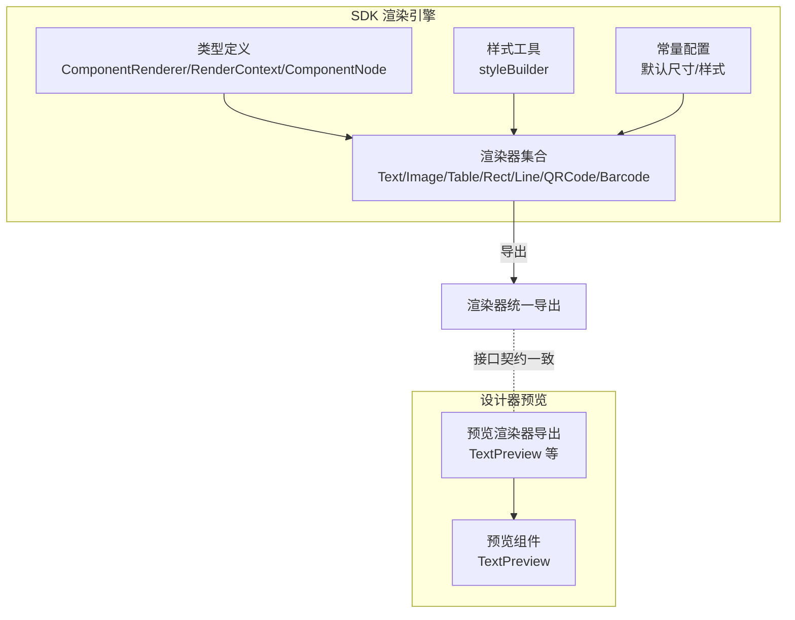
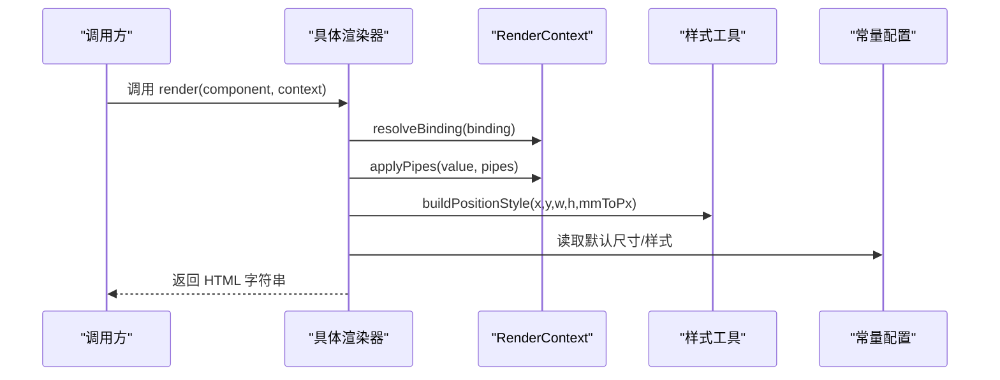
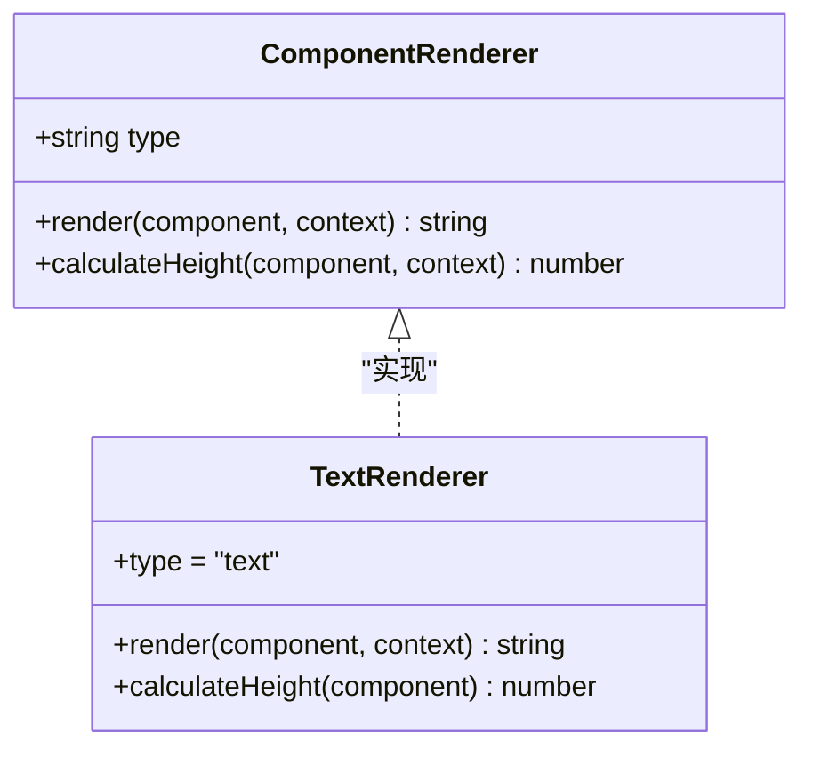
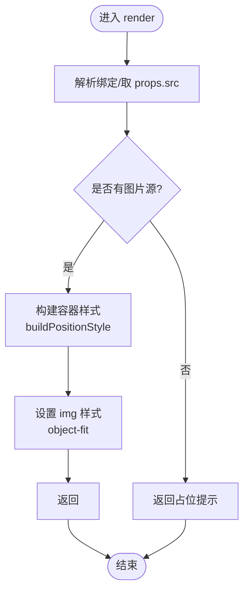
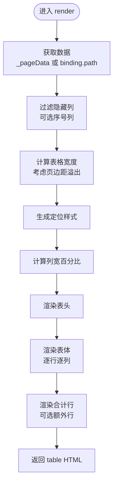
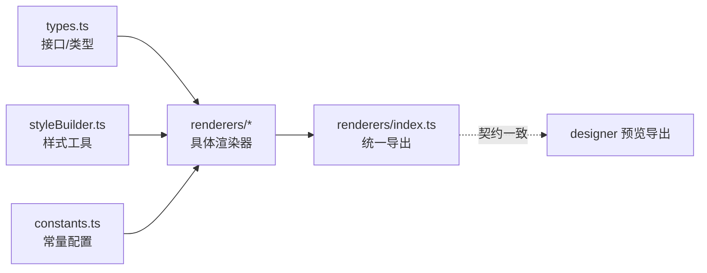

# 自定义组件渲染器开发

<cite>
**本文引用的文件**
- [sdk/src/printEngine/types.ts](file://sdk/src/printEngine/types.ts)
- [sdk/src/printEngine/renderers/index.ts](file://sdk/src/printEngine/renderers/index.ts)
- [sdk/src/printEngine/renderers/TextRenderer.ts](file://sdk/src/printEngine/renderers/TextRenderer.ts)
- [sdk/src/printEngine/renderers/ImageRenderer.ts](file://sdk/src/printEngine/renderers/ImageRenderer.ts)
- [sdk/src/printEngine/renderers/TableRenderer.ts](file://sdk/src/printEngine/renderers/TableRenderer.ts)
- [sdk/src/printEngine/renderers/RectRenderer.ts](file://sdk/src/printEngine/renderers/RectRenderer.ts)
- [sdk/src/printEngine/renderers/LineRenderer.ts](file://sdk/src/printEngine/renderers/LineRenderer.ts)
- [sdk/src/printEngine/renderers/QRCodeRenderer.ts](file://sdk/src/printEngine/renderers/QRCodeRenderer.ts)
- [sdk/src/printEngine/renderers/BarcodeRenderer.ts](file://sdk/src/printEngine/renderers/BarcodeRenderer.ts)
- [sdk/src/printEngine/utils/styleBuilder.ts](file://sdk/src/printEngine/utils/styleBuilder.ts)
- [sdk/src/printEngine/constants.ts](file://sdk/src/printEngine/constants.ts)
- [sdk/src/types.ts](file://sdk/src/types.ts)
- [designer/src/pages/Designer/components/Canvas/componentRenderers/index.ts](file://designer/src/pages/Designer/components/Canvas/componentRenderers/index.ts)
- [designer/src/pages/Designer/components/Canvas/componentRenderers/TextPreview.tsx](file://designer/src/pages/Designer/components/Canvas/componentRenderers/TextPreview.tsx)
</cite>

## 目录
1. [简介](#简介)
2. [项目结构](#项目结构)
3. [核心组件](#核心组件)
4. [架构总览](#架构总览)
5. [详细组件分析](#详细组件分析)
6. [依赖分析](#依赖分析)
7. [性能考虑](#性能考虑)
8. [故障排查指南](#故障排查指南)
9. [结论](#结论)
10. [附录](#附录)

## 简介
本指南面向需要为打印模板系统开发“自定义组件渲染器”的工程师，系统讲解渲染器接口规范、实现要求、样式与事件处理机制、生命周期管理、错误处理与性能优化，并提供从接口定义到注册机制的完整开发流程与示例路径。读者将学会如何基于现有渲染器实现模式，快速开发文本、图像、表格等组件的渲染器，并掌握测试与调试方法。

## 项目结构
打印模板系统的渲染体系分为两部分：
- SDK 渲染引擎：负责将模板组件渲染为 HTML 字符串，供后续打印或预览使用。
- 设计器预览渲染器：负责设计器画布上的组件预览，与 SDK 渲染器保持一致的接口风格以便复用。

图表来源
- [sdk/src/printEngine/types.ts:58-82](file://sdk/src/printEngine/types.ts#L58-L82)
- [sdk/src/printEngine/renderers/index.ts:1-13](file://sdk/src/printEngine/renderers/index.ts#L1-L13)
- [sdk/src/printEngine/utils/styleBuilder.ts:1-54](file://sdk/src/printEngine/utils/styleBuilder.ts#L1-L54)
- [sdk/src/printEngine/constants.ts:1-113](file://sdk/src/printEngine/constants.ts#L1-L113)
- [designer/src/pages/Designer/components/Canvas/componentRenderers/index.ts:1-11](file://designer/src/pages/Designer/components/Canvas/componentRenderers/index.ts#L1-L11)

章节来源
- [sdk/src/printEngine/types.ts:1-116](file://sdk/src/printEngine/types.ts#L1-L116)
- [sdk/src/printEngine/renderers/index.ts:1-13](file://sdk/src/printEngine/renderers/index.ts#L1-L13)
- [sdk/src/printEngine/utils/styleBuilder.ts:1-54](file://sdk/src/printEngine/utils/styleBuilder.ts#L1-L54)
- [sdk/src/printEngine/constants.ts:1-113](file://sdk/src/printEngine/constants.ts#L1-L113)
- [designer/src/pages/Designer/components/Canvas/componentRenderers/index.ts:1-11](file://designer/src/pages/Designer/components/Canvas/componentRenderers/index.ts#L1-L11)

## 核心组件
- 接口规范
  - ComponentRenderer：所有渲染器必须实现的接口，包含只读 type、render 方法以及可选的 calculateHeight 方法。
  - RenderContext：渲染上下文，提供数据解析、管道应用、路径取值、日期格式化、页面信息与 mm→px 换算等能力。
- 数据结构
  - ComponentNode：组件节点，包含布局、样式、数据绑定、属性与子节点等。
  - PageInfo：页面信息，用于计算可用宽度与溢出检测。
- 样式与定位
  - buildStyleString：将样式对象转换为 CSS 字符串。
  - buildPositionStyle：根据 mm 坐标与尺寸生成绝对定位样式。
  - 常量：默认尺寸、表格默认尺寸、样式默认值等。

章节来源
- [sdk/src/printEngine/types.ts:58-82](file://sdk/src/printEngine/types.ts#L58-L82)
- [sdk/src/printEngine/types.ts:11-55](file://sdk/src/printEngine/types.ts#L11-L55)
- [sdk/src/types.ts:185-202](file://sdk/src/types.ts#L185-L202)
- [sdk/src/printEngine/utils/styleBuilder.ts:13-53](file://sdk/src/printEngine/utils/styleBuilder.ts#L13-L53)
- [sdk/src/printEngine/constants.ts:13-92](file://sdk/src/printEngine/constants.ts#L13-L92)

## 架构总览
渲染器遵循“接口契约 + 工具函数 + 常量配置”的分层设计。渲染流程如下：
- 输入：ComponentNode + RenderContext
- 处理：解析绑定、应用管道、计算定位与样式、生成 HTML 片段
- 输出：HTML 字符串（供打印引擎拼装为完整模板）

图表来源
- [sdk/src/printEngine/types.ts:11-35](file://sdk/src/printEngine/types.ts#L11-L35)
- [sdk/src/printEngine/utils/styleBuilder.ts:31-53](file://sdk/src/printEngine/utils/styleBuilder.ts#L31-L53)
- [sdk/src/printEngine/constants.ts:8-46](file://sdk/src/printEngine/constants.ts#L8-L46)

## 详细组件分析

### 文本组件渲染器（TextRenderer）
- 继承关系与职责
  - 实现 ComponentRenderer，type 为 "text"。
  - render：解析绑定值，支持 label 前缀；使用 flex 布局与 textAlign 对齐；输出 div 包裹文本。
  - calculateHeight：返回布局高度或默认文本高度。
- 样式与定位
  - 使用 buildPositionStyle 生成绝对定位；通过 textAlign 转换为 justifyContent。
  - 字体、颜色、字重、行高等采用 STYLE_DEFAULT。
- 数据绑定与管道
  - 通过 context.resolveBinding 与 context.applyPipes 处理数据与格式化。

图表来源
- [sdk/src/printEngine/types.ts:61-82](file://sdk/src/printEngine/types.ts#L61-L82)
- [sdk/src/printEngine/renderers/TextRenderer.ts:10-59](file://sdk/src/printEngine/renderers/TextRenderer.ts#L10-L59)

章节来源
- [sdk/src/printEngine/renderers/TextRenderer.ts:10-59](file://sdk/src/printEngine/renderers/TextRenderer.ts#L10-L59)
- [sdk/src/printEngine/utils/styleBuilder.ts:31-53](file://sdk/src/printEngine/utils/styleBuilder.ts#L31-L53)
- [sdk/src/printEngine/constants.ts:63-78](file://sdk/src/printEngine/constants.ts#L63-L78)

### 图像组件渲染器（ImageRenderer）
- 继承关系与职责
  - 实现 ComponentRenderer，type 为 "image"。
  - render：优先使用绑定值作为图片源；容器使用 buildPositionStyle；img 使用 object-fit 控制裁切。
  - calculateHeight：返回布局高度或默认图片高度。
- 错误与回退
  - 无图片源时返回占位提示，避免空渲染。

图表来源
- [sdk/src/printEngine/renderers/ImageRenderer.ts:13-49](file://sdk/src/printEngine/renderers/ImageRenderer.ts#L13-L49)
- [sdk/src/printEngine/utils/styleBuilder.ts:31-53](file://sdk/src/printEngine/utils/styleBuilder.ts#L31-L53)

章节来源
- [sdk/src/printEngine/renderers/ImageRenderer.ts:10-55](file://sdk/src/printEngine/renderers/ImageRenderer.ts#L10-L55)

### 表格组件渲染器（TableRenderer）
- 继承关系与职责
  - 实现 ComponentRenderer，type 为 "table"。
  - render：支持跨页分段（_pageData）、表头/序号列、边框、对齐、列宽计算、合计行与额外行。
  - calculateHeight：估算表头+行数×行高+合计行高度。
- 列宽算法
  - computeColWidths：处理全部未设宽、部分设宽、固定列总和超限等边界场景，保证总和为 100%。
- 合计与额外行
  - 使用 decimal.js 精确计算 sum/avg/max/min/count；支持管道转换与格式化；额外行支持引用列值并独立应用管道。
- 安全与健壮性
  - escapeHtml 防止 XSS；大量边界保护与日志告警；最小宽度保护与溢出警告。

图表来源
- [sdk/src/printEngine/renderers/TableRenderer.ts:150-327](file://sdk/src/printEngine/renderers/TableRenderer.ts#L150-L327)
- [sdk/src/printEngine/renderers/TableRenderer.ts:51-125](file://sdk/src/printEngine/renderers/TableRenderer.ts#L51-L125)
- [sdk/src/printEngine/renderers/TableRenderer.ts:332-385](file://sdk/src/printEngine/renderers/TableRenderer.ts#L332-L385)
- [sdk/src/printEngine/renderers/TableRenderer.ts:581-600](file://sdk/src/printEngine/renderers/TableRenderer.ts#L581-L600)

章节来源
- [sdk/src/printEngine/renderers/TableRenderer.ts:147-601](file://sdk/src/printEngine/renderers/TableRenderer.ts#L147-L601)

### 矩形组件渲染器（RectRenderer）
- 继承关系与职责
  - 实现 ComponentRenderer，type 为 "rect"。
  - render：使用 buildPositionStyle 生成定位，设置 border/background。
  - calculateHeight：返回布局高度或默认矩形高度。

章节来源
- [sdk/src/printEngine/renderers/RectRenderer.ts:10-39](file://sdk/src/printEngine/renderers/RectRenderer.ts#L10-L39)

### 线条组件渲染器（LineRenderer）
- 继承关系与职责
  - 实现 ComponentRenderer，type 为 "line"。
  - render：外层容器使用 flex 居中，内层线条使用 border 实现，支持 horizontal/vertical。
  - calculateHeight：返回外层容器高度。

章节来源
- [sdk/src/printEngine/renderers/LineRenderer.ts:10-59](file://sdk/src/printEngine/renderers/LineRenderer.ts#L10-L59)

### 二维码组件渲染器（QRCodeRenderer）
- 继承关系与职责
  - 实现 ComponentRenderer，type 为 "qrcode"。
  - render：使用 qrcode 库在内存 canvas 同步生成 base64，返回 img 标签；异常时返回占位提示。
  - calculateHeight：返回布局高度或默认二维码尺寸。

章节来源
- [sdk/src/printEngine/renderers/QRCodeRenderer.ts:12-63](file://sdk/src/printEngine/renderers/QRCodeRenderer.ts#L12-L63)

### 条形码组件渲染器（BarcodeRenderer）
- 继承关系与职责
  - 实现 ComponentRenderer，type 为 "barcode"。
  - render：使用 jsbarcode 在内存 canvas 同步生成 base64，返回 img 标签；异常时返回占位提示。
  - calculateHeight：返回布局高度或默认条形码尺寸。

章节来源
- [sdk/src/printEngine/renderers/BarcodeRenderer.ts:12-63](file://sdk/src/printEngine/renderers/BarcodeRenderer.ts#L12-L63)

### 设计器预览渲染器（TextPreview）
- 设计器侧预览组件，与 SDK 渲染器保持一致的接口风格，便于在设计器中预览组件效果。
- TextPreview：根据 textAlign 转换为 justifyContent，使用 flex 居中与省略显示。

章节来源
- [designer/src/pages/Designer/components/Canvas/componentRenderers/TextPreview.tsx:10-31](file://designer/src/pages/Designer/components/Canvas/componentRenderers/TextPreview.tsx#L10-L31)

## 依赖分析
- 渲染器依赖
  - 统一依赖 RenderContext 与样式工具函数，确保定位与样式一致性。
  - 常量配置提供默认尺寸与样式，降低实现复杂度。
- 导出与注册
  - SDK 渲染器通过统一入口导出，便于上层按需引入与替换。
  - 设计器预览渲染器同样通过统一入口导出，保持与 SDK 的契约一致。

图表来源
- [sdk/src/printEngine/types.ts:58-82](file://sdk/src/printEngine/types.ts#L58-L82)
- [sdk/src/printEngine/renderers/index.ts:5-12](file://sdk/src/printEngine/renderers/index.ts#L5-L12)
- [sdk/src/printEngine/utils/styleBuilder.ts:13-53](file://sdk/src/printEngine/utils/styleBuilder.ts#L13-L53)
- [sdk/src/printEngine/constants.ts:13-92](file://sdk/src/printEngine/constants.ts#L13-L92)
- [designer/src/pages/Designer/components/Canvas/componentRenderers/index.ts:4-10](file://designer/src/pages/Designer/components/Canvas/componentRenderers/index.ts#L4-L10)

章节来源
- [sdk/src/printEngine/renderers/index.ts:1-13](file://sdk/src/printEngine/renderers/index.ts#L1-L13)
- [designer/src/pages/Designer/components/Canvas/componentRenderers/index.ts:1-11](file://designer/src/pages/Designer/components/Canvas/componentRenderers/index.ts#L1-L11)

## 性能考虑
- 样式构建
  - 使用 buildStyleString 一次性拼接，减少 DOM 操作次数。
- 定位计算
  - 通过 buildPositionStyle 统一 mm→px 转换，避免重复计算。
- 表格渲染
  - 列宽计算与合计使用精确数值库，避免浮点误差导致的布局抖动。
  - 合计与额外行的管道执行采用独立隔离，避免相互影响。
- 资源生成
  - 二维码/条形码在内存 canvas 同步生成，避免异步等待与多次重绘。
- 日志与告警
  - 对溢出、过小宽度、计算错误等场景进行日志记录，便于定位性能瓶颈与布局问题。

## 故障排查指南
- 常见问题
  - 表格宽度溢出：检查 xMm + widthMm 与右页边距的关系，必要时自动调整或手动修正。
  - 表格宽度过小：设置最小宽度保护，避免渲染异常。
  - 合计计算错误：捕获异常并返回友好提示，同时记录错误日志。
  - 二维码/条形码生成失败：返回占位提示，避免空白块影响整体布局。
- 调试建议
  - 在 render 中打印关键中间值（如解析后的绑定值、列宽数组、合计结果）。
  - 使用设计器预览组件对比 SDK 渲染结果，快速定位差异。
  - 对复杂逻辑（如列宽计算、合计管道）添加单元测试，确保边界条件正确。

章节来源
- [sdk/src/printEngine/renderers/TableRenderer.ts:196-228](file://sdk/src/printEngine/renderers/TableRenderer.ts#L196-L228)
- [sdk/src/printEngine/renderers/TableRenderer.ts:231-234](file://sdk/src/printEngine/renderers/TableRenderer.ts#L231-L234)
- [sdk/src/printEngine/renderers/TableRenderer.ts:429-433](file://sdk/src/printEngine/renderers/TableRenderer.ts#L429-L433)
- [sdk/src/printEngine/renderers/QRCodeRenderer.ts:52-56](file://sdk/src/printEngine/renderers/QRCodeRenderer.ts#L52-L56)
- [sdk/src/printEngine/renderers/BarcodeRenderer.ts:52-56](file://sdk/src/printEngine/renderers/BarcodeRenderer.ts#L52-L56)

## 结论
通过统一的 ComponentRenderer 接口、RenderContext 上下文与样式工具链，SDK 渲染引擎实现了可扩展、可维护的组件渲染体系。开发者可以基于现有渲染器实现模式，快速开发新组件渲染器，并通过统一导出机制集成到系统中。配合完善的错误处理与性能优化策略，能够稳定支撑复杂打印模板的渲染需求。

## 附录

### 开发流程（从接口到注册）
- 定义渲染器类
  - 实现 ComponentRenderer，设置 type 与 render 方法；如需分页，实现 calculateHeight。
  - 参考路径：[TextRenderer:10-59](file://sdk/src/printEngine/renderers/TextRenderer.ts#L10-L59)、[ImageRenderer:10-55](file://sdk/src/printEngine/renderers/ImageRenderer.ts#L10-L55)、[TableRenderer:147-601](file://sdk/src/printEngine/renderers/TableRenderer.ts#L147-L601)
- 使用样式工具与常量
  - 使用 buildPositionStyle 生成定位样式；使用 STYLE_DEFAULT/COMPONENT_DEFAULT_SIZE 常量。
  - 参考路径：[styleBuilder:31-53](file://sdk/src/printEngine/utils/styleBuilder.ts#L31-L53)、[constants:13-92](file://sdk/src/printEngine/constants.ts#L13-L92)
- 数据绑定与上下文
  - 使用 context.resolveBinding、context.applyPipes、context.getValueByPath、context.formatDate。
  - 参考路径：[types(RenderContext):11-35](file://sdk/src/printEngine/types.ts#L11-L35)
- 注册与导出
  - 在渲染器目录导出新渲染器，并在统一导出文件中加入导出项。
  - 参考路径：[renderers/index:5-12](file://sdk/src/printEngine/renderers/index.ts#L5-L12)
- 设计器预览
  - 如需设计器预览，新建预览组件并与 SDK 渲染器保持一致的接口风格。
  - 参考路径：[designer 预览导出:4-10](file://designer/src/pages/Designer/components/Canvas/componentRenderers/index.ts#L4-L10)、[TextPreview:10-31](file://designer/src/pages/Designer/components/Canvas/componentRenderers/TextPreview.tsx#L10-L31)

### 示例路径（不同组件类型）
- 文本组件
  - [TextRenderer.render:13-53](file://sdk/src/printEngine/renderers/TextRenderer.ts#L13-L53)
  - [TextPreview:10-31](file://designer/src/pages/Designer/components/Canvas/componentRenderers/TextPreview.tsx#L10-L31)
- 图像组件
  - [ImageRenderer.render:13-49](file://sdk/src/printEngine/renderers/ImageRenderer.ts#L13-L49)
- 表格组件
  - [TableRenderer.render:150-327](file://sdk/src/printEngine/renderers/TableRenderer.ts#L150-L327)
  - [列宽计算:51-125](file://sdk/src/printEngine/renderers/TableRenderer.ts#L51-L125)
  - [合计与额外行:332-385](file://sdk/src/printEngine/renderers/TableRenderer.ts#L332-L385)
- 矩形/线条组件
  - [RectRenderer:10-39](file://sdk/src/printEngine/renderers/RectRenderer.ts#L10-L39)
  - [LineRenderer:10-59](file://sdk/src/printEngine/renderers/LineRenderer.ts#L10-L59)
- 二维码/条形码组件
  - [QRCodeRenderer:15-57](file://sdk/src/printEngine/renderers/QRCodeRenderer.ts#L15-L57)
  - [BarcodeRenderer:15-57](file://sdk/src/printEngine/renderers/BarcodeRenderer.ts#L15-L57)