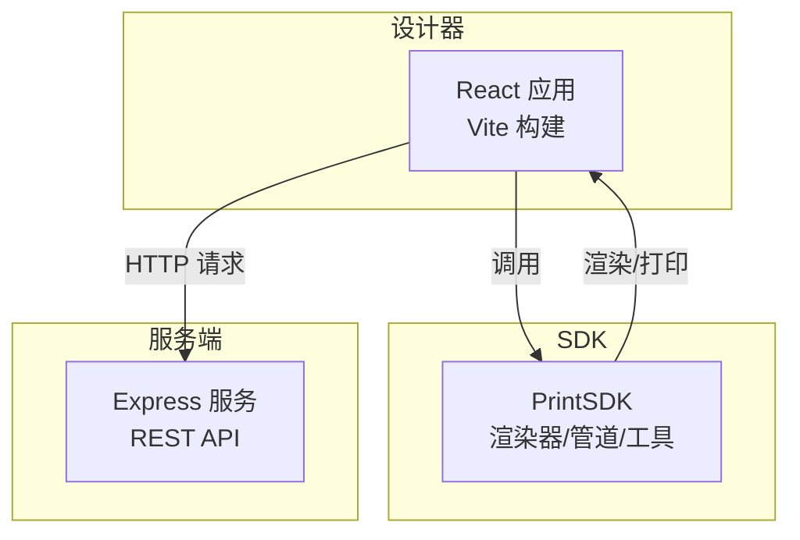
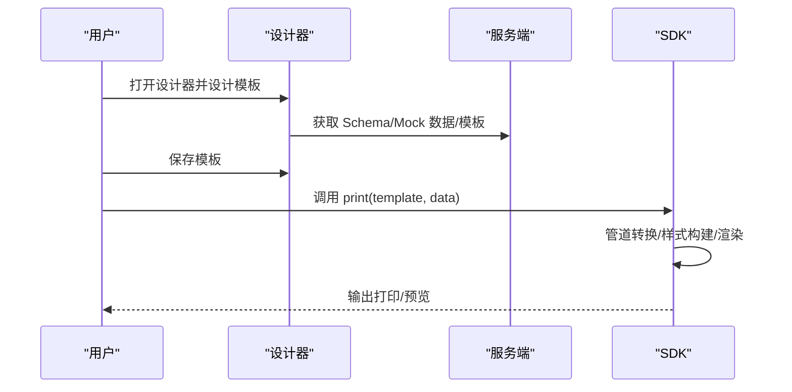
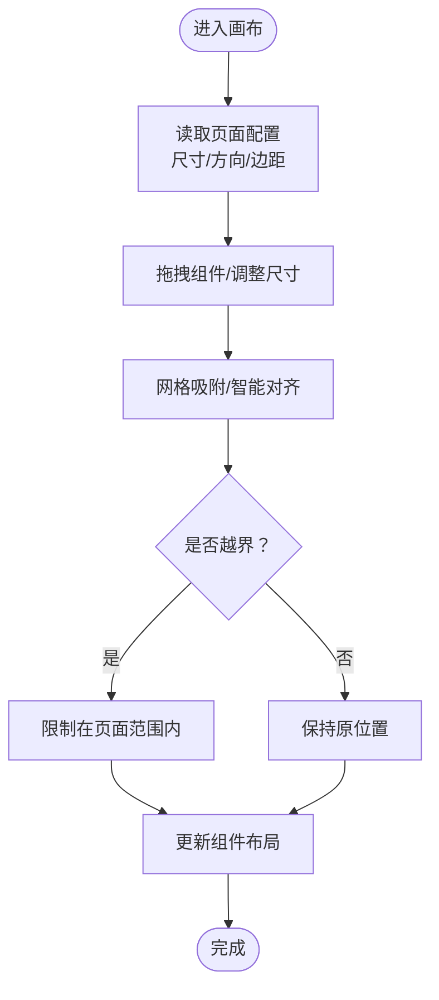
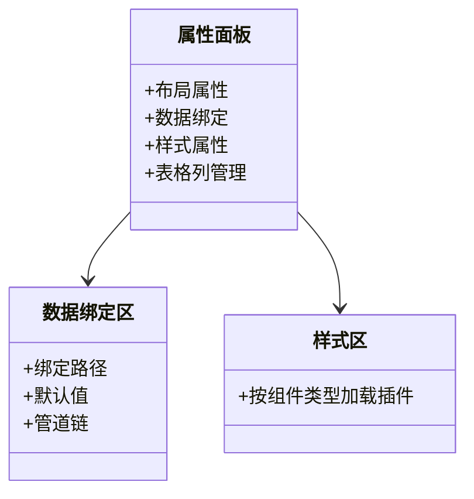
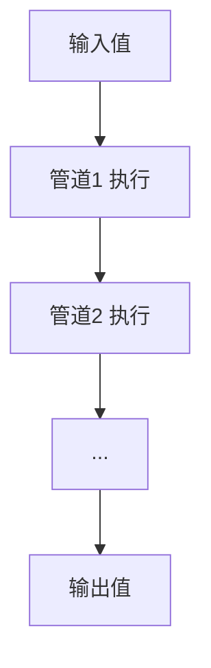
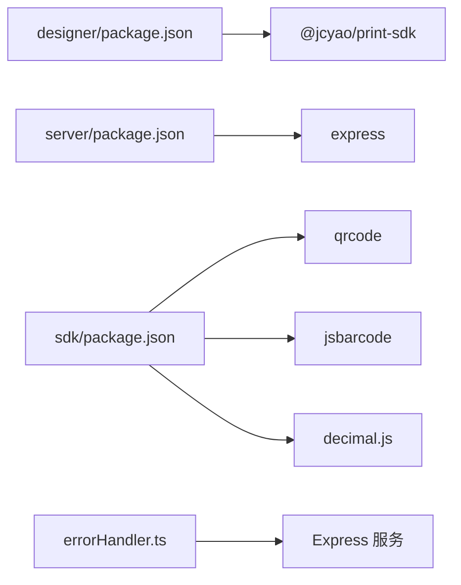

# 常见问题FAQ

<cite>
**本文引用的文件**
- [README.md](file://README.md)
- [DEV_README.md](file://DEV_README.md)
- [designer/package.json](file://designer/package.json)
- [sdk/package.json](file://sdk/package.json)
- [server/package.json](file://server/package.json)
- [server/src/middlewares/errorHandler.ts](file://server/src/middlewares/errorHandler.ts)
- [designer/src/pages/Designer/components/Canvas/index.tsx](file://designer/src/pages/Designer/components/Canvas/index.tsx)
- [designer/src/pages/Designer/components/PropertyPanel/index.tsx](file://designer/src/pages/Designer/components/PropertyPanel/index.tsx)
- [designer/src/pages/Designer/components/PropertyPanel/DataBindingSection.tsx](file://designer/src/pages/Designer/components/PropertyPanel/DataBindingSection.tsx)
- [designer/src/pages/Designer/components/PropertyPanel/LayoutSection.tsx](file://designer/src/pages/Designer/components/PropertyPanel/LayoutSection.tsx)
- [designer/src/pages/Designer/components/PropertyPanel/StyleSection.tsx](file://designer/src/pages/Designer/components/PropertyPanel/StyleSection.tsx)
- [sdk/src/pipes/executors/index.ts](file://sdk/src/pipes/executors/index.ts)
- [sdk/src/printEngine/renderers/index.ts](file://sdk/src/printEngine/renderers/index.ts)
- [sdk/src/printEngine/utils/styleBuilder.ts](file://sdk/src/printEngine/utils/styleBuilder.ts)
- [SDK代码问题分析报告.md](file://SDK代码问题分析报告.md)
</cite>

## 目录
1. [简介](#简介)
2. [项目结构](#项目结构)
3. [核心组件](#核心组件)
4. [架构总览](#架构总览)
5. [详细组件分析](#详细组件分析)
6. [依赖关系分析](#依赖关系分析)
7. [性能考量](#性能考量)
8. [故障排查指南](#故障排查指南)
9. [结论](#结论)
10. [附录](#附录)

## 简介
本FAQ面向开发者与最终用户，聚焦打印平台在开发与使用过程中高频出现的问题与解决方案，覆盖依赖版本冲突、构建配置错误、运行时异常、模板设计问题、数据绑定错误、打印效果异常等主题。文档同时提供问题分类索引与求助渠道，帮助快速定位与解决问题。

## 项目结构
打印平台采用“设计器 + SDK + 服务端”三层架构：
- 设计器（React + TypeScript，Vite 构建）：可视化模板设计器与预览
- SDK（纯TS，Rollup 打包）：独立打印能力，支持浏览器端打印与批量预览
- 服务端（Node.js + Express）：提供 Schema、Mock 数据与模板的 REST 接口

图表来源
- [README.md: 163-187:163-187](file://README.md#L163-L187)
- [README.md: 191-234:191-234](file://README.md#L191-L234)

章节来源
- [README.md: 163-187:163-187](file://README.md#L163-L187)
- [README.md: 191-234:191-234](file://README.md#L191-L234)

## 核心组件
- 页面画布与交互：支持网格吸附、智能对齐、拖拽定位、快捷键、组件删除与层级操作
- 属性面板：布局、数据绑定、样式、表格列管理
- 管道系统：日期、货币、金额、大小写、截取、默认值等
- 渲染器：文本、表格、图片、线条、矩形、二维码、条形码、页码

章节来源
- [designer/src/pages/Designer/components/Canvas/index.tsx: 1-800:1-800](file://designer/src/pages/Designer/components/Canvas/index.tsx#L1-L800)
- [designer/src/pages/Designer/components/PropertyPanel/index.tsx: 1-129:1-129](file://designer/src/pages/Designer/components/PropertyPanel/index.tsx#L1-L129)
- [sdk/src/pipes/executors/index.ts: 1-44:1-44](file://sdk/src/pipes/executors/index.ts#L1-L44)
- [sdk/src/printEngine/renderers/index.ts: 1-13:1-13](file://sdk/src/printEngine/renderers/index.ts#L1-L13)

## 架构总览
整体流程：用户在设计器中设计模板，保存后通过 SDK 执行打印；服务端提供数据与模板资源。

图表来源
- [README.md: 296-326:296-326](file://README.md#L296-L326)
- [sdk/src/printEngine/utils/styleBuilder.ts: 1-54:1-54](file://sdk/src/printEngine/utils/styleBuilder.ts#L1-L54)

章节来源
- [README.md: 296-326:296-326](file://README.md#L296-L326)
- [sdk/src/printEngine/utils/styleBuilder.ts: 1-54:1-54](file://sdk/src/printEngine/utils/styleBuilder.ts#L1-L54)

## 详细组件分析

### 画布与页面设置
- 支持 A4/A3/自定义/连续纸尺寸与横竖向切换
- 网格吸附与智能对齐参考线，拖拽时自动吸附与对齐
- 组件越界检测（连续纸模式仅检测宽度）

图表来源
- [designer/src/pages/Designer/components/Canvas/index.tsx: 66-193:66-193](file://designer/src/pages/Designer/components/Canvas/index.tsx#L66-L193)
- [designer/src/pages/Designer/components/Canvas/index.tsx: 434-562:434-562](file://designer/src/pages/Designer/components/Canvas/index.tsx#L434-L562)

章节来源
- [designer/src/pages/Designer/components/Canvas/index.tsx: 66-193:66-193](file://designer/src/pages/Designer/components/Canvas/index.tsx#L66-L193)
- [designer/src/pages/Designer/components/Canvas/index.tsx: 434-562:434-562](file://designer/src/pages/Designer/components/Canvas/index.tsx#L434-L562)

### 属性面板与数据绑定
- 布局属性：X/Y/宽/高（mm），支持直接输入与拖拽
- 数据绑定：绑定路径、默认值、管道链（可配置参数）
- 样式属性：按组件类型动态加载样式插件
- 表格列管理：仅表格组件可见

图表来源
- [designer/src/pages/Designer/components/PropertyPanel/index.tsx: 16-126:16-126](file://designer/src/pages/Designer/components/PropertyPanel/index.tsx#L16-L126)
- [designer/src/pages/Designer/components/PropertyPanel/DataBindingSection.tsx: 20-125:20-125](file://designer/src/pages/Designer/components/PropertyPanel/DataBindingSection.tsx#L20-L125)
- [designer/src/pages/Designer/components/PropertyPanel/LayoutSection.tsx: 17-65:17-65](file://designer/src/pages/Designer/components/PropertyPanel/LayoutSection.tsx#L17-L65)
- [designer/src/pages/Designer/components/PropertyPanel/StyleSection.tsx: 17-29:17-29](file://designer/src/pages/Designer/components/PropertyPanel/StyleSection.tsx#L17-L29)

章节来源
- [designer/src/pages/Designer/components/PropertyPanel/index.tsx: 16-126:16-126](file://designer/src/pages/Designer/components/PropertyPanel/index.tsx#L16-L126)
- [designer/src/pages/Designer/components/PropertyPanel/DataBindingSection.tsx: 20-125:20-125](file://designer/src/pages/Designer/components/PropertyPanel/DataBindingSection.tsx#L20-L125)
- [designer/src/pages/Designer/components/PropertyPanel/LayoutSection.tsx: 17-65:17-65](file://designer/src/pages/Designer/components/PropertyPanel/LayoutSection.tsx#L17-L65)
- [designer/src/pages/Designer/components/PropertyPanel/StyleSection.tsx: 17-29:17-29](file://designer/src/pages/Designer/components/PropertyPanel/StyleSection.tsx#L17-L29)

### 管道系统与样式构建
- 管道执行器：日期、货币、金额、大小写、截取、默认值
- 样式构建：将样式对象转为 CSS 字符串，支持绝对定位样式

图表来源
- [sdk/src/pipes/executors/index.ts: 1-44:1-44](file://sdk/src/pipes/executors/index.ts#L1-L44)
- [sdk/src/printEngine/utils/styleBuilder.ts: 13-53:13-53](file://sdk/src/printEngine/utils/styleBuilder.ts#L13-L53)

章节来源
- [sdk/src/pipes/executors/index.ts: 1-44:1-44](file://sdk/src/pipes/executors/index.ts#L1-L44)
- [sdk/src/printEngine/utils/styleBuilder.ts: 13-53:13-53](file://sdk/src/printEngine/utils/styleBuilder.ts#L13-L53)

## 依赖关系分析
- 设计器依赖 SDK 作为打印能力来源，并通过 HTTP 与服务端交互
- SDK 依赖外部库：qrcode、jsbarcode、decimal.js
- 服务端提供 REST API，统一错误处理中间件

图表来源
- [designer/package.json: 12-27:12-27](file://designer/package.json#L12-L27)
- [server/package.json: 11-14:11-14](file://server/package.json#L11-L14)
- [sdk/package.json: 49-53:49-53](file://sdk/package.json#L49-L53)
- [server/src/middlewares/errorHandler.ts: 1-9:1-9](file://server/src/middlewares/errorHandler.ts#L1-L9)

章节来源
- [designer/package.json: 12-27:12-27](file://designer/package.json#L12-L27)
- [server/package.json: 11-14:11-14](file://server/package.json#L11-L14)
- [sdk/package.json: 49-53:49-53](file://sdk/package.json#L49-L53)
- [server/src/middlewares/errorHandler.ts: 1-9:1-9](file://server/src/middlewares/errorHandler.ts#L1-L9)

## 性能考量
- 大数据表格：建议关注分页与合计的渲染性能，必要时启用虚拟滚动（未来规划）
- 图片：建议懒加载与预加载策略
- 打印队列：可引入队列管理与缓存策略（未来规划）

章节来源
- [README.md: 348-353:348-353](file://README.md#L348-L353)

## 故障排查指南

### 一、开发与运行环境类
- 端口被占用
  - 说明：服务端默认端口 3000，前端默认端口 5173
  - 解决：服务端可通过环境变量更换端口；前端可在构建配置中修改端口
  - 参考：[DEV_README.md: 130-136:130-136](file://DEV_README.md#L130-L136)
- 一键启动/停止
  - 说明：提供脚本一键启动与停止，日志输出至 logs 目录
  - 参考：[DEV_README.md: 7-24:7-24](file://DEV_README.md#L7-L24)
- 日志过大清理
  - 说明：日志文件过多可删除 logs 目录下的 .log 文件
  - 参考：[DEV_README.md: 143-149:143-149](file://DEV_README.md#L143-L149)

章节来源
- [DEV_README.md: 7-24:7-24](file://DEV_README.md#L7-L24)
- [DEV_README.md: 130-136:130-136](file://DEV_README.md#L130-L136)
- [DEV_README.md: 143-149:143-149](file://DEV_README.md#L143-L149)

### 二、依赖版本与构建类
- 设计器依赖 SDK 版本
  - 说明：设计器依赖 SDK 作为打印能力来源
  - 参考：[designer/package.json: 14](file://designer/package.json#L14)
- SDK 外部依赖
  - 说明：SDK 依赖 qrcode、jsbarcode、decimal.js
  - 参考：[sdk/package.json: 49-53:49-53](file://sdk/package.json#L49-L53)
- 服务端依赖
  - 说明：服务端依赖 express、cors、uuid
  - 参考：[server/package.json: 11-14:11-14](file://server/package.json#L11-L14)

章节来源
- [designer/package.json: 14](file://designer/package.json#L14)
- [sdk/package.json: 49-53:49-53](file://sdk/package.json#L49-L53)
- [server/package.json: 11-14:11-14](file://server/package.json#L11-L14)

### 三、模板设计与数据绑定类
- 绑定路径无效或数据为空
  - 现象：组件显示默认值或空白
  - 排查：检查绑定路径是否正确；为绑定配置默认值
  - 参考：[designer/src/pages/Designer/components/PropertyPanel/DataBindingSection.tsx: 50-69:50-69](file://designer/src/pages/Designer/components/PropertyPanel/DataBindingSection.tsx#L50-L69)
- 管道链配置错误
  - 现象：格式化结果不符合预期
  - 排查：逐个检查管道类型与参数；尝试移除或调整顺序
  - 参考：[designer/src/pages/Designer/components/PropertyPanel/DataBindingSection.tsx: 76-86:76-86](file://designer/src/pages/Designer/components/PropertyPanel/DataBindingSection.tsx#L76-L86)
- 表格列未生成或列数不对
  - 现象：数组字段未自动生成表格
  - 排查：确认字段类型为数组且存在子字段；检查可用宽度与边距
  - 参考：[designer/src/pages/Designer/components/Canvas/index.tsx: 319-348:319-348](file://designer/src/pages/Designer/components/Canvas/index.tsx#L319-L348)

章节来源
- [designer/src/pages/Designer/components/PropertyPanel/DataBindingSection.tsx: 50-69:50-69](file://designer/src/pages/Designer/components/PropertyPanel/DataBindingSection.tsx#L50-L69)
- [designer/src/pages/Designer/components/PropertyPanel/DataBindingSection.tsx: 76-86:76-86](file://designer/src/pages/Designer/components/PropertyPanel/DataBindingSection.tsx#L76-L86)
- [designer/src/pages/Designer/components/Canvas/index.tsx: 319-348:319-348](file://designer/src/pages/Designer/components/Canvas/index.tsx#L319-L348)

### 四、打印效果与分页类
- 表格跨页/合计异常
  - 现象：表格内容被截断或跨页位置不正确
  - 排查：关注表格高度估算与 padding/border 影响；必要时降低数据量或优化列宽
  - 参考：[SDK代码问题分析报告.md: 115-142:115-142](file://SDK代码问题分析报告.md#L115-L142)
- 页码显示异常
  - 现象：页码位置/格式/样式不正确
  - 排查：检查页面配置中的页码开关、位置、格式、偏移与样式
  - 参考：[README.md: 29-47:29-47](file://README.md#L29-L47)
- 组件越界或布局错乱
  - 现象：组件超出页面范围或与其他组件重叠
  - 排查：开启网格吸附与智能对齐；检查边距与组件尺寸
  - 参考：[designer/src/pages/Designer/components/Canvas/index.tsx: 163-193:163-193](file://designer/src/pages/Designer/components/Canvas/index.tsx#L163-L193)

章节来源
- [SDK代码问题分析报告.md: 115-142:115-142](file://SDK代码问题分析报告.md#L115-L142)
- [README.md: 29-47:29-47](file://README.md#L29-L47)
- [designer/src/pages/Designer/components/Canvas/index.tsx: 163-193:163-193](file://designer/src/pages/Designer/components/Canvas/index.tsx#L163-L193)

### 五、运行时异常与服务端错误
- 服务端内部错误
  - 现象：接口返回 500
  - 排查：查看服务端日志；检查错误中间件输出
  - 参考：[server/src/middlewares/errorHandler.ts: 3-9:3-9](file://server/src/middlewares/errorHandler.ts#L3-L9)
- CORS 跨域问题
  - 现象：浏览器控制台报跨域错误
  - 排查：确认服务端已启用 cors 中间件
  - 参考：[server/package.json: 12](file://server/package.json#L12)

章节来源
- [server/src/middlewares/errorHandler.ts: 3-9:3-9](file://server/src/middlewares/errorHandler.ts#L3-L9)
- [server/package.json: 12](file://server/package.json#L12)

### 六、SDK 使用与集成类
- SDK 无法打印/预览
  - 现象：调用 print() 后无输出
  - 排查：确认模板结构与数据匹配；检查浏览器打印权限
  - 参考：[README.md: 149-159:149-159](file://README.md#L149-L159)
- 批量打印预览异常
  - 现象：多份文档合并或分页符异常
  - 排查：确认 Mock 数据为数组格式；检查分页计算
  - 参考：[README.md: 49-55:49-55](file://README.md#L49-L55)

章节来源
- [README.md: 149-159:149-159](file://README.md#L149-L159)
- [README.md: 49-55:49-55](file://README.md#L49-L55)

## 结论
本FAQ围绕开发与使用两条主线，覆盖常见问题与解决方案，并结合项目架构与关键组件进行深入解析。建议在开发阶段关注依赖版本与构建配置，在使用阶段重视数据绑定与打印效果校验，并通过服务端日志与 SDK 调试定位异常。

## 附录

### 问题分类索引
- 开发与运行环境
  - 端口占用、一键启动/停止、日志清理
  - 参考：[DEV_README.md: 130-136:130-136](file://DEV_README.md#L130-L136)
- 依赖与构建
  - 设计器依赖 SDK、SDK 外部依赖、服务端依赖
  - 参考：[designer/package.json: 14](file://designer/package.json#L14), [sdk/package.json: 49-53:49-53](file://sdk/package.json#L49-L53), [server/package.json: 11-14:11-14](file://server/package.json#L11-L14)
- 模板设计与数据绑定
  - 绑定路径、默认值、管道链、表格列
  - 参考：[designer/src/pages/Designer/components/PropertyPanel/DataBindingSection.tsx: 50-69:50-69](file://designer/src/pages/Designer/components/PropertyPanel/DataBindingSection.tsx#L50-L69), [designer/src/pages/Designer/components/Canvas/index.tsx: 319-348:319-348](file://designer/src/pages/Designer/components/Canvas/index.tsx#L319-L348)
- 打印效果与分页
  - 表格跨页/合计、页码、组件越界
  - 参考：[SDK代码问题分析报告.md: 115-142:115-142](file://SDK代码问题分析报告.md#L115-L142), [README.md: 29-47:29-47](file://README.md#L29-L47), [designer/src/pages/Designer/components/Canvas/index.tsx: 163-193:163-193](file://designer/src/pages/Designer/components/Canvas/index.tsx#L163-L193)
- 运行时异常与服务端错误
  - 500 错误、CORS
  - 参考：[server/src/middlewares/errorHandler.ts: 3-9:3-9](file://server/src/middlewares/errorHandler.ts#L3-L9), [server/package.json: 12](file://server/package.json#L12)
- SDK 使用与集成
  - print() 调用、批量预览
  - 参考：[README.md: 149-159:149-159](file://README.md#L149-L159), [README.md: 49-55:49-55](file://README.md#L49-L55)

### 求助与反馈渠道
- GitHub Issues 提交指南
  - 仓库地址与 Issues 链接：参见 SDK 包配置
  - 参考：[sdk/package.json: 23-25:23-25](file://sdk/package.json#L23-L25)
- 社区支持与联系方式
  - 项目维护者与技术支持参考：README 文档末尾
  - 参考：[README.md: 363-367:363-367](file://README.md#L363-L367)