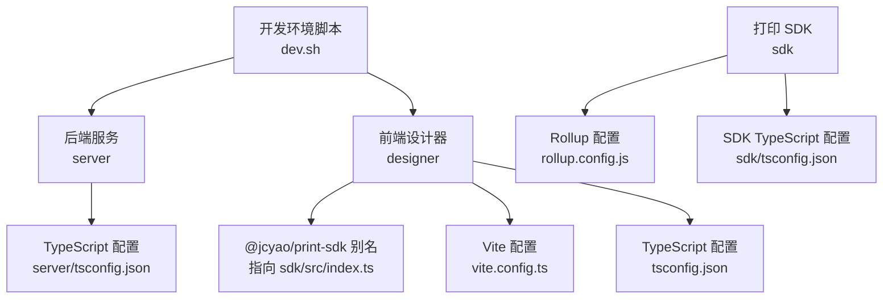
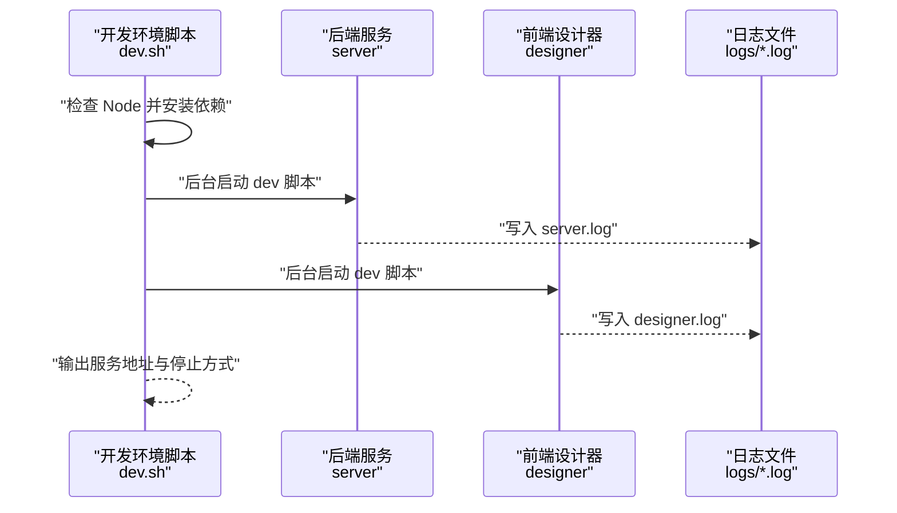
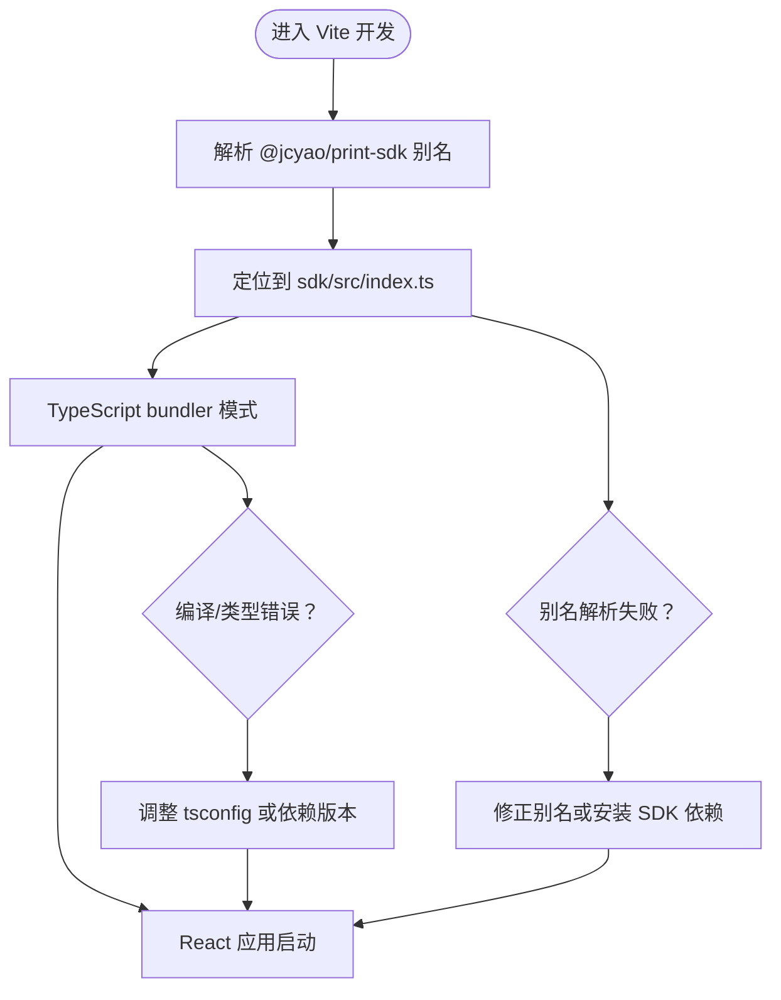
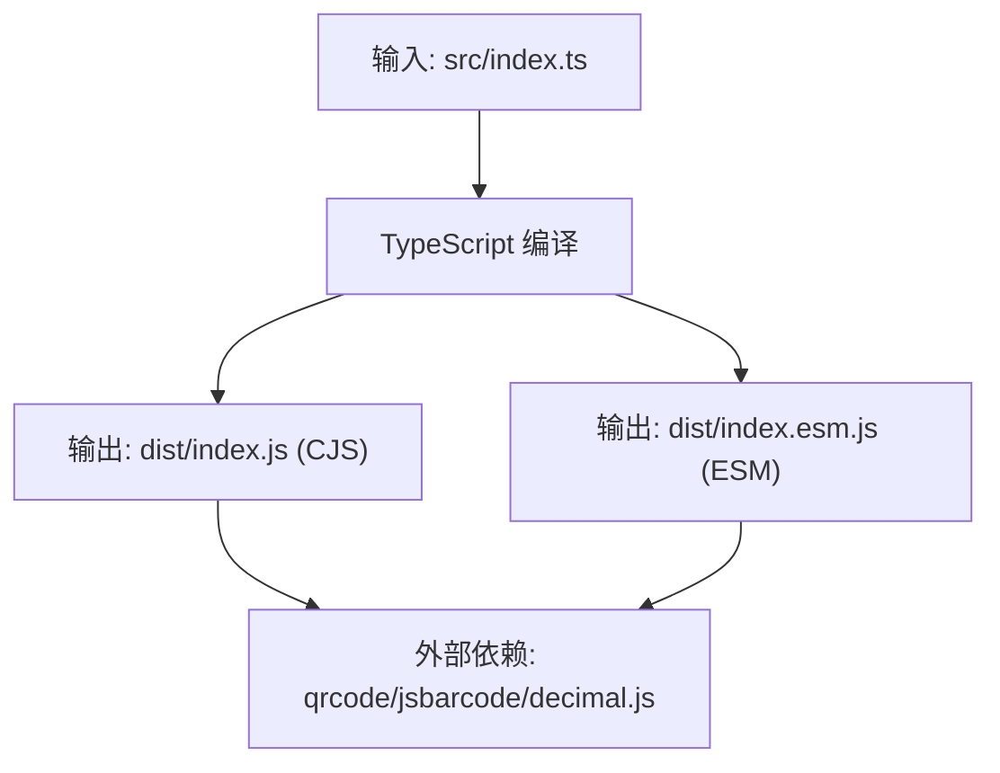
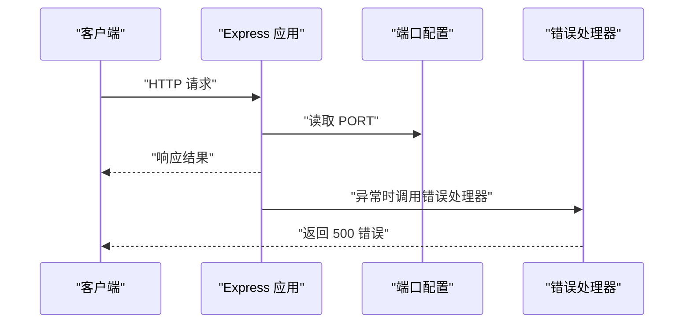
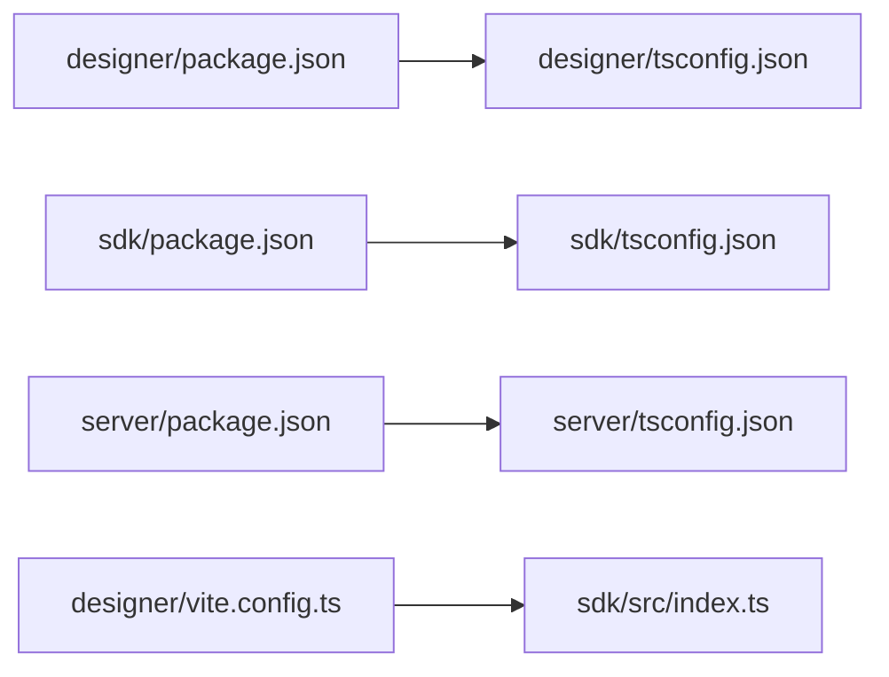

# 开发环境问题

<cite>
**本文引用的文件**
- [dev.sh](file://dev.sh)
- [DEV_README.md](file://DEV_README.md)
- [designer/package.json](file://designer/package.json)
- [designer/vite.config.ts](file://designer/vite.config.ts)
- [designer/tsconfig.json](file://designer/tsconfig.json)
- [sdk/package.json](file://sdk/package.json)
- [sdk/rollup.config.js](file://sdk/rollup.config.js)
- [sdk/tsconfig.json](file://sdk/tsconfig.json)
- [server/package.json](file://server/package.json)
- [server/tsconfig.json](file://server/tsconfig.json)
- [server/src/index.ts](file://server/src/index.ts)
- [server/src/middlewares/errorHandler.ts](file://server/src/middlewares/errorHandler.ts)
- [server/src/routes/schemas.ts](file://server/src/routes/schemas.ts)
</cite>

## 目录
1. [简介](#简介)
2. [项目结构](#项目结构)
3. [核心组件](#核心组件)
4. [架构总览](#架构总览)
5. [详细组件分析](#详细组件分析)
6. [依赖关系分析](#依赖关系分析)
7. [性能考虑](#性能考虑)
8. [故障排除指南](#故障排除指南)
9. [结论](#结论)
10. [附录](#附录)

## 简介
本指南面向打印平台的开发环境使用者，聚焦于依赖安装冲突、构建失败（TypeScript 编译、Vite 构建、Rollup 打包）、以及开发服务器启动失败（端口占用、配置错误、环境变量缺失）等常见问题的诊断与修复。文档结合仓库内实际配置文件与脚本，提供可复现的排查步骤、错误示例与修复命令，帮助开发者快速定位并解决问题。

## 项目结构
项目采用多包结构，包含后端服务、前端设计器与打印 SDK 三部分，并通过一键启动脚本统一拉起开发环境。关键位置与职责如下：
- server：基于 Express 的后端服务，默认监听 3000 端口，提供 API 路由与错误处理。
- designer：基于 Vite + React 的前端设计器，开发时通过本地路径别名指向 SDK 源码，便于联调。
- sdk：基于 Rollup 的打印 SDK，输出 CommonJS 与 ESM 双格式，外部依赖标记为外部模块，避免重复打包。
- dev.sh：一键启动脚本，负责检查 Node、安装依赖、启动 server 与 designer，并输出日志与 PID 文件。

图表来源
- [dev.sh:1-102](file://dev.sh#L1-L102)
- [designer/vite.config.ts:1-15](file://designer/vite.config.ts#L1-L15)
- [designer/tsconfig.json:1-26](file://designer/tsconfig.json#L1-L26)
- [sdk/rollup.config.js:1-25](file://sdk/rollup.config.js#L1-L25)
- [sdk/tsconfig.json:1-17](file://sdk/tsconfig.json#L1-L17)
- [server/tsconfig.json:1-13](file://server/tsconfig.json#L1-L13)

章节来源
- [dev.sh:1-102](file://dev.sh#L1-L102)
- [DEV_README.md:27-52](file://DEV_README.md#L27-L52)

## 核心组件
- 一键启动脚本：检查 Node 版本，自动安装 server 与 designer 依赖，后台启动两个服务并记录 PID，同时输出日志文件路径与停止方式。
- Vite 开发服务器：通过插件与路径别名实现本地 SDK 调试；tsconfig 使用 bundler 模式，严格模式开启。
- Rollup 打包：输出 CJS 与 ESM 两份产物，external 外部依赖，配合 SDK 的 tsconfig 与 rollup 配置。
- Express 后端：路由聚合、CORS、JSON 解析、统一错误处理；端口从环境变量读取，缺省 3000。

章节来源
- [dev.sh:17-37](file://dev.sh#L17-L37)
- [dev.sh:49-67](file://dev.sh#L49-L67)
- [designer/vite.config.ts:6-14](file://designer/vite.config.ts#L6-L14)
- [designer/tsconfig.json:9-15](file://designer/tsconfig.json#L9-L15)
- [sdk/rollup.config.js:3-24](file://sdk/rollup.config.js#L3-L24)
- [sdk/tsconfig.json:2-12](file://sdk/tsconfig.json#L2-L12)
- [server/src/index.ts:20-24](file://server/src/index.ts#L20-L24)

## 架构总览
下图展示开发环境启动流程与组件交互：

图表来源
- [dev.sh:20-37](file://dev.sh#L20-L37)
- [dev.sh:50-67](file://dev.sh#L50-L67)
- [DEV_README.md:118-125](file://DEV_README.md#L118-L125)

## 详细组件分析

### 组件一：Vite 开发服务器与本地 SDK 别名
- 路径别名：通过 Vite 配置将 @jcyao/print-sdk 映射到 sdk/src/index.ts，便于在设计器中直接使用本地 SDK 源码进行联调。
- TypeScript 模式：使用 bundler 的 moduleResolution，noEmit 且 JSX 为 react-jsx，确保开发期类型检查与热更新稳定。
- 常见问题：若本地 SDK 未构建或 tsconfig 不匹配，可能出现模块解析失败或类型报错。

图表来源
- [designer/vite.config.ts:8-12](file://designer/vite.config.ts#L8-L12)
- [designer/tsconfig.json:9-15](file://designer/tsconfig.json#L9-L15)

章节来源
- [designer/vite.config.ts:6-14](file://designer/vite.config.ts#L6-L14)
- [designer/tsconfig.json:1-26](file://designer/tsconfig.json#L1-L26)

### 组件二：Rollup 打包与外部依赖
- 输出格式：同时生成 CommonJS 与 ESM 产物，便于不同运行环境消费。
- 外部依赖：明确 external qrcode、jsbarcode、decimal.js，避免重复打包第三方库。
- TypeScript 插件：使用 tsconfig.json 控制编译目标与模块系统。

图表来源
- [sdk/rollup.config.js:3-24](file://sdk/rollup.config.js#L3-L24)
- [sdk/tsconfig.json:2-12](file://sdk/tsconfig.json#L2-L12)

章节来源
- [sdk/rollup.config.js:1-25](file://sdk/rollup.config.js#L1-L25)
- [sdk/tsconfig.json:1-17](file://sdk/tsconfig.json#L1-L17)

### 组件三：Express 后端与错误处理
- 端口：优先从环境变量读取，缺省 3000。
- 中间件：CORS、JSON 解析、统一错误处理。
- 路由：聚合 schemas、templates、mock-data 等 API。

图表来源
- [server/src/index.ts:20-24](file://server/src/index.ts#L20-L24)
- [server/src/middlewares/errorHandler.ts:3-9](file://server/src/middlewares/errorHandler.ts#L3-L9)

章节来源
- [server/src/index.ts:1-25](file://server/src/index.ts#L1-L25)
- [server/src/middlewares/errorHandler.ts:1-10](file://server/src/middlewares/errorHandler.ts#L1-L10)
- [server/tsconfig.json:1-13](file://server/tsconfig.json#L1-L13)

## 依赖关系分析
- 包管理器一致性：各子包使用 npm scripts 启动与构建，未发现 pnpm 专用配置文件冲突迹象。如需统一 pnpm，建议在根目录增加 pnpm-workspace 配置并使用 pnpm 安装。
- 版本兼容性：designer 与 sdk 的 TypeScript 版本分别为 5.x，server 亦为 5.x，整体版本线一致，降低编译期不兼容风险。
- 本地别名：Vite 将 @jcyao/print-sdk 指向 sdk/src/index.ts，确保开发期可直接使用最新 SDK 源码。

图表来源
- [designer/package.json:1-43](file://designer/package.json#L1-L43)
- [sdk/package.json:1-60](file://sdk/package.json#L1-L60)
- [server/package.json:1-25](file://server/package.json#L1-L25)
- [designer/vite.config.ts:10-11](file://designer/vite.config.ts#L10-L11)

章节来源
- [designer/package.json:1-43](file://designer/package.json#L1-L43)
- [sdk/package.json:1-60](file://sdk/package.json#L1-L60)
- [server/package.json:1-25](file://server/package.json#L1-L25)

## 性能考虑
- Vite 开发：bundler 模式与 noEmit 配置有助于减少编译开销，提升热更新速度。
- Rollup 外部依赖：external 外部依赖可显著减小产物体积，避免重复打包第三方库。
- 后端端口：合理设置 PORT，避免端口占用导致反复重试与资源浪费。

## 故障排除指南

### 一、依赖安装冲突与版本兼容性
- 症状
  - 安装阶段报错，提示依赖版本不兼容或冲突。
  - Vite 启动时报模块解析失败或类型检查错误。
- 诊断步骤
  - 确认 Node 版本满足各子包要求（脚本已检查 Node 是否存在）。
  - 检查各子包的 TypeScript 版本是否一致（designer 与 sdk/server 均为 5.x）。
  - 若使用 pnpm，确认是否存在锁文件冲突或 workspace 配置缺失。
- 修复命令
  - 清理缓存并重新安装（以 npm 为例）：
    - 在 server 目录执行安装
    - 在 designer 目录执行安装
  - 若使用 pnpm，建议在根目录执行安装并确保 workspace 配置正确。

章节来源
- [dev.sh:20-37](file://dev.sh#L20-L37)
- [designer/package.json:39-40](file://designer/package.json#L39-L40)
- [sdk/package.json:47](file://sdk/package.json#L47)
- [server/package.json:22](file://server/package.json#L22)

### 二、构建失败（TypeScript 编译错误）
- 症状
  - tsc 报告类型错误或找不到模块。
  - Vite 编译阶段出现 JSX/TSX 类型错误。
- 诊断步骤
  - 检查 tsconfig 的 moduleResolution 是否与打包器一致（Vite 使用 bundler，严格模式开启）。
  - 确认本地 SDK 别名是否指向正确的源文件。
  - 检查是否存在未声明的依赖或版本不匹配。
- 修复命令
  - 在 designer 目录执行类型检查与修复
  - 在 sdk 目录执行类型检查与修复
  - 修正别名或安装缺失依赖

章节来源
- [designer/tsconfig.json:9-15](file://designer/tsconfig.json#L9-L15)
- [designer/vite.config.ts:10-11](file://designer/vite.config.ts#L10-L11)
- [sdk/tsconfig.json:2-12](file://sdk/tsconfig.json#L2-L12)

### 三、Vite 构建配置问题
- 症状
  - 开发服务器无法启动或热更新异常。
  - 路径别名无效，导致模块解析失败。
- 诊断步骤
  - 确认 vite.config.ts 中的别名配置正确指向 sdk 源码。
  - 检查 tsconfig 的 jsx 与 moduleResolution 设置。
- 修复命令
  - 修正别名路径
  - 对齐 tsconfig 的模块解析策略

章节来源
- [designer/vite.config.ts:6-14](file://designer/vite.config.ts#L6-L14)
- [designer/tsconfig.json:9-15](file://designer/tsconfig.json#L9-L15)

### 四、Rollup 打包错误
- 症状
  - 打包阶段报错，提示外部依赖未声明或模块解析失败。
- 诊断步骤
  - 检查 rollup.config.js 的 external 列表是否包含实际使用的三方库。
  - 确认 tsconfig 的 target/module 与打包器兼容。
- 修复命令
  - 在 external 中补充缺失的外部依赖
  - 调整 tsconfig 的编译目标

章节来源
- [sdk/rollup.config.js:17-18](file://sdk/rollup.config.js#L17-L18)
- [sdk/tsconfig.json:2-12](file://sdk/tsconfig.json#L2-L12)

### 五、开发服务器启动失败（端口占用）
- 症状
  - 后端或前端启动时报端口已被占用。
- 诊断步骤
  - 检查 3000（后端）与 5173（前端）端口占用情况。
- 修复命令
  - 设置环境变量 PORT=3001 启动后端
  - 修改 Vite 配置中的 server.port

章节来源
- [DEV_README.md:130-136](file://DEV_README.md#L130-L136)
- [server/src/index.ts:20](file://server/src/index.ts#L20)
- [designer/vite.config.ts:6](file://designer/vite.config.ts#L6)

### 六、配置文件错误
- 症状
  - 启动时报配置解析错误或路径不存在。
- 诊断步骤
  - 检查 vite.config.ts、tsconfig.json、rollup.config.js 的语法与路径。
- 修复命令
  - 修正配置文件中的语法或路径

章节来源
- [designer/vite.config.ts:1-15](file://designer/vite.config.ts#L1-L15)
- [designer/tsconfig.json:1-26](file://designer/tsconfig.json#L1-L26)
- [sdk/rollup.config.js:1-25](file://sdk/rollup.config.js#L1-L25)
- [server/tsconfig.json:1-13](file://server/tsconfig.json#L1-L13)

### 七、环境变量缺失
- 症状
  - 后端监听端口异常或行为不符合预期。
- 诊断步骤
  - 检查是否设置了 PORT 环境变量。
- 修复命令
  - 在启动前设置环境变量后再运行

章节来源
- [server/src/index.ts:20](file://server/src/index.ts#L20)
- [DEV_README.md:134](file://DEV_README.md#L134)

### 八、日志与停止服务
- 症状
  - 需要定位问题但无日志或无法优雅停止服务。
- 诊断步骤
  - 查看 logs/server.log 与 logs/designer.log。
  - 使用 ./stop.sh 或根据 PID 文件停止服务。
- 修复命令
  - 实时查看日志
  - 停止服务并清理 PID 文件

章节来源
- [dev.sh:46-55](file://dev.sh#L46-L55)
- [dev.sh:64-67](file://dev.sh#L64-L67)
- [dev.sh:98-101](file://dev.sh#L98-L101)
- [DEV_README.md:102-110](file://DEV_README.md#L102-L110)

## 结论
通过结合一键启动脚本、Vite 别名配置、Rollup 外部依赖策略与 Express 的统一错误处理，打印平台的开发环境具备良好的可维护性与可观测性。遇到问题时，建议按照“依赖—构建—配置—运行”的顺序逐层排查，并利用日志与 PID 文件快速定位与恢复。

## 附录
- 快速参考
  - 一键启动：./dev.sh
  - 停止服务：./stop.sh 或按 Ctrl+C 后执行 kill 命令
  - 查看日志：tail -f logs/server.log 与 tail -f logs/designer.log
  - 端口切换：设置环境变量 PORT 或修改 Vite 配置中的 server.port