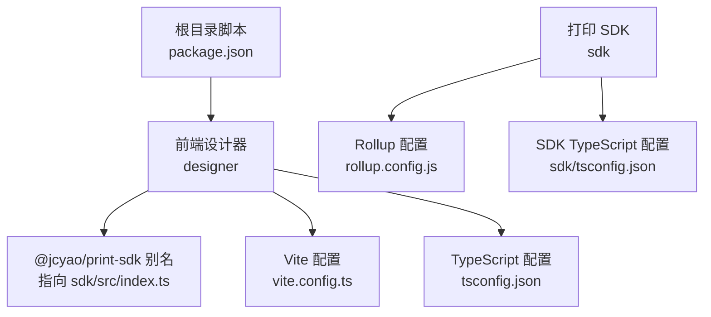
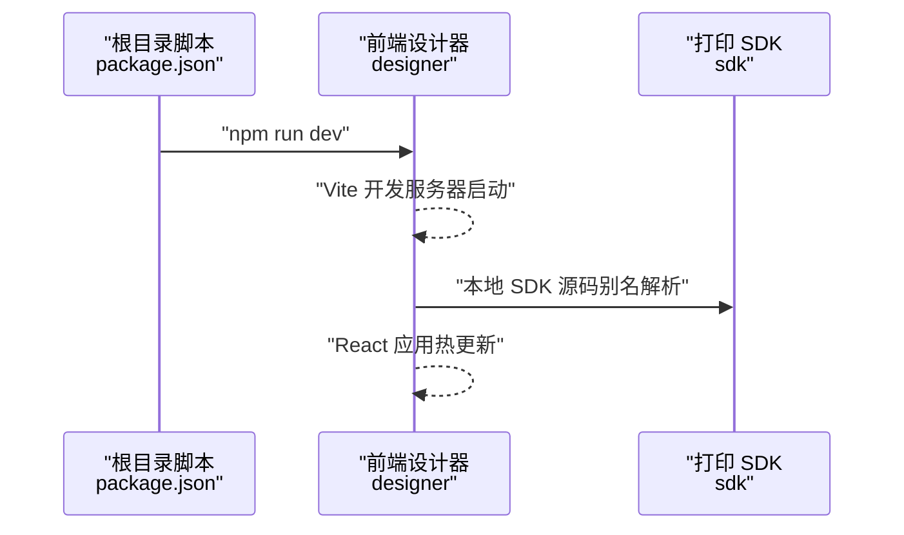
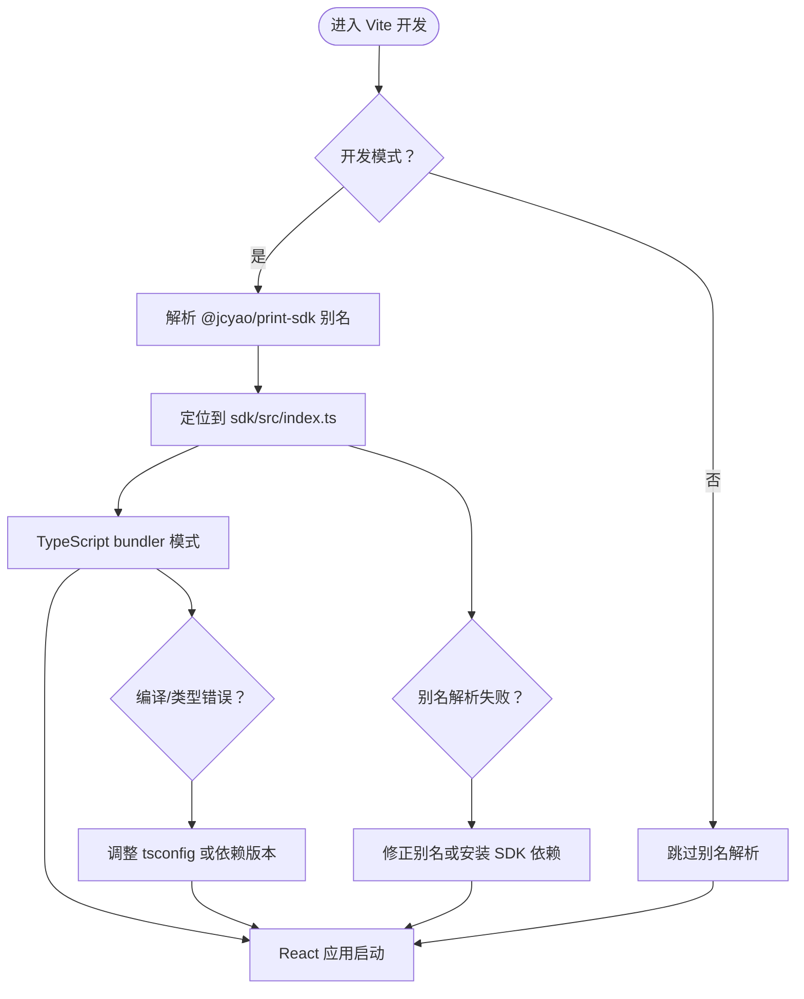
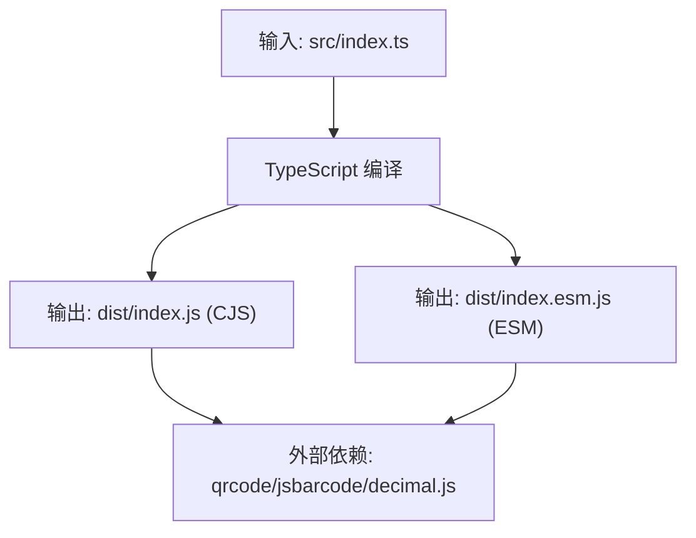
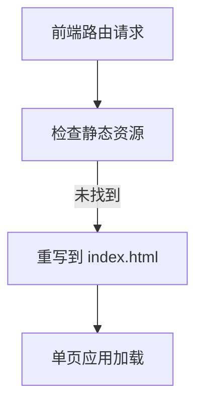
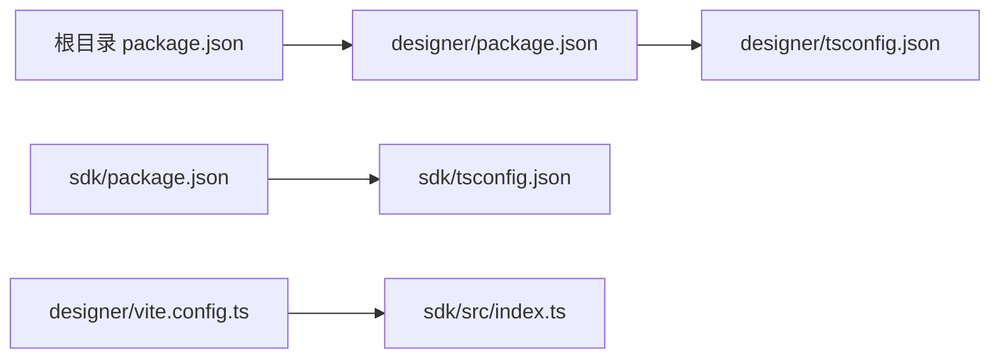

# 开发环境问题

<cite>
**本文引用的文件**
- [package.json](file://package.json)
- [designer/package.json](file://designer/package.json)
- [designer/vite.config.ts](file://designer/vite.config.ts)
- [designer/tsconfig.json](file://designer/tsconfig.json)
- [designer/vercel.json](file://designer/vercel.json)
- [sdk/package.json](file://sdk/package.json)
- [sdk/rollup.config.js](file://sdk/rollup.config.js)
- [sdk/tsconfig.json](file://sdk/tsconfig.json)
</cite>

## 目录
1. [简介](#简介)
2. [项目结构](#项目结构)
3. [核心组件](#核心组件)
4. [架构总览](#架构总览)
5. [详细组件分析](#详细组件分析)
6. [依赖关系分析](#依赖关系分析)
7. [性能考虑](#性能考虑)
8. [故障排除指南](#故障排除指南)
9. [结论](#结论)
10. [附录](#附录)

## 简介
本指南面向打印平台的开发环境使用者，聚焦于依赖安装冲突、构建失败（TypeScript 编译、Vite 构建、Rollup 打包）、以及开发服务器启动失败（端口占用、配置错误、环境变量缺失）等常见问题的诊断与修复。文档结合仓库内实际配置文件与脚本，提供可复现的排查步骤、错误示例与修复命令，帮助开发者快速定位并解决问题。

## 项目结构
项目采用多包结构，包含前端设计器与打印 SDK 两部分，并通过根目录 npm 脚本统一管理开发流程。关键位置与职责如下：
- designer：基于 Vite + React 的前端设计器，开发时通过本地路径别名指向 SDK 源码，便于联调。
- sdk：基于 Rollup 的打印 SDK，输出 CommonJS 与 ESM 双格式，外部依赖标记为外部模块，避免重复打包。
- 根目录脚本：提供统一的开发、构建入口，简化多包协作流程。

图表来源
- [package.json:4-8](file://package.json#L4-L8)
- [designer/vite.config.ts:1-29](file://designer/vite.config.ts#L1-L29)
- [designer/tsconfig.json:1-26](file://designer/tsconfig.json#L1-L26)
- [sdk/rollup.config.js:1-25](file://sdk/rollup.config.js#L1-L25)
- [sdk/tsconfig.json:1-17](file://sdk/tsconfig.json#L1-L17)

章节来源
- [package.json:1-10](file://package.json#L1-L10)

## 核心组件
- 根目录统一脚本：提供 start、build:sdk、build:designer 等脚本，简化多包开发流程。
- Vite 开发服务器：通过插件与路径别名实现本地 SDK 调试；tsconfig 使用 bundler 模式，严格模式开启。
- Rollup 打包：输出 CJS 与 ESM 两份产物，external 外部依赖，配合 SDK 的 tsconfig 与 rollup 配置。
- Vercel 部署配置：通过 rewrites 规则支持 SPA 单页应用路由。

章节来源
- [package.json:4-8](file://package.json#L4-L8)
- [designer/vite.config.ts:8-28](file://designer/vite.config.ts#L8-L28)
- [designer/tsconfig.json:9-22](file://designer/tsconfig.json#L9-L22)
- [sdk/rollup.config.js:3-24](file://sdk/rollup.config.js#L3-L24)
- [sdk/tsconfig.json:2-12](file://sdk/tsconfig.json#L2-L12)
- [designer/vercel.json:1-6](file://designer/vercel.json#L1-L6)

## 架构总览
下图展示开发环境启动流程与组件交互：

图表来源
- [package.json:5](file://package.json#L5)
- [designer/vite.config.ts:20-26](file://designer/vite.config.ts#L20-L26)

## 详细组件分析

### 组件一：Vite 开发服务器与本地 SDK 别名
- 路径别名：通过 Vite 配置将 @jcyao/print-sdk 映射到 sdk/src/index.ts，便于在设计器中直接使用本地 SDK 源码进行联调。
- TypeScript 模式：使用 bundler 的 moduleResolution，noEmit 且 JSX 为 react-jsx，确保开发期类型检查与热更新稳定。
- 开发模式判断：仅在 development 模式下启用别名，避免生产构建时的路径解析问题。
- 常见问题：若本地 SDK 未构建或 tsconfig 不匹配，可能出现模块解析失败或类型报错。

图表来源
- [designer/vite.config.ts:20-26](file://designer/vite.config.ts#L20-L26)
- [designer/tsconfig.json:9-15](file://designer/tsconfig.json#L9-L15)

章节来源
- [designer/vite.config.ts:1-29](file://designer/vite.config.ts#L1-L29)
- [designer/tsconfig.json:1-26](file://designer/tsconfig.json#L1-L26)

### 组件二：Rollup 打包与外部依赖
- 输出格式：同时生成 CommonJS 与 ESM 产物，便于不同运行环境消费。
- 外部依赖：明确 external qrcode、jsbarcode、decimal.js，避免重复打包第三方库。
- TypeScript 插件：使用 tsconfig.json 控制编译目标与模块系统。

图表来源
- [sdk/rollup.config.js:3-24](file://sdk/rollup.config.js#L3-L24)
- [sdk/tsconfig.json:2-12](file://sdk/tsconfig.json#L2-L12)

章节来源
- [sdk/rollup.config.js:1-25](file://sdk/rollup.config.js#L1-L25)
- [sdk/tsconfig.json:1-17](file://sdk/tsconfig.json#L1-L17)

### 组件三：Vercel 部署配置
- SPA 支持：通过 rewrites 规则将所有路由重写到 index.html，支持前端路由。
- 生产构建：配合 Vite 的 demo 模式构建，注入 VITE_USE_MOCK 环境变量。

图表来源
- [designer/vercel.json:2-4](file://designer/vercel.json#L2-L4)

章节来源
- [designer/vercel.json:1-6](file://designer/vercel.json#L1-L6)

## 依赖关系分析
- 包管理器一致性：项目使用 npm 作为包管理器，各子包通过 npm scripts 进行统一管理。
- 版本兼容性：designer 与 sdk 的 TypeScript 版本分别为 5.x，整体版本线一致，降低编译期不兼容风险。
- 本地别名：Vite 将 @jcyao/print-sdk 指向 sdk/src/index.ts，确保开发期可直接使用最新 SDK 源码。
- 依赖声明：designer 通过 @jcyao/print-sdk 依赖 SDK 包，无需本地源码即可使用发布版本。

图表来源
- [package.json:1-10](file://package.json#L1-L10)
- [designer/package.json:13-30](file://designer/package.json#L13-L30)
- [sdk/package.json:49-53](file://sdk/package.json#L49-L53)
- [designer/vite.config.ts:23-25](file://designer/vite.config.ts#L23-L25)

章节来源
- [package.json:1-10](file://package.json#L1-L10)
- [designer/package.json:1-46](file://designer/package.json#L1-L46)
- [sdk/package.json:1-61](file://sdk/package.json#L1-L61)

## 性能考虑
- Vite 开发：bundler 模式与 noEmit 配置有助于减少编译开销，提升热更新速度。
- Rollup 外部依赖：external 外部依赖可显著减小产物体积，避免重复打包第三方库。
- 本地开发优化：仅在开发模式启用 SDK 源码别名，避免生产构建时的额外解析开销。

## 故障排除指南

### 一、依赖安装冲突与版本兼容性
- 症状
  - 安装阶段报错，提示依赖版本不兼容或冲突。
  - Vite 启动时报模块解析失败或类型检查错误。
- 诊断步骤
  - 确认 Node.js 版本满足项目要求。
  - 检查各子包的 TypeScript 版本是否一致（designer 与 sdk 均为 5.x）。
  - 确认 @jcyao/print-sdk 依赖是否正确安装。
- 修复命令
  - 清理 node_modules 和 lock 文件后重新安装
  - 在根目录执行 npm install
  - 检查并修复版本冲突

章节来源
- [designer/package.json:42](file://designer/package.json#L42)
- [sdk/package.json:47](file://sdk/package.json#L47)

### 二、构建失败（TypeScript 编译错误）
- 症状
  - tsc 报告类型错误或找不到模块。
  - Vite 编译阶段出现 JSX/TSX 类型错误。
- 诊断步骤
  - 检查 tsconfig 的 moduleResolution 是否与打包器一致（Vite 使用 bundler，严格模式开启）。
  - 确认本地 SDK 别名是否指向正确的源文件。
  - 检查是否存在未声明的依赖或版本不匹配。
- 修复命令
  - 在 designer 目录执行类型检查与修复
  - 在 sdk 目录执行类型检查与修复
  - 修正别名或安装缺失依赖

章节来源
- [designer/tsconfig.json:9-15](file://designer/tsconfig.json#L9-L15)
- [designer/vite.config.ts:23-25](file://designer/vite.config.ts#L23-L25)
- [sdk/tsconfig.json:2-12](file://sdk/tsconfig.json#L2-L12)

### 三、Vite 构建配置问题
- 症状
  - 开发服务器无法启动或热更新异常。
  - 路径别名无效，导致模块解析失败。
- 诊断步骤
  - 确认 vite.config.ts 中的别名配置正确指向 sdk 源码。
  - 检查 tsconfig 的 jsx 与 moduleResolution 设置。
  - 验证开发模式判断逻辑。
- 修复命令
  - 修正别名路径
  - 对齐 tsconfig 的模块解析策略
  - 检查开发模式判断条件

章节来源
- [designer/vite.config.ts:8-28](file://designer/vite.config.ts#L8-L28)
- [designer/tsconfig.json:9-15](file://designer/tsconfig.json#L9-L15)

### 四、Rollup 打包错误
- 症状
  - 打包阶段报错，提示外部依赖未声明或模块解析失败。
- 诊断步骤
  - 检查 rollup.config.js 的 external 列表是否包含实际使用的三方库。
  - 确认 tsconfig 的 target/module 与打包器兼容。
- 修复命令
  - 在 external 中补充缺失的外部依赖
  - 调整 tsconfig 的编译目标

章节来源
- [sdk/rollup.config.js:17-18](file://sdk/rollup.config.js#L17-L18)
- [sdk/tsconfig.json:2-12](file://sdk/tsconfig.json#L2-L12)

### 五、开发服务器启动失败（端口占用）
- 症状
  - Vite 开发服务器启动时报端口已被占用。
- 诊断步骤
  - 检查默认端口 5173 占用情况。
- 修复命令
  - 修改 Vite 配置中的 server.port
  - 使用其他可用端口

章节来源
- [designer/vite.config.ts:6](file://designer/vite.config.ts#L6)

### 六、配置文件错误
- 症状
  - 启动时报配置解析错误或路径不存在。
- 诊断步骤
  - 检查 vite.config.ts、tsconfig.json、rollup.config.js 的语法与路径。
- 修复命令
  - 修正配置文件中的语法或路径

章节来源
- [designer/vite.config.ts:1-29](file://designer/vite.config.ts#L1-L29)
- [designer/tsconfig.json:1-26](file://designer/tsconfig.json#L1-L26)
- [sdk/rollup.config.js:1-25](file://sdk/rollup.config.js#L1-L25)
- [sdk/tsconfig.json:1-17](file://sdk/tsconfig.json#L1-L17)

### 七、环境变量缺失
- 症状
  - 构建时环境变量未生效或值不正确。
- 诊断步骤
  - 检查 Vite 构建模式与环境变量注入逻辑。
  - 验证 demo 模式的特殊处理。
- 修复命令
  - 在构建时正确设置环境变量
  - 使用 --mode demo 参数进行演示构建

章节来源
- [designer/vite.config.ts:10-14](file://designer/vite.config.ts#L10-L14)

### 八、Vercel 部署问题
- 症状
  - 部署后路由跳转或页面 404。
- 诊断步骤
  - 检查 vercel.json 的 rewrite 规则配置。
  - 验证构建输出与路由配置。
- 修复命令
  - 确保 rewrites 规则正确配置
  - 检查构建产物完整性

章节来源
- [designer/vercel.json:1-6](file://designer/vercel.json#L1-L6)

## 结论
通过结合根目录统一脚本、Vite 别名配置、Rollup 外部依赖策略与 Vercel 部署配置，打印平台的开发环境具备良好的可维护性与可观测性。遇到问题时，建议按照"依赖—构建—配置—运行"的顺序逐层排查，并利用日志与配置文件快速定位与恢复。

## 附录
- 快速参考
  - 一键启动：npm start
  - 构建 SDK：npm run build:sdk
  - 构建设计器：npm run build:designer
  - 开发模式：npm run dev
  - 生产构建：npm run build
  - 演示构建：npm run build:demo
  - 端口切换：修改 Vite 配置中的 server.port