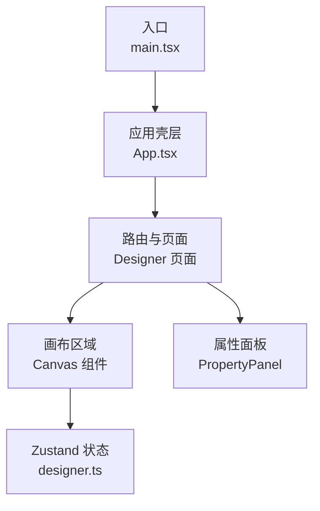
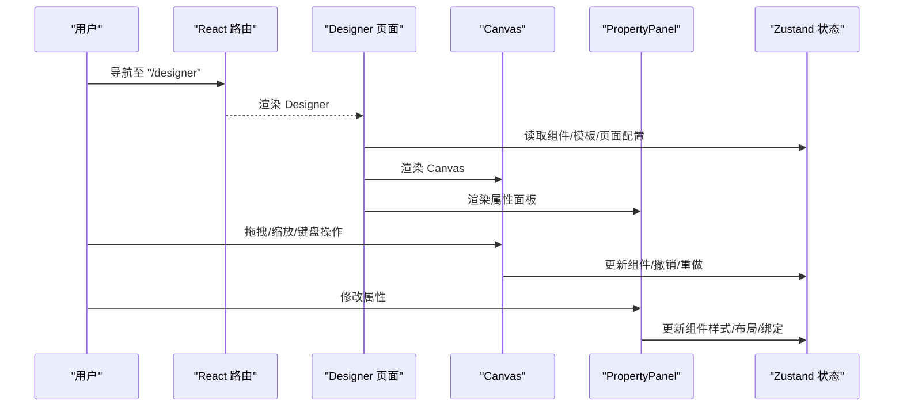
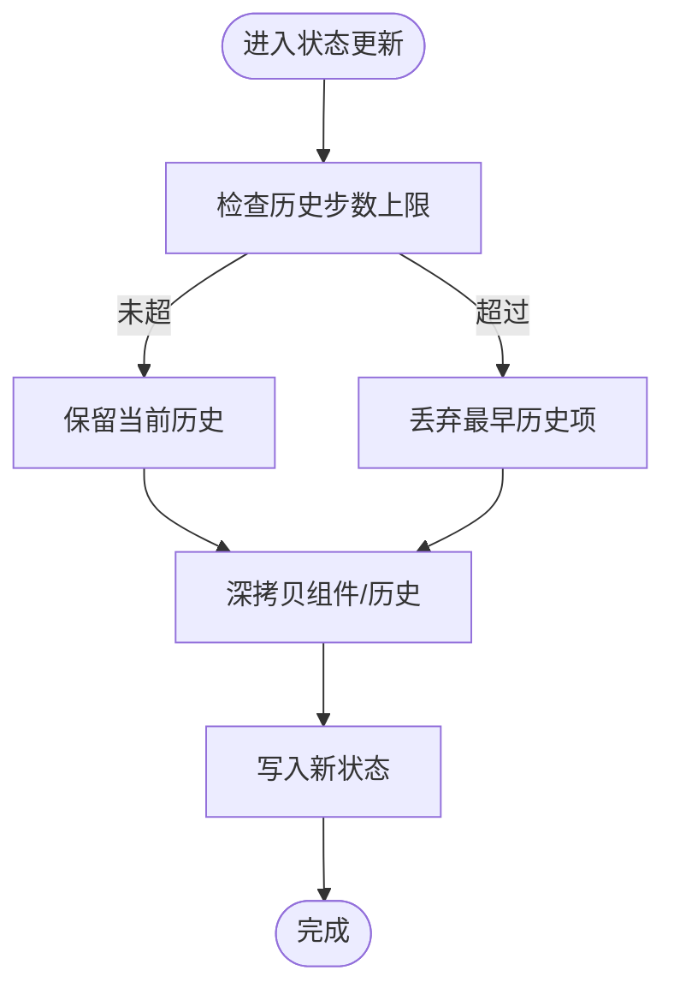
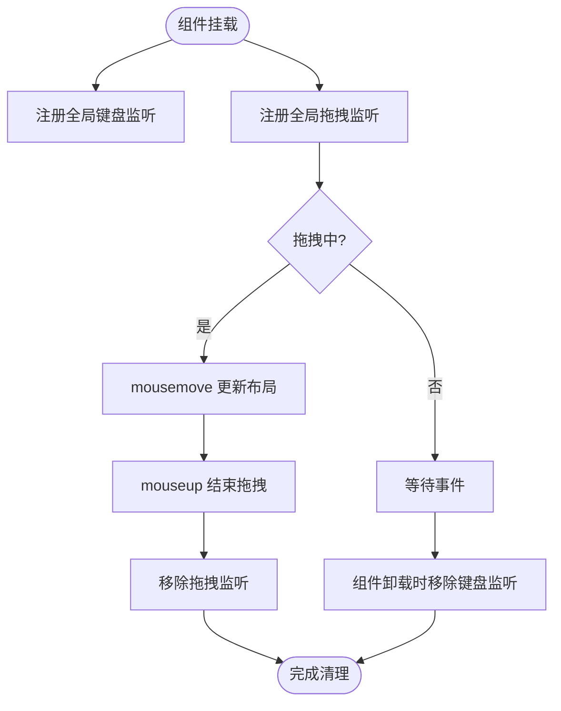
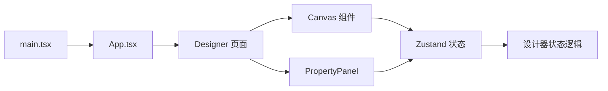

# 内存泄漏检测

<cite>
**本文引用的文件**
- [designer/src/store/designer.ts](file://designer/src/store/designer.ts)
- [designer/src/pages/Designer/index.tsx](file://designer/src/pages/Designer/index.tsx)
- [designer/src/pages/Designer/components/Canvas/index.tsx](file://designer/src/pages/Designer/components/Canvas/index.tsx)
- [designer/src/pages/Designer/components/Canvas/ResizeHandles.tsx](file://designer/src/pages/Designer/components/Canvas/ResizeHandles.tsx)
- [designer/src/pages/Designer/components/PropertyPanel/index.tsx](file://designer/src/pages/Designer/components/PropertyPanel/index.tsx)
- [designer/src/App.tsx](file://designer/src/App.tsx)
- [designer/src/main.tsx](file://designer/src/main.tsx)
</cite>

## 目录
1. [简介](#简介)
2. [项目结构](#项目结构)
3. [核心组件](#核心组件)
4. [架构总览](#架构总览)
5. [详细组件分析](#详细组件分析)
6. [依赖关系分析](#依赖关系分析)
7. [性能考量](#性能考量)
8. [故障排查指南](#故障排查指南)
9. [结论](#结论)
10. [附录](#附录)

## 简介
本指南面向打印设计器项目，聚焦于浏览器端内存泄漏的检测与诊断。内容涵盖：
- Chrome DevTools Memory 面板的使用与 Heap Snapshot 分析技巧
- React 组件卸载时的内存清理检查要点（事件监听器、定时器、DOM 引用）
- Zustand 状态管理的内存优化策略（订阅清理、持久化数据管理）
- 具体代码示例路径与常见泄漏场景及预防措施

## 项目结构
打印设计器采用前端单页应用架构，路由由 React Router 管理，状态通过 Zustand 管理，Canvas 作为交互密集型区域，易产生内存压力。

图表来源
- [designer/src/main.tsx:1-8](file://designer/src/main.tsx#L1-L8)
- [designer/src/App.tsx:1-31](file://designer/src/App.tsx#L1-L31)
- [designer/src/pages/Designer/index.tsx:1-279](file://designer/src/pages/Designer/index.tsx#L1-L279)
- [designer/src/store/designer.ts:1-539](file://designer/src/store/designer.ts#L1-L539)

章节来源
- [designer/src/main.tsx:1-8](file://designer/src/main.tsx#L1-L8)
- [designer/src/App.tsx:1-31](file://designer/src/App.tsx#L1-L31)
- [designer/src/pages/Designer/index.tsx:1-279](file://designer/src/pages/Designer/index.tsx#L1-L279)
- [designer/src/store/designer.ts:1-539](file://designer/src/store/designer.ts#L1-L539)

## 核心组件
- Zustand 设计器状态：负责组件列表、选中状态、模板信息、撤销/重做、网格与对齐等逻辑
- Designer 页面：承载左侧资源面板、中间画布、右侧属性/树面板，以及调试抽屉
- Canvas 区域：交互密集，包含拖拽、缩放、键盘事件、上下文菜单等
- PropertyPanel：组件属性编辑区，按需渲染

章节来源
- [designer/src/store/designer.ts:85-539](file://designer/src/store/designer.ts#L85-L539)
- [designer/src/pages/Designer/index.tsx:17-279](file://designer/src/pages/Designer/index.tsx#L17-L279)
- [designer/src/pages/Designer/components/Canvas/index.tsx:20-1006](file://designer/src/pages/Designer/components/Canvas/index.tsx#L20-L1006)
- [designer/src/pages/Designer/components/PropertyPanel/index.tsx:16-129](file://designer/src/pages/Designer/components/PropertyPanel/index.tsx#L16-L129)

## 架构总览

图表来源
- [designer/src/App.tsx:9-28](file://designer/src/App.tsx#L9-L28)
- [designer/src/pages/Designer/index.tsx:17-279](file://designer/src/pages/Designer/index.tsx#L17-L279)
- [designer/src/pages/Designer/components/Canvas/index.tsx:20-1006](file://designer/src/pages/Designer/components/Canvas/index.tsx#L20-L1006)
- [designer/src/pages/Designer/components/PropertyPanel/index.tsx:16-129](file://designer/src/pages/Designer/components/PropertyPanel/index.tsx#L16-L129)
- [designer/src/store/designer.ts:85-539](file://designer/src/store/designer.ts#L85-L539)

## 详细组件分析

### Zustand 状态管理与内存优化
- 订阅清理：Zustand 默认会自动清理不再使用的订阅，但复杂组件仍需避免在订阅回调中持有长生命周期引用
- 历史记录上限：撤销/重做历史最多保留固定步数，防止无限增长
- 深拷贝与裁剪：历史快照与组件复制均使用深拷贝，注意大对象序列化成本
- 清空画布：重置状态时同步清理历史索引与选中态，避免残留引用

图表来源
- [designer/src/store/designer.ts:74-83](file://designer/src/store/designer.ts#L74-L83)
- [designer/src/store/designer.ts:85-539](file://designer/src/store/designer.ts#L85-L539)

章节来源
- [designer/src/store/designer.ts:85-539](file://designer/src/store/designer.ts#L85-L539)

### Canvas 交互与内存清理要点
- 键盘事件：在 useEffect 中注册/注销全局 keydown 监听，避免组件卸载后残留
- 鼠标拖拽：在拖拽期间注册全局 mousemove/mouseup 监听，拖拽结束或组件卸载时必须移除
- 缩放手柄：ResizeHandles 在拖拽时注册全局事件，需在卸载时清理
- 上下文菜单：右键菜单组件若存在全局事件，同样需要清理
- DOM 引用：避免将 DOM 节点直接存入状态或长生命周期对象；如需访问，使用 ref 并在卸载时置空

图表来源
- [designer/src/pages/Designer/components/Canvas/index.tsx:112-161](file://designer/src/pages/Designer/components/Canvas/index.tsx#L112-L161)
- [designer/src/pages/Designer/components/Canvas/index.tsx:435-562](file://designer/src/pages/Designer/components/Canvas/index.tsx#L435-L562)
- [designer/src/pages/Designer/components/Canvas/ResizeHandles.tsx:48-150](file://designer/src/pages/Designer/components/Canvas/ResizeHandles.tsx#L48-L150)

章节来源
- [designer/src/pages/Designer/components/Canvas/index.tsx:112-161](file://designer/src/pages/Designer/components/Canvas/index.tsx#L112-L161)
- [designer/src/pages/Designer/components/Canvas/index.tsx:435-562](file://designer/src/pages/Designer/components/Canvas/index.tsx#L435-L562)
- [designer/src/pages/Designer/components/Canvas/ResizeHandles.tsx:48-150](file://designer/src/pages/Designer/components/Canvas/ResizeHandles.tsx#L48-L150)

### PropertyPanel 与组件属性更新
- 通过状态更新函数批量修改组件的布局/样式/props/binding，避免直接操作 DOM
- 若子面板内部有事件监听或定时器，务必在卸载时清理

章节来源
- [designer/src/pages/Designer/components/PropertyPanel/index.tsx:34-74](file://designer/src/pages/Designer/components/PropertyPanel/index.tsx#L34-L74)

### Designer 页面与调试抽屉
- 调试抽屉在打开时渲染模板 JSON，注意大模板字符串的渲染与复制操作可能带来瞬时内存峰值
- 折叠面板与抽屉开关应避免频繁创建/销毁重型子树

章节来源
- [designer/src/pages/Designer/index.tsx:234-273](file://designer/src/pages/Designer/index.tsx#L234-L273)

## 依赖关系分析

图表来源
- [designer/src/main.tsx:1-8](file://designer/src/main.tsx#L1-L8)
- [designer/src/App.tsx:1-31](file://designer/src/App.tsx#L1-L31)
- [designer/src/pages/Designer/index.tsx:1-279](file://designer/src/pages/Designer/index.tsx#L1-L279)
- [designer/src/pages/Designer/components/Canvas/index.tsx:1-1006](file://designer/src/pages/Designer/components/Canvas/index.tsx#L1-L1006)
- [designer/src/pages/Designer/components/PropertyPanel/index.tsx:1-129](file://designer/src/pages/Designer/components/PropertyPanel/index.tsx#L1-L129)
- [designer/src/store/designer.ts:1-539](file://designer/src/store/designer.ts#L1-L539)

章节来源
- [designer/src/main.tsx:1-8](file://designer/src/main.tsx#L1-L8)
- [designer/src/App.tsx:1-31](file://designer/src/App.tsx#L1-L31)
- [designer/src/pages/Designer/index.tsx:1-279](file://designer/src/pages/Designer/index.tsx#L1-L279)
- [designer/src/store/designer.ts:1-539](file://designer/src/store/designer.ts#L1-L539)

## 性能考量
- 大模板 JSON 渲染：避免在抽屉内进行高频字符串拼接与格式化，必要时使用虚拟滚动或分段渲染
- 深拷贝成本：撤销/重做与复制粘贴涉及深拷贝，建议控制组件数量与嵌套层级
- 事件去抖/节流：拖拽与缩放过程中尽量减少状态写入频率
- 图片与表格：大量图片/表格组件会显著增加内存占用，建议懒加载与分页

## 故障排查指南

### 浏览器内存分析工具使用步骤（Chrome DevTools）
- 打开 DevTools，切换到 Memory 面板
- 点击“快照”按钮，执行若干操作（拖拽、缩放、复制粘贴、撤销/重做、打开/关闭抽屉）
- 再次点击“堆快照”，对比两次快照的增量
- 在快照树中按“按保留者”排序，定位未释放的对象
- 关注以下热点：
  - 全局事件监听器（window.addEventListener）
  - 闭包持有的组件实例
  - 大数组/对象（历史记录、组件列表）
  - DOM 节点引用（ref 未清理）

### 常见泄漏场景与预防
- 未移除的全局事件监听器
  - 现象：即使离开页面，内存仍持续上涨
  - 预防：在 useEffect 返回函数中移除监听；确保拖拽与键盘监听在卸载时清理
  - 参考路径
    - [designer/src/pages/Designer/components/Canvas/index.tsx:112-161](file://designer/src/pages/Designer/components/Canvas/index.tsx#L112-L161)
    - [designer/src/pages/Designer/components/Canvas/index.tsx:435-562](file://designer/src/pages/Designer/components/Canvas/index.tsx#L435-L562)
    - [designer/src/pages/Designer/components/Canvas/ResizeHandles.tsx:48-150](file://designer/src/pages/Designer/components/Canvas/ResizeHandles.tsx#L48-L150)
- 持久化数据膨胀
  - 现象：撤销/重做历史过多导致内存飙升
  - 预防：限制历史步数；必要时提供手动清空历史的入口
  - 参考路径
    - [designer/src/store/designer.ts:65-83](file://designer/src/store/designer.ts#L65-L83)
    - [designer/src/store/designer.ts:298-331](file://designer/src/store/designer.ts#L298-L331)
- DOM 引用未释放
  - 现象：组件卸载后仍有节点引用
  - 预防：使用 ref 存储 DOM，组件卸载时置空；避免将 DOM 存入状态
- 大对象深拷贝
  - 现象：复制/粘贴/撤销时内存峰值升高
  - 预防：控制组件规模；对超大对象考虑分块处理或延迟序列化

### 代码示例路径（正确卸载处理方式）
- 键盘事件监听清理
  - [designer/src/pages/Designer/components/Canvas/index.tsx:112-161](file://designer/src/pages/Designer/components/Canvas/index.tsx#L112-L161)
- 拖拽事件监听清理
  - [designer/src/pages/Designer/components/Canvas/index.tsx:435-562](file://designer/src/pages/Designer/components/Canvas/index.tsx#L435-L562)
- 缩放手柄事件监听清理
  - [designer/src/pages/Designer/components/Canvas/ResizeHandles.tsx:48-150](file://designer/src/pages/Designer/components/Canvas/ResizeHandles.tsx#L48-L150)
- Zustand 订阅与历史清理
  - [designer/src/store/designer.ts:298-331](file://designer/src/store/designer.ts#L298-L331)
  - [designer/src/store/designer.ts:85-539](file://designer/src/store/designer.ts#L85-L539)

## 结论
- 打印设计器的内存风险主要集中在 Canvas 的全局事件与大模板渲染
- 通过严格的事件监听清理、历史步数限制与 DOM 引用管理，可有效降低泄漏概率
- 建议在开发与回归测试阶段定期使用 DevTools Memory 面板进行快照对比，及时发现异常增长

## 附录
- 路由与入口
  - [designer/src/main.tsx:1-8](file://designer/src/main.tsx#L1-L8)
  - [designer/src/App.tsx:1-31](file://designer/src/App.tsx#L1-L31)
- 状态定义与导出
  - [designer/src/store/designer.ts:85-539](file://designer/src/store/designer.ts#L85-L539)
- 页面与面板
  - [designer/src/pages/Designer/index.tsx:17-279](file://designer/src/pages/Designer/index.tsx#L17-L279)
  - [designer/src/pages/Designer/components/PropertyPanel/index.tsx:16-129](file://designer/src/pages/Designer/components/PropertyPanel/index.tsx#L16-L129)