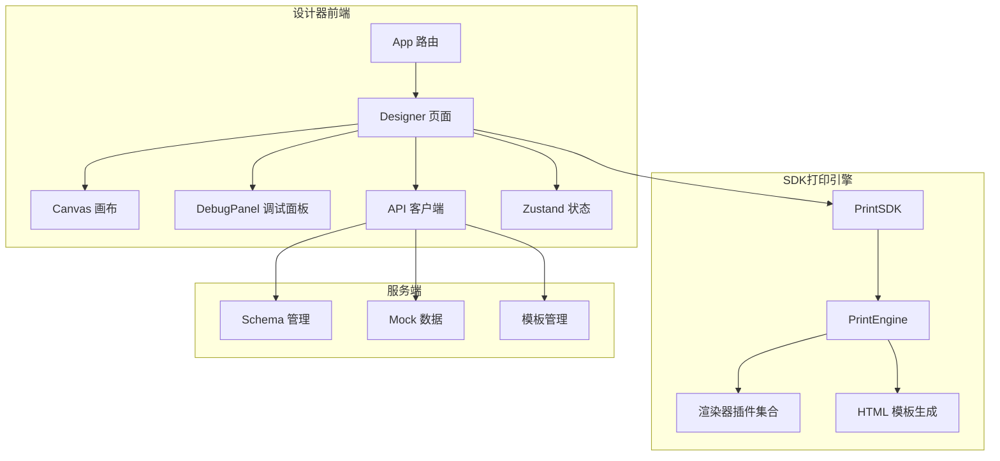
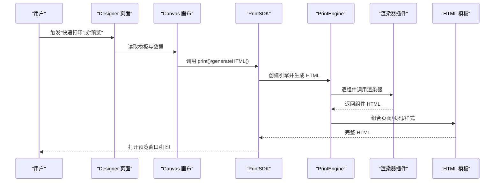
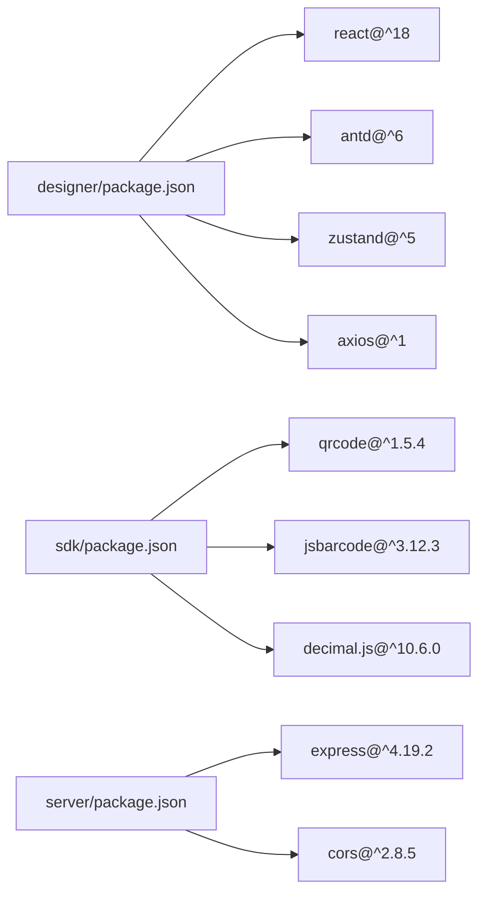

# 性能监控工具

<cite>
**本文引用的文件**
- [README.md](file://README.md)
- [DEV_README.md](file://DEV_README.md)
- [designer/package.json](file://designer/package.json)
- [sdk/package.json](file://sdk/package.json)
- [server/package.json](file://server/package.json)
- [designer/src/main.tsx](file://designer/src/main.tsx)
- [designer/src/App.tsx](file://designer/src/App.tsx)
- [designer/src/pages/Designer/index.tsx](file://designer/src/pages/Designer/index.tsx)
- [designer/src/pages/Designer/components/Canvas/index.tsx](file://designer/src/pages/Designer/components/Canvas/index.tsx)
- [designer/src/pages/Designer/components/DebugPanel/index.tsx](file://designer/src/pages/Designer/components/DebugPanel/index.tsx)
- [designer/src/services/api.ts](file://designer/src/services/api.ts)
- [designer/src/store/designer.ts](file://designer/src/store/designer.ts)
- [sdk/src/PrintSDK.ts](file://sdk/src/PrintSDK.ts)
- [sdk/src/printEngine.ts](file://sdk/src/printEngine.ts)
</cite>

## 目录
1. [简介](#简介)
2. [项目结构](#项目结构)
3. [核心组件](#核心组件)
4. [架构总览](#架构总览)
5. [详细组件分析](#详细组件分析)
6. [依赖关系分析](#依赖关系分析)
7. [性能考量](#性能考量)
8. [故障排查指南](#故障排查指南)
9. [结论](#结论)
10. [附录](#附录)

## 简介
本指南面向打印平台的性能监控与优化，围绕浏览器端性能工具（Chrome DevTools Performance 面板、React DevTools Profiler）与平台自身渲染与打印流程，提供系统性的使用方法、自定义指标采集、性能基线建立与问题定位流程。目标是帮助开发者在设计器（React/Vite）与 SDK（渲染引擎/打印流程）两端高效发现并解决性能瓶颈。

## 项目结构
- 前端设计器（React 18 + TypeScript + Vite）：可视化模板设计器，提供组件拖拽、属性配置、打印预览与调试面板。
- SDK（纯 TS 实现，独立包）：打印引擎负责模板解析、组件渲染器插件化、管道转换、虚拟分页与 HTML 生成；对外提供打印/预览/批量打印能力。
- 服务端（Node.js + Express）：提供 Schema、Mock 数据、模板的 REST API，便于设计器加载与调试。

图表来源
- [designer/src/App.tsx:1-31](file://designer/src/App.tsx#L1-L31)
- [designer/src/pages/Designer/index.tsx:1-279](file://designer/src/pages/Designer/index.tsx#L1-L279)
- [designer/src/pages/Designer/components/Canvas/index.tsx:1-800](file://designer/src/pages/Designer/components/Canvas/index.tsx#L1-L800)
- [designer/src/pages/Designer/components/DebugPanel/index.tsx:1-74](file://designer/src/pages/Designer/components/DebugPanel/index.tsx#L1-L74)
- [designer/src/services/api.ts:1-97](file://designer/src/services/api.ts#L1-L97)
- [sdk/src/PrintSDK.ts:1-253](file://sdk/src/PrintSDK.ts#L1-L253)
- [sdk/src/printEngine.ts:1-757](file://sdk/src/printEngine.ts#L1-L757)

章节来源
- [README.md:191-234](file://README.md#L191-L234)
- [DEV_README.md:27-52](file://DEV_README.md#L27-L52)

## 核心组件
- 设计器路由与页面：App 路由组织页面，Designer 页面承载画布、属性面板、组件树与调试面板。
- Canvas 画布：组件拖拽、对齐、网格吸附、快捷键、页面设置、打印预览。
- DebugPanel 调试面板：导出模板 JSON，便于性能对比与回归验证。
- Zustand 状态：组件列表、选中状态、撤销/重做、网格/对齐等。
- API 客户端：访问服务端 Schema/Mock/模板接口。
- PrintSDK：统一打印入口，支持预览、直接打印、批量打印与进度回调。
- PrintEngine：模板解析、数据绑定、管道转换、虚拟分页、HTML 生成与页码渲染。

章节来源
- [designer/src/App.tsx:1-31](file://designer/src/App.tsx#L1-L31)
- [designer/src/pages/Designer/index.tsx:1-279](file://designer/src/pages/Designer/index.tsx#L1-L279)
- [designer/src/pages/Designer/components/Canvas/index.tsx:1-800](file://designer/src/pages/Designer/components/Canvas/index.tsx#L1-L800)
- [designer/src/pages/Designer/components/DebugPanel/index.tsx:1-74](file://designer/src/pages/Designer/components/DebugPanel/index.tsx#L1-L74)
- [designer/src/store/designer.ts:1-539](file://designer/src/store/designer.ts#L1-L539)
- [designer/src/services/api.ts:1-97](file://designer/src/services/api.ts#L1-L97)
- [sdk/src/PrintSDK.ts:1-253](file://sdk/src/PrintSDK.ts#L1-L253)
- [sdk/src/printEngine.ts:1-757](file://sdk/src/printEngine.ts#L1-L757)

## 架构总览
本节聚焦“性能监控视角”的关键调用链路与数据流，帮助定位 CPU、内存、网络与渲染热点。

图表来源
- [designer/src/pages/Designer/index.tsx:688-695](file://designer/src/pages/Designer/index.tsx#L688-L695)
- [sdk/src/PrintSDK.ts:53-97](file://sdk/src/PrintSDK.ts#L53-L97)
- [sdk/src/printEngine.ts:668-725](file://sdk/src/printEngine.ts#L668-L725)

## 详细组件分析

### Chrome DevTools Performance 面板使用指南
- CPU Profile 分析
  - 场景：设计器拖拽组件、属性面板频繁更新、Canvas 重绘、页码渲染、批量打印拼接。
  - 建议：录制前清理缓存，复现典型操作（拖拽/缩放/对齐/复制粘贴/预览），观察主线程耗时热点（事件循环阻塞、频繁重排/重绘）。
  - 关注点：事件处理器绑定/解绑、Zustand 状态变更、DOM 查询与更新、图片/二维码/条形码渲染。
- Memory Timeline 监控
  - 场景：长时间编辑模板、频繁切换页面设置、大量组件拖拽与撤销/重做。
  - 建议：关注堆快照差异、监听器泄漏、闭包持有、组件卸载后的残留引用。
  - 关注点：Canvas 事件监听器、键盘快捷键监听、打印窗口/iframe 生命周期。
- Network 性能检测
  - 场景：设计器加载 Schema/Mock/模板、调试面板导出模板 JSON。
  - 建议：检查请求耗时、缓存命中、并发请求数、跨域与预检请求。
  - 关注点：API 基础地址、请求头、CORS 配置、Mock 数据体积。

章节来源
- [designer/src/services/api.ts:1-97](file://designer/src/services/api.ts#L1-L97)
- [designer/src/pages/Designer/components/Canvas/index.tsx:112-161](file://designer/src/pages/Designer/components/Canvas/index.tsx#L112-L161)
- [designer/src/pages/Designer/components/Canvas/index.tsx:434-562](file://designer/src/pages/Designer/components/Canvas/index.tsx#L434-L562)

### React DevTools Profiler 集成使用
- 场景：设计器组件树复杂（Canvas、属性面板、组件树、调试面板），组件渲染与重渲染频率较高。
- 建议：开启 Profiler，录制典型操作（拖拽、对齐、复制粘贴、切换面板），观察组件渲染次数与耗时。
- 关注点：
  - Designer 主容器是否触发不必要的重渲染；
  - 属性面板与组件树面板的渲染粒度；
  - 调试面板抽屉的打开/关闭是否导致深层组件重渲染；
  - Zustand 状态订阅范围是否过大。

章节来源
- [designer/src/pages/Designer/index.tsx:1-279](file://designer/src/pages/Designer/index.tsx#L1-L279)
- [designer/src/store/designer.ts:1-539](file://designer/src/store/designer.ts#L1-L539)

### 自定义性能指标采集与基线建立
- 关键路径测量
  - 模板生成：从状态到模板 JSON 的序列化耗时（调试面板导出 JSON 作为对比基准）。
  - 渲染生成：PrintEngine 逐组件渲染与 HTML 拼接耗时。
  - 预览/打印：打开新窗口/隐藏 iframe、等待图片加载、调用 print() 的总耗时。
- 用户体验指标
  - 首次渲染（TTFB + FCP）、交互可用（TTI）、长任务占比、帧率波动。
- 性能回归检测
  - 建立基线：在稳定版本上录制 CPU/内存/网络与渲染数据，形成“黄金数据集”。
  - 回归阈值：设定 CPU 占用上限、内存峰值、网络请求次数上限、渲染耗时上限。
  - 自动化：结合 CI 流水线，对关键路径进行回归对比。

章节来源
- [designer/src/pages/Designer/components/DebugPanel/index.tsx:1-74](file://designer/src/pages/Designer/components/DebugPanel/index.tsx#L1-L74)
- [sdk/src/PrintSDK.ts:53-97](file://sdk/src/PrintSDK.ts#L53-L97)
- [sdk/src/printEngine.ts:668-725](file://sdk/src/printEngine.ts#L668-L725)

### 监控脚本示例与实践建议
- 设计器性能录制脚本（概念示意）
  - 清理缓存与本地存储；
  - 打开 DevTools，启用 Performance 面板；
  - 录制前执行一次“重置模板”，确保初始状态一致；
  - 执行典型操作序列（拖拽/对齐/复制粘贴/预览/打印），停止录制；
  - 导出记录，分析主线程火焰图与内存增长曲线。
- SDK 渲染性能脚本（概念示意）
  - 准备不同规模的模板与数据（小/中/大），记录模板生成与 HTML 生成耗时；
  - 对比预览与直接打印两种路径的耗时差异；
  - 统计图片/二维码/条形码加载等待时间占比。
- 网络性能脚本（概念示意）
  - 使用 Network 面板记录 Schema/Mock/模板请求；
  - 统计平均 RTT、带宽利用率、缓存命中率；
  - 识别慢请求与阻塞请求，优化并发与缓存策略。

[本节为方法论与流程建议，不直接分析具体文件，故无章节来源]

### 快速定位与解决流程
- 问题现象：页面卡顿、渲染延迟、预览闪烁、打印等待过久。
- 定位步骤：
  1) 使用 Performance 面板录制，确认是否为主线程阻塞或频繁重排；
  2) 使用 Profiler 检查组件重渲染热点，缩小到具体组件；
  3) 检查 Zustand 订阅范围，避免无关状态引发重渲染；
  4) 使用 Network 面板检查是否存在过多/过慢的请求；
  5) 验证 PrintEngine 渲染路径，减少不必要的 DOM 操作与样式计算；
  6) 对比基线数据，量化优化收益。
- 常见优化点：
  - Canvas 事件监听器去抖/节流；
  - 属性面板按需渲染；
  - 预览窗口/iframe 生命周期管理；
  - 图片/二维码/条形码资源预加载与缓存；
  - 批量打印时的 HTML 拼接与分页策略。

章节来源
- [designer/src/pages/Designer/components/Canvas/index.tsx:434-562](file://designer/src/pages/Designer/components/Canvas/index.tsx#L434-L562)
- [designer/src/store/designer.ts:1-539](file://designer/src/store/designer.ts#L1-L539)
- [sdk/src/printEngine.ts:396-541](file://sdk/src/printEngine.ts#L396-L541)

## 依赖关系分析
- 前端依赖
  - React 18、Ant Design 6、Zustand、Monaco Editor、Axios、QRCode/Barcode 等。
- SDK 依赖
  - decimal.js（高精度）、qrcode、jsbarcode。
- 服务端依赖
  - Express、CORS、UUID。

图表来源
- [designer/package.json:12-27](file://designer/package.json#L12-L27)
- [sdk/package.json:49-53](file://sdk/package.json#L49-L53)
- [server/package.json:11-14](file://server/package.json#L11-L14)

章节来源
- [designer/package.json:1-43](file://designer/package.json#L1-L43)
- [sdk/package.json:1-60](file://sdk/package.json#L1-L60)
- [server/package.json:1-25](file://server/package.json#L1-L25)

## 性能考量
- 渲染路径优化
  - 将昂贵的计算（如分页、表格拆分）集中在 PrintEngine 内部，避免在 UI 层重复计算。
  - 使用虚拟分页与相对间距模型，降低 DOM 节点数量与布局压力。
- 状态管理
  - Zustand 的细粒度订阅，避免全局状态变化导致的过度重渲染。
- 资源加载
  - 二维码/条形码采用同步生成与缓存策略；外部图片资源等待加载后再触发打印。
- 批量打印
  - 合并页面 HTML 片段，减少多次打印确认与窗口切换成本。

章节来源
- [sdk/src/printEngine.ts:396-541](file://sdk/src/printEngine.ts#L396-L541)
- [sdk/src/PrintSDK.ts:135-243](file://sdk/src/PrintSDK.ts#L135-L243)

## 故障排查指南
- 预览窗口无法打开或打印失败
  - 检查浏览器弹窗拦截设置，确认 print() 调用时机与资源加载完成。
- 图片/二维码/条形码未显示
  - 确认资源加载完成后再调用 print()；检查 base64 生成与缓存。
- 拖拽/对齐异常
  - 检查网格吸附与对齐检测逻辑，确认事件监听器正确绑定与解绑。
- 网络请求超时或失败
  - 核对 API 基础地址、CORS 配置与服务端状态；检查 Mock 数据与 Schema 的加载情况。

章节来源
- [sdk/src/PrintSDK.ts:53-97](file://sdk/src/PrintSDK.ts#L53-L97)
- [designer/src/pages/Designer/components/Canvas/index.tsx:434-562](file://designer/src/pages/Designer/components/Canvas/index.tsx#L434-L562)
- [designer/src/services/api.ts:1-97](file://designer/src/services/api.ts#L1-L97)

## 结论
通过将 Chrome DevTools 与 React Profiler 的系统化使用，结合 SDK 渲染路径与设计器交互行为的深入理解，可以有效定位并优化打印平台的性能瓶颈。建议建立稳定的性能基线与回归流程，持续监控关键路径与用户体验指标，确保在复杂模板与大数据量场景下的流畅体验。

## 附录
- 快速启动与服务地址
  - 前端设计器：http://localhost:5173
  - 后端 API：http://localhost:3000
    - GET /api/schemas
    - GET /api/mock-data
    - GET /api/templates

章节来源
- [DEV_README.md:118-125](file://DEV_README.md#L118-L125)