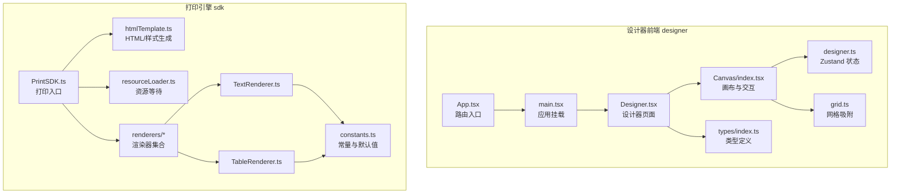
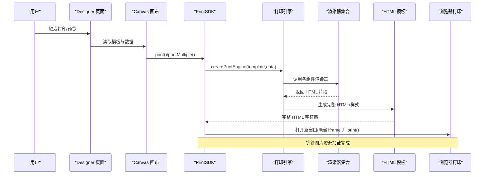
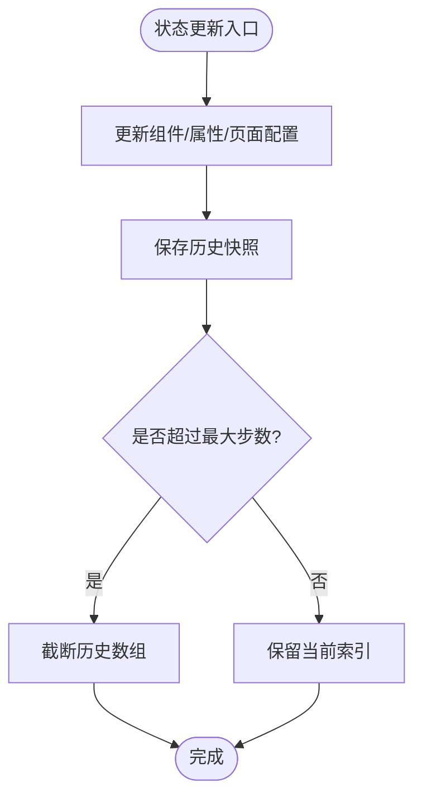
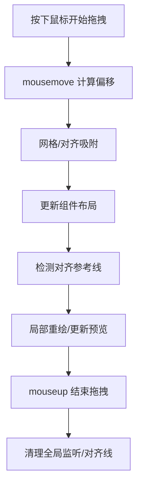
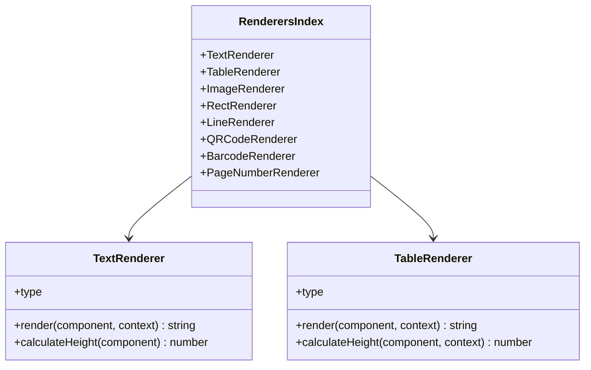
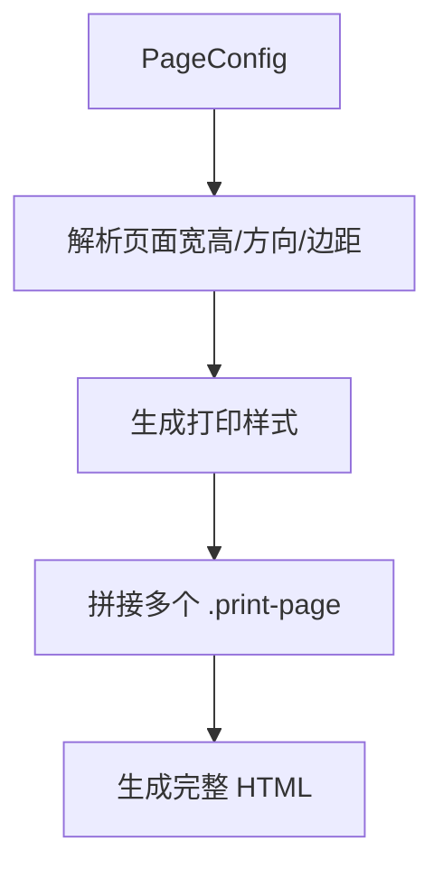
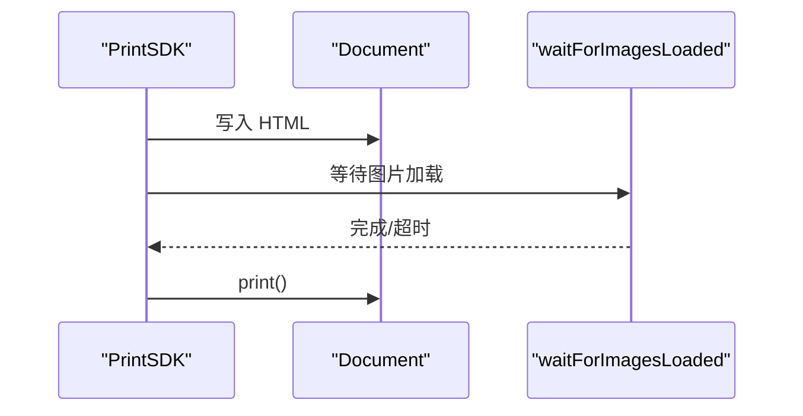
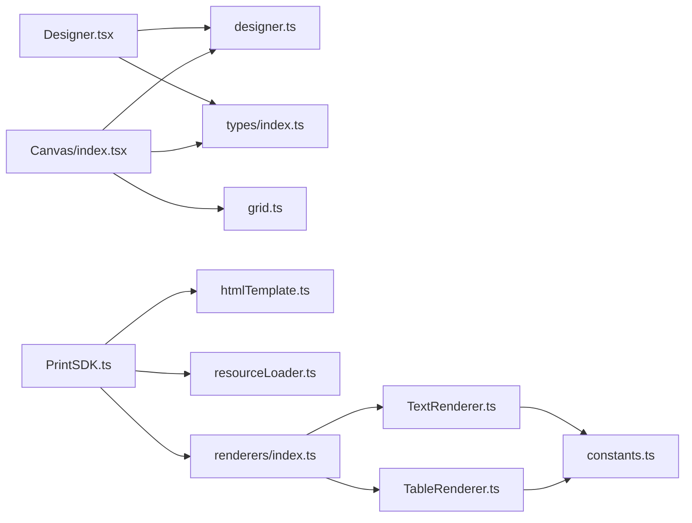

# 性能问题

<cite>
**本文引用的文件**
- [App.tsx](file://designer/src/App.tsx)
- [main.tsx](file://designer/src/main.tsx)
- [Designer.tsx](file://designer/src/pages/Designer/index.tsx)
- [Canvas/index.tsx](file://designer/src/pages/Designer/components/Canvas/index.tsx)
- [ComponentPreview.tsx](file://designer/src/pages/Designer/components/Canvas/ComponentPreview.tsx)
- [designer.ts](file://designer/src/store/designer.ts)
- [grid.ts](file://designer/src/utils/grid.ts)
- [PrintSDK.ts](file://sdk/src/PrintSDK.ts)
- [resourceLoader.ts](file://sdk/src/utils/resourceLoader.ts)
- [htmlTemplate.ts](file://sdk/src/printEngine/htmlTemplate.ts)
- [constants.ts](file://sdk/src/printEngine/constants.ts)
- [TextRenderer.ts](file://sdk/src/printEngine/renderers/TextRenderer.ts)
- [TableRenderer.ts](file://sdk/src/printEngine/renderers/TableRenderer.ts)
- [index.ts](file://sdk/src/printEngine/renderers/index.ts)
- [types/index.ts](file://designer/src/types/index.ts)
</cite>

## 目录
1. [简介](#简介)
2. [项目结构](#项目结构)
3. [核心组件](#核心组件)
4. [架构总览](#架构总览)
5. [详细组件分析](#详细组件分析)
6. [依赖分析](#依赖分析)
7. [性能考量与优化建议](#性能考量与优化建议)
8. [故障排查指南](#故障排查指南)
9. [结论](#结论)
10. [附录](#附录)

## 简介
本指南聚焦于打印平台的性能问题诊断与优化，覆盖以下方面：
- 内存泄漏检测：浏览器内存分析工具使用、组件卸载检查、状态管理优化策略
- 渲染性能诊断：React 组件重渲染分析、Canvas 绘制性能优化、大数据量处理最佳实践
- 打印效率提升：模板缓存策略、渲染器性能优化、分页算法改进
- 性能监控：Chrome DevTools Performance 面板、React DevTools Profiler、自定义性能指标采集
- 实战案例：结合仓库现有实现，给出可操作的优化路径与代码示例路径

## 项目结构
该仓库采用前后端分离与模块化组织：
- designer：可视化设计器前端（React + Zustand 状态管理）
- sdk：打印引擎与 SDK（模板渲染、HTML 生成、资源等待、渲染器集合）
- server：后端路由与中间件（非本次性能分析重点）

**图表来源**
- [App.tsx:1-31](file://designer/src/App.tsx#L1-L31)
- [main.tsx:1-8](file://designer/src/main.tsx#L1-L8)
- [Designer.tsx:1-279](file://designer/src/pages/Designer/index.tsx#L1-L279)
- [Canvas/index.tsx:1-1006](file://designer/src/pages/Designer/components/Canvas/index.tsx#L1-L1006)
- [designer.ts:1-539](file://designer/src/store/designer.ts#L1-L539)
- [grid.ts:1-36](file://designer/src/utils/grid.ts#L1-L36)
- [PrintSDK.ts:1-253](file://sdk/src/PrintSDK.ts#L1-L253)
- [resourceLoader.ts:1-90](file://sdk/src/utils/resourceLoader.ts#L1-L90)
- [htmlTemplate.ts:1-274](file://sdk/src/printEngine/htmlTemplate.ts#L1-L274)
- [constants.ts:1-113](file://sdk/src/printEngine/constants.ts#L1-L113)
- [TextRenderer.ts:1-60](file://sdk/src/printEngine/renderers/TextRenderer.ts#L1-L60)
- [TableRenderer.ts:1-275](file://sdk/src/printEngine/renderers/TableRenderer.ts#L1-L275)

**章节来源**
- [App.tsx:1-31](file://designer/src/App.tsx#L1-L31)
- [main.tsx:1-8](file://designer/src/main.tsx#L1-L8)
- [Designer.tsx:1-279](file://designer/src/pages/Designer/index.tsx#L1-L279)
- [Canvas/index.tsx:1-1006](file://designer/src/pages/Designer/components/Canvas/index.tsx#L1-L1006)
- [designer.ts:1-539](file://designer/src/store/designer.ts#L1-L539)
- [grid.ts:1-36](file://designer/src/utils/grid.ts#L1-L36)
- [PrintSDK.ts:1-253](file://sdk/src/PrintSDK.ts#L1-L253)
- [resourceLoader.ts:1-90](file://sdk/src/utils/resourceLoader.ts#L1-L90)
- [htmlTemplate.ts:1-274](file://sdk/src/printEngine/htmlTemplate.ts#L1-L274)
- [constants.ts:1-113](file://sdk/src/printEngine/constants.ts#L1-L113)
- [TextRenderer.ts:1-60](file://sdk/src/printEngine/renderers/TextRenderer.ts#L1-L60)
- [TableRenderer.ts:1-275](file://sdk/src/printEngine/renderers/TableRenderer.ts#L1-L275)

## 核心组件
- 设计器状态与交互
  - Zustand 状态存储：组件列表、选中状态、撤销/重做、网格与对齐、页面配置等
  - 画布交互：拖拽、缩放、键盘快捷键、上下文菜单、预览与页面设置
- 打印引擎与 SDK
  - PrintSDK：统一打印入口，支持预览、直接打印、批量打印、HTML 生成
  - 渲染器：文本、表格、图片、矩形、线条、二维码、条形码等
  - HTML 模板与样式：预览与批量打印的样式生成与页面尺寸解析
  - 资源等待：等待图片加载完成再触发打印，避免白屏或裁切异常

**章节来源**
- [designer.ts:1-539](file://designer/src/store/designer.ts#L1-L539)
- [Canvas/index.tsx:1-1006](file://designer/src/pages/Designer/components/Canvas/index.tsx#L1-L1006)
- [PrintSDK.ts:1-253](file://sdk/src/PrintSDK.ts#L1-L253)
- [index.ts:1-13](file://sdk/src/printEngine/renderers/index.ts#L1-L13)
- [htmlTemplate.ts:1-274](file://sdk/src/printEngine/htmlTemplate.ts#L1-L274)
- [resourceLoader.ts:1-90](file://sdk/src/utils/resourceLoader.ts#L1-L90)

## 架构总览
下面以“打印流程”为主线展示关键调用链与性能相关节点。

**图表来源**
- [Designer.tsx:1-279](file://designer/src/pages/Designer/index.tsx#L1-L279)
- [Canvas/index.tsx:688-731](file://designer/src/pages/Designer/components/Canvas/index.tsx#L688-L731)
- [PrintSDK.ts:53-243](file://sdk/src/PrintSDK.ts#L53-L243)
- [index.ts:1-13](file://sdk/src/printEngine/renderers/index.ts#L1-L13)
- [htmlTemplate.ts:223-245](file://sdk/src/printEngine/htmlTemplate.ts#L223-L245)
- [resourceLoader.ts:12-89](file://sdk/src/utils/resourceLoader.ts#L12-L89)

## 详细组件分析

### 设计器状态与内存管理（Zustand）
- 状态粒度与更新
  - 组件列表、选中集合、历史栈等均通过原子状态更新，减少不必要的重渲染
  - 撤销/重做基于历史快照数组，最大步数限制防止无限增长
- 内存风险点
  - 历史快照深拷贝与数组截断：注意大模板导致的历史数组膨胀
  - 组件属性与绑定数据体量：避免在状态中存放过大的原始数据
- 优化建议
  - 对历史快照进行“去重/压缩”策略（例如仅保留关键变更）
  - 将大型数据放入外部缓存或按需加载
  - 使用选择器（selector）隔离订阅范围，降低渲染频次

**图表来源**
- [designer.ts:74-83](file://designer/src/store/designer.ts#L74-L83)
- [designer.ts:298-331](file://designer/src/store/designer.ts#L298-L331)

**章节来源**
- [designer.ts:1-539](file://designer/src/store/designer.ts#L1-L539)

### 画布交互与渲染性能（Canvas）
- 交互与事件
  - 全局 mousemove/mouseup 监听仅在拖拽阶段激活，避免常驻监听造成性能损耗
  - 键盘快捷键处理集中在组件外层，减少重复绑定
- 对齐与吸附
  - 网格吸附与智能对齐在拖拽过程中计算，建议限制对齐检测频率（节流）
- 渲染预览
  - 组件预览根据类型分发至对应渲染器，避免在画布上直接渲染真实 DOM，降低重排压力

**图表来源**
- [Canvas/index.tsx:435-562](file://designer/src/pages/Designer/components/Canvas/index.tsx#L435-L562)
- [grid.ts:12-15](file://designer/src/utils/grid.ts#L12-L15)
- [ComponentPreview.tsx:20-50](file://designer/src/pages/Designer/components/Canvas/ComponentPreview.tsx#L20-L50)

**章节来源**
- [Canvas/index.tsx:1-1006](file://designer/src/pages/Designer/components/Canvas/index.tsx#L1-L1006)
- [ComponentPreview.tsx:1-53](file://designer/src/pages/Designer/components/Canvas/ComponentPreview.tsx#L1-L53)
- [grid.ts:1-36](file://designer/src/utils/grid.ts#L1-L36)

### 打印引擎与渲染器（性能热点）
- 渲染器职责
  - TextRenderer：构建定位与文本样式，使用 flex 布局与换行控制
  - TableRenderer：动态计算表头/行高、跨页重复表头、合计行（Decimal.js 精度保障）
- 性能关注点
  - 表格大数据：行高估算与 DOM 生成，建议分页/虚拟化
  - 文本换行：white-space/word-break 控制影响绘制复杂度
  - 资源等待：图片加载完成后再打印，避免白屏与裁剪异常

**图表来源**
- [TextRenderer.ts:10-59](file://sdk/src/printEngine/renderers/TextRenderer.ts#L10-L59)
- [TableRenderer.ts:11-275](file://sdk/src/printEngine/renderers/TableRenderer.ts#L11-L275)
- [index.ts:1-13](file://sdk/src/printEngine/renderers/index.ts#L1-L13)

**章节来源**
- [TextRenderer.ts:1-60](file://sdk/src/printEngine/renderers/TextRenderer.ts#L1-L60)
- [TableRenderer.ts:1-275](file://sdk/src/printEngine/renderers/TableRenderer.ts#L1-L275)
- [constants.ts:1-113](file://sdk/src/printEngine/constants.ts#L1-L113)

### HTML 模板与样式生成（批量打印与连续纸）
- 批量打印样式
  - 生成统一样式，避免重复计算；@page 与 screen/print 分离
- 连续纸模式
  - 动态高度计算，最小高度保护，避免空白页过多
- 页面尺寸解析
  - 从 PageConfig 提取尺寸，横竖版与自定义尺寸处理

**图表来源**
- [htmlTemplate.ts:248-274](file://sdk/src/printEngine/htmlTemplate.ts#L248-L274)
- [htmlTemplate.ts:176-218](file://sdk/src/printEngine/htmlTemplate.ts#L176-L218)
- [types/index.ts:48-62](file://designer/src/types/index.ts#L48-L62)

**章节来源**
- [htmlTemplate.ts:1-274](file://sdk/src/printEngine/htmlTemplate.ts#L1-L274)
- [types/index.ts:1-160](file://designer/src/types/index.ts#L1-L160)

### 资源等待与打印时机（图片/二维码/条形码）
- 图片等待
  - 统计 img 标签数量，监听 load/error，超时保护
- 打印时机
  - 在资源就绪后触发 print()，避免裁切异常
- 二维码/条形码
  - 已同步生成为 base64，无需等待

**图表来源**
- [PrintSDK.ts:64-96](file://sdk/src/PrintSDK.ts#L64-L96)
- [resourceLoader.ts:12-89](file://sdk/src/utils/resourceLoader.ts#L12-L89)

**章节来源**
- [PrintSDK.ts:1-253](file://sdk/src/PrintSDK.ts#L1-L253)
- [resourceLoader.ts:1-90](file://sdk/src/utils/resourceLoader.ts#L1-L90)

## 依赖分析
- 设计器到打印引擎
  - Designer 通过模板 JSON 与数据驱动打印引擎
  - Canvas 作为模板数据来源，Designer 负责生成最终模板
- 渲染器依赖
  - 渲染器依赖常量与样式构建工具，避免重复逻辑
- 打印流程依赖
  - PrintSDK 依赖 HTML 模板生成器与资源等待工具

**图表来源**
- [Designer.tsx:1-279](file://designer/src/pages/Designer/index.tsx#L1-L279)
- [designer.ts:1-539](file://designer/src/store/designer.ts#L1-L539)
- [types/index.ts:1-160](file://designer/src/types/index.ts#L1-L160)
- [Canvas/index.tsx:1-1006](file://designer/src/pages/Designer/components/Canvas/index.tsx#L1-L1006)
- [grid.ts:1-36](file://designer/src/utils/grid.ts#L1-L36)
- [PrintSDK.ts:1-253](file://sdk/src/PrintSDK.ts#L1-L253)
- [htmlTemplate.ts:1-274](file://sdk/src/printEngine/htmlTemplate.ts#L1-L274)
- [resourceLoader.ts:1-90](file://sdk/src/utils/resourceLoader.ts#L1-L90)
- [index.ts:1-13](file://sdk/src/printEngine/renderers/index.ts#L1-L13)
- [TextRenderer.ts:1-60](file://sdk/src/printEngine/renderers/TextRenderer.ts#L1-L60)
- [TableRenderer.ts:1-275](file://sdk/src/printEngine/renderers/TableRenderer.ts#L1-L275)
- [constants.ts:1-113](file://sdk/src/printEngine/constants.ts#L1-L113)

**章节来源**
- [Designer.tsx:1-279](file://designer/src/pages/Designer/index.tsx#L1-L279)
- [designer.ts:1-539](file://designer/src/store/designer.ts#L1-L539)
- [types/index.ts:1-160](file://designer/src/types/index.ts#L1-L160)
- [Canvas/index.tsx:1-1006](file://designer/src/pages/Designer/components/Canvas/index.tsx#L1-L1006)
- [grid.ts:1-36](file://designer/src/utils/grid.ts#L1-L36)
- [PrintSDK.ts:1-253](file://sdk/src/PrintSDK.ts#L1-L253)
- [htmlTemplate.ts:1-274](file://sdk/src/printEngine/htmlTemplate.ts#L1-L274)
- [resourceLoader.ts:1-90](file://sdk/src/utils/resourceLoader.ts#L1-L90)
- [index.ts:1-13](file://sdk/src/printEngine/renderers/index.ts#L1-L13)
- [TextRenderer.ts:1-60](file://sdk/src/printEngine/renderers/TextRenderer.ts#L1-L60)
- [TableRenderer.ts:1-275](file://sdk/src/printEngine/renderers/TableRenderer.ts#L1-L275)
- [constants.ts:1-113](file://sdk/src/printEngine/constants.ts#L1-L113)

## 性能考量与优化建议

### 内存泄漏检测与预防
- 浏览器内存分析
  - 使用 Chrome DevTools Memory 面板录制堆快照，对比“堆快照差异”定位泄漏对象
  - 关注 Designer 状态历史数组、组件列表、事件监听器是否异常增长
- 组件卸载检查
  - 确保全局 mousemove/mouseup 监听在拖拽结束后及时移除
  - 确保 iframe 打印完成后移除，避免残留 DOM
- 状态管理优化
  - 控制历史快照最大步数，必要时进行去重与压缩
  - 将大对象从状态中剥离，改为外部缓存或惰性加载

**章节来源**
- [Canvas/index.tsx:546-562](file://designer/src/pages/Designer/components/Canvas/index.tsx#L546-L562)
- [PrintSDK.ts:93-96](file://sdk/src/PrintSDK.ts#L93-L96)
- [designer.ts:74-83](file://designer/src/store/designer.ts#L74-L83)

### 渲染性能诊断与优化
- React 组件重渲染
  - 使用 React DevTools Profiler 分析 Designer 与 Canvas 的渲染路径
  - 将高频更新的子组件拆分为独立模块，使用浅比较或 memo 化
- Canvas 绘制优化
  - 限制对齐检测频率（节流/防抖），避免频繁计算
  - 预览渲染与真实 DOM 渲染分离，减少重排
- 大数据量处理
  - 表格组件建议分页或虚拟化，避免一次性渲染大量行
  - 文本换行策略与行高估算应与实际渲染一致，避免布局抖动

**章节来源**
- [Canvas/index.tsx:466-494](file://designer/src/pages/Designer/components/Canvas/index.tsx#L466-L494)
- [TableRenderer.ts:113-128](file://sdk/src/printEngine/renderers/TableRenderer.ts#L113-L128)

### 打印效率提升
- 模板缓存策略
  - 对常用模板与渲染结果进行缓存，避免重复生成 HTML
  - 批量打印时复用样式与页面配置，减少重复计算
- 渲染器性能优化
  - 文本与表格渲染器尽量使用静态样式字符串拼接，减少运行时计算
  - 合理使用默认尺寸与样式常量，降低分支判断
- 分页算法改进
  - 表格跨页重复表头与合计行策略需明确，避免重复渲染
  - 连续纸模式下动态高度计算应避免过度重绘

**章节来源**
- [htmlTemplate.ts:176-218](file://sdk/src/printEngine/htmlTemplate.ts#L176-L218)
- [TableRenderer.ts:13-151](file://sdk/src/printEngine/renderers/TableRenderer.ts#L13-L151)
- [constants.ts:1-113](file://sdk/src/printEngine/constants.ts#L1-L113)

### 性能监控工具使用指南
- Chrome DevTools Performance
  - 录制打印全流程，观察主线程长任务、布局抖动、资源加载阻塞
- React DevTools Profiler
  - 分析 Designer 与 Canvas 的渲染次数与耗时，识别重渲染热点
- 自定义性能指标
  - 记录模板生成耗时、渲染器耗时、资源等待耗时、打印耗时
  - 在 PrintSDK 中埋点统计批量打印进度与失败率

**章节来源**
- [PrintSDK.ts:135-243](file://sdk/src/PrintSDK.ts#L135-L243)

## 故障排查指南
- 图片加载超时或失败
  - 现象：打印窗口打开但内容缺失或裁切异常
  - 排查：检查图片资源地址、网络状态、超时阈值
  - 处理：增加日志输出与重试机制，必要时降级为 base64
- 打印窗口无法打开
  - 现象：预览/打印失败
  - 排查：浏览器弹窗拦截、权限设置
- 连续纸高度异常
  - 现象：页面空白或高度不足
  - 排查：组件最大底部位置、最小高度配置、边距设置
- 表格溢出与宽度异常
  - 现象：表格超出可用宽度
  - 排查：自动宽度计算、xMm 偏移、可用宽度

**章节来源**
- [resourceLoader.ts:28-43](file://sdk/src/utils/resourceLoader.ts#L28-L43)
- [PrintSDK.ts:59-62](file://sdk/src/PrintSDK.ts#L59-L62)
- [Canvas/index.tsx:738-770](file://designer/src/pages/Designer/components/Canvas/index.tsx#L738-L770)
- [TableRenderer.ts:42-55](file://sdk/src/printEngine/renderers/TableRenderer.ts#L42-L55)

## 结论
- 设计器侧：通过状态拆分、事件监听生命周期管理与网格/对齐优化，显著降低渲染与交互成本
- 打印引擎侧：统一 HTML 生成与资源等待、渲染器常量化与分页策略，提升整体打印效率
- 建议建立系统化的性能监控与回归测试，持续迭代优化

## 附录
- 代码示例路径（不直接展示代码内容）
  - 打印入口与批量打印：[PrintSDK.ts:53-243](file://sdk/src/PrintSDK.ts#L53-L243)
  - 资源等待与超时处理：[resourceLoader.ts:12-89](file://sdk/src/utils/resourceLoader.ts#L12-L89)
  - HTML 模板与样式生成：[htmlTemplate.ts:223-274](file://sdk/src/printEngine/htmlTemplate.ts#L223-L274)
  - 文本渲染器：[TextRenderer.ts:13-53](file://sdk/src/printEngine/renderers/TextRenderer.ts#L13-L53)
  - 表格渲染器与合计行：[TableRenderer.ts:14-201](file://sdk/src/printEngine/renderers/TableRenderer.ts#L14-L201)
  - 设计器状态与历史快照：[designer.ts:74-83](file://designer/src/store/designer.ts#L74-L83)
  - 画布拖拽与全局监听：[Canvas/index.tsx:435-562](file://designer/src/pages/Designer/components/Canvas/index.tsx#L435-L562)
  - 网格吸附工具：[grid.ts:12-15](file://designer/src/utils/grid.ts#L12-L15)
  - 类型定义（模板/页面/组件）：[types/index.ts:48-149](file://designer/src/types/index.ts#L48-L149)