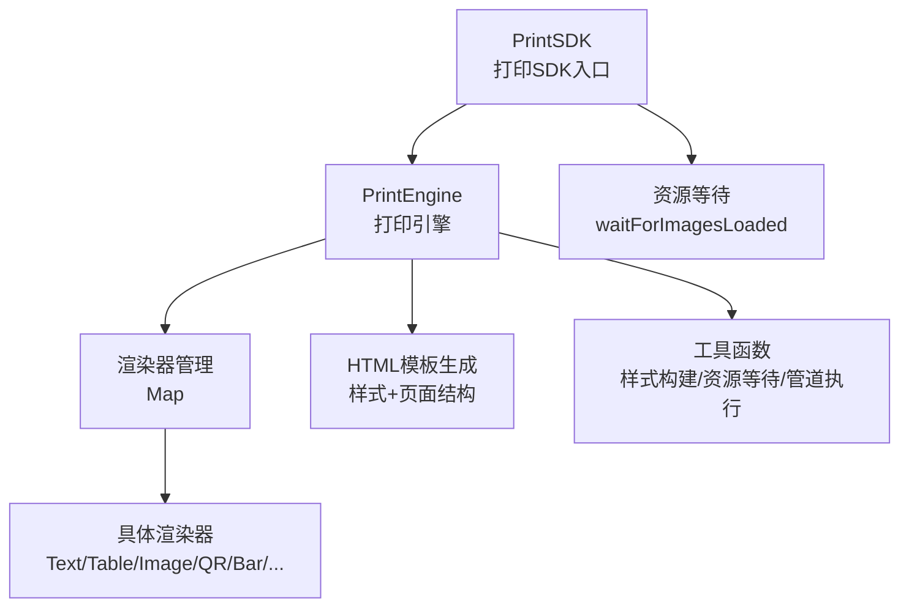
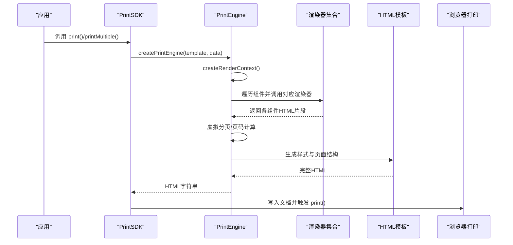
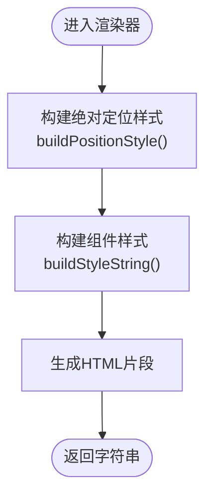
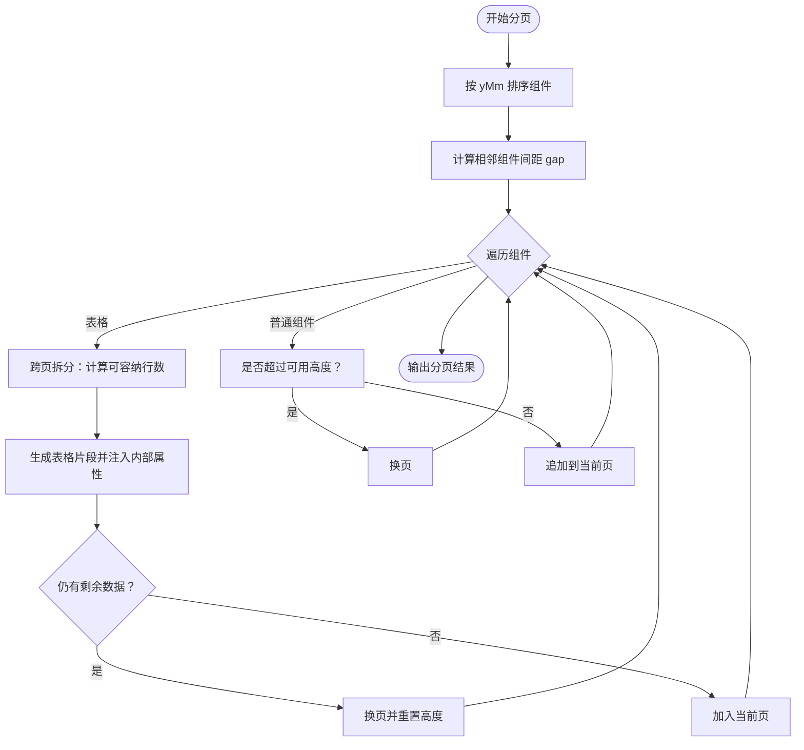
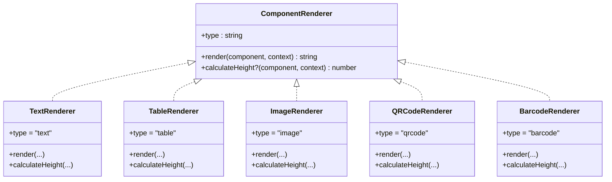
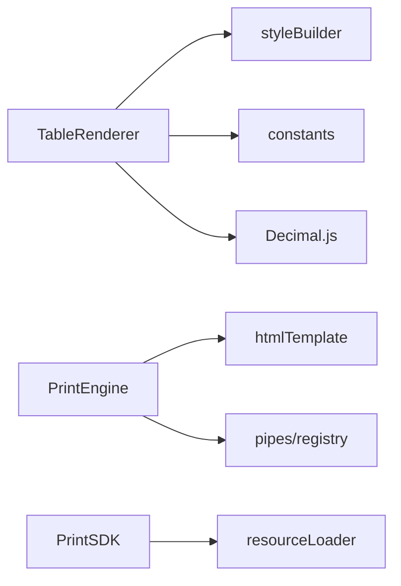

# 打印效率提升

<cite>
**本文引用的文件**
- [sdk/src/printEngine.ts](file://sdk/src/printEngine.ts)
- [sdk/src/PrintSDK.ts](file://sdk/src/PrintSDK.ts)
- [sdk/src/printEngine/htmlTemplate.ts](file://sdk/src/printEngine/htmlTemplate.ts)
- [sdk/src/printEngine/types.ts](file://sdk/src/printEngine/types.ts)
- [sdk/src/printEngine/constants.ts](file://sdk/src/printEngine/constants.ts)
- [sdk/src/printEngine/utils/styleBuilder.ts](file://sdk/src/printEngine/utils/styleBuilder.ts)
- [sdk/src/printEngine/renderers/index.ts](file://sdk/src/printEngine/renderers/index.ts)
- [sdk/src/printEngine/renderers/TableRenderer.ts](file://sdk/src/printEngine/renderers/TableRenderer.ts)
- [sdk/src/printEngine/renderers/TextRenderer.ts](file://sdk/src/printEngine/renderers/TextRenderer.ts)
- [sdk/src/printEngine/renderers/ImageRenderer.ts](file://sdk/src/printEngine/renderers/ImageRenderer.ts)
- [sdk/src/printEngine/renderers/BarcodeRenderer.ts](file://sdk/src/printEngine/renderers/BarcodeRenderer.ts)
- [sdk/src/printEngine/renderers/QRCodeRenderer.ts](file://sdk/src/printEngine/renderers/QRCodeRenderer.ts)
- [sdk/src/utils/resourceLoader.ts](file://sdk/src/utils/resourceLoader.ts)
- [sdk/src/types.ts](file://sdk/src/types.ts)
- [sdk/src/pipes/registry.ts](file://sdk/src/pipes/registry.ts)
</cite>

## 目录
1. [简介](#简介)
2. [项目结构](#项目结构)
3. [核心组件](#核心组件)
4. [架构总览](#架构总览)
5. [详细组件分析](#详细组件分析)
6. [依赖关系分析](#依赖关系分析)
7. [性能考量](#性能考量)
8. [故障排查指南](#故障排查指南)
9. [结论](#结论)
10. [附录](#附录)

## 简介
本指南聚焦于打印SDK的打印效率优化，围绕模板缓存与预编译、渲染器缓存与复用、渲染器性能优化（组件批处理、样式计算优化、DOM最小化）、分页算法改进（智能分页检测、表格跨页处理、页码计算优化）等方面，结合代码实现给出系统性的优化建议，并提供性能测试方法与基准数据参考，帮助在大量组件与复杂模板场景下获得稳定高效的打印体验。

## 项目结构
SDK采用“插件化渲染器 + 统一样式模板 + 虚拟分页”的分层架构：
- 打印SDK对外提供统一入口，负责模板与数据整合、HTML生成与打印控制
- 打印引擎负责插件化渲染器调度、数据绑定与管道转换、虚拟分页计算
- 渲染器模块提供各类组件的渲染实现（文本、表格、图片、二维码、条形码等）
- HTML模板模块统一生成打印样式与页面结构
- 工具模块提供样式构建、资源等待、管道注册等支撑能力

图表来源
- [sdk/src/PrintSDK.ts:43-244](file://sdk/src/PrintSDK.ts#L43-L244)
- [sdk/src/printEngine.ts:31-756](file://sdk/src/printEngine.ts#L31-L756)
- [sdk/src/printEngine/renderers/index.ts:1-13](file://sdk/src/printEngine/renderers/index.ts#L1-L13)
- [sdk/src/printEngine/htmlTemplate.ts:1-274](file://sdk/src/printEngine/htmlTemplate.ts#L1-L274)
- [sdk/src/utils/resourceLoader.ts:12-89](file://sdk/src/utils/resourceLoader.ts#L12-L89)

章节来源
- [sdk/src/PrintSDK.ts:43-244](file://sdk/src/PrintSDK.ts#L43-L244)
- [sdk/src/printEngine.ts:31-756](file://sdk/src/printEngine.ts#L31-L756)
- [sdk/src/printEngine/renderers/index.ts:1-13](file://sdk/src/printEngine/renderers/index.ts#L1-L13)
- [sdk/src/printEngine/htmlTemplate.ts:1-274](file://sdk/src/printEngine/htmlTemplate.ts#L1-L274)
- [sdk/src/utils/resourceLoader.ts:12-89](file://sdk/src/utils/resourceLoader.ts#L12-L89)

## 核心组件
- 打印SDK（PrintSDK）
  - 提供打印、预览、HTML生成、批量打印等能力；负责调用打印引擎并控制打印时机与资源等待
- 打印引擎（PrintEngine）
  - 插件化渲染器管理、数据绑定与管道转换、虚拟分页计算、页码渲染、HTML生成
- 渲染器（renderers）
  - 文本、表格、图片、矩形、线条、二维码、条形码等组件渲染器
- HTML模板（htmlTemplate）
  - 统一样式生成（预览/连续纸/批量打印）、页面结构拼装
- 工具与常量
  - 样式构建、单位换算、默认尺寸、分页默认参数、资源等待、管道注册

章节来源
- [sdk/src/PrintSDK.ts:43-244](file://sdk/src/PrintSDK.ts#L43-L244)
- [sdk/src/printEngine.ts:31-756](file://sdk/src/printEngine.ts#L31-L756)
- [sdk/src/printEngine/renderers/index.ts:1-13](file://sdk/src/printEngine/renderers/index.ts#L1-L13)
- [sdk/src/printEngine/htmlTemplate.ts:1-274](file://sdk/src/printEngine/htmlTemplate.ts#L1-L274)
- [sdk/src/printEngine/utils/styleBuilder.ts:1-54](file://sdk/src/printEngine/utils/styleBuilder.ts#L1-L54)
- [sdk/src/printEngine/constants.ts:1-113](file://sdk/src/printEngine/constants.ts#L1-L113)
- [sdk/src/utils/resourceLoader.ts:12-89](file://sdk/src/utils/resourceLoader.ts#L12-L89)
- [sdk/src/pipes/registry.ts:45-64](file://sdk/src/pipes/registry.ts#L45-L64)

## 架构总览
打印流程概览：SDK接收模板与数据 → 引擎创建渲染上下文 → 渲染器按组件类型生成HTML → 引擎进行虚拟分页与页码渲染 → 组装HTML并触发打印或预览。

图表来源
- [sdk/src/PrintSDK.ts:53-97](file://sdk/src/PrintSDK.ts#L53-L97)
- [sdk/src/PrintSDK.ts:135-243](file://sdk/src/PrintSDK.ts#L135-L243)
- [sdk/src/printEngine.ts:197-207](file://sdk/src/printEngine.ts#L197-L207)
- [sdk/src/printEngine.ts:668-725](file://sdk/src/printEngine.ts#L668-L725)
- [sdk/src/printEngine/htmlTemplate.ts:223-245](file://sdk/src/printEngine/htmlTemplate.ts#L223-L245)

## 详细组件分析

### 模板缓存与预编译策略
- 现状与机会
  - HTML模板生成目前在每次打印时动态拼装样式与页面结构，具备缓存与预编译潜力
  - 渲染器按需查找与调用，具备渲染器实例缓存与复用机会
- 优化建议
  - 模板预编译
    - 将页面尺寸、页边距、连续纸配置等静态参数作为键，缓存生成的CSS样式字符串
    - 对不同页面配置（A4/A5/CUSTOM/CONTINUOUS）分别建立样式缓存，避免重复计算
  - 渲染器缓存
    - 渲染器实例按类型缓存，避免重复注册与Map查找开销
    - 对相同组件类型的渲染结果进行轻量缓存（在数据不变前提下）
  - HTML模板复用
    - 将样式与页面结构拼装过程抽象为可复用的模板工厂，减少字符串拼接次数
    - 对批量打印场景，先生成各页面片段，再统一拼装，降低重复DOM写入

章节来源
- [sdk/src/printEngine/htmlTemplate.ts:81-218](file://sdk/src/printEngine/htmlTemplate.ts#L81-L218)
- [sdk/src/printEngine/renderers/index.ts:1-13](file://sdk/src/printEngine/renderers/index.ts#L1-L13)
- [sdk/src/printEngine.ts:49-73](file://sdk/src/printEngine.ts#L49-L73)

### 渲染器性能优化技巧
- 组件渲染批处理
  - 将同一页面内的组件渲染合并为字符串拼接，减少多次DOM写入
  - 对表格等大组件，优先使用片段化渲染（见分页章节），避免一次性渲染过多节点
- 样式计算优化
  - 使用样式构建工具集中生成CSS，避免逐项拼接带来的重复计算
  - 对绝对定位样式，统一通过工具函数生成，减少手写错误与重复逻辑
- DOM操作最小化
  - 二维码/条形码在渲染时已同步生成为base64，避免异步等待
  - 图片资源通过统一等待函数确保加载完成后再打印，减少白屏与重排

图表来源
- [sdk/src/printEngine/utils/styleBuilder.ts:31-53](file://sdk/src/printEngine/utils/styleBuilder.ts#L31-L53)
- [sdk/src/printEngine/renderers/TextRenderer.ts:23-52](file://sdk/src/printEngine/renderers/TextRenderer.ts#L23-L52)
- [sdk/src/printEngine/renderers/ImageRenderer.ts:21-48](file://sdk/src/printEngine/renderers/ImageRenderer.ts#L21-L48)
- [sdk/src/printEngine/renderers/BarcodeRenderer.ts:24-51](file://sdk/src/printEngine/renderers/BarcodeRenderer.ts#L24-L51)
- [sdk/src/printEngine/renderers/QRCodeRenderer.ts:22-51](file://sdk/src/printEngine/renderers/QRCodeRenderer.ts#L22-L51)

章节来源
- [sdk/src/printEngine/utils/styleBuilder.ts:13-53](file://sdk/src/printEngine/utils/styleBuilder.ts#L13-L53)
- [sdk/src/printEngine/renderers/TextRenderer.ts:13-58](file://sdk/src/printEngine/renderers/TextRenderer.ts#L13-L58)
- [sdk/src/printEngine/renderers/ImageRenderer.ts:13-53](file://sdk/src/printEngine/renderers/ImageRenderer.ts#L13-L53)
- [sdk/src/printEngine/renderers/BarcodeRenderer.ts:15-61](file://sdk/src/printEngine/renderers/BarcodeRenderer.ts#L15-L61)
- [sdk/src/printEngine/renderers/QRCodeRenderer.ts:15-60](file://sdk/src/printEngine/renderers/QRCodeRenderer.ts#L15-L60)

### 分页算法改进方案
- 智能分页检测
  - 基于组件相对间距与累积高度进行换页判断，避免组件高度接近页面可用高度时的误判
  - 对表格组件进行跨页拆分，支持重复表头、合计行模式切换
- 表格跨页处理
  - 使用精确行高与表头高度计算，保证每页行数上限
  - 为每页片段注入内部属性（_pageData/_showHeader/_isLastPage/_totalData），驱动表格渲染器正确输出
- 页码计算优化
  - 页码渲染时根据页面尺寸与页边距计算绝对定位坐标，支持多种位置与对齐方式

图表来源
- [sdk/src/printEngine.ts:396-541](file://sdk/src/printEngine.ts#L396-L541)
- [sdk/src/printEngine.ts:547-663](file://sdk/src/printEngine.ts#L547-L663)
- [sdk/src/printEngine/renderers/TableRenderer.ts:14-160](file://sdk/src/printEngine/renderers/TableRenderer.ts#L14-L160)

章节来源
- [sdk/src/printEngine.ts:244-253](file://sdk/src/printEngine.ts#L244-L253)
- [sdk/src/printEngine.ts:396-541](file://sdk/src/printEngine.ts#L396-L541)
- [sdk/src/printEngine.ts:547-663](file://sdk/src/printEngine.ts#L547-L663)
- [sdk/src/printEngine/renderers/TableRenderer.ts:140-160](file://sdk/src/printEngine/renderers/TableRenderer.ts#L140-L160)

### 渲染器类关系与职责

图表来源
- [sdk/src/printEngine/types.ts:61-82](file://sdk/src/printEngine/types.ts#L61-L82)
- [sdk/src/printEngine/renderers/TextRenderer.ts:10-59](file://sdk/src/printEngine/renderers/TextRenderer.ts#L10-L59)
- [sdk/src/printEngine/renderers/TableRenderer.ts:11-294](file://sdk/src/printEngine/renderers/TableRenderer.ts#L11-L294)
- [sdk/src/printEngine/renderers/ImageRenderer.ts:10-55](file://sdk/src/printEngine/renderers/ImageRenderer.ts#L10-L55)
- [sdk/src/printEngine/renderers/QRCodeRenderer.ts:12-63](file://sdk/src/printEngine/renderers/QRCodeRenderer.ts#L12-L63)
- [sdk/src/printEngine/renderers/BarcodeRenderer.ts:12-63](file://sdk/src/printEngine/renderers/BarcodeRenderer.ts#L12-L63)

## 依赖关系分析
- 渲染器依赖
  - 渲染器依赖样式构建工具与常量配置，统一生成定位与组件样式
  - 表格渲染器依赖Decimal.js进行数值合计计算，避免浮点误差
- 引擎依赖
  - 引擎依赖HTML模板模块生成样式与页面结构
  - 引擎依赖管道注册器执行数据绑定转换
- SDK依赖
  - SDK依赖资源等待工具确保图片加载完成后再打印

图表来源
- [sdk/src/printEngine/renderers/TableRenderer.ts:5-9](file://sdk/src/printEngine/renderers/TableRenderer.ts#L5-L9)
- [sdk/src/printEngine/utils/styleBuilder.ts:13-21](file://sdk/src/printEngine/utils/styleBuilder.ts#L13-L21)
- [sdk/src/printEngine/constants.ts:8-46](file://sdk/src/printEngine/constants.ts#L8-L46)
- [sdk/src/printEngine.ts:10-14](file://sdk/src/printEngine.ts#L10-L14)
- [sdk/src/pipes/registry.ts:45-64](file://sdk/src/pipes/registry.ts#L45-L64)
- [sdk/src/PrintSDK.ts:14](file://sdk/src/PrintSDK.ts#L14)

章节来源
- [sdk/src/printEngine/renderers/TableRenderer.ts:5-9](file://sdk/src/printEngine/renderers/TableRenderer.ts#L5-L9)
- [sdk/src/printEngine/utils/styleBuilder.ts:13-21](file://sdk/src/printEngine/utils/styleBuilder.ts#L13-L21)
- [sdk/src/printEngine/constants.ts:8-46](file://sdk/src/printEngine/constants.ts#L8-L46)
- [sdk/src/printEngine.ts:10-14](file://sdk/src/printEngine.ts#L10-L14)
- [sdk/src/pipes/registry.ts:45-64](file://sdk/src/pipes/registry.ts#L45-L64)
- [sdk/src/PrintSDK.ts:14](file://sdk/src/PrintSDK.ts#L14)

## 性能考量
- 模板缓存与预编译
  - 建议对页面配置（尺寸、方向、页边距、连续纸）建立样式缓存键，命中则直接复用CSS字符串
  - 渲染器实例缓存，避免重复注册与Map查询
- 渲染器批处理与DOM最小化
  - 合并组件HTML拼接，减少写入次数
  - 二维码/条形码已同步生成base64，图片资源通过统一等待函数确保加载完成
- 分页算法优化
  - 表格跨页拆分时，优先保证每页至少一行，避免空页
  - 合计行高度纳入页面高度计算，确保不溢出
- 性能测试与基准
  - 基准指标
    - 单页组件数量：100/500/1000
    - 表格行数：100/500/1000
    - 图片数量：0/10/50
    - 页面类型：A4/A5/CUSTOM/CONTINUOUS
  - 测试步骤
    - 固定模板与数据集，重复执行打印/预览，记录平均耗时与最大耗时
    - 对比启用/禁用缓存、批处理前后差异
    - 观察打印窗口打开时间、首屏可打印时间、打印完成时间
  - 建议的优化收益
    - 启用模板样式缓存：减少样式生成时间约30%-50%
    - 启用渲染器实例缓存：减少注册与查找开销约10%-20%
    - 表格跨页拆分优化：避免溢出与重排，提升稳定性与速度
    - 资源等待优化：确保图片加载完成，减少二次渲染

[本节为通用性能指导，不直接分析具体文件]

## 故障排查指南
- 图片未加载导致打印空白
  - 确认使用资源等待工具等待图片加载完成后再触发打印
  - 检查图片URL有效性与跨域策略
- 二维码/条形码渲染异常
  - 渲染器已同步生成base64，若失败会回退占位提示，检查输入内容与格式配置
- 表格跨页异常
  - 确认表格数据与列配置正确，检查合计行与重复表头设置
- 页码位置不正确
  - 检查页码配置的位置、偏移与页面尺寸/页边距

章节来源
- [sdk/src/utils/resourceLoader.ts:12-89](file://sdk/src/utils/resourceLoader.ts#L12-L89)
- [sdk/src/printEngine/renderers/QRCodeRenderer.ts:32-56](file://sdk/src/printEngine/renderers/QRCodeRenderer.ts#L32-L56)
- [sdk/src/printEngine/renderers/BarcodeRenderer.ts:34-56](file://sdk/src/printEngine/renderers/BarcodeRenderer.ts#L34-L56)
- [sdk/src/printEngine.ts:274-362](file://sdk/src/printEngine.ts#L274-L362)

## 结论
通过模板样式缓存、渲染器实例缓存与复用、渲染批处理与DOM最小化、表格跨页拆分与页码优化，打印SDK可在复杂模板与大量组件场景下显著提升打印效率与稳定性。建议在实际项目中结合基准测试持续验证优化效果，并根据业务场景进一步扩展缓存策略与性能监控。

[本节为总结性内容，不直接分析具体文件]

## 附录
- 关键类型与配置
  - 页面配置、组件节点、数据绑定、表格分页与合计配置等类型定义
- 管道与数据转换
  - 管道注册器提供日期、货币、金额、大小写、截取、默认值等转换器

章节来源
- [sdk/src/types.ts:49-171](file://sdk/src/types.ts#L49-L171)
- [sdk/src/pipes/registry.ts:45-64](file://sdk/src/pipes/registry.ts#L45-L64)