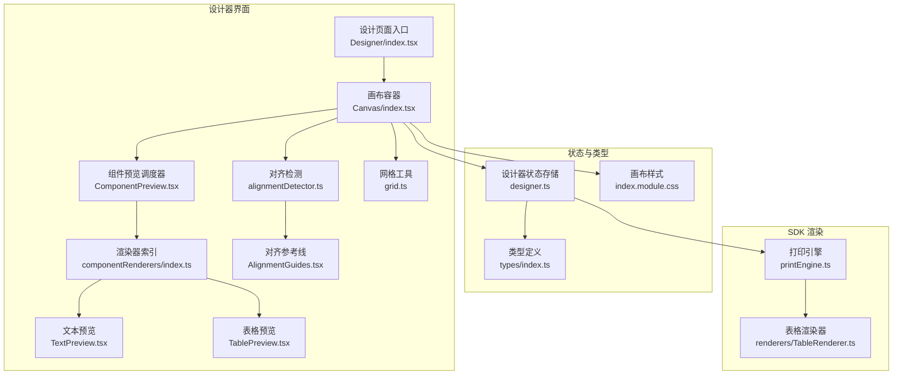
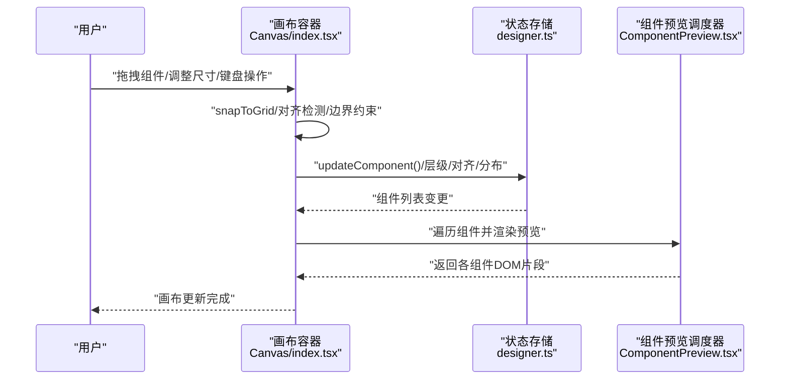
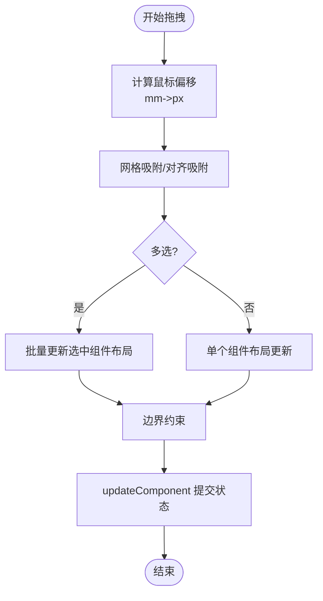
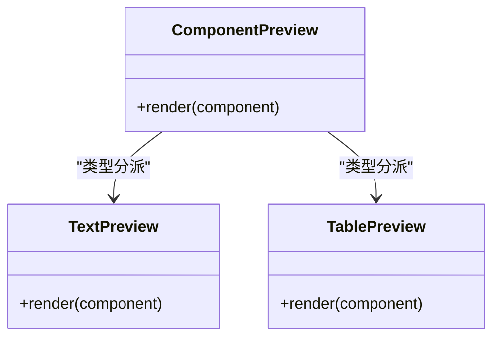
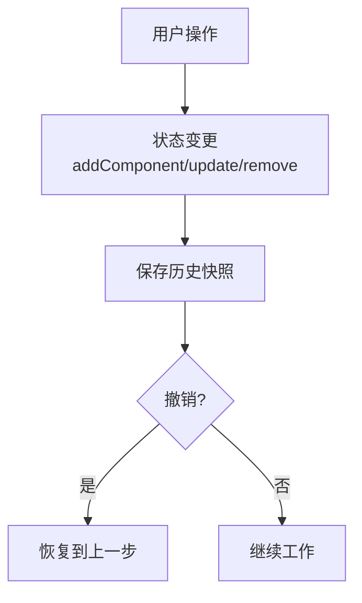
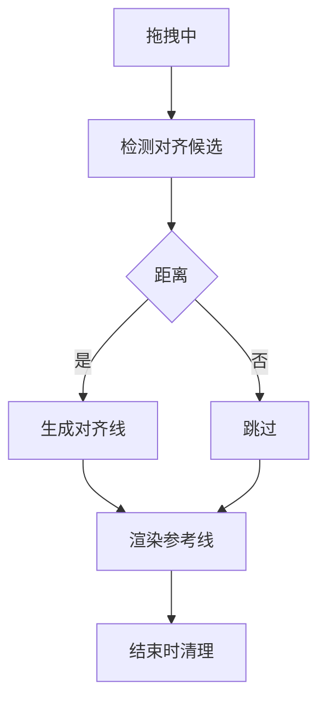
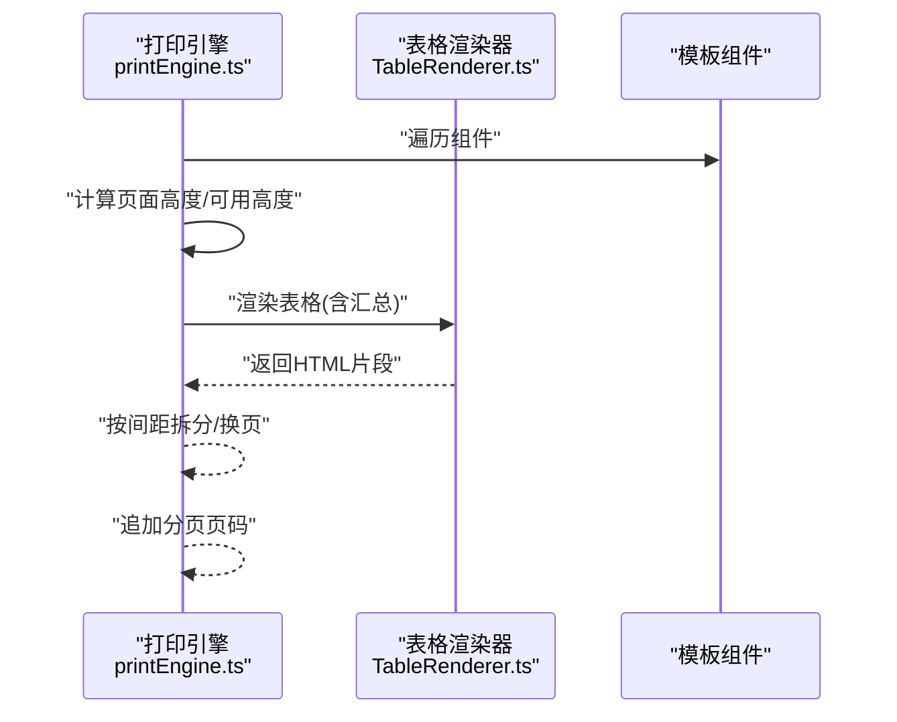
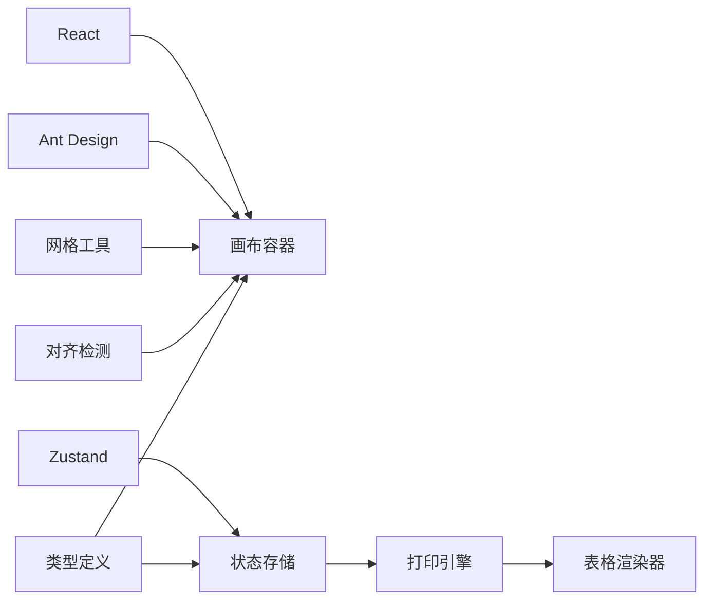

# 渲染性能优化

<cite>
**本文引用的文件**
- [设计页面入口](file://designer/src/pages/Designer/index.tsx)
- [画布容器](file://designer/src/pages/Designer/components/Canvas/index.tsx)
- [组件预览渲染器索引](file://designer/src/pages/Designer/components/Canvas/componentRenderers/index.ts)
- [文本预览渲染器](file://designer/src/pages/Designer/components/Canvas/componentRenderers/TextPreview.tsx)
- [表格预览渲染器](file://designer/src/pages/Designer/components/Canvas/componentRenderers/TablePreview.tsx)
- [组件预览调度器](file://designer/src/pages/Designer/components/Canvas/ComponentPreview.tsx)
- [智能对齐检测](file://designer/src/pages/Designer/components/Canvas/alignmentDetector.ts)
- [智能对齐参考线](file://designer/src/pages/Designer/components/Canvas/AlignmentGuides.tsx)
- [网格工具](file://designer/src/utils/grid.ts)
- [设计器状态存储](file://designer/src/store/designer.ts)
- [类型定义](file://designer/src/types/index.ts)
- [画布样式](file://designer/src/pages/Designer/components/Canvas/index.module.css)
- [SDK 打印引擎](file://sdk/src/printEngine.ts)
- [SDK 表格渲染器](file://sdk/src/printEngine/renderers/TableRenderer.ts)
- [设计页面依赖清单](file://designer/package.json)
</cite>

## 目录
1. [简介](#简介)
2. [项目结构](#项目结构)
3. [核心组件](#核心组件)
4. [架构总览](#架构总览)
5. [详细组件分析](#详细组件分析)
6. [依赖分析](#依赖分析)
7. [性能考量](#性能考量)
8. [故障排查指南](#故障排查指南)
9. [结论](#结论)
10. [附录](#附录)

## 简介
本指南聚焦于打印设计器在 React 组件重渲染与 Canvas 绘制层面的性能优化路径，结合仓库现有实现，给出可落地的分析方法、优化策略与最佳实践。重点覆盖：
- React 组件重渲染分析与瓶颈定位（DevTools Profiler 使用要点）
- Canvas 绘制性能优化（组件批量更新、虚拟滚动、上下文优化）
- 大数据量处理（组件懒加载、分页渲染、增量更新）
- 性能监控指标与基准测试方法
- 针对拖拽、缩放、对齐等高频操作的专项优化

## 项目结构
围绕“设计器-画布-组件渲染”主线，前端采用 Vite + React + Zustand 架构，组件预览通过统一调度器按类型渲染，画布负责交互与布局，状态集中管理。

**图表来源**
- [设计页面入口:1-279](file://designer/src/pages/Designer/index.tsx#L1-L279)
- [画布容器:1-1006](file://designer/src/pages/Designer/components/Canvas/index.tsx#L1-L1006)
- [组件预览调度器:1-53](file://designer/src/pages/Designer/components/Canvas/ComponentPreview.tsx#L1-L53)
- [组件预览渲染器索引:1-11](file://designer/src/pages/Designer/components/Canvas/componentRenderers/index.ts#L1-L11)
- [文本预览渲染器:1-31](file://designer/src/pages/Designer/components/Canvas/componentRenderers/TextPreview.tsx#L1-L31)
- [表格预览渲染器:1-56](file://designer/src/pages/Designer/components/Canvas/componentRenderers/TablePreview.tsx#L1-L56)
- [智能对齐检测:1-158](file://designer/src/pages/Designer/components/Canvas/alignmentDetector.ts#L1-L158)
- [智能对齐参考线:1-66](file://designer/src/pages/Designer/components/Canvas/AlignmentGuides.tsx#L1-L66)
- [网格工具:1-36](file://designer/src/utils/grid.ts#L1-L36)
- [设计器状态存储:1-539](file://designer/src/store/designer.ts#L1-L539)
- [类型定义:1-160](file://designer/src/types/index.ts#L1-L160)
- [画布样式:1-143](file://designer/src/pages/Designer/components/Canvas/index.module.css#L1-L143)
- [SDK 打印引擎:380-574](file://sdk/src/printEngine.ts#L380-L574)
- [SDK 表格渲染器:233-269](file://sdk/src/printEngine/renderers/TableRenderer.ts#L233-L269)

**章节来源**
- [设计页面入口:1-279](file://designer/src/pages/Designer/index.tsx#L1-L279)
- [画布容器:1-1006](file://designer/src/pages/Designer/components/Canvas/index.tsx#L1-L1006)
- [设计器状态存储:1-539](file://designer/src/store/designer.ts#L1-L539)

## 核心组件
- 设计器页面：承载左右面板与画布区域，负责模板加载与调试面板展示。
- 画布容器：集中处理拖拽、对齐、网格、键盘快捷键、页面设置、组件增删改等交互，并驱动组件预览渲染。
- 组件预览调度器：依据组件类型分发到对应渲染器（文本、表格等），避免在画布层做复杂分支判断。
- 状态存储：集中维护组件列表、选中态、页面配置、历史记录、层级与对齐/分布等操作。
- 网格与对齐：提供网格吸附与智能对齐检测，减少布局抖动与重排成本。
- SDK 渲染：打印引擎负责模板分页与组件渲染，支持跨页表格拆分与页码渲染。

**章节来源**
- [设计页面入口:17-276](file://designer/src/pages/Designer/index.tsx#L17-L276)
- [画布容器:20-1006](file://designer/src/pages/Designer/components/Canvas/index.tsx#L20-L1006)
- [组件预览调度器:20-50](file://designer/src/pages/Designer/components/Canvas/ComponentPreview.tsx#L20-L50)
- [设计器状态存储:85-539](file://designer/src/store/designer.ts#L85-L539)
- [网格工具:12-15](file://designer/src/utils/grid.ts#L12-L15)
- [智能对齐检测:24-157](file://designer/src/pages/Designer/components/Canvas/alignmentDetector.ts#L24-L157)
- [SDK 打印引擎:380-574](file://sdk/src/printEngine.ts#L380-L574)

## 架构总览
以下序列图展示从用户拖拽组件到画布更新与状态持久化的关键流程，便于定位重渲染热点与优化点。

**图表来源**
- [画布容器:434-562](file://designer/src/pages/Designer/components/Canvas/index.tsx#L434-L562)
- [设计器状态存储:93-100](file://designer/src/store/designer.ts#L93-L100)
- [组件预览调度器:20-50](file://designer/src/pages/Designer/components/Canvas/ComponentPreview.tsx#L20-L50)

## 详细组件分析

### 画布容器与交互链路
- 拖拽与多选：通过鼠标事件与全局监听实现，支持网格吸附与智能对齐，多选拖拽时批量更新组件布局。
- 键盘快捷键：统一处理删除、复制、粘贴、撤销/重做、克隆等高频操作，避免重复渲染。
- 页面设置：动态计算画布尺寸（含连续纸模式），并支持页边距与页码配置。
- 对齐参考线：在拖拽过程中实时计算并绘制对齐线，结束后清理，降低视觉干扰。

**图表来源**
- [画布容器:434-562](file://designer/src/pages/Designer/components/Canvas/index.tsx#L434-L562)
- [网格工具:12-15](file://designer/src/utils/grid.ts#L12-L15)
- [智能对齐检测:24-157](file://designer/src/pages/Designer/components/Canvas/alignmentDetector.ts#L24-L157)

**章节来源**
- [画布容器:401-562](file://designer/src/pages/Designer/components/Canvas/index.tsx#L401-L562)
- [智能对齐检测:24-157](file://designer/src/pages/Designer/components/Canvas/alignmentDetector.ts#L24-L157)
- [网格工具:12-15](file://designer/src/utils/grid.ts#L12-L15)

### 组件预览渲染器
- 统一入口：ComponentPreview 根据组件类型分派到具体渲染器，减少画布层条件分支。
- 文本预览：基于 flex 布局与文本溢出控制，避免多余 DOM 结构。
- 表格预览：按可见列渲染，支持表头开关与边框控制，预览态显示“暂无数据”。

**图表来源**
- [组件预览调度器:20-50](file://designer/src/pages/Designer/components/Canvas/ComponentPreview.tsx#L20-L50)
- [组件预览渲染器索引:1-11](file://designer/src/pages/Designer/components/Canvas/componentRenderers/index.ts#L1-L11)
- [文本预览渲染器:10-30](file://designer/src/pages/Designer/components/Canvas/componentRenderers/TextPreview.tsx#L10-L30)
- [表格预览渲染器:10-55](file://designer/src/pages/Designer/components/Canvas/componentRenderers/TablePreview.tsx#L10-L55)

**章节来源**
- [组件预览调度器:20-50](file://designer/src/pages/Designer/components/Canvas/ComponentPreview.tsx#L20-L50)
- [文本预览渲染器:10-30](file://designer/src/pages/Designer/components/Canvas/componentRenderers/TextPreview.tsx#L10-L30)
- [表格预览渲染器:10-55](file://designer/src/pages/Designer/components/Canvas/componentRenderers/TablePreview.tsx#L10-L55)

### 状态存储与历史回放
- 组件增删改：通过 updateComponent 触发全量替换，配合历史快照实现撤销/重做。
- 历史步数上限：最多保存固定步数，避免内存膨胀。
- 层级与对齐：直接在组件数组上进行位置交换与排序，提交时统一保存历史。

**图表来源**
- [设计器状态存储:87-106](file://designer/src/store/designer.ts#L87-L106)
- [设计器状态存储:74-83](file://designer/src/store/designer.ts#L74-L83)
- [设计器状态存储:300-331](file://designer/src/store/designer.ts#L300-L331)

**章节来源**
- [设计器状态存储:85-539](file://designer/src/store/designer.ts#L85-L539)

### 对齐与网格工具
- 对齐检测：以像素为单位比较关键点距离，超过阈值则忽略，减少无效绘制。
- 网格吸附：按配置开启/关闭，支持按住 Shift 临时禁用吸附。
- 参考线渲染：仅在拖拽期间显示，结束后清除，避免常驻 DOM。

**图表来源**
- [智能对齐检测:24-157](file://designer/src/pages/Designer/components/Canvas/alignmentDetector.ts#L24-L157)
- [智能对齐参考线:21-63](file://designer/src/pages/Designer/components/Canvas/AlignmentGuides.tsx#L21-L63)
- [网格工具:12-15](file://designer/src/utils/grid.ts#L12-L15)

**章节来源**
- [智能对齐检测:24-157](file://designer/src/pages/Designer/components/Canvas/alignmentDetector.ts#L24-L157)
- [智能对齐参考线:21-63](file://designer/src/pages/Designer/components/Canvas/AlignmentGuides.tsx#L21-L63)
- [网格工具:12-15](file://designer/src/utils/grid.ts#L12-L15)

### SDK 渲染与分页
- 组件渲染：遍历组件节点，调用各自渲染器输出 HTML 片段。
- 虚拟分页：基于相对间距的流式布局，遇表格则拆分并支持重复表头。
- 表格聚合：提供多种汇总类型与格式化选项，异常时降级显示占位符。

**图表来源**
- [SDK 打印引擎:380-574](file://sdk/src/printEngine.ts#L380-L574)
- [SDK 表格渲染器:233-269](file://sdk/src/printEngine/renderers/TableRenderer.ts#L233-L269)

**章节来源**
- [SDK 打印引擎:380-574](file://sdk/src/printEngine.ts#L380-L574)
- [SDK 表格渲染器:233-269](file://sdk/src/printEngine/renderers/TableRenderer.ts#L233-L269)

## 依赖分析
- 前端依赖：React、Ant Design、Zustand、jsbarcode、qrcode 等，其中 jsbarcode 用于条形码生成。
- 关键耦合点：画布容器依赖状态存储与网格/对齐工具；组件预览依赖类型定义；SDK 渲染依赖模板与渲染器集合。

**图表来源**
- [设计页面依赖清单:12-28](file://designer/package.json#L12-L28)
- [画布容器:1-1006](file://designer/src/pages/Designer/components/Canvas/index.tsx#L1-L1006)
- [设计器状态存储:1-539](file://designer/src/store/designer.ts#L1-L539)
- [类型定义:1-160](file://designer/src/types/index.ts#L1-L160)
- [SDK 打印引擎:380-574](file://sdk/src/printEngine.ts#L380-L574)

**章节来源**
- [设计页面依赖清单:12-28](file://designer/package.json#L12-L28)
- [画布容器:1-1006](file://designer/src/pages/Designer/components/Canvas/index.tsx#L1-L1006)
- [设计器状态存储:1-539](file://designer/src/store/designer.ts#L1-L539)

## 性能考量

### React 组件重渲染分析与优化
- 使用 React DevTools Profiler
  - 打开开发者工具 → Profiler → 录制一次拖拽/对齐/撤销等高频操作 → 分析“渲染次数”“渲染耗时”“重渲染原因”。
  - 关注点：画布容器是否整体会重渲染；组件预览是否因父组件更新而重复渲染；对齐参考线是否频繁创建。
- 重渲染热点定位
  - 画布容器在拖拽时会多次触发 updateComponent，建议：
    - 将“拖拽中”的状态与“最终落点”分离，避免中间态频繁触发渲染。
    - 对多选拖拽使用批量更新策略，减少多次 setState 引起的重渲染。
  - 组件预览渲染器：确保每个渲染器接收稳定 props，必要时使用 memo 化包装。
- 优化建议
  - 将“对齐参考线”渲染与“组件布局更新”解耦：仅在拖拽阶段渲染参考线，结束后立即清理。
  - 将“键盘快捷键监听”限定在画布容器内，避免全局事件影响其他面板。
  - 将“页面设置/尺寸计算”缓存，仅在 pageConfig 变更时重新计算。

**章节来源**
- [画布容器:112-161](file://designer/src/pages/Designer/components/Canvas/index.tsx#L112-L161)
- [画布容器:434-562](file://designer/src/pages/Designer/components/Canvas/index.tsx#L434-L562)
- [组件预览调度器:20-50](file://designer/src/pages/Designer/components/Canvas/ComponentPreview.tsx#L20-L50)

### Canvas 绘制性能优化
- 组件批量更新
  - 多选拖拽时一次性计算偏移，再批量调用 updateComponent，减少多次渲染。
  - 对齐吸附与网格吸附优先级：对齐吸附优先，避免二次吸附导致的抖动。
- 虚拟滚动（建议）
  - 当组件数量较多时，考虑将画布内容放入虚拟滚动容器，仅渲染可视区域组件。
  - 与网格吸附配合时，注意虚拟化视口变化对吸附精度的影响。
- Canvas 上下文优化（建议）
  - 若未来引入 Canvas 渲染路径，建议：
    - 复用离屏 Canvas，减少上下文切换。
    - 合理使用 transform 与 clip，避免过度重绘。
    - 对静态背景（如网格）进行离屏缓存。

**章节来源**
- [画布容器:500-543](file://designer/src/pages/Designer/components/Canvas/index.tsx#L500-L543)
- [网格工具:12-15](file://designer/src/utils/grid.ts#L12-L15)
- [智能对齐检测:24-157](file://designer/src/pages/Designer/components/Canvas/alignmentDetector.ts#L24-L157)

### 大数据量处理最佳实践
- 组件懒加载
  - 对表格等大组件采用懒渲染：首次仅渲染可见区域，滚动时再加载后续内容。
- 分页渲染
  - 借鉴 SDK 的“虚拟分页”思路：按可用高度累加，遇表格拆分并支持重复表头。
- 增量更新
  - 拖拽/缩放时仅更新受影响组件，避免全量重渲染。
  - 使用历史快照进行撤销/重做，避免每次操作都深拷贝全量组件列表。

**章节来源**
- [SDK 打印引擎:396-541](file://sdk/src/printEngine.ts#L396-L541)
- [设计器状态存储:74-83](file://designer/src/store/designer.ts#L74-L83)

### 性能监控指标与基准测试
- 指标建议
  - 首屏组件渲染时间（ms）
  - 拖拽一次（移动+落点）的平均耗时（ms）
  - 对齐吸附触发频率与命中率
  - 撤销/重做一次操作的耗时（ms）
  - 组件数量与内存占用（MB）
- 基准测试方法
  - 使用浏览器性能面板录制典型场景（如 100 个组件的拖拽、对齐、撤销/重做）。
  - 固定数据集，重复执行同一套动作，统计 P50/P95 耗时。
  - 对比不同优化策略（如批量更新、对齐参考线延迟渲染）的效果。

**章节来源**
- [设计页面入口:24-52](file://designer/src/pages/Designer/index.tsx#L24-L52)

### 针对高频操作的专项优化
- 拖拽
  - 中间态使用“半透明预览”与“局部更新”，落点后再提交最终布局。
  - 多选拖拽时，先计算整体偏移，再批量更新，避免逐个组件更新带来的抖动。
- 缩放/对齐
  - 对齐阈值与吸附阈值合理设置，避免微小抖动引发频繁重绘。
  - 对齐参考线仅在拖拽阶段渲染，结束后立即清理。
- 层级管理
  - 层级变更采用数组交换而非全量替换，减少不必要的重渲染。

**章节来源**
- [画布容器:465-543](file://designer/src/pages/Designer/components/Canvas/index.tsx#L465-L543)
- [设计器状态存储:237-295](file://designer/src/store/designer.ts#L237-L295)

## 故障排查指南
- 拖拽卡顿
  - 检查是否存在过多全局监听或未及时移除的事件回调。
  - 确认对齐吸附与网格吸附的计算是否在拖拽循环中重复执行。
- 对齐参考线闪烁
  - 确保在拖拽结束时清理对齐线，避免残留 DOM。
  - 检查对齐阈值设置是否过小，导致频繁触发。
- 撤销/重做慢
  - 检查历史快照是否过大，必要时减少历史步数或压缩快照。
  - 避免在撤销/重做过程中触发额外的昂贵计算。

**章节来源**
- [画布容器:546-562](file://designer/src/pages/Designer/components/Canvas/index.tsx#L546-L562)
- [智能对齐参考线:21-63](file://designer/src/pages/Designer/components/Canvas/AlignmentGuides.tsx#L21-L63)
- [设计器状态存储:74-83](file://designer/src/store/designer.ts#L74-L83)

## 结论
通过将“交互逻辑集中在画布容器、渲染逻辑集中在预览调度器、状态集中在 Zustand”的架构设计，项目已具备良好的可优化基础。结合批量更新、对齐参考线延迟渲染、历史快照优化与 SDK 分页策略，可在保证交互体验的同时显著提升渲染性能。建议持续以 Profiler 与性能面板为依据，围绕高频操作进行迭代优化。

## 附录
- 术语
  - mm→px：画布坐标系换算（默认 1mm ≈ 3.78px）
  - 相对间距：组件间基于 yMm 的间距，用于虚拟分页与表格拆分
- 参考实现位置
  - 画布尺寸计算与连续纸模式：[画布容器:733-770](file://designer/src/pages/Designer/components/Canvas/index.tsx#L733-L770)
  - 对齐检测与吸附：[智能对齐检测:24-157](file://designer/src/pages/Designer/components/Canvas/alignmentDetector.ts#L24-L157)
  - 网格吸附：[网格工具:12-15](file://designer/src/utils/grid.ts#L12-L15)
  - 历史快照与撤销/重做：[设计器状态存储:74-83](file://designer/src/store/designer.ts#L74-L83)