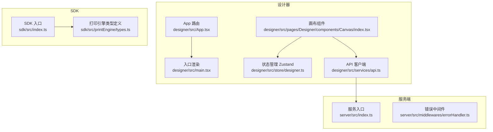
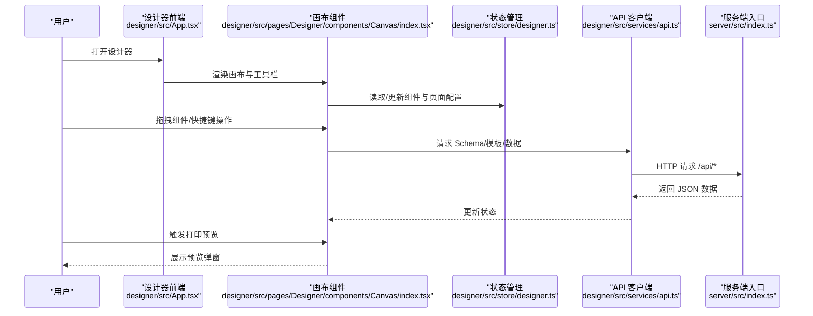
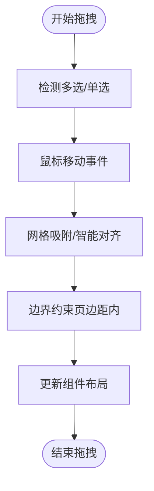
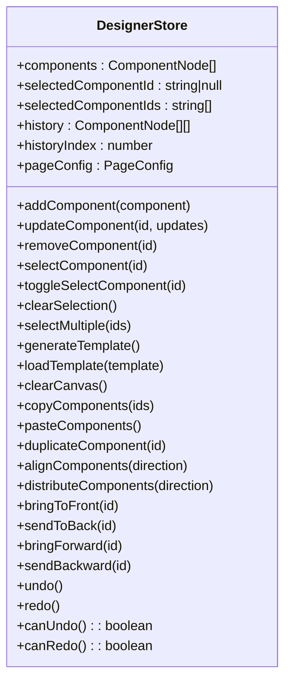
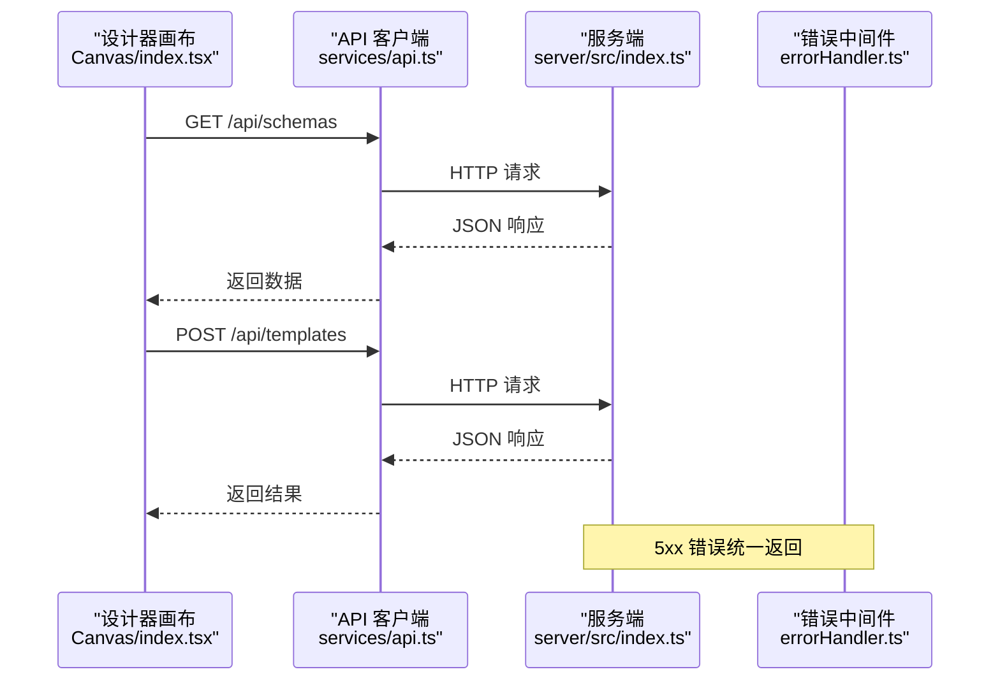
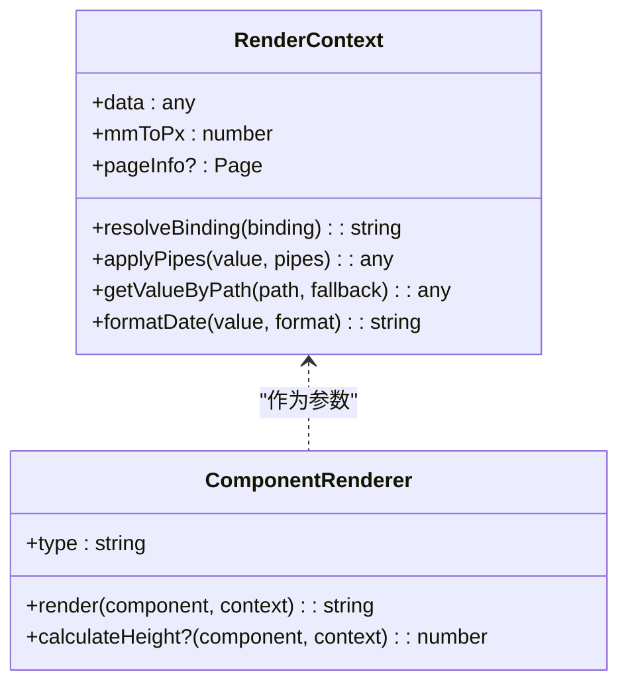
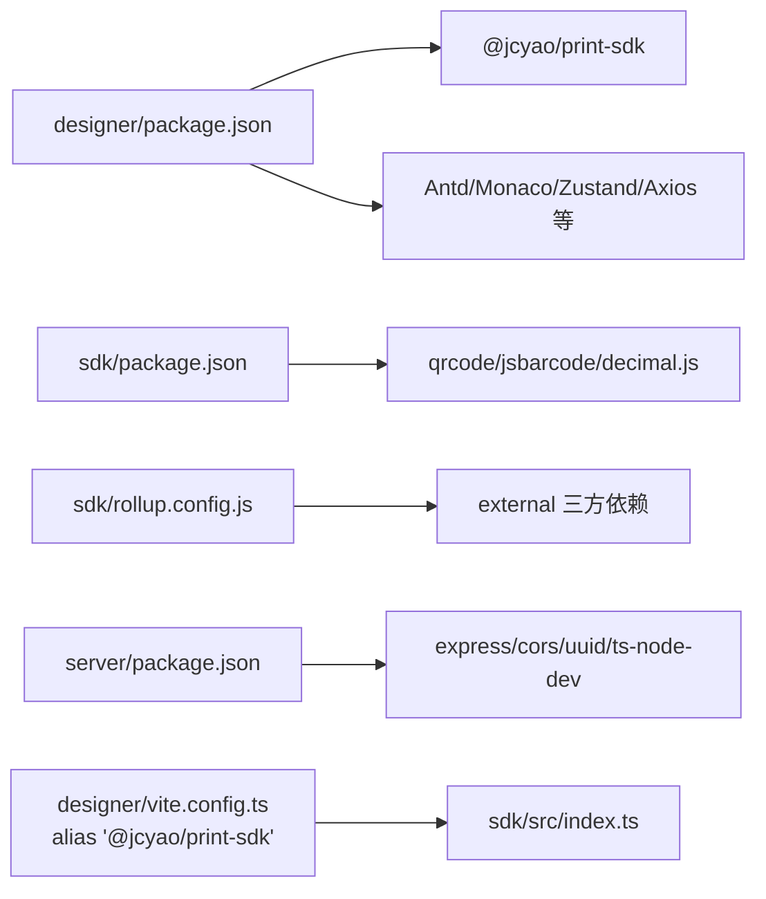

# 故障排除

<cite>
**本文引用的文件**
- [README.md](file://README.md)
- [DEV_README.md](file://DEV_README.md)
- [designer/package.json](file://designer/package.json)
- [sdk/package.json](file://sdk/package.json)
- [server/package.json](file://server/package.json)
- [designer/vite.config.ts](file://designer/vite.config.ts)
- [sdk/rollup.config.js](file://sdk/rollup.config.js)
- [designer/src/main.tsx](file://designer/src/main.tsx)
- [designer/src/App.tsx](file://designer/src/App.tsx)
- [server/src/index.ts](file://server/src/index.ts)
- [server/src/middlewares/errorHandler.ts](file://server/src/middlewares/errorHandler.ts)
- [designer/src/services/api.ts](file://designer/src/services/api.ts)
- [designer/src/store/designer.ts](file://designer/src/store/designer.ts)
- [designer/src/pages/Designer/components/Canvas/index.tsx](file://designer/src/pages/Designer/components/Canvas/index.tsx)
- [sdk/src/printEngine/types.ts](file://sdk/src/printEngine/types.ts)
</cite>

## 目录
1. [简介](#简介)
2. [项目结构](#项目结构)
3. [核心组件](#核心组件)
4. [架构总览](#架构总览)
5. [详细组件分析](#详细组件分析)
6. [依赖关系分析](#依赖关系分析)
7. [性能考量](#性能考量)
8. [故障排除指南](#故障排除指南)
9. [结论](#结论)
10. [附录](#附录)

## 简介
本指南面向打印平台的开发者与运维人员，聚焦于开发环境问题、构建失败、运行时错误的诊断与修复；提供运行时错误排查技巧（日志分析、错误定位、问题修复策略）；给出性能问题诊断方法（内存泄漏检测、渲染性能优化、打印效率提升）；介绍调试工具（浏览器开发者工具、日志分析工具、性能监控工具）的使用；并整理常见问题FAQ，帮助快速定位与解决问题。

## 项目结构
打印平台采用多模块分层架构：
- SDK（独立打印能力封装，支持浏览器端直接打印与批量预览）
- 设计器（React + TypeScript，可视化模板设计器，提供组件拖拽、属性配置、打印预览）
- 服务端（Node.js + Express，提供 Schema、Mock 数据、模板的 REST API）

**图示来源**
- [designer/src/App.tsx:1-31](file://designer/src/App.tsx#L1-L31)
- [designer/src/main.tsx:1-8](file://designer/src/main.tsx#L1-L8)
- [designer/src/pages/Designer/components/Canvas/index.tsx:1-800](file://designer/src/pages/Designer/components/Canvas/index.tsx#L1-L800)
- [designer/src/store/designer.ts:1-539](file://designer/src/store/designer.ts#L1-L539)
- [designer/src/services/api.ts:1-97](file://designer/src/services/api.ts#L1-L97)
- [sdk/src/index.ts:1-22](file://sdk/src/index.ts#L1-L22)
- [sdk/src/printEngine/types.ts:1-116](file://sdk/src/printEngine/types.ts#L1-L116)
- [server/src/index.ts:1-25](file://server/src/index.ts#L1-L25)
- [server/src/middlewares/errorHandler.ts:1-10](file://server/src/middlewares/errorHandler.ts#L1-L10)

**章节来源**
- [README.md: 191-234:191-234](file://README.md#L191-L234)
- [DEV_README.md: 27-52:27-52](file://DEV_README.md#L27-L52)

## 核心组件
- 设计器路由与入口：负责页面路由与根节点挂载。
- 画布组件：负责组件拖拽、对齐、网格吸附、快捷键、打印预览弹窗等交互。
- 状态管理（Zustand）：集中管理组件列表、选中状态、撤销/重做、页面配置、复制/粘贴等。
- API 客户端：Axios 封装，访问服务端 Schema、模板、Mock 数据接口。
- 服务端入口与错误中间件：统一处理 CORS、JSON 解析、路由挂载与全局错误返回。
- SDK 入口与打印引擎类型：对外暴露打印能力与渲染上下文接口。

**章节来源**
- [designer/src/App.tsx: 1-L31:1-31](file://designer/src/App.tsx#L1-L31)
- [designer/src/main.tsx: 1-L8:1-8](file://designer/src/main.tsx#L1-L8)
- [designer/src/pages/Designer/components/Canvas/index.tsx: 1-L800:1-800](file://designer/src/pages/Designer/components/Canvas/index.tsx#L1-L800)
- [designer/src/store/designer.ts: 1-L539:1-539](file://designer/src/store/designer.ts#L1-L539)
- [designer/src/services/api.ts: 1-L97:1-97](file://designer/src/services/api.ts#L1-L97)
- [server/src/index.ts: 1-L25:1-25](file://server/src/index.ts#L1-L25)
- [server/src/middlewares/errorHandler.ts: 1-L10:1-10](file://server/src/middlewares/errorHandler.ts#L1-L10)
- [sdk/src/index.ts: 1-L22:1-22](file://sdk/src/index.ts#L1-L22)
- [sdk/src/printEngine/types.ts: 1-L116:1-116](file://sdk/src/printEngine/types.ts#L1-L116)

## 架构总览
整体交互流程：设计器通过 API 客户端调用服务端 REST 接口获取 Schema/模板/数据；设计器内部状态驱动画布渲染与组件操作；SDK 提供打印能力，支持浏览器端直接打印与批量预览。

**图示来源**
- [designer/src/App.tsx: 1-L31:1-31](file://designer/src/App.tsx#L1-L31)
- [designer/src/pages/Designer/components/Canvas/index.tsx: 1-L800:1-800](file://designer/src/pages/Designer/components/Canvas/index.tsx#L1-L800)
- [designer/src/store/designer.ts: 1-L539:1-539](file://designer/src/store/designer.ts#L1-L539)
- [designer/src/services/api.ts: 1-L97:1-97](file://designer/src/services/api.ts#L1-L97)
- [server/src/index.ts: 1-L25:1-25](file://server/src/index.ts#L1-L25)

## 详细组件分析

### 画布组件与交互（Canvas）
- 关键职责：组件拖拽、网格吸附、智能对齐、快捷键、打印预览、页面设置、复制/粘贴/撤销/重做。
- 交互要点：鼠标移动/释放事件监听、键盘事件处理、组件边界检测、对齐参考线绘制。
- 与状态管理联动：通过 Zustand Store 更新组件布局、选中状态、页面配置等。

**图示来源**
- [designer/src/pages/Designer/components/Canvas/index.tsx: 434-L562:434-562](file://designer/src/pages/Designer/components/Canvas/index.tsx#L434-L562)

**章节来源**
- [designer/src/pages/Designer/components/Canvas/index.tsx: 1-L800:1-800](file://designer/src/pages/Designer/components/Canvas/index.tsx#L1-L800)

### 状态管理（Zustand）
- 关键职责：组件列表、选中集合、模板信息、页面配置、历史记录（撤销/重做）、复制/粘贴、对齐/分布、层级管理。
- 设计特点：集中式状态、不可变更新、历史快照保存、最多 20 步。

**图示来源**
- [designer/src/store/designer.ts: 8-L71:8-71](file://designer/src/store/designer.ts#L8-L71)

**章节来源**
- [designer/src/store/designer.ts: 1-L539:1-539](file://designer/src/store/designer.ts#L1-L539)

### API 客户端与服务端
- API 客户端：基于 Axios，统一基地址与请求头，封装 Schema/模板/数据的 CRUD。
- 服务端：Express 应用，启用 CORS 与 JSON 解析，挂载路由与全局错误中间件，默认端口 3000。

**图示来源**
- [designer/src/services/api.ts: 1-L97:1-97](file://designer/src/services/api.ts#L1-L97)
- [server/src/index.ts: 1-L25:1-25](file://server/src/index.ts#L1-L25)
- [server/src/middlewares/errorHandler.ts: 1-L10:1-10](file://server/src/middlewares/errorHandler.ts#L1-L10)

**章节来源**
- [designer/src/services/api.ts: 1-L97:1-97](file://designer/src/services/api.ts#L1-L97)
- [server/src/index.ts: 1-L25:1-25](file://server/src/index.ts#L1-L25)
- [server/src/middlewares/errorHandler.ts: 1-L10:1-10](file://server/src/middlewares/errorHandler.ts#L1-L10)

### SDK 打印引擎类型
- 渲染上下文：提供数据解析、管道应用、日期格式化、mm→px 转换、页面信息等。
- 渲染器接口：统一组件渲染为 HTML 字符串，并可选计算组件高度用于分页。

**图示来源**
- [sdk/src/printEngine/types.ts: 11-L82:11-82](file://sdk/src/printEngine/types.ts#L11-L82)

**章节来源**
- [sdk/src/printEngine/types.ts: 1-L116:1-116](file://sdk/src/printEngine/types.ts#L1-L116)

## 依赖关系分析
- 设计器依赖 SDK（本地开发时通过 Vite 别名指向 SDK 源码），并依赖 Ant Design、Monaco Editor、Zustand、React 生态。
- SDK 依赖 qrcode、jsbarcode、decimal.js，Rollup 打包时将三方依赖标记为 external，避免重复打包。
- 服务端依赖 Express、CORS、UUID，开发使用 ts-node-dev，生产使用 tsc 编译后的 JS。

**图示来源**
- [designer/package.json: 1-L43:1-43](file://designer/package.json#L1-L43)
- [sdk/package.json: 1-L60:1-60](file://sdk/package.json#L1-L60)
- [sdk/rollup.config.js: 1-L25:1-25](file://sdk/rollup.config.js#L1-L25)
- [designer/vite.config.ts: 1-L15:1-15](file://designer/vite.config.ts#L1-L15)
- [server/package.json: 1-L25:1-25](file://server/package.json#L1-L25)

**章节来源**
- [designer/package.json: 1-L43:1-43](file://designer/package.json#L1-L43)
- [sdk/package.json: 1-L60:1-60](file://sdk/package.json#L1-L60)
- [sdk/rollup.config.js: 1-L25:1-25](file://sdk/rollup.config.js#L1-L25)
- [designer/vite.config.ts: 1-L15:1-15](file://designer/vite.config.ts#L1-L15)
- [server/package.json: 1-L25:1-25](file://server/package.json#L1-L25)

## 性能考量
- 渲染性能
  - 画布组件拖拽与对齐：避免在 mousemove 中进行昂贵计算，已通过 snapToGrid 与边界约束降低复杂度。
  - 多选拖拽：仅更新受影响组件，减少不必要的重渲染。
  - 对齐参考线：仅在单选拖拽时计算，多选时清空，降低计算开销。
- 状态管理
  - 历史记录最多 20 步，避免过深快照导致内存压力。
  - 组件列表深拷贝保存历史，注意大数据量模板下的内存占用。
- 打印效率
  - 渲染器接口可选计算高度，用于分页；建议在需要跨页/合计时启用，避免不必要的高度计算。
  - 页面信息（宽高、边距）在渲染上下文中提供，便于统一计算可用区域。
- 大数据表格
  - 项目规划中包含“大数据表格虚拟滚动”，可在后续版本中缓解长列表渲染压力。

**章节来源**
- [designer/src/pages/Designer/components/Canvas/index.tsx: 434-L562:434-562](file://designer/src/pages/Designer/components/Canvas/index.tsx#L434-L562)
- [designer/src/store/designer.ts: 74-L83:74-83](file://designer/src/store/designer.ts#L74-L83)
- [sdk/src/printEngine/types.ts: 75-L82:75-82](file://sdk/src/printEngine/types.ts#L75-L82)

## 故障排除指南

### 一、开发环境问题与解决方案
- 端口被占用
  - 现象：启动失败，提示端口 3000 或 5173 已被占用。
  - 处理：服务端可通过环境变量切换端口；前端可在 Vite 配置中修改端口。
  - 参考
    - [DEV_README.md: 130-136:130-136](file://DEV_README.md#L130-L136)
    - [server/src/index.ts: 20-L24:20-24](file://server/src/index.ts#L20-L24)
    - [designer/vite.config.ts: 6-L14:6-14](file://designer/vite.config.ts#L6-L14)
- 依赖安装与版本冲突
  - 现象：安装阶段报错、构建失败、运行时报模块找不到。
  - 处理：统一使用包管理器锁定版本；检查本地 SDK 别名是否正确指向源码；确认 SDK external 依赖未被重复打包。
  - 参考
    - [designer/vite.config.ts: 10-L12:10-12](file://designer/vite.config.ts#L10-L12)
    - [sdk/rollup.config.js: 17-L18:17-18](file://sdk/rollup.config.js#L17-L18)
    - [designer/package.json: 12-L28:12-28](file://designer/package.json#L12-L28)
    - [sdk/package.json: 49-L53:49-53](file://sdk/package.json#L49-L53)
- 一键启动与日志查看
  - 现象：服务未启动、日志无法查看。
  - 处理：使用一键脚本启动；实时查看服务端与前端日志文件。
  - 参考
    - [DEV_README.md: 5-L24:5-24](file://DEV_README.md#L5-L24)
    - [DEV_README.md: 102-L110:102-110](file://DEV_README.md#L102-L110)

**章节来源**
- [DEV_README.md: 5-L24:5-24](file://DEV_README.md#L5-L24)
- [DEV_README.md: 102-L110:102-110](file://DEV_README.md#L102-L110)
- [server/src/index.ts: 20-L24:20-24](file://server/src/index.ts#L20-L24)
- [designer/vite.config.ts: 6-L14:6-14](file://designer/vite.config.ts#L6-L14)
- [designer/vite.config.ts: 10-L12:10-12](file://designer/vite.config.ts#L10-L12)
- [sdk/rollup.config.js: 17-L18:17-18](file://sdk/rollup.config.js#L17-L18)
- [designer/package.json: 12-L28:12-28](file://designer/package.json#L12-L28)
- [sdk/package.json: 49-L53:49-53](file://sdk/package.json#L49-L53)

### 二、构建失败诊断与修复
- 设计器构建失败
  - 现象：TypeScript 编译错误、Vite 启动失败。
  - 诊断：检查 tsconfig、ESLint 配置；确认依赖安装完整；关注别名映射。
  - 修复：清理缓存后重新安装；修正类型错误；确保 @jcyao/print-sdk 别名有效。
  - 参考
    - [designer/package.json: 6-L11:6-11](file://designer/package.json#L6-L11)
    - [designer/vite.config.ts: 1-L15:1-15](file://designer/vite.config.ts#L1-L15)
- SDK 构建失败
  - 现象：Rollup 打包报错、external 依赖缺失。
  - 诊断：确认 external 列表与实际依赖一致；检查 tsconfig。
  - 修复：在 SDK 侧安装 qrcode、jsbarcode、decimal.js；或在上层项目安装以满足 external。
  - 参考
    - [sdk/rollup.config.js: 1-L25:1-25](file://sdk/rollup.config.js#L1-L25)
    - [sdk/package.json: 49-L53:49-53](file://sdk/package.json#L49-L53)

**章节来源**
- [designer/package.json: 6-L11:6-11](file://designer/package.json#L6-L11)
- [designer/vite.config.ts: 1-L15:1-15](file://designer/vite.config.ts#L1-L15)
- [sdk/rollup.config.js: 1-L25:1-25](file://sdk/rollup.config.js#L1-L25)
- [sdk/package.json: 49-L53:49-53](file://sdk/package.json#L49-L53)

### 三、运行时错误排查
- 前端网络请求失败
  - 现象：Schema/模板/数据接口 404/500。
  - 诊断：确认服务端已启动且端口正确；检查 CORS 是否允许；查看服务端日志。
  - 修复：重启服务端；检查路由挂载；修正客户端基地址。
  - 参考
    - [designer/src/services/api.ts: 4](file://designer/src/services/api.ts#L4)
    - [server/src/index.ts: 14-L18:14-18](file://server/src/index.ts#L14-L18)
    - [server/src/middlewares/errorHandler.ts: 3-L9:3-9](file://server/src/middlewares/errorHandler.ts#L3-L9)
- 画布组件越界或对齐异常
  - 现象：组件拖拽超出页面、对齐无效。
  - 诊断：检查页面尺寸与边距配置；确认网格吸附与智能对齐逻辑。
  - 修复：调整页面配置；在拖拽时按住 Shift 临时禁用吸附；检查边界约束。
  - 参考
    - [designer/src/pages/Designer/components/Canvas/index.tsx: 164-L193:164-193](file://designer/src/pages/Designer/components/Canvas/index.tsx#L164-L193)
    - [designer/src/pages/Designer/components/Canvas/index.tsx: 466-L494:466-494](file://designer/src/pages/Designer/components/Canvas/index.tsx#L466-L494)
- 撤销/重做失效
  - 现象：无法撤销或重做。
  - 诊断：检查历史记录索引与最大步数；确认组件更新是否触发历史保存。
  - 修复：确保每次变更都通过 Store 方法更新；避免绕过 Store 的直接 DOM 修改。
  - 参考
    - [designer/src/store/designer.ts: 74-L83:74-83](file://designer/src/store/designer.ts#L74-L83)
    - [designer/src/store/designer.ts: 297-L331:297-331](file://designer/src/store/designer.ts#L297-L331)

**章节来源**
- [designer/src/services/api.ts: 4](file://designer/src/services/api.ts#L4)
- [server/src/index.ts: 14-L18:14-18](file://server/src/index.ts#L14-L18)
- [server/src/middlewares/errorHandler.ts: 3-L9:3-9](file://server/src/middlewares/errorHandler.ts#L3-L9)
- [designer/src/pages/Designer/components/Canvas/index.tsx: 164-L193:164-193](file://designer/src/pages/Designer/components/Canvas/index.tsx#L164-L193)
- [designer/src/pages/Designer/components/Canvas/index.tsx: 466-L494:466-494](file://designer/src/pages/Designer/components/Canvas/index.tsx#L466-L494)
- [designer/src/store/designer.ts: 74-L83:74-83](file://designer/src/store/designer.ts#L74-L83)
- [designer/src/store/designer.ts: 297-L331:297-331](file://designer/src/store/designer.ts#L297-L331)

### 四、日志分析与错误定位
- 服务端日志
  - 使用 tail 命令实时查看日志文件，定位错误堆栈与请求上下文。
  - 参考
    - [DEV_README.md: 102-L110:102-110](file://DEV_README.md#L102-L110)
- 前端日志
  - 控制台输出与消息提示（如成功/警告消息）可辅助定位问题；结合网络面板查看请求与响应。
  - 参考
    - [designer/src/pages/Designer/components/Canvas/index.tsx: 122-L156:122-156](file://designer/src/pages/Designer/components/Canvas/index.tsx#L122-L156)

**章节来源**
- [DEV_README.md: 102-L110:102-110](file://DEV_README.md#L102-L110)
- [designer/src/pages/Designer/components/Canvas/index.tsx: 122-L156:122-156](file://designer/src/pages/Designer/components/Canvas/index.tsx#L122-L156)

### 五、调试工具使用
- 浏览器开发者工具
  - Elements：检查打印预览弹窗与组件渲染结构。
  - Network：核对 API 请求、状态码与响应体。
  - Console：查看错误与警告；观察消息提示。
  - Performance/Profiler：评估拖拽与对齐过程的性能瓶颈。
- 日志分析工具
  - 使用 tail -f 实时查看服务端/前端日志文件，定位异常时间点与堆栈。
- 性能监控
  - 关注画布组件的 mousemove 事件频率与渲染次数；必要时在拖拽过程中节流或降采样。

**章节来源**
- [DEV_README.md: 102-L110:102-110](file://DEV_README.md#L102-L110)
- [designer/src/pages/Designer/components/Canvas/index.tsx: 434-L562:434-562](file://designer/src/pages/Designer/components/Canvas/index.tsx#L434-L562)

### 六、常见问题 FAQ
- 如何切换服务端端口？
  - 设置环境变量 PORT；或修改 Vite 配置中的 server.port。
  - 参考
    - [DEV_README.md: 130-136:130-136](file://DEV_README.md#L130-L136)
- 如何添加默认 Schema 或 Mock 数据？
  - 编辑对应路由文件中的默认数组。
  - 参考
    - [DEV_README.md: 137-L142:137-142](file://DEV_README.md#L137-L142)
- 日志文件过大如何处理？
  - 删除 logs 目录下的 .log 文件。
  - 参考
    - [DEV_README.md: 143-L149:143-149](file://DEV_README.md#L143-L149)
- 本地开发如何使用 SDK 源码？
  - 通过 Vite 别名指向 sdk/src/index.ts。
  - 参考
    - [designer/vite.config.ts: 10-L12:10-12](file://designer/vite.config.ts#L10-L12)
- SDK 为什么 external 三方依赖？
  - 避免重复打包，由上层项目提供依赖。
  - 参考
    - [sdk/rollup.config.js: 17-L18:17-18](file://sdk/rollup.config.js#L17-L18)

**章节来源**
- [DEV_README.md: 130-136:130-136](file://DEV_README.md#L130-L136)
- [DEV_README.md: 137-L142:137-142](file://DEV_README.md#L137-L142)
- [DEV_README.md: 143-L149:143-149](file://DEV_README.md#L143-L149)
- [designer/vite.config.ts: 10-L12:10-12](file://designer/vite.config.ts#L10-L12)
- [sdk/rollup.config.js: 17-L18:17-18](file://sdk/rollup.config.js#L17-L18)

## 结论
本指南围绕开发环境、构建、运行时错误、性能与调试工具提供了系统化的排查思路与解决方案。建议在日常开发中：
- 使用一键脚本与日志工具快速定位问题；
- 严格遵循依赖与打包策略（别名与 external）；
- 在画布交互与状态管理层面保持最小化更新，避免过度渲染；
- 在打印引擎中合理使用渲染器接口与页面信息，确保跨页与分页行为稳定。

## 附录
- 快速启动命令与服务地址
  - 参考
    - [DEV_README.md: 5-L24:5-24](file://DEV_README.md#L5-L24)
    - [DEV_README.md: 118-L125:118-125](file://DEV_README.md#L118-L125)
- 项目结构概览
  - 参考
    - [README.md: 191-234:191-234](file://README.md#L191-L234)