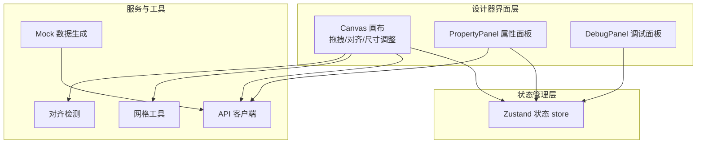
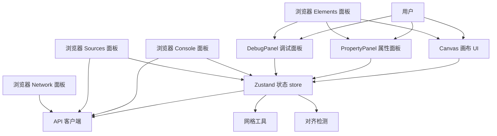
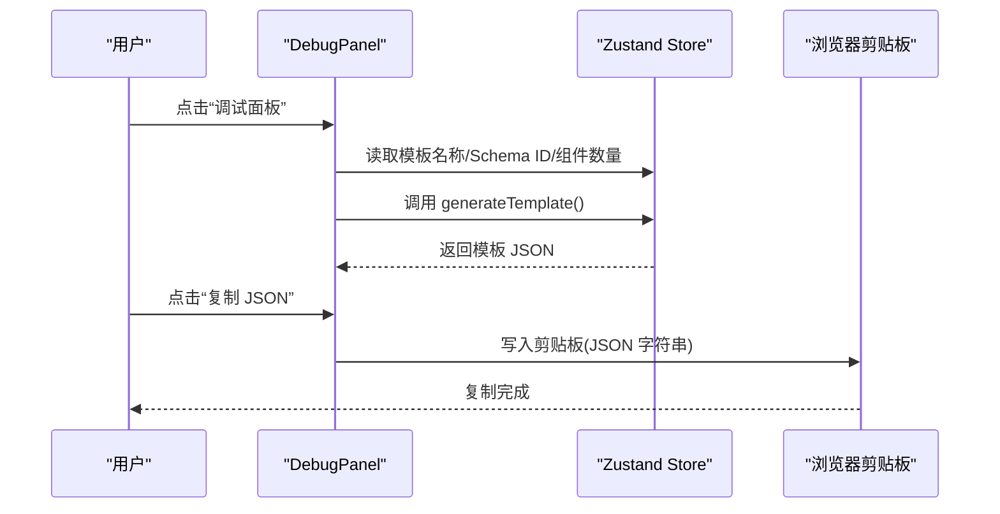
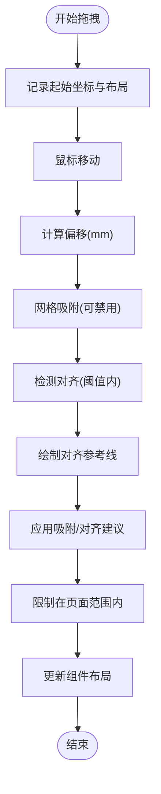
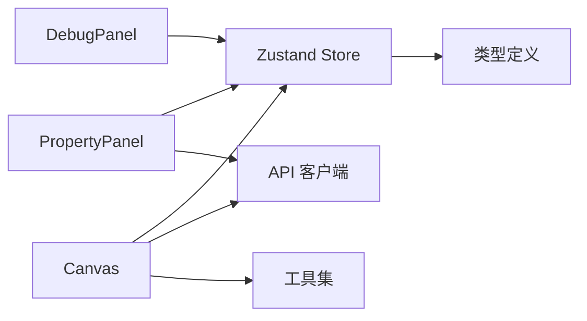

# 调试工具使用

<cite>
**本文引用的文件**
- [designer/src/pages/Designer/components/DebugPanel/index.tsx](file://designer/src/pages/Designer/components/DebugPanel/index.tsx)
- [designer/src/store/designer.ts](file://designer/src/store/designer.ts)
- [designer/src/services/api.ts](file://designer/src/services/api.ts)
- [designer/src/utils/mockDataGenerator.ts](file://designer/src/utils/mockDataGenerator.ts)
- [designer/src/types/index.ts](file://designer/src/types/index.ts)
- [designer/src/pages/Designer/components/PropertyPanel/index.tsx](file://designer/src/pages/Designer/components/PropertyPanel/index.tsx)
- [designer/src/pages/Designer/components/Canvas/alignmentDetector.ts](file://designer/src/pages/Designer/components/Canvas/alignmentDetector.ts)
- [designer/src/pages/Designer/components/Canvas/AlignmentGuides.tsx](file://designer/src/pages/Designer/components/Canvas/AlignmentGuides.tsx)
- [designer/src/pages/Designer/components/Canvas/ResizeHandles.tsx](file://designer/src/pages/Designer/components/Canvas/ResizeHandles.tsx)
- [designer/src/pages/Designer/components/Canvas/CanvasToolbar.tsx](file://designer/src/pages/Designer/components/Canvas/CanvasToolbar.tsx)
- [designer/src/pages/Designer/components/Canvas/SaveTemplateModal.tsx](file://designer/src/pages/Designer/components/Canvas/SaveTemplateModal.tsx)
- [designer/src/pages/Designer/components/Canvas/PageSettingModal.tsx](file://designer/src/pages/Designer/components/Canvas/PageSettingModal.tsx)
- [designer/src/utils/grid.ts](file://designer/src/utils/grid.ts)
- [designer/src/pages/Designer/components/Canvas/index.tsx](file://designer/src/pages/Designer/components/Canvas/index.tsx)
- [designer/package.json](file://designer/package.json)
</cite>

## 目录
1. [简介](#简介)
2. [项目结构](#项目结构)
3. [核心组件](#核心组件)
4. [架构总览](#架构总览)
5. [详细组件分析](#详细组件分析)
6. [依赖分析](#依赖分析)
7. [性能考虑](#性能考虑)
8. [故障排查指南](#故障排查指南)
9. [结论](#结论)
10. [附录](#附录)

## 简介
本指南面向打印平台“设计器”模块的调试与性能优化，聚焦以下目标：
- 浏览器开发者工具的系统性调试方法：Elements 面板 DOM 结构分析、Console 面板日志与断点调试、Sources 面板断点与调用栈、Network 面板接口请求分析。
- 设计器内部“调试面板”的使用：查看模板 JSON、复制模板、定位组件数量与模板元信息。
- 日志分析与错误追踪：基于 Zustand 状态变更与 API 请求的可观测性实践。
- 性能监控与优化：React DevTools 组件渲染路径、Zustand 状态变更轨迹、自定义性能指标采集建议。
- 调试面板功能与使用技巧：如何快速定位布局、尺寸、对齐、网格吸附等问题。

## 项目结构
设计器采用前端单页应用结构，核心围绕“画布 Canvas + 属性面板 PropertyPanel + 调试面板 DebugPanel + 状态管理 Zustand + API 客户端”组织。关键目录与文件如下图所示：

图表来源
- [designer/src/pages/Designer/components/Canvas/index.tsx:1-1006](file://designer/src/pages/Designer/components/Canvas/index.tsx#L1-L1006)
- [designer/src/pages/Designer/components/PropertyPanel/index.tsx:1-129](file://designer/src/pages/Designer/components/PropertyPanel/index.tsx#L1-L129)
- [designer/src/pages/Designer/components/DebugPanel/index.tsx:1-74](file://designer/src/pages/Designer/components/DebugPanel/index.tsx#L1-L74)
- [designer/src/store/designer.ts:1-539](file://designer/src/store/designer.ts#L1-L539)
- [designer/src/services/api.ts:1-97](file://designer/src/services/api.ts#L1-L97)
- [designer/src/utils/grid.ts:1-36](file://designer/src/utils/grid.ts#L1-L36)
- [designer/src/pages/Designer/components/Canvas/alignmentDetector.ts:1-158](file://designer/src/pages/Designer/components/Canvas/alignmentDetector.ts#L1-L158)
- [designer/src/utils/mockDataGenerator.ts:1-113](file://designer/src/utils/mockDataGenerator.ts#L1-L113)

章节来源
- [designer/src/pages/Designer/components/Canvas/index.tsx:1-1006](file://designer/src/pages/Designer/components/Canvas/index.tsx#L1-L1006)
- [designer/src/pages/Designer/components/PropertyPanel/index.tsx:1-129](file://designer/src/pages/Designer/components/PropertyPanel/index.tsx#L1-L129)
- [designer/src/pages/Designer/components/DebugPanel/index.tsx:1-74](file://designer/src/pages/Designer/components/DebugPanel/index.tsx#L1-L74)
- [designer/src/store/designer.ts:1-539](file://designer/src/store/designer.ts#L1-L539)
- [designer/src/services/api.ts:1-97](file://designer/src/services/api.ts#L1-L97)
- [designer/src/utils/grid.ts:1-36](file://designer/src/utils/grid.ts#L1-L36)
- [designer/src/pages/Designer/components/Canvas/alignmentDetector.ts:1-158](file://designer/src/pages/Designer/components/Canvas/alignmentDetector.ts#L1-L158)
- [designer/src/utils/mockDataGenerator.ts:1-113](file://designer/src/utils/mockDataGenerator.ts#L1-L113)

## 核心组件
- 调试面板 DebugPanel：固定悬浮按钮触发右侧抽屉，展示模板名称、Schema ID、组件数量，并可复制模板 JSON，便于快速导出与对比。
- Zustand 状态 store：集中管理组件集合、选中状态、页面配置、撤销/重做历史、网格与对齐工具等，提供 generateTemplate 生成完整模板。
- Canvas 画布：实现组件拖拽、尺寸调整、智能对齐、网格吸附、快捷键、上下文菜单、页面设置与快速打印等交互。
- PropertyPanel 属性面板：根据选中组件类型展示布局、样式、数据绑定、表格列等可编辑区域。
- API 客户端：封装 schemas/templates/mock-data 的增删改查接口，统一基地址与响应处理。
- 工具集：网格吸附、对齐检测、Mock 数据生成、类型定义。

章节来源
- [designer/src/pages/Designer/components/DebugPanel/index.tsx:1-74](file://designer/src/pages/Designer/components/DebugPanel/index.tsx#L1-L74)
- [designer/src/store/designer.ts:1-539](file://designer/src/store/designer.ts#L1-L539)
- [designer/src/pages/Designer/components/Canvas/index.tsx:1-1006](file://designer/src/pages/Designer/components/Canvas/index.tsx#L1-L1006)
- [designer/src/pages/Designer/components/PropertyPanel/index.tsx:1-129](file://designer/src/pages/Designer/components/PropertyPanel/index.tsx#L1-L129)
- [designer/src/services/api.ts:1-97](file://designer/src/services/api.ts#L1-L97)
- [designer/src/utils/grid.ts:1-36](file://designer/src/utils/grid.ts#L1-L36)
- [designer/src/pages/Designer/components/Canvas/alignmentDetector.ts:1-158](file://designer/src/pages/Designer/components/Canvas/alignmentDetector.ts#L1-L158)
- [designer/src/utils/mockDataGenerator.ts:1-113](file://designer/src/utils/mockDataGenerator.ts#L1-L113)

## 架构总览
下图展示了浏览器端调试视角下的关键交互链路：用户操作 Canvas/PropertyPanel 触发 Zustand 状态变更；DebugPanel 读取 store 生成模板 JSON；API 客户端负责与后端通信；工具模块提供网格与对齐支持。

图表来源
- [designer/src/pages/Designer/components/Canvas/index.tsx:1-1006](file://designer/src/pages/Designer/components/Canvas/index.tsx#L1-L1006)
- [designer/src/pages/Designer/components/PropertyPanel/index.tsx:1-129](file://designer/src/pages/Designer/components/PropertyPanel/index.tsx#L1-L129)
- [designer/src/pages/Designer/components/DebugPanel/index.tsx:1-74](file://designer/src/pages/Designer/components/DebugPanel/index.tsx#L1-L74)
- [designer/src/store/designer.ts:1-539](file://designer/src/store/designer.ts#L1-L539)
- [designer/src/services/api.ts:1-97](file://designer/src/services/api.ts#L1-L97)
- [designer/src/utils/grid.ts:1-36](file://designer/src/utils/grid.ts#L1-L36)
- [designer/src/pages/Designer/components/Canvas/alignmentDetector.ts:1-158](file://designer/src/pages/Designer/components/Canvas/alignmentDetector.ts#L1-L158)

## 详细组件分析

### 调试面板 DebugPanel 使用指南
- 功能入口：右下角悬浮按钮，点击打开右侧抽屉。
- 显示内容：
  - 模板名称、Schema ID、组件数量。
  - 模板 JSON（可复制）。
- 使用技巧：
  - 在修复布局或数据绑定问题时，先复制模板 JSON，再进行修改，便于回滚与对比。
  - 通过组件数量判断是否遗漏或多余组件。
  - 若出现打印异常，优先核对模板 JSON 中的 page 配置与组件布局单位。

图表来源
- [designer/src/pages/Designer/components/DebugPanel/index.tsx:1-74](file://designer/src/pages/Designer/components/DebugPanel/index.tsx#L1-L74)
- [designer/src/store/designer.ts:138-148](file://designer/src/store/designer.ts#L138-L148)

章节来源
- [designer/src/pages/Designer/components/DebugPanel/index.tsx:1-74](file://designer/src/pages/Designer/components/DebugPanel/index.tsx#L1-L74)
- [designer/src/store/designer.ts:138-148](file://designer/src/store/designer.ts#L138-L148)

### Canvas 画布：拖拽、对齐与尺寸调整
- 拖拽流程：鼠标按下记录起始位置与布局，移动时计算偏移并应用网格吸附与智能对齐，松开后写回状态。
- 智能对齐：检测拖拽组件与其它组件的对齐关系，绘制参考线并在必要时提供吸附建议。
- 尺寸调整：8 个手柄支持按方向缩放，内置最小尺寸限制与页面范围约束。
- 网格吸附：支持按住 Shift 临时禁用吸附，提升微调精度。

图表来源
- [designer/src/pages/Designer/components/Canvas/index.tsx:434-562](file://designer/src/pages/Designer/components/Canvas/index.tsx#L434-L562)
- [designer/src/pages/Designer/components/Canvas/alignmentDetector.ts:24-157](file://designer/src/pages/Designer/components/Canvas/alignmentDetector.ts#L24-L157)
- [designer/src/pages/Designer/components/Canvas/AlignmentGuides.tsx:21-63](file://designer/src/pages/Designer/components/Canvas/AlignmentGuides.tsx#L21-L63)
- [designer/src/pages/Designer/components/Canvas/ResizeHandles.tsx:34-150](file://designer/src/pages/Designer/components/Canvas/ResizeHandles.tsx#L34-L150)
- [designer/src/utils/grid.ts:12-15](file://designer/src/utils/grid.ts#L12-L15)

章节来源
- [designer/src/pages/Designer/components/Canvas/index.tsx:1-1006](file://designer/src/pages/Designer/components/Canvas/index.tsx#L1-L1006)
- [designer/src/pages/Designer/components/Canvas/alignmentDetector.ts:1-158](file://designer/src/pages/Designer/components/Canvas/alignmentDetector.ts#L1-L158)
- [designer/src/pages/Designer/components/Canvas/AlignmentGuides.tsx:1-66](file://designer/src/pages/Designer/components/Canvas/AlignmentGuides.tsx#L1-L66)
- [designer/src/pages/Designer/components/Canvas/ResizeHandles.tsx:1-201](file://designer/src/pages/Designer/components/Canvas/ResizeHandles.tsx#L1-L201)
- [designer/src/utils/grid.ts:1-36](file://designer/src/utils/grid.ts#L1-L36)

### PropertyPanel 属性面板：布局/样式/数据绑定
- 布局属性：实时更新组件绝对定位与尺寸。
- 样式与 Props：按组件类型提供样式与属性编辑项。
- 数据绑定：支持字段路径与管道配置（由外部扩展）。
- 使用技巧：选中组件后，直接在面板修改，Zustand 立即持久化，便于快速验证效果。

章节来源
- [designer/src/pages/Designer/components/PropertyPanel/index.tsx:1-129](file://designer/src/pages/Designer/components/PropertyPanel/index.tsx#L1-L129)

### Zustand 状态管理：调试与性能
- 关键能力：
  - 组件增删改、选中与多选、复制/粘贴/克隆。
  - 页面配置、网格与对齐、层级管理、撤销/重做（最多 20 步）。
  - 生成完整模板 JSON，便于导出与调试。
- 调试要点：
  - 在 Console 中打印 store 状态快照，观察历史索引与组件列表变化。
  - 使用 React DevTools 查看组件渲染次数与状态变化路径。
  - 在 Sources 面板为 store 方法设置断点，跟踪状态变更来源。

章节来源
- [designer/src/store/designer.ts:1-539](file://designer/src/store/designer.ts#L1-L539)

### API 客户端：日志与错误追踪
- 接口覆盖：Schema、Template、MockData 的 CRUD。
- 建议：
  - 在 Network 面板观察请求与响应，结合 Console 输出定位错误。
  - 在拦截器或包装函数中增加请求/响应日志，便于回归分析。

章节来源
- [designer/src/services/api.ts:1-97](file://designer/src/services/api.ts#L1-L97)

### Mock 数据生成：辅助调试
- 根据 Schema 字段类型与键名推断合理示例值，支持字符串、数值、布尔、日期、对象、数组。
- 适合在无真实数据时快速验证布局与表格渲染。

章节来源
- [designer/src/utils/mockDataGenerator.ts:1-113](file://designer/src/utils/mockDataGenerator.ts#L1-L113)

## 依赖分析
- 组件耦合：
  - Canvas 与 Zustand 高耦合，承载大量交互逻辑。
  - DebugPanel 低耦合，仅读取 store 并导出 JSON。
  - PropertyPanel 依赖 Zustand 与类型定义。
- 外部依赖：
  - antd 提供 UI 组件与对话框。
  - axios 作为 API 客户端。
  - zustand 作为轻量状态管理。

图表来源
- [designer/src/pages/Designer/components/Canvas/index.tsx:1-1006](file://designer/src/pages/Designer/components/Canvas/index.tsx#L1-L1006)
- [designer/src/pages/Designer/components/PropertyPanel/index.tsx:1-129](file://designer/src/pages/Designer/components/PropertyPanel/index.tsx#L1-L129)
- [designer/src/pages/Designer/components/DebugPanel/index.tsx:1-74](file://designer/src/pages/Designer/components/DebugPanel/index.tsx#L1-L74)
- [designer/src/store/designer.ts:1-539](file://designer/src/store/designer.ts#L1-L539)
- [designer/src/services/api.ts:1-97](file://designer/src/services/api.ts#L1-L97)
- [designer/src/types/index.ts:1-160](file://designer/src/types/index.ts#L1-L160)

章节来源
- [designer/src/pages/Designer/components/Canvas/index.tsx:1-1006](file://designer/src/pages/Designer/components/Canvas/index.tsx#L1-L1006)
- [designer/src/pages/Designer/components/PropertyPanel/index.tsx:1-129](file://designer/src/pages/Designer/components/PropertyPanel/index.tsx#L1-L129)
- [designer/src/pages/Designer/components/DebugPanel/index.tsx:1-74](file://designer/src/pages/Designer/components/DebugPanel/index.tsx#L1-L74)
- [designer/src/store/designer.ts:1-539](file://designer/src/store/designer.ts#L1-L539)
- [designer/src/services/api.ts:1-97](file://designer/src/services/api.ts#L1-L97)
- [designer/src/types/index.ts:1-160](file://designer/src/types/index.ts#L1-L160)

## 性能考虑
- 渲染性能：
  - 减少不必要的组件重渲染：在属性面板与画布中尽量使用浅比较与局部状态。
  - 合理拆分组件，避免大体积节点频繁更新。
- 状态变更：
  - 利用 Zustand 的细粒度更新，避免一次性替换整个组件列表。
  - 控制撤销/重做历史长度，避免内存膨胀。
- 网络请求：
  - 合并与节流请求，避免频繁刷新导致 UI 卡顿。
- 工具辅助：
  - 使用 React DevTools Profiler 识别长任务与重渲染热点。
  - 使用浏览器性能面板测量关键路径耗时。

## 故障排查指南
- 布局越界：
  - 现象：组件超出页面边界，打印时被截断。
  - 排查：检查页面尺寸、页边距与组件布局；使用“超出边界组件”提示确认。
  - 解决：调整组件位置或缩小尺寸，确保在页面范围内。
- 智能对齐无效：
  - 现象：拖拽时无对齐参考线或吸附不生效。
  - 排查：确认网格开启、Shift 键未被误按；检查对齐阈值与组件尺寸。
  - 解决：适当增大网格步长或手动微调。
- 尺寸调整异常：
  - 现象：尺寸小于最小值或超出页面范围。
  - 排查：确认最小尺寸限制与页面宽高。
  - 解决：调整页面配置或组件初始尺寸。
- 撤销/重做失效：
  - 现象：无法撤销或重做。
  - 排查：检查历史索引与历史数组长度。
  - 解决：重新执行一次操作以推进历史指针。
- 模板保存失败：
  - 现象：保存时报错。
  - 排查：Network 面板查看请求与错误信息；Console 输出错误堆栈。
  - 解决：修正必填字段与后端返回的错误提示。

章节来源
- [designer/src/pages/Designer/components/Canvas/SaveTemplateModal.tsx:38-127](file://designer/src/pages/Designer/components/Canvas/SaveTemplateModal.tsx#L38-L127)
- [designer/src/pages/Designer/components/Canvas/index.tsx:163-193](file://designer/src/pages/Designer/components/Canvas/index.tsx#L163-L193)
- [designer/src/pages/Designer/components/Canvas/ResizeHandles.tsx:100-135](file://designer/src/pages/Designer/components/Canvas/ResizeHandles.tsx#L100-L135)
- [designer/src/store/designer.ts:297-331](file://designer/src/store/designer.ts#L297-L331)
- [designer/src/services/api.ts:1-97](file://designer/src/services/api.ts#L1-L97)

## 结论
通过结合浏览器开发者工具与设计器内部调试能力，可以高效定位布局、尺寸、对齐、状态与网络等多类问题。建议在日常开发中：
- 使用 DebugPanel 快速导出模板 JSON，建立“可验证”的基线。
- 在 Sources 面板为关键状态更新设置断点，配合 React DevTools 观察渲染路径。
- 在 Network 面板持续监控 API 请求，结合 Console 输出进行错误追踪。
- 借助网格与智能对齐工具提升布局效率，减少反复微调。

## 附录
- 快捷键速查：
  - 删除/退格：删除选中组件。
  - Ctrl/Cmd+C：复制组件。
  - Ctrl/Cmd+V：粘贴组件。
  - Ctrl/Cmd+Z：撤销。
  - Ctrl/Cmd+Shift+Z：重做。
  - Ctrl/Cmd+D：克隆组件。
- 页面设置：
  - 支持 A4/A5、自定义尺寸、连续纸，以及页码配置。
- 网格与吸附：
  - 默认网格 5mm，按住 Shift 可临时禁用吸附。

章节来源
- [designer/src/pages/Designer/components/Canvas/index.tsx:112-161](file://designer/src/pages/Designer/components/Canvas/index.tsx#L112-L161)
- [designer/src/pages/Designer/components/Canvas/CanvasToolbar.tsx:148-156](file://designer/src/pages/Designer/components/Canvas/CanvasToolbar.tsx#L148-L156)
- [designer/src/pages/Designer/components/Canvas/PageSettingModal.tsx:1-206](file://designer/src/pages/Designer/components/Canvas/PageSettingModal.tsx#L1-L206)
- [designer/src/utils/grid.ts:1-36](file://designer/src/utils/grid.ts#L1-L36)