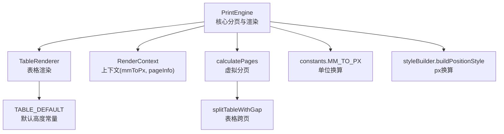
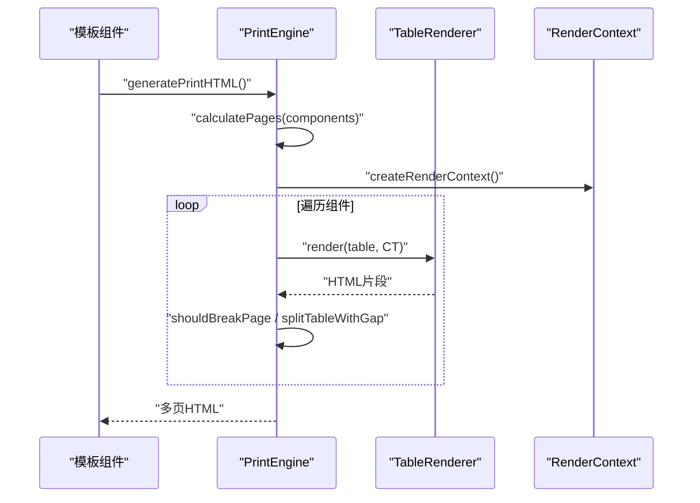
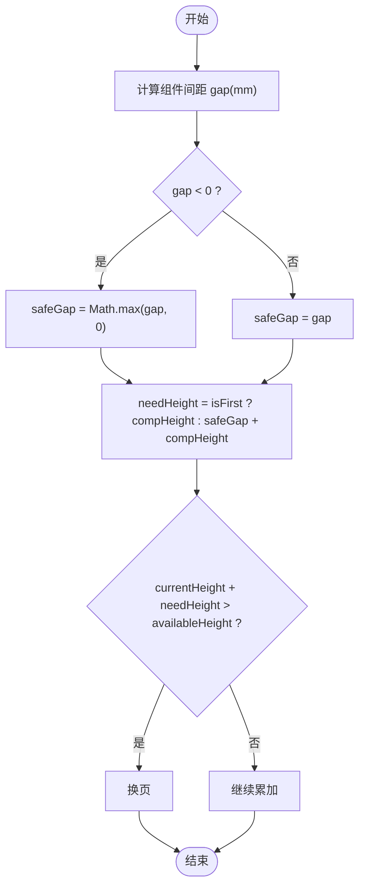
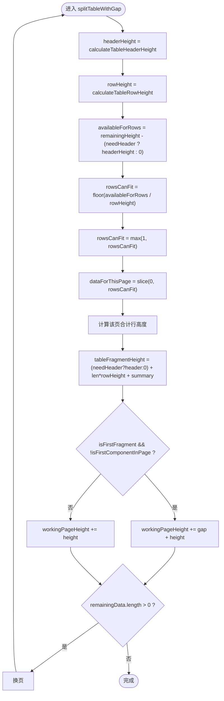
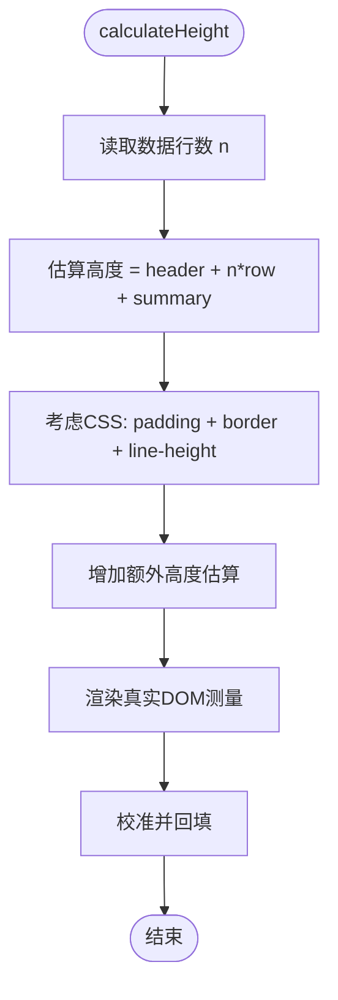
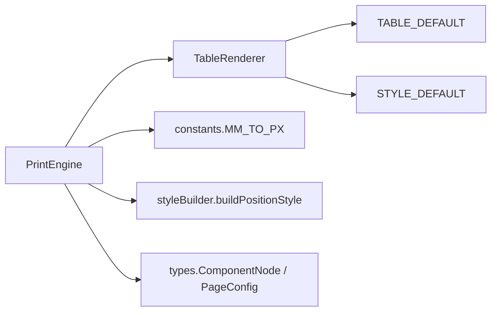

# SDK核心逻辑错误

<cite>
**本文引用的文件**
- [sdk/src/printEngine.ts](file://sdk/src/printEngine.ts)
- [sdk/src/printEngine/renderers/TableRenderer.ts](file://sdk/src/printEngine/renderers/TableRenderer.ts)
- [sdk/src/printEngine/constants.ts](file://sdk/src/printEngine/constants.ts)
- [sdk/src/printEngine/types.ts](file://sdk/src/printEngine/types.ts)
- [sdk/src/printEngine/utils/styleBuilder.ts](file://sdk/src/printEngine/utils/styleBuilder.ts)
- [sdk/src/types.ts](file://sdk/src/types.ts)
- [sdk/src/sdk.ts](file://sdk/src/sdk.ts)
</cite>

## 目录
1. [简介](#简介)
2. [项目结构](#项目结构)
3. [核心组件](#核心组件)
4. [架构概览](#架构概览)
5. [详细组件分析](#详细组件分析)
6. [依赖分析](#依赖分析)
7. [性能考量](#性能考量)
8. [故障排除指南](#故障排除指南)
9. [结论](#结论)
10. [附录](#附录)

## 简介
本文件聚焦于SDK在分页计算与表格渲染中的核心逻辑错误，特别是以下问题：
- calculatePages方法中单位转换错误导致的精度丢失
- splitTableWithGap中行数计算错误引发的跨页截断异常
- 表格高度计算与实际渲染不一致的根本原因（padding、border、line-height等）
- 组件间距gap为负数的边界条件处理及其对分页的影响
- 提供修复建议：使用Math.max()处理负数gap、在calculateHeight中增加额外高度估算、使用渲染后测量进行校准
- 错误日志分析技巧与调试步骤

## 项目结构
SDK采用插件化渲染器架构，核心流程如下：
- 模板解析与上下文构建
- 组件渲染器按类型渲染HTML
- 虚拟分页：基于相对间距与可用高度计算换页点
- 表格跨页：按精确行高与表头/合计行策略拆分

图表来源
- [sdk/src/printEngine.ts:396-541](file://sdk/src/printEngine.ts#L396-L541)
- [sdk/src/printEngine.ts:547-663](file://sdk/src/printEngine.ts#L547-L663)
- [sdk/src/printEngine/renderers/TableRenderer.ts:14-150](file://sdk/src/printEngine/renderers/TableRenderer.ts#L14-L150)
- [sdk/src/printEngine/constants.ts:8-58](file://sdk/src/printEngine/constants.ts#L8-L58)
- [sdk/src/printEngine/utils/styleBuilder.ts:31-53](file://sdk/src/printEngine/utils/styleBuilder.ts#L31-L53)

章节来源
- [sdk/src/printEngine.ts:31-757](file://sdk/src/printEngine.ts#L31-L757)
- [sdk/src/printEngine/renderers/TableRenderer.ts:1-275](file://sdk/src/printEngine/renderers/TableRenderer.ts#L1-L275)
- [sdk/src/printEngine/constants.ts:1-113](file://sdk/src/printEngine/constants.ts#L1-L113)
- [sdk/src/printEngine/types.ts:1-116](file://sdk/src/printEngine/types.ts#L1-L116)
- [sdk/src/printEngine/utils/styleBuilder.ts:1-54](file://sdk/src/printEngine/utils/styleBuilder.ts#L1-L54)
- [sdk/src/types.ts:1-171](file://sdk/src/types.ts#L1-L171)
- [sdk/src/sdk.ts:1-63](file://sdk/src/sdk.ts#L1-L63)

## 核心组件
- PrintEngine：负责模板解析、上下文构建、虚拟分页与表格跨页拆分
- TableRenderer：负责表格渲染、合计行渲染、高度估算
- constants：提供MM_TO_PX、TABLE_DEFAULT等常量
- types：定义组件节点、分页配置、表格属性等类型
- styleBuilder：提供样式字符串与px换算工具

章节来源
- [sdk/src/printEngine.ts:31-757](file://sdk/src/printEngine.ts#L31-L757)
- [sdk/src/printEngine/renderers/TableRenderer.ts:11-151](file://sdk/src/printEngine/renderers/TableRenderer.ts#L11-L151)
- [sdk/src/printEngine/constants.ts:8-58](file://sdk/src/printEngine/constants.ts#L8-L58)
- [sdk/src/printEngine/types.ts:11-82](file://sdk/src/printEngine/types.ts#L11-L82)
- [sdk/src/printEngine/utils/styleBuilder.ts:13-53](file://sdk/src/printEngine/utils/styleBuilder.ts#L13-L53)

## 架构概览
分页与表格渲染的关键交互如下：

图表来源
- [sdk/src/printEngine.ts:668-725](file://sdk/src/printEngine.ts#L668-L725)
- [sdk/src/printEngine.ts:396-541](file://sdk/src/printEngine.ts#L396-L541)
- [sdk/src/printEngine.ts:547-663](file://sdk/src/printEngine.ts#L547-L663)
- [sdk/src/printEngine/renderers/TableRenderer.ts:14-150](file://sdk/src/printEngine/renderers/TableRenderer.ts#L14-L150)

## 详细组件分析

### 分页计算与单位转换错误
问题定位：
- 在calculatePages中，组件间距gap与组件高度均来自layout的mm单位，但在shouldBreakPage中直接相加，未考虑单位换算与浮点误差累积
- 在splitTableWithGap中，行数计算使用整除，未考虑表头/合计行占用空间与实际渲染高度差异

修复建议：
- 在shouldBreakPage中，统一使用mmToPx进行单位换算后再比较
- 在行数计算时，先减去表头与合计行高度，再进行整除，并确保至少保留1行
- 对gap为负数的情况，使用Math.max(gap, 0)进行安全处理

图表来源
- [sdk/src/printEngine.ts:244-253](file://sdk/src/printEngine.ts#L244-L253)
- [sdk/src/printEngine.ts:453-531](file://sdk/src/printEngine.ts#L453-L531)

章节来源
- [sdk/src/printEngine.ts:244-253](file://sdk/src/printEngine.ts#L244-L253)
- [sdk/src/printEngine.ts:453-531](file://sdk/src/printEngine.ts#L453-L531)

### 表格跨页拆分与行数计算问题
问题定位：
- splitTableWithGap中，行数计算仅考虑可用高度与行高，未考虑表头/合计行高度与实际渲染高度差异
- 表头重复策略与合计行显示时机影响剩余高度计算

修复建议：
- 在计算rowsCanFit前，先减去needHeader对应的表头高度与该页合计行高度
- 使用Math.max(1, ...)保证至少保留1行
- 在每页高度更新时，考虑是否首次片段与是否应用gap

图表来源
- [sdk/src/printEngine.ts:547-663](file://sdk/src/printEngine.ts#L547-L663)
- [sdk/src/printEngine.ts:258-269](file://sdk/src/printEngine.ts#L258-L269)

章节来源
- [sdk/src/printEngine.ts:547-663](file://sdk/src/printEngine.ts#L547-L663)
- [sdk/src/printEngine.ts:258-269](file://sdk/src/printEngine.ts#L258-L269)

### 表格高度计算与实际渲染不一致
问题定位：
- TableRenderer.calculateHeight使用TABLE_DEFAULT估算高度，未考虑padding、border、line-height等CSS因素
- 实际渲染时，单元格高度包含padding/border/line-height，导致估算高度与真实高度存在偏差

修复建议：
- 在calculateHeight中增加额外高度估算（例如：padding + border + line-height差异）
- 或采用“渲染后测量”校准：先渲染临时DOM，测量真实高度，再回填到分页逻辑

图表来源
- [sdk/src/printEngine/renderers/TableRenderer.ts:259-273](file://sdk/src/printEngine/renderers/TableRenderer.ts#L259-L273)
- [sdk/src/printEngine/renderers/TableRenderer.ts:88-96](file://sdk/src/printEngine/renderers/TableRenderer.ts#L88-L96)
- [sdk/src/printEngine/constants.ts:51-58](file://sdk/src/printEngine/constants.ts#L51-L58)

章节来源
- [sdk/src/printEngine/renderers/TableRenderer.ts:259-273](file://sdk/src/printEngine/renderers/TableRenderer.ts#L259-L273)
- [sdk/src/printEngine/renderers/TableRenderer.ts:88-96](file://sdk/src/printEngine/renderers/TableRenderer.ts#L88-L96)
- [sdk/src/printEngine/constants.ts:51-58](file://sdk/src/printEngine/constants.ts#L51-L58)

### 组件间距gap为负数的边界条件
问题定位：
- 在calculatePages中，gap = comp.layout.yMm - prevBottom，当组件重叠或布局异常时可能出现负值
- shouldBreakPage直接使用gap参与比较，未做边界处理

修复建议：
- 使用Math.max(gap, 0)处理负数gap，避免负间距导致提前换页或高度叠加异常

章节来源
- [sdk/src/printEngine.ts:427-431](file://sdk/src/printEngine.ts#L427-L431)
- [sdk/src/printEngine.ts:244-253](file://sdk/src/printEngine.ts#L244-L253)

## 依赖分析
- PrintEngine依赖各渲染器插件（含TableRenderer），并通过constants与utils进行单位换算与样式构建
- TableRenderer依赖TABLE_DEFAULT与STYLE_DEFAULT，结合RenderContext的mmToPx进行px换算
- 分页逻辑依赖types中的ComponentNode与PageConfig

图表来源
- [sdk/src/printEngine.ts:31-757](file://sdk/src/printEngine.ts#L31-L757)
- [sdk/src/printEngine/renderers/TableRenderer.ts:1-275](file://sdk/src/printEngine/renderers/TableRenderer.ts#L1-L275)
- [sdk/src/printEngine/constants.ts:8-58](file://sdk/src/printEngine/constants.ts#L8-L58)
- [sdk/src/printEngine/utils/styleBuilder.ts:31-53](file://sdk/src/printEngine/utils/styleBuilder.ts#L31-L53)
- [sdk/src/printEngine/types.ts:11-82](file://sdk/src/printEngine/types.ts#L11-L82)

章节来源
- [sdk/src/printEngine.ts:31-757](file://sdk/src/printEngine.ts#L31-L757)
- [sdk/src/printEngine/renderers/TableRenderer.ts:1-275](file://sdk/src/printEngine/renderers/TableRenderer.ts#L1-L275)
- [sdk/src/printEngine/constants.ts:1-113](file://sdk/src/printEngine/constants.ts#L1-L113)
- [sdk/src/printEngine/utils/styleBuilder.ts:1-54](file://sdk/src/printEngine/utils/styleBuilder.ts#L1-L54)
- [sdk/src/printEngine/types.ts:1-116](file://sdk/src/printEngine/types.ts#L1-L116)
- [sdk/src/types.ts:134-160](file://sdk/src/types.ts#L134-L160)

## 性能考量
- 分页计算为O(n)遍历，表格拆分为O(k)循环（k为数据行数）
- 使用整除计算行数可减少浮点运算开销
- 建议在calculateHeight中加入缓存机制，避免重复计算相同组件高度

## 故障排除指南

### 常见症状与定位
- 表格跨页截断异常：可能由行数计算不足或合计行高度未计入引起
- 表格被截断在表头或中间：可能由负gap导致高度叠加异常
- 表格高度与实际渲染不一致：可能由padding/border/line-height未纳入估算

### 日志与调试步骤
- 启用分页日志：在calculatePages与splitTableWithGap中输出关键变量（如remainingHeight、rowsCanFit、gap、needHeader）
- 输出组件高度与估算高度对比：在TableRenderer.calculateHeight前后记录
- 检查页边距与可用高度：确认availableHeightMm计算正确
- 验证gap来源：检查相邻组件的layout.yMm与heightMm是否合理

### 修复清单
- 在shouldBreakPage中统一单位换算并使用Math.max处理负gap
- 在splitTableWithGap中确保rowsCanFit >= 1，并考虑表头/合计行高度
- 在calculateHeight中增加额外高度估算或采用渲染后测量校准
- 在TableRenderer中明确heightPx计算与CSS因素的关系

章节来源
- [sdk/src/printEngine.ts:446-531](file://sdk/src/printEngine.ts#L446-L531)
- [sdk/src/printEngine.ts:547-663](file://sdk/src/printEngine.ts#L547-L663)
- [sdk/src/printEngine/renderers/TableRenderer.ts:259-273](file://sdk/src/printEngine/renderers/TableRenderer.ts#L259-L273)

## 结论
本文件系统性梳理了SDK在分页与表格渲染中的核心逻辑错误，重点围绕单位转换、行数计算、CSS渲染差异与负gap边界条件展开。通过统一单位换算、安全处理gap、精确计算行数与高度估算，可显著提升分页准确性与渲染一致性。

## 附录

### 关键修复点速查
- shouldBreakPage：统一单位换算；使用Math.max(gap, 0)
- splitTableWithGap：rowsCanFit = Math.max(1, floor(...))；考虑needHeader与summaryHeight
- TableRenderer.calculateHeight：增加CSS高度估算或渲染后测量
- styleBuilder：确保buildPositionStyle正确使用mmToPx

章节来源
- [sdk/src/printEngine.ts:244-253](file://sdk/src/printEngine.ts#L244-L253)
- [sdk/src/printEngine.ts:547-663](file://sdk/src/printEngine.ts#L547-L663)
- [sdk/src/printEngine/renderers/TableRenderer.ts:259-273](file://sdk/src/printEngine/renderers/TableRenderer.ts#L259-L273)
- [sdk/src/printEngine/utils/styleBuilder.ts:31-53](file://sdk/src/printEngine/utils/styleBuilder.ts#L31-L53)