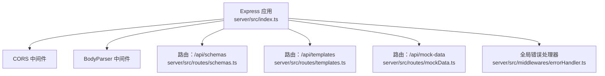
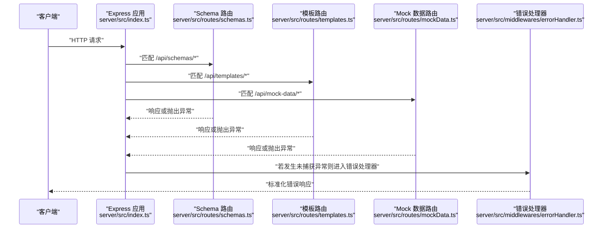
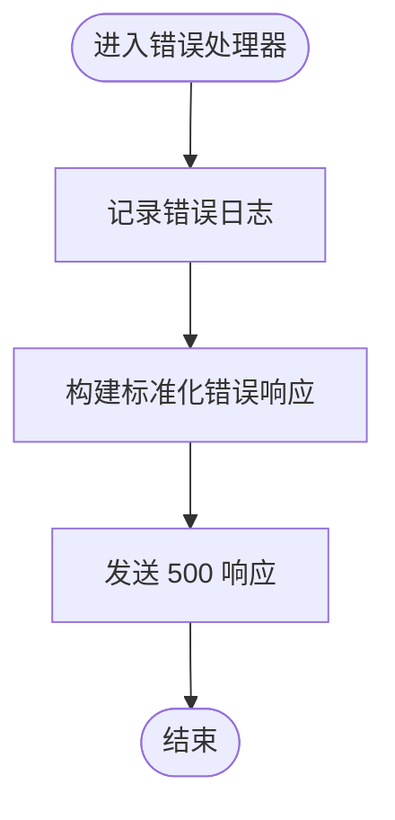
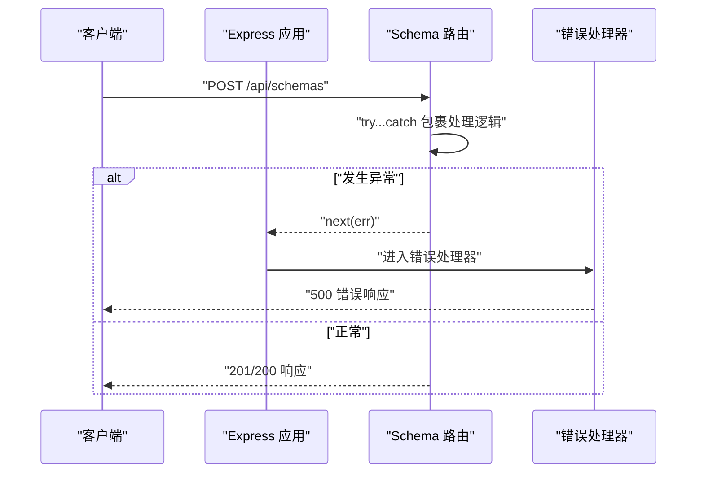
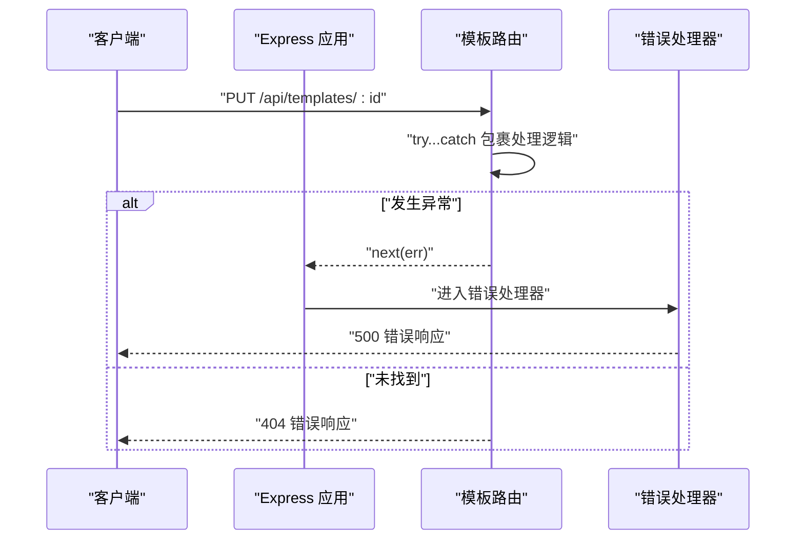
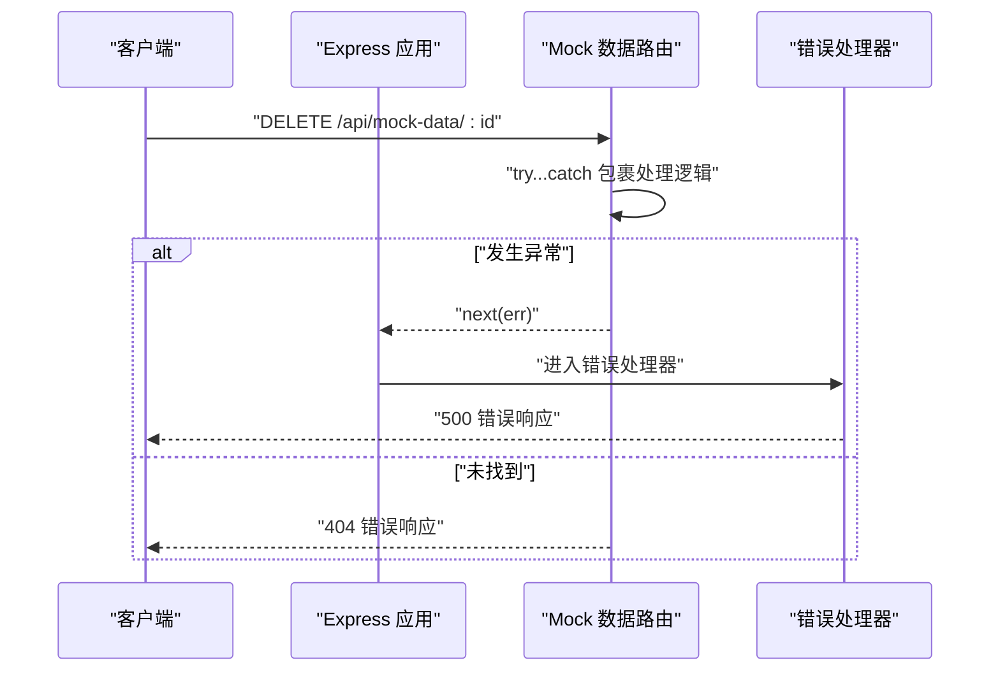
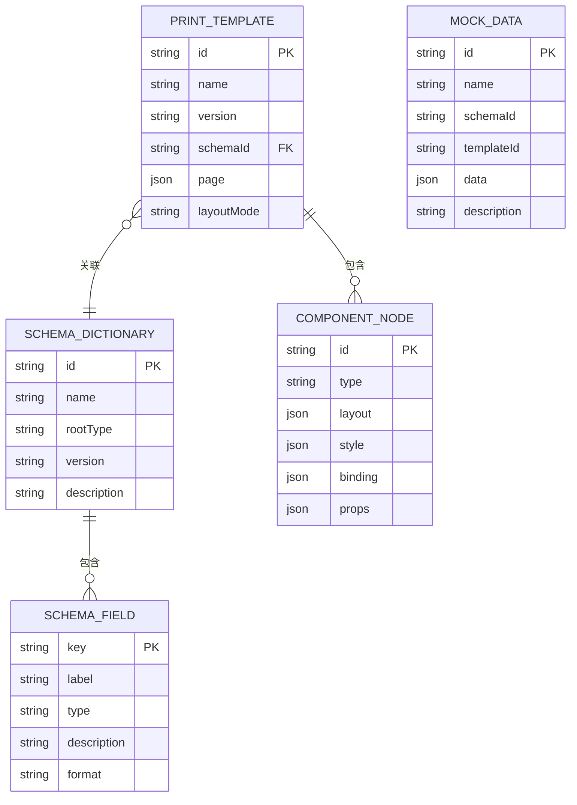
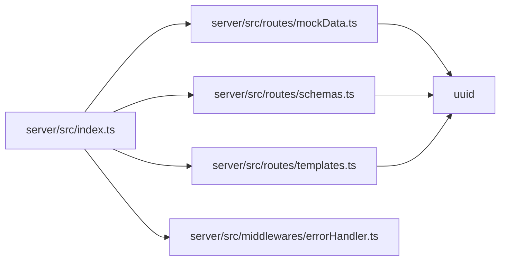

# 服务器端运行时错误

<cite>
**本文引用的文件**
- [server/src/index.ts](file://server/src/index.ts)
- [server/src/middlewares/errorHandler.ts](file://server/src/middlewares/errorHandler.ts)
- [server/src/routes/mockData.ts](file://server/src/routes/mockData.ts)
- [server/src/routes/schemas.ts](file://server/src/routes/schemas.ts)
- [server/src/routes/templates.ts](file://server/src/routes/templates.ts)
- [server/package.json](file://server/package.json)
</cite>

## 目录
1. [简介](#简介)
2. [项目结构](#项目结构)
3. [核心组件](#核心组件)
4. [架构总览](#架构总览)
5. [详细组件分析](#详细组件分析)
6. [依赖关系分析](#依赖关系分析)
7. [性能考量](#性能考量)
8. [故障排除指南](#故障排除指南)
9. [结论](#结论)
10. [附录](#附录)

## 简介
本文件聚焦于服务器端运行时错误的诊断与排障，覆盖路由处理异常、数据库操作错误（当前实现为内存存储）、中间件处理问题以及请求参数验证失败等常见场景。文档详细说明错误处理器工作机制（错误捕获、日志记录与响应格式化），并给出针对模板数据访问冲突、Schema 验证失败、Mock 数据格式错误等问题的诊断与修复建议。同时提供服务器日志分析技巧与性能监控指标建议，并以具体文件路径形式给出错误处理中间件配置与自定义错误类型的实现参考。

## 项目结构
后端采用 Express 应用，通过中间件统一挂载路由与错误处理，路由模块分别管理 Schema、模板与 Mock 数据资源。

图表来源
- [server/src/index.ts:1-25](file://server/src/index.ts#L1-L25)
- [server/src/middlewares/errorHandler.ts:1-10](file://server/src/middlewares/errorHandler.ts#L1-L10)
- [server/src/routes/schemas.ts:1-178](file://server/src/routes/schemas.ts#L1-L178)
- [server/src/routes/templates.ts:1-1081](file://server/src/routes/templates.ts#L1-L1081)
- [server/src/routes/mockData.ts:1-448](file://server/src/routes/mockData.ts#L1-L448)

章节来源
- [server/src/index.ts:1-25](file://server/src/index.ts#L1-L25)

## 核心组件
- 应用入口与中间件装配：负责注册 CORS、JSON 解析、路由与全局错误处理器。
- 错误处理器：统一捕获未处理异常，输出标准错误响应。
- 资源路由：
  - Schema 路由：提供 Schema 的增删改查，支持按名称过滤。
  - 模板路由：提供打印模板的增删改查，支持按名称与关联 Schema 过滤。
  - Mock 数据路由：提供模拟数据的增删改查，支持按名称、Schema 与模板过滤。

章节来源
- [server/src/index.ts:1-25](file://server/src/index.ts#L1-L25)
- [server/src/middlewares/errorHandler.ts:1-10](file://server/src/middlewares/errorHandler.ts#L1-L10)
- [server/src/routes/schemas.ts:1-178](file://server/src/routes/schemas.ts#L1-L178)
- [server/src/routes/templates.ts:1-1081](file://server/src/routes/templates.ts#L1-L1081)
- [server/src/routes/mockData.ts:1-448](file://server/src/routes/mockData.ts#L1-L448)

## 架构总览
下图展示请求从进入应用到路由处理与错误处理的整体流程。

图表来源
- [server/src/index.ts:1-25](file://server/src/index.ts#L1-L25)
- [server/src/middlewares/errorHandler.ts:1-10](file://server/src/middlewares/errorHandler.ts#L1-L10)
- [server/src/routes/schemas.ts:1-178](file://server/src/routes/schemas.ts#L1-L178)
- [server/src/routes/templates.ts:1-1081](file://server/src/routes/templates.ts#L1-L1081)
- [server/src/routes/mockData.ts:1-448](file://server/src/routes/mockData.ts#L1-L448)

## 详细组件分析

### 错误处理器机制
- 错误捕获：Express 将错误作为回调的首个参数传入错误中间件；当前实现直接接收并处理。
- 日志记录：控制台输出错误对象，便于快速定位。
- 响应格式化：返回固定结构的 JSON 错误体，包含错误码与消息字段。

图表来源
- [server/src/middlewares/errorHandler.ts:1-10](file://server/src/middlewares/errorHandler.ts#L1-L10)

章节来源
- [server/src/middlewares/errorHandler.ts:1-10](file://server/src/middlewares/errorHandler.ts#L1-L10)

### Schema 路由（运行时错误场景）
- 路由处理异常：POST/PUT/DELETE 内部 try-catch 将异常交由 next(err)，最终由全局错误处理器统一处理。
- 404 场景：GET/:id 与 PUT/DELETE 若未找到资源，返回带错误码的 JSON。
- 参数验证失败：当前未进行显式校验，直接使用请求体；若请求体缺失或类型不符，可能导致后续处理异常。

图表来源
- [server/src/routes/schemas.ts:120-130](file://server/src/routes/schemas.ts#L120-L130)
- [server/src/routes/schemas.ts:141-150](file://server/src/routes/schemas.ts#L141-L150)
- [server/src/routes/schemas.ts:152-163](file://server/src/routes/schemas.ts#L152-L163)
- [server/src/routes/schemas.ts:165-175](file://server/src/routes/schemas.ts#L165-L175)
- [server/src/middlewares/errorHandler.ts:1-10](file://server/src/middlewares/errorHandler.ts#L1-L10)

章节来源
- [server/src/routes/schemas.ts:120-178](file://server/src/routes/schemas.ts#L120-L178)

### 模板路由（运行时错误场景）
- 路由处理异常：POST/PUT/DELETE 同样通过 try-catch 捕获异常并交由 next(err)。
- 404 场景：GET/:id 与 PUT/DELETE 未命中时返回带错误码的 JSON。
- 参数验证失败：当前未进行显式校验，直接使用请求体；若请求体缺失或类型不符，可能导致后续处理异常。

图表来源
- [server/src/routes/templates.ts:1020-1030](file://server/src/routes/templates.ts#L1020-L1030)
- [server/src/routes/templates.ts:1044-1053](file://server/src/routes/templates.ts#L1044-L1053)
- [server/src/routes/templates.ts:1055-1066](file://server/src/routes/templates.ts#L1055-L1066)
- [server/src/routes/templates.ts:1068-1078](file://server/src/routes/templates.ts#L1068-L1078)
- [server/src/middlewares/errorHandler.ts:1-10](file://server/src/middlewares/errorHandler.ts#L1-L10)

章节来源
- [server/src/routes/templates.ts:1020-1081](file://server/src/routes/templates.ts#L1020-L1081)

### Mock 数据路由（运行时错误场景）
- 路由处理异常：POST/PUT/DELETE 通过 try-catch 捕获异常并交由 next(err)。
- 404 场景：GET/:id 与 PUT/DELETE 未命中时返回带错误码的 JSON。
- 参数验证失败：当前未进行显式校验，直接使用请求体；若请求体缺失或类型不符，可能导致后续处理异常。

图表来源
- [server/src/routes/mockData.ts:382-392](file://server/src/routes/mockData.ts#L382-L392)
- [server/src/routes/mockData.ts:411-420](file://server/src/routes/mockData.ts#L411-L420)
- [server/src/routes/mockData.ts:422-433](file://server/src/routes/mockData.ts#L422-L433)
- [server/src/routes/mockData.ts:435-445](file://server/src/routes/mockData.ts#L435-L445)
- [server/src/middlewares/errorHandler.ts:1-10](file://server/src/middlewares/errorHandler.ts#L1-L10)

章节来源
- [server/src/routes/mockData.ts:382-448](file://server/src/routes/mockData.ts#L382-L448)

### 类型与数据模型（影响错误的潜在因素）
- Schema 字段类型与枚举：字段类型与枚举值不匹配可能导致渲染或校验阶段异常。
- 打印模板组件绑定：数据绑定路径不存在或类型不符会导致渲染期错误。
- Mock 数据结构：数据结构与 Schema 不一致会导致渲染期访问冲突。

图表来源
- [server/src/routes/schemas.ts:15-32](file://server/src/routes/schemas.ts#L15-L32)
- [server/src/routes/templates.ts:49-58](file://server/src/routes/templates.ts#L49-L58)
- [server/src/routes/templates.ts:32-47](file://server/src/routes/templates.ts#L32-L47)
- [server/src/routes/mockData.ts:6-13](file://server/src/routes/mockData.ts#L6-L13)

章节来源
- [server/src/routes/schemas.ts:15-32](file://server/src/routes/schemas.ts#L15-L32)
- [server/src/routes/templates.ts:49-58](file://server/src/routes/templates.ts#L49-L58)
- [server/src/routes/templates.ts:32-47](file://server/src/routes/templates.ts#L32-L47)
- [server/src/routes/mockData.ts:6-13](file://server/src/routes/mockData.ts#L6-L13)

## 依赖关系分析
- 应用入口依赖路由模块与错误处理器。
- 路由模块内部使用 UUID 生成 ID，使用数组作为内存存储。
- 开发脚本使用 ts-node-dev，生产脚本使用 tsc 编译后的 Node 运行时。

图表来源
- [server/src/index.ts:1-25](file://server/src/index.ts#L1-L25)
- [server/src/routes/schemas.ts:1-3](file://server/src/routes/schemas.ts#L1-L3)
- [server/src/routes/templates.ts:1-3](file://server/src/routes/templates.ts#L1-L3)
- [server/src/routes/mockData.ts:1-3](file://server/src/routes/mockData.ts#L1-L3)
- [server/package.json:1-25](file://server/package.json#L1-L25)

章节来源
- [server/src/index.ts:1-25](file://server/src/index.ts#L1-L25)
- [server/src/routes/schemas.ts:1-3](file://server/src/routes/schemas.ts#L1-L3)
- [server/src/routes/templates.ts:1-3](file://server/src/routes/templates.ts#L1-L3)
- [server/src/routes/mockData.ts:1-3](file://server/src/routes/mockData.ts#L1-L3)
- [server/package.json:1-25](file://server/package.json#L1-L25)

## 性能考量
- 内存存储：当前路由使用数组作为内存存储，适合开发与小规模测试；在高并发或持久化需求场景下，建议替换为数据库并引入连接池与查询优化。
- 路由过滤：GET 接口支持字符串模糊匹配与精确匹配，建议在生产环境限制查询参数长度与频率，避免滥用导致性能下降。
- 错误处理开销：全局错误处理器仅做日志与响应封装，成本较低；建议结合业务埋点与链路追踪，避免在错误路径中执行昂贵操作。

## 故障排除指南

### 通用排查步骤
- 检查请求路径与方法是否正确，确认路由前缀与资源路径匹配。
- 查看响应状态码：404 表示资源不存在；500 表示服务器内部错误。
- 审核请求体结构与类型，确保与目标路由期望一致。
- 检查错误处理器日志输出，定位异常发生位置与调用栈。

### 常见错误场景与修复

- 路由处理异常
  - 现象：POST/PUT/DELETE 返回 500，控制台输出错误日志。
  - 可能原因：请求体解析失败、数据转换异常、数组索引越界。
  - 修复建议：在路由层增加显式参数校验与类型断言，必要时使用第三方校验库；对数组操作添加边界检查；将异常包裹在 try-catch 中并通过 next(err) 传递给错误处理器。

- 数据库操作错误（当前为内存存储）
  - 现象：更新/删除时索引查找失败，返回 404 或异常。
  - 可能原因：ID 不存在、ID 类型不匹配。
  - 修复建议：在更新/删除前先校验 ID 存在性；对 ID 进行类型转换与格式校验；在生产环境替换为数据库存储并引入事务与重试策略。

- 中间件处理问题
  - 现象：CORS 或 JSON 解析失败导致请求被拒绝。
  - 可能原因：跨域配置不当、Content-Type 不匹配。
  - 修复建议：确认 CORS 白名单与预检请求处理；确保前端设置正确的 Content-Type；在开发环境启用严格模式以提前暴露问题。

- 请求参数验证失败
  - 现象：路由内部因类型不符或字段缺失抛出异常。
  - 可能原因：缺少必填字段、字段类型不匹配、枚举值不在允许集合内。
  - 修复建议：在路由层增加参数校验（如使用校验库）；对枚举字段进行白名单校验；对复杂对象进行分层校验并返回明确的错误信息。

- 模板数据访问冲突
  - 现象：渲染期组件绑定路径不存在或类型不符，导致渲染异常。
  - 可能原因：Mock 数据与 Schema 不一致；绑定路径拼写错误；数组/对象嵌套层级不匹配。
  - 修复建议：在渲染前对数据与 Schema 进行一致性校验；为绑定路径提供默认值与降级策略；对复杂数据结构进行单元测试与集成测试。

- Schema 验证失败
  - 现象：字段类型或枚举值不符合预期，导致后续处理异常。
  - 可能原因：新增字段未同步到 Schema；枚举值变更未通知前端。
  - 修复建议：引入 Schema 版本管理与兼容性检查；在写入时进行字段与类型校验；对枚举值变更进行灰度发布与回滚预案。

- Mock 数据格式错误
  - 现象：Mock 数据与模板绑定不一致，导致渲染失败或显示异常。
  - 可能原因：数据字段缺失、嵌套结构错误、数值精度问题。
  - 修复建议：为 Mock 数据建立结构化校验规则；在导入时进行批处理校验；对关键字段（金额、数量）进行范围与精度校验。

### 服务器日志分析技巧
- 错误堆栈跟踪：查看错误处理器输出的完整堆栈，定位异常发生的具体文件与行号。
- 请求响应日志：在开发环境开启详细日志，记录请求方法、路径、状态码与耗时；在生产环境使用结构化日志（JSON）便于检索与聚合。
- 性能监控指标：关注路由平均响应时间、错误率、超时比例；对热点路由与大对象操作进行专项监控。

### 自定义错误类型与中间件配置
- 自定义错误类型：可在业务层抛出自定义错误类，携带业务码与上下文信息，便于错误处理器区分与统一处理。
- 错误处理器增强：在现有基础上扩展错误分类（如参数错误、权限错误、资源不存在等），返回更丰富的错误结构与提示信息。
- 中间件顺序：确保错误处理器位于所有路由之后，且为四个参数的错误中间件（err, req, res, next）。

章节来源
- [server/src/middlewares/errorHandler.ts:1-10](file://server/src/middlewares/errorHandler.ts#L1-L10)
- [server/src/routes/schemas.ts:120-178](file://server/src/routes/schemas.ts#L120-L178)
- [server/src/routes/templates.ts:1020-1081](file://server/src/routes/templates.ts#L1020-L1081)
- [server/src/routes/mockData.ts:382-448](file://server/src/routes/mockData.ts#L382-L448)

## 结论
当前服务器端错误处理机制简洁统一，但缺乏显式的参数校验与结构化错误分类。建议在路由层引入参数校验与 Schema 对齐检查，在错误处理器中细化错误类型与响应格式，并在生产环境替换内存存储为数据库，完善日志与监控体系。通过上述改进，可显著提升系统的稳定性与可观测性，降低运行时错误的发生概率与影响范围。

## 附录
- 开发与构建脚本参考：[server/package.json:6-10](file://server/package.json#L6-L10)
- 应用启动与监听端口：[server/src/index.ts:20-24](file://server/src/index.ts#L20-L24)