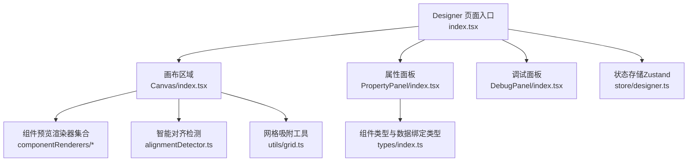
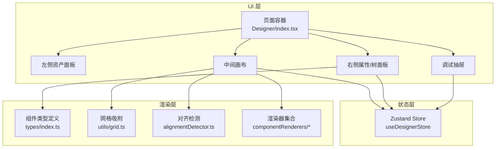
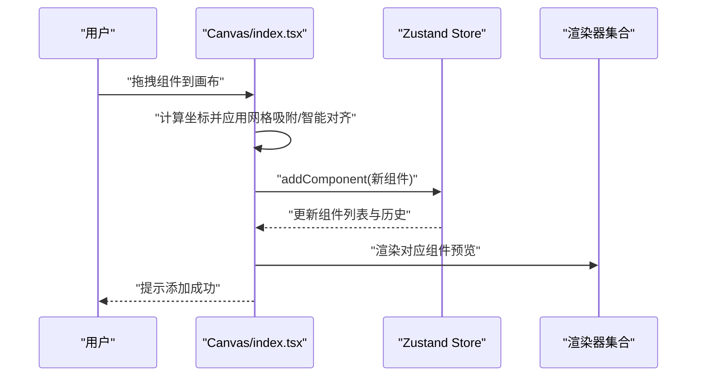
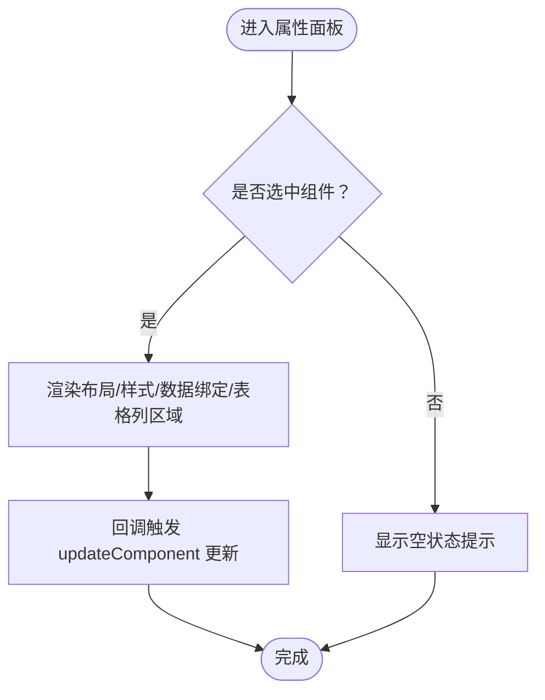
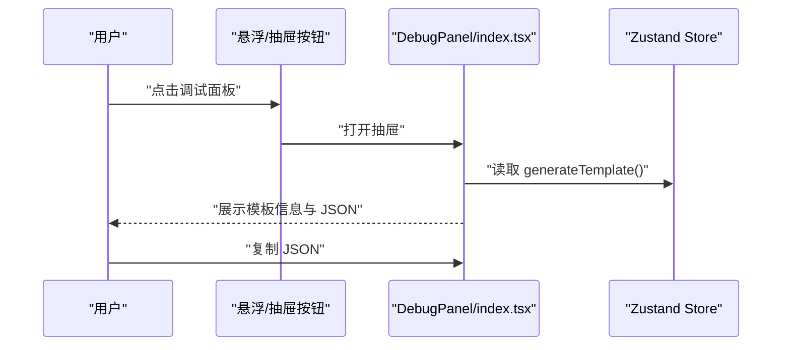
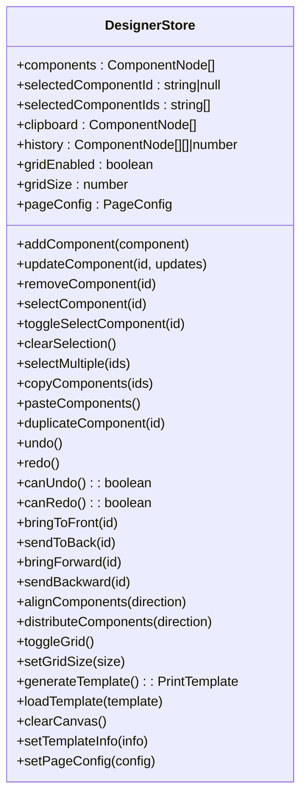
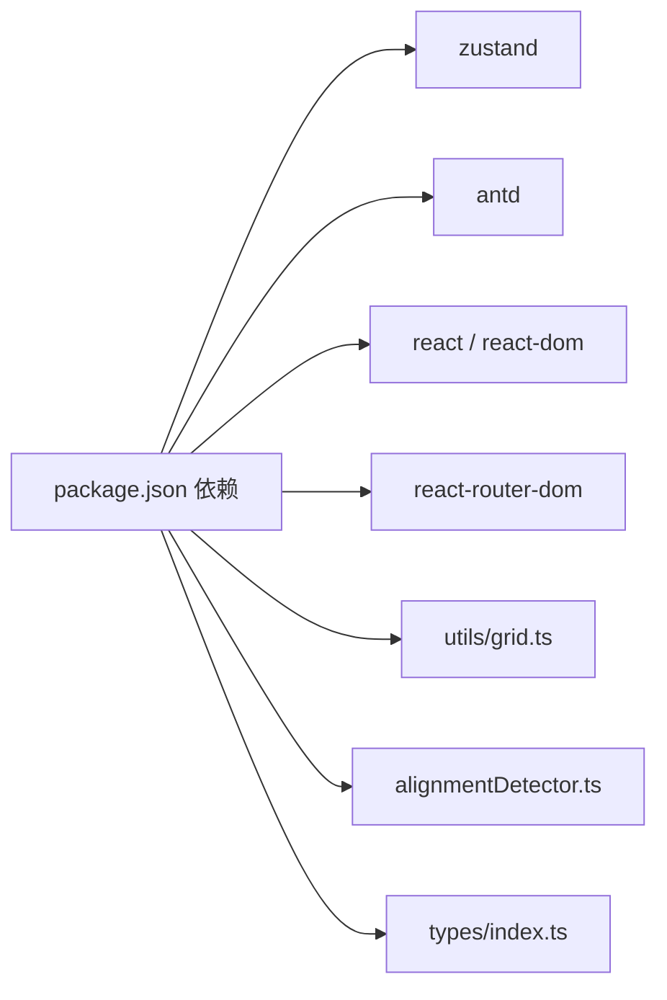

# 设计器运行时错误

<cite>
**本文引用的文件**
- [Designer 页面入口](file://designer/src/pages/Designer/index.tsx)
- [调试面板组件](file://designer/src/pages/Designer/components/DebugPanel/index.tsx)
- [设计器状态存储（Zustand）](file://designer/src/store/designer.ts)
- [画布区域与交互](file://designer/src/pages/Designer/components/Canvas/index.tsx)
- [属性面板主组件](file://designer/src/pages/Designer/components/PropertyPanel/index.tsx)
- [组件类型与数据绑定类型](file://designer/src/types/index.ts)
- [网格吸附工具](file://designer/src/utils/grid.ts)
- [智能对齐检测工具](file://designer/src/pages/Designer/components/Canvas/alignmentDetector.ts)
- [文本组件预览渲染器](file://designer/src/pages/Designer/components/Canvas/componentRenderers/TextPreview.tsx)
- [表格组件预览渲染器](file://designer/src/pages/Designer/components/Canvas/componentRenderers/TablePreview.tsx)
- [设计器依赖清单](file://designer/package.json)
</cite>

## 目录
1. [简介](#简介)
2. [项目结构](#项目结构)
3. [核心组件](#核心组件)
4. [架构总览](#架构总览)
5. [详细组件分析](#详细组件分析)
6. [依赖分析](#依赖分析)
7. [性能考虑](#性能考虑)
8. [故障排除指南](#故障排除指南)
9. [结论](#结论)
10. [附录](#附录)

## 简介
本指南聚焦于设计器运行时错误的诊断与修复，覆盖组件渲染异常、数据绑定错误、状态管理问题与用户交互异常四大类。文档提供调试面板使用方法、组件树与属性面板查看要点、画布操作日志定位思路，并给出常见问题场景（组件拖拽失效、属性修改不生效、数据绑定断开）的排查步骤与修复建议。同时包含浏览器开发者工具（React DevTools、消息提示与控制台）的实用技巧。

## 项目结构
设计器采用模块化组织，核心由“页面容器 + 画布 + 属性面板 + 调试面板 + 状态存储”构成。页面容器负责布局与抽屉式调试面板；画布承载组件拖拽、缩放、对齐、层级与快捷键；属性面板联动更新当前选中组件；状态存储集中管理组件集合、选中态、历史撤销/重做、页面配置与网格吸附等。

**图表来源**
- [Designer 页面入口:1-279](file://designer/src/pages/Designer/index.tsx#L1-L279)
- [画布区域与交互:1-1006](file://designer/src/pages/Designer/components/Canvas/index.tsx#L1-L1006)
- [属性面板主组件:1-129](file://designer/src/pages/Designer/components/PropertyPanel/index.tsx#L1-L129)
- [调试面板组件:1-74](file://designer/src/pages/Designer/components/DebugPanel/index.tsx#L1-L74)
- [组件类型与数据绑定类型:1-160](file://designer/src/types/index.ts#L1-L160)
- [网格吸附工具:1-36](file://designer/src/utils/grid.ts#L1-L36)
- [智能对齐检测工具:1-158](file://designer/src/pages/Designer/components/Canvas/alignmentDetector.ts#L1-L158)

**章节来源**
- [Designer 页面入口:1-279](file://designer/src/pages/Designer/index.tsx#L1-L279)
- [设计器状态存储（Zustand）:1-539](file://designer/src/store/designer.ts#L1-L539)

## 核心组件
- 页面容器与布局：左侧资产面板、中间画布、右侧组件树/属性面板，支持左右面板折叠与悬浮调试按钮。
- 画布区域：拖拽添加组件、拖拽移动、拖拽缩放、智能对齐、网格吸附、快捷键（删除、复制、粘贴、撤销/重做、克隆）、右键菜单、页面设置与快速打印。
- 属性面板：布局、样式、数据绑定、表格列管理等分区块更新当前选中组件。
- 调试面板：以抽屉形式展示模板名称、Schema ID、组件数量与完整模板 JSON，支持复制 JSON。

**章节来源**
- [Designer 页面入口:17-276](file://designer/src/pages/Designer/index.tsx#L17-L276)
- [画布区域与交互:20-792](file://designer/src/pages/Designer/components/Canvas/index.tsx#L20-L792)
- [属性面板主组件:16-126](file://designer/src/pages/Designer/components/PropertyPanel/index.tsx#L16-L126)
- [调试面板组件:9-71](file://designer/src/pages/Designer/components/DebugPanel/index.tsx#L9-L71)

## 架构总览
设计器采用“页面容器 + 画布 + 属性面板 + 调试面板 + Zustand 状态”的分层架构。状态通过 store/designer.ts 集中管理，画布与属性面板通过 hooks 订阅状态变化，调试面板直接读取 store 生成模板 JSON 用于对比与复制。

**图表来源**
- [Designer 页面入口:1-279](file://designer/src/pages/Designer/index.tsx#L1-L279)
- [设计器状态存储（Zustand）:85-539](file://designer/src/store/designer.ts#L85-L539)
- [组件类型与数据绑定类型:123-160](file://designer/src/types/index.ts#L123-L160)
- [网格吸附工具:12-15](file://designer/src/utils/grid.ts#L12-L15)
- [智能对齐检测工具:24-157](file://designer/src/pages/Designer/components/Canvas/alignmentDetector.ts#L24-L157)
- [文本组件预览渲染器:10-30](file://designer/src/pages/Designer/components/Canvas/componentRenderers/TextPreview.tsx#L10-L30)
- [表格组件预览渲染器:10-55](file://designer/src/pages/Designer/components/Canvas/componentRenderers/TablePreview.tsx#L10-L55)

## 详细组件分析

### 画布区域与交互（Canvas）
- 组件拖拽与放置：监听拖放事件，计算画布坐标，应用网格吸附与智能对齐，区分组件库拖拽与数据资产拖拽，分别生成默认布局与绑定。
- 移动与缩放：记录起始布局，计算偏移并限制在页面范围内，支持多选同步移动。
- 快捷键：Delete/Backspace 删除、Ctrl+V/Cmd+V 粘贴、Ctrl+Z/Cmd+Z 撤销、Ctrl+Shift+Z/Cmd+Shift+Z 重做、Ctrl+D/Cmd+D 克隆。
- 右键菜单：复制、克隆、层级置顶/上移/下移/置底、删除。
- 页面设置：支持 A4/A5/CUSTOM/CONTINUOUS 四种尺寸与横竖向、页边距、连续纸最小高度、页码配置。
- 预览与保存：快速打印打开预览弹窗，另提供保存模板弹窗。

**图表来源**
- [画布区域与交互:195-378](file://designer/src/pages/Designer/components/Canvas/index.tsx#L195-L378)
- [设计器状态存储（Zustand）:87-91](file://designer/src/store/designer.ts#L87-L91)
- [文本组件预览渲染器:10-30](file://designer/src/pages/Designer/components/Canvas/componentRenderers/TextPreview.tsx#L10-L30)
- [表格组件预览渲染器:10-55](file://designer/src/pages/Designer/components/Canvas/componentRenderers/TablePreview.tsx#L10-L55)

**章节来源**
- [画布区域与交互:20-792](file://designer/src/pages/Designer/components/Canvas/index.tsx#L20-L792)

### 属性面板（PropertyPanel）
- 选中组件为空时提示“请在画布中选择一个组件”，避免误操作。
- 提供布局、样式、数据绑定、表格列管理四个区域，每个区域通过回调调用 store.updateComponent 更新当前组件。
- 组件类型名称映射便于识别。

**图表来源**
- [属性面板主组件:16-126](file://designer/src/pages/Designer/components/PropertyPanel/index.tsx#L16-L126)
- [设计器状态存储（Zustand）:93-99](file://designer/src/store/designer.ts#L93-L99)

**章节来源**
- [属性面板主组件:16-126](file://designer/src/pages/Designer/components/PropertyPanel/index.tsx#L16-L126)

### 调试面板（DebugPanel）
- 抽屉式展示模板名称、Schema ID、组件数量与完整模板 JSON，支持复制 JSON。
- 与页面容器中的调试按钮一致，均可打开同一调试抽屉。

**图表来源**
- [调试面板组件:9-71](file://designer/src/pages/Designer/components/DebugPanel/index.tsx#L9-L71)
- [Designer 页面入口:234-276](file://designer/src/pages/Designer/index.tsx#L234-L276)
- [设计器状态存储（Zustand）:138-148](file://designer/src/store/designer.ts#L138-L148)

**章节来源**
- [调试面板组件:9-71](file://designer/src/pages/Designer/components/DebugPanel/index.tsx#L9-L71)
- [Designer 页面入口:234-276](file://designer/src/pages/Designer/index.tsx#L234-L276)

### 状态存储（Zustand）
- 组件增删改、选中与多选、复制/粘贴/克隆、撤销/重做、层级管理、网格与对齐工具、页面配置等均在 store 中实现。
- 通过 saveHistory 保存最多 20 步历史，支持 canUndo/canRedo 查询。

**图表来源**
- [设计器状态存储（Zustand）:8-71](file://designer/src/store/designer.ts#L8-L71)
- [设计器状态存储（Zustand）:85-539](file://designer/src/store/designer.ts#L85-L539)

**章节来源**
- [设计器状态存储（Zustand）:85-539](file://designer/src/store/designer.ts#L85-L539)

## 依赖分析
- 状态管理：Zustand 提供轻量状态容器，集中管理组件树、选中态、历史、页面配置等。
- UI 组件库：Ant Design 提供布局、抽屉、标签页、按钮、表单、模态框等。
- 工具函数：网格吸附与智能对齐独立为工具模块，降低耦合。
- 渲染器：按组件类型拆分预览渲染器，便于扩展与维护。

**图表来源**
- [设计器依赖清单:12-28](file://designer/package.json#L12-L28)
- [网格吸附工具:1-36](file://designer/src/utils/grid.ts#L1-L36)
- [智能对齐检测工具:1-158](file://designer/src/pages/Designer/components/Canvas/alignmentDetector.ts#L1-L158)
- [组件类型与数据绑定类型:1-160](file://designer/src/types/index.ts#L1-L160)

**章节来源**
- [设计器依赖清单:12-28](file://designer/package.json#L12-L28)

## 性能考虑
- 状态粒度：store 将组件列表、选中态、历史、页面配置等聚合管理，避免频繁重渲染。
- 渲染器：按组件类型拆分，仅在组件 props/style/binding 变更时触发对应渲染器更新。
- 事件监听：拖拽移动与释放在拖拽期间挂载，结束后及时解绑，避免内存泄漏。
- 网格与对齐：吸附与对齐计算在移动过程中进行，注意阈值与去重，避免过多 DOM 更新。

[本节为通用指导，无需特定文件引用]

## 故障排除指南

### 一、组件渲染异常
- 症状
  - 预览空白或显示“暂无数据”
  - 文本组件不显示内容
- 排查步骤
  - 在调试面板中确认模板 JSON 的 components 数量与结构是否正确。
  - 在属性面板中检查当前选中组件的 props、style、binding 是否存在且格式正确。
  - 若为表格组件，确认 columns 是否存在且 visibleColumns 非空；若为文本组件，确认 props.label/props.text 或 binding.path 是否有值。
- 修复建议
  - 重新添加组件或修正 props/style/binding。
  - 使用“撤销/重做”回到上一步，或清空画布后重新导入模板。

**章节来源**
- [调试面板组件:9-71](file://designer/src/pages/Designer/components/DebugPanel/index.tsx#L9-L71)
- [属性面板主组件:16-126](file://designer/src/pages/Designer/components/PropertyPanel/index.tsx#L16-L126)
- [文本组件预览渲染器:10-30](file://designer/src/pages/Designer/components/Canvas/componentRenderers/TextPreview.tsx#L10-L30)
- [表格组件预览渲染器:10-55](file://designer/src/pages/Designer/components/Canvas/componentRenderers/TablePreview.tsx#L10-L55)

### 二、数据绑定错误
- 症状
  - 组件显示占位文本而非真实数据
  - 表格无数据或列不匹配
- 排查步骤
  - 在属性面板的数据绑定区检查 binding.path 是否存在，pipes 是否配置正确。
  - 在调试面板中核对模板 JSON 的 binding 字段是否包含 path/pipes/fallback。
  - 确认 Schema 字段类型与组件类型匹配（数组字段生成表格，普通字段生成文本）。
- 修复建议
  - 更正 binding.path 指向正确的字段路径。
  - 为数值/日期等字段配置合适的管道（pipes），必要时设置 fallback。

**章节来源**
- [属性面板主组件:64-74](file://designer/src/pages/Designer/components/PropertyPanel/index.tsx#L64-L74)
- [组件类型与数据绑定类型:71-75](file://designer/src/types/index.ts#L71-L75)
- [画布区域与交互:316-377](file://designer/src/pages/Designer/components/Canvas/index.tsx#L316-L377)

### 三、状态管理问题（撤销/重做、复制/粘贴、层级）
- 症状
  - 撤销/重做不可用或无效
  - 复制/粘贴后组件未出现
  - 层级调整后顺序不变
- 排查步骤
  - 在调试面板中查看组件数量与模板 JSON 是否随操作变化。
  - 使用 store 的 canUndo/canRedo 方法判断当前状态是否可回退/前进。
  - 检查复制/粘贴时 selectedComponentIds 是否包含目标 id。
- 修复建议
  - 确保每次组件增删改都通过 store.updateComponent/addComponent/removeComponent 触发历史保存。
  - 复制/粘贴时确保 clipboard 与 selectedComponentIds 正确更新。
  - 层级操作需保证索引有效且历史已保存。

**章节来源**
- [设计器状态存储（Zustand）:297-331](file://designer/src/store/designer.ts#L297-L331)
- [设计器状态存储（Zustand）:173-229](file://designer/src/store/designer.ts#L173-L229)
- [设计器状态存储（Zustand）:237-295](file://designer/src/store/designer.ts#L237-L295)

### 四、用户交互异常（拖拽、缩放、对齐、网格）
- 症状
  - 组件拖拽失效或无法移动
  - 拖拽后组件越界或卡住
  - 网格吸附/智能对齐不生效
- 排查步骤
  - 检查是否在输入框、文本域等可编辑元素中触发快捷键导致事件被拦截。
  - 确认 pageConfig.size/size/widthMm/heightMm/orientation/marginMm 设置是否合理。
  - 在拖拽过程中观察 alignmentLines 是否出现，snapX/snapY 是否被设置。
- 修复建议
  - 按住 Shift 可临时禁用网格吸附，验证是否为吸附导致的异常。
  - 调整页面尺寸与边距，确保组件在可用区域内。
  - 多选拖拽时，确认 selectedComponentIds 包含目标 id 并正确更新各组件布局。

**章节来源**
- [画布区域与交互:112-161](file://designer/src/pages/Designer/components/Canvas/index.tsx#L112-L161)
- [画布区域与交互:163-193](file://designer/src/pages/Designer/components/Canvas/index.tsx#L163-L193)
- [画布区域与交互:434-562](file://designer/src/pages/Designer/components/Canvas/index.tsx#L434-L562)
- [智能对齐检测工具:24-157](file://designer/src/pages/Designer/components/Canvas/alignmentDetector.ts#L24-L157)
- [网格吸附工具:12-15](file://designer/src/utils/grid.ts#L12-L15)

### 五、调试面板使用方法
- 如何查看组件树状态
  - 在右侧“组件树”标签页查看组件层级与数量。
  - 在调试抽屉中查看模板 JSON 的 components 字段，核对 id/type/layout/style/props/binding。
- 如何查看属性面板配置
  - 在右侧“属性配置”标签页查看当前选中组件的布局、样式、数据绑定与表格列。
- 如何查看画布操作日志
  - 通过调试抽屉复制 JSON，结合操作时间点比对前后差异。
  - 使用浏览器控制台查看 store 历史与组件更新日志（如需增强可在 store 中增加日志输出）。

**章节来源**
- [Designer 页面入口:204-231](file://designer/src/pages/Designer/index.tsx#L204-L231)
- [调试面板组件:9-71](file://designer/src/pages/Designer/components/DebugPanel/index.tsx#L9-L71)

### 六、浏览器开发者工具使用技巧
- React DevTools
  - 定位组件树与渲染次数，检查属性面板与画布子组件是否按预期更新。
- 控制台与消息提示
  - 关注控制台错误与警告，留意 message.success/error 的提示信息，辅助定位问题来源。
- 状态检查
  - 在 Redux DevTools（如集成）中查看 store 变更轨迹，确认历史步数与当前状态一致。

[本节为通用指导，无需特定文件引用]

## 结论
通过调试面板与状态存储的配合，大多数设计器运行时错误可以快速定位与修复。建议在日常使用中：
- 优先使用调试面板核对模板 JSON 与组件数量
- 在属性面板逐项校验 props/style/binding
- 利用撤销/重做与历史记录回溯问题引入点
- 结合网格吸附与智能对齐工具优化交互体验

[本节为总结性内容，无需特定文件引用]

## 附录

### 常见错误场景与修复步骤（示例路径）
- 组件拖拽失效
  - 检查事件拦截与可编辑元素焦点
  - 参考路径：[画布区域与交互:112-161](file://designer/src/pages/Designer/components/Canvas/index.tsx#L112-L161)
- 属性修改不生效
  - 确认属性面板回调是否调用 updateComponent
  - 参考路径：[属性面板主组件:34-74](file://designer/src/pages/Designer/components/PropertyPanel/index.tsx#L34-L74)
- 数据绑定断开
  - 校验 binding.path/pipes/fallback 与模板 JSON
  - 参考路径：[组件类型与数据绑定类型:71-75](file://designer/src/types/index.ts#L71-L75)
- 撤销/重做异常
  - 检查 canUndo/canRedo 与历史保存
  - 参考路径：[设计器状态存储（Zustand）:297-331](file://designer/src/store/designer.ts#L297-L331)