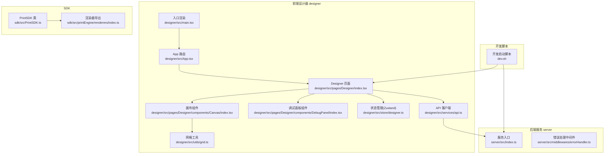
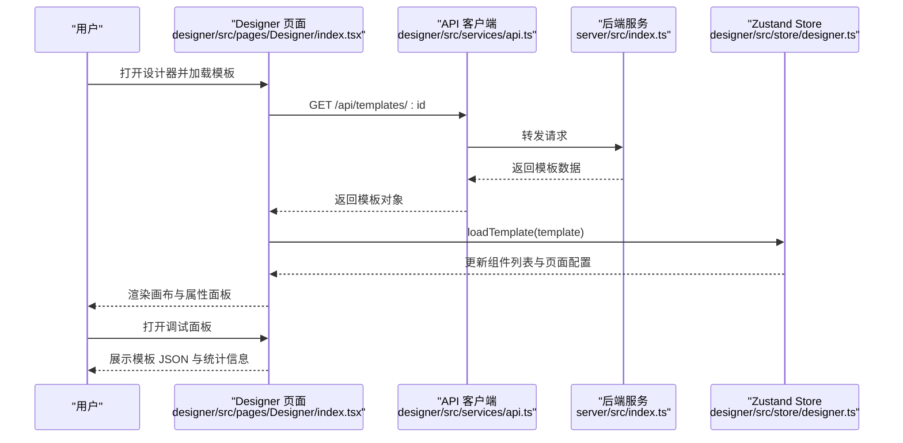
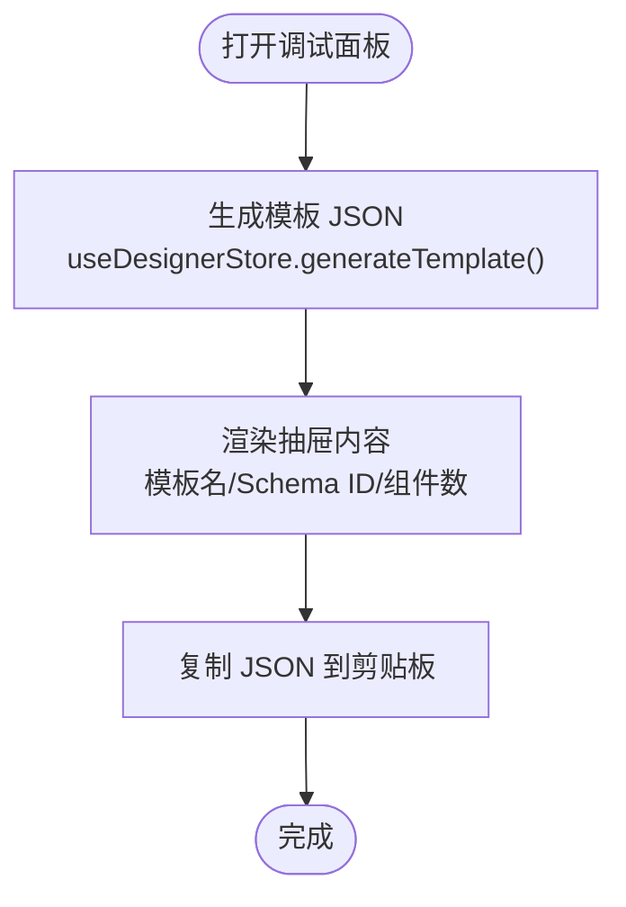
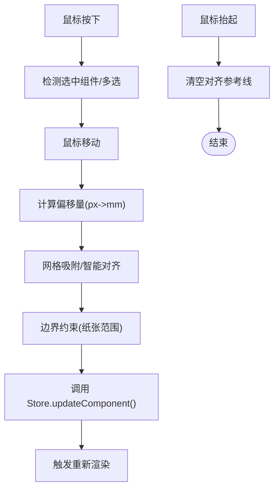
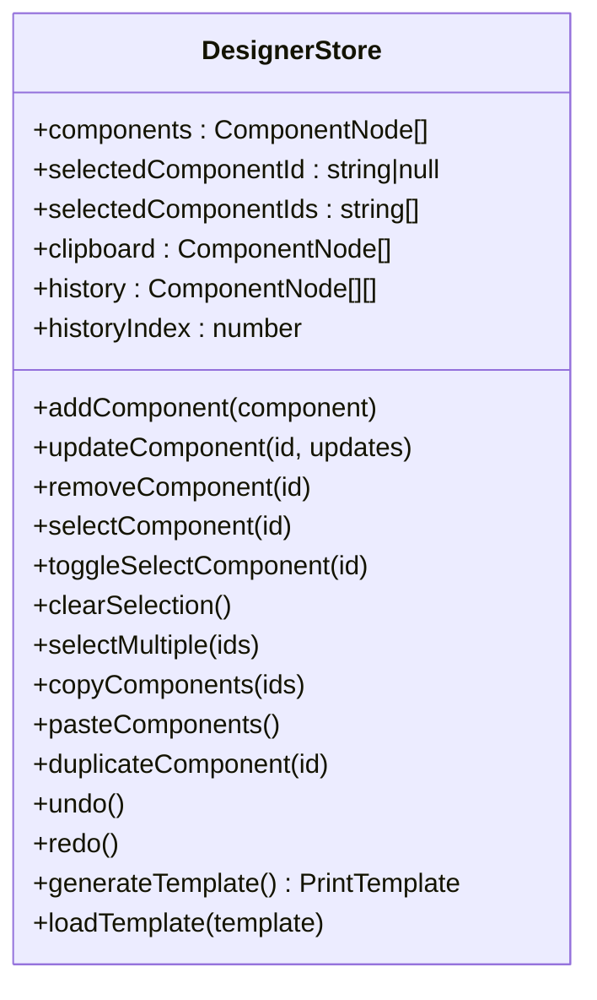
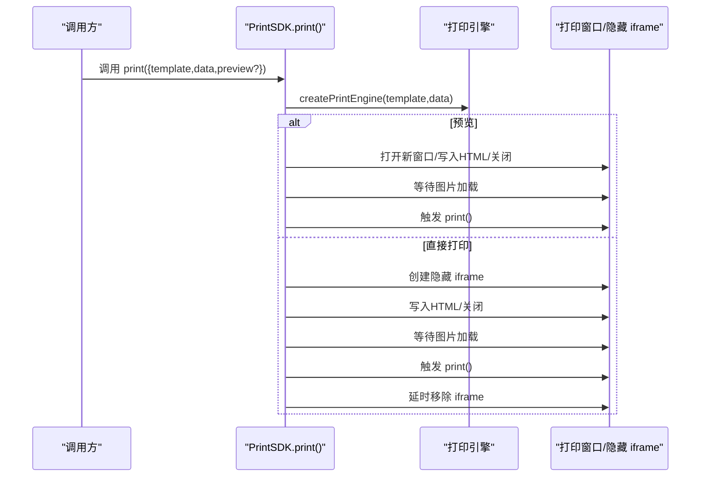
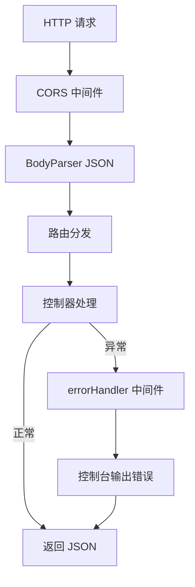
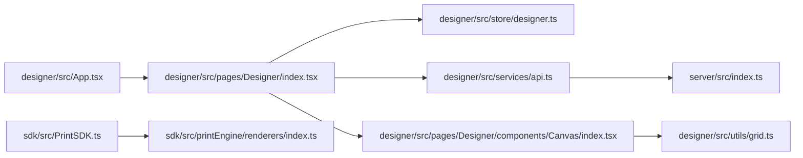

# 调试技巧与工具

<cite>
**本文引用的文件**   
- [designer/src/App.tsx](file://designer/src/App.tsx)
- [designer/src/main.tsx](file://designer/src/main.tsx)
- [designer/src/store/designer.ts](file://designer/src/store/designer.ts)
- [designer/src/pages/Designer/index.tsx](file://designer/src/pages/Designer/index.tsx)
- [designer/src/pages/Designer/components/Canvas/index.tsx](file://designer/src/pages/Designer/components/Canvas/index.tsx)
- [designer/src/pages/Designer/components/DebugPanel/index.tsx](file://designer/src/pages/Designer/components/DebugPanel/index.tsx)
- [designer/src/services/api.ts](file://designer/src/services/api.ts)
- [designer/src/utils/grid.ts](file://designer/src/utils/grid.ts)
- [sdk/src/PrintSDK.ts](file://sdk/src/PrintSDK.ts)
- [sdk/src/printEngine/renderers/index.ts](file://sdk/src/printEngine/renderers/index.ts)
- [server/src/index.ts](file://server/src/index.ts)
- [server/src/middlewares/errorHandler.ts](file://server/src/middlewares/errorHandler.ts)
- [dev.sh](file://dev.sh)
</cite>

## 目录
1. [简介](#简介)
2. [项目结构](#项目结构)
3. [核心组件](#核心组件)
4. [架构总览](#架构总览)
5. [详细组件分析](#详细组件分析)
6. [依赖关系分析](#依赖关系分析)
7. [性能考虑](#性能考虑)
8. [故障排查指南](#故障排查指南)
9. [结论](#结论)
10. [附录](#附录)

## 简介
本指南面向打印平台的前端、后端与SDK开发者，系统性介绍如何使用浏览器开发者工具、React DevTools、Node.js 调试器以及SDK内部机制进行高效调试。内容覆盖：
- 浏览器端：组件状态、属性变更、渲染过程、网络请求与错误日志分析
- 后端：Express 服务端口监听、中间件错误处理与日志定位
- SDK：打印流程、HTML 生成、图片资源等待、批量打印与进度回调
- 断点调试：前端组件、后端路由与SDK核心逻辑
- 性能分析：Chrome 性能面板、内存泄漏检测与渲染性能监控
- 具体场景与最佳实践：常见问题定位与修复建议

## 项目结构
该仓库采用多包结构：
- designer：基于 React + Ant Design 的可视化设计器，负责模板设计与调试面板
- sdk：打印 SDK，负责模板渲染与打印输出
- server：基于 Express 的后端服务，提供模板、Schema、MockData 的 REST 接口
- dev.sh：一键启动前后端开发环境并输出日志

图表来源
- [designer/src/App.tsx:1-31](file://designer/src/App.tsx#L1-L31)
- [designer/src/main.tsx:1-8](file://designer/src/main.tsx#L1-L8)
- [designer/src/pages/Designer/index.tsx:1-279](file://designer/src/pages/Designer/index.tsx#L1-L279)
- [designer/src/pages/Designer/components/Canvas/index.tsx:1-800](file://designer/src/pages/Designer/components/Canvas/index.tsx#L1-L800)
- [designer/src/pages/Designer/components/DebugPanel/index.tsx:1-74](file://designer/src/pages/Designer/components/DebugPanel/index.tsx#L1-L74)
- [designer/src/store/designer.ts:1-539](file://designer/src/store/designer.ts#L1-L539)
- [designer/src/services/api.ts:1-97](file://designer/src/services/api.ts#L1-L97)
- [designer/src/utils/grid.ts:1-36](file://designer/src/utils/grid.ts#L1-L36)
- [sdk/src/PrintSDK.ts:1-253](file://sdk/src/PrintSDK.ts#L1-L253)
- [sdk/src/printEngine/renderers/index.ts:1-13](file://sdk/src/printEngine/renderers/index.ts#L1-L13)
- [server/src/index.ts:1-25](file://server/src/index.ts#L1-L25)
- [server/src/middlewares/errorHandler.ts:1-10](file://server/src/middlewares/errorHandler.ts#L1-L10)
- [dev.sh:1-102](file://dev.sh#L1-L102)

章节来源
- [designer/src/App.tsx:1-31](file://designer/src/App.tsx#L1-L31)
- [designer/src/main.tsx:1-8](file://designer/src/main.tsx#L1-L8)
- [server/src/index.ts:1-25](file://server/src/index.ts#L1-L25)
- [dev.sh:1-102](file://dev.sh#L1-L102)

## 核心组件
- 路由与入口
  - App 路由定义了设计器与管理页的路径映射；入口通过 ReactDOM 渲染根组件。
- 状态管理（Zustand）
  - 设计器 Store 提供组件增删改、选择、撤销/重做、复制/粘贴、网格与对齐、层级管理等能力，并内置最多 N 步历史记录。
- 设计器页面
  - 包含左侧素材面板、中心画布、右侧属性/树面板，以及“调试面板”抽屉，用于查看模板 JSON 与基本信息。
- 画布组件
  - 实现拖拽、缩放、网格吸附、智能对齐、快捷键、右键菜单、页面设置、快速打印等功能。
- API 客户端
  - 基于 axios，统一前缀为 http://localhost:3000/api，封装 Schema、Template、MockData 的 CRUD。
- SDK 打印
  - PrintSDK 提供打印、预览、直接打印、批量打印、HTML 生成与进度回调；内部使用打印引擎生成 HTML 并等待图片资源加载。
- 后端服务
  - Express 应用开启 CORS 与 JSON 解析，挂载路由并统一错误处理中间件。

章节来源
- [designer/src/App.tsx:1-31](file://designer/src/App.tsx#L1-L31)
- [designer/src/main.tsx:1-8](file://designer/src/main.tsx#L1-L8)
- [designer/src/store/designer.ts:1-539](file://designer/src/store/designer.ts#L1-L539)
- [designer/src/pages/Designer/index.tsx:1-279](file://designer/src/pages/Designer/index.tsx#L1-L279)
- [designer/src/pages/Designer/components/Canvas/index.tsx:1-800](file://designer/src/pages/Designer/components/Canvas/index.tsx#L1-L800)
- [designer/src/services/api.ts:1-97](file://designer/src/services/api.ts#L1-L97)
- [sdk/src/PrintSDK.ts:1-253](file://sdk/src/PrintSDK.ts#L1-L253)
- [server/src/index.ts:1-25](file://server/src/index.ts#L1-L25)

## 架构总览
下面以序列图展示典型交互链路：设计器发起模板加载请求 → 后端返回数据 → Store 更新状态 → 画布渲染组件 → 调试面板展示模板 JSON。

图表来源
- [designer/src/pages/Designer/index.tsx:26-46](file://designer/src/pages/Designer/index.tsx#L26-L46)
- [designer/src/services/api.ts:40-65](file://designer/src/services/api.ts#L40-L65)
- [server/src/index.ts:14-16](file://server/src/index.ts#L14-L16)
- [designer/src/store/designer.ts:150-159](file://designer/src/store/designer.ts#L150-L159)

## 详细组件分析

### 组件一：调试面板（Designer 页面）
- 功能要点
  - 打开抽屉式调试面板，展示模板名称、Schema ID、组件数量与完整模板 JSON
  - 支持复制模板 JSON 到剪贴板，便于分享与对比
- 调试价值
  - 快速核对模板结构与数据一致性
  - 结合浏览器控制台与 Redux DevTools（见后文）进行联动验证
- 关键实现位置
  - 抽屉触发与状态管理：[designer/src/pages/Designer/index.tsx:164-176](file://designer/src/pages/Designer/index.tsx#L164-L176)
  - 模板 JSON 生成与复制：[designer/src/pages/Designer/index.tsx:247-273](file://designer/src/pages/Designer/index.tsx#L247-L273)
  - Store 生成模板：[designer/src/store/designer.ts:138-148](file://designer/src/store/designer.ts#L138-L148)

图表来源
- [designer/src/pages/Designer/index.tsx:247-273](file://designer/src/pages/Designer/index.tsx#L247-L273)
- [designer/src/store/designer.ts:138-148](file://designer/src/store/designer.ts#L138-L148)

章节来源
- [designer/src/pages/Designer/index.tsx:164-176](file://designer/src/pages/Designer/index.tsx#L164-L176)
- [designer/src/pages/Designer/index.tsx:247-273](file://designer/src/pages/Designer/index.tsx#L247-L273)
- [designer/src/store/designer.ts:138-148](file://designer/src/store/designer.ts#L138-L148)

### 组件二：画布与拖拽/对齐/网格
- 功能要点
  - 支持组件拖拽、缩放、网格吸附、智能对齐、快捷键（删除、复制、粘贴、撤销/重做、克隆）、右键菜单、页面设置、快速打印
  - 网格吸附与智能对齐通过工具函数与对齐检测器实现
- 调试价值
  - 通过浏览器开发者工具观察 DOM 变化与事件流，结合断点定位拖拽/对齐异常
  - 在画布容器上设置条件断点，检查组件布局更新
- 关键实现位置
  - 拖拽与吸附：[designer/src/pages/Designer/components/Canvas/index.tsx:434-562](file://designer/src/pages/Designer/components/Canvas/index.tsx#L434-L562)
  - 网格吸附工具：[designer/src/utils/grid.ts:12-15](file://designer/src/utils/grid.ts#L12-L15)
  - 智能对齐检测：[designer/src/pages/Designer/components/Canvas/index.tsx:480](file://designer/src/pages/Designer/components/Canvas/index.tsx#L480)

图表来源
- [designer/src/pages/Designer/components/Canvas/index.tsx:434-562](file://designer/src/pages/Designer/components/Canvas/index.tsx#L434-L562)
- [designer/src/utils/grid.ts:12-15](file://designer/src/utils/grid.ts#L12-L15)

章节来源
- [designer/src/pages/Designer/components/Canvas/index.tsx:434-562](file://designer/src/pages/Designer/components/Canvas/index.tsx#L434-L562)
- [designer/src/utils/grid.ts:12-15](file://designer/src/utils/grid.ts#L12-L15)

### 组件三：Zustand 设计器 Store
- 功能要点
  - 组件增删改、选择/多选、复制/粘贴/克隆、撤销/重做（最多 N 步历史）、网格与对齐、层级管理、页面配置、模板生成/加载
  - 历史记录保存策略：每次操作后截取当前组件数组快照，超过上限丢弃最早记录
- 调试价值
  - 使用 React DevTools 的“上下文/状态”面板观察 Store 变化
  - 在 action 中设置断点，验证历史回退/前进是否正确
- 关键实现位置
  - Store 定义与动作：[designer/src/store/designer.ts:85-539](file://designer/src/store/designer.ts#L85-L539)
  - 历史保存与回退：[designer/src/store/designer.ts:73-83](file://designer/src/store/designer.ts#L73-L83), [designer/src/store/designer.ts:300-331](file://designer/src/store/designer.ts#L300-L331)

图表来源
- [designer/src/store/designer.ts:8-71](file://designer/src/store/designer.ts#L8-L71)
- [designer/src/store/designer.ts:85-539](file://designer/src/store/designer.ts#L85-L539)

章节来源
- [designer/src/store/designer.ts:85-539](file://designer/src/store/designer.ts#L85-L539)

### 组件四：SDK 打印流程
- 功能要点
  - print/printDirect/printWithPreview/generateHTML/printMultiple
  - 预览与直接打印均会等待图片资源加载后再触发打印
  - 批量打印支持进度回调，包含 total/completed/failed/currentIndex
- 调试价值
  - 在 SDK 方法内设置断点，观察模板与数据组合是否正确
  - 使用浏览器开发者工具的“性能”面板测量 HTML 生成与打印耗时
- 关键实现位置
  - 打印主流程与预览/直接分支：[sdk/src/PrintSDK.ts:53-97](file://sdk/src/PrintSDK.ts#L53-L97)
  - 批量打印与进度回调：[sdk/src/PrintSDK.ts:135-243](file://sdk/src/PrintSDK.ts#L135-L243)

图表来源
- [sdk/src/PrintSDK.ts:53-97](file://sdk/src/PrintSDK.ts#L53-L97)
- [sdk/src/PrintSDK.ts:135-243](file://sdk/src/PrintSDK.ts#L135-L243)

章节来源
- [sdk/src/PrintSDK.ts:53-97](file://sdk/src/PrintSDK.ts#L53-L97)
- [sdk/src/PrintSDK.ts:135-243](file://sdk/src/PrintSDK.ts#L135-L243)

### 组件五：后端服务与错误处理
- 功能要点
  - 路由挂载：/api/schemas、/api/templates、/api/mock-data
  - 中间件：CORS、JSON 解析、统一错误处理
- 调试价值
  - 使用浏览器开发者工具的“网络”面板检查接口状态码与响应体
  - 在 errorHandler 中设置断点，捕获未处理异常并查看堆栈
- 关键实现位置
  - 服务启动与路由挂载：[server/src/index.ts:9-24](file://server/src/index.ts#L9-L24)
  - 错误处理中间件：[server/src/middlewares/errorHandler.ts:3-9](file://server/src/middlewares/errorHandler.ts#L3-L9)

图表来源
- [server/src/index.ts:9-24](file://server/src/index.ts#L9-L24)
- [server/src/middlewares/errorHandler.ts:3-9](file://server/src/middlewares/errorHandler.ts#L3-L9)

章节来源
- [server/src/index.ts:9-24](file://server/src/index.ts#L9-L24)
- [server/src/middlewares/errorHandler.ts:3-9](file://server/src/middlewares/errorHandler.ts#L3-L9)

## 依赖关系分析
- 前端依赖
  - React 路由与渲染：App → Designer 页面 → 画布/调试面板 → Store
  - 网络层：API 客户端 → 后端服务
  - 工具层：网格工具辅助画布布局
- 后端依赖
  - Express、CORS、BodyParser、路由模块、错误处理中间件
- SDK 依赖
  - 打印引擎与渲染器导出

图表来源
- [designer/src/App.tsx:1-31](file://designer/src/App.tsx#L1-L31)
- [designer/src/pages/Designer/index.tsx:1-279](file://designer/src/pages/Designer/index.tsx#L1-L279)
- [designer/src/store/designer.ts:1-539](file://designer/src/store/designer.ts#L1-L539)
- [designer/src/services/api.ts:1-97](file://designer/src/services/api.ts#L1-L97)
- [designer/src/pages/Designer/components/Canvas/index.tsx:1-800](file://designer/src/pages/Designer/components/Canvas/index.tsx#L1-L800)
- [designer/src/utils/grid.ts:1-36](file://designer/src/utils/grid.ts#L1-L36)
- [sdk/src/PrintSDK.ts:1-253](file://sdk/src/PrintSDK.ts#L1-L253)
- [sdk/src/printEngine/renderers/index.ts:1-13](file://sdk/src/printEngine/renderers/index.ts#L1-L13)
- [server/src/index.ts:1-25](file://server/src/index.ts#L1-L25)

章节来源
- [designer/src/App.tsx:1-31](file://designer/src/App.tsx#L1-L31)
- [designer/src/pages/Designer/index.tsx:1-279](file://designer/src/pages/Designer/index.tsx#L1-L279)
- [designer/src/store/designer.ts:1-539](file://designer/src/store/designer.ts#L1-L539)
- [designer/src/services/api.ts:1-97](file://designer/src/services/api.ts#L1-L97)
- [designer/src/pages/Designer/components/Canvas/index.tsx:1-800](file://designer/src/pages/Designer/components/Canvas/index.tsx#L1-L800)
- [designer/src/utils/grid.ts:1-36](file://designer/src/utils/grid.ts#L1-L36)
- [sdk/src/PrintSDK.ts:1-253](file://sdk/src/PrintSDK.ts#L1-L253)
- [sdk/src/printEngine/renderers/index.ts:1-13](file://sdk/src/printEngine/renderers/index.ts#L1-L13)
- [server/src/index.ts:1-25](file://server/src/index.ts#L1-L25)

## 性能考虑
- Chrome 性能面板
  - 录制长操作（拖拽、对齐、批量打印）观察主线程占用与帧率
  - 关注 Store 更新频率与渲染次数，避免不必要的重渲染
- 内存泄漏检测
  - 使用“内存”面板录制快照，对比操作前后对象存活情况
  - 特别关注画布组件实例、事件监听器与定时器是否正确清理
- 渲染性能监控
  - 画布拖拽时尽量减少每次 updateComponent 的粒度，合并布局更新
  - 图片资源较多时，优先使用懒加载与占位策略，降低首屏阻塞
- 网络性能
  - API 请求并发控制，避免频繁重复请求
  - 后端接口增加缓存与限流策略，防止抖动

## 故障排查指南

### 浏览器控制台与网络面板
- 控制台错误
  - 查看报错堆栈，定位到具体文件与行号
  - 常见：跨域、CORS、404/500、Promise 未捕获异常
- 网络面板
  - 检查请求路径、方法、状态码、请求头与响应体
  - 关注模板加载、Schema 查询、MockData 获取等关键接口
- 调试技巧
  - 在断点处查看变量作用域与调用栈
  - 使用“条件断点”过滤特定组件或特定状态变化

章节来源
- [designer/src/services/api.ts:4-11](file://designer/src/services/api.ts#L4-L11)
- [server/src/index.ts:11-18](file://server/src/index.ts#L11-L18)

### 后端错误日志与堆栈跟踪
- 错误处理中间件
  - 统一输出错误日志并返回标准错误响应
  - 在中间件断点处查看异常对象与上下文
- 日志定位
  - 使用开发脚本输出的日志文件定位异常发生时间点
  - 结合浏览器网络面板与后端日志交叉验证

章节来源
- [server/src/middlewares/errorHandler.ts:3-9](file://server/src/middlewares/errorHandler.ts#L3-L9)
- [dev.sh:46-82](file://dev.sh#L46-L82)

### 断点调试方法
- 前端组件调试
  - 在画布组件的拖拽/对齐逻辑中设置断点，观察布局更新
  - 在 Store 动作中设置断点，验证历史记录与撤销/重做行为
- 后端 API 调试
  - 在路由处理器与错误中间件设置断点，观察请求参数与响应构造
- SDK 核心逻辑调试
  - 在 PrintSDK 的 print/printMultiple/generateHTML 中设置断点，检查模板与数据组合、HTML 生成与图片等待流程

章节来源
- [designer/src/pages/Designer/components/Canvas/index.tsx:434-562](file://designer/src/pages/Designer/components/Canvas/index.tsx#L434-L562)
- [designer/src/store/designer.ts:85-539](file://designer/src/store/designer.ts#L85-L539)
- [server/src/index.ts:14-18](file://server/src/index.ts#L14-L18)
- [sdk/src/PrintSDK.ts:53-97](file://sdk/src/PrintSDK.ts#L53-L97)

### 具体调试场景与最佳实践
- 场景一：模板加载失败
  - 步骤：打开设计器 → 触发加载模板 → 查看控制台错误与网络面板状态码
  - 处理：检查 API 基础路径与后端路由是否匹配；在 errorHandler 中断点确认异常传播
- 场景二：画布组件无法拖拽或越界
  - 步骤：在画布组件断点处检查事件流与布局更新；查看网格吸附与边界约束逻辑
  - 处理：修正 snapToGrid 与边界计算；优化多选拖拽的批量更新
- 场景三：打印预览空白或图片未显示
  - 步骤：在 SDK 打印流程断点处检查 HTML 生成与图片等待逻辑
  - 处理：确保资源可访问、跨域允许；必要时延迟触发打印
- 场景四：批量打印进度不更新
  - 步骤：在批量打印循环中设置断点，检查进度回调触发与错误计数
  - 处理：修复异常捕获与进度上报逻辑

章节来源
- [designer/src/pages/Designer/index.tsx:34-46](file://designer/src/pages/Designer/index.tsx#L34-L46)
- [designer/src/pages/Designer/components/Canvas/index.tsx:434-562](file://designer/src/pages/Designer/components/Canvas/index.tsx#L434-L562)
- [sdk/src/PrintSDK.ts:135-243](file://sdk/src/PrintSDK.ts#L135-L243)

## 结论
通过结合浏览器开发者工具、React DevTools、Node.js 调试器与 SDK 内部机制，可以系统性地定位与解决打印平台在设计、渲染与打印环节的各类问题。建议在日常开发中：
- 建立标准化断点与日志规范
- 使用性能面板持续监控关键流程
- 在复杂交互（拖拽/对齐/批量打印）中分步断点验证
- 保持 API 与后端错误处理的一致性与可观测性

## 附录
- 开发环境一键启动
  - 使用脚本启动后端与前端服务，并输出日志文件，便于问题复现与定位
- 调试面板使用
  - 在设计器中打开调试抽屉，复制模板 JSON 以便对比与回归测试

章节来源
- [dev.sh:1-102](file://dev.sh#L1-L102)
- [designer/src/pages/Designer/components/DebugPanel/index.tsx:19-70](file://designer/src/pages/Designer/components/DebugPanel/index.tsx#L19-L70)