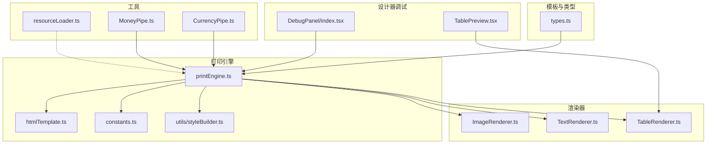
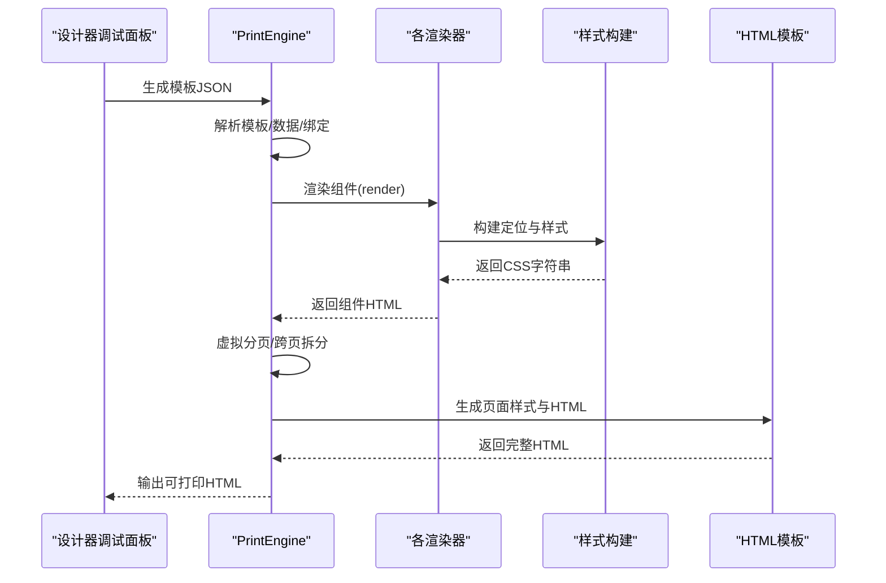
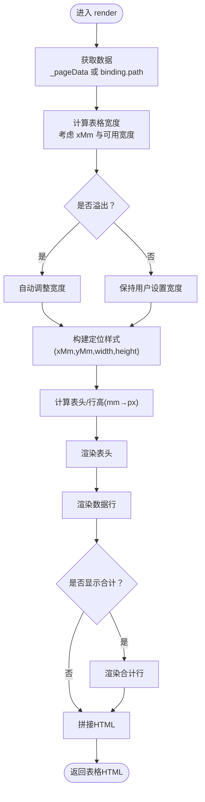
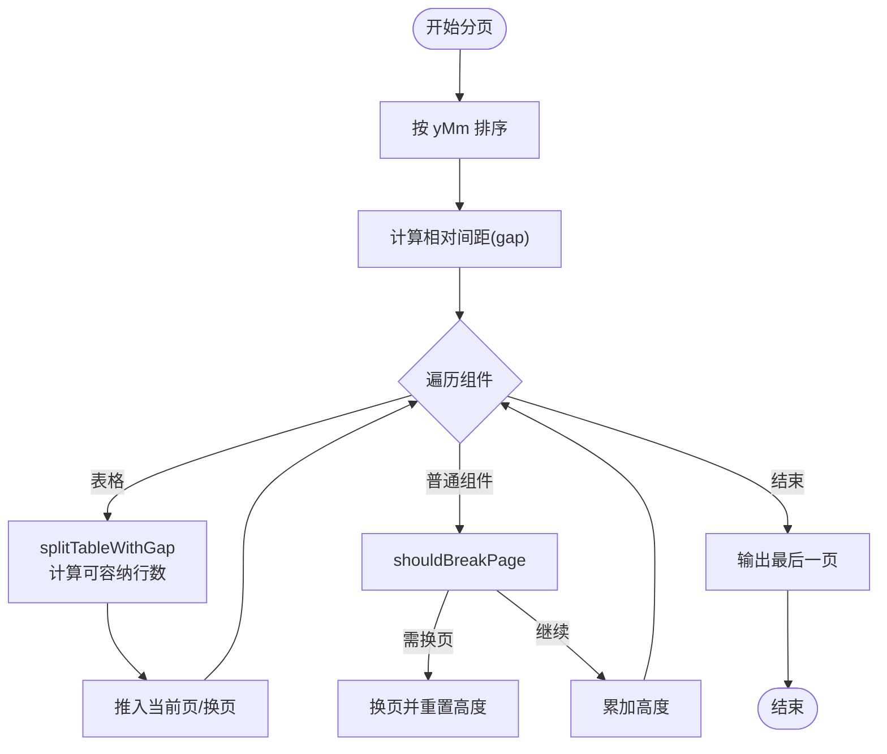
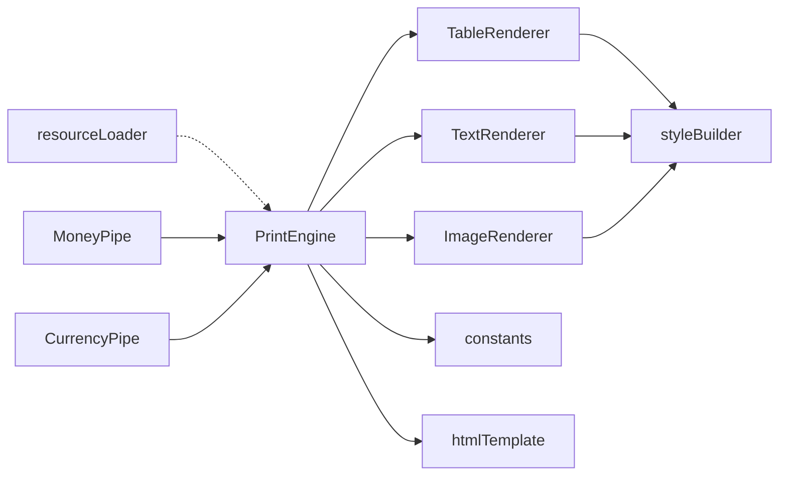

# 运行时错误

<cite>
**本文引用的文件**
- [TableRenderer.ts](file://sdk/src/printEngine/renderers/TableRenderer.ts)
- [TextRenderer.ts](file://sdk/src/printEngine/renderers/TextRenderer.ts)
- [ImageRenderer.ts](file://sdk/src/printEngine/renderers/ImageRenderer.ts)
- [resourceLoader.ts](file://sdk/src/utils/resourceLoader.ts)
- [styleBuilder.ts](file://sdk/src/printEngine/utils/styleBuilder.ts)
- [constants.ts](file://sdk/src/printEngine/constants.ts)
- [types.ts](file://sdk/src/types.ts)
- [printEngine.ts](file://sdk/src/printEngine.ts)
- [htmlTemplate.ts](file://sdk/src/printEngine/htmlTemplate.ts)
- [CurrencyPipe.ts](file://sdk/src/pipes/executors/CurrencyPipe.ts)
- [MoneyPipe.ts](file://sdk/src/pipes/executors/MoneyPipe.ts)
- [errorHandler.ts](file://server/src/middlewares/errorHandler.ts)
- [index.tsx](file://designer/src/pages/Designer/components/DebugPanel/index.tsx)
- [TablePreview.tsx](file://designer/src/pages/Designer/components/Canvas/componentRenderers/TablePreview.tsx)
- [index.tsx](file://designer/src/pages/Designer/components/Canvas/index.tsx)
</cite>

## 目录
1. [简介](#简介)
2. [项目结构](#项目结构)
3. [核心组件](#核心组件)
4. [架构总览](#架构总览)
5. [详细组件分析](#详细组件分析)
6. [依赖分析](#依赖分析)
7. [性能考量](#性能考量)
8. [故障排除指南](#故障排除指南)
9. [结论](#结论)
10. [附录](#附录)

## 简介
本指南聚焦于打印平台运行时错误的诊断与修复，覆盖SDK中的高风险问题与常见运行时错误类型，包括：
- 分页计算精度丢失
- 表格高度计算不一致
- 组件间距负数
- DOM结构计算错误
- 坐标系转换异常
- 边界条件处理问题

同时提供错误日志分析技巧、浏览器控制台与服务端堆栈解读方法，以及具体错误定位与修复建议，帮助开发者快速定位并解决问题。

## 项目结构
围绕“模板 → 引擎 → 渲染器 → 输出HTML”的主流程，SDK侧关键模块如下：
- 模板与类型定义：types.ts
- 打印引擎：printEngine.ts
- 渲染器集合：renderers/*（文本、表格、图片等）
- 样式与常量：utils/styleBuilder.ts、constants.ts
- HTML模板生成：printEngine/htmlTemplate.ts
- 资源等待工具：utils/resourceLoader.ts
- 管道（格式化）：pipes/executors/*
- 设计器侧调试面板：designer/src/.../DebugPanel/index.tsx
- 表格预览组件：designer/src/.../Canvas/componentRenderers/TablePreview.tsx

**图表来源**
- [printEngine.ts:31-757](file://sdk/src/printEngine.ts#L31-L757)
- [TableRenderer.ts:11-275](file://sdk/src/printEngine/renderers/TableRenderer.ts#L11-L275)
- [TextRenderer.ts:10-60](file://sdk/src/printEngine/renderers/TextRenderer.ts#L10-L60)
- [ImageRenderer.ts:10-55](file://sdk/src/printEngine/renderers/ImageRenderer.ts#L10-L55)
- [styleBuilder.ts:31-53](file://sdk/src/printEngine/utils/styleBuilder.ts#L31-L53)
- [constants.ts:8-46](file://sdk/src/printEngine/constants.ts#L8-L46)
- [htmlTemplate.ts:81-170](file://sdk/src/printEngine/htmlTemplate.ts#L81-L170)
- [resourceLoader.ts:12-89](file://sdk/src/utils/resourceLoader.ts#L12-L89)
- [MoneyPipe.ts:13-61](file://sdk/src/pipes/executors/MoneyPipe.ts#L13-L61)
- [CurrencyPipe.ts:11-16](file://sdk/src/pipes/executors/CurrencyPipe.ts#L11-L16)
- [types.ts:134-160](file://sdk/src/types.ts#L134-L160)
- [index.tsx:9-74](file://designer/src/pages/Designer/components/DebugPanel/index.tsx#L9-L74)
- [TablePreview.tsx:10-56](file://designer/src/pages/Designer/components/Canvas/componentRenderers/TablePreview.tsx#L10-L56)

**章节来源**
- [printEngine.ts:31-757](file://sdk/src/printEngine.ts#L31-L757)
- [types.ts:134-160](file://sdk/src/types.ts#L134-L160)

## 核心组件
- 打印引擎 PrintEngine：负责模板解析、数据绑定、管道转换、虚拟分页与HTML生成。
- 渲染器：针对不同组件类型（文本、表格、图片等）生成对应HTML与样式。
- 样式构建：统一将样式对象转换为CSS字符串，并将mm坐标转换为px。
- 常量与默认值：统一单位换算（mm→px）与组件默认尺寸。
- HTML模板生成：生成打印页面样式与完整HTML文档。
- 资源等待工具：等待图片加载完成，避免打印时资源未就绪。
- 管道：货币、金额等格式化与转换。
- 设计器调试面板：导出模板JSON，便于定位问题。

**章节来源**
- [printEngine.ts:31-757](file://sdk/src/printEngine.ts#L31-L757)
- [styleBuilder.ts:13-53](file://sdk/src/printEngine/utils/styleBuilder.ts#L13-L53)
- [constants.ts:8-46](file://sdk/src/printEngine/constants.ts#L8-L46)
- [htmlTemplate.ts:81-170](file://sdk/src/printEngine/htmlTemplate.ts#L81-L170)
- [resourceLoader.ts:12-89](file://sdk/src/utils/resourceLoader.ts#L12-L89)
- [MoneyPipe.ts:13-61](file://sdk/src/pipes/executors/MoneyPipe.ts#L13-L61)
- [CurrencyPipe.ts:11-16](file://sdk/src/pipes/executors/CurrencyPipe.ts#L11-L16)
- [index.tsx:9-74](file://designer/src/pages/Designer/components/DebugPanel/index.tsx#L9-L74)

## 架构总览
下面的序列图展示从模板到HTML输出的关键调用链，以及表格跨页拆分与资源等待的关键节点。

**图表来源**
- [printEngine.ts:197-207](file://sdk/src/printEngine.ts#L197-L207)
- [styleBuilder.ts:13-53](file://sdk/src/printEngine/utils/styleBuilder.ts#L13-L53)
- [htmlTemplate.ts:223-245](file://sdk/src/printEngine/htmlTemplate.ts#L223-L245)
- [index.tsx:13-17](file://designer/src/pages/Designer/components/DebugPanel/index.tsx#L13-L17)

## 详细组件分析

### 表格渲染器（TableRenderer）
- 关键职责：计算表格宽度、定位、表头与数据行高度、合计行渲染、跨页拆分。
- 高风险点：
  - 表格宽度溢出与最小宽度保护
  - 行高与表头高度计算（mm→px）
  - 合计行精度（Decimal.js）
  - 跨页拆分时表头重复与合计行位置

**图表来源**
- [TableRenderer.ts:14-151](file://sdk/src/printEngine/renderers/TableRenderer.ts#L14-L151)
- [TableRenderer.ts:259-275](file://sdk/src/printEngine/renderers/TableRenderer.ts#L259-L275)

**章节来源**
- [TableRenderer.ts:14-151](file://sdk/src/printEngine/renderers/TableRenderer.ts#L14-L151)
- [TableRenderer.ts:206-257](file://sdk/src/printEngine/renderers/TableRenderer.ts#L206-L257)
- [TableRenderer.ts:259-275](file://sdk/src/printEngine/renderers/TableRenderer.ts#L259-L275)

### 文本渲染器（TextRenderer）
- 关键职责：根据布局与样式生成文本容器，支持label前缀与flex对齐。
- 高风险点：布局高度缺失时回退默认值；flex对齐与文本换行。

**章节来源**
- [TextRenderer.ts:13-53](file://sdk/src/printEngine/renderers/TextRenderer.ts#L13-L53)
- [TextRenderer.ts:55-58](file://sdk/src/printEngine/renderers/TextRenderer.ts#L55-L58)

### 图片渲染器（ImageRenderer）
- 关键职责：容器定位与图片样式，严格按模板尺寸渲染，避免自适应导致排版错乱。
- 高风险点：图片src为空时的占位符；object-fit策略。

**章节来源**
- [ImageRenderer.ts:13-49](file://sdk/src/printEngine/renderers/ImageRenderer.ts#L13-L49)
- [ImageRenderer.ts:51-53](file://sdk/src/printEngine/renderers/ImageRenderer.ts#L51-L53)

### 打印引擎（PrintEngine）
- 关键职责：注册渲染器、创建渲染上下文、虚拟分页、跨页表格拆分、页码渲染、HTML生成。
- 高风险点：shouldBreakPage的间距与高度累加；表格跨页拆分的行数计算；连续纸模式的处理；组件高度估算。

**图表来源**
- [printEngine.ts:396-541](file://sdk/src/printEngine.ts#L396-L541)
- [printEngine.ts:547-663](file://sdk/src/printEngine.ts#L547-L663)

**章节来源**
- [printEngine.ts:244-253](file://sdk/src/printEngine.ts#L244-L253)
- [printEngine.ts:396-541](file://sdk/src/printEngine.ts#L396-L541)
- [printEngine.ts:547-663](file://sdk/src/printEngine.ts#L547-L663)

### 资源等待工具（resourceLoader）
- 关键职责：等待页面中所有图片加载完成，超时与错误统计。
- 高风险点：超时提前返回；部分图片加载失败的告警。

**章节来源**
- [resourceLoader.ts:12-89](file://sdk/src/utils/resourceLoader.ts#L12-L89)

### 管道（MoneyPipe、CurrencyPipe）
- 关键职责：金额与货币格式化，MoneyPipe使用Decimal.js避免精度丢失。
- 高风险点：异常捕获与降级回退。

**章节来源**
- [MoneyPipe.ts:13-61](file://sdk/src/pipes/executors/MoneyPipe.ts#L13-L61)
- [CurrencyPipe.ts:11-16](file://sdk/src/pipes/executors/CurrencyPipe.ts#L11-L16)

## 依赖分析
- PrintEngine 依赖渲染器插件、样式构建、常量、HTML模板生成。
- 渲染器依赖样式构建与常量。
- 资源等待工具独立于渲染器，但在打印前应确保图片加载完成。
- 管道在数据绑定阶段执行，影响最终渲染值。

**图表来源**
- [printEngine.ts:16-25](file://sdk/src/printEngine.ts#L16-L25)
- [styleBuilder.ts:13-53](file://sdk/src/printEngine/utils/styleBuilder.ts#L13-L53)
- [constants.ts:8-46](file://sdk/src/printEngine/constants.ts#L8-L46)
- [htmlTemplate.ts:81-170](file://sdk/src/printEngine/htmlTemplate.ts#L81-L170)
- [resourceLoader.ts:12-89](file://sdk/src/utils/resourceLoader.ts#L12-L89)
- [MoneyPipe.ts:13-61](file://sdk/src/pipes/executors/MoneyPipe.ts#L13-L61)
- [CurrencyPipe.ts:11-16](file://sdk/src/pipes/executors/CurrencyPipe.ts#L11-L16)

**章节来源**
- [printEngine.ts:16-25](file://sdk/src/printEngine.ts#L16-L25)

## 性能考量
- 虚拟分页与跨页拆分：尽量减少不必要的组件复制与布局重排。
- 表格行高计算：使用常量与mm→px换算，避免重复计算。
- 资源等待：合理设置超时，避免长时间阻塞。
- 管道执行：在数据绑定阶段尽早格式化，减少渲染器重复处理。

[本节为通用指导，无需列出章节来源]

## 故障排除指南

### 一、高风险问题与诊断

1) 分页计算精度丢失
- 症状：表格跨页时出现“最后一行被截断”或“合计行位置异常”。
- 根因：浮点运算误差导致行数计算不准确。
- 诊断要点：
  - 检查行高计算：headerHeight与rowHeight是否正确换算为px后再参与整除。
  - 检查可用高度：availableHeightMm与gap累加是否出现舍入误差。
- 修复建议：
  - 在涉及行数计算处使用整数或更高精度的数值库（如Decimal.js）。
  - 对余数进行显式处理，避免“仅表头”的空页。

**章节来源**
- [TableRenderer.ts:586-590](file://sdk/src/printEngine/renderers/TableRenderer.ts#L586-L590)
- [printEngine.ts:586-602](file://sdk/src/printEngine.ts#L586-L602)

2) 表格高度计算不一致
- 症状：预览与实际打印高度不一致。
- 根因：calculateHeight与渲染时高度计算不一致。
- 诊断要点：
  - 比较calculateHeight与render中使用的高度常量与换算系数。
  - 检查是否包含合计行高度。
- 修复建议：
  - 保证calculateHeight与render使用相同的高度模型与常量。

**章节来源**
- [TableRenderer.ts:259-275](file://sdk/src/printEngine/renderers/TableRenderer.ts#L259-L275)
- [constants.ts:51-58](file://sdk/src/printEngine/constants.ts#L51-L58)

3) 组件间距负数
- 症状：组件重叠或布局错乱。
- 根因：gap为负或yMm计算错误。
- 诊断要点：
  - 检查shouldBreakPage的gap与currentHeight累加逻辑。
  - 检查组件排序与gap计算是否基于正确的yMm差值。
- 修复建议：
  - 在gap计算与累加时增加边界检查，确保gap≥0。

**章节来源**
- [printEngine.ts:244-253](file://sdk/src/printEngine.ts#L244-L253)
- [printEngine.ts:421-432](file://sdk/src/printEngine.ts#L421-L432)

### 二、运行时错误类型与识别

1) DOM结构计算错误
- 症状：表格渲染后结构异常（如thead/tbody顺序错误、合计行位置不对）。
- 诊断要点：
  - 检查render中thead/tbody/tfoot拼接顺序与条件分支。
  - 检查合计行显示条件与数据源（page/total）。
- 修复建议：
  - 明确分支条件，确保合计行仅在满足条件时渲染。

**章节来源**
- [TableRenderer.ts:98-151](file://sdk/src/printEngine/renderers/TableRenderer.ts#L98-L151)
- [TableRenderer.ts:135-149](file://sdk/src/printEngine/renderers/TableRenderer.ts#L135-L149)

2) 坐标系转换异常
- 症状：组件位置偏移或错位。
- 根因：mm→px换算系数不一致或未应用。
- 诊断要点：
  - 检查buildPositionStyle是否传入mmToPx。
  - 检查页面上下边距与定位top/left的叠加。
- 修复建议：
  - 统一使用mmToPx常量，确保定位样式一致。

**章节来源**
- [styleBuilder.ts:31-53](file://sdk/src/printEngine/utils/styleBuilder.ts#L31-L53)
- [constants.ts](file://sdk/src/printEngine/constants.ts#L8)
- [htmlTemplate.ts:141-155](file://sdk/src/printEngine/htmlTemplate.ts#L141-L155)

3) 边界条件处理问题
- 症状：空表格、超长组件、连续纸高度异常。
- 诊断要点：
  - 空表格：检查data.length与渲染分支。
  - 超长组件：检查接近页面高度的警告与处理。
  - 连续纸：检查minHeight与内容高度计算。
- 修复建议：
  - 对空表格与超长组件分别给出明确分支与提示。
  - 连续纸模式下，确保最小高度与内容高度的合理叠加。

**章节来源**
- [TableRenderer.ts:566-569](file://sdk/src/printEngine/renderers/TableRenderer.ts#L566-L569)
- [printEngine.ts:446-451](file://sdk/src/printEngine.ts#L446-L451)
- [index.tsx:742-750](file://designer/src/pages/Designer/components/Canvas/index.tsx#L742-L750)

### 三、错误日志分析技巧

1) 浏览器控制台
- 关键日志：
  - 表格宽度溢出与最小宽度保护：查看控制台警告。
  - 图片加载超时与失败：查看超时与错误计数。
  - 组件高度接近页面可用高度的警告。
- 建议：
  - 将关键warn与info日志保留到最终产物中，便于复现。

**章节来源**
- [TableRenderer.ts:48-69](file://sdk/src/printEngine/renderers/TableRenderer.ts#L48-L69)
- [resourceLoader.ts:28-42](file://sdk/src/utils/resourceLoader.ts#L28-L42)
- [printEngine.ts:446-451](file://sdk/src/printEngine.ts#L446-L451)

2) 服务端错误堆栈
- 关键点：中间件错误处理器仅返回通用500错误与消息。
- 建议：
  - 在开发环境开启详细堆栈记录与请求追踪。
  - 对业务异常进行分类与结构化返回，便于前端定位。

**章节来源**
- [errorHandler.ts:3-9](file://server/src/middlewares/errorHandler.ts#L3-L9)

3) 调试面板与模板导出
- 关键点：调试面板可导出模板JSON，便于对比设计期与运行期差异。
- 建议：
  - 出错时导出模板JSON并比对组件布局、绑定路径与props。

**章节来源**
- [index.tsx:13-17](file://designer/src/pages/Designer/components/DebugPanel/index.tsx#L13-L17)

### 四、常见错误代码示例与修复方案

- 示例A：表格宽度溢出
  - 现象：控制台出现宽度溢出警告，表格被自动压缩。
  - 修复：在布局阶段避免xMm+widthMm超过可用宽度；必要时降低列宽或启用自动换行。

- 示例B：合计行精度异常
  - 现象：合计值出现浮点误差。
  - 修复：使用Decimal.js进行聚合与格式化，确保精度。

- 示例C：图片加载超时
  - 现象：打印预览中图片缺失或占位符显示。
  - 修复：在打印前调用资源等待工具，设置合理超时并记录失败图片。

- 示例D：页码位置偏移
  - 现象：页码不在预期位置。
  - 修复：核对mmToPx换算与边距叠加，确保position与offsetX/Y正确。

**章节来源**
- [TableRenderer.ts:48-69](file://sdk/src/printEngine/renderers/TableRenderer.ts#L48-L69)
- [TableRenderer.ts:224-257](file://sdk/src/printEngine/renderers/TableRenderer.ts#L224-L257)
- [resourceLoader.ts:28-73](file://sdk/src/utils/resourceLoader.ts#L28-L73)
- [printEngine.ts:308-362](file://sdk/src/printEngine.ts#L308-L362)

## 结论
- 通过统一的mm→px换算、严格的边界检查与资源等待，可显著降低运行时错误。
- 表格跨页拆分与高度计算是高风险区，应采用高精度数值库与明确的分支逻辑。
- 调试面板与日志是定位问题的关键工具，建议在开发与生产环境均保留必要的诊断信息。

[本节为总结性内容，无需列出章节来源]

## 附录

### A. 表格预览一致性校验
- 设计器表格预览与渲染器输出应保持一致的样式与结构，避免“所见非所得”。

**章节来源**
- [TablePreview.tsx:17-54](file://designer/src/pages/Designer/components/Canvas/componentRenderers/TablePreview.tsx#L17-L54)

### B. 类型与常量对照
- 组件默认尺寸与表格默认高度/行高来自常量，渲染器与引擎应保持一致引用。

**章节来源**
- [constants.ts:13-58](file://sdk/src/printEngine/constants.ts#L13-L58)
- [types.ts:134-160](file://sdk/src/types.ts#L134-L160)