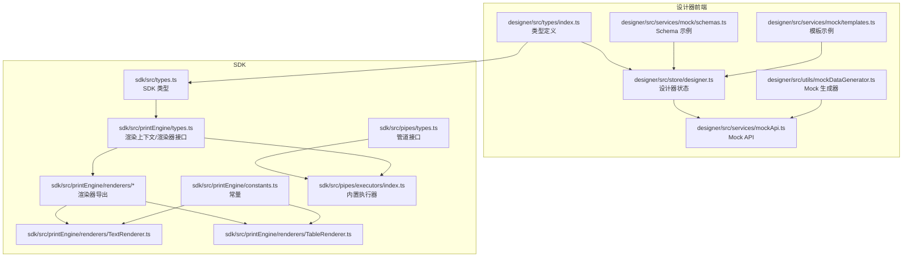
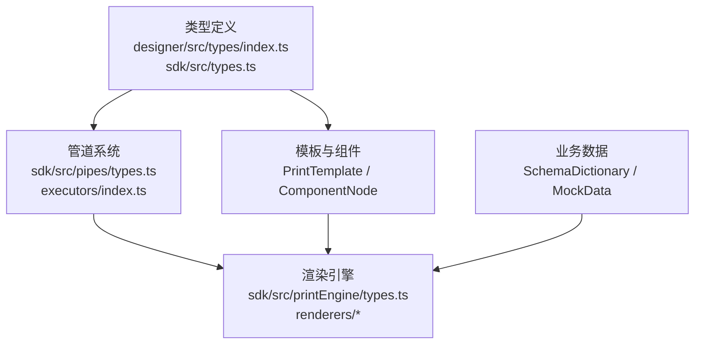
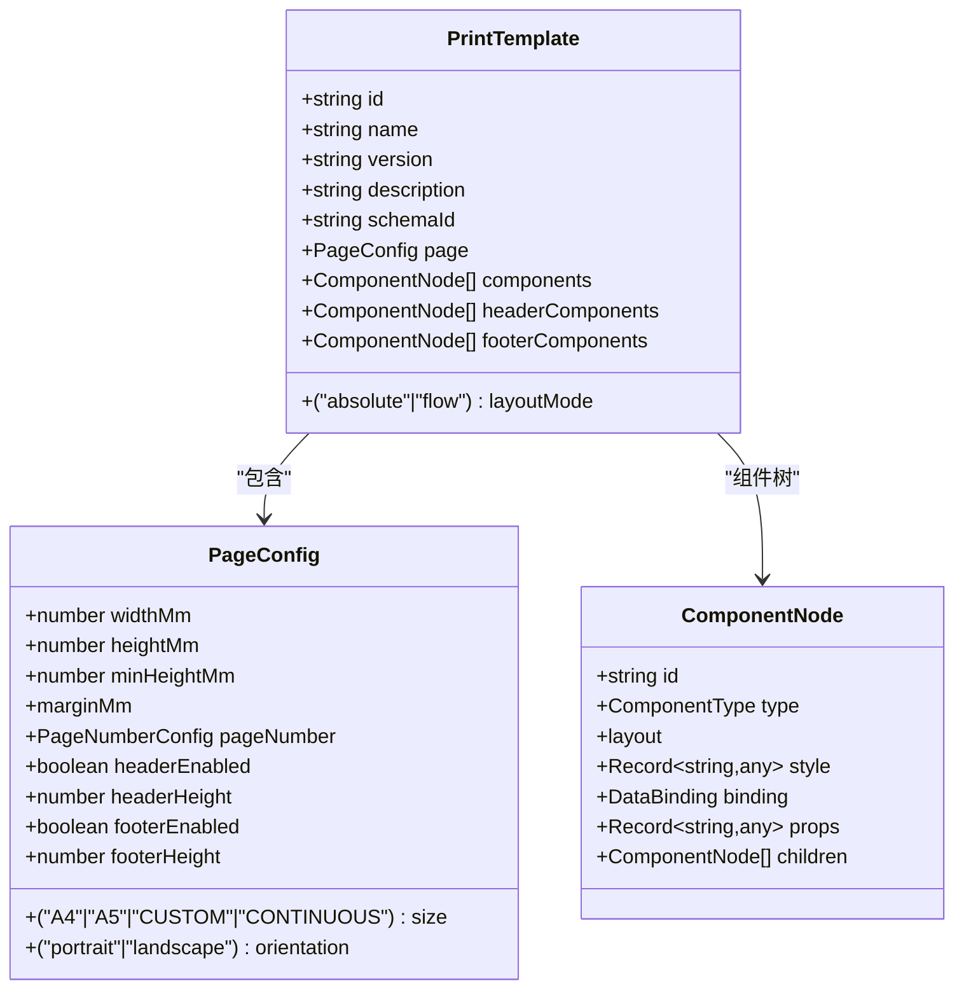
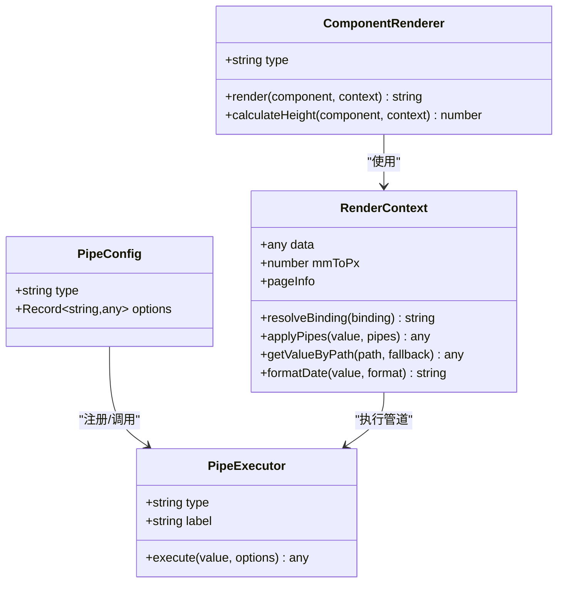
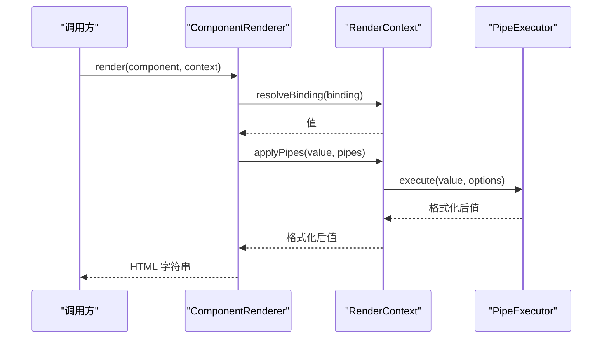
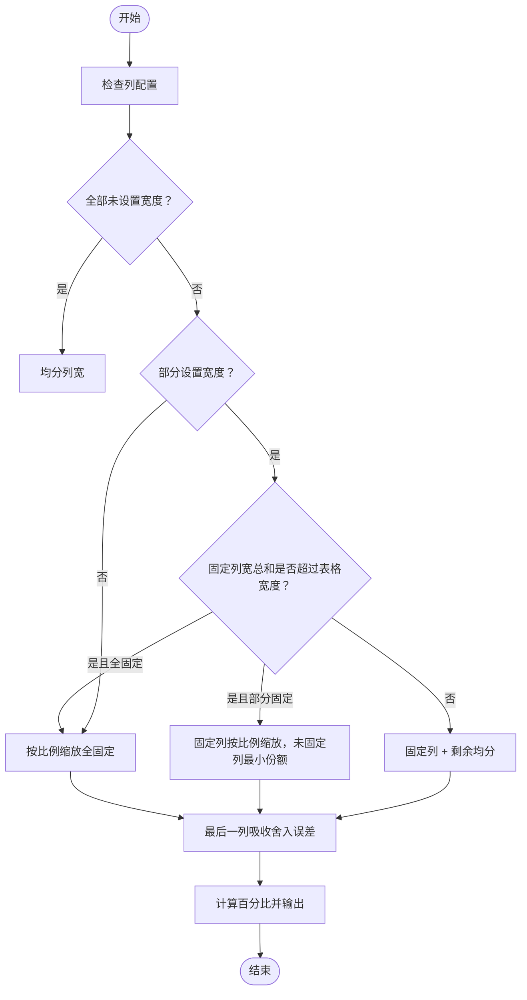
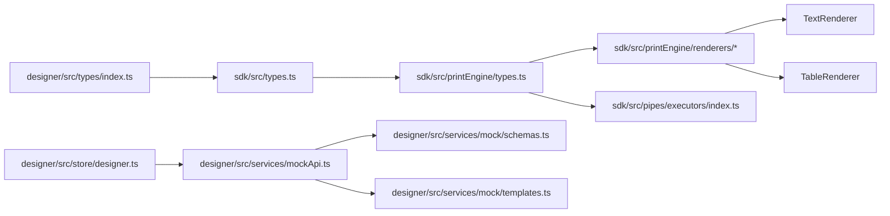

# 数据模型与类型系统

<cite>
**本文档引用的文件**
- [designer/src/types/index.ts](file://designer/src/types/index.ts)
- [sdk/src/types.ts](file://sdk/src/types.ts)
- [designer/src/services/mock/schemas.ts](file://designer/src/services/mock/schemas.ts)
- [designer/src/services/mock/templates.ts](file://designer/src/services/mock/templates.ts)
- [sdk/src/printEngine/types.ts](file://sdk/src/printEngine/types.ts)
- [sdk/src/pipes/types.ts](file://sdk/src/pipes/types.ts)
- [sdk/src/pipes/executors/index.ts](file://sdk/src/pipes/executors/index.ts)
- [sdk/src/printEngine/renderers/index.ts](file://sdk/src/printEngine/renderers/index.ts)
- [sdk/src/printEngine/renderers/TextRenderer.ts](file://sdk/src/printEngine/renderers/TextRenderer.ts)
- [sdk/src/printEngine/renderers/TableRenderer.ts](file://sdk/src/printEngine/renderers/TableRenderer.ts)
- [sdk/src/printEngine/constants.ts](file://sdk/src/printEngine/constants.ts)
- [designer/src/store/designer.ts](file://designer/src/store/designer.ts)
- [designer/src/services/mockApi.ts](file://designer/src/services/mockApi.ts)
- [designer/src/utils/mockDataGenerator.ts](file://designer/src/utils/mockDataGenerator.ts)
</cite>

## 目录
1. [简介](#简介)
2. [项目结构](#项目结构)
3. [核心组件](#核心组件)
4. [架构总览](#架构总览)
5. [详细组件分析](#详细组件分析)
6. [依赖分析](#依赖分析)
7. [性能考虑](#性能考虑)
8. [故障排查指南](#故障排查指南)
9. [结论](#结论)
10. [附录](#附录)

## 简介
本文件系统性梳理本项目的“数据模型与类型系统”，涵盖以下主题：
- 核心数据模型：PrintTemplate、ComponentNode、DataBinding、PageConfig 等
- Schema 系统：SchemaField、SchemaDictionary 的设计与用途
- 管道配置模型：PipeConfig、管道执行器与渲染器上下文
- 组件属性类型：表格、文本等组件的属性与行为
- 数据验证与业务规则：字段枚举、路径解析、边界校验
- 数据访问模式与缓存策略：前端 Mock Store 与 API 封装
- 性能与分页：表格高度估算、列宽计算、渲染器优化
- 数据生命周期与版本管理：模板版本、Schema 版本、历史撤销

## 项目结构
围绕“类型系统”的关键目录与文件如下：
- 设计器前端类型与示例数据：designer/src/types/index.ts、designer/src/services/mock/schemas.ts、designer/src/services/mock/templates.ts
- SDK 类型与渲染引擎：sdk/src/types.ts、sdk/src/printEngine/types.ts、sdk/src/printEngine/renderers/*
- 管道系统：sdk/src/pipes/types.ts、sdk/src/pipes/executors/index.ts
- 设计器状态与数据访问：designer/src/store/designer.ts、designer/src/services/mockApi.ts、designer/src/utils/mockDataGenerator.ts

**图表来源**
- [designer/src/types/index.ts:1-378](file://designer/src/types/index.ts#L1-L378)
- [sdk/src/types.ts:1-228](file://sdk/src/types.ts#L1-L228)
- [sdk/src/printEngine/types.ts:1-116](file://sdk/src/printEngine/types.ts#L1-L116)
- [sdk/src/printEngine/renderers/index.ts:1-13](file://sdk/src/printEngine/renderers/index.ts#L1-L13)
- [sdk/src/printEngine/renderers/TextRenderer.ts:1-60](file://sdk/src/printEngine/renderers/TextRenderer.ts#L1-L60)
- [sdk/src/printEngine/renderers/TableRenderer.ts:1-602](file://sdk/src/printEngine/renderers/TableRenderer.ts#L1-L602)
- [sdk/src/printEngine/constants.ts:1-113](file://sdk/src/printEngine/constants.ts#L1-L113)
- [designer/src/store/designer.ts:1-773](file://designer/src/store/designer.ts#L1-L773)
- [designer/src/services/mockApi.ts:1-103](file://designer/src/services/mockApi.ts#L1-L103)
- [designer/src/utils/mockDataGenerator.ts:1-113](file://designer/src/utils/mockDataGenerator.ts#L1-L113)

**章节来源**
- [designer/src/types/index.ts:1-378](file://designer/src/types/index.ts#L1-L378)
- [sdk/src/types.ts:1-228](file://sdk/src/types.ts#L1-L228)

## 核心组件
本节聚焦于关键数据模型与类型定义。

- PrintTemplate（打印模板）
  - 标识、名称、版本、描述
  - 关联 Schema ID、页面配置、布局模式
  - 组件树：内容区、页头区、页脚区
  - 参考路径：[designer/src/types/index.ts:337-358](file://designer/src/types/index.ts#L337-L358)、[sdk/src/types.ts:204-217](file://sdk/src/types.ts#L204-L217)

- ComponentNode（组件节点）
  - 组件唯一标识、类型、布局（绝对/流式）、样式、数据绑定、子节点
  - 参考路径：[designer/src/types/index.ts:303-331](file://designer/src/types/index.ts#L303-L331)、[sdk/src/types.ts:185-202](file://sdk/src/types.ts#L185-L202)

- DataBinding（数据绑定）
  - 数据路径、管道链、回退值
  - 参考路径：[designer/src/types/index.ts:157-164](file://designer/src/types/index.ts#L157-L164)、[sdk/src/types.ts:82-86](file://sdk/src/types.ts#L82-L86)

- PageConfig（页面配置）
  - 尺寸、方向、边距、页码配置、页头/页脚开关与高度
  - 参考路径：[designer/src/types/index.ts:91-123](file://designer/src/types/index.ts#L91-L123)、[sdk/src/types.ts:49-70](file://sdk/src/types.ts#L49-L70)

- Schema 系统
  - SchemaField：键名、标签、类型、描述、子字段、枚举、格式化类型
  - SchemaDictionary：根类型（object/array）、根字段、版本、描述
  - 参考路径：[designer/src/types/index.ts:18-52](file://designer/src/types/index.ts#L18-L52)、[sdk/src/types.ts:11-28](file://sdk/src/types.ts#L11-L28)

- 管道配置与执行
  - PipeConfig：类型与选项
  - PipeExecutor：执行器接口与内置实现（大小写、截取、默认值、货币、日期、中文大写等）
  - 参考路径：[sdk/src/pipes/types.ts:1-30](file://sdk/src/pipes/types.ts#L1-L30)、[sdk/src/pipes/executors/index.ts:1-45](file://sdk/src/pipes/executors/index.ts#L1-L45)

- 渲染器上下文
  - RenderContext：业务数据、绑定解析、管道应用、路径取值、日期格式化、mm→px 系数、页面信息
  - ComponentRenderer：组件类型、渲染、可选高度计算
  - 参考路径：[sdk/src/printEngine/types.ts:11-82](file://sdk/src/printEngine/types.ts#L11-L82)

**章节来源**
- [designer/src/types/index.ts:18-358](file://designer/src/types/index.ts#L18-L358)
- [sdk/src/types.ts:11-217](file://sdk/src/types.ts#L11-L217)
- [sdk/src/printEngine/types.ts:11-82](file://sdk/src/printEngine/types.ts#L11-L82)
- [sdk/src/pipes/types.ts:1-30](file://sdk/src/pipes/types.ts#L1-L30)
- [sdk/src/pipes/executors/index.ts:1-45](file://sdk/src/pipes/executors/index.ts#L1-L45)

## 架构总览
整体架构分为三层：
- 类型与模型层：设计器与 SDK 共享类型定义，保证前后端一致性
- 渲染引擎层：渲染器根据组件类型与上下文生成 HTML
- 管道层：数据在绑定阶段通过管道链进行格式化

**图表来源**
- [designer/src/types/index.ts:1-378](file://designer/src/types/index.ts#L1-L378)
- [sdk/src/types.ts:1-228](file://sdk/src/types.ts#L1-L228)
- [sdk/src/pipes/types.ts:1-30](file://sdk/src/pipes/types.ts#L1-L30)
- [sdk/src/pipes/executors/index.ts:1-45](file://sdk/src/pipes/executors/index.ts#L1-L45)
- [sdk/src/printEngine/types.ts:1-116](file://sdk/src/printEngine/types.ts#L1-L116)

## 详细组件分析

### PrintTemplate（打印模板）
- 结构要点
  - 唯一标识、名称、版本、描述
  - 关联 Schema ID，页面配置（PageConfig）
  - 布局模式：绝对定位或流式布局
  - 组件树：components、headerComponents、footerComponents
- 业务规则
  - 模板版本用于区分不同设计迭代
  - header/footer 组件受区域限制（例如表格不允许放入页头/页脚）
- 生命周期
  - 生成：设计器状态生成模板 JSON
  - 加载：兼容旧模板字段，自动推断页头/页脚高度
- 参考路径
  - [designer/src/types/index.ts:337-358](file://designer/src/types/index.ts#L337-L358)
  - [sdk/src/types.ts:204-217](file://sdk/src/types.ts#L204-L217)
  - [designer/src/store/designer.ts:189-250](file://designer/src/store/designer.ts#L189-L250)

**图表来源**
- [designer/src/types/index.ts:91-358](file://designer/src/types/index.ts#L91-L358)
- [sdk/src/types.ts:49-217](file://sdk/src/types.ts#L49-L217)

**章节来源**
- [designer/src/types/index.ts:91-358](file://designer/src/types/index.ts#L91-L358)
- [sdk/src/types.ts:49-217](file://sdk/src/types.ts#L49-L217)
- [designer/src/store/designer.ts:189-250](file://designer/src/store/designer.ts#L189-L250)

### ComponentNode（组件节点）
- 结构要点
  - 布局：mode（绝对/流式）、x/y/宽/高/zIndex
  - 样式：通用 Record<string, any>
  - 数据绑定：DataBinding
  - 组件属性：Record<string, any>
  - 子节点：children（容器类组件）
- 业务规则
  - 绝对定位以 mm 为单位，需考虑 mm→px 转换
  - zIndex 控制层级
- 参考路径
  - [designer/src/types/index.ts:303-331](file://designer/src/types/index.ts#L303-L331)
  - [sdk/src/types.ts:185-202](file://sdk/src/types.ts#L185-L202)

**章节来源**
- [designer/src/types/index.ts:303-331](file://designer/src/types/index.ts#L303-L331)
- [sdk/src/types.ts:185-202](file://sdk/src/types.ts#L185-L202)

### DataBinding（数据绑定）
- 结构要点
  - path：支持点号路径（如 'customer.name'）
  - pipes：管道链（顺序执行）
  - fallback：数据缺失时的回退值
- 业务规则
  - 管道按顺序执行，先数据再格式化
  - 支持枚举字段的 label/value 选择
- 参考路径
  - [designer/src/types/index.ts:157-164](file://designer/src/types/index.ts#L157-L164)
  - [sdk/src/types.ts:82-86](file://sdk/src/types.ts#L82-L86)

**章节来源**
- [designer/src/types/index.ts:157-164](file://designer/src/types/index.ts#L157-L164)
- [sdk/src/types.ts:82-86](file://sdk/src/types.ts#L82-L86)

### Schema 系统（SchemaField 与 SchemaDictionary）
- SchemaField
  - key、label、type、description
  - children（object/array）
  - enum（枚举）
  - format（date/datetime/money/percent）
- SchemaDictionary
  - id、name、version、description
  - rootType（object/array）、root（SchemaField）
- 业务规则
  - 枚举字段用于下拉选择与显示
  - format 控制显示格式（如日期、金额）
- 示例数据
  - 内置 Schema：销售出库单、嵌套对象 Schema
- 参考路径
  - [designer/src/types/index.ts:18-52](file://designer/src/types/index.ts#L18-L52)
  - [sdk/src/types.ts:11-28](file://sdk/src/types.ts#L11-L28)
  - [designer/src/services/mock/schemas.ts:6-146](file://designer/src/services/mock/schemas.ts#L6-L146)

**章节来源**
- [designer/src/types/index.ts:18-52](file://designer/src/types/index.ts#L18-L52)
- [sdk/src/types.ts:11-28](file://sdk/src/types.ts#L11-L28)
- [designer/src/services/mock/schemas.ts:6-146](file://designer/src/services/mock/schemas.ts#L6-L146)

### 管道配置模型与渲染器上下文
- PipeConfig
  - type：管道类型
  - options：配置选项
- PipeExecutor
  - 接口：type、label、execute(value, options)
  - 内置执行器：uppercase、lowercase、slice、default、currency、date、money、chineseNumber
- RenderContext
  - data、resolveBinding、applyPipes、getValueByPath、formatDate、mmToPx、pageInfo
- ComponentRenderer
  - type、render(component, context)、calculateHeight(component, context)
- 参考路径
  - [sdk/src/pipes/types.ts:1-30](file://sdk/src/pipes/types.ts#L1-L30)
  - [sdk/src/pipes/executors/index.ts:1-45](file://sdk/src/pipes/executors/index.ts#L1-L45)
  - [sdk/src/printEngine/types.ts:11-82](file://sdk/src/printEngine/types.ts#L11-L82)

**图表来源**
- [sdk/src/pipes/types.ts:1-30](file://sdk/src/pipes/types.ts#L1-L30)
- [sdk/src/pipes/executors/index.ts:1-45](file://sdk/src/pipes/executors/index.ts#L1-L45)
- [sdk/src/printEngine/types.ts:11-82](file://sdk/src/printEngine/types.ts#L11-L82)

**章节来源**
- [sdk/src/pipes/types.ts:1-30](file://sdk/src/pipes/types.ts#L1-L30)
- [sdk/src/pipes/executors/index.ts:1-45](file://sdk/src/pipes/executors/index.ts#L1-L45)
- [sdk/src/printEngine/types.ts:11-82](file://sdk/src/printEngine/types.ts#L11-L82)

### 渲染器序列流程（以文本与表格为例）

**图表来源**
- [sdk/src/printEngine/types.ts:11-82](file://sdk/src/printEngine/types.ts#L11-L82)
- [sdk/src/pipes/executors/index.ts:1-45](file://sdk/src/pipes/executors/index.ts#L1-L45)

**章节来源**
- [sdk/src/printEngine/types.ts:11-82](file://sdk/src/printEngine/types.ts#L11-L82)
- [sdk/src/pipes/executors/index.ts:1-45](file://sdk/src/pipes/executors/index.ts#L1-L45)

### 表格组件渲染算法（列宽与合计）

**图表来源**
- [sdk/src/printEngine/renderers/TableRenderer.ts:51-125](file://sdk/src/printEngine/renderers/TableRenderer.ts#L51-L125)

**章节来源**
- [sdk/src/printEngine/renderers/TableRenderer.ts:51-125](file://sdk/src/printEngine/renderers/TableRenderer.ts#L51-L125)

## 依赖分析
- 类型共享
  - 设计器与 SDK 共用 Schema、组件、页面配置等核心类型，确保前后端一致性
- 渲染器依赖
  - 渲染器依赖 RenderContext 与 PipeExecutor
  - 表格渲染器依赖列宽计算、合计与额外行渲染
- 状态与数据访问
  - 设计器 Store 管理模板、页面配置、组件树与历史
  - Mock API 封装 CRUD 操作，统一返回 Promise 并模拟延迟与错误

**图表来源**
- [designer/src/types/index.ts:1-378](file://designer/src/types/index.ts#L1-L378)
- [sdk/src/types.ts:1-228](file://sdk/src/types.ts#L1-L228)
- [sdk/src/printEngine/types.ts:1-116](file://sdk/src/printEngine/types.ts#L1-L116)
- [sdk/src/printEngine/renderers/index.ts:1-13](file://sdk/src/printEngine/renderers/index.ts#L1-L13)
- [sdk/src/pipes/executors/index.ts:1-45](file://sdk/src/pipes/executors/index.ts#L1-L45)
- [designer/src/store/designer.ts:1-773](file://designer/src/store/designer.ts#L1-L773)
- [designer/src/services/mockApi.ts:1-103](file://designer/src/services/mockApi.ts#L1-L103)
- [designer/src/services/mock/schemas.ts:1-146](file://designer/src/services/mock/schemas.ts#L1-L146)
- [designer/src/services/mock/templates.ts:1-800](file://designer/src/services/mock/templates.ts#L1-L800)

**章节来源**
- [designer/src/store/designer.ts:1-773](file://designer/src/store/designer.ts#L1-L773)
- [designer/src/services/mockApi.ts:1-103](file://designer/src/services/mockApi.ts#L1-L103)

## 性能考虑
- 表格渲染
  - 列宽计算采用百分比并最后列修正，避免累计误差导致溢出
  - 使用 Decimal.js 进行合计计算，避免浮点精度问题
  - 合计值格式化前进行有效性检查，异常时返回友好提示
- 文本渲染
  - 使用 flex 布局与行高默认值，减少复杂计算
- 渲染器常量
  - 默认尺寸、字体、边框等常量集中管理，便于统一优化
- 分页与估算
  - calculateHeight 提供快速估算，实际分页由引擎负责精确测量

**章节来源**
- [sdk/src/printEngine/renderers/TableRenderer.ts:390-463](file://sdk/src/printEngine/renderers/TableRenderer.ts#L390-L463)
- [sdk/src/printEngine/constants.ts:1-113](file://sdk/src/printEngine/constants.ts#L1-L113)

## 故障排查指南
- 表格宽度溢出
  - 现象：控制台警告或错误，表格右侧被裁剪
  - 原因：xMm + widthMm 超过右页边距
  - 处理：调整表格 x 或 width，或使用自动宽度
  - 参考路径：[sdk/src/printEngine/renderers/TableRenderer.ts:195-234](file://sdk/src/printEngine/renderers/TableRenderer.ts#L195-L234)
- 合计计算错误
  - 现象：合计行显示“计算错误”
  - 原因：数据非数值或管道执行异常
  - 处理：检查数据类型与管道配置
  - 参考路径：[sdk/src/printEngine/renderers/TableRenderer.ts:429-463](file://sdk/src/printEngine/renderers/TableRenderer.ts#L429-L463)
- 管道执行失败
  - 现象：额外行管道执行失败但保留原始值
  - 处理：检查管道类型与选项
  - 参考路径：[sdk/src/printEngine/renderers/TableRenderer.ts:542-556](file://sdk/src/printEngine/renderers/TableRenderer.ts#L542-L556)
- Mock API 错误
  - 现象：抛出 404 错误对象
  - 处理：确认资源是否存在或 ID 是否正确
  - 参考路径：[designer/src/services/mockApi.ts:9-14](file://designer/src/services/mockApi.ts#L9-L14)

**章节来源**
- [sdk/src/printEngine/renderers/TableRenderer.ts:195-234](file://sdk/src/printEngine/renderers/TableRenderer.ts#L195-L234)
- [sdk/src/printEngine/renderers/TableRenderer.ts:429-463](file://sdk/src/printEngine/renderers/TableRenderer.ts#L429-L463)
- [sdk/src/printEngine/renderers/TableRenderer.ts:542-556](file://sdk/src/printEngine/renderers/TableRenderer.ts#L542-L556)
- [designer/src/services/mockApi.ts:9-14](file://designer/src/services/mockApi.ts#L9-L14)

## 结论
本项目通过清晰的类型系统与模块化架构，实现了从 Schema 定义、模板配置、数据绑定、管道处理到渲染输出的完整链路。核心优势包括：
- 类型在设计器与 SDK 间共享，保障一致性
- 渲染器插件化，扩展性强
- 表格渲染具备完善的列宽计算与合计逻辑
- Mock 数据与 API 封装便于开发与测试

建议后续增强：
- Schema 版本对比与迁移工具
- 渲染器性能监控与缓存策略
- 更丰富的管道类型与配置校验

## 附录
- 数据访问模式
  - 设计器 Store：组件增删改、复制粘贴、撤销/重做、区域移动
  - Mock API：延迟与错误模拟，统一返回 Promise
  - 参考路径：[designer/src/store/designer.ts:108-773](file://designer/src/store/designer.ts#L108-L773)、[designer/src/services/mockApi.ts:1-103](file://designer/src/services/mockApi.ts#L1-L103)
- 数据生命周期与版本管理
  - PrintTemplate.version 与 SchemaDictionary.version 用于版本追踪
  - 设计器 Store 历史快照最多 20 步，支持撤销/重做
  - 参考路径：[designer/src/types/index.ts:337-358](file://designer/src/types/index.ts#L337-L358)、[designer/src/store/designer.ts:6-106](file://designer/src/store/designer.ts#L6-L106)
- Mock 数据生成
  - 根据 Schema 字段类型与键名推测生成合理示例数据
  - 参考路径：[designer/src/utils/mockDataGenerator.ts:1-113](file://designer/src/utils/mockDataGenerator.ts#L1-L113)

**章节来源**
- [designer/src/store/designer.ts:6-106](file://designer/src/store/designer.ts#L6-L106)
- [designer/src/services/mockApi.ts:1-103](file://designer/src/services/mockApi.ts#L1-L103)
- [designer/src/utils/mockDataGenerator.ts:1-113](file://designer/src/utils/mockDataGenerator.ts#L1-L113)