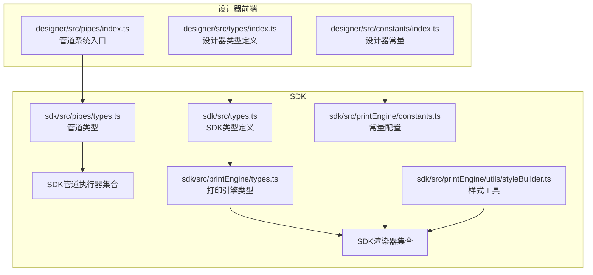
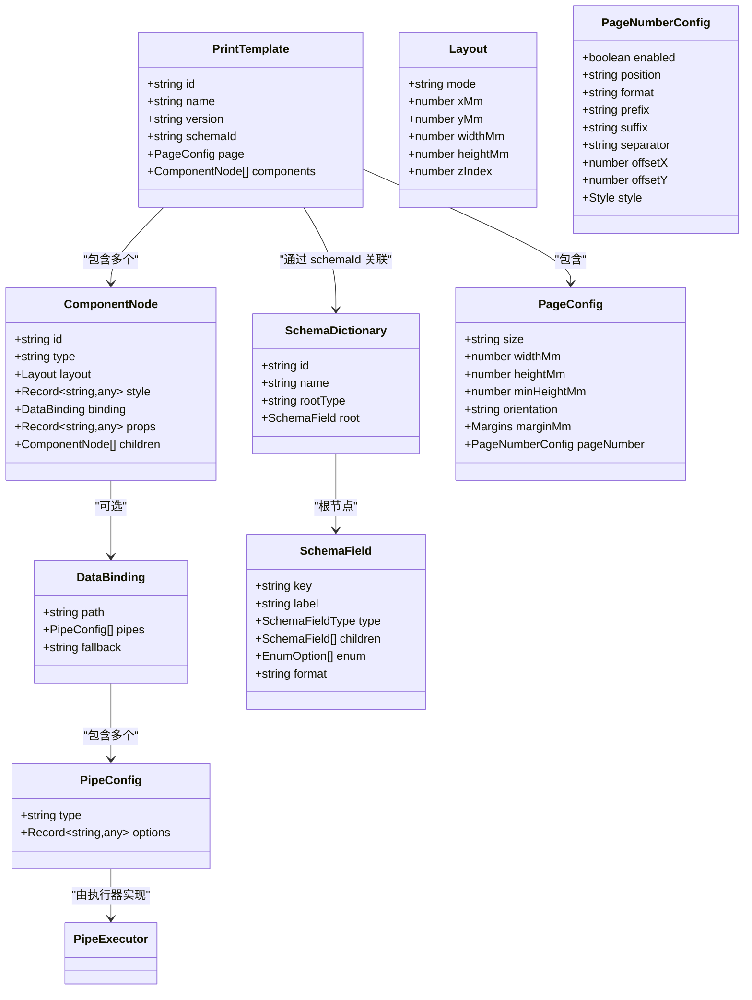
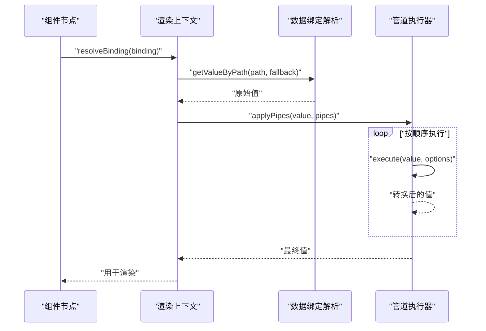
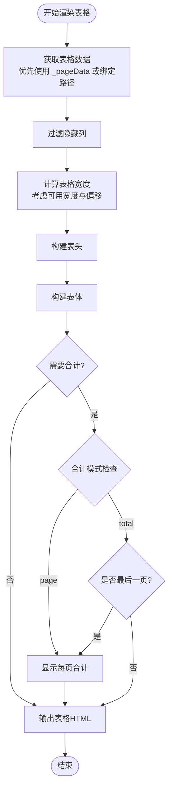
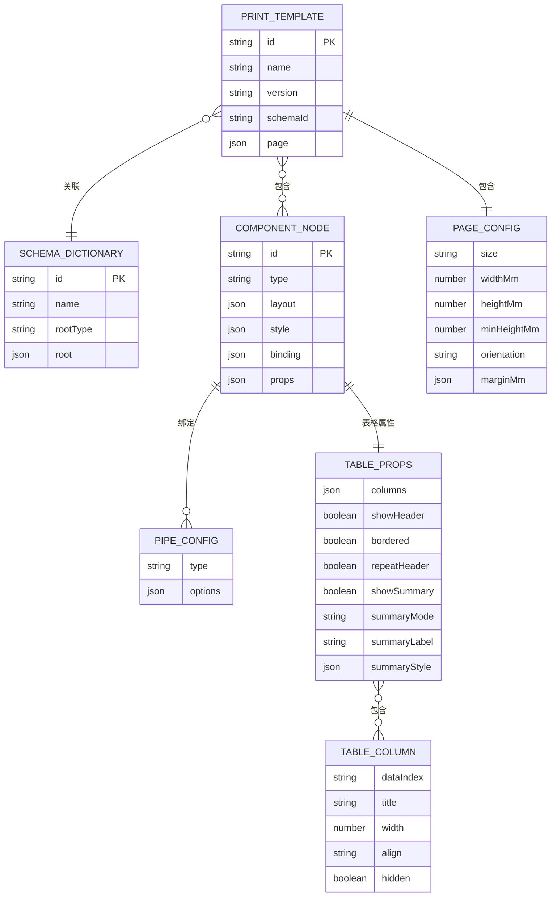
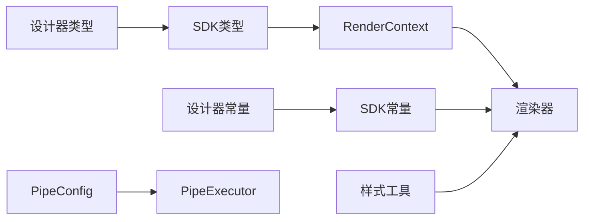

# 数据模型设计

<cite>
**本文档引用的文件**
- [designer/src/types/index.ts](file://designer/src/types/index.ts)
- [sdk/src/types.ts](file://sdk/src/types.ts)
- [sdk/src/pipes/types.ts](file://sdk/src/pipes/types.ts)
- [sdk/src/pipes/executors/CurrencyPipe.ts](file://sdk/src/pipes/executors/CurrencyPipe.ts)
- [sdk/src/pipes/executors/DatePipe.ts](file://sdk/src/pipes/executors/DatePipe.ts)
- [sdk/src/pipes/executors/MoneyPipe.ts](file://sdk/src/pipes/executors/MoneyPipe.ts)
- [sdk/src/printEngine/types.ts](file://sdk/src/printEngine/types.ts)
- [sdk/src/printEngine/renderers/TableRenderer.ts](file://sdk/src/printEngine/renderers/TableRenderer.ts)
- [sdk/src/printEngine/constants.ts](file://sdk/src/printEngine/constants.ts)
- [sdk/src/printEngine/utils/styleBuilder.ts](file://sdk/src/printEngine/utils/styleBuilder.ts)
- [designer/src/constants/index.ts](file://designer/src/constants/index.ts)
- [designer/src/pipes/index.ts](file://designer/src/pipes/index.ts)
</cite>

## 目录
1. [简介](#简介)
2. [项目结构](#项目结构)
3. [核心数据模型](#核心数据模型)
4. [架构概览](#架构概览)
5. [详细组件分析](#详细组件分析)
6. [依赖关系分析](#依赖关系分析)
7. [性能考量](#性能考量)
8. [故障排除指南](#故障排除指南)
9. [结论](#结论)
10. [附录](#附录)

## 简介
本文件面向打印平台的开发者与使用者，系统性梳理并解释核心数据模型的设计与实现，涵盖以下主题：
- 核心数据模型：PrintTemplate（模板）、ComponentNode（组件节点）、SchemaDictionary（数据字典）、PageConfig（页面配置）
- 管道配置模型：PipeConfig（管道配置）、管道执行器接口、管道参数定义
- 表格组件模型：TableProps（表格属性）、TableColumn（表格列）、表格汇总配置
- 数据模型之间的关系图与实际使用示例，帮助理解与正确使用这些数据结构

## 项目结构
打印平台采用前后端分离与模块化设计：
- 设计器前端（designer）：负责模板可视化编辑、组件属性配置、数据绑定与管道配置器
- SDK（sdk）：提供打印引擎、渲染器、管道系统与类型定义
- 服务端（server）：提供模板、数据字典与模拟数据的 API（本节不展开）

图表来源
- [designer/src/types/index.ts:1-160](file://designer/src/types/index.ts#L1-L160)
- [sdk/src/types.ts:1-171](file://sdk/src/types.ts#L1-L171)
- [sdk/src/pipes/types.ts:1-30](file://sdk/src/pipes/types.ts#L1-L30)
- [sdk/src/printEngine/types.ts:1-116](file://sdk/src/printEngine/types.ts#L1-L116)
- [sdk/src/printEngine/constants.ts:1-113](file://sdk/src/printEngine/constants.ts#L1-L113)
- [sdk/src/printEngine/utils/styleBuilder.ts:1-54](file://sdk/src/printEngine/utils/styleBuilder.ts#L1-L54)
- [designer/src/constants/index.ts:1-20](file://designer/src/constants/index.ts#L1-L20)
- [designer/src/pipes/index.ts:1-11](file://designer/src/pipes/index.ts#L1-L11)

章节来源
- [designer/src/types/index.ts:1-160](file://designer/src/types/index.ts#L1-L160)
- [sdk/src/types.ts:1-171](file://sdk/src/types.ts#L1-L171)
- [sdk/src/pipes/types.ts:1-30](file://sdk/src/pipes/types.ts#L1-L30)
- [sdk/src/printEngine/types.ts:1-116](file://sdk/src/printEngine/types.ts#L1-L116)
- [sdk/src/printEngine/constants.ts:1-113](file://sdk/src/printEngine/constants.ts#L1-L113)
- [sdk/src/printEngine/utils/styleBuilder.ts:1-54](file://sdk/src/printEngine/utils/styleBuilder.ts#L1-L54)
- [designer/src/constants/index.ts:1-20](file://designer/src/constants/index.ts#L1-L20)
- [designer/src/pipes/index.ts:1-11](file://designer/src/pipes/index.ts#L1-L11)

## 核心数据模型
本节详解四个核心数据模型：PrintTemplate、ComponentNode、SchemaDictionary、PageConfig。

- PrintTemplate（打印模板）
  - 关键字段：id、name、version、description、schemaId、page、layoutMode、components
  - 作用：描述一个完整的打印模板，包含页面配置与组件树
  - 设计要点：通过 schemaId 强关联数据字典；layoutMode 决定组件布局策略；components 为组件树根集合

- ComponentNode（组件节点）
  - 关键字段：id、type、layout、style、binding、props、children
  - 作用：描述画布上每个组件的几何、样式、数据绑定与属性
  - 设计要点：layout.mode 支持绝对定位与流式布局；binding 支持链式管道；children 支持容器组件嵌套

- SchemaDictionary（数据字典）
  - 关键字段：id、name、rootType、root、version、description
  - 作用：定义业务数据结构，支持对象或数组根类型，提供字段层次与枚举约束
  - 设计要点：root 为 SchemaField 的根节点；children 支持递归结构；format 支持日期/时间/货币/百分比等格式化提示

- PageConfig（页面配置）
  - 关键字段：size、widthMm、heightMm、minHeightMm、orientation、marginMm、pageNumber
  - 作用：描述页面尺寸、方向、边距与页码配置
  - 设计要点：支持标准尺寸（A4/A5）与自定义尺寸；连续纸（CONTINUOUS）具有最小高度约束；pageNumber 支持位置、格式、偏移与样式

章节来源
- [designer/src/types/index.ts:48-149](file://designer/src/types/index.ts#L48-L149)
- [sdk/src/types.ts:48-160](file://sdk/src/types.ts#L48-L160)

## 架构概览
打印平台的数据模型与渲染执行流程如下：

图表来源
- [designer/src/types/index.ts:48-149](file://designer/src/types/index.ts#L48-L149)
- [sdk/src/types.ts:48-160](file://sdk/src/types.ts#L48-L160)
- [sdk/src/pipes/types.ts:11-29](file://sdk/src/pipes/types.ts#L11-L29)

## 详细组件分析

### 管道配置模型
- PipeConfig（管道配置）
  - 字段：type（管道类型）、options（配置选项）
  - 用途：在数据绑定中声明转换链，按顺序执行多个管道

- 管道执行器接口（PipeExecutor）
  - 字段：type（类型标识）、label（显示名称）、execute(value, options?)
  - 用途：定义统一的执行器契约，便于扩展与注册

- 管道参数定义
  - 通过 options 传递配置，如货币符号、精度、日期格式、金额转换模式等

图表来源
- [sdk/src/printEngine/types.ts:11-55](file://sdk/src/printEngine/types.ts#L11-L55)
- [sdk/src/pipes/types.ts:11-29](file://sdk/src/pipes/types.ts#L11-L29)

章节来源
- [sdk/src/pipes/types.ts:1-30](file://sdk/src/pipes/types.ts#L1-L30)
- [sdk/src/pipes/executors/CurrencyPipe.ts:1-17](file://sdk/src/pipes/executors/CurrencyPipe.ts#L1-L17)
- [sdk/src/pipes/executors/DatePipe.ts:1-35](file://sdk/src/pipes/executors/DatePipe.ts#L1-L35)
- [sdk/src/pipes/executors/MoneyPipe.ts:1-62](file://sdk/src/pipes/executors/MoneyPipe.ts#L1-L62)
- [sdk/src/printEngine/types.ts:11-55](file://sdk/src/printEngine/types.ts#L11-L55)

### 表格组件模型
- TableProps（表格属性）
  - 字段：columns、showHeader、bordered、repeatHeader、showSummary、summaryMode、summaryLabel、summaryStyle、_pageData、_showHeader、_isLastPage、_totalData
  - 用途：控制表格渲染行为与合计展示

- TableColumn（表格列）
  - 字段：dataIndex、title、width、align、hidden、summary
  - 用途：定义列的字段映射、显示与合计规则

- 表格合计配置（TableColumnSummary）
  - 字段：type（聚合类型）、precision（精度）、prefix（前缀）、suffix（后缀）
  - 用途：为指定列配置统计聚合（和、平均、最大、最小、计数）

图表来源
- [sdk/src/printEngine/renderers/TableRenderer.ts:14-151](file://sdk/src/printEngine/renderers/TableRenderer.ts#L14-L151)
- [sdk/src/printEngine/renderers/TableRenderer.ts:156-201](file://sdk/src/printEngine/renderers/TableRenderer.ts#L156-L201)
- [sdk/src/printEngine/renderers/TableRenderer.ts:206-257](file://sdk/src/printEngine/renderers/TableRenderer.ts#L206-L257)
- [sdk/src/printEngine/renderers/TableRenderer.ts:259-274](file://sdk/src/printEngine/renderers/TableRenderer.ts#L259-L274)

章节来源
- [sdk/src/types.ts:107-132](file://sdk/src/types.ts#L107-L132)
- [sdk/src/types.ts:90-98](file://sdk/src/types.ts#L90-L98)
- [sdk/src/types.ts:82-88](file://sdk/src/types.ts#L82-L88)
- [sdk/src/printEngine/renderers/TableRenderer.ts:14-151](file://sdk/src/printEngine/renderers/TableRenderer.ts#L14-L151)
- [sdk/src/printEngine/renderers/TableRenderer.ts:156-201](file://sdk/src/printEngine/renderers/TableRenderer.ts#L156-L201)
- [sdk/src/printEngine/renderers/TableRenderer.ts:206-257](file://sdk/src/printEngine/renderers/TableRenderer.ts#L206-L257)
- [sdk/src/printEngine/renderers/TableRenderer.ts:259-274](file://sdk/src/printEngine/renderers/TableRenderer.ts#L259-L274)

### 数据模型关系图
- PrintTemplate 通过 schemaId 关联 SchemaDictionary
- PrintTemplate 包含 PageConfig 与多个 ComponentNode
- ComponentNode 的 DataBinding 可包含多个 PipeConfig
- 表格组件的 props 使用 TableProps 与 TableColumn 定义

图表来源
- [designer/src/types/index.ts:48-149](file://designer/src/types/index.ts#L48-L149)
- [sdk/src/types.ts:48-160](file://sdk/src/types.ts#L48-L160)

## 依赖关系分析
- 类型一致性：设计器与 SDK 共享核心类型定义，确保两端数据结构一致
- 管道系统：设计器负责配置 PipeConfig，SDK 负责执行 PipeExecutor
- 渲染器：TableRenderer 等渲染器依赖 RenderContext 与样式工具进行渲染
- 常量与工具：SDK 提供 mm→px 换算、默认尺寸与样式工具，保证渲染一致性

图表来源
- [designer/src/types/index.ts:1-160](file://designer/src/types/index.ts#L1-L160)
- [sdk/src/types.ts:1-171](file://sdk/src/types.ts#L1-L171)
- [sdk/src/pipes/types.ts:1-30](file://sdk/src/pipes/types.ts#L1-L30)
- [sdk/src/printEngine/types.ts:1-116](file://sdk/src/printEngine/types.ts#L1-L116)
- [sdk/src/printEngine/constants.ts:1-113](file://sdk/src/printEngine/constants.ts#L1-L113)
- [sdk/src/printEngine/utils/styleBuilder.ts:1-54](file://sdk/src/printEngine/utils/styleBuilder.ts#L1-L54)
- [designer/src/constants/index.ts:1-20](file://designer/src/constants/index.ts#L1-L20)

章节来源
- [designer/src/pipes/index.ts:1-11](file://designer/src/pipes/index.ts#L1-L11)
- [sdk/src/printEngine/types.ts:1-116](file://sdk/src/printEngine/types.ts#L1-L116)
- [sdk/src/printEngine/utils/styleBuilder.ts:1-54](file://sdk/src/printEngine/utils/styleBuilder.ts#L1-L54)

## 性能考量
- 表格渲染优化
  - 使用 Decimal.js 进行数值计算，避免浮点精度问题
  - 合计计算按需进行，仅在需要时对可见列进行聚合
  - 高度估算基于默认行高与系数，减少复杂布局计算

- 渲染上下文与样式
  - mm→px 换算系数集中管理，避免重复计算
  - 样式构建工具统一生成 CSS 字符串，减少 DOM 操作

- 管道执行
  - 管道按序执行，尽量保持轻量与纯函数式，避免副作用

章节来源
- [sdk/src/printEngine/renderers/TableRenderer.ts:206-257](file://sdk/src/printEngine/renderers/TableRenderer.ts#L206-L257)
- [sdk/src/printEngine/constants.ts:8-46](file://sdk/src/printEngine/constants.ts#L8-L46)
- [sdk/src/printEngine/utils/styleBuilder.ts:13-21](file://sdk/src/printEngine/utils/styleBuilder.ts#L13-L21)

## 故障排除指南
- 表格宽度溢出
  - 现象：表格 xMm + widthMm 超出可用宽度
  - 处理：自动调整宽度至可用宽度以内，并记录警告日志

- 表格宽度过小
  - 现象：表格宽度小于最小阈值
  - 处理：强制设置为最小宽度并记录警告日志

- 合计计算异常
  - 现象：聚合计算抛出错误或返回占位符
  - 处理：捕获异常并返回占位符，同时记录错误日志

- 金额转换错误
  - 现象：输入非数字导致转换失败
  - 处理：捕获异常并回退为原值字符串

章节来源
- [sdk/src/printEngine/renderers/TableRenderer.ts:47-55](file://sdk/src/printEngine/renderers/TableRenderer.ts#L47-L55)
- [sdk/src/printEngine/renderers/TableRenderer.ts:66-69](file://sdk/src/printEngine/renderers/TableRenderer.ts#L66-L69)
- [sdk/src/printEngine/renderers/TableRenderer.ts:245-248](file://sdk/src/printEngine/renderers/TableRenderer.ts#L245-L248)
- [sdk/src/pipes/executors/MoneyPipe.ts:56-60](file://sdk/src/pipes/executors/MoneyPipe.ts#L56-L60)

## 结论
本文档系统梳理了打印平台的核心数据模型与管道、表格组件的实现细节，明确了各模块职责与交互关系。通过统一的类型定义、可扩展的管道系统与稳健的渲染器实现，平台能够灵活地表达复杂的打印模板，并在渲染阶段保证一致的视觉效果与性能表现。

## 附录
- 实际使用示例（步骤说明）
  - 创建数据字典：定义 SchemaDictionary 的 rootType 与 root 字段，设置 children 与 format
  - 编写模板：创建 PrintTemplate，配置 PageConfig 与 layoutMode，添加 ComponentNode
  - 配置数据绑定：在 ComponentNode.binding 中设置 path、pipes 与 fallback
  - 表格配置：在 TableProps 中设置 columns、showSummary、summaryMode 与 summaryStyle
  - 渲染执行：SDK 渲染器根据 RenderContext 解析绑定、应用管道并生成 HTML

- 常用常量参考
  - mm→px 换算系数：3.78
  - 连续纸默认宽度：80mm
  - 连续纸默认最小高度：100mm

章节来源
- [designer/src/constants/index.ts:7-19](file://designer/src/constants/index.ts#L7-L19)
- [sdk/src/printEngine/constants.ts:8](file://sdk/src/printEngine/constants.ts#L8)
- [designer/src/pipes/index.ts:7](file://designer/src/pipes/index.ts#L7)