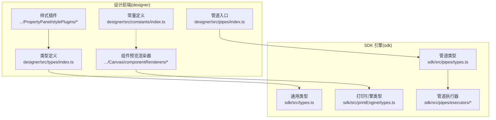
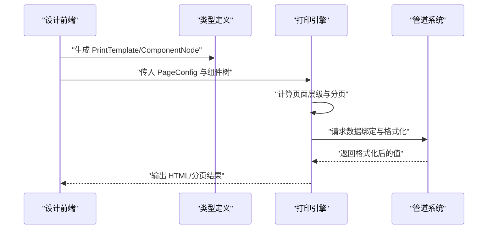
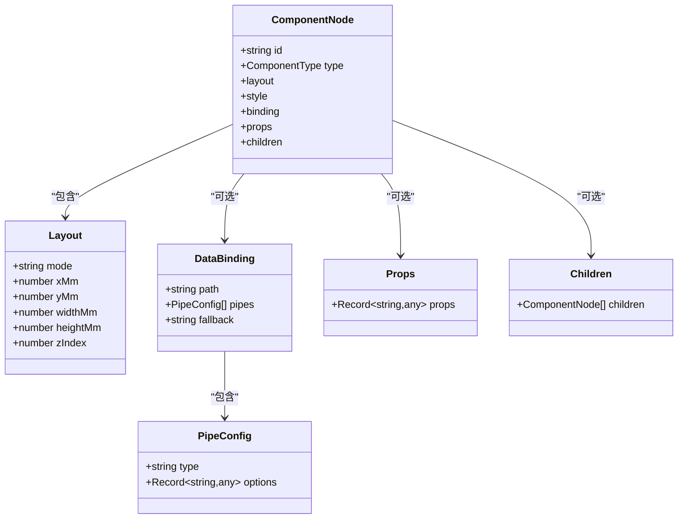
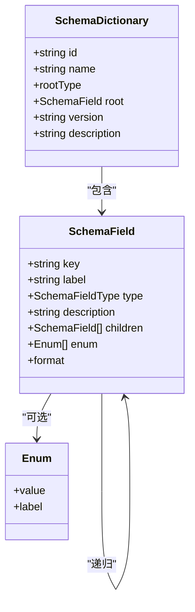
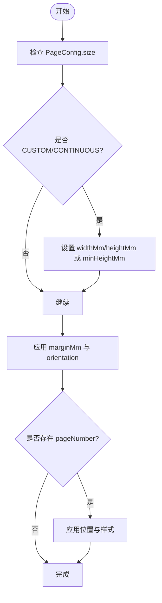
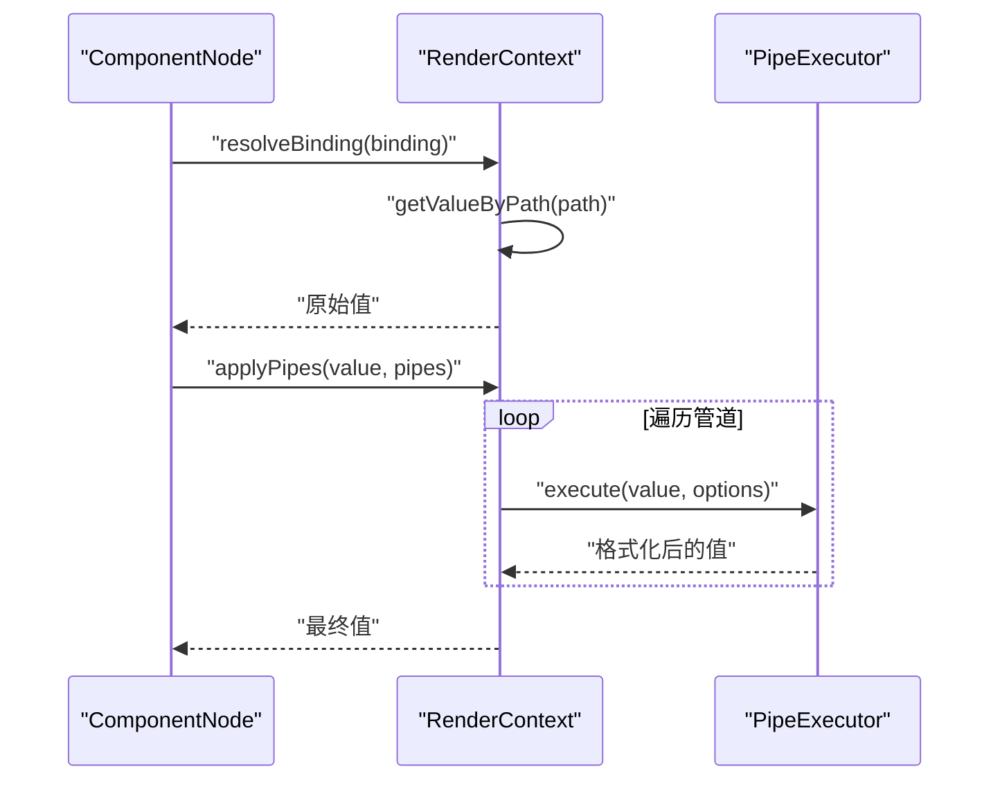
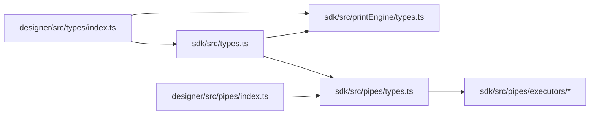

# 核心数据模型

<cite>
**本文引用的文件**
- [designer/src/types/index.ts](file://designer/src/types/index.ts)
- [sdk/src/types.ts](file://sdk/src/types.ts)
- [sdk/src/printEngine/types.ts](file://sdk/src/printEngine/types.ts)
- [sdk/src/pipes/types.ts](file://sdk/src/pipes/types.ts)
- [sdk/src/pipes/executors/CurrencyPipe.ts](file://sdk/src/pipes/executors/CurrencyPipe.ts)
- [sdk/src/pipes/executors/DatePipe.ts](file://sdk/src/pipes/executors/DatePipe.ts)
- [designer/src/constants/index.ts](file://designer/src/constants/index.ts)
- [designer/src/pages/Designer/components/Canvas/componentRenderers/TextPreview.tsx](file://designer/src/pages/Designer/components/Canvas/componentRenderers/TextPreview.tsx)
- [designer/src/pages/Designer/components/Canvas/componentRenderers/TablePreview.tsx](file://designer/src/pages/Designer/components/Canvas/componentRenderers/TablePreview.tsx)
- [designer/src/pages/Designer/components/PropertyPanel/stylePlugins/TextStylePlugin.tsx](file://designer/src/pages/Designer/components/PropertyPanel/stylePlugins/TextStylePlugin.tsx)
- [designer/src/pages/Designer/components/PropertyPanel/stylePlugins/TableStylePlugin.tsx](file://designer/src/pages/Designer/components/PropertyPanel/stylePlugins/TableStylePlugin.tsx)
- [designer/src/pipes/index.ts](file://designer/src/pipes/index.ts)
</cite>

## 目录
1. [简介](#简介)
2. [项目结构](#项目结构)
3. [核心组件](#核心组件)
4. [架构总览](#架构总览)
5. [详细组件分析](#详细组件分析)
6. [依赖关系分析](#依赖关系分析)
7. [性能考量](#性能考量)
8. [故障排查指南](#故障排查指南)
9. [结论](#结论)
10. [附录](#附录)

## 简介
本文件聚焦打印平台的核心数据模型，系统性梳理并解释以下关键数据结构：
- PrintTemplate：打印模板模型，描述模板基本信息、页面配置、布局模式与组件树。
- ComponentNode：组件节点模型，描述组件类型、布局信息、样式配置、数据绑定与子组件。
- SchemaDictionary：Schema 字典模型，描述数据结构根类型、根字段及版本信息。
- PageConfig：页面配置模型，描述页面尺寸、方向、边距与页码配置。

同时，结合渲染与管道系统的类型定义，给出各模型的使用示例与最佳实践，帮助开发者正确理解与应用这些核心数据结构。

## 项目结构
围绕核心数据模型，项目采用“设计前端 + SDK 引擎 + 管道系统”的分层组织：
- 设计前端（designer）：提供可视化设计器与组件预览，类型定义位于 [designer/src/types/index.ts](file://designer/src/types/index.ts)。
- SDK 引擎（sdk）：提供渲染上下文、组件渲染器接口、分页与页面层级抽象，类型定义位于 [sdk/src/printEngine/types.ts](file://sdk/src/printEngine/types.ts)，通用类型位于 [sdk/src/types.ts](file://sdk/src/types.ts)。
- 管道系统（sdk）：定义管道执行器接口与内置执行器，类型定义位于 [sdk/src/pipes/types.ts](file://sdk/src/pipes/types.ts)，执行器示例位于 [sdk/src/pipes/executors/CurrencyPipe.ts](file://sdk/src/pipes/executors/CurrencyPipe.ts)、[sdk/src/pipes/executors/DatePipe.ts](file://sdk/src/pipes/executors/DatePipe.ts)。

图表来源
- [designer/src/types/index.ts:1-160](file://designer/src/types/index.ts#L1-L160)
- [sdk/src/types.ts:1-171](file://sdk/src/types.ts#L1-L171)
- [sdk/src/printEngine/types.ts:1-116](file://sdk/src/printEngine/types.ts#L1-L116)
- [sdk/src/pipes/types.ts:1-30](file://sdk/src/pipes/types.ts#L1-L30)
- [designer/src/constants/index.ts:1-20](file://designer/src/constants/index.ts#L1-L20)
- [designer/src/pages/Designer/components/Canvas/componentRenderers/TextPreview.tsx:1-31](file://designer/src/pages/Designer/components/Canvas/componentRenderers/TextPreview.tsx#L1-L31)
- [designer/src/pages/Designer/components/Canvas/componentRenderers/TablePreview.tsx:1-56](file://designer/src/pages/Designer/components/Canvas/componentRenderers/TablePreview.tsx#L1-L56)
- [designer/src/pages/Designer/components/PropertyPanel/stylePlugins/TextStylePlugin.tsx:1-78](file://designer/src/pages/Designer/components/PropertyPanel/stylePlugins/TextStylePlugin.tsx#L1-L78)
- [designer/src/pages/Designer/components/PropertyPanel/stylePlugins/TableStylePlugin.tsx:1-46](file://designer/src/pages/Designer/components/PropertyPanel/stylePlugins/TableStylePlugin.tsx#L1-L46)
- [designer/src/pipes/index.ts:1-11](file://designer/src/pipes/index.ts#L1-L11)

章节来源
- [designer/src/types/index.ts:1-160](file://designer/src/types/index.ts#L1-L160)
- [sdk/src/types.ts:1-171](file://sdk/src/types.ts#L1-L171)
- [sdk/src/printEngine/types.ts:1-116](file://sdk/src/printEngine/types.ts#L1-L116)
- [sdk/src/pipes/types.ts:1-30](file://sdk/src/pipes/types.ts#L1-L30)
- [designer/src/constants/index.ts:1-20](file://designer/src/constants/index.ts#L1-L20)

## 核心组件
本节对四个核心数据模型进行逐项解析，并给出字段说明、典型取值与使用建议。

- PrintTemplate（打印模板）
  - 字段概览
    - id：模板唯一标识
    - name：模板名称
    - version：模板版本
    - description：模板描述
    - schemaId：关联的数据字典 ID
    - page：页面配置（见下节）
    - layoutMode：布局模式（绝对定位或流式）
    - components：组件树数组
  - 使用要点
    - 通过 schemaId 关联 SchemaDictionary，确保数据绑定路径合法
    - layoutMode 决定组件布局策略，影响渲染与分页
    - components 为组件树根集合，支持嵌套容器与表格等复杂结构

- ComponentNode（组件节点）
  - 字段概览
    - id：组件唯一标识
    - type：组件类型（text、image、rect、container、table、line、qrcode、barcode）
    - layout.mode：布局模式（absolute 或 flow）
    - layout.xMm/yMm/widthMm/heightMm/zIndex：绝对定位坐标与尺寸、层级
    - style：样式键值对（如字体大小、颜色、对齐）
    - binding：数据绑定（path、pipes、fallback）
    - props：组件特有属性（如文本标签、表格列定义）
    - children：子组件数组（容器/表格等复合组件）
  - 使用要点
    - absolute 模式下以毫米为单位的绝对定位；flow 模式下由流式布局管理
    - binding.path 与 SchemaDictionary 的字段路径保持一致
    - props 与 style 的组合决定组件外观与行为

- SchemaDictionary（Schema 字典）
  - 字段概览
    - id：字典唯一标识
    - name：字典名称
    - rootType：根类型（object 或 array）
    - root：根字段（SchemaField）
    - version：版本号
    - description：描述
  - SchemaField（根字段）
    - key：字段键名
    - label：显示标签
    - type：字段类型（string、number、boolean、date、datetime、object、array）
    - description：描述
    - children：子字段（嵌套结构）
    - enum：枚举值集合
    - format：格式化提示（date、datetime、money、percent）
  - 使用要点
    - rootType 决定数据结构形态，影响绑定路径与渲染
    - children 支持多层嵌套，形成树形结构
    - enum/format 辅助 UI 选择与格式化展示

- PageConfig（页面配置）
  - 字段概览
    - size：页面尺寸（A4、A5、CUSTOM、CONTINUOUS）
    - widthMm/heightMm：自定义宽高（mm）
    - minHeightMm：连续纸最小高度（mm）
    - orientation：方向（portrait 或 landscape）
    - marginMm：上、右、下、左边距（mm）
    - pageNumber：页码配置（见下节）
  - 使用要点
    - CUSTOM/CONTINUOUS 时需提供 widthMm/heightMm 或 minHeightMm
    - orientation 与 marginMm 影响可用打印区域与组件布局

- PageNumberConfig（页码配置，页面级）
  - 字段概览
    - enabled：是否显示
    - position：位置（top-left、top-center、top-right、bottom-left、bottom-center、bottom-right）
    - format：格式（simple、text、slash）
    - prefix/suffix：前后缀
    - separator：分隔符（slash 模式下的分隔符）
    - offsetX/offSetY：偏移（mm）
    - style.fontSize/color/fontWeight：样式
  - 使用要点
    - 与 PageConfig.pageNumber 联动，控制页码渲染位置与样式

章节来源
- [designer/src/types/index.ts:21-28](file://designer/src/types/index.ts#L21-L28)
- [designer/src/types/index.ts:11-19](file://designer/src/types/index.ts#L11-L19)
- [designer/src/types/index.ts:49-62](file://designer/src/types/index.ts#L49-L62)
- [designer/src/types/index.ts:31-46](file://designer/src/types/index.ts#L31-L46)
- [designer/src/types/index.ts:140-149](file://designer/src/types/index.ts#L140-L149)
- [designer/src/types/index.ts:123-138](file://designer/src/types/index.ts#L123-L138)
- [sdk/src/types.ts:21-28](file://sdk/src/types.ts#L21-L28)
- [sdk/src/types.ts:11-19](file://sdk/src/types.ts#L11-L19)
- [sdk/src/types.ts:49-62](file://sdk/src/types.ts#L49-L62)
- [sdk/src/types.ts:31-46](file://sdk/src/types.ts#L31-L46)
- [sdk/src/types.ts:151-160](file://sdk/src/types.ts#L151-L160)
- [sdk/src/types.ts:134-149](file://sdk/src/types.ts#L134-L149)

## 架构总览
核心数据模型贯穿“设计前端 → 渲染引擎 → 管道系统”的链路：
- 设计前端负责生成 PrintTemplate 与 ComponentNode，提供样式插件与预览渲染器。
- 渲染引擎根据 PageConfig 与 ComponentNode 计算页面层级与分页，输出 HTML。
- 管道系统对绑定数据进行格式化处理，提升展示质量。

图表来源
- [designer/src/types/index.ts:140-149](file://designer/src/types/index.ts#L140-L149)
- [sdk/src/printEngine/types.ts:11-55](file://sdk/src/printEngine/types.ts#L11-L55)
- [sdk/src/pipes/types.ts:11-29](file://sdk/src/pipes/types.ts#L11-L29)

## 详细组件分析

### PrintTemplate 模型
- 结构与用途
  - 作为模板的根对象，承载页面配置、布局模式与组件树，是渲染引擎的输入。
  - 通过 schemaId 与 SchemaDictionary 建立数据契约，保证数据绑定合法性。
- 字段复杂度
  - components 数组规模取决于模板复杂度，通常为 O(n) 遍历渲染。
  - 嵌套容器与表格会增加渲染与分页计算成本。
- 最佳实践
  - 明确 layoutMode，避免绝对定位与流式混用导致布局冲突。
  - 合理拆分子模板，降低单模板组件数量，提升渲染效率。
  - 在 schemaId 与 binding.path 之间建立清晰的命名规范与文档。

章节来源
- [designer/src/types/index.ts:140-149](file://designer/src/types/index.ts#L140-L149)
- [sdk/src/types.ts:151-160](file://sdk/src/types.ts#L151-L160)

### ComponentNode 模型
- 结构与用途
  - 描述单个组件的类型、布局、样式、数据绑定与子组件，是渲染引擎的基础单元。
- 布局与样式
  - layout.mode 控制定位策略；style 与 props 决定外观与行为。
  - binding.pipes 支持链式格式化，提升数据展示一致性。
- 复杂度与性能
  - 子组件递归遍历为 O(n)，建议限制深层嵌套。
  - 大量 absolute 定位可能增加分页计算开销。
- 最佳实践
  - 优先使用 flow 模式进行大段内容排版，absolute 仅用于精确定位。
  - 将样式与行为分离，避免在 props 中存储动态样式。
  - 为常用组件定义样式插件，统一 UI 配置体验。

图表来源
- [designer/src/types/index.ts:123-138](file://designer/src/types/index.ts#L123-L138)
- [designer/src/types/index.ts:66-75](file://designer/src/types/index.ts#L66-L75)
- [sdk/src/types.ts:134-149](file://sdk/src/types.ts#L134-L149)
- [sdk/src/types.ts:66-75](file://sdk/src/types.ts#L66-L75)

章节来源
- [designer/src/types/index.ts:123-138](file://designer/src/types/index.ts#L123-L138)
- [sdk/src/types.ts:134-149](file://sdk/src/types.ts#L134-L149)

### SchemaDictionary 模型
- 结构与用途
  - 定义数据结构的根类型与根字段，支撑数据绑定与 UI 选择。
- 类型系统与嵌套
  - rootType 支持 object/array，children 实现嵌套结构。
  - type 与 format 提供格式化提示，enum 提供可选项。
- 最佳实践
  - 为复杂对象定义清晰的 children 层级，避免过深嵌套。
  - 使用 enum/format 提升用户输入体验与展示一致性。
  - 版本化管理（version）便于模板与数据结构的演进。

图表来源
- [designer/src/types/index.ts:21-28](file://designer/src/types/index.ts#L21-L28)
- [designer/src/types/index.ts:11-19](file://designer/src/types/index.ts#L11-L19)
- [sdk/src/types.ts:21-28](file://sdk/src/types.ts#L21-L28)
- [sdk/src/types.ts:11-19](file://sdk/src/types.ts#L11-L19)

章节来源
- [designer/src/types/index.ts:21-28](file://designer/src/types/index.ts#L21-L28)
- [designer/src/types/index.ts:11-19](file://designer/src/types/index.ts#L11-L19)
- [sdk/src/types.ts:21-28](file://sdk/src/types.ts#L21-L28)
- [sdk/src/types.ts:11-19](file://sdk/src/types.ts#L11-L19)

### PageConfig 与 PageNumberConfig 模型
- PageConfig
  - size/widthMm/heightMm/minHeightMm 控制页面形态
  - orientation/marginMm 决定可用打印区域
  - pageNumber 控制页码显示与样式
- PageNumberConfig
  - position/format/prefix/suffix/separator 控制页码外观
  - offsetX/offSetY 控制微调
  - style 控制字体与颜色
- 最佳实践
  - CUSTOM/CONTINUOUS 场景务必提供尺寸参数
  - 页码位置与边距协调，避免遮挡重要内容
  - 使用 offsetX/offSetY 微调页码位置，保持跨页一致

图表来源
- [designer/src/types/index.ts:49-62](file://designer/src/types/index.ts#L49-L62)
- [designer/src/types/index.ts:31-46](file://designer/src/types/index.ts#L31-L46)
- [sdk/src/types.ts:49-62](file://sdk/src/types.ts#L49-L62)
- [sdk/src/types.ts:31-46](file://sdk/src/types.ts#L31-L46)

章节来源
- [designer/src/types/index.ts:49-62](file://designer/src/types/index.ts#L49-L62)
- [designer/src/types/index.ts:31-46](file://designer/src/types/index.ts#L31-L46)
- [sdk/src/types.ts:49-62](file://sdk/src/types.ts#L49-L62)
- [sdk/src/types.ts:31-46](file://sdk/src/types.ts#L31-L46)

### 渲染与样式插件集成
- 组件预览渲染器
  - 文本组件预览：依据 style 与 props 渲染文本内容与对齐方式。
  - 表格组件预览：依据列定义与样式渲染表格骨架。
- 样式插件
  - 文本样式插件：提供字体大小、颜色、对齐等配置。
  - 表格样式插件：提供字体大小与单元格对齐配置。
- 最佳实践
  - 使用样式插件统一配置，减少重复逻辑。
  - 预览渲染器与真实渲染器保持一致的样式映射。

章节来源
- [designer/src/pages/Designer/components/Canvas/componentRenderers/TextPreview.tsx:10-30](file://designer/src/pages/Designer/components/Canvas/componentRenderers/TextPreview.tsx#L10-L30)
- [designer/src/pages/Designer/components/Canvas/componentRenderers/TablePreview.tsx:10-55](file://designer/src/pages/Designer/components/Canvas/componentRenderers/TablePreview.tsx#L10-L55)
- [designer/src/pages/Designer/components/PropertyPanel/stylePlugins/TextStylePlugin.tsx:11-77](file://designer/src/pages/Designer/components/PropertyPanel/stylePlugins/TextStylePlugin.tsx#L11-L77)
- [designer/src/pages/Designer/components/PropertyPanel/stylePlugins/TableStylePlugin.tsx:11-45](file://designer/src/pages/Designer/components/PropertyPanel/stylePlugins/TableStylePlugin.tsx#L11-L45)

### 管道系统与数据绑定
- 数据绑定
  - DataBinding：path 指向 SchemaDictionary 的字段路径，pipes 为格式化管道链，fallback 为回退文本。
- 管道执行器
  - PipeExecutor：定义管道类型、标签与执行函数。
  - 示例：货币格式化、日期格式化。
- 最佳实践
  - 在 binding.pipes 中按需串联格式化管道，避免在组件内重复实现。
  - 使用 fallback 提升空数据场景的用户体验。

图表来源
- [sdk/src/printEngine/types.ts:11-55](file://sdk/src/printEngine/types.ts#L11-L55)
- [sdk/src/pipes/types.ts:11-29](file://sdk/src/pipes/types.ts#L11-L29)
- [sdk/src/pipes/executors/CurrencyPipe.ts:7-16](file://sdk/src/pipes/executors/CurrencyPipe.ts#L7-L16)
- [sdk/src/pipes/executors/DatePipe.ts:7-34](file://sdk/src/pipes/executors/DatePipe.ts#L7-L34)

章节来源
- [designer/src/types/index.ts:71-75](file://designer/src/types/index.ts#L71-L75)
- [sdk/src/printEngine/types.ts:11-55](file://sdk/src/printEngine/types.ts#L11-L55)
- [sdk/src/pipes/types.ts:11-29](file://sdk/src/pipes/types.ts#L11-L29)
- [sdk/src/pipes/executors/CurrencyPipe.ts:7-16](file://sdk/src/pipes/executors/CurrencyPipe.ts#L7-L16)
- [sdk/src/pipes/executors/DatePipe.ts:7-34](file://sdk/src/pipes/executors/DatePipe.ts#L7-L34)

## 依赖关系分析
- 设计前端类型与 SDK 类型保持一致，确保跨模块协作稳定。
- 渲染引擎依赖 PageConfig 与 ComponentNode，管道系统依赖 DataBinding 与 PipeConfig。
- 管道入口在设计前端聚合，便于统一管理与扩展。

图表来源
- [designer/src/types/index.ts:1-160](file://designer/src/types/index.ts#L1-L160)
- [sdk/src/types.ts:1-171](file://sdk/src/types.ts#L1-L171)
- [sdk/src/printEngine/types.ts:1-116](file://sdk/src/printEngine/types.ts#L1-L116)
- [sdk/src/pipes/types.ts:1-30](file://sdk/src/pipes/types.ts#L1-L30)
- [designer/src/pipes/index.ts:1-11](file://designer/src/pipes/index.ts#L1-L11)

章节来源
- [designer/src/types/index.ts:1-160](file://designer/src/types/index.ts#L1-L160)
- [sdk/src/types.ts:1-171](file://sdk/src/types.ts#L1-L171)
- [sdk/src/printEngine/types.ts:1-116](file://sdk/src/printEngine/types.ts#L1-L116)
- [sdk/src/pipes/types.ts:1-30](file://sdk/src/pipes/types.ts#L1-L30)
- [designer/src/pipes/index.ts:1-11](file://designer/src/pipes/index.ts#L1-L11)

## 性能考量
- 组件树规模
  - 单模板组件数量建议控制在合理范围，避免渲染与分页计算超时。
- 布局模式
  - flow 模式适合长文本与连续内容；absolute 模式适合精确定位，但可能增加分页复杂度。
- 管道链长度
  - 管道链越长，渲染耗时越高；建议合并同类格式化逻辑。
- 常量与换算
  - 使用统一的 mm→px 换算常量，确保预览与实际渲染一致。

章节来源
- [designer/src/constants/index.ts:1-20](file://designer/src/constants/index.ts#L1-L20)

## 故障排查指南
- 数据绑定路径错误
  - 确认 binding.path 与 SchemaDictionary.root.children 的键名一致。
  - 使用 fallback 提供默认值，避免空白显示。
- 页面尺寸与边距异常
  - 检查 PageConfig.size 与 CUSTOM 参数是否正确设置。
  - 调整 marginMm 与 orientation，确保内容不被裁剪。
- 页码显示问题
  - 检查 PageNumberConfig.enabled 与 position 设置。
  - 使用 offsetX/offSetY 微调位置，确保不遮挡内容。
- 管道格式化异常
  - 检查 pipes 配置与执行器类型是否匹配。
  - 对日期等格式化输入进行有效性校验。

章节来源
- [designer/src/types/index.ts:71-75](file://designer/src/types/index.ts#L71-L75)
- [designer/src/types/index.ts:31-46](file://designer/src/types/index.ts#L31-L46)
- [sdk/src/pipes/executors/DatePipe.ts:11-34](file://sdk/src/pipes/executors/DatePipe.ts#L11-L34)

## 结论
本文系统梳理了打印平台的核心数据模型：PrintTemplate、ComponentNode、SchemaDictionary 与 PageConfig/页码配置。通过明确字段定义、使用示例与最佳实践，开发者可在设计前端高效构建模板，在渲染引擎稳定输出，在管道系统中实现一致的数据格式化。建议在团队内建立统一的命名规范与版本管理策略，持续优化组件树规模与布局模式，以获得更优的开发与运行体验。

## 附录
- 常用组件类型
  - text、image、rect、container、table、line、qrcode、barcode
- Schema 字段类型
  - string、number、boolean、date、datetime、object、array
- 页面尺寸与方向
  - A4、A5、CUSTOM、CONTINUOUS；portrait、landscape
- 页码格式
  - simple、text、slash