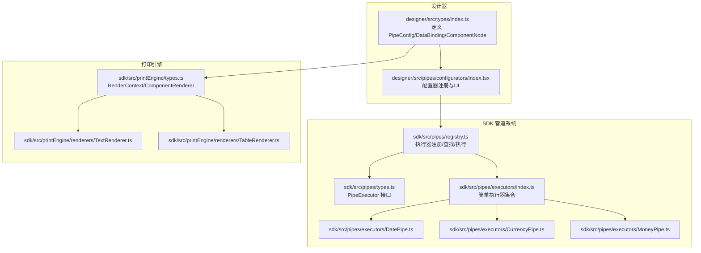
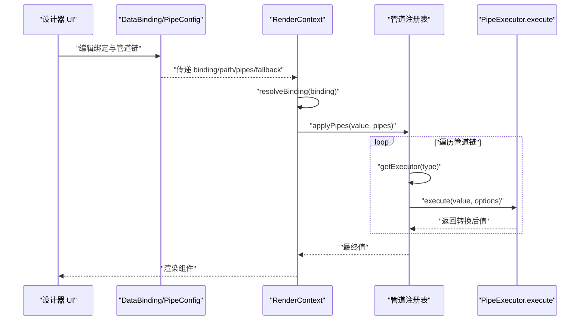
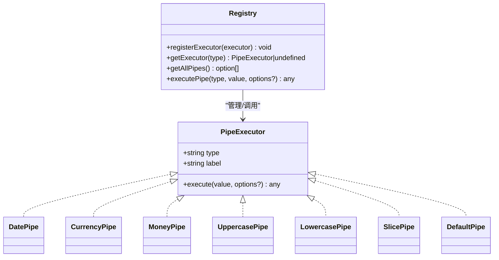
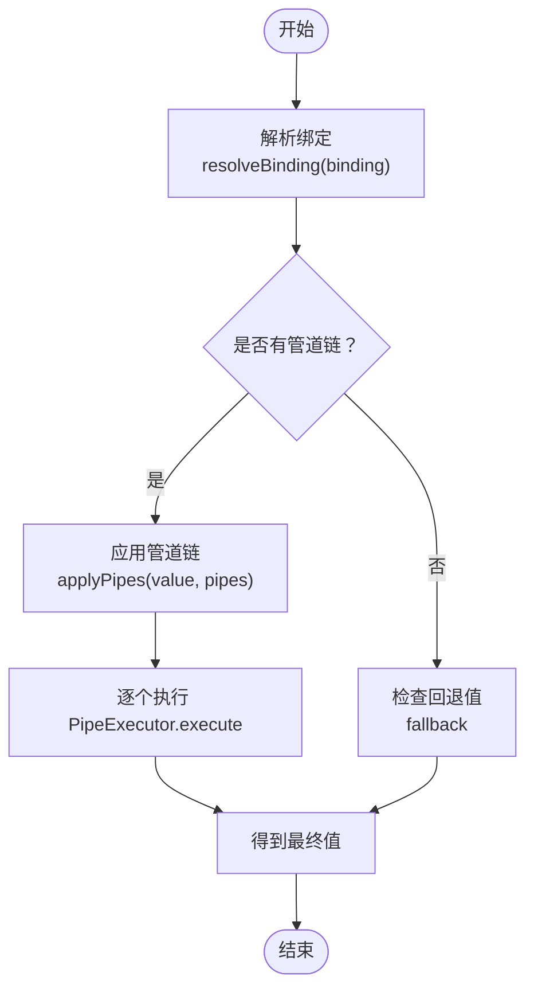
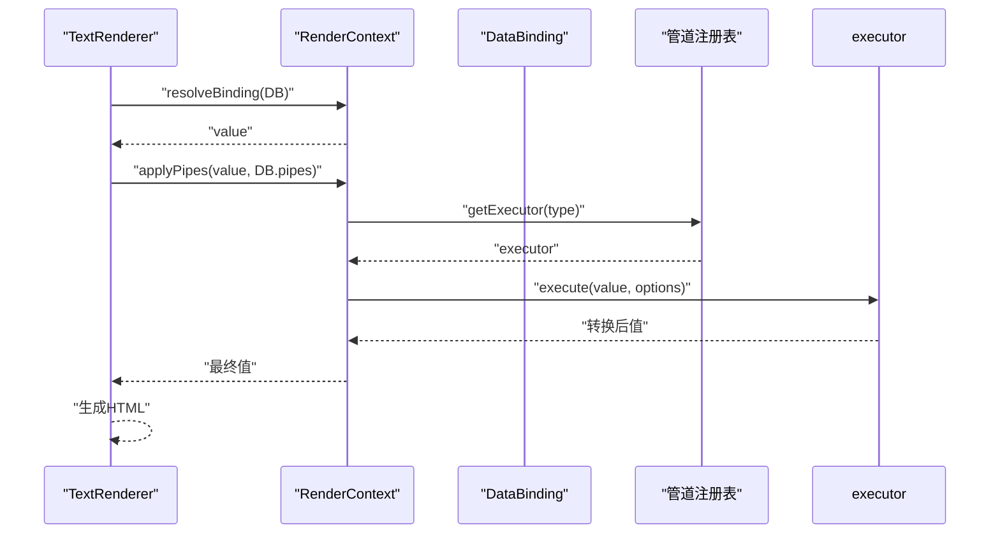
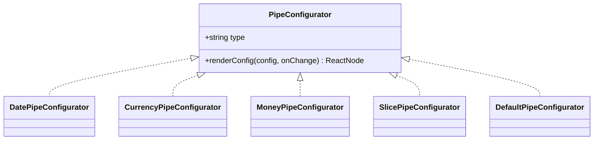
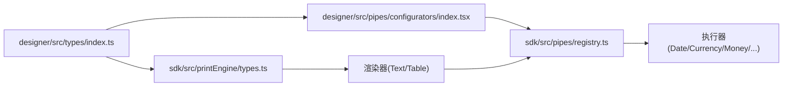

# 管道配置模型

<cite>
**本文引用的文件**
- [sdk/src/pipes/types.ts](file://sdk/src/pipes/types.ts)
- [sdk/src/pipes/index.ts](file://sdk/src/pipes/index.ts)
- [sdk/src/pipes/registry.ts](file://sdk/src/pipes/registry.ts)
- [sdk/src/pipes/executors/index.ts](file://sdk/src/pipes/executors/index.ts)
- [sdk/src/pipes/executors/DatePipe.ts](file://sdk/src/pipes/executors/DatePipe.ts)
- [sdk/src/pipes/executors/CurrencyPipe.ts](file://sdk/src/pipes/executors/CurrencyPipe.ts)
- [sdk/src/pipes/executors/MoneyPipe.ts](file://sdk/src/pipes/executors/MoneyPipe.ts)
- [sdk/src/printEngine/types.ts](file://sdk/src/printEngine/types.ts)
- [sdk/src/printEngine/renderers/TextRenderer.ts](file://sdk/src/printEngine/renderers/TextRenderer.ts)
- [sdk/src/printEngine/renderers/TableRenderer.ts](file://sdk/src/printEngine/renderers/TableRenderer.ts)
- [designer/src/types/index.ts](file://designer/src/types/index.ts)
- [designer/src/pipes/configurators/index.tsx](file://designer/src/pipes/configurators/index.tsx)
- [designer/src/pipes/configurators/DatePipeConfigurator.tsx](file://designer/src/pipes/configurators/DatePipeConfigurator.tsx)
- [designer/src/pipes/configurators/CurrencyPipeConfigurator.tsx](file://designer/src/pipes/configurators/CurrencyPipeConfigurator.tsx)
- [designer/src/pipes/configurators/MoneyPipeConfigurator.tsx](file://designer/src/pipes/configurators/MoneyPipeConfigurator.tsx)
- [designer/src/pages/Designer/components/Canvas/componentRenderers/TextPreview.tsx](file://designer/src/pages/Designer/components/Canvas/componentRenderers/TextPreview.tsx)
</cite>

## 目录
1. [简介](#简介)
2. [项目结构](#项目结构)
3. [核心组件](#核心组件)
4. [架构总览](#架构总览)
5. [详细组件分析](#详细组件分析)
6. [依赖关系分析](#依赖关系分析)
7. [性能考量](#性能考量)
8. [故障排查指南](#故障排查指南)
9. [结论](#结论)
10. [附录](#附录)

## 简介
本文件系统性梳理打印平台的“管道配置模型”，围绕以下目标展开：
- 管道配置数据结构：PipeConfig 的字段与语义，以及与渲染上下文的协作。
- 数据绑定模型：DataBinding 的路径引用、管道链配置、回退值设置。
- 管道执行器接口：PipeExecutor 的抽象设计、执行签名、参数与返回值规范。
- 实际使用示例：如何在组件中配置数据绑定与管道转换，理解数据转换链的工作机制。

该模型贯穿设计器（配置界面）与打印引擎（渲染执行），通过统一的类型定义与注册机制，确保配置与执行的一致性与可扩展性。

## 项目结构
围绕“管道配置模型”的关键目录与文件如下：
- 设计器侧类型与配置器
  - 设计器类型定义：包含 PipeConfig、DataBinding、ComponentNode 等。
  - 管道配置器：为不同管道提供可视化配置 UI。
- 打印引擎侧类型与渲染器
  - 渲染上下文 RenderContext：提供解析绑定、应用管道、取值等能力。
  - 渲染器：按组件类型消费绑定与管道，生成最终 HTML。
- 管道系统
  - 执行器接口与注册表：统一管理内置与自定义管道。
  - 内置执行器：日期、货币、金额、大小写、截取、默认值等。

图表来源
- [designer/src/types/index.ts:66-75](file://designer/src/types/index.ts#L66-L75)
- [designer/src/pipes/configurators/index.tsx:68-82](file://designer/src/pipes/configurators/index.tsx#L68-L82)
- [sdk/src/pipes/types.ts:11-29](file://sdk/src/pipes/types.ts#L11-L29)
- [sdk/src/pipes/registry.ts:12-64](file://sdk/src/pipes/registry.ts#L12-L64)
- [sdk/src/pipes/executors/index.ts:6-44](file://sdk/src/pipes/executors/index.ts#L6-L44)
- [sdk/src/printEngine/types.ts:11-55](file://sdk/src/printEngine/types.ts#L11-L55)
- [sdk/src/printEngine/renderers/TextRenderer.ts:10-59](file://sdk/src/printEngine/renderers/TextRenderer.ts#L10-L59)
- [sdk/src/printEngine/renderers/TableRenderer.ts:11-275](file://sdk/src/printEngine/renderers/TableRenderer.ts#L11-L275)

章节来源
- [designer/src/types/index.ts:66-75](file://designer/src/types/index.ts#L66-L75)
- [sdk/src/printEngine/types.ts:11-55](file://sdk/src/printEngine/types.ts#L11-L55)

## 核心组件
本节聚焦于“管道配置模型”的三大核心：PipeConfig、DataBinding、PipeExecutor。

- PipeConfig（管道配置）
  - 字段：type（管道类型）、options（配置选项，Record<string, any>）。
  - 作用：描述一个具体管道的类型与参数，用于在 DataBinding 中串联多个管道。
- DataBinding（数据绑定）
  - 字段：path（数据路径）、pipes（管道链数组）、fallback（回退值）。
  - 作用：将组件属性与业务数据解耦，支持通过管道链对原始值进行转换。
- PipeExecutor（管道执行器）
  - 字段：type（唯一标识）、label（显示名称）、execute(value, options?)（执行函数）。
  - 作用：封装具体的数据转换逻辑，统一通过注册表进行管理与调用。

章节来源
- [designer/src/types/index.ts:66-75](file://designer/src/types/index.ts#L66-L75)
- [sdk/src/pipes/types.ts:11-29](file://sdk/src/pipes/types.ts#L11-L29)

## 架构总览
下面的序列图展示了从组件绑定到管道执行的整体流程，体现“配置—注册—执行”的闭环：

图表来源
- [sdk/src/printEngine/types.ts:11-55](file://sdk/src/printEngine/types.ts#L11-L55)
- [sdk/src/pipes/registry.ts:24-52](file://sdk/src/pipes/registry.ts#L24-L52)
- [sdk/src/pipes/types.ts:11-29](file://sdk/src/pipes/types.ts#L11-L29)

## 详细组件分析

### PipeExecutor 接口与注册表
- 接口职责
  - type：管道类型标识，用于注册与查找。
  - label：显示名称，用于 UI 下拉与配置器展示。
  - execute：执行签名，接收输入值与可选 options，返回转换后的值。
- 注册与查找
  - 注册：通过 registerExecutor(type, executor) 将执行器加入 Map。
  - 查找：getExecutor(type) 返回对应执行器；getAllPipes() 返回可用于 UI 的下拉列表。
  - 执行：executePipe(type, value, options) 安全地调用执行器，若未找到则返回原值并告警。
- 内置执行器
  - 日期格式化：支持格式模板替换。
  - 货币格式化：支持符号与精度。
  - 金额转换：支持分/元互转、精度、千分位、货币符号。
  - 简单执行器：大小写、截取、默认值。

图表来源
- [sdk/src/pipes/types.ts:11-29](file://sdk/src/pipes/types.ts#L11-L29)
- [sdk/src/pipes/registry.ts:12-64](file://sdk/src/pipes/registry.ts#L12-L64)
- [sdk/src/pipes/executors/index.ts:6-44](file://sdk/src/pipes/executors/index.ts#L6-L44)
- [sdk/src/pipes/executors/DatePipe.ts:7-34](file://sdk/src/pipes/executors/DatePipe.ts#L7-L34)
- [sdk/src/pipes/executors/CurrencyPipe.ts:7-16](file://sdk/src/pipes/executors/CurrencyPipe.ts#L7-L16)
- [sdk/src/pipes/executors/MoneyPipe.ts:9-61](file://sdk/src/pipes/executors/MoneyPipe.ts#L9-L61)

章节来源
- [sdk/src/pipes/types.ts:11-29](file://sdk/src/pipes/types.ts#L11-L29)
- [sdk/src/pipes/registry.ts:12-64](file://sdk/src/pipes/registry.ts#L12-L64)
- [sdk/src/pipes/executors/index.ts:6-44](file://sdk/src/pipes/executors/index.ts#L6-L44)

### RenderContext 与数据绑定解析
- RenderContext 能力
  - resolveBinding(binding)：根据 DataBinding 解析最终值。
  - applyPipes(value, pipes)：对值依次应用管道链。
  - getValueByPath(path, fallback)：按路径取值，支持回退。
  - formatDate(value, format)：日期格式化工具。
- DataBinding 语义
  - path：数据路径，通常指向业务数据中的某个字段。
  - pipes：管道链，按序执行，前一输出作为后一输入。
  - fallback：当路径取值为空时的回退值。

图表来源
- [sdk/src/printEngine/types.ts:11-55](file://sdk/src/printEngine/types.ts#L11-L55)
- [designer/src/types/index.ts:71-75](file://designer/src/types/index.ts#L71-L75)

章节来源
- [sdk/src/printEngine/types.ts:11-55](file://sdk/src/printEngine/types.ts#L11-L55)
- [designer/src/types/index.ts:71-75](file://designer/src/types/index.ts#L71-L75)

### 渲染器中的绑定与管道应用
- 文本渲染器 TextRenderer
  - 读取绑定值，支持 label 前缀拼接。
  - 将值直接用于渲染，不显式调用 applyPipes，但可通过 DataBinding 的 pipes 字段实现链式转换。
- 表格渲染器 TableRenderer
  - 优先使用分页数据（_pageData），否则从绑定路径取值。
  - 在渲染单元格时，可结合 DataBinding 与管道链完成字段值的格式化与转换。

图表来源
- [sdk/src/printEngine/renderers/TextRenderer.ts:13-52](file://sdk/src/printEngine/renderers/TextRenderer.ts#L13-L52)
- [sdk/src/printEngine/types.ts:11-55](file://sdk/src/printEngine/types.ts#L11-L55)
- [sdk/src/pipes/registry.ts:24-52](file://sdk/src/pipes/registry.ts#L24-L52)

章节来源
- [sdk/src/printEngine/renderers/TextRenderer.ts:13-52](file://sdk/src/printEngine/renderers/TextRenderer.ts#L13-L52)
- [sdk/src/printEngine/renderers/TableRenderer.ts:14-26](file://sdk/src/printEngine/renderers/TableRenderer.ts#L14-L26)

### 设计器中的管道配置器
- 配置器接口
  - PipeConfigurator：type + renderConfig(config, onChange)。
  - 通过 onChange(option, value) 更新 PipeConfig.options。
- 已实现配置器
  - 日期：格式模板输入。
  - 货币：货币符号输入。
  - 金额：转换模式、精度、货币符号、千分位开关。
  - 截取：起始/结束位置输入。
  - 默认值：默认值输入。
- 注册与使用
  - 通过 configuratorRegistry 映射 type → Configurator。
  - 在设计器 UI 中按类型动态渲染配置面板。

图表来源
- [designer/src/pipes/configurators/index.tsx:16-82](file://designer/src/pipes/configurators/index.tsx#L16-L82)
- [designer/src/pipes/configurators/DatePipeConfigurator.tsx:9-22](file://designer/src/pipes/configurators/DatePipeConfigurator.tsx#L9-L22)
- [designer/src/pipes/configurators/CurrencyPipeConfigurator.tsx:9-22](file://designer/src/pipes/configurators/CurrencyPipeConfigurator.tsx#L9-L22)
- [designer/src/pipes/configurators/MoneyPipeConfigurator.tsx:9-79](file://designer/src/pipes/configurators/MoneyPipeConfigurator.tsx#L9-L79)

章节来源
- [designer/src/pipes/configurators/index.tsx:16-82](file://designer/src/pipes/configurators/index.tsx#L16-L82)
- [designer/src/pipes/configurators/DatePipeConfigurator.tsx:9-22](file://designer/src/pipes/configurators/DatePipeConfigurator.tsx#L9-L22)
- [designer/src/pipes/configurators/CurrencyPipeConfigurator.tsx:9-22](file://designer/src/pipes/configurators/CurrencyPipeConfigurator.tsx#L9-L22)
- [designer/src/pipes/configurators/MoneyPipeConfigurator.tsx:9-79](file://designer/src/pipes/configurators/MoneyPipeConfigurator.tsx#L9-L79)

## 依赖关系分析
- 类型层
  - 设计器类型定义 PipeConfig、DataBinding、ComponentNode，供设计器与渲染器共享。
- 执行层
  - RenderContext 在渲染阶段负责解析绑定与应用管道。
  - 管道注册表集中管理执行器，提供安全执行与回退。
- UI 层
  - 配置器将用户输入映射为 PipeConfig.options，驱动渲染期的转换链。

图表来源
- [designer/src/types/index.ts:66-75](file://designer/src/types/index.ts#L66-L75)
- [sdk/src/printEngine/types.ts:11-55](file://sdk/src/printEngine/types.ts#L11-L55)
- [designer/src/pipes/configurators/index.tsx:68-82](file://designer/src/pipes/configurators/index.tsx#L68-L82)
- [sdk/src/pipes/registry.ts:12-64](file://sdk/src/pipes/registry.ts#L12-L64)

章节来源
- [designer/src/types/index.ts:66-75](file://designer/src/types/index.ts#L66-L75)
- [sdk/src/printEngine/types.ts:11-55](file://sdk/src/printEngine/types.ts#L11-L55)
- [sdk/src/pipes/registry.ts:12-64](file://sdk/src/pipes/registry.ts#L12-L64)

## 性能考量
- 管道链长度
  - 管道链越长，执行开销越大。建议在保证表达力的前提下尽量精简。
- 数值计算
  - 金额转换使用高精度库，避免浮点误差；注意在高频渲染场景下的缓存策略。
- 渲染器取值
  - 表格渲染器会基于数据估算高度，避免不必要的重复计算。
- 回退值
  - 合理设置 fallback 可减少空值判断分支，提升渲染稳定性。

## 故障排查指南
- 管道类型未注册
  - 现象：执行时返回原值并告警。
  - 排查：确认执行器是否通过注册表正确注册。
- 日期格式无效
  - 现象：日期未被正确格式化。
  - 排查：检查格式模板是否符合预期，确认输入为可解析时间。
- 金额转换异常
  - 现象：抛出错误或返回原始值。
  - 排查：检查数值合法性、转换模式与精度设置。
- 绑定路径为空
  - 现象：显示回退值或空白。
  - 排查：确认路径正确、数据存在，必要时设置 fallback。

章节来源
- [sdk/src/pipes/registry.ts:45-52](file://sdk/src/pipes/registry.ts#L45-L52)
- [sdk/src/pipes/executors/DatePipe.ts:11-33](file://sdk/src/pipes/executors/DatePipe.ts#L11-L33)
- [sdk/src/pipes/executors/MoneyPipe.ts:56-60](file://sdk/src/pipes/executors/MoneyPipe.ts#L56-L60)
- [sdk/src/printEngine/renderers/TableRenderer.ts:24-26](file://sdk/src/printEngine/renderers/TableRenderer.ts#L24-L26)

## 结论
本模型通过统一的 PipeConfig、DataBinding 与 PipeExecutor 抽象，实现了“配置—执行—渲染”的清晰分层。设计器负责可视化配置，打印引擎负责解析与执行，注册表保障扩展性与一致性。借助管道链，开发者可以灵活组合多种转换逻辑，满足多样化的打印需求。

## 附录

### 实际使用示例（步骤说明）
- 在设计器中为组件绑定数据
  - 设置 DataBinding 的 path 指向业务数据字段。
  - 如需格式化，添加 pipes 并选择相应管道类型。
- 配置管道参数
  - 通过对应配置器设置 options（如日期格式、货币符号、金额模式等）。
- 在渲染器中生效
  - 渲染器调用 RenderContext.resolveBinding 与 applyPipes，按顺序执行管道链。
- 预览与调试
  - 使用设计器预览组件，观察最终呈现效果；必要时调整管道链或参数。

章节来源
- [designer/src/pipes/configurators/index.tsx:68-82](file://designer/src/pipes/configurators/index.tsx#L68-L82)
- [sdk/src/printEngine/renderers/TextRenderer.ts:13-52](file://sdk/src/printEngine/renderers/TextRenderer.ts#L13-L52)
- [designer/src/pages/Designer/components/Canvas/componentRenderers/TextPreview.tsx:10-30](file://designer/src/pages/Designer/components/Canvas/componentRenderers/TextPreview.tsx#L10-L30)