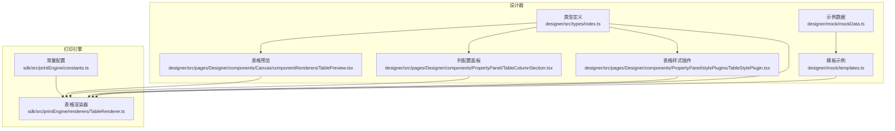
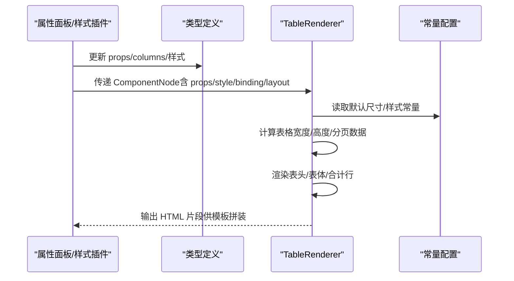
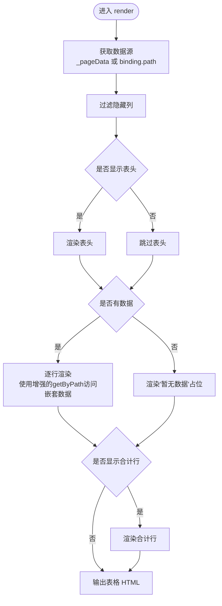
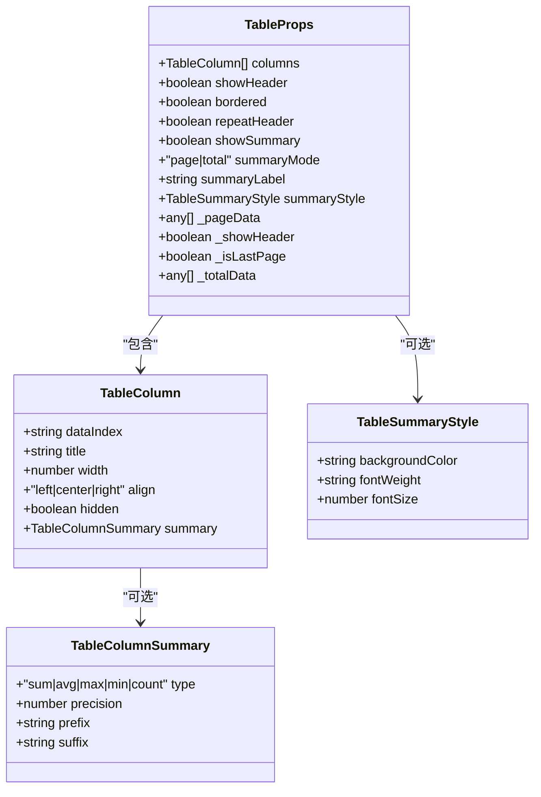
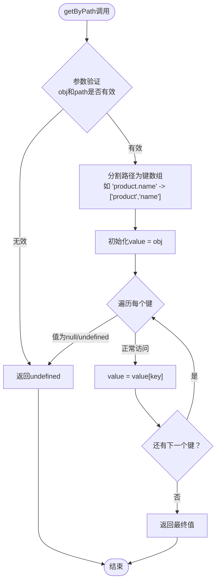
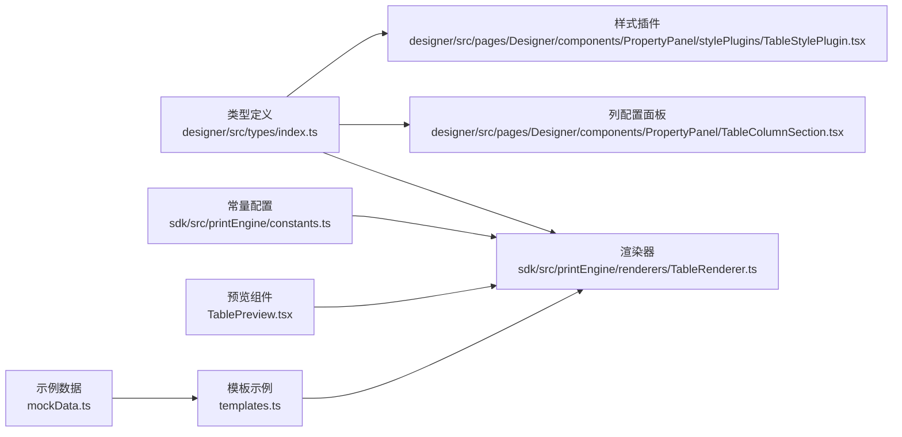

# 表格组件模型

<cite>
**本文引用的文件**
- [designer/src/types/index.ts](file://designer/src/types/index.ts)
- [sdk/src/printEngine/renderers/TableRenderer.ts](file://sdk/src/printEngine/renderers/TableRenderer.ts)
- [designer/src/pages/Designer/components/Canvas/componentRenderers/TablePreview.tsx](file://designer/src/pages/Designer/components/Canvas/componentRenderers/TablePreview.tsx)
- [designer/src/pages/Designer/components/PropertyPanel/TableColumnSection.tsx](file://designer/src/pages/Designer/components/PropertyPanel/TableColumnSection.tsx)
- [designer/src/pages/Designer/components/PropertyPanel/stylePlugins/TableStylePlugin.tsx](file://designer/src/pages/Designer/components/PropertyPanel/stylePlugins/TableStylePlugin.tsx)
- [sdk/src/printEngine/constants.ts](file://sdk/src/printEngine/constants.ts)
- [designer/src/constants/index.ts](file://designer/src/constants/index.ts)
- [server/src/routes/mockData.ts](file://server/src/routes/mockData.ts)
- [designer/mock/mockData.ts](file://designer/mock/mockData.ts)
- [designer/mock/templates.ts](file://designer/mock/templates.ts)
</cite>

## 更新摘要
**变更内容**
- 新增嵌套对象数据结构支持章节，详细介绍getByPath函数的增强功能
- 更新表格列配置示例，包含嵌套路径的使用场景
- 增加实际的嵌套对象数据示例和配置指南
- 扩展使用示例，涵盖复杂数据结构的表格配置

## 目录
1. [简介](#简介)
2. [项目结构](#项目结构)
3. [核心组件](#核心组件)
4. [架构概览](#架构概览)
5. [详细组件分析](#详细组件分析)
6. [嵌套对象数据结构支持](#嵌套对象数据结构支持)
7. [依赖分析](#依赖分析)
8. [性能考量](#性能考量)
9. [故障排查指南](#故障排查指南)
10. [结论](#结论)
11. [附录](#附录)

## 简介
本文件系统性地梳理并说明打印平台表格组件的模型设计与实现，覆盖以下关键点：
- TableProps 表格属性的完整定义：列配置、表头显示、边框设置、跨页重复表头、合计行控制与样式等。
- TableColumn 表格列模型：列标识、标题、宽度、对齐方式、隐藏设置、合计配置等。
- TableColumnSummary 表格列合计配置：聚合类型、精度设置、前后缀等。
- TableSummaryStyle 合计行样式：背景色、字重、字号等。
- **新增**：嵌套对象数据结构支持，通过增强的getByPath函数实现复杂的嵌套路径访问。
- 完整使用示例与配置指南，帮助开发者创建复杂打印场景下的表格。

## 项目结构
表格组件涉及设计器与打印引擎两部分：
- 设计器侧负责可视化配置与预览，包括列管理、样式插件、属性面板等。
- 打印引擎侧负责将组件树渲染为最终可打印的 HTML，并支持跨页拆分与合计行渲染。



**图表来源**
- [designer/src/types/index.ts:90-121](file://designer/src/types/index.ts#L90-L121)
- [sdk/src/printEngine/renderers/TableRenderer.ts:1-275](file://sdk/src/printEngine/renderers/TableRenderer.ts#L1-L275)
- [designer/src/pages/Designer/components/Canvas/componentRenderers/TablePreview.tsx:1-55](file://designer/src/pages/Designer/components/Canvas/componentRenderers/TablePreview.tsx#L1-L55)
- [designer/src/pages/Designer/components/PropertyPanel/TableColumnSection.tsx:1-295](file://designer/src/pages/Designer/components/PropertyPanel/TableColumnSection.tsx#L1-L295)
- [designer/src/pages/Designer/components/PropertyPanel/stylePlugins/TableStylePlugin.tsx:1-46](file://designer/src/pages/Designer/components/PropertyPanel/stylePlugins/TableStylePlugin.tsx#L1-L46)
- [sdk/src/printEngine/constants.ts:48-92](file://sdk/src/printEngine/constants.ts#L48-L92)
- [designer/mock/mockData.ts:369-422](file://designer/mock/mockData.ts#L369-L422)
- [designer/mock/templates.ts:290-342](file://designer/mock/templates.ts#L290-L342)

**章节来源**
- [designer/src/types/index.ts:90-121](file://designer/src/types/index.ts#L90-L121)
- [sdk/src/printEngine/renderers/TableRenderer.ts:1-275](file://sdk/src/printEngine/renderers/TableRenderer.ts#L1-L275)

## 核心组件
本节从类型定义出发，逐项解释表格组件的关键模型与属性。

- 表格列模型 TableColumn
  - dataIndex：字段名，用于从数据源取值。**支持嵌套路径**，如"product.name"。
  - title：列标题，作为表头显示。
  - width：列宽度（单位：mm），用于布局与跨页拆分。
  - align：对齐方式（left/center/right），影响单元格文本对齐。
  - hidden：是否隐藏该列。
  - summary：列合计配置（可选）。

- 表格列合计配置 TableColumnSummary
  - type：聚合类型（sum/avg/max/min/count）。
  - precision：小数位数，默认 2。
  - prefix/suffix：数值前后缀，如货币符号或单位。

- 合计行样式 TableSummaryStyle
  - backgroundColor：背景色。
  - fontWeight：字重。
  - fontSize：字号（px）。

- 表格组件属性 TableProps
  - columns：列配置数组。
  - showHeader：是否显示表头。
  - bordered：是否显示边框。
  - repeatHeader：跨页重复表头（与分页策略配合）。
  - showSummary：是否显示合计行。
  - summaryMode：合计模式（page/total）。
  - summaryLabel：合计行首列标签（默认"合计"）。
  - summaryStyle：合计行样式。
  - _pageData/_showHeader/_isLastPage/_totalData：内部分页与渲染状态（不建议外部直接修改）。

**章节来源**
- [designer/src/types/index.ts:82-121](file://designer/src/types/index.ts#L82-L121)

## 架构概览
表格组件在设计器与打印引擎之间的交互流程如下：



**图表来源**
- [sdk/src/printEngine/renderers/TableRenderer.ts:14-151](file://sdk/src/printEngine/renderers/TableRenderer.ts#L14-L151)
- [sdk/src/printEngine/constants.ts:48-92](file://sdk/src/printEngine/constants.ts#L48-L92)
- [designer/src/types/index.ts:90-121](file://designer/src/types/index.ts#L90-L121)

## 详细组件分析

### 表格渲染器（TableRenderer）
- 数据来源优先级：props._pageData（分页片段） > binding.path（完整数据）。
- 可视列过滤：仅渲染未隐藏的列。
- 表头与表体：根据默认高度与行高系数计算行高；支持跨页重复表头。
- 合计行：按 summaryMode 决定是否显示；total 模式使用全量数据，page 模式使用当前页数据；支持自定义标签与样式。
- 数值计算：使用高精度库进行 sum/avg/max/min/count，支持 precision、prefix/suffix 格式化。
- **嵌套路径支持**：通过增强的getByPath函数支持复杂的嵌套对象访问。



**图表来源**
- [sdk/src/printEngine/renderers/TableRenderer.ts:14-151](file://sdk/src/printEngine/renderers/TableRenderer.ts#L14-L151)
- [sdk/src/printEngine/renderers/TableRenderer.ts:156-201](file://sdk/src/printEngine/renderers/TableRenderer.ts#L156-L201)
- [sdk/src/printEngine/renderers/TableRenderer.ts:206-257](file://sdk/src/printEngine/renderers/TableRenderer.ts#L206-L257)

**章节来源**
- [sdk/src/printEngine/renderers/TableRenderer.ts:14-275](file://sdk/src/printEngine/renderers/TableRenderer.ts#L14-L275)
- [sdk/src/printEngine/constants.ts:48-92](file://sdk/src/printEngine/constants.ts#L48-L92)

### 表格列管理（Property Panel）
- 支持添加/删除列、上下移动列顺序、切换列显隐。
- 列标题与 dataIndex 的编辑。**dataIndex 现在支持嵌套路径**，如"product.name"。
- 合计配置面板：聚合类型、精度、前后缀。
- 表格级开关：显示表头、显示边框、显示合计行、合计模式（page/total）。



**图表来源**
- [designer/src/types/index.ts:82-121](file://designer/src/types/index.ts#L82-L121)

**章节来源**
- [designer/src/pages/Designer/components/PropertyPanel/TableColumnSection.tsx:1-295](file://designer/src/pages/Designer/components/PropertyPanel/TableColumnSection.tsx#L1-L295)
- [designer/src/types/index.ts:82-121](file://designer/src/types/index.ts#L82-L121)

### 表格样式插件（TableStylePlugin）
- 提供字体大小与对齐方式的可视化配置，作用于表格单元格内容。
- 与渲染器中的默认样式常量协同工作，确保一致的视觉表现。

**章节来源**
- [designer/src/pages/Designer/components/PropertyPanel/stylePlugins/TableStylePlugin.tsx:1-46](file://designer/src/pages/Designer/components/PropertyPanel/stylePlugins/TableStylePlugin.tsx#L1-L46)
- [sdk/src/printEngine/constants.ts:63-92](file://sdk/src/printEngine/constants.ts#L63-L92)

### 表格预览（TablePreview）
- 设计器画布上的表格预览组件，体现基本的表头、边框、对齐与占位提示。
- 用于在设计阶段直观查看表格效果。

**章节来源**
- [designer/src/pages/Designer/components/Canvas/componentRenderers/TablePreview.tsx:1-55](file://designer/src/pages/Designer/components/Canvas/componentRenderers/TablePreview.tsx#L1-L55)

## 嵌套对象数据结构支持

### 增强的getByPath函数
表格渲染器现在支持复杂的嵌套对象数据结构访问，通过增强的getByPath函数实现：

- **功能增强**：支持点号分隔的嵌套路径访问，如"product.name"、"customer.address.city"
- **安全访问**：自动处理null/undefined值，避免访问错误
- **路径解析**：将路径字符串分割为多个键，逐层访问嵌套对象



**图表来源**
- [sdk/src/printEngine/renderers/TableRenderer.ts:18-27](file://sdk/src/printEngine/renderers/TableRenderer.ts#L18-L27)

### 嵌套对象示例
系统提供了完整的嵌套对象数据结构示例，特别是采购订单场景：

#### 嵌套数据结构
```javascript
{
  title: '采购订单',
  orderNo: 'PO202401150001',
  orderDate: '2024-01-15',
  supplier: {
    name: '深圳华芯电子科技有限公司',
    contact: '李工',
    phone: '0755-86001234'
  },
  items: [
    {
      no: 1,
      product: { name: 'STM32F407 微控制器', code: 'MCU-001', category: '芯片' },
      quantity: 500,
      price: 28.50,
      amount: 14250.00
    }
  ]
}
```

#### 对应的表格配置
```javascript
{
  "dataIndex": "product.name",
  "title": "商品名称",
  "width": 60
},
{
  "dataIndex": "product.code", 
  "title": "商品编码",
  "width": 40
},
{
  "dataIndex": "product.category",
  "title": "商品分类", 
  "width": 40
}
```

### 使用场景
嵌套对象支持适用于以下场景：
- **复杂业务数据**：订单详情、产品信息、客户资料等多层级结构
- **API响应数据**：RESTful API返回的嵌套JSON结构
- **报表统计**：需要从嵌套数据中提取特定字段进行展示
- **多语言支持**：国际化数据的嵌套结构

**章节来源**
- [sdk/src/printEngine/renderers/TableRenderer.ts:18-27](file://sdk/src/printEngine/renderers/TableRenderer.ts#L18-L27)
- [designer/mock/mockData.ts:369-422](file://designer/mock/mockData.ts#L369-L422)
- [designer/mock/templates.ts:290-342](file://designer/mock/templates.ts#L290-L342)

## 依赖分析
- 类型定义集中于 designer/src/types/index.ts，被渲染器与属性面板共同引用。
- 渲染器依赖常量配置（默认尺寸、样式默认值、单位换算）。
- 属性面板与样式插件负责将用户配置写回组件 props/style。
- 预览组件用于设计期反馈，不参与最终渲染。
- **新增**：示例数据和模板文件为嵌套对象支持提供实际应用场景。



**图表来源**
- [designer/src/types/index.ts:90-121](file://designer/src/types/index.ts#L90-L121)
- [sdk/src/printEngine/renderers/TableRenderer.ts:1-275](file://sdk/src/printEngine/renderers/TableRenderer.ts#L1-L275)
- [sdk/src/printEngine/constants.ts:48-92](file://sdk/src/printEngine/constants.ts#L48-L92)
- [designer/mock/mockData.ts:369-422](file://designer/mock/mockData.ts#L369-L422)
- [designer/mock/templates.ts:290-342](file://designer/mock/templates.ts#L290-L342)

**章节来源**
- [designer/src/types/index.ts:90-121](file://designer/src/types/index.ts#L90-L121)
- [sdk/src/printEngine/renderers/TableRenderer.ts:1-275](file://sdk/src/printEngine/renderers/TableRenderer.ts#L1-L275)

## 性能考量
- 数值计算采用高精度库，避免浮点误差，适合财务类合计。
- 合计模式 total 会使用全量数据，注意大数据量时的内存与计算开销。
- 表格高度估算基于默认行高与行高系数，实际渲染高度可能因文本换行而变化。
- 边框与内边距的样式合并字符串构建，避免频繁 DOM 操作。
- **嵌套路径访问**：getByPath函数的递归访问可能影响性能，建议在大量数据场景下优化路径深度。

## 故障排查指南
- 合计显示异常
  - 检查 summaryMode 与 _isLastPage/_totalData 的组合是否正确。
  - 确认列的 summary 配置（type/precision/prefix/suffix）。
- 跨页重复表头无效
  - 确认 repeatHeader 开启，且渲染器识别到分页数据（_pageData）。
- 表格宽度溢出
  - 渲染器会在检测到 xMm + widthMm 超出可用宽度时自动调整，必要时降低宽度或减少列数。
- 预览与实际打印差异
  - 预览组件为设计期展示，实际打印以渲染器输出为准；检查样式与分页逻辑。
- **嵌套数据访问失败**
  - 检查dataIndex路径是否正确，确认嵌套对象结构匹配。
  - 验证getByPath函数的路径解析，确保中间节点不为null/undefined。

**章节来源**
- [sdk/src/printEngine/renderers/TableRenderer.ts:38-69](file://sdk/src/printEngine/renderers/TableRenderer.ts#L38-L69)
- [sdk/src/printEngine/renderers/TableRenderer.ts:130-149](file://sdk/src/printEngine/renderers/TableRenderer.ts#L130-L149)

## 结论
表格组件通过清晰的类型模型与渲染器实现，提供了灵活的列配置、样式控制与合计能力。**新增的嵌套对象数据结构支持**进一步增强了组件的适用性，能够处理复杂的业务数据场景。结合设计器的可视化配置与打印引擎的跨页处理，能够满足复杂打印场景下的表格需求。建议在大数据量场景下合理选择合计模式与精度设置，以平衡性能与准确性。

## 附录

### 使用示例与配置指南
- 基础表格
  - 在属性面板勾选"显示表头""显示边框"，设置列标题与 dataIndex。
  - 为需要合计的列配置 summary（聚合类型、精度、前后缀）。
- 合计行
  - 开启"显示合计行"，选择"每页合计"或"仅最后一页合计"。
  - 自定义"合计行首列标签"与"合计行样式"（背景色、字重、字号）。
- 跨页打印
  - 在分页策略中启用"跨页重复表头"，渲染器将自动处理分页与表头重复。
- 数据绑定
  - 通过 binding.path 指向数据源数组；若需跨页拆分，提供 props._pageData 与 props._totalData。
- **嵌套对象配置**
  - 在dataIndex中使用点号分隔的嵌套路径，如"product.name"、"customer.address.city"。
  - 确保数据结构与路径完全匹配，避免访问null/undefined值。
  - 利用示例数据中的嵌套结构进行配置验证。
- 示例数据参考
  - 服务端内置示例数据包含多份订单与大量明细，可用于测试大表格与合计逻辑。
  - **新增**：采购订单示例展示了完整的嵌套对象结构和对应的表格配置。

**章节来源**
- [designer/src/pages/Designer/components/PropertyPanel/TableColumnSection.tsx:72-107](file://designer/src/pages/Designer/components/PropertyPanel/TableColumnSection.tsx#L72-L107)
- [sdk/src/printEngine/renderers/TableRenderer.ts:130-149](file://sdk/src/printEngine/renderers/TableRenderer.ts#L130-L149)
- [server/src/routes/mockData.ts:16-177](file://server/src/routes/mockData.ts#L16-L177)
- [designer/mock/mockData.ts:369-422](file://designer/mock/mockData.ts#L369-L422)
- [designer/mock/templates.ts:290-342](file://designer/mock/templates.ts#L290-L342)