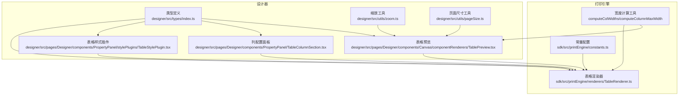
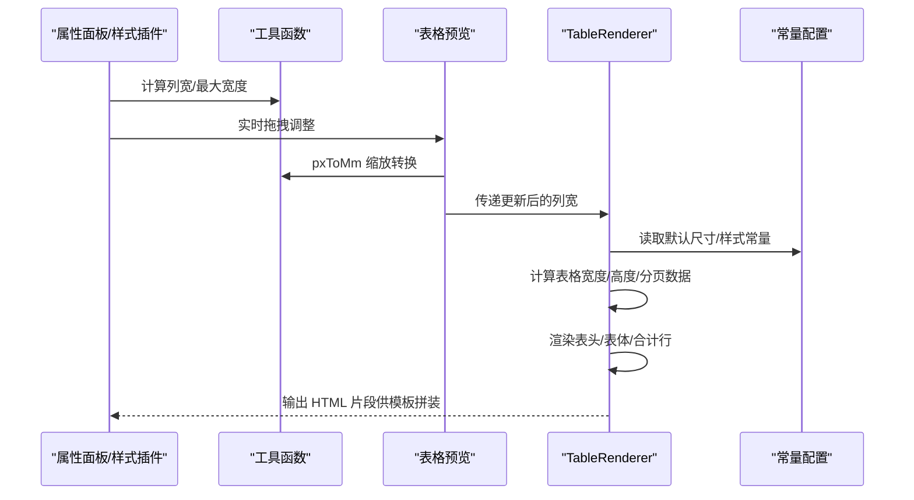
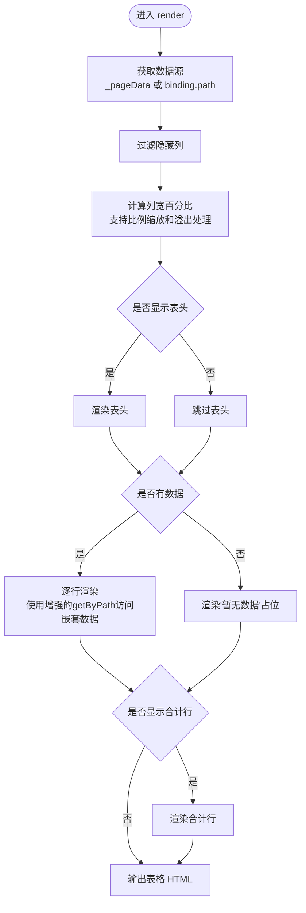
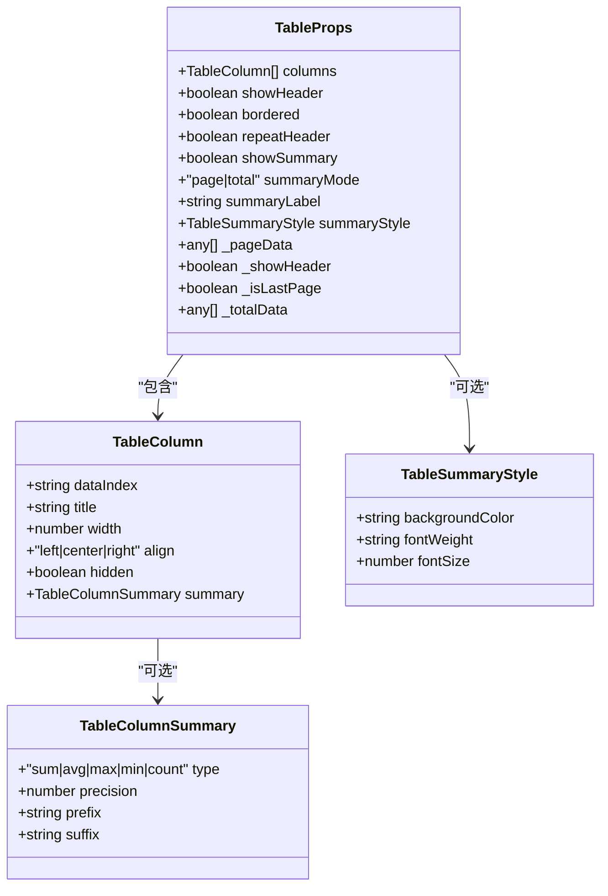
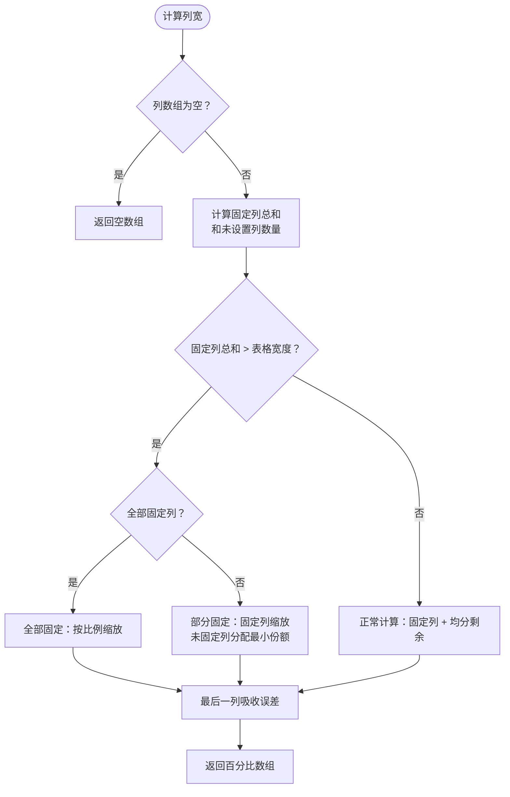
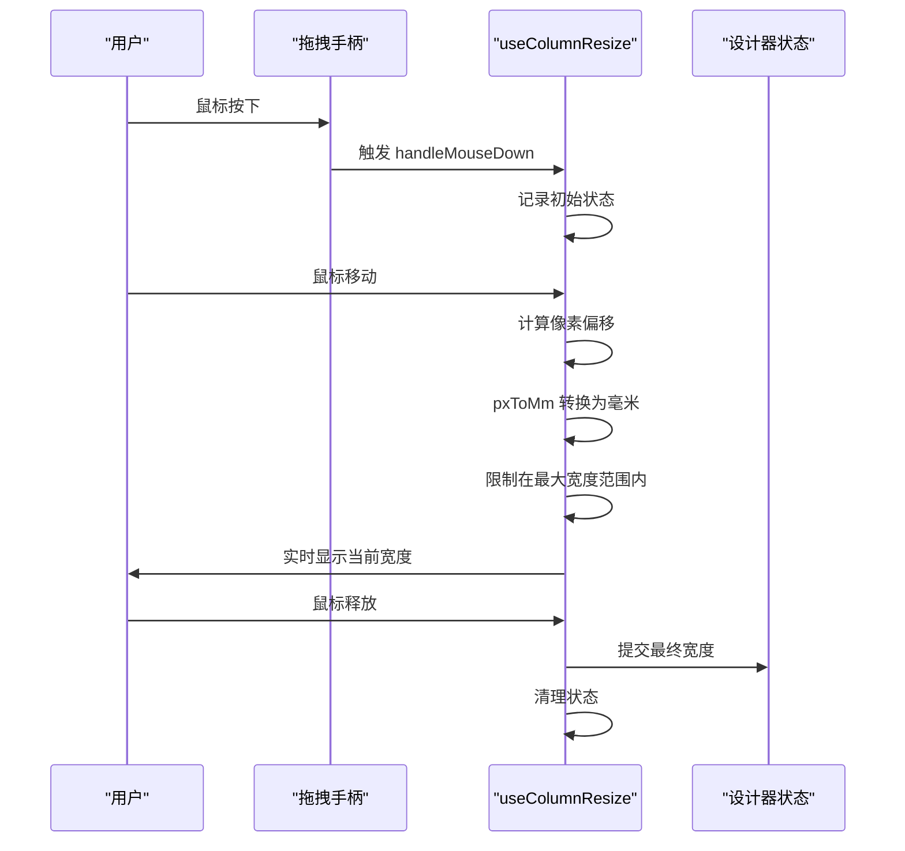
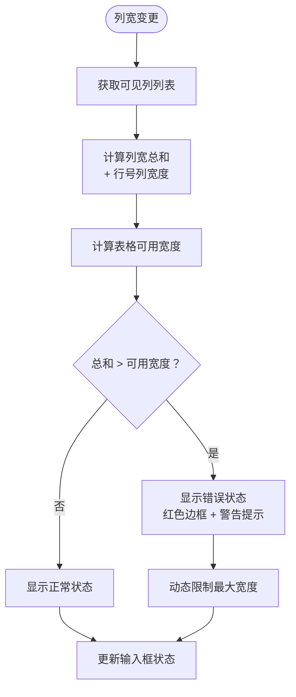
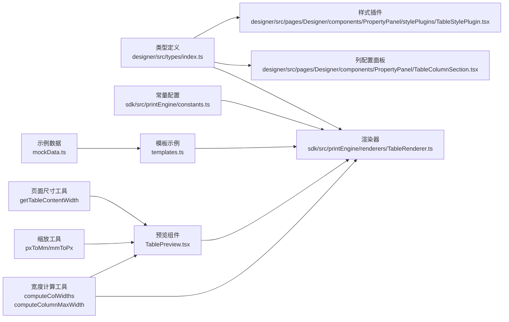

# 表格组件模型

<cite>
**本文引用的文件**
- [designer/src/types/index.ts](file://designer/src/types/index.ts)
- [sdk/src/printEngine/renderers/TableRenderer.ts](file://sdk/src/printEngine/renderers/TableRenderer.ts)
- [designer/src/pages/Designer/components/Canvas/componentRenderers/TablePreview.tsx](file://designer/src/pages/Designer/components/Canvas/componentRenderers/TablePreview.tsx)
- [designer/src/pages/Designer/components/PropertyPanel/TableColumnSection.tsx](file://designer/src/pages/Designer/components/PropertyPanel/TableColumnSection.tsx)
- [designer/src/pages/Designer/components/PropertyPanel/stylePlugins/TableStylePlugin.tsx](file://designer/src/pages/Designer/components/PropertyPanel/stylePlugins/TableStylePlugin.tsx)
- [sdk/src/printEngine/constants.ts](file://sdk/src/printEngine/constants.ts)
- [designer/src/constants/index.ts](file://designer/src/constants/index.ts)
- [designer/src/utils/zoom.ts](file://designer/src/utils/zoom.ts)
- [designer/src/utils/pageSize.ts](file://designer/src/utils/pageSize.ts)
- [server/src/routes/mockData.ts](file://server/src/routes/mockData.ts)
- [designer/mock/mockData.ts](file://designer/mock/mockData.ts)
- [designer/mock/templates.ts](file://designer/mock/templates.ts)
</cite>

## 更新摘要
**变更内容**
- 新增毫米精度控制功能，列宽支持0.1mm精度（precision=1）
- 实时溢出检测机制，属性面板实时显示列宽总和与表格宽度对比
- 完整的拖拽调整功能，支持鼠标拖拽精确调整列宽
- 增强的宽度计算算法，支持复杂的比例缩放和溢出处理
- 最大宽度计算功能，动态计算每列的最大允许宽度
- 表格预览支持实时拖拽调整，提供即时反馈

## 目录
1. [简介](#简介)
2. [项目结构](#项目结构)
3. [核心组件](#核心组件)
4. [架构概览](#架构概览)
5. [详细组件分析](#详细组件分析)
6. [列宽管理功能](#列宽管理功能)
7. [拖拽调整机制](#拖拽调整机制)
8. [实时溢出检测](#实时溢出检测)
9. [依赖分析](#依赖分析)
10. [性能考量](#性能考量)
11. [故障排查指南](#故障排查指南)
12. [结论](#结论)
13. [附录](#附录)

## 简介
本文件系统性地梳理并说明打印平台表格组件的模型设计与实现，覆盖以下关键点：
- TableProps 表格属性的完整定义：列配置、表头显示、边框设置、跨页重复表头、合计行控制与样式等。
- TableColumn 表格列模型：列标识、标题、宽度、对齐方式、隐藏设置、合计配置等。
- TableColumnSummary 表格列合计配置：聚合类型、精度设置、前后缀等。
- TableSummaryStyle 合计行样式：背景色、字重、字号等。
- **新增**：毫米精度控制（0.1mm）、实时溢出检测、拖拽调整功能。
- **新增**：增强的宽度计算算法，支持复杂的比例缩放和溢出处理。
- 完整使用示例与配置指南，帮助开发者创建复杂打印场景下的表格。

## 项目结构
表格组件涉及设计器与打印引擎两部分，现已增强列宽管理功能：
- 设计器侧负责可视化配置与预览，包括列管理、样式插件、属性面板等。
- 打印引擎侧负责将组件树渲染为最终可打印的 HTML，并支持跨页拆分与合计行渲染。

**图表来源**
- [designer/src/types/index.ts:82-121](file://designer/src/types/index.ts#L82-L121)
- [sdk/src/printEngine/renderers/TableRenderer.ts:1-275](file://sdk/src/printEngine/renderers/TableRenderer.ts#L1-L275)
- [designer/src/pages/Designer/components/Canvas/componentRenderers/TablePreview.tsx:1-55](file://designer/src/pages/Designer/components/Canvas/componentRenderers/TablePreview.tsx#L1-L55)
- [designer/src/pages/Designer/components/PropertyPanel/TableColumnSection.tsx:1-295](file://designer/src/pages/Designer/components/PropertyPanel/TableColumnSection.tsx#L1-L295)
- [designer/src/pages/Designer/components/PropertyPanel/stylePlugins/TableStylePlugin.tsx:1-46](file://designer/src/pages/Designer/components/PropertyPanel/stylePlugins/TableStylePlugin.tsx#L1-L46)
- [sdk/src/printEngine/constants.ts:48-92](file://sdk/src/printEngine/constants.ts#L48-L92)
- [designer/src/utils/zoom.ts:30-42](file://designer/src/utils/zoom.ts#L30-L42)
- [designer/src/utils/pageSize.ts:27-49](file://designer/src/utils/pageSize.ts#L27-L49)

**章节来源**
- [designer/src/types/index.ts:82-121](file://designer/src/types/index.ts#L82-L121)
- [sdk/src/printEngine/renderers/TableRenderer.ts:1-275](file://sdk/src/printEngine/renderers/TableRenderer.ts#L1-L275)

## 核心组件
本节从类型定义出发，逐项解释表格组件的关键模型与属性。

- 表格列模型 TableColumn
  - dataIndex：字段名，用于从数据源取值。**支持嵌套路径**，如"product.name"。
  - title：列标题，作为表头显示。
  - width：列宽度（单位：mm），用于布局与跨页拆分。**支持0.1mm精度**。
  - align：对齐方式（left/center/right），影响单元格文本对齐。
  - hidden：是否隐藏该列。
  - summary：列合计配置（可选）。

- 表格列合计配置 TableColumnSummary
  - type：聚合类型（sum/avg/max/min/count）。
  - precision：小数位数，默认 2。
  - prefix/suffix：数值前后缀，如货币符号或单位。

- 合计行样式 TableSummaryStyle
  - backgroundColor：背景色。
  - fontWeight：字重。
  - fontSize：字号（px）。

- 表格组件属性 TableProps
  - columns：列配置数组。
  - showHeader：是否显示表头。
  - bordered：是否显示边框。
  - repeatHeader：跨页重复表头（与分页策略配合）。
  - showSummary：是否显示合计行。
  - summaryMode：合计模式（page/total）。
  - summaryLabel：合计行首列标签（默认"合计"）。
  - summaryStyle：合计行样式。
  - _pageData/_showHeader/_isLastPage/_totalData：内部分页与渲染状态（不建议外部直接修改）。

**章节来源**
- [designer/src/types/index.ts:82-121](file://designer/src/types/index.ts#L82-L121)

## 架构概览
表格组件在设计器与打印引擎之间的交互流程如下，现已集成增强的列宽管理功能：

**图表来源**
- [sdk/src/printEngine/renderers/TableRenderer.ts:14-151](file://sdk/src/printEngine/renderers/TableRenderer.ts#L14-L151)
- [sdk/src/printEngine/constants.ts:48-92](file://sdk/src/printEngine/constants.ts#L48-L92)
- [designer/src/types/index.ts:90-121](file://designer/src/types/index.ts#L90-L121)
- [designer/src/utils/zoom.ts:30-42](file://designer/src/utils/zoom.ts#L30-L42)

## 详细组件分析

### 表格渲染器（TableRenderer）
- 数据来源优先级：props._pageData（分页片段） > binding.path（完整数据）。
- 可视列过滤：仅渲染未隐藏的列。
- 表头与表体：根据默认高度与行高系数计算行高；支持跨页重复表头。
- 合计行：按 summaryMode 决定是否显示；total 模式使用全量数据，page 模式使用当前页数据；支持自定义标签与样式。
- 数值计算：使用高精度库进行 sum/avg/max/min/count，支持 precision、prefix/suffix 格式化。
- **增强的宽度计算**：支持复杂的比例缩放和溢出处理，确保表格布局的稳定性。
- **嵌套路径支持**：通过增强的getByPath函数支持复杂的嵌套对象访问。

**图表来源**
- [sdk/src/printEngine/renderers/TableRenderer.ts:14-151](file://sdk/src/printEngine/renderers/TableRenderer.ts#L14-L151)
- [sdk/src/printEngine/renderers/TableRenderer.ts:156-201](file://sdk/src/printEngine/renderers/TableRenderer.ts#L156-L201)
- [sdk/src/printEngine/renderers/TableRenderer.ts:206-257](file://sdk/src/printEngine/renderers/TableRenderer.ts#L206-L257)

**章节来源**
- [sdk/src/printEngine/renderers/TableRenderer.ts:14-275](file://sdk/src/printEngine/renderers/TableRenderer.ts#L14-L275)
- [sdk/src/printEngine/constants.ts:48-92](file://sdk/src/printEngine/constants.ts#L48-L92)

### 表格列管理（Property Panel）
- 支持添加/删除列、上下移动列顺序、切换列显隐。
- 列标题与 dataIndex 的编辑。**dataIndex 现在支持嵌套路径**，如"product.name"。
- **增强的列宽配置**：支持0.1mm精度的列宽输入，实时显示列宽总和与表格宽度对比。
- 合计配置面板：聚合类型、精度、前后缀。
- 表格级开关：显示表头、显示边框、显示合计行、合计模式（page/total）。

**图表来源**
- [designer/src/types/index.ts:82-121](file://designer/src/types/index.ts#L82-L121)

**章节来源**
- [designer/src/pages/Designer/components/PropertyPanel/TableColumnSection.tsx:1-295](file://designer/src/pages/Designer/components/PropertyPanel/TableColumnSection.tsx#L1-L295)
- [designer/src/types/index.ts:82-121](file://designer/src/types/index.ts#L82-L121)

### 表格样式插件（TableStylePlugin）
- 提供字体大小与对齐方式的可视化配置，作用于表格单元格内容。
- 与渲染器中的默认样式常量协同工作，确保一致的视觉表现。

**章节来源**
- [designer/src/pages/Designer/components/PropertyPanel/stylePlugins/TableStylePlugin.tsx:1-46](file://designer/src/pages/Designer/components/PropertyPanel/stylePlugins/TableStylePlugin.tsx#L1-L46)
- [sdk/src/printEngine/constants.ts:63-92](file://sdk/src/printEngine/constants.ts#L63-L92)

### 表格预览（TablePreview）
- 设计器画布上的表格预览组件，体现基本的表头、边框、对齐与占位提示。
- **增强的预览功能**：支持实时拖拽调整列宽，提供即时的视觉反馈。
- 用于在设计阶段直观查看表格效果。

**章节来源**
- [designer/src/pages/Designer/components/Canvas/componentRenderers/TablePreview.tsx:1-55](file://designer/src/pages/Designer/components/Canvas/componentRenderers/TablePreview.tsx#L1-L55)

## 列宽管理功能

### 增强的宽度计算算法
表格渲染器现在支持复杂的列宽管理，通过增强的宽度计算函数实现：

- **毫米精度控制**：列宽支持0.1mm精度，提供更精细的布局控制
- **智能比例缩放**：当固定列总和超过表格宽度时，自动按比例缩放
- **溢出处理机制**：实时检测并处理列宽溢出，确保表格布局稳定
- **最后列误差修正**：自动修正舍入误差，确保总和严格等于100%

**图表来源**
- [sdk/src/printEngine/renderers/TableRenderer.ts:51-125](file://sdk/src/printEngine/renderers/TableRenderer.ts#L51-L125)

### 最大宽度计算功能
新增的computeColumnMaxWidth函数提供动态的最大宽度计算：

- **实时计算**：根据当前表格宽度、其他列的宽度和预留宽度动态计算
- **预留宽度支持**：考虑行号列等预留空间的影响
- **最小宽度保护**：确保计算结果至少为1mm
- **精确控制**：为拖拽调整提供精确的边界限制

**章节来源**
- [sdk/src/printEngine/renderers/TableRenderer.ts:51-145](file://sdk/src/printEngine/renderers/TableRenderer.ts#L51-L145)

## 拖拽调整机制

### 实时拖拽调整功能
设计器实现了完整的列宽拖拽调整机制：

- **拖拽手柄**：在表头右侧显示8px宽的拖拽手柄，鼠标悬停时显示半透明效果
- **实时预览**：拖拽过程中实时显示当前列宽（精确到0.1mm）
- **缩放适配**：通过pxToMm函数将像素偏移转换为毫米，适配不同缩放级别
- **边界限制**：自动限制拖拽范围，确保不超过最大允许宽度
- **平滑提交**：拖拽结束后一次性提交到设计器状态，避免频繁的历史记录写入

**图表来源**
- [designer/src/pages/Designer/components/Canvas/componentRenderers/TablePreview.tsx:12-64](file://designer/src/pages/Designer/components/Canvas/componentRenderers/TablePreview.tsx#L12-L64)
- [designer/src/utils/zoom.ts:30-42](file://designer/src/utils/zoom.ts#L30-L42)

### 拖拽手柄样式
拖拽手柄具有精美的视觉效果：

- **基础样式**：8px圆形手柄，蓝色背景，白色边框
- **悬停效果**：鼠标悬停时增大1.2倍，显示蓝色阴影
- **激活状态**：鼠标按下时变为深蓝色，缩小1.1倍
- **透明度过渡**：0.15秒的透明度过渡动画
- **定位精确**：绝对定位在表头右侧，覆盖整个表头高度

**章节来源**
- [designer/src/pages/Designer/components/Canvas/componentRenderers/TablePreview.tsx:140-155](file://designer/src/pages/Designer/components/Canvas/componentRenderers/TablePreview.tsx#L140-L155)

## 实时溢出检测

### 智能溢出检测机制
属性面板实现了实时的列宽溢出检测：

- **总和计算**：仅统计可见列的宽度总和，包括行号列宽度
- **实时监控**：当列宽总和超过表格可用宽度时，显示错误状态
- **视觉反馈**：输入框变为红色，显示溢出警告提示
- **最大宽度限制**：动态计算并限制每个列的最大允许宽度
- **精确到0.1mm**：支持0.1mm精度的宽度输入和显示

**图表来源**
- [designer/src/pages/Designer/components/PropertyPanel/TableColumnSection.tsx:28-35](file://designer/src/pages/Designer/components/PropertyPanel/TableColumnSection.tsx#L28-L35)

### 溢出检测的实现细节
- **可见列过滤**：仅统计未隐藏列的宽度，隐藏列不计入总和
- **行号列考虑**：如果显示序号列，会将行号列宽度计入总和
- **动态限制**：使用computeColumnMaxWidth函数动态计算每列的最大允许宽度
- **精确显示**：总和和表格宽度都精确到0.1mm显示
- **实时反馈**：用户输入时立即检测并更新状态

**章节来源**
- [designer/src/pages/Designer/components/PropertyPanel/TableColumnSection.tsx:28-547](file://designer/src/pages/Designer/components/PropertyPanel/TableColumnSection.tsx#L28-L547)

## 依赖分析
- 类型定义集中于 designer/src/types/index.ts，被渲染器与属性面板共同引用。
- 渲染器依赖常量配置（默认尺寸、样式默认值、单位换算）。
- **新增**：宽度计算工具函数（computeColWidths、computeColumnMaxWidth）在渲染器和预览组件中复用。
- **新增**：缩放工具函数（pxToMm、mmToPx）在拖拽调整中提供像素到毫米的精确转换。
- **新增**：页面尺寸工具函数（getTableContentWidth）确保设计器和渲染器使用一致的宽度计算。
- 属性面板与样式插件负责将用户配置写回组件 props/style。
- 预览组件用于设计期反馈，现集成了拖拽调整功能。
- 示例数据和模板文件为嵌套对象支持提供实际应用场景。

**图表来源**
- [designer/src/types/index.ts:90-121](file://designer/src/types/index.ts#L90-L121)
- [sdk/src/printEngine/renderers/TableRenderer.ts:1-275](file://sdk/src/printEngine/renderers/TableRenderer.ts#L1-L275)
- [sdk/src/printEngine/constants.ts:48-92](file://sdk/src/printEngine/constants.ts#L48-L92)
- [designer/src/utils/zoom.ts:30-42](file://designer/src/utils/zoom.ts#L30-L42)
- [designer/src/utils/pageSize.ts:27-49](file://designer/src/utils/pageSize.ts#L27-L49)
- [designer/mock/mockData.ts:369-422](file://designer/mock/mockData.ts#L369-L422)
- [designer/mock/templates.ts:290-342](file://designer/mock/templates.ts#L290-L342)

**章节来源**
- [designer/src/types/index.ts:90-121](file://designer/src/types/index.ts#L90-L121)
- [sdk/src/printEngine/renderers/TableRenderer.ts:1-275](file://sdk/src/printEngine/renderers/TableRenderer.ts#L1-L275)

## 性能考量
- 数值计算采用高精度库，避免浮点误差，适合财务类合计。
- 合计模式 total 会使用全量数据，注意大数据量时的内存与计算开销。
- 表格高度估算基于默认行高与行高系数，实际渲染高度可能因文本换行而变化。
- 边框与内边距的样式合并字符串构建，避免频繁 DOM 操作。
- **增强的宽度计算**：computeColWidths函数经过优化，支持复杂的比例缩放但保持良好性能。
- **拖拽性能优化**：useColumnResize钩子使用ref缓存回调函数，避免不必要的重新渲染。
- **溢出检测优化**：实时计算使用O(n)算法，其中n为可见列数量，性能开销可控。
- **嵌套路径访问**：getByPath函数的递归访问可能影响性能，建议在大量数据场景下优化路径深度。

## 故障排查指南
- 合计显示异常
  - 检查 summaryMode 与 _isLastPage/_totalData 的组合是否正确。
  - 确认列的 summary 配置（type/precision/prefix/suffix）。
- 跨页重复表头无效
  - 确认 repeatHeader 开启，且渲染器识别到分页数据（_pageData）。
- **列宽溢出问题**
  - 检查属性面板的溢出警告，确认列宽总和是否超过表格可用宽度。
  - 使用拖拽手柄调整列宽，确保不超过最大允许宽度。
  - 验证computeColumnMaxWidth函数的计算结果是否合理。
- **拖拽调整失效**
  - 检查pxToMm函数的缩放级别参数是否正确。
  - 确认拖拽手柄的事件监听是否正常工作。
  - 验证设计器状态更新逻辑是否正确。
- 表格宽度溢出
  - 渲染器会在检测到 xMm + widthMm 超出可用宽度时自动调整，必要时降低宽度或减少列数。
- 预览与实际打印差异
  - 预览组件为设计期展示，实际打印以渲染器输出为准；检查样式与分页逻辑。
- **嵌套数据访问失败**
  - 检查dataIndex路径是否正确，确认嵌套对象结构匹配。
  - 验证getByPath函数的路径解析，确保中间节点不为null/undefined。

**章节来源**
- [sdk/src/printEngine/renderers/TableRenderer.ts:38-69](file://sdk/src/printEngine/renderers/TableRenderer.ts#L38-L69)
- [sdk/src/printEngine/renderers/TableRenderer.ts:130-149](file://sdk/src/printEngine/renderers/TableRenderer.ts#L130-L149)

## 结论
表格组件通过清晰的类型模型与渲染器实现，提供了灵活的列配置、样式控制与合计能力。**新增的列宽管理功能**大幅增强了组件的实用性和用户体验：

- **毫米精度控制**：支持0.1mm精度的列宽设置，提供更精细的布局控制
- **实时溢出检测**：属性面板实时监控列宽总和，及时发现并提醒潜在问题
- **拖拽调整功能**：提供直观的鼠标拖拽调整体验，支持精确的宽度控制
- **增强的宽度计算**：支持复杂的比例缩放和溢出处理，确保表格布局的稳定性

这些增强功能使得表格组件能够更好地适应复杂的打印场景需求，特别是在需要精确控制布局和处理大量数据的场景中。建议在大数据量场景下合理选择合计模式与精度设置，以平衡性能与准确性。

## 附录

### 使用示例与配置指南
- 基础表格
  - 在属性面板勾选"显示表头""显示边框"，设置列标题与 dataIndex。
  - 为需要合计的列配置 summary（聚合类型、精度、前后缀）。
- 合计行
  - 开启"显示合计行"，选择"每页合计"或"仅最后一页合计"。
  - 自定义"合计行首列标签"与"合计行样式"（背景色、字重、字号）。
- 跨页打印
  - 在分页策略中启用"跨页重复表头"，渲染器将自动处理分页与表头重复。
- 数据绑定
  - 通过 binding.path 指向数据源数组；若需跨页拆分，提供 props._pageData 与 props._totalData。
- **列宽管理**
  - **毫米精度设置**：列宽输入支持0.1mm精度，如"60.5mm"。
  - **拖拽调整**：在表格预览中点击表头右侧拖拽手柄，实时调整列宽。
  - **溢出检测**：属性面板会实时显示列宽总和与表格宽度对比，超限时显示错误状态。
  - **最大宽度限制**：系统会根据其他列的宽度动态计算当前列的最大允许宽度。
- **嵌套对象配置**
  - 在dataIndex中使用点号分隔的嵌套路径，如"product.name"、"customer.address.city"。
  - 确保数据结构与路径完全匹配，避免访问null/undefined值。
  - 利用示例数据中的嵌套结构进行配置验证。
- 示例数据参考
  - 服务端内置示例数据包含多份订单与大量明细，可用于测试大表格与合计逻辑。
  - 采购订单示例展示了完整的嵌套对象结构和对应的表格配置。

**章节来源**
- [designer/src/pages/Designer/components/PropertyPanel/TableColumnSection.tsx:72-107](file://designer/src/pages/Designer/components/PropertyPanel/TableColumnSection.tsx#L72-L107)
- [sdk/src/printEngine/renderers/TableRenderer.ts:130-149](file://sdk/src/printEngine/renderers/TableRenderer.ts#L130-L149)
- [server/src/routes/mockData.ts:16-177](file://server/src/routes/mockData.ts#L16-L177)
- [designer/mock/mockData.ts:369-422](file://designer/mock/mockData.ts#L369-L422)
- [designer/mock/templates.ts:290-342](file://designer/mock/templates.ts#L290-L342)