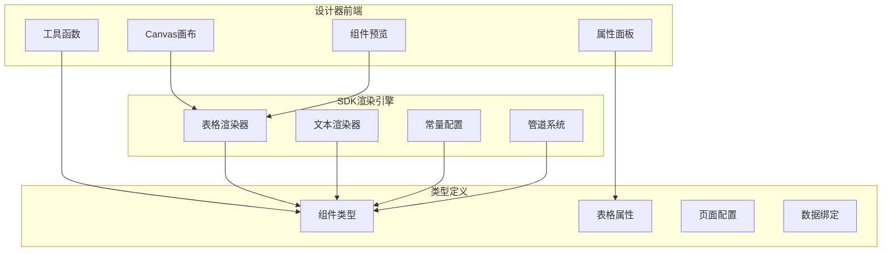
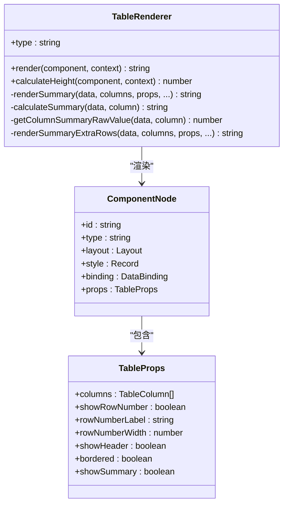
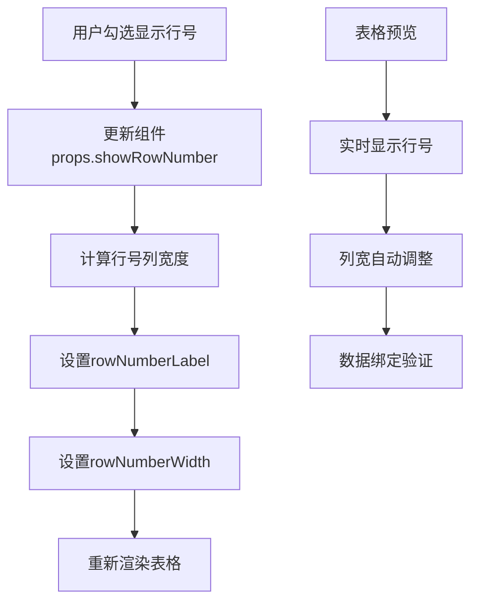
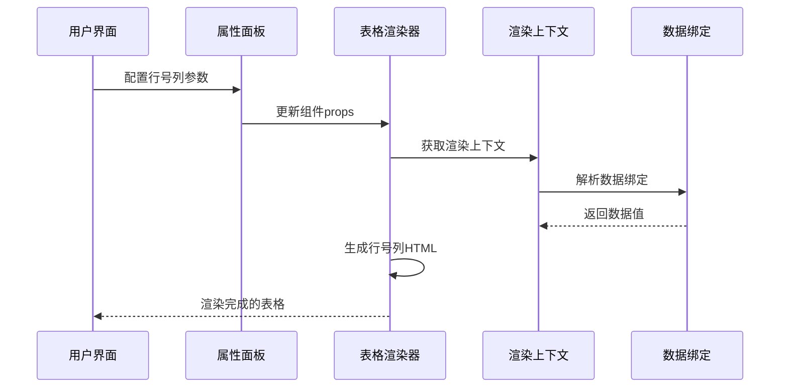
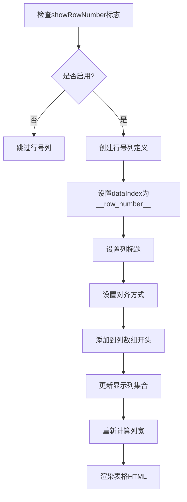
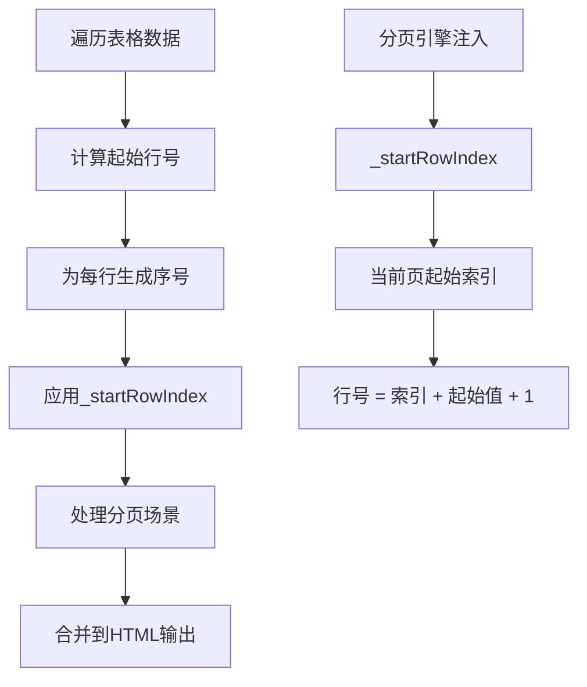
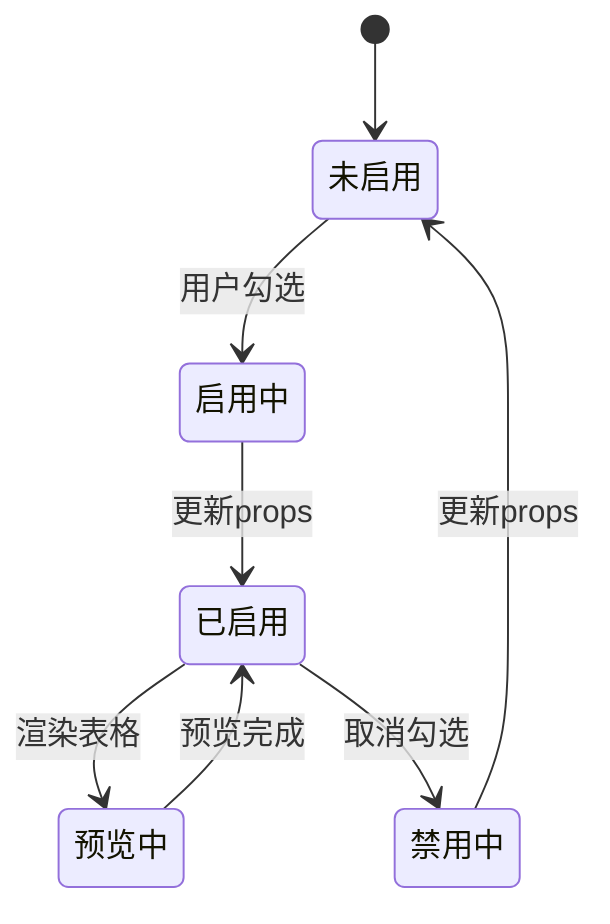
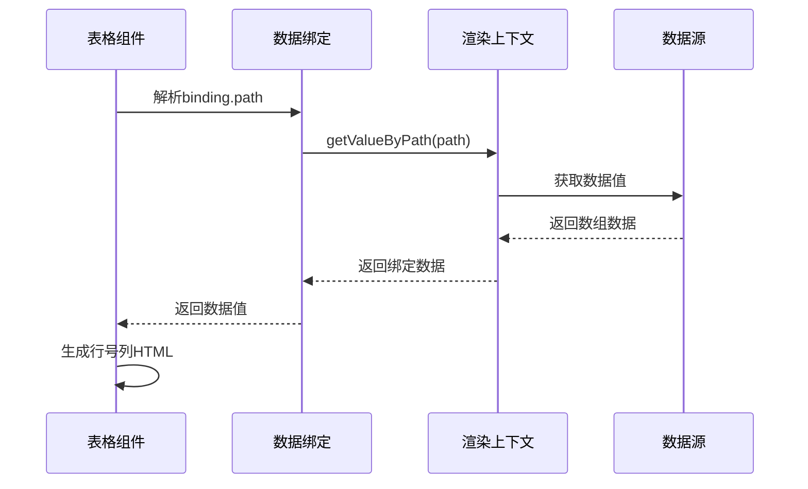
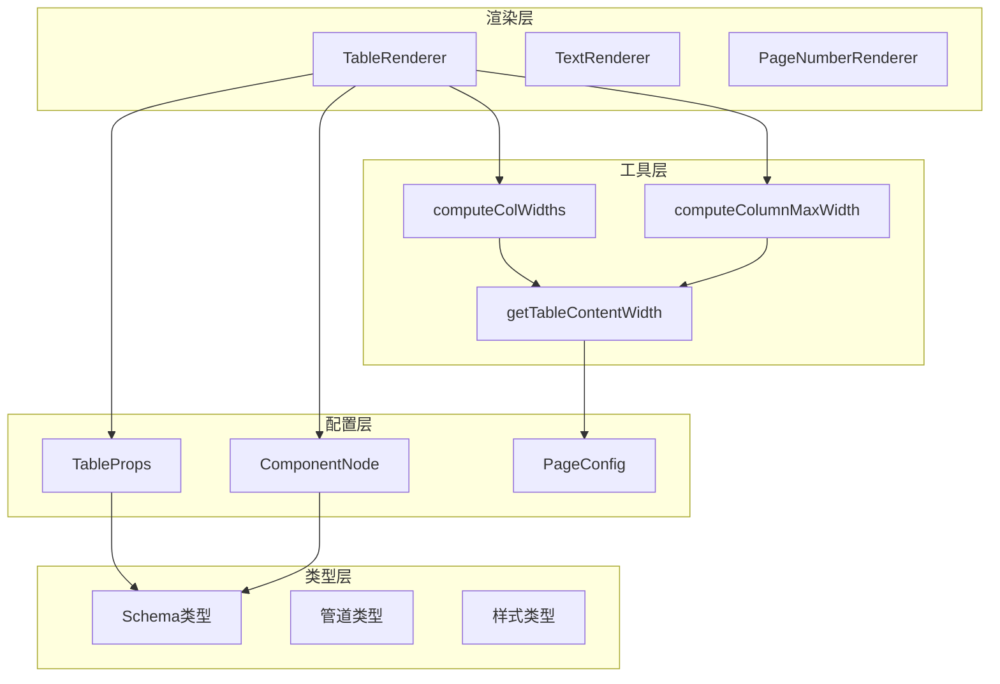

# 行号列支持

<cite>
**本文档引用的文件**
- [TableRenderer.ts](file://sdk/src/printEngine/renderers/TableRenderer.ts)
- [TableColumnSection.tsx](file://designer/src/pages/Designer/components/PropertyPanel/TableColumnSection.tsx)
- [TablePreview.tsx](file://designer/src/pages/Designer/components/Canvas/componentRenderers/TablePreview.tsx)
- [index.ts](file://designer/src/types/index.ts)
- [pageSize.ts](file://designer/src/utils/pageSize.ts)
- [constants.ts](file://sdk/src/printEngine/constants.ts)
- [PageNumberRenderer.ts](file://sdk/src/printEngine/renderers/PageNumberRenderer.ts)
- [example.html](file://sdk/example.html)
</cite>

## 目录
1. [简介](#简介)
2. [项目结构](#项目结构)
3. [核心组件](#核心组件)
4. [架构概览](#架构概览)
5. [详细组件分析](#详细组件分析)
6. [依赖关系分析](#依赖关系分析)
7. [性能考虑](#性能考虑)
8. [故障排除指南](#故障排除指南)
9. [结论](#结论)

## 简介

本文档深入分析了打印设计器中的"行号列支持"功能，这是一个为表格组件提供自动行号显示的核心特性。该功能允许用户在表格的第一列自动显示递增的行号，支持自定义行号标签和宽度配置，为数据展示提供了更好的可读性和导航体验。

行号列支持涉及前端设计器界面、后端渲染引擎以及完整的数据绑定流程，是一个跨层的系统性功能。本文将从架构设计、组件实现、数据流处理等多个维度进行全面分析。

## 项目结构

该项目采用模块化的前端架构，主要分为三个核心部分：

**图表来源**
- [TableRenderer.ts:147-602](file://sdk/src/printEngine/renderers/TableRenderer.ts#L147-L602)
- [TableColumnSection.tsx:1-718](file://designer/src/pages/Designer/components/PropertyPanel/TableColumnSection.tsx#L1-L718)
- [TablePreview.tsx:1-175](file://designer/src/pages/Designer/components/Canvas/componentRenderers/TablePreview.tsx#L1-L175)

**章节来源**
- [TableRenderer.ts:1-602](file://sdk/src/printEngine/renderers/TableRenderer.ts#L1-L602)
- [TableColumnSection.tsx:1-718](file://designer/src/pages/Designer/components/PropertyPanel/TableColumnSection.tsx#L1-L718)
- [TablePreview.tsx:1-175](file://designer/src/pages/Designer/components/Canvas/componentRenderers/TablePreview.tsx#L1-L175)

## 核心组件

### 表格渲染器（TableRenderer）

表格渲染器是行号列支持的核心实现组件，负责将表格数据渲染为HTML，并处理行号列的生成逻辑。

**图表来源**
- [TableRenderer.ts:147-602](file://sdk/src/printEngine/renderers/TableRenderer.ts#L147-L602)
- [index.ts:256-297](file://designer/src/types/index.ts#L256-L297)

### 设计器属性面板

属性面板提供了行号列的可视化配置界面，包括显示开关、标签定制和宽度设置。

**图表来源**
- [TableColumnSection.tsx:414-448](file://designer/src/pages/Designer/components/PropertyPanel/TableColumnSection.tsx#L414-L448)
- [TablePreview.tsx:77-87](file://designer/src/pages/Designer/components/Canvas/componentRenderers/TablePreview.tsx#L77-L87)

**章节来源**
- [TableRenderer.ts:168-178](file://sdk/src/printEngine/renderers/TableRenderer.ts#L168-L178)
- [TableColumnSection.tsx:414-448](file://designer/src/pages/Designer/components/PropertyPanel/TableColumnSection.tsx#L414-L448)
- [TablePreview.tsx:69-107](file://designer/src/pages/Designer/components/Canvas/componentRenderers/TablePreview.tsx#L69-L107)

## 架构概览

行号列支持的实现采用了分层架构设计，确保了功能的模块化和可维护性：

**图表来源**
- [TableRenderer.ts:150-327](file://sdk/src/printEngine/renderers/TableRenderer.ts#L150-L327)
- [TableColumnSection.tsx:414-448](file://designer/src/pages/Designer/components/PropertyPanel/TableColumnSection.tsx#L414-L448)

该架构的关键特点包括：

1. **分离关注点**：渲染逻辑与UI配置分离
2. **数据驱动**：通过props和binding实现数据绑定
3. **可扩展性**：支持自定义行号格式和样式
4. **一致性**：设计器和渲染引擎使用相同的计算逻辑

## 详细组件分析

### 表格渲染器实现

表格渲染器实现了完整的行号列生成功能，包括以下核心逻辑：

#### 行号列生成算法

**图表来源**
- [TableRenderer.ts:168-178](file://sdk/src/printEngine/renderers/TableRenderer.ts#L168-L178)
- [TableRenderer.ts:284-292](file://sdk/src/printEngine/renderers/TableRenderer.ts#L284-L292)

#### 行号计算逻辑

行号列的实现采用了动态计算的方式，确保在数据变化时能够正确更新：

**图表来源**
- [TableRenderer.ts:284-292](file://sdk/src/printEngine/renderers/TableRenderer.ts#L284-L292)
- [TableRenderer.ts:284-292](file://sdk/src/printEngine/renderers/TableRenderer.ts#L284-L292)

**章节来源**
- [TableRenderer.ts:147-327](file://sdk/src/printEngine/renderers/TableRenderer.ts#L147-L327)

### 设计器属性面板实现

属性面板提供了直观的行号列配置界面：

#### 配置项设计

| 配置项 | 类型 | 默认值 | 描述 |
|--------|------|--------|------|
| showRowNumber | boolean | false | 是否显示行号列 |
| rowNumberLabel | string | "序号" | 行号列标题文本 |
| rowNumberWidth | number | undefined | 行号列宽度(mm) |

#### 实时预览机制

**图表来源**
- [TableColumnSection.tsx:414-448](file://designer/src/pages/Designer/components/PropertyPanel/TableColumnSection.tsx#L414-L448)
- [TablePreview.tsx:69-107](file://designer/src/pages/Designer/components/Canvas/componentRenderers/TablePreview.tsx#L69-L107)

**章节来源**
- [TableColumnSection.tsx:414-448](file://designer/src/pages/Designer/components/PropertyPanel/TableColumnSection.tsx#L414-L448)
- [TablePreview.tsx:69-107](file://designer/src/pages/Designer/components/Canvas/componentRenderers/TablePreview.tsx#L69-L107)

### 数据绑定集成

行号列支持与现有的数据绑定系统无缝集成：

#### 数据绑定流程

**图表来源**
- [TableRenderer.ts:158-162](file://sdk/src/printEngine/renderers/TableRenderer.ts#L158-L162)
- [TableRenderer.ts:284-292](file://sdk/src/printEngine/renderers/TableRenderer.ts#L284-L292)

**章节来源**
- [TableRenderer.ts:158-162](file://sdk/src/printEngine/renderers/TableRenderer.ts#L158-L162)

## 依赖关系分析

行号列支持功能涉及多个模块间的复杂依赖关系：

**图表来源**
- [TableRenderer.ts:1-602](file://sdk/src/printEngine/renderers/TableRenderer.ts#L1-L602)
- [TableColumnSection.tsx:1-718](file://designer/src/pages/Designer/components/PropertyPanel/TableColumnSection.tsx#L1-L718)
- [pageSize.ts:27-49](file://designer/src/utils/pageSize.ts#L27-L49)

**章节来源**
- [TableRenderer.ts:1-602](file://sdk/src/printEngine/renderers/TableRenderer.ts#L1-L602)
- [TableColumnSection.tsx:1-718](file://designer/src/pages/Designer/components/PropertyPanel/TableColumnSection.tsx#L1-L718)
- [pageSize.ts:1-50](file://designer/src/utils/pageSize.ts#L1-L50)

## 性能考虑

行号列支持在性能方面采用了多项优化策略：

### 渲染优化

1. **条件渲染**：只有在启用行号列时才进行相关计算
2. **缓存机制**：列宽计算结果在组件生命周期内缓存
3. **增量更新**：只更新受影响的DOM节点

### 内存管理

1. **垃圾回收**：及时清理事件监听器和临时变量
2. **内存泄漏防护**：在组件卸载时清理所有订阅

### 计算效率

1. **算法优化**：行号计算采用O(n)时间复杂度
2. **批量操作**：属性变更采用批量更新策略

## 故障排除指南

### 常见问题及解决方案

#### 问题1：行号列不显示

**可能原因**：
- `showRowNumber`属性未设置为true
- 表格数据为空
- 列宽计算异常

**解决步骤**：
1. 检查组件props中`showRowNumber`是否为true
2. 验证表格数据绑定是否正确
3. 查看浏览器控制台是否有错误信息

#### 问题2：行号显示异常

**可能原因**：
- 分页场景下的起始行号计算错误
- 数据类型不匹配
- 样式冲突

**解决步骤**：
1. 检查分页配置和起始行号设置
2. 验证数据源的结构和类型
3. 检查CSS样式冲突

#### 问题3：列宽计算错误

**可能原因**：
- 行号列宽度设置过大
- 可用宽度计算错误
- 浏览器缩放影响

**解决步骤**：
1. 检查行号列宽度设置是否合理
2. 验证表格可用宽度计算逻辑
3. 测试不同浏览器和缩放比例

**章节来源**
- [TableRenderer.ts:284-292](file://sdk/src/printEngine/renderers/TableRenderer.ts#L284-L292)
- [TableColumnSection.tsx:526-549](file://designer/src/pages/Designer/components/PropertyPanel/TableColumnSection.tsx#L526-L549)

## 结论

行号列支持功能展现了现代前端框架在复杂UI组件开发方面的成熟度。通过精心设计的架构和实现，该功能不仅提供了强大的用户体验，还保持了良好的性能表现和可维护性。

### 主要成就

1. **功能完整性**：实现了从基础显示到高级配置的完整行号列功能
2. **用户体验**：提供了直观的配置界面和实时预览
3. **技术先进性**：采用了现代化的React Hooks和TypeScript类型系统
4. **性能优化**：通过多种优化策略确保了良好的运行性能

### 技术亮点

- **数据驱动设计**：通过props和binding实现灵活的数据绑定
- **响应式架构**：支持动态配置和实时更新
- **类型安全**：完整的TypeScript类型定义确保编译时安全
- **模块化设计**：清晰的组件边界和职责分离

该行号列支持功能为整个打印设计器系统提供了重要的基础能力，为后续的功能扩展奠定了坚实的技术基础。