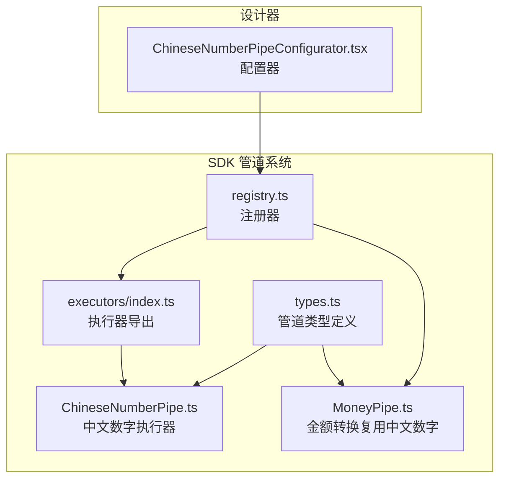
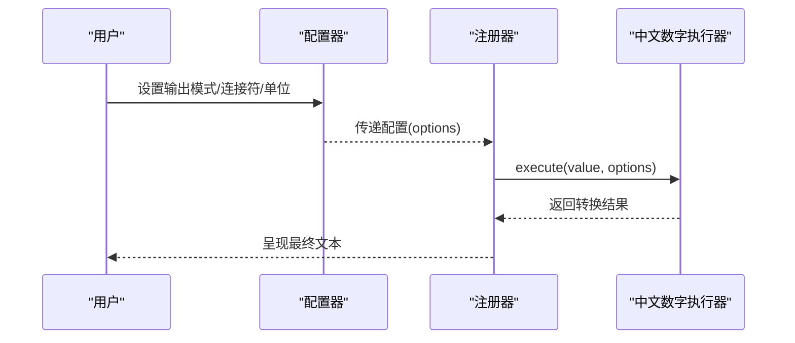
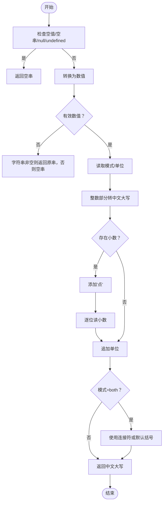
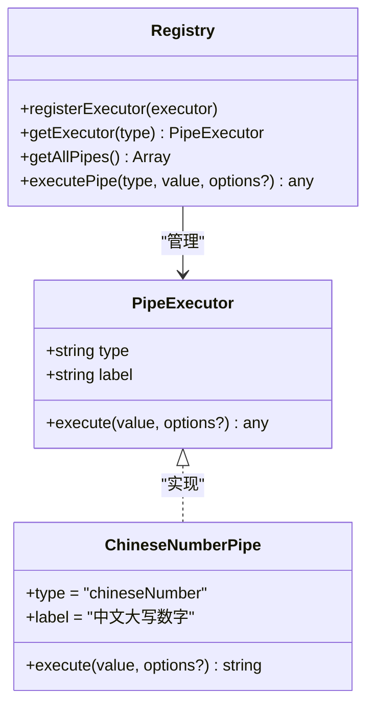
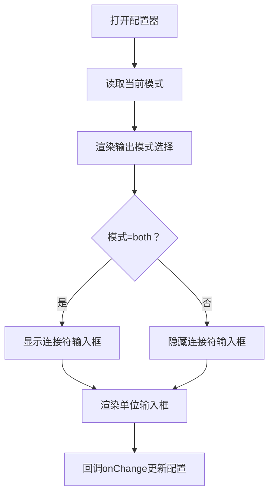
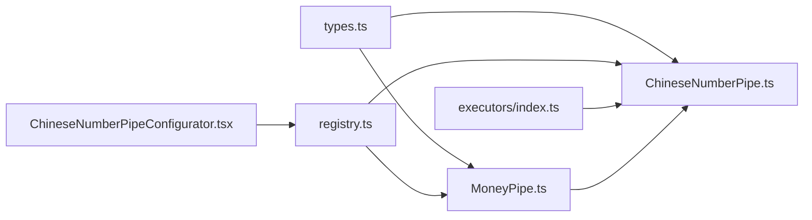

# 中文数字管道

<cite>
**本文引用的文件**
- [ChineseNumberPipe.ts](file://sdk/src/pipes/executors/ChineseNumberPipe.ts)
- [ChineseNumberPipeConfigurator.tsx](file://designer/src/pipes/configurators/ChineseNumberPipeConfigurator.tsx)
- [registry.ts](file://sdk/src/pipes/registry.ts)
- [executors/index.ts](file://sdk/src/pipes/executors/index.ts)
- [types.ts](file://sdk/src/pipes/types.ts)
- [MoneyPipe.ts](file://sdk/src/pipes/executors/MoneyPipe.ts)
</cite>

## 目录
1. [简介](#简介)
2. [项目结构](#项目结构)
3. [核心组件](#核心组件)
4. [架构总览](#架构总览)
5. [详细组件分析](#详细组件分析)
6. [依赖关系分析](#依赖关系分析)
7. [性能与复杂度](#性能与复杂度)
8. [配置与使用指南](#配置与使用指南)
9. [格式验证与错误处理](#格式验证与错误处理)
10. [应用场景与价值](#应用场景与价值)
11. [结论](#结论)

## 简介
中文数字管道用于将阿拉伯数字转换为中文大写形式，支持整数与小数、正数与负数，并可选附加单位与双模式输出（原值+中文大写）。该管道遵循中文数字读法的基本规则，覆盖“零”“拾”“佰”“仟”“万”“亿”等单位层级，适用于正式文档、票据打印、财务报表等对数字表达有规范要求的场景。

## 项目结构
中文数字管道位于 SDK 的管道系统中，通过注册器统一注册，设计器侧提供可视化配置器，运行时由执行器完成转换。

图表来源
- [registry.ts:54-65](file://sdk/src/pipes/registry.ts#L54-L65)
- [executors/index.ts:9](file://sdk/src/pipes/executors/index.ts#L9)
- [ChineseNumberPipe.ts:99-137](file://sdk/src/pipes/executors/ChineseNumberPipe.ts#L99-L137)
- [MoneyPipe.ts:59-130](file://sdk/src/pipes/executors/MoneyPipe.ts#L59-L130)
- [ChineseNumberPipeConfigurator.tsx:11-57](file://designer/src/pipes/configurators/ChineseNumberPipeConfigurator.tsx#L11-L57)
- [types.ts:11-29](file://sdk/src/pipes/types.ts#L11-L29)

章节来源
- [registry.ts:1-65](file://sdk/src/pipes/registry.ts#L1-L65)
- [executors/index.ts:1-45](file://sdk/src/pipes/executors/index.ts#L1-L45)
- [ChineseNumberPipe.ts:1-138](file://sdk/src/pipes/executors/ChineseNumberPipe.ts#L1-L138)
- [ChineseNumberPipeConfigurator.tsx:1-58](file://designer/src/pipes/configurators/ChineseNumberPipeConfigurator.tsx#L1-L58)
- [types.ts:1-30](file://sdk/src/pipes/types.ts#L1-L30)
- [MoneyPipe.ts:1-130](file://sdk/src/pipes/executors/MoneyPipe.ts#L1-L130)

## 核心组件
- 执行器接口：定义管道类型、标签与执行方法，确保所有执行器具有一致的调用契约。
- 中文数字执行器：负责将数值转换为中文大写，支持负数、小数、单位后缀与双模式输出。
- 注册器：集中注册与检索执行器，提供统一的执行入口。
- 配置器：在设计器中提供可视化配置项，包括输出模式、连接符与单位。
- 金额转换执行器：内部复用中文数字能力，实现“元/角/分/整”的会计规范转换。

章节来源
- [types.ts:11-29](file://sdk/src/pipes/types.ts#L11-L29)
- [ChineseNumberPipe.ts:99-137](file://sdk/src/pipes/executors/ChineseNumberPipe.ts#L99-L137)
- [registry.ts:44-52](file://sdk/src/pipes/registry.ts#L44-L52)
- [ChineseNumberPipeConfigurator.tsx:14-56](file://designer/src/pipes/configurators/ChineseNumberPipeConfigurator.tsx#L14-L56)
- [MoneyPipe.ts:8-8](file://sdk/src/pipes/executors/MoneyPipe.ts#L8)

## 架构总览
中文数字管道采用“执行器 + 注册器 + 配置器”的分层设计：
- 执行器层：实现具体转换逻辑。
- 注册器层：集中管理执行器，提供按类型获取与执行。
- 配置器层：在设计器中提供用户可编辑的参数界面。
- 类型层：约束执行器的结构与行为。

图表来源
- [ChineseNumberPipeConfigurator.tsx:14-56](file://designer/src/pipes/configurators/ChineseNumberPipeConfigurator.tsx#L14-L56)
- [registry.ts:44-52](file://sdk/src/pipes/registry.ts#L44-L52)
- [ChineseNumberPipe.ts:103-136](file://sdk/src/pipes/executors/ChineseNumberPipe.ts#L103-L136)

## 详细组件分析

### 中文数字执行器（ChineseNumberPipe）
- 功能要点
  - 整数转中文大写：支持“零”“壹”“贰”…“玖”，单位“拾”“佰”“仟”，以及“万”“亿”。
  - 小数处理：整数部分走整数转换流程；小数点后逐位读出。
  - 负数处理：在结果前加“负”字。
  - 模式控制：仅中文大写或“原值+中文大写”，后者可自定义连接符。
  - 单位后缀：可在最终结果追加单位（如“元”）。
  - 错误兜底：异常时回退为原始输入字符串，避免渲染中断。
- 数字范围与单位系统
  - 支持到“亿”级（4位一组，最多2组），超过9位直接返回原值字符串。
  - 单位层级：个/十/百/千（拾/佰/仟），每4位进位一次，带“万”“亿”。
- 特殊数字处理
  - 零：在需要的位置插入“零”，避免歧义。
  - 一十：自动省略“一十”中的“一”，例如“10”→“拾”（本实现按规则生成，若业务需要可进一步定制）。
- 读音与语法规则
  - 严格遵循中文数字读法规则，单位按位权递增，遇零按位置插入。
  - 小数点统一读作“点”，小数部分逐位对应“零/壹/贰/…”。
- 复杂度
  - 时间复杂度：O(k)，k为数字字符串长度。
  - 空间复杂度：O(k)，用于拼接结果。

图表来源
- [ChineseNumberPipe.ts:103-136](file://sdk/src/pipes/executors/ChineseNumberPipe.ts#L103-L136)
- [ChineseNumberPipe.ts:17-62](file://sdk/src/pipes/executors/ChineseNumberPipe.ts#L17-L62)
- [ChineseNumberPipe.ts:70-97](file://sdk/src/pipes/executors/ChineseNumberPipe.ts#L70-L97)

章节来源
- [ChineseNumberPipe.ts:1-138](file://sdk/src/pipes/executors/ChineseNumberPipe.ts#L1-L138)

### 执行器接口与注册器
- 接口约束
  - type：管道类型标识，全局唯一。
  - label：显示名称，用于 UI 展示。
  - execute：统一的执行入口，接收输入值与配置选项。
- 注册与执行
  - 注册器维护 Map 映射，提供按类型获取执行器与统一执行函数。
  - 未找到执行器时，返回原始值并告警，保证健壮性。

图表来源
- [types.ts:11-29](file://sdk/src/pipes/types.ts#L11-L29)
- [ChineseNumberPipe.ts:99-137](file://sdk/src/pipes/executors/ChineseNumberPipe.ts#L99-L137)
- [registry.ts:12-52](file://sdk/src/pipes/registry.ts#L12-L52)

章节来源
- [types.ts:1-30](file://sdk/src/pipes/types.ts#L1-L30)
- [registry.ts:1-65](file://sdk/src/pipes/registry.ts#L1-L65)
- [executors/index.ts:9](file://sdk/src/pipes/executors/index.ts#L9)

### 设计器配置器（ChineseNumberPipeConfigurator）
- 提供的配置项
  - 输出模式：仅中文大写、原值+中文大写（可自定义连接符）。
  - 连接符：当模式为“both”时生效，留空使用默认括号。
  - 后缀单位：如“元”，追加到中文大写结果末尾。
- 交互体验
  - 使用 Ant Design 的 Select 与 Input 控件，尺寸统一、布局紧凑。
  - 当模式切换为“both”时动态显示连接符输入框。

图表来源
- [ChineseNumberPipeConfigurator.tsx:14-56](file://designer/src/pipes/configurators/ChineseNumberPipeConfigurator.tsx#L14-L56)

章节来源
- [ChineseNumberPipeConfigurator.tsx:1-58](file://designer/src/pipes/configurators/ChineseNumberPipeConfigurator.tsx#L1-L58)

### 与金额转换的关系
- 金额转换执行器内部复用中文数字能力，实现“元/角/分/整”的会计规范读法。
- 在金额模式下，中文数字管道被作为底层能力之一参与最终输出。

章节来源
- [MoneyPipe.ts:8](file://sdk/src/pipes/executors/MoneyPipe.ts#L8)
- [MoneyPipe.ts:18-57](file://sdk/src/pipes/executors/MoneyPipe.ts#L18-L57)

## 依赖关系分析
- 执行器依赖
  - ChineseNumberPipe 依赖于类型定义与注册器提供的执行入口。
  - MoneyPipe 依赖 ChineseNumberPipe 的整数转中文能力。
- 注册器耦合
  - 注册器集中管理执行器，避免上层调用方感知具体实现细节。
- 设计器耦合
  - 配置器通过统一的配置对象与 onChange 回调与注册器通信。

图表来源
- [types.ts:5-29](file://sdk/src/pipes/types.ts#L5-L29)
- [ChineseNumberPipe.ts:6](file://sdk/src/pipes/executors/ChineseNumberPipe.ts#L6)
- [MoneyPipe.ts:8](file://sdk/src/pipes/executors/MoneyPipe.ts#L8)
- [registry.ts:7-52](file://sdk/src/pipes/registry.ts#L7-L52)
- [executors/index.ts:9](file://sdk/src/pipes/executors/index.ts#L9)
- [ChineseNumberPipeConfigurator.tsx:5-7](file://designer/src/pipes/configurators/ChineseNumberPipeConfigurator.tsx#L5-L7)

章节来源
- [registry.ts:54-65](file://sdk/src/pipes/registry.ts#L54-L65)
- [executors/index.ts:6-9](file://sdk/src/pipes/executors/index.ts#L6-L9)
- [ChineseNumberPipe.ts:6](file://sdk/src/pipes/executors/ChineseNumberPipe.ts#L6)
- [MoneyPipe.ts:8](file://sdk/src/pipes/executors/MoneyPipe.ts#L8)

## 性能与复杂度
- 时间复杂度：O(k)，k 为数字字符串长度；主要开销在遍历与拼接。
- 空间复杂度：O(k)，用于存储中间结果与最终字符串。
- 优化建议
  - 对超大整数（>9位）直接返回原值，避免不必要的计算。
  - 使用数组拼接或一次性拼接减少中间字符串对象创建。
  - 若频繁调用，可考虑缓存常用映射（如 digits、units、bigUnits）。

[本节为通用性能讨论，不直接分析具体文件]

## 配置与使用指南
- 基本用法
  - 在设计器中选择“中文大写数字”管道，设置输出模式与单位。
  - 在运行时通过注册器统一执行：传入值与配置对象，获得转换结果。
- 配置项说明
  - mode：输出模式，可选“uppercase”（仅中文大写）或“both”（原值+中文大写）。
  - separator：连接符，仅在模式为“both”时生效；留空使用默认括号。
  - unit：后缀单位，如“元”。
- 示例（描述性）
  - 输入 1000，模式“uppercase”，单位“元” → 输出“壹仟元”
  - 输入 1000，模式“both”，连接符“（）” → 输出“1000（壹仟）”
  - 输入 3.14，模式“uppercase”，单位“元” → 输出“叁点壹肆元”
  - 输入 -123，模式“uppercase” → 输出“负壹佰贰拾叁”

章节来源
- [ChineseNumberPipeConfigurator.tsx:14-56](file://designer/src/pipes/configurators/ChineseNumberPipeConfigurator.tsx#L14-L56)
- [registry.ts:44-52](file://sdk/src/pipes/registry.ts#L44-L52)
- [ChineseNumberPipe.ts:103-136](file://sdk/src/pipes/executors/ChineseNumberPipe.ts#L103-L136)

## 格式验证与错误处理
- 输入校验
  - 空值/空串/undefined/null 直接返回空串。
  - 非数值字符串在非空情况下保持原样，空则返回空串。
- 数值有效性
  - NaN 或无穷大返回空串；其余情况进入正常转换流程。
- 异常兜底
  - 执行过程中捕获异常，记录警告日志并回退为原始输入字符串，保证稳定性。
- 与金额转换的差异
  - 金额转换使用高精度库进行计算，中文大写部分复用整数转换逻辑。

章节来源
- [ChineseNumberPipe.ts:103-136](file://sdk/src/pipes/executors/ChineseNumberPipe.ts#L103-L136)
- [MoneyPipe.ts:63-128](file://sdk/src/pipes/executors/MoneyPipe.ts#L63-L128)

## 应用场景与价值
- 正式文档与票据打印
  - 财务票据、合同、发票等对金额表达有强制规范，中文大写可降低篡改风险。
  - 支持“原值+中文大写”的双模式，便于人工核对与机器识别。
- 数据展示与审计
  - 在报表与审计材料中，清晰呈现数字的中文读法，提升可读性与合规性。
- 自动化模板
  - 结合设计器的可视化配置，快速应用于各类打印模板，减少手工修正成本。

[本节为概念性说明，不直接分析具体文件]

## 结论
中文数字管道以简洁的执行器接口与完善的注册机制为核心，结合设计器的可视化配置，实现了从阿拉伯数字到中文大写的标准化转换。其规则遵循中文数字读法规则，覆盖负数、小数与单位后缀，并提供双模式输出与错误兜底策略，适合在正式文档与票据打印等对数字表达有严格要求的场景中使用。