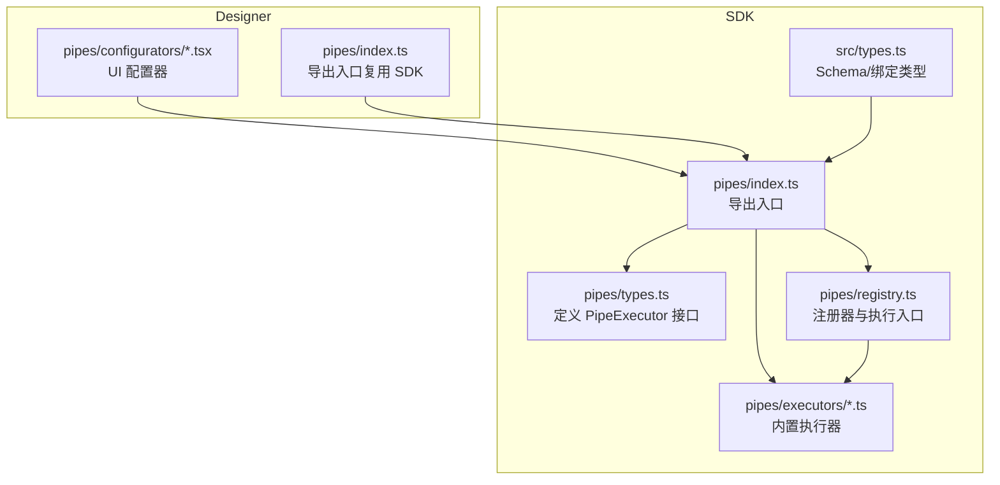
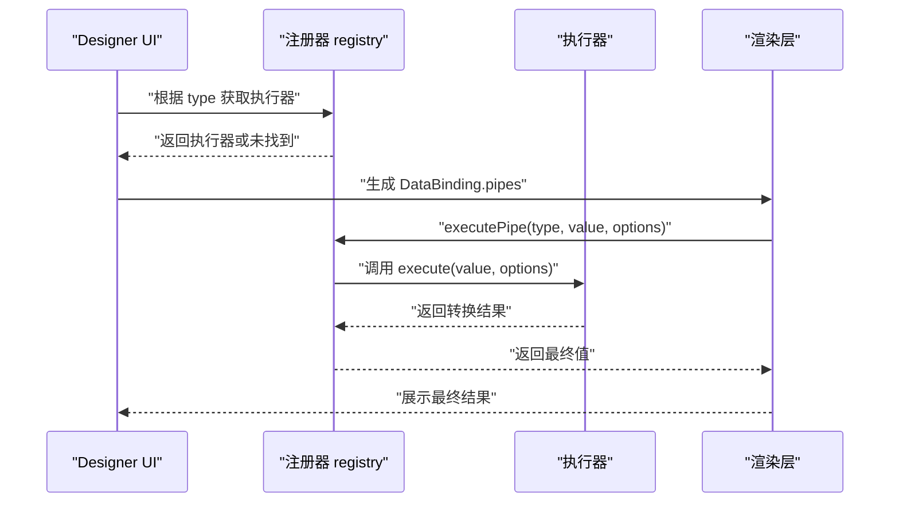
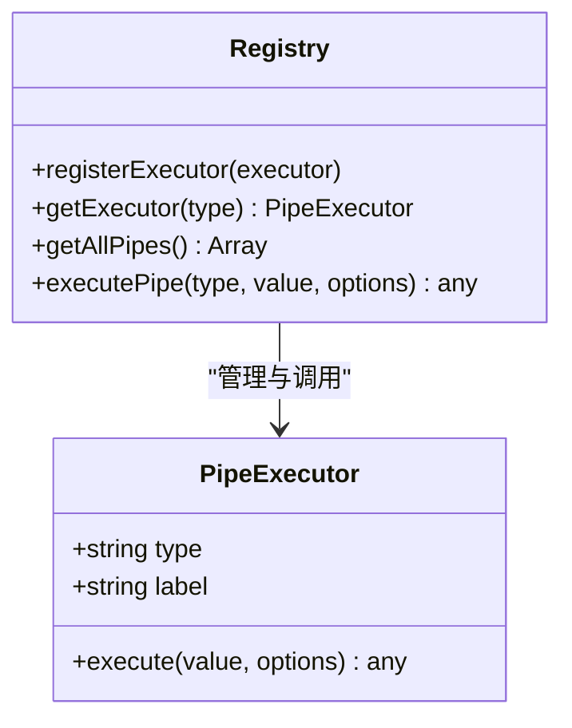
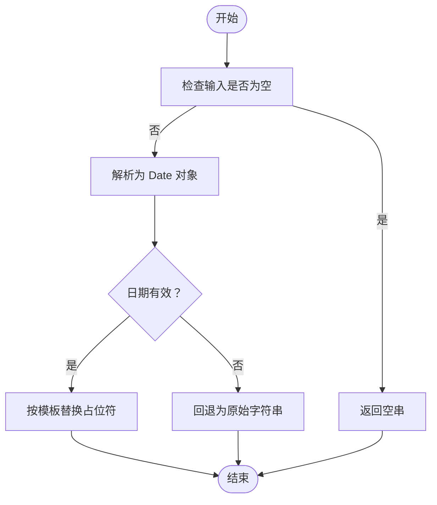
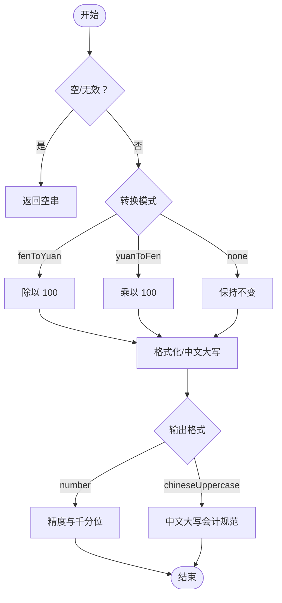
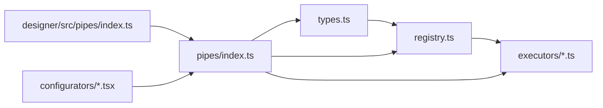

# 数据管道系统

<cite>
**本文引用的文件**
- [sdk/src/pipes/index.ts](file://sdk/src/pipes/index.ts)
- [sdk/src/pipes/types.ts](file://sdk/src/pipes/types.ts)
- [sdk/src/pipes/registry.ts](file://sdk/src/pipes/registry.ts)
- [sdk/src/pipes/executors/index.ts](file://sdk/src/pipes/executors/index.ts)
- [sdk/src/pipes/executors/ChineseNumberPipe.ts](file://sdk/src/pipes/executors/ChineseNumberPipe.ts)
- [sdk/src/pipes/executors/CurrencyPipe.ts](file://sdk/src/pipes/executors/CurrencyPipe.ts)
- [sdk/src/pipes/executors/DatePipe.ts](file://sdk/src/pipes/executors/DatePipe.ts)
- [sdk/src/pipes/executors/MoneyPipe.ts](file://sdk/src/pipes/executors/MoneyPipe.ts)
- [sdk/src/types.ts](file://sdk/src/types.ts)
- [designer/src/pipes/index.ts](file://designer/src/pipes/index.ts)
- [designer/src/pipes/configurators/index.tsx](file://designer/src/pipes/configurators/index.tsx)
- [designer/src/pipes/configurators/ChineseNumberPipeConfigurator.tsx](file://designer/src/pipes/configurators/ChineseNumberPipeConfigurator.tsx)
- [designer/src/pipes/configurators/CurrencyPipeConfigurator.tsx](file://designer/src/pipes/configurators/CurrencyPipeConfigurator.tsx)
- [designer/src/pipes/configurators/DatePipeConfigurator.tsx](file://designer/src/pipes/configurators/DatePipeConfigurator.tsx)
- [designer/src/pipes/configurators/MoneyPipeConfigurator.tsx](file://designer/src/pipes/configurators/MoneyPipeConfigurator.tsx)
</cite>

## 目录
1. [简介](#简介)
2. [项目结构](#项目结构)
3. [核心组件](#核心组件)
4. [架构总览](#架构总览)
5. [详细组件分析](#详细组件分析)
6. [依赖关系分析](#依赖关系分析)
7. [性能考虑](#性能考虑)
8. [故障排查指南](#故障排查指南)
9. [结论](#结论)
10. [附录](#附录)

## 简介
本文件为“数据管道系统”的技术文档，面向设计师与开发者，系统性阐述数据转换链的设计理念、工作原理与实现机制。文档覆盖以下主题：
- 管道系统的设计思想与职责边界
- 内置管道类型的功能、参数与使用方法（日期格式化、货币格式化、金额转换、中文大写数字等）
- 管道配置选项、参数设置与自定义方法
- 管道与组件数据绑定的集成方式
- 管道系统的扩展开发指南（自定义管道执行器）
- 性能优化与错误处理最佳实践
- 丰富的使用示例与实际应用场景

## 项目结构
数据管道系统分为两部分：
- SDK 层：提供统一的类型定义、注册器、执行器集合与核心执行能力
- Designer 层：提供 UI 配置器，负责可视化配置管道参数，并通过 SDK 的执行器完成数据转换

图表来源
- [sdk/src/pipes/index.ts:1-9](file://sdk/src/pipes/index.ts#L1-L9)
- [sdk/src/pipes/types.ts:1-30](file://sdk/src/pipes/types.ts#L1-L30)
- [sdk/src/pipes/registry.ts:1-65](file://sdk/src/pipes/registry.ts#L1-L65)
- [sdk/src/pipes/executors/index.ts:1-45](file://sdk/src/pipes/executors/index.ts#L1-L45)
- [sdk/src/types.ts:77-86](file://sdk/src/types.ts#L77-L86)
- [designer/src/pipes/index.ts:1-11](file://designer/src/pipes/index.ts#L1-L11)
- [designer/src/pipes/configurators/index.tsx:1-85](file://designer/src/pipes/configurators/index.tsx#L1-L85)

章节来源
- [sdk/src/pipes/index.ts:1-9](file://sdk/src/pipes/index.ts#L1-L9)
- [sdk/src/pipes/types.ts:1-30](file://sdk/src/pipes/types.ts#L1-L30)
- [sdk/src/pipes/registry.ts:1-65](file://sdk/src/pipes/registry.ts#L1-L65)
- [sdk/src/pipes/executors/index.ts:1-45](file://sdk/src/pipes/executors/index.ts#L1-L45)
- [sdk/src/types.ts:77-86](file://sdk/src/types.ts#L77-L86)
- [designer/src/pipes/index.ts:1-11](file://designer/src/pipes/index.ts#L1-L11)
- [designer/src/pipes/configurators/index.tsx:1-85](file://designer/src/pipes/configurators/index.tsx#L1-L85)

## 核心组件
- 管道执行器接口（PipeExecutor）：定义 type、label 与 execute 方法，统一执行转换逻辑
- 管道注册器（registry）：集中注册与检索执行器，提供统一的 executePipe 调用入口
- 内置执行器：日期格式化、货币格式化、金额转换、中文大写数字、大小写转换、字符串截取、默认值等
- 管道配置器（Designer UI）：针对不同管道提供可视化配置界面，生成 PipeConfig 并回传给渲染层
- 数据绑定类型：DataBinding 与 PipeConfig 定义了组件如何通过管道链路处理数据

章节来源
- [sdk/src/pipes/types.ts:11-29](file://sdk/src/pipes/types.ts#L11-L29)
- [sdk/src/pipes/registry.ts:12-52](file://sdk/src/pipes/registry.ts#L12-L52)
- [sdk/src/pipes/executors/index.ts:6-44](file://sdk/src/pipes/executors/index.ts#L6-L44)
- [sdk/src/types.ts:77-86](file://sdk/src/types.ts#L77-L86)
- [designer/src/pipes/configurators/index.tsx:17-20](file://designer/src/pipes/configurators/index.tsx#L17-L20)

## 架构总览
管道系统采用“执行器 + 注册器 + 配置器”的分层设计：
- 执行器负责具体的数据转换
- 注册器负责生命周期管理与统一调用
- 配置器负责可视化参数配置
- 渲染层通过 DataBinding 的 pipes 字段串联多个执行器

图表来源
- [sdk/src/pipes/registry.ts:24-52](file://sdk/src/pipes/registry.ts#L24-L52)
- [sdk/src/pipes/types.ts:11-29](file://sdk/src/pipes/types.ts#L11-L29)
- [sdk/src/types.ts:77-86](file://sdk/src/types.ts#L77-L86)

## 详细组件分析

### 管道执行器接口与注册器
- 接口职责：统一 type、label 与 execute(value, options)
- 注册器职责：Map 存储执行器、提供查询与遍历、统一执行入口
- 初始化：在注册器中集中注册所有内置执行器

图表来源
- [sdk/src/pipes/types.ts:11-29](file://sdk/src/pipes/types.ts#L11-L29)
- [sdk/src/pipes/registry.ts:12-52](file://sdk/src/pipes/registry.ts#L12-L52)

章节来源
- [sdk/src/pipes/types.ts:11-29](file://sdk/src/pipes/types.ts#L11-L29)
- [sdk/src/pipes/registry.ts:12-52](file://sdk/src/pipes/registry.ts#L12-L52)

### 内置执行器概览
- 日期格式化（date）：支持 YYYY、MM、DD、HH、mm、ss 占位符替换
- 货币格式化（currency）：支持货币符号与精度控制
- 金额转换（money）：支持分/元互转、精度、千分位、中文大写、会计规范
- 中文大写数字（chineseNumber）：支持纯中文大写、原值+大写、单位后缀
- 大小写转换（uppercase/lowercase）、字符串截取（slice）、默认值（default）

章节来源
- [sdk/src/pipes/executors/DatePipe.ts:7-34](file://sdk/src/pipes/executors/DatePipe.ts#L7-L34)
- [sdk/src/pipes/executors/CurrencyPipe.ts:7-16](file://sdk/src/pipes/executors/CurrencyPipe.ts#L7-L16)
- [sdk/src/pipes/executors/MoneyPipe.ts:59-129](file://sdk/src/pipes/executors/MoneyPipe.ts#L59-L129)
- [sdk/src/pipes/executors/ChineseNumberPipe.ts:99-137](file://sdk/src/pipes/executors/ChineseNumberPipe.ts#L99-L137)
- [sdk/src/pipes/executors/index.ts:16-44](file://sdk/src/pipes/executors/index.ts#L16-L44)

### 日期格式化管道（DatePipe）
- 功能要点
  - 支持空值返回空串
  - 默认格式为 YYYY-MM-DD，可配置为包含时分秒
  - 非法日期回退为原始字符串
- 参数
  - format：格式模板（默认 YYYY-MM-DD）
- 错误处理
  - 非法日期直接回退原值，避免抛错影响渲染

图表来源
- [sdk/src/pipes/executors/DatePipe.ts:11-33](file://sdk/src/pipes/executors/DatePipe.ts#L11-L33)

章节来源
- [sdk/src/pipes/executors/DatePipe.ts:7-34](file://sdk/src/pipes/executors/DatePipe.ts#L7-L34)

### 货币格式化管道（CurrencyPipe）
- 功能要点
  - 默认货币符号为 ¥，默认精度 2
  - 自动将输入转换为数字并格式化
- 参数
  - symbol：货币符号（默认 ¥）
  - precision：小数位数（默认 2）
- 使用场景
  - 商品价格、订单金额、财务报表等

章节来源
- [sdk/src/pipes/executors/CurrencyPipe.ts:7-16](file://sdk/src/pipes/executors/CurrencyPipe.ts#L7-L16)

### 金额转换管道（MoneyPipe）
- 功能要点
  - 支持三种模式：分→元、元→分、不转换
  - 支持数字格式化（精度、千分位）、货币符号
  - 支持中文大写金额（会计规范：元、角、分、整）
  - 中文大写支持“仅大写”和“原值+大写”两种模式
- 参数
  - mode：'fenToYuan' | 'yuanToFen' | 'none'
  - precision：小数位数（默认 2）
  - symbol：货币符号（默认空）
  - separator：是否启用千分位分隔（布尔）
  - format：'number' | 'chineseUppercase'
  - uppercaseMode：'uppercase' | 'both'
  - separator（中文大写模式下的连接符）：字符串或留空
- 错误处理
  - 使用高精度库进行计算，异常时回退原值

图表来源
- [sdk/src/pipes/executors/MoneyPipe.ts:63-128](file://sdk/src/pipes/executors/MoneyPipe.ts#L63-L128)

章节来源
- [sdk/src/pipes/executors/MoneyPipe.ts:59-129](file://sdk/src/pipes/executors/MoneyPipe.ts#L59-L129)

### 中文大写数字管道（ChineseNumberPipe）
- 功能要点
  - 支持整数与小数的中文大写转换
  - 支持负数加“负”字
  - 支持“仅大写”和“原值+大写”两种模式
  - 支持单位后缀（如“元”）
- 参数
  - mode：'uppercase' | 'both'
  - separator：连接符（留空使用默认括号）
  - unit：单位后缀（如“元”）
- 错误处理
  - 非数字字符串在无法解析时回退原值

章节来源
- [sdk/src/pipes/executors/ChineseNumberPipe.ts:99-137](file://sdk/src/pipes/executors/ChineseNumberPipe.ts#L99-L137)

### 简单管道（大小写、截取、默认值）
- uppercase：全部转大写
- lowercase：全部转小写
- slice：字符串截取（start、end）
- default：空值回退默认值

章节来源
- [sdk/src/pipes/executors/index.ts:16-44](file://sdk/src/pipes/executors/index.ts#L16-L44)

### 管道配置器（Designer UI）
- 设计目标：为每个管道提供直观的参数配置界面
- 已实现配置器
  - DatePipeConfigurator：格式模板
  - CurrencyPipeConfigurator：货币符号
  - MoneyPipeConfigurator：输出格式、转换模式、中文大写模式、连接符、精度、货币符号、千分位
  - ChineseNumberPipeConfigurator：输出模式、连接符、单位
  - SlicePipeConfigurator：起始/结束位置
  - DefaultPipeConfigurator：默认值
- 注册与使用
  - 在注册表中登记各配置器，按 type 查找并渲染

章节来源
- [designer/src/pipes/configurators/index.tsx:69-84](file://designer/src/pipes/configurators/index.tsx#L69-L84)
- [designer/src/pipes/configurators/DatePipeConfigurator.tsx:9-22](file://designer/src/pipes/configurators/DatePipeConfigurator.tsx#L9-L22)
- [designer/src/pipes/configurators/CurrencyPipeConfigurator.tsx:9-22](file://designer/src/pipes/configurators/CurrencyPipeConfigurator.tsx#L9-L22)
- [designer/src/pipes/configurators/MoneyPipeConfigurator.tsx:9-142](file://designer/src/pipes/configurators/MoneyPipeConfigurator.tsx#L9-L142)
- [designer/src/pipes/configurators/ChineseNumberPipeConfigurator.tsx:11-57](file://designer/src/pipes/configurators/ChineseNumberPipeConfigurator.tsx#L11-L57)

### 管道与组件数据绑定的集成
- DataBinding 结构
  - path：数据路径
  - pipes：管道数组，按顺序执行
  - fallback：回退值
- 执行流程
  - 渲染层从数据源读取值
  - 按顺序执行每个管道的 execute
  - 最终值用于组件渲染
- 表格合计与额外行
  - 支持在合计行上应用管道（如中文大写）

章节来源
- [sdk/src/types.ts:77-86](file://sdk/src/types.ts#L77-L86)
- [sdk/src/types.ts:94-101](file://sdk/src/types.ts#L94-L101)
- [sdk/src/types.ts:164-183](file://sdk/src/types.ts#L164-L183)

## 依赖关系分析
- SDK 层
  - pipes/index.ts 统一导出 types、registry、executors
  - registry.ts 依赖 executors 索引导出的执行器
  - executors/*.ts 提供具体转换逻辑
- Designer 层
  - pipes/index.ts 复用 SDK 的类型与执行器
  - pipes/configurators/*.tsx 提供 UI 配置器
  - 通过 registry 与 executors 实现一致的转换行为

图表来源
- [sdk/src/pipes/index.ts:6-8](file://sdk/src/pipes/index.ts#L6-L8)
- [sdk/src/pipes/registry.ts:7-7](file://sdk/src/pipes/registry.ts#L7-L7)
- [sdk/src/pipes/executors/index.ts:6-9](file://sdk/src/pipes/executors/index.ts#L6-L9)
- [designer/src/pipes/index.ts:7-7](file://designer/src/pipes/index.ts#L7-L7)

章节来源
- [sdk/src/pipes/index.ts:1-9](file://sdk/src/pipes/index.ts#L1-L9)
- [sdk/src/pipes/registry.ts:1-65](file://sdk/src/pipes/registry.ts#L1-L65)
- [sdk/src/pipes/executors/index.ts:1-45](file://sdk/src/pipes/executors/index.ts#L1-L45)
- [designer/src/pipes/index.ts:1-11](file://designer/src/pipes/index.ts#L1-L11)

## 性能考虑
- 计算复杂度
  - 字符串类管道（大小写、截取、中文大写）时间复杂度近似 O(n)，空间复杂度 O(n)
  - 金额转换使用高精度库，避免浮点误差，但会带来一定开销
- 优化建议
  - 避免在高频渲染中重复创建管道配置对象
  - 对长列表渲染，优先使用虚拟化与缓存策略
  - 合理设置精度与千分位，减少不必要的格式化
  - 对日期格式化，尽量复用固定格式模板
- 错误处理
  - 所有执行器均提供兜底逻辑，避免异常传播至渲染层

## 故障排查指南
- 常见问题
  - 管道未找到：检查 type 是否正确，确认已在注册器中注册
  - 日期格式化失败：确认输入为合法日期或可解析的时间戳
  - 金额转换异常：确认输入为数值或可转换为数值的字符串
  - 中文大写显示异常：检查是否传入了非法数值或过大的数字
- 定位方法
  - 在执行器内部捕获异常并记录日志
  - 使用 fallback 保障渲染稳定性
- 建议
  - 在 Designer 中逐步调试每个管道的参数
  - 对表格合计场景，先单独验证管道再集成到合计行

章节来源
- [sdk/src/pipes/registry.ts:45-52](file://sdk/src/pipes/registry.ts#L45-L52)
- [sdk/src/pipes/executors/DatePipe.ts:11-17](file://sdk/src/pipes/executors/DatePipe.ts#L11-L17)
- [sdk/src/pipes/executors/MoneyPipe.ts:124-127](file://sdk/src/pipes/executors/MoneyPipe.ts#L124-L127)
- [sdk/src/pipes/executors/ChineseNumberPipe.ts:132-135](file://sdk/src/pipes/executors/ChineseNumberPipe.ts#L132-L135)

## 结论
数据管道系统通过“执行器 + 注册器 + 配置器”的清晰分层，实现了可扩展、可配置、易维护的数据转换链路。内置管道覆盖了常见的业务场景，Designer 层提供了直观的参数配置体验。通过统一的 DataBinding 接口，管道可以无缝集成到组件渲染流程中。建议在实际项目中遵循参数校验、错误兜底与性能优化的最佳实践，确保在复杂场景下的稳定运行。

## 附录

### 管道类型与参数速查
- date
  - 参数：format（默认 YYYY-MM-DD）
  - 场景：日期展示、报表时间
- currency
  - 参数：symbol（默认 ¥）、precision（默认 2）
  - 场景：价格、金额、财务
- money
  - 参数：mode（默认 fenToYuan）、precision（默认 2）、symbol、separator、format、uppercaseMode、separator（中文大写连接符）
  - 场景：分/元转换、中文大写金额、千分位展示
- chineseNumber
  - 参数：mode（默认 uppercase）、separator、unit
  - 场景：票据、合同金额大写
- uppercase/lowercase/slice/default
  - 场景：基础字符串处理与默认值兜底

章节来源
- [sdk/src/pipes/executors/DatePipe.ts:14-14](file://sdk/src/pipes/executors/DatePipe.ts#L14-L14)
- [sdk/src/pipes/executors/CurrencyPipe.ts:12-13](file://sdk/src/pipes/executors/CurrencyPipe.ts#L12-L13)
- [sdk/src/pipes/executors/MoneyPipe.ts:70-74](file://sdk/src/pipes/executors/MoneyPipe.ts#L70-L74)
- [sdk/src/pipes/executors/ChineseNumberPipe.ts:118-119](file://sdk/src/pipes/executors/ChineseNumberPipe.ts#L118-L119)
- [sdk/src/pipes/executors/index.ts:16-44](file://sdk/src/pipes/executors/index.ts#L16-L44)

### 自定义管道执行器开发指南
- 步骤
  - 定义执行器：实现 PipeExecutor 接口（type、label、execute）
  - 导出执行器：在 executors 索引中导出
  - 注册执行器：在 registry 初始化阶段注册
  - 设计 UI 配置器：在 Designer 层新增配置器并在注册表登记
  - 测试与集成：在组件 DataBinding 中添加 pipes 验证效果
- 注意事项
  - execute 内部应包含错误兜底，避免抛错
  - 参数尽量可配置化，提升复用性
  - 文档化 type 与参数含义，便于 Designer 层配置

章节来源
- [sdk/src/pipes/types.ts:11-29](file://sdk/src/pipes/types.ts#L11-L29)
- [sdk/src/pipes/registry.ts:54-65](file://sdk/src/pipes/registry.ts#L54-L65)
- [sdk/src/pipes/executors/index.ts:6-9](file://sdk/src/pipes/executors/index.ts#L6-L9)
- [designer/src/pipes/configurators/index.tsx:69-84](file://designer/src/pipes/configurators/index.tsx#L69-L84)