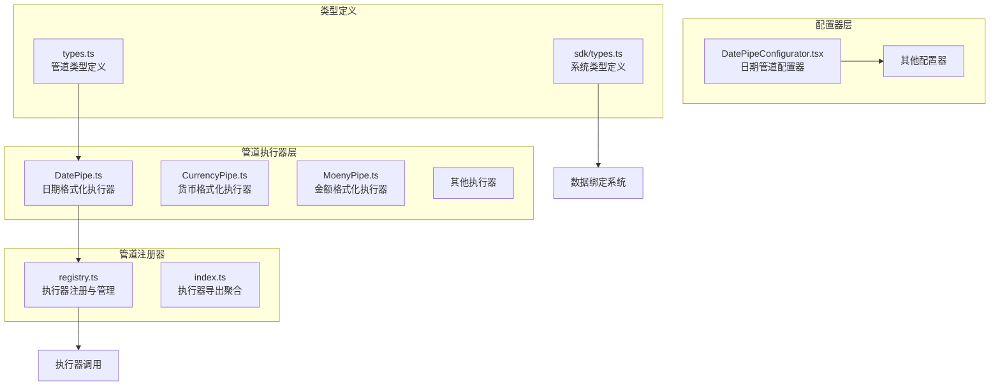
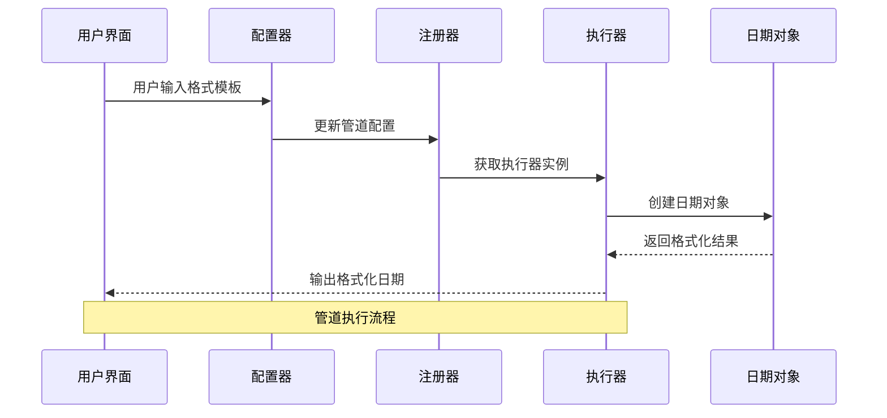
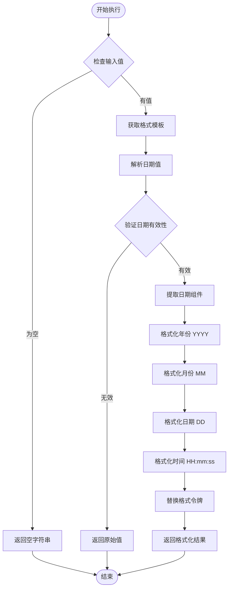
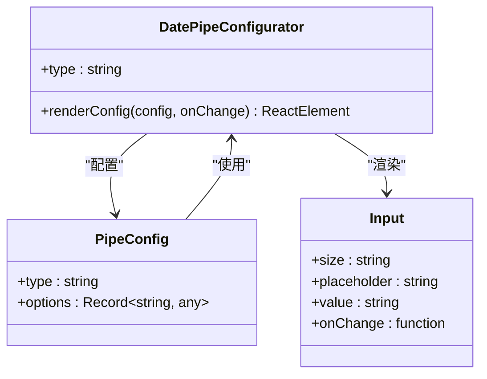
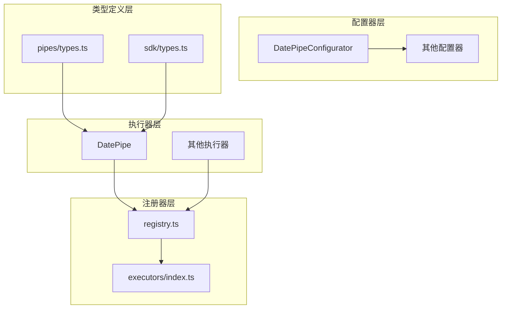

# 日期格式化管道

<cite>
**本文档引用的文件**
- [DatePipe.ts](file://sdk/src/pipes/executors/DatePipe.ts)
- [types.ts](file://sdk/src/pipes/types.ts)
- [registry.ts](file://sdk/src/pipes/registry.ts)
- [index.ts](file://sdk/src/pipes/executors/index.ts)
- [types.ts](file://sdk/src/types.ts)
- [DatePipeConfigurator.tsx](file://designer/src/pipes/configurators/DatePipeConfigurator.tsx)
- [index.tsx](file://designer/src/pipes/configurators/index.tsx)
- [DataBindingSection.tsx](file://designer/src/pages/Designer/components/PropertyPanel/DataBindingSection.tsx)
</cite>

## 目录
1. [简介](#简介)
2. [项目结构](#项目结构)
3. [核心组件](#核心组件)
4. [架构概览](#架构概览)
5. [详细组件分析](#详细组件分析)
6. [依赖关系分析](#依赖关系分析)
7. [性能考虑](#性能考虑)
8. [故障排除指南](#故障排除指南)
9. [结论](#结论)
10. [附录](#附录)

## 简介

日期格式化管道是打印设计系统中的一个核心数据处理组件，负责将原始日期数据转换为用户友好的格式化字符串。该管道支持灵活的格式化选项，允许开发者通过简单的配置来控制输出格式。

本管道采用插件化架构设计，具有以下特性：
- 支持多种日期格式化模式
- 可配置的格式字符串
- 优雅的错误处理机制
- 与数据绑定系统的无缝集成
- 易于扩展的架构设计

## 项目结构

日期格式化管道位于打印设计系统的管道执行器子系统中，采用模块化组织方式：



**图表来源**
- [DatePipe.ts:1-35](file://sdk/src/pipes/executors/DatePipe.ts#L1-L35)
- [registry.ts:1-65](file://sdk/src/pipes/registry.ts#L1-L65)
- [types.ts:1-30](file://sdk/src/pipes/types.ts#L1-L30)

**章节来源**
- [DatePipe.ts:1-35](file://sdk/src/pipes/executors/DatePipe.ts#L1-L35)
- [registry.ts:1-65](file://sdk/src/pipes/registry.ts#L1-L65)
- [types.ts:1-30](file://sdk/src/pipes/types.ts#L1-L30)

## 核心组件

### 管道执行器接口

管道执行器遵循统一的接口规范，确保所有管道具有相同的调用方式：

| 属性 | 类型 | 描述 | 默认值 |
|------|------|------|--------|
| type | string | 管道类型标识符 | 必填 |
| label | string | 管道显示名称 | 必填 |
| execute | function | 执行函数 | 必填 |

### 日期格式化执行器

DatePipe执行器实现了完整的日期格式化功能：

| 参数 | 类型 | 描述 | 默认值 |
|------|------|------|--------|
| value | any | 输入的日期值 | 必填 |
| options.format | string | 格式化模板 | 'YYYY-MM-DD' |

**章节来源**
- [types.ts:11-29](file://sdk/src/pipes/types.ts#L11-L29)
- [DatePipe.ts:7-34](file://sdk/src/pipes/executors/DatePipe.ts#L7-L34)

## 架构概览

日期格式化管道采用分层架构设计，确保了良好的可维护性和扩展性：



**图表来源**
- [DataBindingSection.tsx:87-118](file://designer/src/pages/Designer/components/PropertyPanel/DataBindingSection.tsx#L87-L118)
- [registry.ts:45-52](file://sdk/src/pipes/registry.ts#L45-L52)
- [DatePipe.ts:11-32](file://sdk/src/pipes/executors/DatePipe.ts#L11-L32)

## 详细组件分析

### DatePipe 执行器实现

DatePipe执行器提供了完整的日期格式化功能，支持多种格式化模式：



**图表来源**
- [DatePipe.ts:11-32](file://sdk/src/pipes/executors/DatePipe.ts#L11-L32)

#### 格式化令牌说明

| 令牌 | 描述 | 示例输出 |
|------|------|----------|
| YYYY | 四位年份 | 2024, 1990 |
| MM | 两位月份 | 01-12 |
| DD | 两位日期 | 01-31 |
| HH | 24小时制小时 | 00-23 |
| mm | 分钟 | 00-59 |
| ss | 秒 | 00-59 |

### 配置器组件

日期管道配置器提供了直观的用户界面来设置格式化选项：



**图表来源**
- [DatePipeConfigurator.tsx:9-22](file://designer/src/pipes/configurators/DatePipeConfigurator.tsx#L9-L22)

**章节来源**
- [DatePipeConfigurator.tsx:1-23](file://designer/src/pipes/configurators/DatePipeConfigurator.tsx#L1-L23)
- [index.tsx:69-84](file://designer/src/pipes/configurators/index.tsx#L69-L84)

### 数据绑定集成

管道与数据绑定系统的集成确保了灵活的数据处理能力：

```mermaid
graph LR
subgraph "数据绑定系统"
A[ComponentNode]
B[DataBinding]
C[PipeConfig[]]
end
subgraph "管道执行系统"
D[executePipe]
E[getExecutor]
F[DatePipe.execute]
end
subgraph "配置器系统"
G[getConfigurator]
H[renderConfig]
end
A --> B
B --> C
C --> D
D --> E
E --> F
C --> G
G --> H
```

**图表来源**
- [DataBindingSection.tsx:20-43](file://designer/src/pages/Designer/components/PropertyPanel/DataBindingSection.tsx#L20-L43)
- [registry.ts:45-52](file://sdk/src/pipes/registry.ts#L45-L52)

**章节来源**
- [DataBindingSection.tsx:1-127](file://designer/src/pages/Designer/components/PropertyPanel/DataBindingSection.tsx#L1-L127)
- [types.ts:77-86](file://sdk/src/types.ts#L77-L86)

## 依赖关系分析

### 内部依赖关系



**图表来源**
- [registry.ts:6-65](file://sdk/src/pipes/registry.ts#L6-L65)
- [index.ts:5-45](file://sdk/src/pipes/executors/index.ts#L5-L45)

### 外部依赖

- **React**: 用于构建用户界面组件
- **Ant Design**: 提供UI组件库支持
- **TypeScript**: 提供类型安全保证

**章节来源**
- [registry.ts:1-65](file://sdk/src/pipes/registry.ts#L1-L65)
- [index.ts:1-45](file://sdk/src/pipes/executors/index.ts#L1-L45)

## 性能考虑

### 执行效率

DatePipe执行器具有以下性能特征：

- **时间复杂度**: O(n)，其中n为格式字符串长度
- **空间复杂度**: O(1)，使用常量额外空间
- **缓存策略**: 无内部缓存，每次执行重新计算

### 优化建议

1. **批量处理**: 对大量日期数据进行批处理时，考虑使用Web Workers
2. **格式复用**: 在相同格式下复用执行器实例
3. **输入验证**: 在管道外部进行输入验证以减少无效调用

## 故障排除指南

### 常见问题及解决方案

| 问题类型 | 症状 | 原因 | 解决方案 |
|----------|------|------|----------|
| 格式化失败 | 返回原始值 | 日期解析失败 | 检查输入格式是否正确 |
| 空值处理 | 显示空白 | 输入值为空 | 设置默认值管道 |
| 格式错误 | 格式不匹配 | 格式令牌错误 | 验证格式字符串 |
| 性能问题 | 处理缓慢 | 大量数据处理 | 实施分批处理 |

### 调试技巧

1. **日志记录**: 在开发环境中启用详细的执行日志
2. **格式验证**: 使用在线格式验证工具检查格式字符串
3. **边界测试**: 测试极端日期值（如闰年、月末等）

**章节来源**
- [DatePipe.ts:11-17](file://sdk/src/pipes/executors/DatePipe.ts#L11-L17)

## 结论

日期格式化管道是一个设计精良的数据处理组件，具有以下优势：

- **简洁易用**: 直观的API设计和配置界面
- **功能完整**: 支持多种日期格式化需求
- **扩展性强**: 插件化架构便于功能扩展
- **集成良好**: 与整个打印设计系统无缝集成

该管道为打印设计系统提供了可靠的日期数据处理能力，能够满足各种复杂的格式化需求。

## 附录

### 使用示例

由于代码库限制，无法在此提供具体的代码示例。但可以通过以下方式了解使用方法：

1. 查看配置器组件的实现
2. 参考数据绑定系统的使用
3. 浏览注册器的初始化过程

### 开发指南

1. **扩展新格式**: 通过修改格式令牌映射添加新的格式选项
2. **自定义配置器**: 为特殊需求创建专用的配置界面
3. **性能监控**: 添加执行时间统计和性能指标