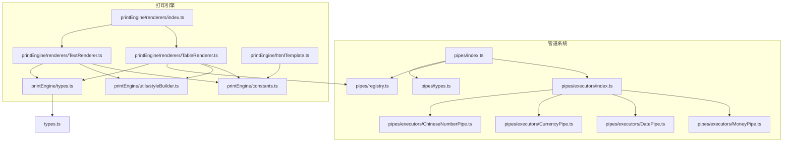
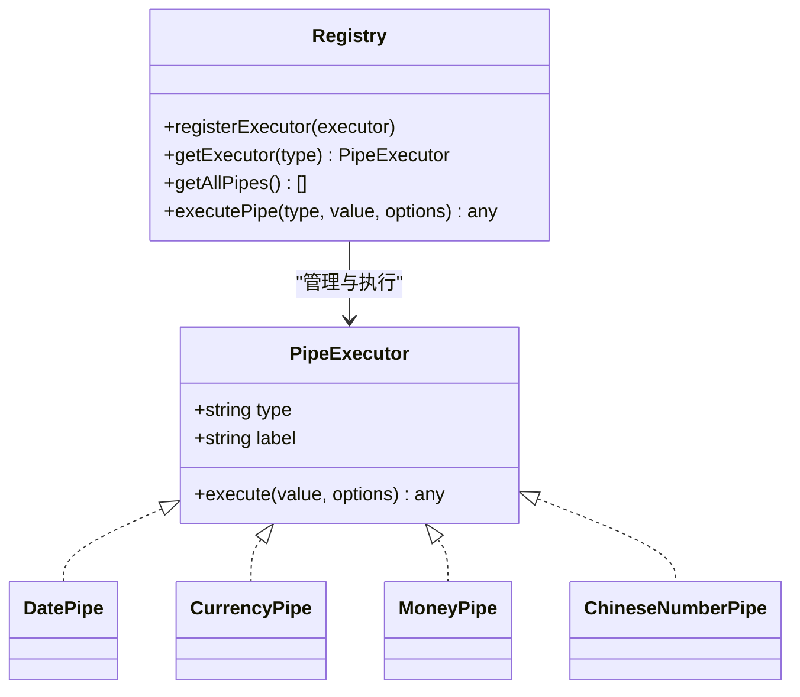
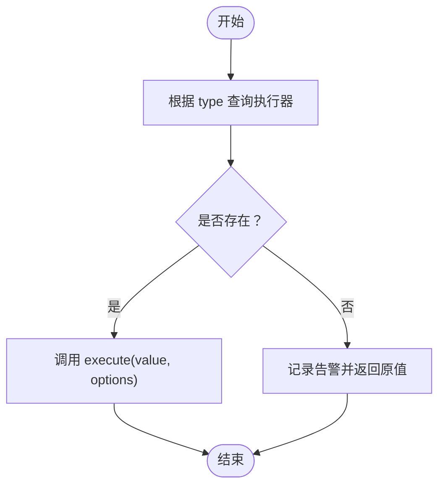
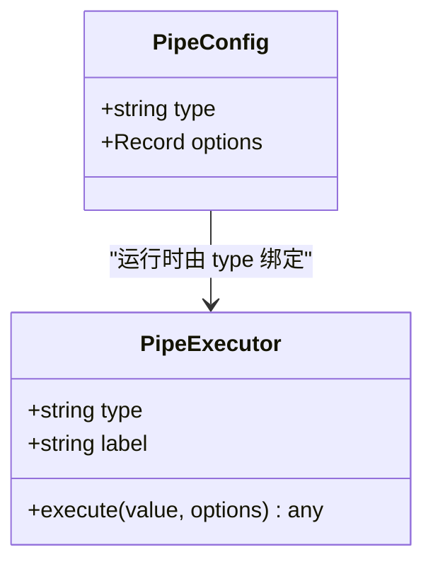
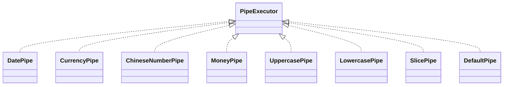
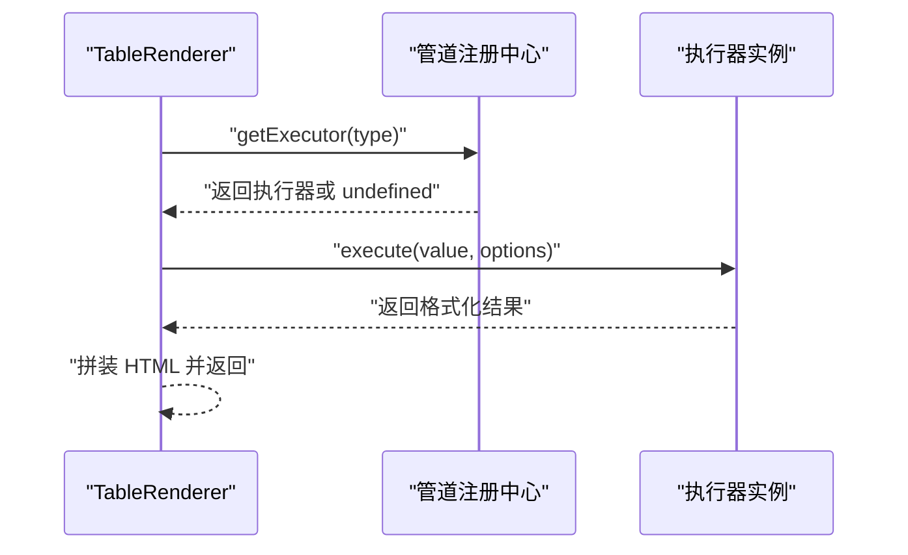
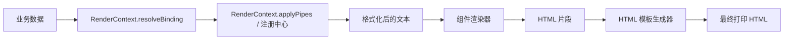
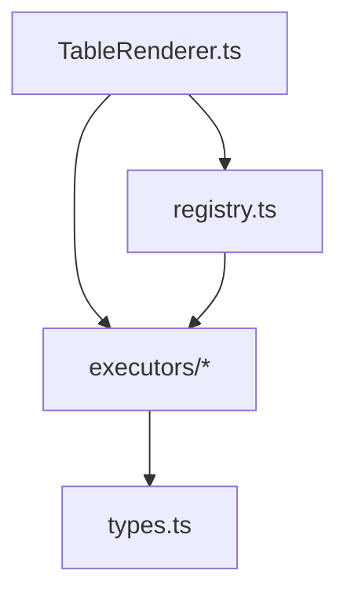

# 管道系统概览

<cite>
**本文引用的文件**
- [sdk/src/pipes/index.ts](file://sdk/src/pipes/index.ts)
- [sdk/src/pipes/registry.ts](file://sdk/src/pipes/registry.ts)
- [sdk/src/pipes/types.ts](file://sdk/src/pipes/types.ts)
- [sdk/src/pipes/executors/index.ts](file://sdk/src/pipes/executors/index.ts)
- [sdk/src/pipes/executors/ChineseNumberPipe.ts](file://sdk/src/pipes/executors/ChineseNumberPipe.ts)
- [sdk/src/pipes/executors/CurrencyPipe.ts](file://sdk/src/pipes/executors/CurrencyPipe.ts)
- [sdk/src/pipes/executors/DatePipe.ts](file://sdk/src/pipes/executors/DatePipe.ts)
- [sdk/src/pipes/executors/MoneyPipe.ts](file://sdk/src/pipes/executors/MoneyPipe.ts)
- [sdk/src/printEngine/types.ts](file://sdk/src/printEngine/types.ts)
- [sdk/src/printEngine/renderers/index.ts](file://sdk/src/printEngine/renderers/index.ts)
- [sdk/src/printEngine/renderers/TextRenderer.ts](file://sdk/src/printEngine/renderers/TextRenderer.ts)
- [sdk/src/printEngine/renderers/TableRenderer.ts](file://sdk/src/printEngine/renderers/TableRenderer.ts)
- [sdk/src/printEngine/htmlTemplate.ts](file://sdk/src/printEngine/htmlTemplate.ts)
- [sdk/src/printEngine/constants.ts](file://sdk/src/printEngine/constants.ts)
- [sdk/src/printEngine/utils/styleBuilder.ts](file://sdk/src/printEngine/utils/styleBuilder.ts)
- [sdk/src/types.ts](file://sdk/src/types.ts)
</cite>

## 目录
1. [简介](#简介)
2. [项目结构](#项目结构)
3. [核心组件](#核心组件)
4. [架构总览](#架构总览)
5. [详细组件分析](#详细组件分析)
6. [依赖分析](#依赖分析)
7. [性能考虑](#性能考虑)
8. [故障排查指南](#故障排查指南)
9. [结论](#结论)
10. [附录](#附录)

## 简介
本文件为数据管道系统概览文档，面向打印引擎中的“数据转换链”能力，系统性阐述：
- 管道系统的核心架构与设计理念
- 数据转换链的工作机制与执行流程
- 管道注册中心的作用与管理方式
- 管道类型定义与接口规范
- 管道系统在打印引擎中的位置与作用，以及与渲染器、模板、样式体系的交互关系
- 管道的整体使用流程与最佳实践
- 性能考量与错误处理策略

## 项目结构
围绕“管道系统”，核心代码位于 SDK 的 pipes 子模块，并与打印引擎的渲染器、类型定义、样式工具协同工作。

**图示来源**
- [sdk/src/pipes/index.ts:1-9](file://sdk/src/pipes/index.ts#L1-L9)
- [sdk/src/pipes/registry.ts:1-65](file://sdk/src/pipes/registry.ts#L1-L65)
- [sdk/src/pipes/types.ts:1-30](file://sdk/src/pipes/types.ts#L1-L30)
- [sdk/src/pipes/executors/index.ts:1-45](file://sdk/src/pipes/executors/index.ts#L1-L45)
- [sdk/src/pipes/executors/ChineseNumberPipe.ts:1-138](file://sdk/src/pipes/executors/ChineseNumberPipe.ts#L1-L138)
- [sdk/src/pipes/executors/CurrencyPipe.ts:1-17](file://sdk/src/pipes/executors/CurrencyPipe.ts#L1-L17)
- [sdk/src/pipes/executors/DatePipe.ts:1-35](file://sdk/src/pipes/executors/DatePipe.ts#L1-L35)
- [sdk/src/pipes/executors/MoneyPipe.ts:1-130](file://sdk/src/pipes/executors/MoneyPipe.ts#L1-L130)
- [sdk/src/printEngine/types.ts:1-116](file://sdk/src/printEngine/types.ts#L1-L116)
- [sdk/src/printEngine/renderers/index.ts:1-13](file://sdk/src/printEngine/renderers/index.ts#L1-L13)
- [sdk/src/printEngine/renderers/TextRenderer.ts:1-60](file://sdk/src/printEngine/renderers/TextRenderer.ts#L1-L60)
- [sdk/src/printEngine/renderers/TableRenderer.ts:1-602](file://sdk/src/printEngine/renderers/TableRenderer.ts#L1-L602)
- [sdk/src/printEngine/htmlTemplate.ts:1-281](file://sdk/src/printEngine/htmlTemplate.ts#L1-L281)
- [sdk/src/printEngine/constants.ts:1-113](file://sdk/src/printEngine/constants.ts#L1-L113)
- [sdk/src/printEngine/utils/styleBuilder.ts:1-54](file://sdk/src/printEngine/utils/styleBuilder.ts#L1-L54)
- [sdk/src/types.ts:1-228](file://sdk/src/types.ts#L1-L228)

**章节来源**
- [sdk/src/pipes/index.ts:1-9](file://sdk/src/pipes/index.ts#L1-L9)
- [sdk/src/pipes/registry.ts:1-65](file://sdk/src/pipes/registry.ts#L1-L65)
- [sdk/src/pipes/types.ts:1-30](file://sdk/src/pipes/types.ts#L1-L30)
- [sdk/src/pipes/executors/index.ts:1-45](file://sdk/src/pipes/executors/index.ts#L1-L45)
- [sdk/src/printEngine/renderers/index.ts:1-13](file://sdk/src/printEngine/renderers/index.ts#L1-L13)

## 核心组件
- 管道执行器接口与类型
  - PipeExecutor：统一的执行器接口，包含 type、label、execute 方法，用于封装具体的数据转换逻辑。
  - PipeConfig：在模板中声明的管道配置，包含 type 与 options。
- 管道注册中心
  - 提供注册、查询、遍历与执行管道的能力，内置初始化时注册常用执行器。
- 内置执行器
  - 日期格式化、货币格式化、中文大写数字、金额转换、大小写转换、字符串截取、默认值等。
- 打印引擎中的应用
  - 渲染器通过 RenderContext.applyPipes 或直接调用注册中心执行管道，将数据绑定值转换为最终展示文本。
  - 表格组件在合计与额外行场景中，对数值先聚合再应用管道，保证格式一致性。

**章节来源**
- [sdk/src/pipes/types.ts:7-30](file://sdk/src/pipes/types.ts#L7-L30)
- [sdk/src/types.ts:77-86](file://sdk/src/types.ts#L77-L86)
- [sdk/src/pipes/registry.ts:12-65](file://sdk/src/pipes/registry.ts#L12-L65)
- [sdk/src/pipes/executors/index.ts:16-44](file://sdk/src/pipes/executors/index.ts#L16-L44)
- [sdk/src/pipes/executors/DatePipe.ts:7-34](file://sdk/src/pipes/executors/DatePipe.ts#L7-L34)
- [sdk/src/pipes/executors/CurrencyPipe.ts:7-16](file://sdk/src/pipes/executors/CurrencyPipe.ts#L7-L16)
- [sdk/src/pipes/executors/ChineseNumberPipe.ts:99-137](file://sdk/src/pipes/executors/ChineseNumberPipe.ts#L99-L137)
- [sdk/src/pipes/executors/MoneyPipe.ts:59-129](file://sdk/src/pipes/executors/MoneyPipe.ts#L59-L129)

## 架构总览
管道系统采用“接口 + 注册中心 + 执行器集合”的分层设计：
- 接口层：定义 PipeExecutor 与 PipeConfig，约束扩展点。
- 管理层：注册中心负责执行器的注册、查询与遍历，提供统一执行入口。
- 执行层：内置执行器实现具体转换逻辑；外部可通过注册新执行器扩展。
- 集成层：渲染器在解析数据绑定与生成 HTML 时调用管道，完成最终文本输出。

**图示来源**
- [sdk/src/pipes/types.ts:11-29](file://sdk/src/pipes/types.ts#L11-L29)
- [sdk/src/pipes/registry.ts:17-52](file://sdk/src/pipes/registry.ts#L17-L52)
- [sdk/src/pipes/executors/DatePipe.ts:7-34](file://sdk/src/pipes/executors/DatePipe.ts#L7-L34)
- [sdk/src/pipes/executors/CurrencyPipe.ts:7-16](file://sdk/src/pipes/executors/CurrencyPipe.ts#L7-L16)
- [sdk/src/pipes/executors/MoneyPipe.ts:59-129](file://sdk/src/pipes/executors/MoneyPipe.ts#L59-L129)
- [sdk/src/pipes/executors/ChineseNumberPipe.ts:99-137](file://sdk/src/pipes/executors/ChineseNumberPipe.ts#L99-L137)

## 详细组件分析

### 管道注册中心
- 职责
  - 维护执行器映射表，提供注册、查询、遍历与执行入口。
  - 在初始化阶段注册内置执行器，确保开箱即用。
- 关键行为
  - 注册：按执行器 type 建立映射。
  - 查询：根据 type 获取执行器实例。
  - 执行：若未找到执行器，记录告警并回退原值。
  - 遍历：生成下拉选择所需的数据结构。
- 设计要点
  - 低耦合：渲染器仅依赖注册中心的公开 API。
  - 可扩展：外部可注册自定义执行器，参与统一调度。

**图示来源**
- [sdk/src/pipes/registry.ts:45-52](file://sdk/src/pipes/registry.ts#L45-L52)

**章节来源**
- [sdk/src/pipes/registry.ts:12-65](file://sdk/src/pipes/registry.ts#L12-L65)

### 管道执行器接口与类型
- PipeExecutor
  - type：唯一标识，用于注册与查找。
  - label：显示名称，用于 UI 下拉选择。
  - execute：核心转换逻辑，接收输入值与可选参数，返回转换结果。
- PipeConfig
  - 在模板中声明，包含 type 与 options，描述一次转换的意图与参数。

**图示来源**
- [sdk/src/pipes/types.ts:11-29](file://sdk/src/pipes/types.ts#L11-L29)
- [sdk/src/types.ts:77-86](file://sdk/src/types.ts#L77-L86)

**章节来源**
- [sdk/src/pipes/types.ts:7-30](file://sdk/src/pipes/types.ts#L7-L30)
- [sdk/src/types.ts:77-86](file://sdk/src/types.ts#L77-L86)

### 内置执行器概览
- 日期格式化：支持多种占位符，将时间值格式化为指定字符串。
- 货币格式化：支持符号与精度控制。
- 中文大写数字：支持整数与小数、负数、单位后缀、双格式输出。
- 金额转换：支持分/元互转、精度、千分位、中文大写金额、符号等。
- 简单管道：大小写转换、字符串截取、默认值。

**图示来源**
- [sdk/src/pipes/executors/DatePipe.ts:7-34](file://sdk/src/pipes/executors/DatePipe.ts#L7-L34)
- [sdk/src/pipes/executors/CurrencyPipe.ts:7-16](file://sdk/src/pipes/executors/CurrencyPipe.ts#L7-L16)
- [sdk/src/pipes/executors/ChineseNumberPipe.ts:99-137](file://sdk/src/pipes/executors/ChineseNumberPipe.ts#L99-L137)
- [sdk/src/pipes/executors/MoneyPipe.ts:59-129](file://sdk/src/pipes/executors/MoneyPipe.ts#L59-L129)
- [sdk/src/pipes/executors/index.ts:16-44](file://sdk/src/pipes/executors/index.ts#L16-L44)

**章节来源**
- [sdk/src/pipes/executors/index.ts:6-44](file://sdk/src/pipes/executors/index.ts#L6-L44)
- [sdk/src/pipes/executors/DatePipe.ts:7-34](file://sdk/src/pipes/executors/DatePipe.ts#L7-L34)
- [sdk/src/pipes/executors/CurrencyPipe.ts:7-16](file://sdk/src/pipes/executors/CurrencyPipe.ts#L7-L16)
- [sdk/src/pipes/executors/ChineseNumberPipe.ts:99-137](file://sdk/src/pipes/executors/ChineseNumberPipe.ts#L99-L137)
- [sdk/src/pipes/executors/MoneyPipe.ts:59-129](file://sdk/src/pipes/executors/MoneyPipe.ts#L59-L129)

### 渲染器中的管道应用
- 文本渲染器
  - 通过 RenderContext.resolveBinding 获取值后，结合 props.label 生成最终显示文本；此处未直接应用管道，但可配合模板中的 DataBinding.pipes 使用。
- 表格渲染器
  - 在计算合计与额外行时，对数值先聚合，再应用管道（如中文大写、货币格式等），确保格式一致且健壮。
  - 对每个单元格值也支持 DataBinding.pipes，实现列级别的格式化。

**图示来源**
- [sdk/src/pipes/registry.ts:24-26](file://sdk/src/pipes/registry.ts#L24-L26)
- [sdk/src/pipes/registry.ts:45-52](file://sdk/src/pipes/registry.ts#L45-L52)
- [sdk/src/pipes/executors/ChineseNumberPipe.ts:103-136](file://sdk/src/pipes/executors/ChineseNumberPipe.ts#L103-L136)
- [sdk/src/pipes/executors/MoneyPipe.ts:63-128](file://sdk/src/pipes/executors/MoneyPipe.ts#L63-L128)

**章节来源**
- [sdk/src/printEngine/renderers/TextRenderer.ts:13-53](file://sdk/src/printEngine/renderers/TextRenderer.ts#L13-L53)
- [sdk/src/printEngine/renderers/TableRenderer.ts:450-463](file://sdk/src/printEngine/renderers/TableRenderer.ts#L450-L463)
- [sdk/src/printEngine/renderers/TableRenderer.ts:543-556](file://sdk/src/printEngine/renderers/TableRenderer.ts#L543-L556)

### 管道系统在打印引擎中的位置与交互
- 位置
  - 管道系统位于渲染器之前或并行，用于将原始数据转换为最终展示文本。
- 交互关系
  - 渲染器通过 RenderContext 接口访问数据与应用管道的能力。
  - HTML 模板生成器负责页面样式与结构，渲染器输出的文本经模板包裹后输出。
  - 样式工具负责定位与样式字符串构建，确保布局与打印一致性。

**图示来源**
- [sdk/src/printEngine/types.ts:11-55](file://sdk/src/printEngine/types.ts#L11-L55)
- [sdk/src/printEngine/htmlTemplate.ts:230-252](file://sdk/src/printEngine/htmlTemplate.ts#L230-L252)

**章节来源**
- [sdk/src/printEngine/types.ts:11-55](file://sdk/src/printEngine/types.ts#L11-L55)
- [sdk/src/printEngine/htmlTemplate.ts:81-172](file://sdk/src/printEngine/htmlTemplate.ts#L81-L172)

## 依赖分析
- 组件耦合
  - 渲染器对注册中心存在直接依赖（通过 getExecutor），但仅限于执行阶段；注册与查询职责清晰分离。
  - 执行器彼此独立，无交叉依赖，便于扩展与测试。
- 外部依赖
  - MoneyPipe 使用 decimal.js 进行高精度计算。
  - TableRenderer 使用 Decimal.js 进行合计计算，避免浮点误差。
- 循环依赖
  - 未发现循环导入；注册中心被渲染器间接使用，属于单向依赖。

**图示来源**
- [sdk/src/pipes/registry.ts:7](file://sdk/src/pipes/registry.ts#L7)
- [sdk/src/pipes/executors/index.ts:6-9](file://sdk/src/pipes/executors/index.ts#L6-L9)
- [sdk/src/printEngine/renderers/TableRenderer.ts:10](file://sdk/src/printEngine/renderers/TableRenderer.ts#L10)

**章节来源**
- [sdk/src/pipes/registry.ts:7](file://sdk/src/pipes/registry.ts#L7)
- [sdk/src/pipes/executors/index.ts:6-9](file://sdk/src/pipes/executors/index.ts#L6-L9)
- [sdk/src/printEngine/renderers/TableRenderer.ts:10](file://sdk/src/printEngine/renderers/TableRenderer.ts#L10)

## 性能考虑
- 执行器复用
  - 注册中心使用 Map 存储执行器，查询为 O(1)，适合高频调用场景。
- 计算优化
  - MoneyPipe 与 TableRenderer 的合计计算使用 decimal.js，避免浮点误差导致的多次格式化开销。
- 渲染效率
  - 渲染器优先使用布局参数与默认常量估算高度，减少不必要的 DOM 计算。
- 样式构建
  - 样式字符串构建采用映射与连接，避免频繁 DOM 操作。

[本节为通用性能建议，不直接分析具体文件]

## 故障排查指南
- 管道未找到
  - 现象：执行时输出原值并告警。
  - 排查：确认执行器是否已注册，type 是否正确。
  - 参考：[sdk/src/pipes/registry.ts:45-52](file://sdk/src/pipes/registry.ts#L45-L52)
- 日期格式化异常
  - 现象：非法日期输入未报错但回退为字符串。
  - 排查：检查输入是否可被解析为有效日期。
  - 参考：[sdk/src/pipes/executors/DatePipe.ts:11-34](file://sdk/src/pipes/executors/DatePipe.ts#L11-L34)
- 金额转换异常
  - 现象：异常时回退为原始值并记录错误日志。
  - 排查：检查 mode、precision、separator、format 等参数组合。
  - 参考：[sdk/src/pipes/executors/MoneyPipe.ts:63-128](file://sdk/src/pipes/executors/MoneyPipe.ts#L63-L128)
- 中文大写转换异常
  - 现象：异常时回退为原始值并记录告警。
  - 排查：检查输入是否为合法数字或空值。
  - 参考：[sdk/src/pipes/executors/ChineseNumberPipe.ts:103-136](file://sdk/src/pipes/executors/ChineseNumberPipe.ts#L103-L136)
- 表格合计/额外行格式化失败
  - 现象：合计或额外行显示“计算错误”或原始值。
  - 排查：检查管道类型与参数，确保执行器可用；必要时降级保留原始值。
  - 参考：[sdk/src/printEngine/renderers/TableRenderer.ts:450-463](file://sdk/src/printEngine/renderers/TableRenderer.ts#L450-L463), [sdk/src/printEngine/renderers/TableRenderer.ts:543-556](file://sdk/src/printEngine/renderers/TableRenderer.ts#L543-L556)

**章节来源**
- [sdk/src/pipes/registry.ts:45-52](file://sdk/src/pipes/registry.ts#L45-L52)
- [sdk/src/pipes/executors/DatePipe.ts:11-34](file://sdk/src/pipes/executors/DatePipe.ts#L11-L34)
- [sdk/src/pipes/executors/MoneyPipe.ts:124-128](file://sdk/src/pipes/executors/MoneyPipe.ts#L124-L128)
- [sdk/src/pipes/executors/ChineseNumberPipe.ts:132-136](file://sdk/src/pipes/executors/ChineseNumberPipe.ts#L132-L136)
- [sdk/src/printEngine/renderers/TableRenderer.ts:450-463](file://sdk/src/printEngine/renderers/TableRenderer.ts#L450-L463)
- [sdk/src/printEngine/renderers/TableRenderer.ts:543-556](file://sdk/src/printEngine/renderers/TableRenderer.ts#L543-L556)

## 结论
- 管道系统以简洁的接口与注册中心为核心，实现了“可插拔”的数据转换能力。
- 在打印引擎中，渲染器通过统一入口应用管道，既满足模板层面的灵活配置，又在表格合计与额外行等复杂场景中保持格式一致性与健壮性。
- 通过内置执行器与扩展机制，系统兼顾易用性与可维护性，适合在打印场景中广泛复用。

[本节为总结性内容，不直接分析具体文件]

## 附录

### 管道类型与接口规范
- PipeExecutor
  - type：字符串，唯一标识
  - label：字符串，UI 展示名称
  - execute(value, options)：转换函数
- PipeConfig
  - type：字符串，对应执行器 type
  - options：可选参数对象

**章节来源**
- [sdk/src/pipes/types.ts:11-29](file://sdk/src/pipes/types.ts#L11-L29)
- [sdk/src/types.ts:77-86](file://sdk/src/types.ts#L77-L86)

### 管道注册中心 API
- registerExecutor(executor)
- getExecutor(type)
- getAllPipes()
- executePipe(type, value, options?)

**章节来源**
- [sdk/src/pipes/registry.ts:17-52](file://sdk/src/pipes/registry.ts#L17-L52)

### 渲染器与管道的协作流程
- 文本渲染器：resolveBinding -> 生成显示文本（可配合模板管道）
- 表格渲染器：resolveBinding -> 计算合计/额外行 -> 应用管道 -> 生成 HTML

**章节来源**
- [sdk/src/printEngine/renderers/TextRenderer.ts:13-53](file://sdk/src/printEngine/renderers/TextRenderer.ts#L13-L53)
- [sdk/src/printEngine/renderers/TableRenderer.ts:450-463](file://sdk/src/printEngine/renderers/TableRenderer.ts#L450-L463)