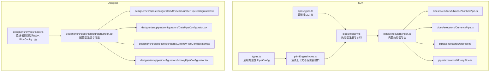
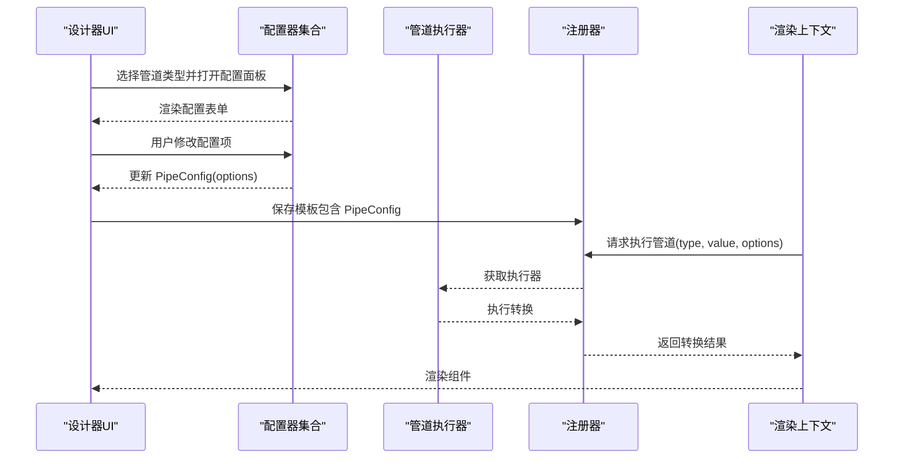
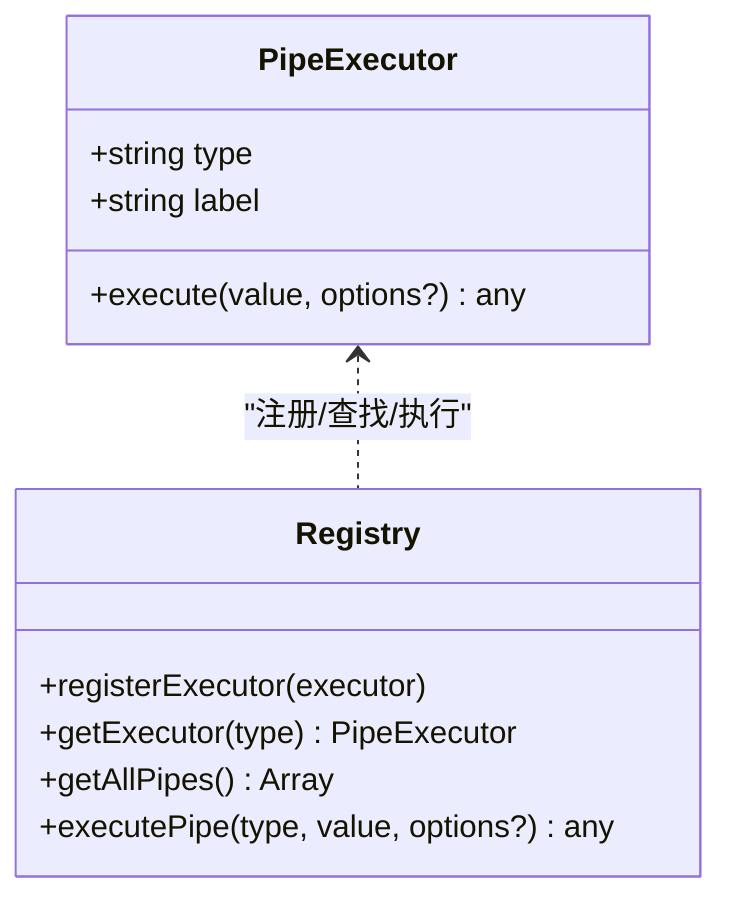
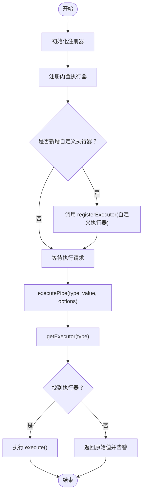
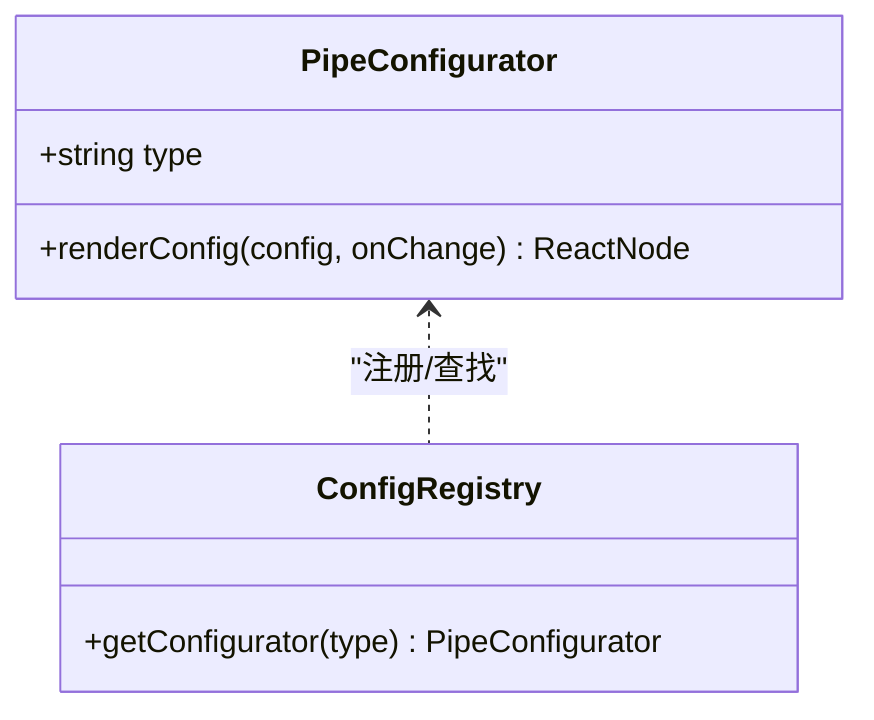
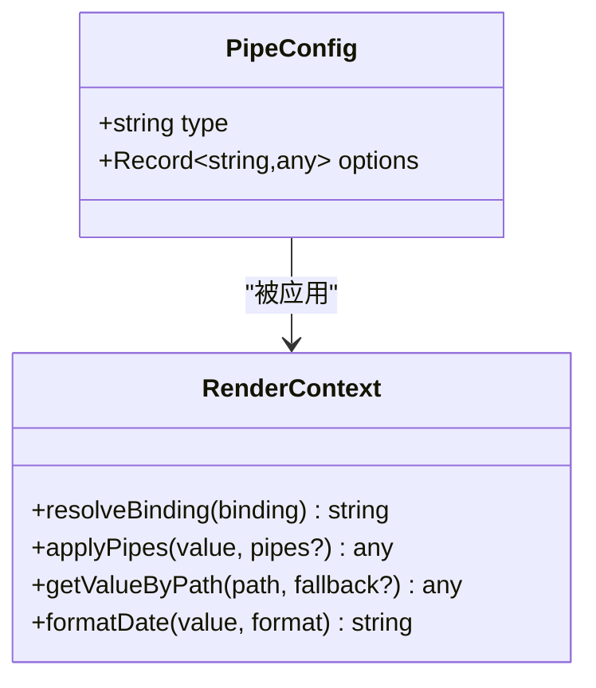
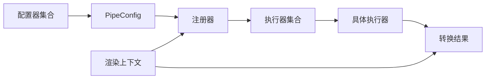

# 自定义管道开发

<cite>
**本文引用的文件**
- [sdk/src/pipes/types.ts](file://sdk/src/pipes/types.ts)
- [sdk/src/pipes/registry.ts](file://sdk/src/pipes/registry.ts)
- [sdk/src/pipes/executors/index.ts](file://sdk/src/pipes/executors/index.ts)
- [sdk/src/pipes/executors/ChineseNumberPipe.ts](file://sdk/src/pipes/executors/ChineseNumberPipe.ts)
- [sdk/src/pipes/executors/CurrencyPipe.ts](file://sdk/src/pipes/executors/CurrencyPipe.ts)
- [sdk/src/pipes/executors/DatePipe.ts](file://sdk/src/pipes/executors/DatePipe.ts)
- [sdk/src/pipes/executors/MoneyPipe.ts](file://sdk/src/pipes/executors/MoneyPipe.ts)
- [sdk/src/printEngine/types.ts](file://sdk/src/printEngine/types.ts)
- [sdk/src/types.ts](file://sdk/src/types.ts)
- [designer/src/pipes/configurators/index.tsx](file://designer/src/pipes/configurators/index.tsx)
- [designer/src/pipes/configurators/ChineseNumberPipeConfigurator.tsx](file://designer/src/pipes/configurators/ChineseNumberPipeConfigurator.tsx)
- [designer/src/pipes/configurators/DatePipeConfigurator.tsx](file://designer/src/pipes/configurators/DatePipeConfigurator.tsx)
- [designer/src/pipes/configurators/CurrencyPipeConfigurator.tsx](file://designer/src/pipes/configurators/CurrencyPipeConfigurator.tsx)
- [designer/src/pipes/configurators/MoneyPipeConfigurator.tsx](file://designer/src/pipes/configurators/MoneyPipeConfigurator.tsx)
- [designer/src/types/index.ts](file://designer/src/types/index.ts)
</cite>

## 目录
1. [简介](#简介)
2. [项目结构](#项目结构)
3. [核心组件](#核心组件)
4. [架构总览](#架构总览)
5. [详细组件分析](#详细组件分析)
6. [依赖分析](#依赖分析)
7. [性能考虑](#性能考虑)
8. [故障排查指南](#故障排查指南)
9. [结论](#结论)
10. [附录](#附录)

## 简介
本指南面向需要在打印设计与渲染系统中扩展“数据管道”的开发者，提供从接口规范、实现要求、注册机制、插件化架构到配置器与用户界面设计的完整开发流程。文档同时涵盖错误处理、异常管理、性能优化、测试与调试方法，以及与现有管道系统的集成与兼容性注意事项。

## 项目结构
围绕“管道”能力，代码主要分布在两个子工程：
- SDK（打印引擎与管道执行器）：负责管道接口定义、执行器注册与执行、渲染上下文与组件渲染器接口。
- Designer（可视化设计器）：负责管道配置器的 UI 展示与交互，将用户配置映射为管道配置对象。

图表来源
- [sdk/src/pipes/types.ts:1-30](file://sdk/src/pipes/types.ts#L1-L30)
- [sdk/src/pipes/registry.ts:1-65](file://sdk/src/pipes/registry.ts#L1-L65)
- [sdk/src/pipes/executors/index.ts:1-45](file://sdk/src/pipes/executors/index.ts#L1-L45)
- [sdk/src/printEngine/types.ts:1-116](file://sdk/src/printEngine/types.ts#L1-L116)
- [sdk/src/types.ts:77-86](file://sdk/src/types.ts#L77-L86)
- [designer/src/pipes/configurators/index.tsx:1-85](file://designer/src/pipes/configurators/index.tsx#L1-L85)
- [designer/src/types/index.ts:142-164](file://designer/src/types/index.ts#L142-L164)

章节来源
- [sdk/src/pipes/types.ts:1-30](file://sdk/src/pipes/types.ts#L1-L30)
- [sdk/src/pipes/registry.ts:1-65](file://sdk/src/pipes/registry.ts#L1-L65)
- [sdk/src/pipes/executors/index.ts:1-45](file://sdk/src/pipes/executors/index.ts#L1-L45)
- [sdk/src/printEngine/types.ts:1-116](file://sdk/src/printEngine/types.ts#L1-L116)
- [sdk/src/types.ts:77-86](file://sdk/src/types.ts#L77-L86)
- [designer/src/pipes/configurators/index.tsx:1-85](file://designer/src/pipes/configurators/index.tsx#L1-L85)
- [designer/src/types/index.ts:142-164](file://designer/src/types/index.ts#L142-L164)

## 核心组件
- 管道执行器接口：定义 type、label 与 execute 方法，统一后端转换逻辑。
- 管道注册器：提供注册、查询、遍历与执行入口，并内置初始化注册。
- 渲染上下文：提供数据解析、管道应用、日期格式化等能力，供渲染器调用。
- 管道配置器：在设计器中根据管道类型渲染配置 UI，生成/更新 PipeConfig。
- 管道配置类型：标准化的管道配置对象，包含 type 与 options。

章节来源
- [sdk/src/pipes/types.ts:11-29](file://sdk/src/pipes/types.ts#L11-L29)
- [sdk/src/pipes/registry.ts:17-52](file://sdk/src/pipes/registry.ts#L17-L52)
- [sdk/src/printEngine/types.ts:11-55](file://sdk/src/printEngine/types.ts#L11-L55)
- [sdk/src/types.ts:77-86](file://sdk/src/types.ts#L77-L86)
- [designer/src/pipes/configurators/index.tsx:17-20](file://designer/src/pipes/configurators/index.tsx#L17-L20)

## 架构总览
管道系统采用“执行器 + 配置器”的双层架构：
- 执行器层：实现具体转换逻辑，通过注册器集中管理与执行。
- 配置器层：在设计器中提供可视化的配置界面，将用户输入转化为管道配置对象。
- 渲染层：渲染器通过渲染上下文统一调用管道，完成数据到最终展示的转换。

图表来源
- [sdk/src/pipes/registry.ts:45-52](file://sdk/src/pipes/registry.ts#L45-L52)
- [sdk/src/printEngine/types.ts:23-25](file://sdk/src/printEngine/types.ts#L23-L25)
- [designer/src/pipes/configurators/index.tsx:69-84](file://designer/src/pipes/configurators/index.tsx#L69-L84)

## 详细组件分析

### 管道执行器接口与生命周期
- 接口职责
  - type：唯一标识，用于注册与查找。
  - label：显示名称，用于 UI 下拉选择。
  - execute：执行转换，接收输入值与可选 options，返回转换结果。
- 生命周期
  - 注册阶段：在应用启动时将执行器注册到注册表。
  - 执行阶段：渲染上下文调用注册器获取执行器并执行。
  - 销毁阶段：当前实现未提供显式销毁钩子，通常随进程生命周期存在。

图表来源
- [sdk/src/pipes/types.ts:11-29](file://sdk/src/pipes/types.ts#L11-L29)
- [sdk/src/pipes/registry.ts:17-52](file://sdk/src/pipes/registry.ts#L17-L52)

章节来源
- [sdk/src/pipes/types.ts:11-29](file://sdk/src/pipes/types.ts#L11-L29)
- [sdk/src/pipes/registry.ts:17-52](file://sdk/src/pipes/registry.ts#L17-L52)

### 管道注册机制与插件化架构
- 注册器职责
  - 维护 Map 映射：type -> PipeExecutor。
  - 提供注册、查询、遍历与执行入口。
  - 初始化时注册内置执行器，形成“插件化”扩展点。
- 插件化要点
  - 新增执行器只需实现 PipeExecutor 并调用 registerExecutor。
  - UI 下拉列表通过 getAllPipes 动态呈现，无需硬编码。
  - 执行器可按需替换或新增，不影响其他模块。

图表来源
- [sdk/src/pipes/registry.ts:54-65](file://sdk/src/pipes/registry.ts#L54-L65)
- [sdk/src/pipes/registry.ts:17-52](file://sdk/src/pipes/registry.ts#L17-L52)

章节来源
- [sdk/src/pipes/registry.ts:12-19](file://sdk/src/pipes/registry.ts#L12-L19)
- [sdk/src/pipes/registry.ts:31-40](file://sdk/src/pipes/registry.ts#L31-L40)
- [sdk/src/pipes/registry.ts:45-52](file://sdk/src/pipes/registry.ts#L45-L52)
- [sdk/src/pipes/registry.ts:54-65](file://sdk/src/pipes/registry.ts#L54-L65)

### 管道配置器开发与用户界面设计
- 设计器侧配置器接口
  - type：与执行器 type 对应。
  - renderConfig：接收当前配置与变更回调，返回 React 节点。
- 注册机制
  - 通过 Map 维护 type -> Configurator 的映射。
  - 初始化时注册内置配置器，便于 UI 快速查找。
- UI 设计建议
  - 使用受控组件（如 Input、InputNumber、Radio、Checkbox）同步 options。
  - 对于复杂选项，采用分组与折叠，提升可读性。
  - 对中文场景提供单位、连接符等本地化选项。

图表来源
- [designer/src/pipes/configurators/index.tsx:17-20](file://designer/src/pipes/configurators/index.tsx#L17-L20)
- [designer/src/pipes/configurators/index.tsx:79-84](file://designer/src/pipes/configurators/index.tsx#L79-L84)

章节来源
- [designer/src/pipes/configurators/index.tsx:17-20](file://designer/src/pipes/configurators/index.tsx#L17-L20)
- [designer/src/pipes/configurators/index.tsx:69-84](file://designer/src/pipes/configurators/index.tsx#L69-L84)

### 管道配置对象与渲染上下文
- PipeConfig
  - type：管道类型。
  - options：配置参数对象。
- 渲染上下文 RenderContext
  - 提供 resolveBinding、applyPipes、getValueByPath、formatDate 等方法。
  - 渲染器通过 applyPipes(value, pipes) 应用管道链路。

图表来源
- [sdk/src/types.ts:77-86](file://sdk/src/types.ts#L77-L86)
- [sdk/src/printEngine/types.ts:11-55](file://sdk/src/printEngine/types.ts#L11-L55)

章节来源
- [sdk/src/types.ts:77-86](file://sdk/src/types.ts#L77-L86)
- [sdk/src/printEngine/types.ts:23-25](file://sdk/src/printEngine/types.ts#L23-L25)

### 典型执行器实现与配置器对照
- 日期格式化（DatePipe）
  - 执行器：根据 format 替换占位符，处理非法日期回退。
  - 配置器：输入格式字符串。
- 货币格式化（CurrencyPipe）
  - 执行器：支持符号与精度。
  - 配置器：输入货币符号。
- 金额转换（MoneyPipe）
  - 执行器：支持分/元互转、精度、千分位、中文大写等。
  - 配置器：输出格式、转换模式、精度、符号、千分位、中文大写模式与连接符等。
- 中文大写数字（ChineseNumberPipe）
  - 执行器：支持原值+大写与连接符、单位后缀。
  - 配置器：输出模式、连接符、单位。

章节来源
- [sdk/src/pipes/executors/DatePipe.ts:7-34](file://sdk/src/pipes/executors/DatePipe.ts#L7-L34)
- [designer/src/pipes/configurators/DatePipeConfigurator.tsx:9-22](file://designer/src/pipes/configurators/DatePipeConfigurator.tsx#L9-L22)
- [sdk/src/pipes/executors/CurrencyPipe.ts:7-16](file://sdk/src/pipes/executors/CurrencyPipe.ts#L7-L16)
- [designer/src/pipes/configurators/CurrencyPipeConfigurator.tsx:9-22](file://designer/src/pipes/configurators/CurrencyPipeConfigurator.tsx#L9-L22)
- [sdk/src/pipes/executors/MoneyPipe.ts:59-129](file://sdk/src/pipes/executors/MoneyPipe.ts#L59-L129)
- [designer/src/pipes/configurators/MoneyPipeConfigurator.tsx:9-142](file://designer/src/pipes/configurators/MoneyPipeConfigurator.tsx#L9-L142)
- [sdk/src/pipes/executors/ChineseNumberPipe.ts:99-137](file://sdk/src/pipes/executors/ChineseNumberPipe.ts#L99-L137)
- [designer/src/pipes/configurators/ChineseNumberPipeConfigurator.tsx:11-57](file://designer/src/pipes/configurators/ChineseNumberPipeConfigurator.tsx#L11-L57)

## 依赖分析
- 组件耦合
  - 执行器与注册器：低耦合，通过 type 解耦。
  - 配置器与执行器：通过 type 关联，UI 与逻辑解耦。
  - 渲染器与执行器：通过 RenderContext.applyPipes 间接耦合。
- 外部依赖
  - 渲染器依赖 RenderContext 能力。
  - MoneyPipe 使用 decimal.js 进行高精度计算。
- 潜在循环依赖
  - 当前结构清晰，未见循环导入。

图表来源
- [sdk/src/pipes/registry.ts:45-52](file://sdk/src/pipes/registry.ts#L45-L52)
- [sdk/src/printEngine/types.ts:23-25](file://sdk/src/printEngine/types.ts#L23-L25)
- [sdk/src/types.ts:77-86](file://sdk/src/types.ts#L77-L86)

章节来源
- [sdk/src/pipes/registry.ts:17-52](file://sdk/src/pipes/registry.ts#L17-L52)
- [sdk/src/printEngine/types.ts:11-55](file://sdk/src/printEngine/types.ts#L11-L55)

## 性能考虑
- 执行器内部
  - 避免重复计算：对相同输入与 options 缓存中间结果（视场景而定）。
  - 精度与格式化：使用高精度库（如 decimal.js）处理金额，减少浮点误差。
  - 字符串处理：批量替换或正则优化，避免多次构造。
- 注册与查找
  - 使用 Map 结构保证 O(1) 查找，避免频繁重建注册表。
- 渲染上下文
  - applyPipes 串联多个管道时，注意短路与早停策略，减少无效计算。
- UI 配置器
  - 使用受控组件与节流/防抖，降低频繁重渲染开销。

## 故障排查指南
- 执行器未找到
  - 现象：executePipe 返回原始值并告警。
  - 排查：确认 type 是否正确、是否已注册。
- 非法输入
  - 现象：日期格式化返回原值；金额转换捕获异常并回退。
  - 排查：检查输入类型与 options 合理性。
- 配置器不生效
  - 现象：UI 修改未影响输出。
  - 排查：确认 type 与执行器一致、onChange 回调正确更新 options。
- 渲染异常
  - 现象：组件渲染空白或报错。
  - 排查：检查 applyPipes 的 pipes 链路与数据绑定路径。

章节来源
- [sdk/src/pipes/registry.ts:47-51](file://sdk/src/pipes/registry.ts#L47-L51)
- [sdk/src/pipes/executors/DatePipe.ts:14-17](file://sdk/src/pipes/executors/DatePipe.ts#L14-L17)
- [sdk/src/pipes/executors/MoneyPipe.ts:124-127](file://sdk/src/pipes/executors/MoneyPipe.ts#L124-L127)

## 结论
通过“执行器 + 配置器 + 注册器 + 渲染上下文”的分层架构，系统实现了高扩展性的管道能力。开发者只需遵循接口规范、正确注册执行器、编写对应的配置器 UI，并在渲染上下文中应用管道，即可快速扩展新的数据转换功能。配合完善的错误处理与性能优化建议，可在保证稳定性的同时获得良好的用户体验。

## 附录

### 自定义管道开发流程（从接口实现到注册使用）
- 步骤一：实现执行器
  - 定义类型与标签，实现 execute(value, options?)。
  - 参考现有执行器：[日期格式化:7-34](file://sdk/src/pipes/executors/DatePipe.ts#L7-L34)、[货币格式化:7-16](file://sdk/src/pipes/executors/CurrencyPipe.ts#L7-L16)、[金额转换:59-129](file://sdk/src/pipes/executors/MoneyPipe.ts#L59-L129)、[中文大写:99-137](file://sdk/src/pipes/executors/ChineseNumberPipe.ts#L99-L137)。
- 步骤二：注册执行器
  - 调用 registerExecutor(executor) 完成注册。
  - 参考注册器：[注册与执行:17-52](file://sdk/src/pipes/registry.ts#L17-L52)。
- 步骤三：编写配置器
  - 实现 renderConfig(config, onChange)，返回 UI 组件树。
  - 参考现有配置器：[日期:9-22](file://designer/src/pipes/configurators/DatePipeConfigurator.tsx#L9-22)、[货币:9-22](file://designer/src/pipes/configurators/CurrencyPipeConfigurator.tsx#L9-22)、[金额:9-142](file://designer/src/pipes/configurators/MoneyPipeConfigurator.tsx#L9-142)、[中文大写:11-57](file://designer/src/pipes/configurators/ChineseNumberPipeConfigurator.tsx#L11-57)。
- 步骤四：注册配置器
  - 将配置器加入注册表，确保 type 与执行器一致。
  - 参考注册器：[配置器注册:69-84](file://designer/src/pipes/configurators/index.tsx#L69-L84)。
- 步骤五：在渲染上下文中应用
  - 通过 RenderContext.applyPipes(value, pipes) 应用管道链路。
  - 参考上下文：[渲染上下文:23-25](file://sdk/src/printEngine/types.ts#L23-L25)。

章节来源
- [sdk/src/pipes/executors/DatePipe.ts:7-34](file://sdk/src/pipes/executors/DatePipe.ts#L7-L34)
- [sdk/src/pipes/executors/CurrencyPipe.ts:7-16](file://sdk/src/pipes/executors/CurrencyPipe.ts#L7-L16)
- [sdk/src/pipes/executors/MoneyPipe.ts:59-129](file://sdk/src/pipes/executors/MoneyPipe.ts#L59-L129)
- [sdk/src/pipes/executors/ChineseNumberPipe.ts:99-137](file://sdk/src/pipes/executors/ChineseNumberPipe.ts#L99-L137)
- [sdk/src/pipes/registry.ts:17-52](file://sdk/src/pipes/registry.ts#L17-L52)
- [designer/src/pipes/configurators/DatePipeConfigurator.tsx:9-22](file://designer/src/pipes/configurators/DatePipeConfigurator.tsx#L9-L22)
- [designer/src/pipes/configurators/CurrencyPipeConfigurator.tsx:9-22](file://designer/src/pipes/configurators/CurrencyPipeConfigurator.tsx#L9-L22)
- [designer/src/pipes/configurators/MoneyPipeConfigurator.tsx:9-142](file://designer/src/pipes/configurators/MoneyPipeConfigurator.tsx#L9-L142)
- [designer/src/pipes/configurators/ChineseNumberPipeConfigurator.tsx:11-57](file://designer/src/pipes/configurators/ChineseNumberPipeConfigurator.tsx#L11-L57)
- [sdk/src/printEngine/types.ts:23-25](file://sdk/src/printEngine/types.ts#L23-L25)

### 与现有管道系统的集成与兼容性
- 类型一致性
  - 确保自定义执行器的 type 与配置器一致，避免 UI 无法匹配。
  - PipeConfig 的结构保持不变，options 由执行器自行解析。
- 渲染兼容
  - 通过 RenderContext.applyPipes 统一接入，无需关心具体执行器实现。
- 兼容性建议
  - 保持 execute 方法幂等，避免副作用。
  - 对异常输入进行显式处理并返回安全值，避免中断渲染链路。

章节来源
- [sdk/src/types.ts:77-86](file://sdk/src/types.ts#L77-L86)
- [sdk/src/printEngine/types.ts:23-25](file://sdk/src/printEngine/types.ts#L23-L25)
- [designer/src/pipes/configurators/index.tsx:69-84](file://designer/src/pipes/configurators/index.tsx#L69-L84)