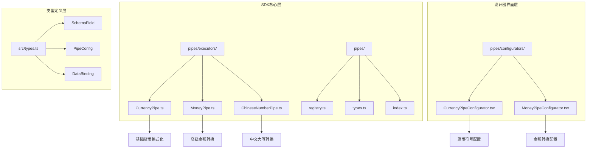
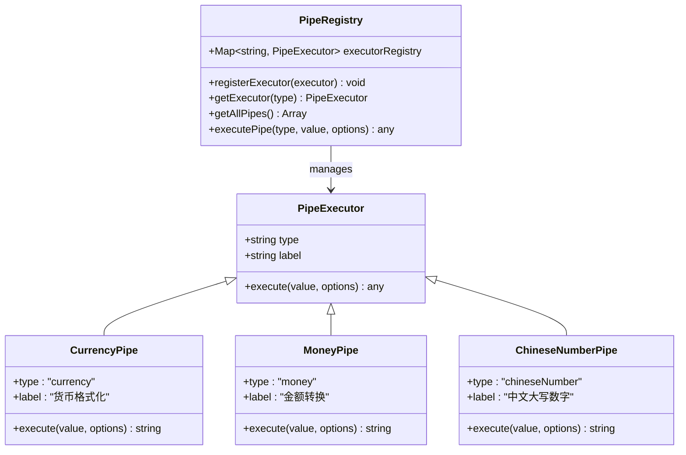
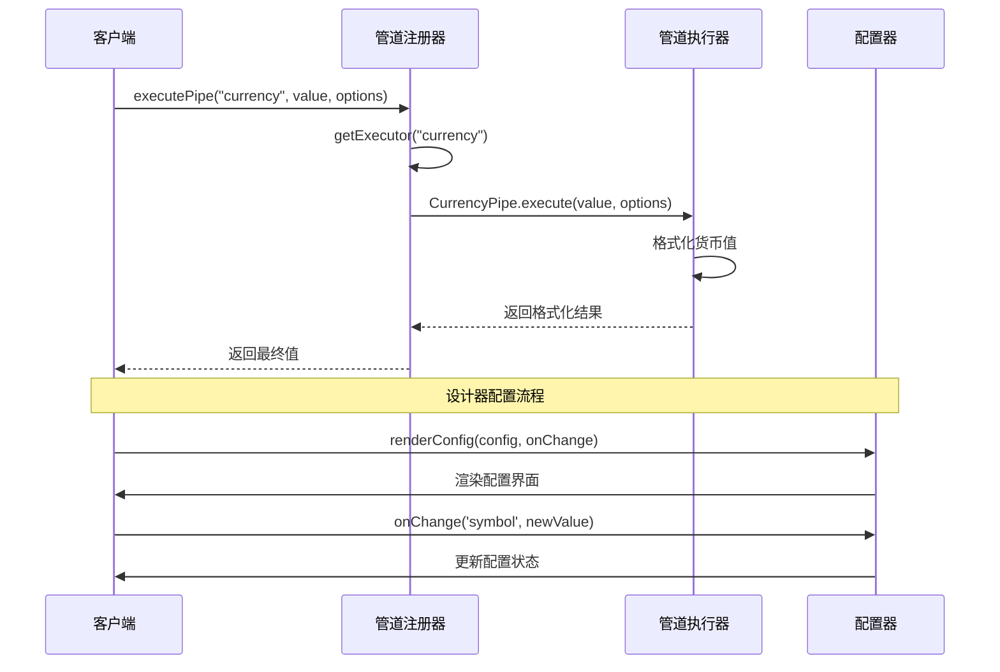
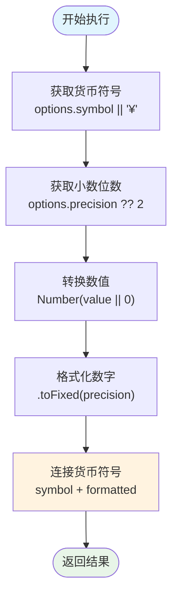
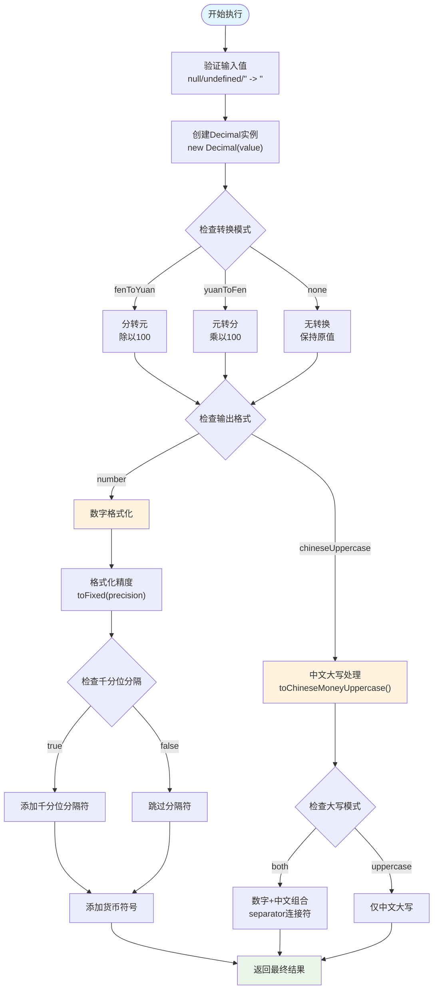
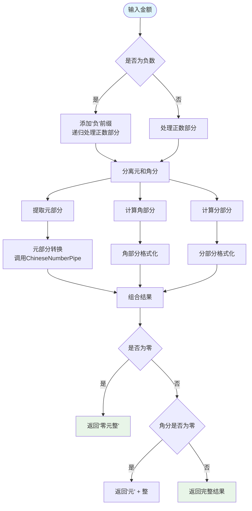
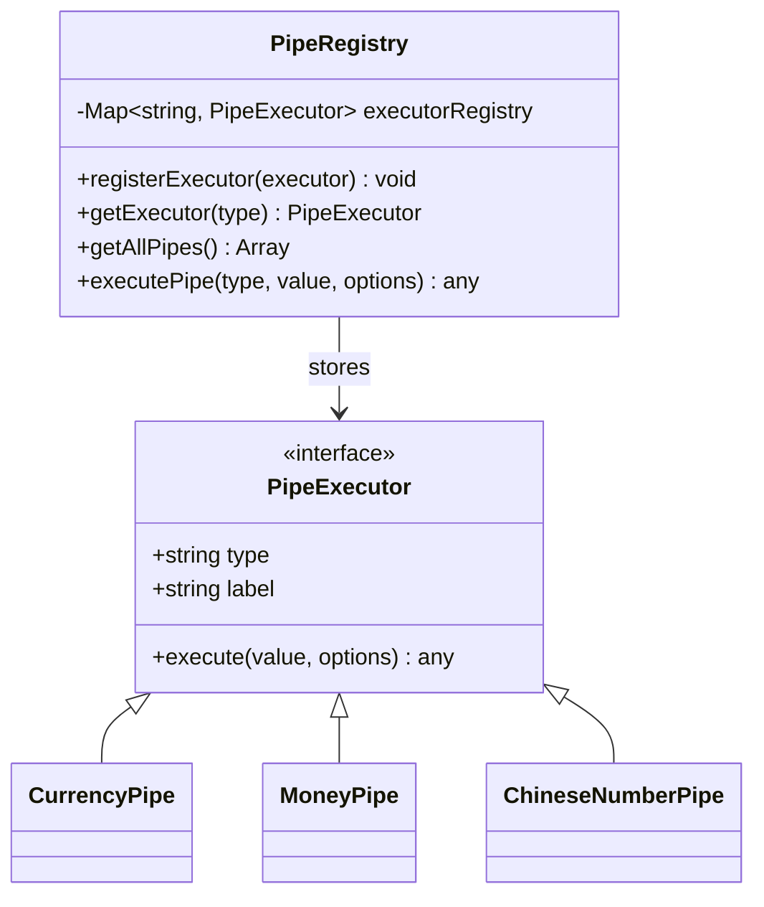
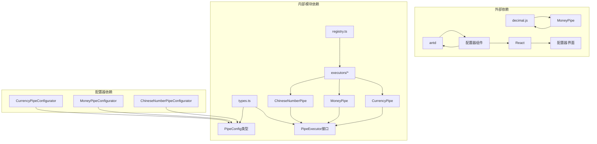
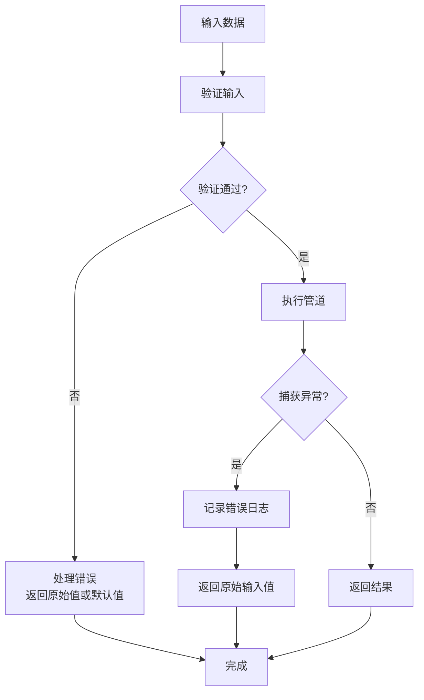

# 货币格式化管道

<cite>
**本文档引用的文件**
- [CurrencyPipe.ts](file://sdk/src/pipes/executors/CurrencyPipe.ts)
- [MoneyPipe.ts](file://sdk/src/pipes/executors/MoneyPipe.ts)
- [registry.ts](file://sdk/src/pipes/registry.ts)
- [types.ts](file://sdk/src/pipes/types.ts)
- [index.ts](file://sdk/src/pipes/index.ts)
- [CurrencyPipeConfigurator.tsx](file://designer/src/pipes/configurators/CurrencyPipeConfigurator.tsx)
- [MoneyPipeConfigurator.tsx](file://designer/src/pipes/configurators/MoneyPipeConfigurator.tsx)
- [ChineseNumberPipe.ts](file://sdk/src/pipes/executors/ChineseNumberPipe.ts)
- [技术架构文档(仅参考).md](file://docs/技术架构文档(仅参考).md)
- [types.ts](file://sdk/src/types.ts)
</cite>

## 目录
1. [简介](#简介)
2. [项目结构](#项目结构)
3. [核心组件](#核心组件)
4. [架构概览](#架构概览)
5. [详细组件分析](#详细组件分析)
6. [依赖关系分析](#依赖关系分析)
7. [性能考虑](#性能考虑)
8. [故障排除指南](#故障排除指南)
9. [结论](#结论)
10. [附录](#附录)

## 简介

货币格式化管道是打印设计系统中的重要数据处理组件，负责将原始数值转换为符合业务需求的货币显示格式。该系统提供了两种主要的货币处理能力：基础货币格式化和高级金额转换。

基础货币格式化管道专注于简单的货币符号添加和小数位数控制，而高级金额转换管道则提供了更复杂的金融计算功能，包括分转元、元转分、千分位分隔符和中文大写金额等功能。

## 项目结构

货币格式化管道系统采用模块化设计，主要分布在以下目录结构中：

**图表来源**
- [CurrencyPipe.ts:1-17](file://sdk/src/pipes/executors/CurrencyPipe.ts#L1-L17)
- [MoneyPipe.ts:1-130](file://sdk/src/pipes/executors/MoneyPipe.ts#L1-L130)
- [registry.ts:1-65](file://sdk/src/pipes/registry.ts#L1-L65)

**章节来源**
- [index.ts:1-9](file://sdk/src/pipes/index.ts#L1-L9)
- [types.ts:1-30](file://sdk/src/pipes/types.ts#L1-L30)

## 核心组件

货币格式化管道系统包含三个核心组件，每个组件都有其特定的功能和应用场景：

### 基础货币格式化管道 (CurrencyPipe)
- **功能**：添加货币符号和控制小数位数
- **特点**：简单直接，适合基本的货币显示需求
- **配置选项**：symbol（货币符号）、precision（小数位数）

### 高级金额转换管道 (MoneyPipe)
- **功能**：复杂的金融计算和格式化
- **特点**：支持多种转换模式和格式化选项
- **配置选项**：mode、precision、symbol、separator、format、uppercaseMode

### 中文大写转换管道 (ChineseNumberPipe)
- **功能**：将阿拉伯数字转换为中文大写形式
- **特点**：支持会计规范的中文金额表示
- **配置选项**：mode、unit、separator

**章节来源**
- [CurrencyPipe.ts:7-16](file://sdk/src/pipes/executors/CurrencyPipe.ts#L7-L16)
- [MoneyPipe.ts:59-129](file://sdk/src/pipes/executors/MoneyPipe.ts#L59-L129)
- [ChineseNumberPipe.ts:99-137](file://sdk/src/pipes/executors/ChineseNumberPipe.ts#L99-L137)

## 架构概览

货币格式化管道系统采用插件化架构设计，通过注册器统一管理各个管道执行器：

**图表来源**
- [types.ts:11-29](file://sdk/src/pipes/types.ts#L11-L29)
- [registry.ts:12-26](file://sdk/src/pipes/registry.ts#L12-L26)
- [CurrencyPipe.ts:7-16](file://sdk/src/pipes/executors/CurrencyPipe.ts#L7-L16)

系统的执行流程遵循标准的数据管道模式：

**图表来源**
- [registry.ts:45-52](file://sdk/src/pipes/registry.ts#L45-L52)
- [CurrencyPipe.ts:11-15](file://sdk/src/pipes/executors/CurrencyPipe.ts#L11-L15)

**章节来源**
- [registry.ts:42-65](file://sdk/src/pipes/registry.ts#L42-L65)
- [types.ts:1-30](file://sdk/src/pipes/types.ts#L1-L30)

## 详细组件分析

### 基础货币格式化管道 (CurrencyPipe)

CurrencyPipe 是最简单的货币处理组件，专注于基本的货币符号添加和小数位数控制：

#### 核心功能实现
- **货币符号处理**：支持自定义货币符号，默认使用人民币符号
- **小数位数控制**：可配置小数位数，默认保留两位小数
- **数值安全转换**：使用 Number() 构造函数确保输入为数值类型

#### 执行逻辑流程

**图表来源**
- [CurrencyPipe.ts:11-15](file://sdk/src/pipes/executors/CurrencyPipe.ts#L11-L15)

#### 使用场景和配置

| 配置项 | 类型 | 默认值 | 描述 |
|--------|------|--------|------|
| symbol | string | '¥' | 货币符号，支持各种货币符号 |
| precision | number | 2 | 小数位数，控制精度 |

**章节来源**
- [CurrencyPipe.ts:1-17](file://sdk/src/pipes/executors/CurrencyPipe.ts#L1-L17)
- [CurrencyPipeConfigurator.tsx:9-22](file://designer/src/pipes/configurators/CurrencyPipeConfigurator.tsx#L9-L22)

### 高级金额转换管道 (MoneyPipe)

MoneyPipe 提供了最复杂的货币处理功能，支持多种金融计算和格式化需求：

#### 核心功能特性
- **多模式转换**：支持分转元、元转分、无转换三种模式
- **高精度计算**：使用 decimal.js 库避免浮点数精度问题
- **灵活格式化**：支持数字格式和中文大写两种输出格式
- **千分位分隔**：可选的千分位分隔符功能
- **中文大写金额**：遵循会计规范的中文金额表示

#### 执行逻辑详解

**图表来源**
- [MoneyPipe.ts:63-129](file://sdk/src/pipes/executors/MoneyPipe.ts#L63-L129)

#### 配置参数详解

| 配置项 | 类型 | 默认值 | 可选值 | 描述 |
|--------|------|--------|--------|------|
| mode | string | 'fenToYuan' | 'fenToYuan', 'yuanToFen', 'none' | 转换模式 |
| precision | number | 2 | 0-8 | 小数位数精度 |
| symbol | string | '' | 任意字符串 | 货币符号 |
| separator | boolean | false | true, false | 是否启用千分位分隔 |
| format | string | 'number' | 'number', 'chineseUppercase' | 输出格式 |
| uppercaseMode | string | 'uppercase' | 'uppercase', 'both' | 中文大写模式 |

#### 中文大写金额转换规则

MoneyPipe 的中文大写转换遵循严格的会计规范：

**图表来源**
- [MoneyPipe.ts:18-57](file://sdk/src/pipes/executors/MoneyPipe.ts#L18-L57)

**章节来源**
- [MoneyPipe.ts:1-130](file://sdk/src/pipes/executors/MoneyPipe.ts#L1-L130)
- [ChineseNumberPipe.ts:17-62](file://sdk/src/pipes/executors/ChineseNumberPipe.ts#L17-L62)

### 管道注册和配置系统

#### 管道注册器 (PipeRegistry)

PipeRegistry 负责管理所有管道执行器的生命周期：

**图表来源**
- [registry.ts:12-26](file://sdk/src/pipes/registry.ts#L12-L26)

#### 设计器配置器 (PipeConfigurator)

设计器提供了直观的图形化配置界面：

| 管道类型 | 配置器 | 主要配置项 | 使用场景 |
|----------|--------|------------|----------|
| currency | CurrencyPipeConfigurator | symbol | 基础货币符号显示 |
| money | MoneyPipeConfigurator | mode, precision, symbol, separator, format, uppercaseMode | 复杂金额处理和格式化 |
| chineseNumber | ChineseNumberPipeConfigurator | mode, unit, separator | 中文大写数字转换 |

**章节来源**
- [registry.ts:54-65](file://sdk/src/pipes/registry.ts#L54-L65)
- [CurrencyPipeConfigurator.tsx:9-22](file://designer/src/pipes/configurators/CurrencyPipeConfigurator.tsx#L9-L22)
- [MoneyPipeConfigurator.tsx:9-42](file://designer/src/pipes/configurators/MoneyPipeConfigurator.tsx#L9-L42)

## 依赖关系分析

货币格式化管道系统具有清晰的依赖层次结构：

**图表来源**
- [MoneyPipe.ts](file://sdk/src/pipes/executors/MoneyPipe.ts#L6)
- [registry.ts](file://sdk/src/pipes/registry.ts#L7)

### 关键依赖说明

1. **decimal.js**：用于高精度的金融计算，避免 JavaScript 浮点数精度问题
2. **antd**：提供 React UI 组件库，用于设计器的配置界面
3. **React**：前端框架，支撑整个设计器的用户界面

### 模块耦合度分析

- **低耦合设计**：各管道执行器相互独立，通过统一接口通信
- **清晰的职责分离**：执行器负责业务逻辑，注册器负责生命周期管理
- **可扩展性**：新的管道可以通过简单注册加入系统

**章节来源**
- [MoneyPipe.ts](file://sdk/src/pipes/executors/MoneyPipe.ts#L6)
- [registry.ts:1-65](file://sdk/src/pipes/registry.ts#L1-L65)

## 性能考虑

### 计算复杂度分析

1. **CurrencyPipe**：时间复杂度 O(1)，空间复杂度 O(1)
2. **MoneyPipe**：时间复杂度 O(n)，其中 n 为数字长度，空间复杂度 O(n)
3. **ChineseNumberPipe**：时间复杂度 O(k)，其中 k 为数字位数，空间复杂度 O(k)

### 优化策略

1. **缓存机制**：对于重复的格式化操作，可以考虑结果缓存
2. **批量处理**：在大量数据处理时，优先使用 MoneyPipe 的高精度计算
3. **懒加载**：配置器组件按需加载，减少初始包体积

### 内存管理

- 所有管道执行器都是纯函数式设计，无状态保持
- Decimal.js 实例在每次调用时创建，自动垃圾回收
- React 组件通过合理的状态管理避免内存泄漏

## 故障排除指南

### 常见错误和解决方案

#### 输入验证错误
- **问题**：空值或无效输入导致格式化失败
- **解决方案**：CurrencyPipe 和 MoneyPipe 都实现了输入验证，自动处理空值情况

#### 精度计算错误
- **问题**：JavaScript 浮点数精度问题导致计算错误
- **解决方案**：MoneyPipe 使用 decimal.js 库确保高精度计算

#### 配置错误
- **问题**：配置参数超出有效范围
- **解决方案**：设计器配置器提供实时验证和错误提示

#### 错误处理机制

**图表来源**
- [MoneyPipe.ts:124-127](file://sdk/src/pipes/executors/MoneyPipe.ts#L124-L127)

**章节来源**
- [CurrencyPipe.ts:11-15](file://sdk/src/pipes/executors/CurrencyPipe.ts#L11-L15)
- [MoneyPipe.ts:63-129](file://sdk/src/pipes/executors/MoneyPipe.ts#L63-L129)

## 结论

货币格式化管道系统提供了完整的货币数据处理解决方案，从基础的货币符号添加到复杂的金融计算和格式化。系统的设计充分考虑了实用性、可扩展性和性能要求。

### 主要优势

1. **功能完整性**：涵盖从简单货币显示到复杂金额处理的所有需求
2. **高精度计算**：使用 decimal.js 确保金融计算的准确性
3. **用户友好**：提供直观的图形化配置界面
4. **可扩展性**：模块化设计支持新功能的轻松添加

### 最佳实践建议

1. **选择合适的管道**：根据业务需求选择基础货币格式化或高级金额转换
2. **合理配置精度**：根据业务场景设置合适的小数位数
3. **使用高精度计算**：涉及金融计算时优先使用 MoneyPipe
4. **本地化支持**：通过配置器轻松支持不同地区的货币格式

## 附录

### 使用示例和场景

#### 基础货币格式化示例
- **场景**：商品价格显示
- **配置**：symbol='¥', precision=2
- **结果**：¥9999.00

#### 高级金额转换示例
- **场景**：财务报表金额显示
- **配置**：mode='fenToYuan', precision=2, symbol='¥', separator=true
- **结果**：¥1,293,666.00

#### 中文大写金额示例
- **场景**：支票金额大写
- **配置**：format='chineseUppercase', uppercaseMode='both'
- **结果**：123.45（壹佰贰拾叁元肆角伍分）

### 集成指南

#### 与业务数据集成
1. **数据绑定**：通过 DataBinding 接口将管道集成到模板系统
2. **Schema 配置**：在 SchemaField 中定义货币字段的格式化规则
3. **动态配置**：运行时根据业务需求动态调整管道配置

#### 性能优化建议
1. **批量处理**：对大量数据进行批量格式化处理
2. **缓存策略**：对重复的格式化操作实施缓存机制
3. **异步处理**：对于复杂的中文大写转换，考虑异步处理方案

**章节来源**
- [技术架构文档(仅参考).md](file://docs/技术架构文档(仅参考).md#L177-L228)
- [types.ts:77-86](file://sdk/src/types.ts#L77-L86)