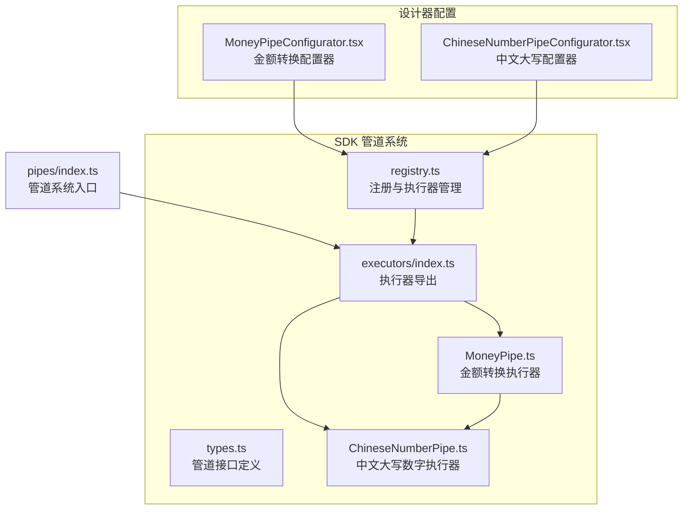
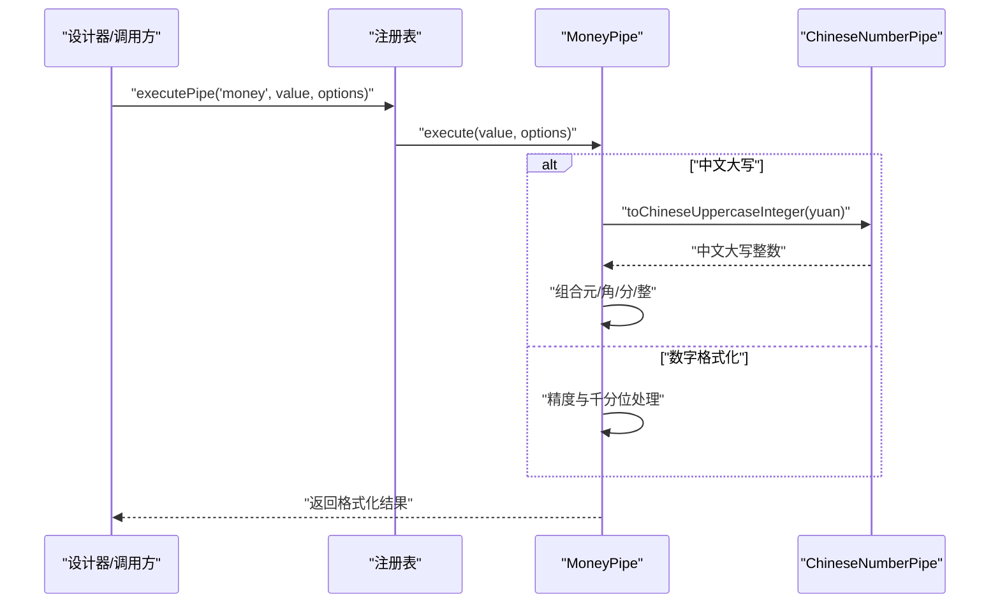
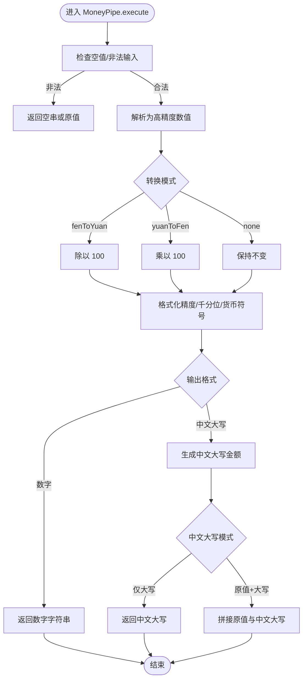
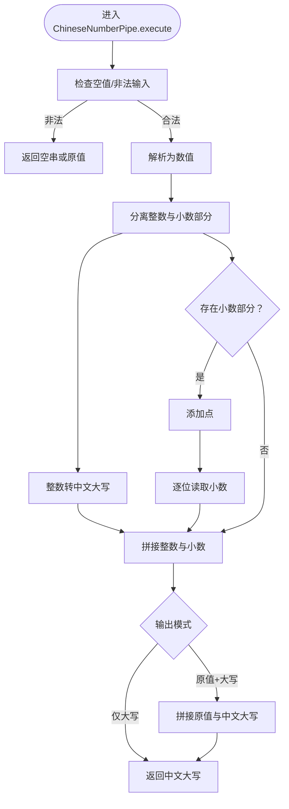
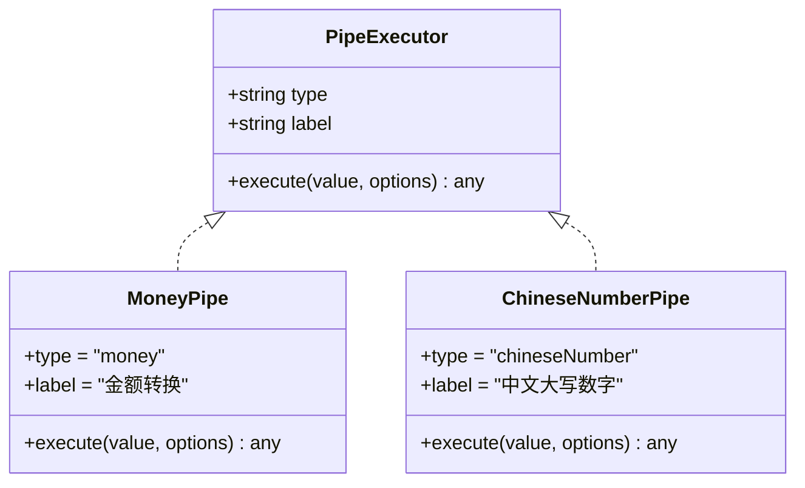
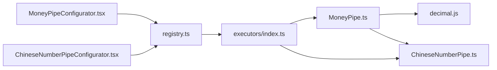

# 金额转换管道

<cite>
**本文引用的文件**
- [MoneyPipe.ts](file://sdk/src/pipes/executors/MoneyPipe.ts)
- [ChineseNumberPipe.ts](file://sdk/src/pipes/executors/ChineseNumberPipe.ts)
- [MoneyPipeConfigurator.tsx](file://designer/src/pipes/configurators/MoneyPipeConfigurator.tsx)
- [ChineseNumberPipeConfigurator.tsx](file://designer/src/pipes/configurators/ChineseNumberPipeConfigurator.tsx)
- [registry.ts](file://sdk/src/pipes/registry.ts)
- [types.ts](file://sdk/src/pipes/types.ts)
- [executors/index.ts](file://sdk/src/pipes/executors/index.ts)
- [pipes/index.ts](file://sdk/src/pipes/index.ts)
- [TableColumnSection.tsx](file://designer/src/pages/Designer/components/PropertyPanel/TableColumnSection.tsx)
</cite>

## 目录
1. [简介](#简介)
2. [项目结构](#项目结构)
3. [核心组件](#核心组件)
4. [架构总览](#架构总览)
5. [详细组件分析](#详细组件分析)
6. [依赖关系分析](#依赖关系分析)
7. [性能与精度考量](#性能与精度考量)
8. [使用示例](#使用示例)
9. [配置与自定义](#配置与自定义)
10. [边界情况与异常处理](#边界情况与异常处理)
11. [财务票据打印场景与注意事项](#财务票据打印场景与注意事项)
12. [结论](#结论)

## 简介
本技术文档围绕“金额转换管道”展开，系统性阐述其核心功能、算法实现、配置选项与使用方式，并结合设计器可视化配置与打印引擎的实际集成路径，帮助开发者与产品人员准确理解与应用该能力。重点覆盖：
- 阿拉伯数字到中文大写金额的转换机制
- 支持的金额范围、精度控制与特殊字符处理
- 整数部分与小数部分（元/角/分）的处理规则
- 完整的使用示例与边界情况处理
- 在财务票据打印中的应用场景与注意事项

## 项目结构
金额转换管道位于 SDK 的管道系统中，通过统一的注册与执行机制对外提供服务；设计器侧提供可视化的配置界面。

**图表来源**
- [registry.ts:1-65](file://sdk/src/pipes/registry.ts#L1-L65)
- [executors/index.ts:1-45](file://sdk/src/pipes/executors/index.ts#L1-L45)
- [MoneyPipe.ts:1-130](file://sdk/src/pipes/executors/MoneyPipe.ts#L1-L130)
- [ChineseNumberPipe.ts:1-138](file://sdk/src/pipes/executors/ChineseNumberPipe.ts#L1-L138)
- [MoneyPipeConfigurator.tsx:1-143](file://designer/src/pipes/configurators/MoneyPipeConfigurator.tsx#L1-L143)
- [ChineseNumberPipeConfigurator.tsx:1-58](file://designer/src/pipes/configurators/ChineseNumberPipeConfigurator.tsx#L1-L58)
- [pipes/index.ts:1-9](file://sdk/src/pipes/index.ts#L1-L9)

**章节来源**
- [registry.ts:1-65](file://sdk/src/pipes/registry.ts#L1-L65)
- [executors/index.ts:1-45](file://sdk/src/pipes/executors/index.ts#L1-L45)
- [pipes/index.ts:1-9](file://sdk/src/pipes/index.ts#L1-L9)

## 核心组件
- 金额转换执行器（MoneyPipe）：负责金额单位转换（分→元、元→分、不转换）、数值格式化（精度、千分位）、中文大写金额生成（元/角/分/整）以及货币符号拼接。
- 中文大写数字执行器（ChineseNumberPipe）：提供纯中文大写数字转换，支持整数与小数逐位读法，并可附加单位后缀。
- 管道注册与执行：通过注册表集中管理执行器，统一对外暴露执行接口。
- 设计器配置器：提供可视化的配置面板，支持切换输出格式、转换模式、精度、货币符号、千分位与中文大写输出模式等。

**章节来源**
- [MoneyPipe.ts:59-130](file://sdk/src/pipes/executors/MoneyPipe.ts#L59-L130)
- [ChineseNumberPipe.ts:99-138](file://sdk/src/pipes/executors/ChineseNumberPipe.ts#L99-L138)
- [registry.ts:42-65](file://sdk/src/pipes/registry.ts#L42-L65)
- [MoneyPipeConfigurator.tsx:9-143](file://designer/src/pipes/configurators/MoneyPipeConfigurator.tsx#L9-L143)
- [ChineseNumberPipeConfigurator.tsx:11-58](file://designer/src/pipes/configurators/ChineseNumberPipeConfigurator.tsx#L11-L58)

## 架构总览
金额转换管道的调用链路如下：

**图表来源**
- [registry.ts:45-52](file://sdk/src/pipes/registry.ts#L45-L52)
- [MoneyPipe.ts:63-129](file://sdk/src/pipes/executors/MoneyPipe.ts#L63-L129)
- [ChineseNumberPipe.ts:17-62](file://sdk/src/pipes/executors/ChineseNumberPipe.ts#L17-L62)

## 详细组件分析

### 金额转换执行器（MoneyPipe）
- 功能要点
  - 单位转换：支持分→元（除以100）、元→分（乘以100）、不转换（直接格式化）。
  - 数字格式化：控制小数位数、千分位分隔、货币符号。
  - 中文大写：遵循会计规范，输出“元/角/分/整”，并支持“原值+中文大写”的拼接模式与自定义连接符。
- 关键流程
  - 输入校验与容错：对空值、非法值进行兜底处理。
  - 使用高精度库进行数值计算，避免浮点误差。
  - 元角分拆分与中文大写拼接，遵循“零”补位规则与“整”字使用条件。
  - 数字格式化阶段再进行千分位与货币符号拼接。

**图表来源**
- [MoneyPipe.ts:63-129](file://sdk/src/pipes/executors/MoneyPipe.ts#L63-L129)

**章节来源**
- [MoneyPipe.ts:18-57](file://sdk/src/pipes/executors/MoneyPipe.ts#L18-L57)
- [MoneyPipe.ts:63-129](file://sdk/src/pipes/executors/MoneyPipe.ts#L63-L129)

### 中文大写数字执行器（ChineseNumberPipe）
- 功能要点
  - 将整数部分转换为中文大写（支持到亿级），并按“拾/佰/仟/万/亿”规则组合。
  - 小数部分逐位读出，中间加“点”。
  - 支持“仅大写”和“原值+大写”两种输出模式，可自定义连接符与单位后缀。
- 关键流程
  - 对 0、负数、非法值进行分支处理。
  - 拆分整数与小数部分，分别转换后再拼接。
  - 处理“零”的插入与“万/亿”单位的正确添加。

**图表来源**
- [ChineseNumberPipe.ts:103-137](file://sdk/src/pipes/executors/ChineseNumberPipe.ts#L103-L137)

**章节来源**
- [ChineseNumberPipe.ts:17-97](file://sdk/src/pipes/executors/ChineseNumberPipe.ts#L17-L97)
- [ChineseNumberPipe.ts:103-137](file://sdk/src/pipes/executors/ChineseNumberPipe.ts#L103-L137)

### 管道注册与执行
- 注册表负责维护执行器映射、提供获取与执行方法，并在初始化时注册所有内置执行器。
- 执行器接口统一，便于扩展与替换。

**图表来源**
- [types.ts:11-29](file://sdk/src/pipes/types.ts#L11-L29)
- [MoneyPipe.ts:59-130](file://sdk/src/pipes/executors/MoneyPipe.ts#L59-L130)
- [ChineseNumberPipe.ts:99-138](file://sdk/src/pipes/executors/ChineseNumberPipe.ts#L99-L138)

**章节来源**
- [registry.ts:12-52](file://sdk/src/pipes/registry.ts#L12-L52)
- [types.ts:11-29](file://sdk/src/pipes/types.ts#L11-L29)

## 依赖关系分析
- MoneyPipe 依赖：
  - 高精度数值库（用于避免浮点误差）
  - ChineseNumberPipe 的整数转中文大写函数
- 设计器配置器依赖：
  - Ant Design 组件（Radio、Checkbox、Input、InputNumber、Select）
  - 管道注册表提供的下拉选项（过滤出 money 与 chineseNumber）

**图表来源**
- [MoneyPipe.ts:6-8](file://sdk/src/pipes/executors/MoneyPipe.ts#L6-L8)
- [registry.ts:45-52](file://sdk/src/pipes/registry.ts#L45-L52)
- [executors/index.ts:8-9](file://sdk/src/pipes/executors/index.ts#L8-L9)

**章节来源**
- [MoneyPipe.ts:6-8](file://sdk/src/pipes/executors/MoneyPipe.ts#L6-L8)
- [registry.ts:45-52](file://sdk/src/pipes/registry.ts#L45-L52)
- [executors/index.ts:8-9](file://sdk/src/pipes/executors/index.ts#L8-L9)

## 性能与精度考量
- 精度控制：采用高精度数值库进行单位转换与格式化，避免浮点运算误差，确保分与元之间的换算稳定可靠。
- 字符串处理：中文大写生成基于字符串遍历与规则拼接，时间复杂度与输入长度线性相关；对超长数字会回退为原始数字字符串，避免过度处理。
- 格式化成本：千分位分隔与小数位数控制为 O(n) 字符串操作，通常开销较小。
- 内存占用：主要受输入字符串长度影响，整体内存占用可控。

[本节为通用性能讨论，不直接分析具体文件，故无“章节来源”]

## 使用示例
以下示例展示不同金额值与配置下的转换效果（仅描述行为，不包含具体代码内容）：
- 分→元：输入 12345 分，输出 123.45 元（默认保留两位小数）。
- 元→分：输入 123.45 元，输出 12345 分。
- 不转换：输入 123.456，保留三位小数输出 123.456。
- 中文大写（仅大写）：输入 12345.67 元，输出 壹万贰仟叁佰肆拾伍元陆角柒分。
- 中文大写（原值+大写）：输入 12345.67，输出 12345.67（壹万贰仟叁佰肆拾伍元陆角柒分）。
- 千分位与货币符号：输入 1234567.89，启用千分位与货币符号 ¥，输出 ¥1,234,567.89。
- 特殊金额：输入 0 元，输出 零元整；输入 100.00 元，输出 壹佰元整。

[本节为使用示例说明，不直接分析具体文件，故无“章节来源”]

## 配置与自定义
- 输出格式
  - 数字：常规数值格式化（可选千分位与货币符号）。
  - 中文大写：会计规范输出（元/角/分/整）。
- 转换模式
  - 分→元：将输入视为“分”，除以 100 得到“元”。
  - 元→分：将输入视为“元”，乘以 100 得到“分”。
  - 不转换：仅进行格式化处理。
- 精度控制：小数位数默认两位，可在 0–8 范围内调整。
- 货币符号：可选填入如 ¥、$、€ 等符号。
- 千分位分隔：勾选后对整数部分每三位插入分隔符。
- 中文大写专属
  - 输出模式：仅大写 或 原值+大写。
  - 连接符：当选择“原值+大写”时，可自定义连接符；留空则使用默认括号。
  - 中文大写原值+大写时，若提供连接符，则使用该连接符；否则使用默认括号包裹中文大写部分。

**章节来源**
- [MoneyPipeConfigurator.tsx:26-138](file://designer/src/pipes/configurators/MoneyPipeConfigurator.tsx#L26-L138)
- [MoneyPipe.ts:69-123](file://sdk/src/pipes/executors/MoneyPipe.ts#L69-L123)

## 边界情况与异常处理
- 输入为空/未定义/空字符串：返回空字符串。
- 非数字字符串：若非空则回退为原值，避免强制转换导致的错误。
- 非有限数值：返回空字符串。
- 负数金额：中文大写输出前缀“负”。
- 零金额：中文大写输出“零元整”。
- 元部分为零但有角分：中文大写在角位前补“零”。
- 单位转换异常：捕获执行期错误并记录日志，返回原值以保证稳定性。

**章节来源**
- [MoneyPipe.ts:63-129](file://sdk/src/pipes/executors/MoneyPipe.ts#L63-L129)
- [ChineseNumberPipe.ts:103-137](file://sdk/src/pipes/executors/ChineseNumberPipe.ts#L103-L137)

## 财务票据打印场景与注意事项
- 场景适配
  - 发票/收据：中文大写金额用于防止篡改，配合“元/角/分/整”规范输出。
  - 明细金额：使用数字格式化并开启千分位，提升可读性。
  - 多币种：通过货币符号字段灵活配置。
- 注意事项
  - 金额单位一致性：确保上游数据单位与转换模式一致（如分→元或元→分）。
  - 精度与舍入：根据业务要求设置精度，避免四舍五入差异。
  - 中文大写合规：严格遵循“零”补位与“整”字使用规则，避免歧义。
  - 打印排版：中文大写文本较长，需预留足够宽度；必要时在设计器中调整字号与行距。
  - 异常兜底：对异常输入进行容错处理，保证打印流程不中断。

[本节为概念性说明，不直接分析具体文件，故无“章节来源”]

## 结论
金额转换管道通过统一的执行器接口与注册机制，提供了从分/元互转、精度控制、千分位与货币符号，到中文大写金额生成的完整能力。结合设计器可视化配置，用户可以灵活地在财务票据打印等场景中应用该能力，既满足合规要求，又兼顾可读性与易用性。建议在实际落地时，明确单位约定、精度策略与中文大写规则，并做好异常输入的容错处理。