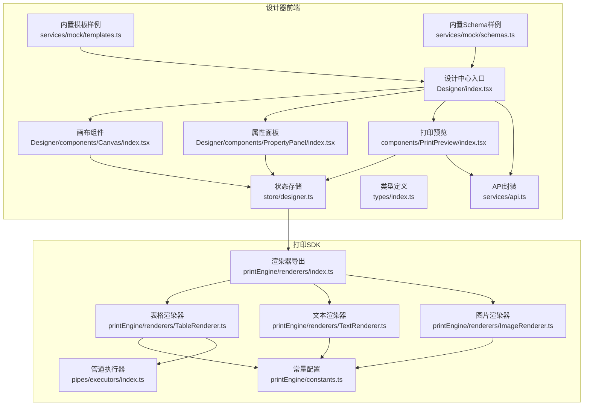
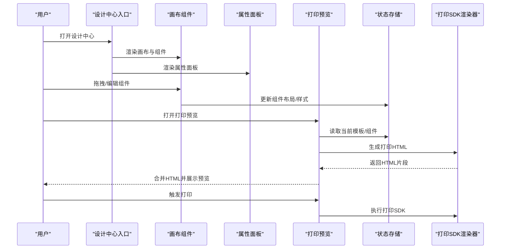
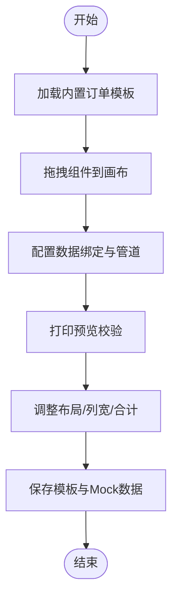
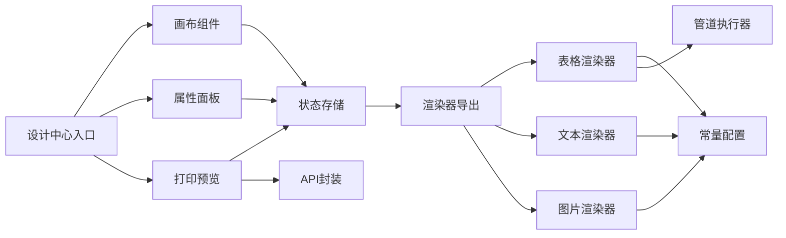

# 业务场景实践

<cite>
**本文引用的文件**
- [设计中心入口](file://designer/src/pages/Designer/index.tsx)
- [打印预览组件](file://designer/src/components/PrintPreview/index.tsx)
- [设计器画布](file://designer/src/pages/Designer/components/Canvas/index.tsx)
- [属性面板](file://designer/src/pages/Designer/components/PropertyPanel/index.tsx)
- [设计器状态存储](file://designer/src/store/designer.ts)
- [类型定义](file://designer/src/types/index.ts)
- [内置模板样例](file://designer/src/services/mock/templates.ts)
- [内置Schema样例](file://designer/src/services/mock/schemas.ts)
- [打印SDK-表格渲染器](file://sdk/src/printEngine/renderers/TableRenderer.ts)
- [打印SDK-文本渲染器](file://sdk/src/printEngine/renderers/TextRenderer.ts)
- [打印SDK-图片渲染器](file://sdk/src/printEngine/renderers/ImageRenderer.ts)
- [打印SDK-渲染器导出](file://sdk/src/printEngine/renderers/index.ts)
- [打印SDK-常量配置](file://sdk/src/printEngine/constants.ts)
- [打印SDK-管道执行器](file://sdk/src/pipes/executors/index.ts)
- [API封装](file://designer/src/services/api.ts)
</cite>

## 目录
1. [简介](#简介)
2. [项目结构](#项目结构)
3. [核心组件](#核心组件)
4. [架构总览](#架构总览)
5. [详细组件分析](#详细组件分析)
6. [依赖分析](#依赖分析)
7. [性能考量](#性能考量)
8. [故障排查指南](#故障排查指南)
9. [结论](#结论)
10. [附录](#附录)

## 简介
本文件面向业务开发者与设计师，系统性梳理项目在“打印业务场景”中的实践方法，覆盖订单打印、发票打印、标签打印、报表打印等典型场景。内容包括：
- 场景化模板设计方案与实现步骤
- 组件选择策略与布局优化技巧
- 数据绑定最佳实践与配置方法
- 多场景模板的复用与扩展策略
- 结合设计器与打印SDK的实际流程与可视化图示

## 项目结构
项目采用“设计器 + 打印SDK”的双层架构：
- 设计器层：提供可视化模板设计、属性配置、预览与打印入口
- 打印SDK层：负责将模板与数据渲染为可打印HTML并驱动打印

图表来源
- [设计中心入口:1-365](file://designer/src/pages/Designer/index.tsx#L1-L365)
- [设计器画布:1-800](file://designer/src/pages/Designer/components/Canvas/index.tsx#L1-L800)
- [属性面板:1-152](file://designer/src/pages/Designer/components/PropertyPanel/index.tsx#L1-L152)
- [打印预览组件:1-624](file://designer/src/components/PrintPreview/index.tsx#L1-L624)
- [设计器状态存储:1-773](file://designer/src/store/designer.ts#L1-L773)
- [类型定义:1-378](file://designer/src/types/index.ts#L1-L378)
- [内置模板样例:1-800](file://designer/src/services/mock/templates.ts#L1-L800)
- [内置Schema样例:1-147](file://designer/src/services/mock/schemas.ts#L1-L147)
- [打印SDK-渲染器导出:1-13](file://sdk/src/printEngine/renderers/index.ts#L1-L13)
- [打印SDK-表格渲染器:1-602](file://sdk/src/printEngine/renderers/TableRenderer.ts#L1-L602)
- [打印SDK-文本渲染器:1-60](file://sdk/src/printEngine/renderers/TextRenderer.ts#L1-L60)
- [打印SDK-图片渲染器:1-55](file://sdk/src/printEngine/renderers/ImageRenderer.ts#L1-L55)
- [打印SDK-常量配置:1-113](file://sdk/src/printEngine/constants.ts#L1-L113)
- [打印SDK-管道执行器:1-45](file://sdk/src/pipes/executors/index.ts#L1-L45)
- [API封装:1-134](file://designer/src/services/api.ts#L1-L134)

章节来源
- [设计中心入口:1-365](file://designer/src/pages/Designer/index.tsx#L1-L365)
- [设计器画布:1-800](file://designer/src/pages/Designer/components/Canvas/index.tsx#L1-L800)
- [属性面板:1-152](file://designer/src/pages/Designer/components/PropertyPanel/index.tsx#L1-L152)
- [打印预览组件:1-624](file://designer/src/components/PrintPreview/index.tsx#L1-L624)
- [设计器状态存储:1-773](file://designer/src/store/designer.ts#L1-L773)
- [类型定义:1-378](file://designer/src/types/index.ts#L1-L378)
- [内置模板样例:1-800](file://designer/src/services/mock/templates.ts#L1-L800)
- [内置Schema样例:1-147](file://designer/src/services/mock/schemas.ts#L1-L147)
- [打印SDK-渲染器导出:1-13](file://sdk/src/printEngine/renderers/index.ts#L1-L13)
- [打印SDK-表格渲染器:1-602](file://sdk/src/printEngine/renderers/TableRenderer.ts#L1-L602)
- [打印SDK-文本渲染器:1-60](file://sdk/src/printEngine/renderers/TextRenderer.ts#L1-L60)
- [打印SDK-图片渲染器:1-55](file://sdk/src/printEngine/renderers/ImageRenderer.ts#L1-L55)
- [打印SDK-常量配置:1-113](file://sdk/src/printEngine/constants.ts#L1-L113)
- [打印SDK-管道执行器:1-45](file://sdk/src/pipes/executors/index.ts#L1-L45)
- [API封装:1-134](file://designer/src/services/api.ts#L1-L134)

## 核心组件
- 设计中心入口：提供侧栏、画布、右侧属性面板与调试抽屉，统一调度模板加载、生成与预览。
- 画布组件：支持组件拖拽、多选拖拽、智能对齐、区域移动（页头/内容/页脚）、尺寸调整与快捷键。
- 属性面板：按组件类型动态装配布局、样式、数据绑定与表格列配置。
- 打印预览：支持单模板/多模板模式，批量数据预览与打印，HTML合并与分页统计。
- 设计器状态存储：集中管理组件列表、选中状态、页面配置、网格与缩放、撤销/重做、层级管理等。
- 打印SDK渲染器：表格、文本、图片等组件的渲染与样式构建，配合常量与管道执行器实现格式化。

章节来源
- [设计中心入口:1-365](file://designer/src/pages/Designer/index.tsx#L1-L365)
- [设计器画布:1-800](file://designer/src/pages/Designer/components/Canvas/index.tsx#L1-L800)
- [属性面板:1-152](file://designer/src/pages/Designer/components/PropertyPanel/index.tsx#L1-L152)
- [打印预览组件:1-624](file://designer/src/components/PrintPreview/index.tsx#L1-L624)
- [设计器状态存储:1-773](file://designer/src/store/designer.ts#L1-L773)
- [打印SDK-渲染器导出:1-13](file://sdk/src/printEngine/renderers/index.ts#L1-L13)

## 架构总览
以下序列图展示“从模板设计到打印预览”的关键流程：

图表来源
- [设计中心入口:1-365](file://designer/src/pages/Designer/index.tsx#L1-L365)
- [设计器画布:1-800](file://designer/src/pages/Designer/components/Canvas/index.tsx#L1-L800)
- [属性面板:1-152](file://designer/src/pages/Designer/components/PropertyPanel/index.tsx#L1-L152)
- [打印预览组件:1-624](file://designer/src/components/PrintPreview/index.tsx#L1-L624)
- [设计器状态存储:1-773](file://designer/src/store/designer.ts#L1-L773)
- [打印SDK-渲染器导出:1-13](file://sdk/src/printEngine/renderers/index.ts#L1-L13)

## 详细组件分析

### 订单打印场景
- 模板结构建议
  - 页头：标题、公司Logo、日期
  - 内容：订单编号、客户信息、商品明细（表格）、金额合计、备注、签名区
  - 页脚：可选
- 组件选择与布局
  - 标题：文本组件，居中，字号加粗
  - 客户信息：多行文本组件，带label前缀
  - 商品明细：表格组件，列宽按需分配，支持合计与额外行
  - 条形码/二维码：用于溯源与核验
  - 签名区：矩形占位+文本标注
- 数据绑定策略
  - 使用Schema路径绑定，如“documentNo”、“customer.name”、“items[].name”
  - 金额类使用货币/中文大写管道
- 实施步骤
  1) 选择“订单打印模板”作为起点
  2) 拖拽组件到画布，设置布局与样式
  3) 在属性面板配置数据绑定与管道
  4) 使用打印预览校验跨页与合计
  5) 保存模板并绑定Mock数据

图表来源
- [内置模板样例:6-177](file://designer/src/services/mock/templates.ts#L6-L177)
- [类型定义:1-378](file://designer/src/types/index.ts#L1-L378)
- [打印SDK-表格渲染器:1-602](file://sdk/src/printEngine/renderers/TableRenderer.ts#L1-L602)

章节来源
- [内置模板样例:6-177](file://designer/src/services/mock/templates.ts#L6-L177)
- [类型定义:1-378](file://designer/src/types/index.ts#L1-L378)
- [打印SDK-表格渲染器:1-602](file://sdk/src/printEngine/renderers/TableRenderer.ts#L1-L602)

### 发票打印场景
- 模板结构建议
  - 顶部：发票抬头、税号、地址、电话
  - 中部：购方信息、商品/服务明细（表格）、税率与税额、价税合计
  - 底部：收款人、复核人、开票人、骑缝章（二维码/条形码）
- 组件与策略
  - 表头/表尾：文本组件，字号适中
  - 明细表格：列宽紧凑，合计行仅最后一页显示
  - 金额：使用货币/中文大写管道，合计额外行展示“人民币（大写）”
- 数据绑定与格式化
  - 使用Schema路径映射明细数组
  - 税率/金额字段使用管道格式化
- 实施步骤
  1) 以“订单打印模板”为基础复制
  2) 替换为发票专用字段与文案
  3) 配置合计与额外行
  4) 预览并打印

章节来源
- [内置模板样例:6-177](file://designer/src/services/mock/templates.ts#L6-L177)
- [打印SDK-表格渲染器:306-385](file://sdk/src/printEngine/renderers/TableRenderer.ts#L306-L385)
- [打印SDK-管道执行器:1-45](file://sdk/src/pipes/executors/index.ts#L1-L45)

### 标签打印场景
- 模板结构建议
  - 小尺寸页面（如自定义60×50mm），包含产品名称、条形码、规格、日期
  - 适合连续纸或小票打印机
- 组件与策略
  - 文本组件：字号适中，居中或靠左
  - 条形码：CODE128，高度占容器比例适配
  - 日期：使用日期管道格式化
- 实施步骤
  1) 新建模板，设置CUSTOM尺寸与边距
  2) 拖拽文本/条形码组件并绑定数据
  3) 预览并调整组件间距

章节来源
- [内置模板样例:661-720](file://designer/src/services/mock/templates.ts#L661-L720)
- [打印SDK-常量配置:95-113](file://sdk/src/printEngine/constants.ts#L95-L113)

### 报表打印场景
- 模板结构建议
  - 多列指标表格，支持跨页重复表头
  - 合计行与额外行（如“总计/平均/大写金额”）
- 组件与策略
  - 表格组件：开启重复表头、合计与额外行
  - 列宽计算：自动/固定混合，最后一列吸收舍入误差
- 实施步骤
  1) 选择“订单打印模板”，替换为报表字段
  2) 配置列宽与对齐
  3) 启用合计与额外行
  4) 预览跨页效果

章节来源
- [内置模板样例:721-800](file://designer/src/services/mock/templates.ts#L721-L800)
- [打印SDK-表格渲染器:51-125](file://sdk/src/printEngine/renderers/TableRenderer.ts#L51-L125)

### 快递面单场景
- 模板结构建议
  - 左侧寄件人、中间收件人、右侧物流信息与二维码
  - 顶部公司名称与Logo，底部签名区
- 组件与策略
  - 矩形容器：分块区域，区分背景色
  - 线条：分隔线，虚线/实线/点线
  - 表格：物品清单
- 实施步骤
  1) 选择“快递面单模板”
  2) 绑定寄件/收件人与物品明细
  3) 预览并打印

章节来源
- [内置模板样例:178-660](file://designer/src/services/mock/templates.ts#L178-L660)

### 组件选择策略与布局优化
- 组件选择
  - 文本：展示静态/动态文本，支持label前缀
  - 图片：Logo/占位图，object-fit控制裁剪
  - 表格：明细与汇总，支持合计与额外行
  - 线条/矩形：分隔与区域划分
  - 二维码/条形码：溯源与自动化识别
- 布局优化
  - 使用网格吸附与智能对齐，提升一致性
  - 表格自动占满可用宽度，避免溢出
  - 页头/页脚区域高度可调，内容区域自适应

章节来源
- [设计器画布:1-800](file://designer/src/pages/Designer/components/Canvas/index.tsx#L1-L800)
- [打印SDK-表格渲染器:187-229](file://sdk/src/printEngine/renderers/TableRenderer.ts#L187-L229)

### 数据绑定最佳实践
- 绑定路径
  - 支持点号路径（如“customer.name”、“items[].amount”）
  - 支持回退值（fallback），保障无数据时显示友好文案
- 管道配置
  - 日期/时间：格式化输出
  - 金额：货币/中文大写
  - 字符串：大小写、截取、默认值
- Schema驱动
  - 使用内置Schema快速生成字段与表格列
  - 嵌套对象路径（如“supplier.name”）直接绑定

章节来源
- [类型定义:156-164](file://designer/src/types/index.ts#L156-L164)
- [内置Schema样例:1-147](file://designer/src/services/mock/schemas.ts#L1-L147)
- [打印SDK-管道执行器:1-45](file://sdk/src/pipes/executors/index.ts#L1-L45)

### 多场景模板的复用与扩展
- 复用策略
  - 基于内置模板复制，快速生成新场景
  - 通过Schema统一字段，减少模板差异
- 扩展策略
  - 新增组件类型：在渲染器导出中注册
  - 新增管道：在管道执行器中扩展
  - 新增页面配置：在类型定义中扩展PageConfig

章节来源
- [打印SDK-渲染器导出:1-13](file://sdk/src/printEngine/renderers/index.ts#L1-L13)
- [打印SDK-管道执行器:1-45](file://sdk/src/pipes/executors/index.ts#L1-L45)
- [类型定义:88-123](file://designer/src/types/index.ts#L88-L123)

## 依赖分析
- 组件耦合
  - 设计器入口依赖画布、属性面板与打印预览
  - 画布与属性面板共享状态存储
  - 打印预览依赖状态存储与SDK渲染器
- 外部依赖
  - API封装支持Mock与真实后端切换
  - 渲染器依赖常量与管道执行器

图表来源
- [设计中心入口:1-365](file://designer/src/pages/Designer/index.tsx#L1-L365)
- [设计器画布:1-800](file://designer/src/pages/Designer/components/Canvas/index.tsx#L1-L800)
- [属性面板:1-152](file://designer/src/pages/Designer/components/PropertyPanel/index.tsx#L1-L152)
- [打印预览组件:1-624](file://designer/src/components/PrintPreview/index.tsx#L1-L624)
- [设计器状态存储:1-773](file://designer/src/store/designer.ts#L1-L773)
- [API封装:1-134](file://designer/src/services/api.ts#L1-L134)
- [打印SDK-渲染器导出:1-13](file://sdk/src/printEngine/renderers/index.ts#L1-L13)
- [打印SDK-表格渲染器:1-602](file://sdk/src/printEngine/renderers/TableRenderer.ts#L1-L602)
- [打印SDK-文本渲染器:1-60](file://sdk/src/printEngine/renderers/TextRenderer.ts#L1-L60)
- [打印SDK-图片渲染器:1-55](file://sdk/src/printEngine/renderers/ImageRenderer.ts#L1-L55)
- [打印SDK-常量配置:1-113](file://sdk/src/printEngine/constants.ts#L1-L113)
- [打印SDK-管道执行器:1-45](file://sdk/src/pipes/executors/index.ts#L1-L45)

## 性能考量
- 渲染性能
  - 表格列宽计算与合计使用Decimal.js避免精度问题，同时注意避免在渲染循环中重复计算
  - 合计额外行管道执行失败时回退原值，保证稳定性
- 预览性能
  - 多模板/批量预览时，先生成HTML再合并，避免多次DOM操作
  - 分页统计与iframe滚动定位，减少重绘
- 交互性能
  - 拖拽与对齐使用useRef缓存状态，降低事件监听器重绑成本
  - 网格吸附与智能对齐在mousemove中按需触发

章节来源
- [打印SDK-表格渲染器:387-463](file://sdk/src/printEngine/renderers/TableRenderer.ts#L387-L463)
- [打印SDK-表格渲染器:510-579](file://sdk/src/printEngine/renderers/TableRenderer.ts#L510-L579)
- [打印预览组件:306-337](file://designer/src/components/PrintPreview/index.tsx#L306-L337)
- [设计器画布:538-699](file://designer/src/pages/Designer/components/Canvas/index.tsx#L538-L699)

## 故障排查指南
- 常见问题
  - 表格宽度溢出：检查xMm与页面宽度，渲染器会自动调整并给出警告
  - 合计计算异常：检查数据类型与管道配置，渲染器会捕获错误并返回友好提示
  - 组件超出边界：画布会检测并提示
- 排查步骤
  1) 打开调试抽屉查看模板JSON与组件数量
  2) 检查数据绑定路径与Schema是否匹配
  3) 使用打印预览查看HTML结构与分页
  4) 查看浏览器控制台日志

章节来源
- [打印SDK-表格渲染器:195-228](file://sdk/src/printEngine/renderers/TableRenderer.ts#L195-L228)
- [打印SDK-表格渲染器:429-433](file://sdk/src/printEngine/renderers/TableRenderer.ts#L429-L433)
- [设计器画布:222-279](file://designer/src/pages/Designer/components/Canvas/index.tsx#L222-L279)
- [设计中心入口:317-359](file://designer/src/pages/Designer/index.tsx#L317-L359)

## 结论
本项目通过“可视化设计器 + 打印SDK”的组合，提供了从模板设计到打印预览的完整闭环。围绕订单、发票、标签、报表等常见业务场景，结合组件选择、数据绑定与布局优化策略，能够高效产出高质量打印模板。通过内置模板与Schema的复用，以及渲染器与管道的扩展能力，可进一步支撑复杂业务的定制化需求。

## 附录
- 快速上手
  - 打开设计中心，选择内置模板或新建模板
  - 拖拽组件到画布，配置布局与样式
  - 在属性面板配置数据绑定与管道
  - 使用打印预览校验并打印
- 参考文件
  - [内置模板样例:1-800](file://designer/src/services/mock/templates.ts#L1-L800)
  - [内置Schema样例:1-147](file://designer/src/services/mock/schemas.ts#L1-L147)
  - [API封装:1-134](file://designer/src/services/api.ts#L1-L134)