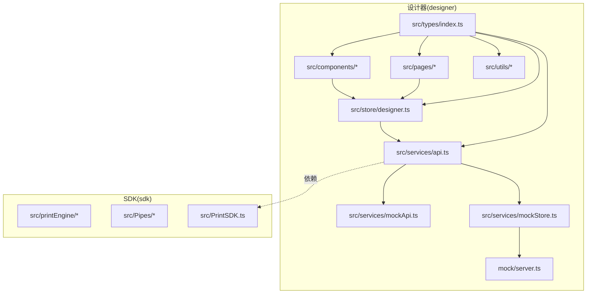
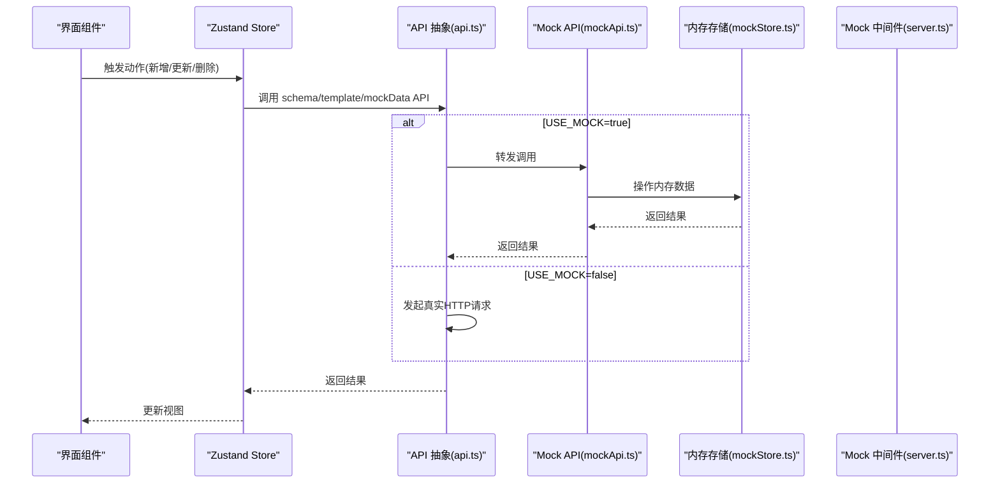
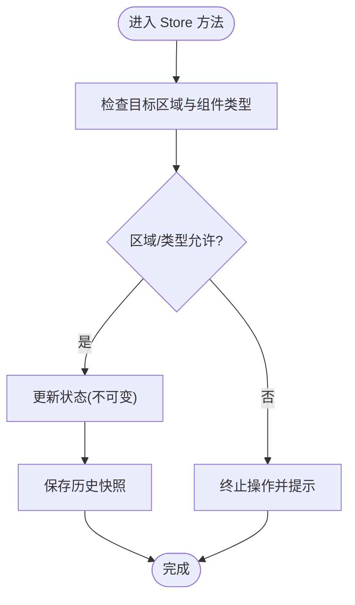
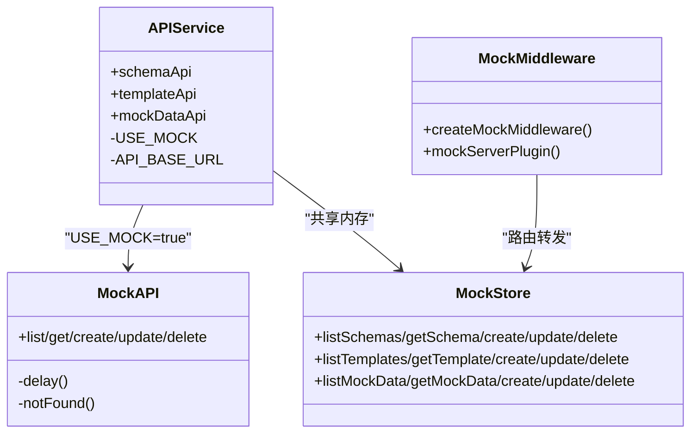
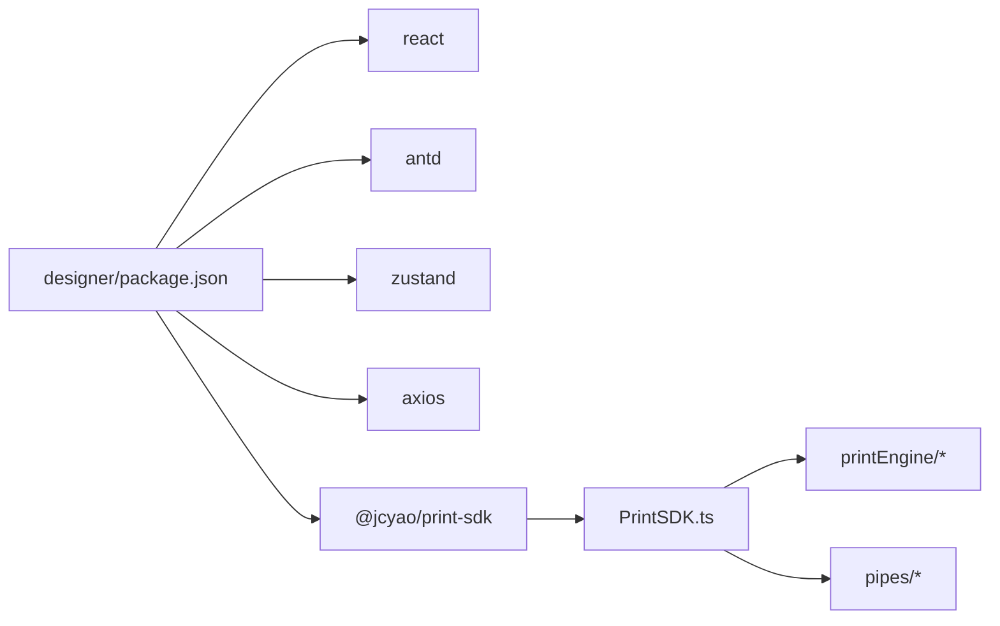

# 团队协作实践

<cite>
**本文引用的文件**
- [package.json](file://designer/package.json)
- [.eslintrc.cjs](file://designer/.eslintrc.cjs)
- [vite.config.ts](file://designer/vite.config.ts)
- [designer.ts](file://designer/src/store/designer.ts)
- [api.ts](file://designer/src/services/api.ts)
- [mockApi.ts](file://designer/src/services/mockApi.ts)
- [mockStore.ts](file://designer/src/services/mockStore.ts)
- [server.ts](file://designer/mock/server.ts)
- [index.ts](file://designer/src/types/index.ts)
- [index.ts](file://designer/src/constants/index.ts)
- [mockDataGenerator.ts](file://designer/src/utils/mockDataGenerator.ts)
- [schemas.ts](file://designer/src/services/mock/schemas.ts)
- [templates.ts](file://designer/src/services/mock/templates.ts)
- [mockData.ts](file://designer/src/services/mock/mockData.ts)
- [index.ts](file://designer/mock/index.ts)
- [package.json](file://package.json)
</cite>

## 目录
1. [引言](#引言)
2. [项目结构](#项目结构)
3. [核心组件](#核心组件)
4. [架构总览](#架构总览)
5. [详细组件分析](#详细组件分析)
6. [依赖分析](#依赖分析)
7. [性能考虑](#性能考虑)
8. [故障排查指南](#故障排查指南)
9. [结论](#结论)
10. [附录](#附录)

## 引言
本文件面向团队协作与工程化实践，基于仓库现有代码实现，总结并规范以下方面：
- 代码组织结构与命名规范
- 分支管理策略与合并流程
- 状态管理设计原则与使用规范
- Mock 数据与 API 接口协作流程
- Schema 字典管理的团队规范与版本控制
- 代码审查与质量保证流程
- Git 工作流与持续集成最佳实践
- 文档维护与知识传承规范

## 项目结构
该项目采用“多包/多模块”结构：
- designer：可视化设计器前端应用，包含组件、页面、状态管理、服务层、Mock 数据与工具函数
- sdk：打印渲染引擎与打印 SDK，作为设计器依赖
- 根目录：顶层脚本与聚合命令

图表来源
- [designer.ts:1-773](file://designer/src/store/designer.ts#L1-L773)
- [api.ts:1-134](file://designer/src/services/api.ts#L1-L134)
- [mockApi.ts:1-103](file://designer/src/services/mockApi.ts#L1-L103)
- [mockStore.ts:1-135](file://designer/src/services/mockStore.ts#L1-L135)
- [server.ts:1-193](file://designer/mock/server.ts#L1-L193)
- [index.ts:1-378](file://designer/src/types/index.ts#L1-L378)

章节来源
- [package.json:1-46](file://designer/package.json#L1-L46)
- [package.json:1-10](file://package.json#L1-L10)

## 核心组件
- 状态管理：基于 Zustand 的设计器全局状态，集中管理画布组件、模板、页面配置、历史撤销/重做、网格与缩放等
- API 层：统一导出 schemaApi、templateApi、mockDataApi；通过环境变量切换真实 HTTP 与前端 Mock
- Mock 层：Vite 中间件 + 内存存储，提供 CRUD 能力与默认数据
- 类型系统：统一定义 Schema、模板、组件、页面配置、数据绑定等核心类型
- 工具函数：Mock 数据生成器、页面尺寸与网格工具等

章节来源
- [designer.ts:1-773](file://designer/src/store/designer.ts#L1-L773)
- [api.ts:1-134](file://designer/src/services/api.ts#L1-L134)
- [mockApi.ts:1-103](file://designer/src/services/mockApi.ts#L1-L103)
- [mockStore.ts:1-135](file://designer/src/services/mockStore.ts#L1-L135)
- [index.ts:1-378](file://designer/src/types/index.ts#L1-L378)
- [mockDataGenerator.ts:1-113](file://designer/src/utils/mockDataGenerator.ts#L1-L113)

## 架构总览
整体采用“前端状态 + API 抽象 + Mock 中间件”的三层协作模式：
- 前端状态：Zustand Store 管理设计器状态与历史快照
- API 抽象：根据环境变量选择真实后端或 Mock 实现
- Mock 中间件：Vite 插件注入 /api 路由，提供 CRUD 能力

图表来源
- [designer.ts:1-773](file://designer/src/store/designer.ts#L1-L773)
- [api.ts:1-134](file://designer/src/services/api.ts#L1-L134)
- [mockApi.ts:1-103](file://designer/src/services/mockApi.ts#L1-L103)
- [mockStore.ts:1-135](file://designer/src/services/mockStore.ts#L1-L135)
- [server.ts:1-193](file://designer/mock/server.ts#L1-L193)

## 详细组件分析

### 状态管理设计与协作规范
- 设计原则
  - 单一职责：Store 仅负责设计器状态与历史快照，不承载业务逻辑
  - 不可变更新：通过 set/set((s)=>...) 与快照保存机制确保可追踪
  - 区域感知：header/content/footer 三区域独立管理，避免跨区域误操作
  - 历史限制：最多保留固定步数的历史，防止内存膨胀
- 使用规范
  - 新增/更新/删除组件：统一通过 Store 方法，自动触发历史快照
  - 撤销/重做：通过索引推进与快照恢复，保持状态一致性
  - 对齐/分布：跨区域限制与约束函数，确保布局合法
  - 粘贴/复制：跨区域粘贴时自动重置 ID 并进行网格对齐
- 团队协作建议
  - 新增 Store 方法需同步更新类型定义与注释
  - 涉及历史快照的方法必须调用统一快照函数
  - 跨区域操作需在方法内显式校验与约束

图表来源
- [designer.ts:468-506](file://designer/src/store/designer.ts#L468-L506)
- [designer.ts:508-548](file://designer/src/store/designer.ts#L508-L548)

章节来源
- [designer.ts:1-773](file://designer/src/store/designer.ts#L1-L773)

### API 抽象与 Mock 协作流程
- 环境切换
  - 通过环境变量决定是否启用 Mock：USE_MOCK=true 时走前端内存 Mock，否则走真实 HTTP
  - 构建演示站点时可强制注入 VITE_USE_MOCK=true
- API 分层
  - api.ts：统一导出 schemaApi/templateApi/mockDataApi，内部根据 USE_MOCK 选择实现
  - mockApi.ts：封装延迟与错误结构，模拟真实 HTTP 行为
  - mockStore.ts：内存存储与 CRUD 实现，供前端与中间件共用
  - server.ts：Vite 插件中间件，提供 /api/* CRUD 路由
- 团队协作建议
  - 新增 API 方法需同时完善真实实现与 Mock 实现
  - 错误处理需保持与真实 HTTP 一致的响应结构
  - Mock 数据与默认数据需与类型定义保持一致

图表来源
- [api.ts:1-134](file://designer/src/services/api.ts#L1-L134)
- [mockApi.ts:1-103](file://designer/src/services/mockApi.ts#L1-L103)
- [mockStore.ts:1-135](file://designer/src/services/mockStore.ts#L1-L135)
- [server.ts:1-193](file://designer/mock/server.ts#L1-L193)

章节来源
- [api.ts:1-134](file://designer/src/services/api.ts#L1-L134)
- [mockApi.ts:1-103](file://designer/src/services/mockApi.ts#L1-L103)
- [mockStore.ts:1-135](file://designer/src/services/mockStore.ts#L1-L135)
- [server.ts:1-193](file://designer/mock/server.ts#L1-L193)

### Schema 字典管理的团队规范与版本控制
- 数据结构
  - SchemaDictionary：根类型、字段定义、版本号、描述等
  - SchemaField：字段键名、标签、类型、子字段、枚举、格式化类型等
- 默认数据与版本
  - 默认 Schema 与模板、Mock 数据位于各自 mock 文件中
  - 版本号字段存在但未在 UI 中直接展示，建议在 UI 中增加版本显示与变更记录
- 团队协作建议
  - 新增/修改 Schema 必须同步更新默认数据与相关模板
  - 版本升级需遵循语义化版本，变更日志纳入文档
  - Schema 变更需评估对模板与渲染的影响，必要时提供迁移脚本

章节来源
- [index.ts:3-52](file://designer/src/types/index.ts#L3-L52)
- [schemas.ts:1-147](file://designer/src/services/mock/schemas.ts#L1-L147)
- [templates.ts:1-800](file://designer/src/services/mock/templates.ts#L1-L800)
- [mockData.ts:1-639](file://designer/src/services/mock/mockData.ts#L1-L639)

### Mock 数据生成与测试协作
- 自动生成
  - 根据 Schema 字段类型与键名推测合理示例数据
  - 支持字符串、数字、布尔、日期、对象、数组等类型
- 团队协作建议
  - 新增字段类型时扩展生成器逻辑
  - 为关键字段提供可配置的默认值映射
  - 与 UI 团队协作，确保生成数据符合视觉与交互预期

章节来源
- [mockDataGenerator.ts:1-113](file://designer/src/utils/mockDataGenerator.ts#L1-L113)

### 代码组织结构与命名规范
- 目录组织
  - src/components：可复用组件
  - src/pages：页面级容器
  - src/store：Zustand 状态
  - src/services：API 与 Mock
  - src/types：类型定义
  - src/utils：工具函数
  - mock：Vite Mock 中间件
- 命名规范
  - 文件：PascalCase(组件)、kebab-case(样式文件)
  - 类型：PascalCase
  - 变量/函数：camelCase
  - 常量：SCREAMING_SNAKE_CASE
- 团队协作建议
  - 新增文件需遵循目录与命名约定
  - 类型定义集中管理，避免分散重复
  - 组件导出统一入口，便于维护

章节来源
- [designer.ts:1-773](file://designer/src/store/designer.ts#L1-L773)
- [index.ts:1-378](file://designer/src/types/index.ts#L1-L378)
- [index.ts:1-20](file://designer/src/constants/index.ts#L1-L20)

### 代码质量与规范
- ESLint 配置
  - 推荐规则：TypeScript、React Hooks、react-refresh
  - 忽略 dist 与配置文件
- 团队协作建议
  - 提交前运行 lint，修复警告
  - 严格遵守 hooks 规则，避免无效导出
  - 代码风格统一，减少主观差异

章节来源
- [.eslintrc.cjs:1-19](file://designer/.eslintrc.cjs#L1-L19)

### 构建与开发环境
- 开发模式
  - Vite 插件：React、Monaco Editor、Mock 中间件
  - 本地开发可指向 SDK 源码，便于联调
- 构建模式
  - TypeScript 编译 + Vite 打包
  - demo 模式强制启用 Mock
- 团队协作建议
  - 本地开发与 CI 使用一致的构建脚本
  - 构建产物与依赖锁文件纳入版本控制

章节来源
- [vite.config.ts:1-29](file://designer/vite.config.ts#L1-L29)
- [package.json:1-46](file://designer/package.json#L1-L46)

## 依赖分析
- 外部依赖
  - React、Ant Design、Zustand、Axios、Monaco Editor、QRCode、Barcode 等
- 内部依赖
  - 设计器依赖 SDK 打印引擎
  - Mock 中间件与内存存储解耦于 API 层
- 团队协作建议
  - 依赖升级需进行端到端验证
  - 依赖冲突优先通过锁定版本解决

图表来源
- [package.json:13-29](file://designer/package.json#L13-L29)
- [package.json:1-10](file://package.json#L1-L10)

章节来源
- [package.json:1-46](file://designer/package.json#L1-L46)
- [package.json:1-10](file://package.json#L1-L10)

## 性能考虑
- 状态快照
  - 历史步数上限控制，避免内存占用过高
  - JSON 深拷贝成本较高，建议在高频操作中优化更新粒度
- 渲染与布局
  - 网格对齐与缩放需结合实际设备像素比
  - 大数据表格渲染建议分页或虚拟化
- Mock 数据
  - 自动生成数据时避免过大数据结构
  - 模板与 Schema 的默认数据应精简以提升加载速度

## 故障排查指南
- Mock 中间件
  - CORS 预检：中间件已处理 OPTIONS，确保正确返回头
  - 404 错误：资源不存在时返回统一结构，便于前端识别
- API 层
  - USE_MOCK 切换：确认环境变量注入是否生效
  - 真实 HTTP：检查 baseURL 与请求头配置
- 常见问题
  - 跨区域对齐失败：检查所选组件是否来自同一区域
  - 撤销/重做异常：确认历史索引与快照一致性

章节来源
- [server.ts:42-50](file://designer/mock/server.ts#L42-L50)
- [server.ts:62-94](file://designer/mock/server.ts#L62-L94)
- [api.ts:13-20](file://designer/src/services/api.ts#L13-L20)
- [mockApi.ts:9-14](file://designer/src/services/mockApi.ts#L9-L14)

## 结论
本项目在状态管理、API 抽象与 Mock 协作方面形成了清晰的分层与规范。团队可在现有基础上进一步完善：
- Schema 版本管理与 UI 展示
- Mock 数据生成器的可配置性
- 代码审查与质量门禁
- Git 工作流与 CI 最佳实践
- 文档维护与知识传承机制

## 附录

### Git 工作流与分支管理策略
- 分支策略
  - main/master：稳定发布分支
  - develop：日常开发分支
  - feature/*：新功能开发
  - hotfix/*：紧急修复
- 提交流程
  - 在 feature 分支提交 PR 至 develop，代码审查通过后合并
  - 发布前从 develop 合并至 main，并打 tag
- 团队协作建议
  - PR 必须包含测试与变更说明
  - 合并前确保通过 lint、类型检查与单元测试

### 代码审查与质量保证
- 审查清单
  - 代码风格与规范
  - 类型安全与边界条件
  - 状态更新与历史快照
  - Mock 与真实实现一致性
  - 性能与内存占用
- 质量门禁
  - CI 必须通过 lint 与构建
  - 关键模块需覆盖核心逻辑测试

### 文档维护与知识传承
- 文档分类
  - 架构文档：系统设计与组件关系
  - API 文档：接口定义与 Mock 示例
  - 设计规范：命名、目录与组件规范
  - 操作手册：开发、构建与部署流程
- 维护策略
  - 随代码变更同步更新
  - 重要决策与变更记录在文档中体现