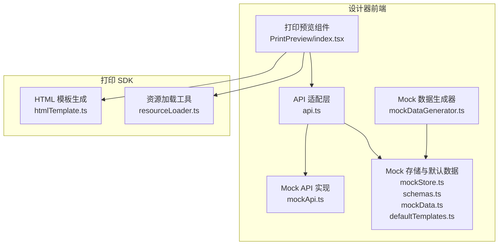
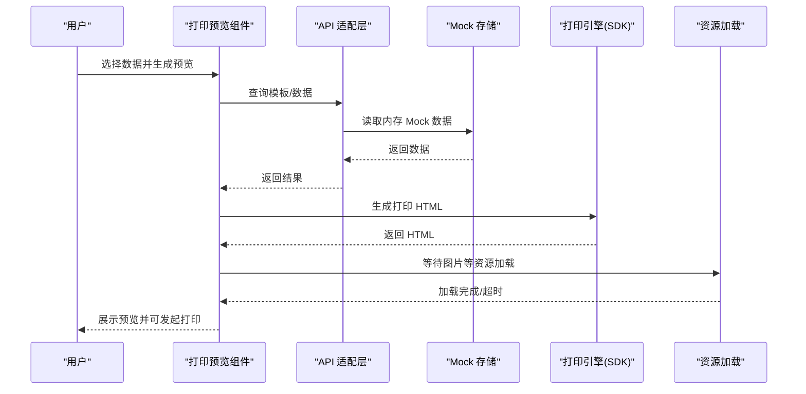
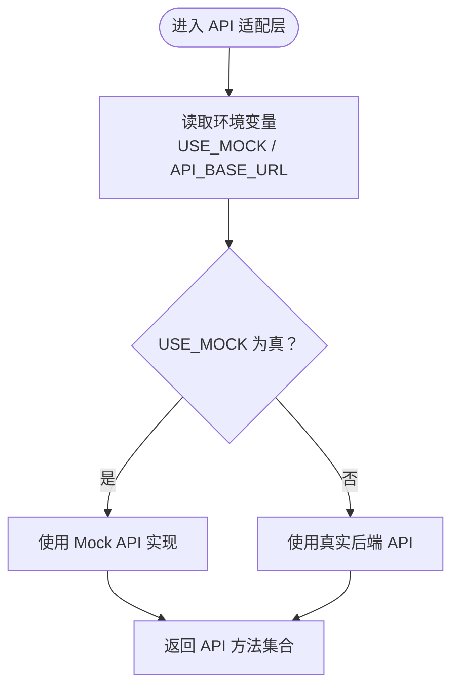
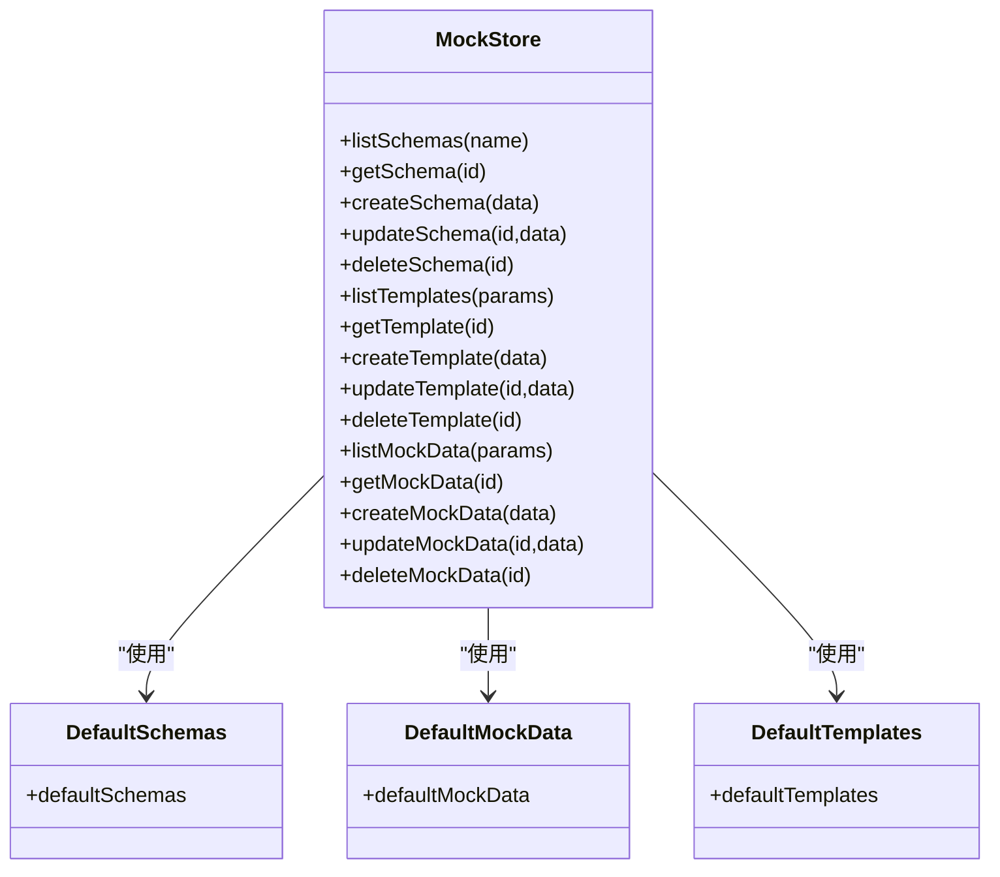
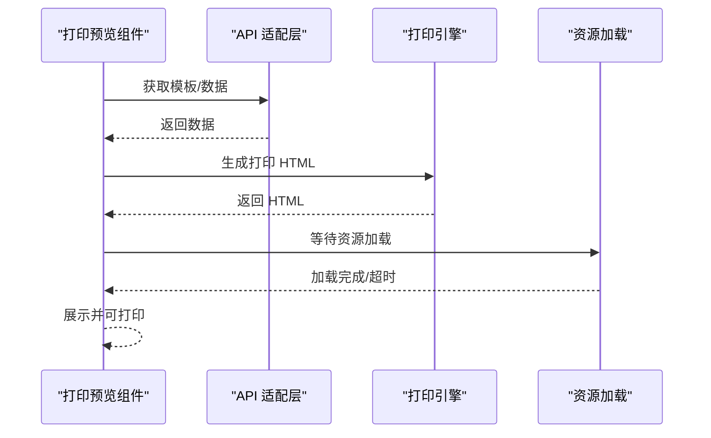
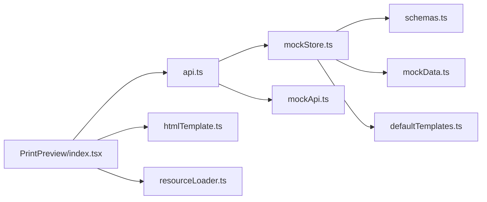

# 安全防护实践

<cite>
**本文引用的文件**
- [api.ts](file://designer/src/services/api.ts)
- [mockApi.ts](file://designer/src/services/mockApi.ts)
- [mockStore.ts](file://designer/src/services/mockStore.ts)
- [mockDataGenerator.ts](file://designer/src/utils/mockDataGenerator.ts)
- [schemas.ts](file://designer/src/services/mock/schemas.ts)
- [mockData.ts](file://designer/src/services/mock/mockData.ts)
- [defaultTemplates.ts](file://designer/src/services/mock/templates.ts)
- [index.tsx](file://designer/src/components/PrintPreview/index.tsx)
- [htmlTemplate.ts](file://sdk/src/printEngine/htmlTemplate.ts)
- [resourceLoader.ts](file://sdk/src/utils/resourceLoader.ts)
- [vite.config.ts](file://designer/vite.config.ts)
- [types/index.ts](file://designer/src/types/index.ts)
- [package.json](file://package.json)
</cite>

## 目录
1. [引言](#引言)
2. [项目结构](#项目结构)
3. [核心组件](#核心组件)
4. [架构总览](#架构总览)
5. [详细组件分析](#详细组件分析)
6. [依赖分析](#依赖分析)
7. [性能考量](#性能考量)
8. [故障排查指南](#故障排查指南)
9. [结论](#结论)
10. [附录](#附录)

## 引言
本文件面向“打印模板设计器”项目，系统性梳理并输出安全防护实践，覆盖以下方面：
- 打印模板与数据的安全处理策略：敏感信息保护、数据脱敏、访问控制
- Mock 数据生成的安全考虑与防护措施
- API 接口的安全设计与认证机制
- 资源加载的安全策略与跨域处理方案
- 模板注入攻击的防范与输入验证机制
- 数据传输加密与存储安全最佳实践
- 安全审计与漏洞检测方法
- 安全事件响应与应急处理流程

## 项目结构
项目由设计器前端与打印 SDK 两部分组成，围绕“模板 + 数据 + 渲染引擎”的链路展开。安全关注点主要集中在：
- 前端 API 适配层（真实/Mock 切换）
- Mock 数据与默认模板的内嵌与生成
- 打印 HTML 生成与资源加载
- 预览与打印交互流程

**图表来源**
- [api.ts](file://designer/src/services/api.ts)
- [mockApi.ts](file://designer/src/services/mockApi.ts)
- [mockStore.ts](file://designer/src/services/mockStore.ts)
- [schemas.ts](file://designer/src/services/mock/schemas.ts)
- [mockData.ts](file://designer/src/services/mock/mockData.ts)
- [defaultTemplates.ts](file://designer/src/services/mock/templates.ts)
- [index.tsx](file://designer/src/components/PrintPreview/index.tsx)
- [mockDataGenerator.ts](file://designer/src/utils/mockDataGenerator.ts)
- [htmlTemplate.ts](file://sdk/src/printEngine/htmlTemplate.ts)
- [resourceLoader.ts](file://sdk/src/utils/resourceLoader.ts)

**章节来源**
- [api.ts](file://designer/src/services/api.ts)
- [mockApi.ts](file://designer/src/services/mockApi.ts)
- [mockStore.ts](file://designer/src/services/mockStore.ts)
- [schemas.ts](file://designer/src/services/mock/schemas.ts)
- [mockData.ts](file://designer/src/services/mock/mockData.ts)
- [defaultTemplates.ts](file://designer/src/services/mock/templates.ts)
- [index.tsx](file://designer/src/components/PrintPreview/index.tsx)
- [mockDataGenerator.ts](file://designer/src/utils/mockDataGenerator.ts)
- [htmlTemplate.ts](file://sdk/src/printEngine/htmlTemplate.ts)
- [resourceLoader.ts](file://sdk/src/utils/resourceLoader.ts)

## 核心组件
- API 适配层：统一管理真实后端与前端 Mock 的切换，集中处理请求基址与错误结构
- Mock 存储与默认数据：提供默认 Schema、模板与 Mock 数据，支持内存 CRUD
- 打印预览组件：负责模板与数据的组合、批量/单次预览、打印触发
- HTML 模板生成：统一生成打印页面样式与完整 HTML 结构
- 资源加载工具：确保图片等异步资源加载完成后再打印
- Mock 数据生成器：基于 Schema 自动推断生成示例数据，便于演示与测试

**章节来源**
- [api.ts](file://designer/src/services/api.ts)
- [mockStore.ts](file://designer/src/services/mockStore.ts)
- [index.tsx](file://designer/src/components/PrintPreview/index.tsx)
- [htmlTemplate.ts](file://sdk/src/printEngine/htmlTemplate.ts)
- [resourceLoader.ts](file://sdk/src/utils/resourceLoader.ts)
- [mockDataGenerator.ts](file://designer/src/utils/mockDataGenerator.ts)

## 架构总览
整体安全架构围绕“最小暴露面 + 双重校验 + 可审计”的原则设计：
- 前端仅暴露必要的 API 适配层与渲染能力，不直接承载敏感业务数据
- Mock 数据与默认模板内嵌于前端，避免泄露真实业务细节
- 打印 HTML 由 SDK 生成，避免模板注入风险
- 资源加载采用超时与错误统计，提升鲁棒性

**图表来源**
- [index.tsx](file://designer/src/components/PrintPreview/index.tsx)
- [api.ts](file://designer/src/services/api.ts)
- [mockStore.ts](file://designer/src/services/mockStore.ts)
- [htmlTemplate.ts](file://sdk/src/printEngine/htmlTemplate.ts)
- [resourceLoader.ts](file://sdk/src/utils/resourceLoader.ts)

## 详细组件分析

### API 适配层与认证机制
- 真实后端与 Mock 切换：通过环境变量控制，生产环境可配置基址；开发环境默认同源
- 错误结构统一：Mock 与真实后端均返回一致的错误结构，便于前端统一处理
- 认证机制：当前实现未显式集成鉴权头或令牌传递，建议在真实后端接入 JWT/OAuth 并在适配层透传

**图表来源**
- [api.ts](file://designer/src/services/api.ts)
- [vite.config.ts](file://designer/vite.config.ts)

**章节来源**
- [api.ts](file://designer/src/services/api.ts)
- [vite.config.ts](file://designer/vite.config.ts)

### Mock 数据与默认模板的安全策略
- 内嵌默认数据：Schema、模板与 Mock 数据均内嵌于前端，降低泄露真实业务数据的风险
- 生成器策略：根据字段名推断内容（如电话、邮箱、地址），但均为示例值，不涉及真实敏感信息
- 存储与访问：内存存储，无持久化，避免长期留存

**图表来源**
- [mockStore.ts](file://designer/src/services/mockStore.ts)
- [schemas.ts](file://designer/src/services/mock/schemas.ts)
- [mockData.ts](file://designer/src/services/mock/mockData.ts)
- [defaultTemplates.ts](file://designer/src/services/mock/templates.ts)

**章节来源**
- [mockStore.ts](file://designer/src/services/mockStore.ts)
- [schemas.ts](file://designer/src/services/mock/schemas.ts)
- [mockData.ts](file://designer/src/services/mock/mockData.ts)
- [defaultTemplates.ts](file://designer/src/services/mock/templates.ts)

### 打印预览与模板注入防护
- 预览生成：通过 SDK 生成 HTML，避免直接拼接用户输入
- 数据绑定：组件通过绑定路径解析数据，未见模板注入入口
- 资源加载：图片加载超时与错误统计，避免阻塞与异常扩散

**图表来源**
- [index.tsx](file://designer/src/components/PrintPreview/index.tsx)
- [htmlTemplate.ts](file://sdk/src/printEngine/htmlTemplate.ts)
- [resourceLoader.ts](file://sdk/src/utils/resourceLoader.ts)

**章节来源**
- [index.tsx](file://designer/src/components/PrintPreview/index.tsx)
- [htmlTemplate.ts](file://sdk/src/printEngine/htmlTemplate.ts)
- [resourceLoader.ts](file://sdk/src/utils/resourceLoader.ts)

### Mock 数据生成器与敏感信息保护
- 生成规则：依据字段名关键字匹配生成示例值（如电话、邮箱、地址），均为示例数据
- 脱敏策略：未发现真实敏感信息；若后续扩展真实数据生成，应引入脱敏与最小化原则
- 可控性：生成器可扩展以支持更多字段类型与脱敏规则

**章节来源**
- [mockDataGenerator.ts](file://designer/src/utils/mockDataGenerator.ts)

### 数据传输加密与存储安全
- 传输加密：建议在真实后端启用 HTTPS，并在适配层强制仅通过 HTTPS 发送请求
- 存储安全：前端仅使用内存存储，不落地；如需持久化，应采用加密存储与最小权限访问

**章节来源**
- [api.ts](file://designer/src/services/api.ts)
- [mockStore.ts](file://designer/src/services/mockStore.ts)

### 资源加载安全策略与跨域处理
- 资源加载：图片加载采用超时与错误统计，避免长时间阻塞
- 跨域处理：Mock 场景为同源；真实后端需正确配置 CORS，限制来源与方法

**章节来源**
- [resourceLoader.ts](file://sdk/src/utils/resourceLoader.ts)
- [api.ts](file://designer/src/services/api.ts)

### 输入验证与模板注入防范
- 绑定路径：组件绑定路径为受控字符串，未见动态模板注入
- HTML 生成：由 SDK 统一生成，避免直接拼接用户输入
- 建议：对用户输入的绑定路径进行白名单校验与长度限制

**章节来源**
- [types/index.ts](file://designer/src/types/index.ts)
- [htmlTemplate.ts](file://sdk/src/printEngine/htmlTemplate.ts)

## 依赖分析
- 设计器前端依赖打印 SDK 生成 HTML 与执行打印
- API 适配层同时依赖 Mock 存储与真实后端
- 打印预览组件串联 API、SDK 与资源加载工具

**图表来源**
- [index.tsx](file://designer/src/components/PrintPreview/index.tsx)
- [api.ts](file://designer/src/services/api.ts)
- [mockApi.ts](file://designer/src/services/mockApi.ts)
- [mockStore.ts](file://designer/src/services/mockStore.ts)
- [schemas.ts](file://designer/src/services/mock/schemas.ts)
- [mockData.ts](file://designer/src/services/mock/mockData.ts)
- [defaultTemplates.ts](file://designer/src/services/mock/templates.ts)
- [htmlTemplate.ts](file://sdk/src/printEngine/htmlTemplate.ts)
- [resourceLoader.ts](file://sdk/src/utils/resourceLoader.ts)

**章节来源**
- [index.tsx](file://designer/src/components/PrintPreview/index.tsx)
- [api.ts](file://designer/src/services/api.ts)
- [mockApi.ts](file://designer/src/services/mockApi.ts)
- [mockStore.ts](file://designer/src/services/mockStore.ts)
- [schemas.ts](file://designer/src/services/mock/schemas.ts)
- [mockData.ts](file://designer/src/services/mock/mockData.ts)
- [defaultTemplates.ts](file://designer/src/services/mock/templates.ts)
- [htmlTemplate.ts](file://sdk/src/printEngine/htmlTemplate.ts)
- [resourceLoader.ts](file://sdk/src/utils/resourceLoader.ts)

## 性能考量
- Mock 延迟：Mock API 对部分操作增加延迟，提升真实网络体验一致性
- 资源加载：图片加载超时与并发控制，避免长时间阻塞
- 批量打印：合并 HTML 页面并重新编号，减少 DOM 操作与重绘

**章节来源**
- [mockApi.ts](file://designer/src/services/mockApi.ts)
- [resourceLoader.ts](file://sdk/src/utils/resourceLoader.ts)
- [index.tsx](file://designer/src/components/PrintPreview/index.tsx)

## 故障排查指南
- Mock 404 错误：统一错误结构，前端可据此提示与回退
- 图片加载失败：记录失败数量与超时警告，便于定位资源问题
- 预览空白：检查模板与数据绑定路径，确认数据存在且非空
- 环境变量：确认 USE_MOCK 与 API_BASE_URL 设置是否符合预期

**章节来源**
- [mockApi.ts](file://designer/src/services/mockApi.ts)
- [resourceLoader.ts](file://sdk/src/utils/resourceLoader.ts)
- [index.tsx](file://designer/src/components/PrintPreview/index.tsx)

## 结论
本项目在前端侧通过 Mock 内嵌数据与 SDK 统一渲染，有效降低了模板注入与敏感信息泄露风险。建议在真实后端补齐认证与 HTTPS、完善输入校验与日志审计，并持续优化资源加载与错误处理，以形成闭环的安全体系。

## 附录
- 构建与运行：顶层脚本提供设计器与 SDK 的构建入口
- 环境变量：USE_MOCK 与 API_BASE_URL 用于控制 Mock 与后端基址

**章节来源**
- [package.json](file://package.json)
- [api.ts](file://designer/src/services/api.ts)
- [vite.config.ts](file://designer/vite.config.ts)