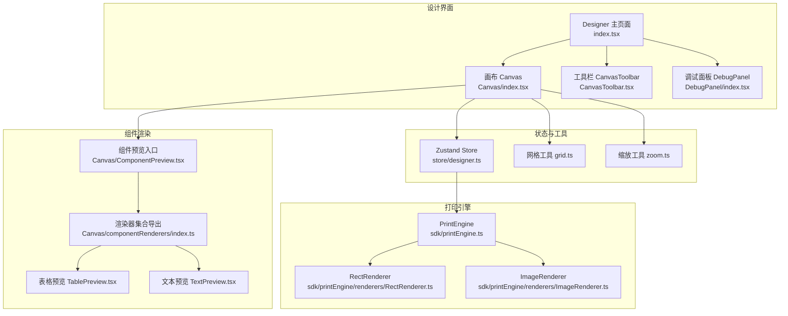
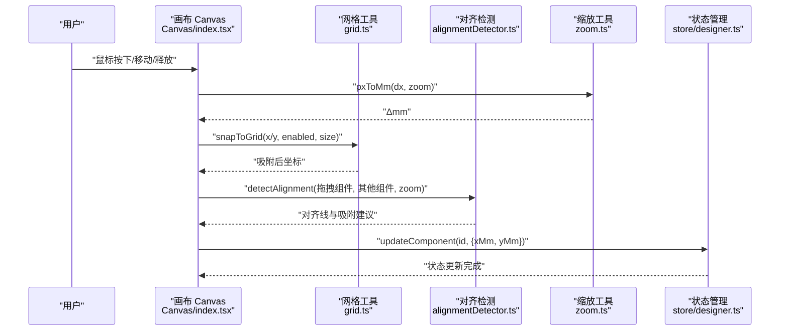
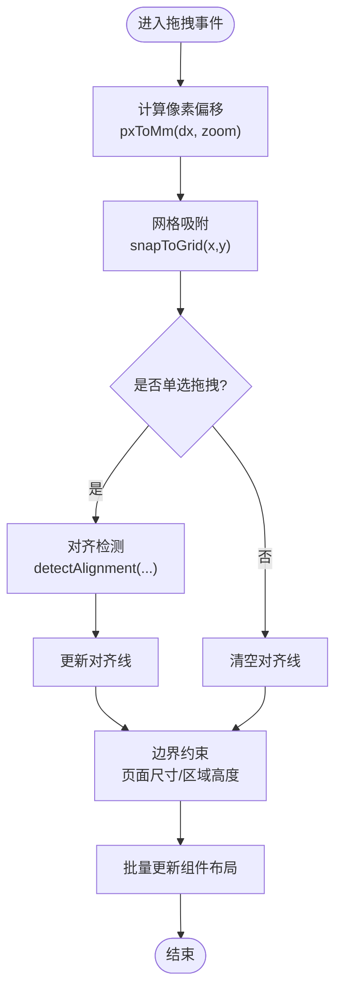
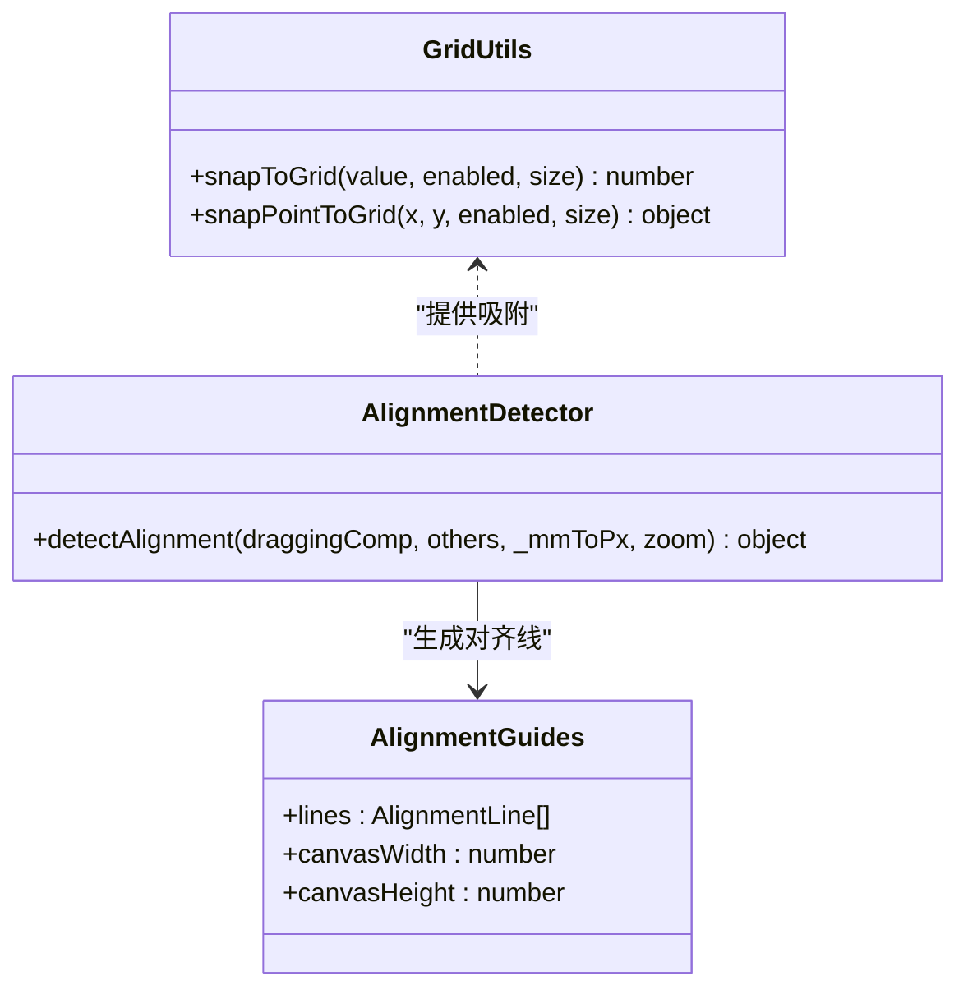
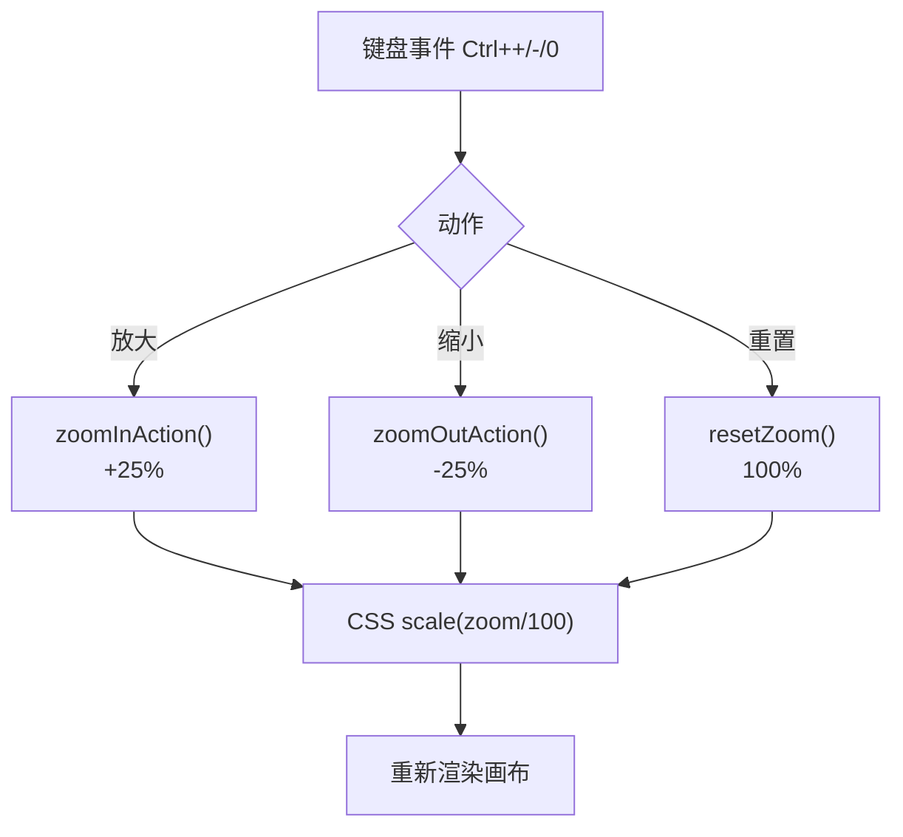
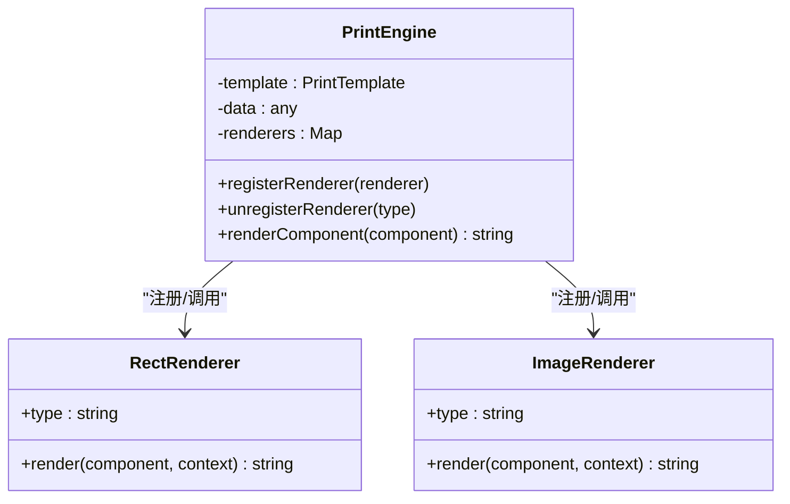
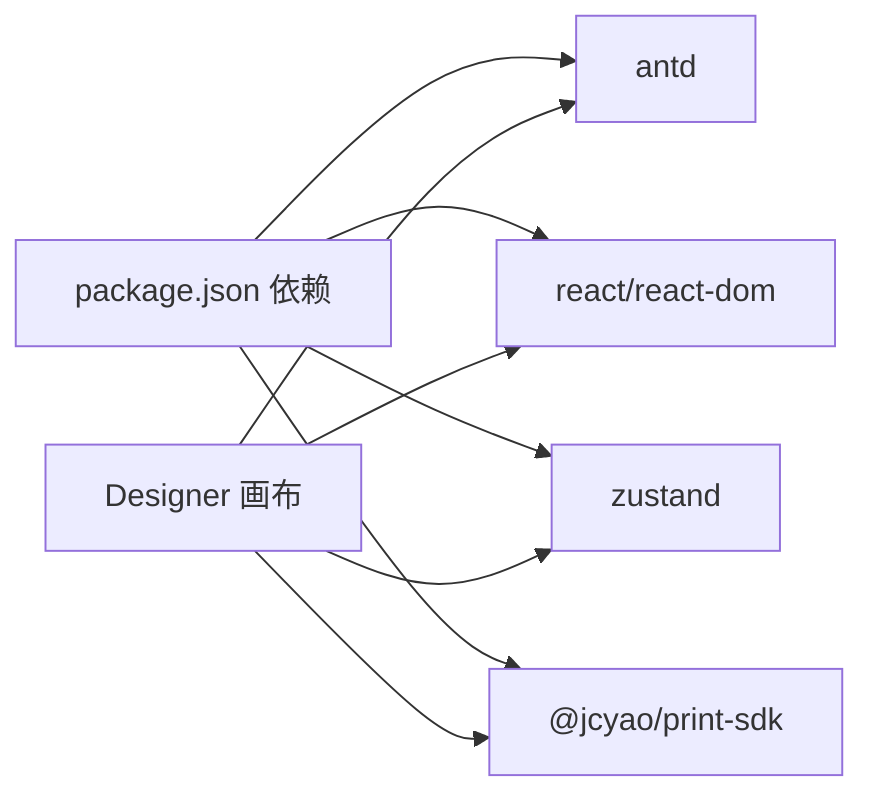

# 性能优化实践

<cite>
**本文引用的文件**
- [index.tsx](file://designer/src/pages/Designer/index.tsx)
- [index.tsx](file://designer/src/pages/Designer/components/Canvas/index.tsx)
- [AlignmentGuides.tsx](file://designer/src/pages/Designer/components/Canvas/AlignmentGuides.tsx)
- [alignmentDetector.ts](file://designer/src/pages/Designer/components/Canvas/alignmentDetector.ts)
- [grid.ts](file://designer/src/utils/grid.ts)
- [zoom.ts](file://designer/src/utils/zoom.ts)
- [designer.ts](file://designer/src/store/designer.ts)
- [CanvasToolbar.tsx](file://designer/src/pages/Designer/components/Canvas/CanvasToolbar.tsx)
- [TablePreview.tsx](file://designer/src/pages/Designer/components/Canvas/componentRenderers/TablePreview.tsx)
- [TextPreview.tsx](file://designer/src/pages/Designer/components/Canvas/componentRenderers/TextPreview.tsx)
- [index.ts](file://designer/src/pages/Designer/components/Canvas/componentRenderers/index.ts)
- [index.ts](file://designer/src/types/index.ts)
- [package.json](file://designer/package.json)
- [printEngine.ts](file://sdk/src/printEngine.ts)
- [RectRenderer.ts](file://sdk/src/printEngine/renderers/RectRenderer.ts)
- [ImageRenderer.ts](file://sdk/src/printEngine/renderers/ImageRenderer.ts)
- [index.tsx](file://designer/src/pages/Designer/components/DebugPanel/index.tsx)
</cite>

## 目录
1. [简介](#简介)
2. [项目结构](#项目结构)
3. [核心组件](#核心组件)
4. [架构总览](#架构总览)
5. [详细组件分析](#详细组件分析)
6. [依赖分析](#依赖分析)
7. [性能考量](#性能考量)
8. [故障排查指南](#故障排查指南)
9. [结论](#结论)
10. [附录](#附录)

## 简介
本文件聚焦打印设计器的性能优化实践，围绕画布渲染、组件重绘控制、内存使用、网格对齐系统、缩放机制、大数据量模板渲染以及性能监控与调试等方面，提供可落地的优化策略与最佳实践。文档同时给出关键流程的可视化图示与“章节来源”标注，便于快速定位实现细节。

## 项目结构
打印设计器采用前端单页应用架构，核心由“设计界面 + 画布交互 + 组件渲染 + 状态管理 + 工具函数 + 打印引擎”组成。设计界面负责用户交互与状态驱动；画布模块负责拖拽、吸附、对齐、缩放与渲染；工具函数提供网格与缩放换算；状态管理集中维护组件、页面配置、历史记录与缩放；打印引擎负责将模板转换为可打印 HTML。

**图表来源**
- [index.tsx:1-365](file://designer/src/pages/Designer/index.tsx#L1-L365)
- [index.tsx:1-1362](file://designer/src/pages/Designer/components/Canvas/index.tsx#L1-L1362)
- [CanvasToolbar.tsx:1-166](file://designer/src/pages/Designer/components/Canvas/CanvasToolbar.tsx#L1-L166)
- [designer.ts:1-773](file://designer/src/store/designer.ts#L1-L773)
- [grid.ts:1-36](file://designer/src/utils/grid.ts#L1-L36)
- [zoom.ts:1-72](file://designer/src/utils/zoom.ts#L1-L72)
- [index.ts:1-11](file://designer/src/pages/Designer/components/Canvas/componentRenderers/index.ts#L1-L11)
- [TablePreview.tsx:1-175](file://designer/src/pages/Designer/components/Canvas/componentRenderers/TablePreview.tsx#L1-L175)
- [TextPreview.tsx:1-31](file://designer/src/pages/Designer/components/Canvas/componentRenderers/TextPreview.tsx#L1-L31)
- [printEngine.ts:1-221](file://sdk/src/printEngine.ts#L1-L221)
- [RectRenderer.ts:1-38](file://sdk/src/printEngine/renderers/RectRenderer.ts#L1-L38)
- [ImageRenderer.ts:1-54](file://sdk/src/printEngine/renderers/ImageRenderer.ts#L1-L54)

**章节来源**
- [index.tsx:1-365](file://designer/src/pages/Designer/index.tsx#L1-L365)
- [index.tsx:1-1362](file://designer/src/pages/Designer/components/Canvas/index.tsx#L1-L1362)

## 核心组件
- 设计器主页面：承载布局、悬浮缩放控件、侧边面板与调试抽屉，负责模板加载与生成。
- 画布模块：实现拖拽、吸附、智能对齐、区域移动、缩放、键盘快捷键、组件渲染与预览。
- 状态管理：集中维护组件列表、页面配置、网格与缩放、历史记录、对齐与分布等。
- 工具函数：网格吸附与缩放换算，提供毫米与像素互转、缩放级别约束与步进。
- 组件渲染器：按组件类型输出预览视图，表格预览支持列宽拖拽与本地状态缓存。
- 打印引擎：将模板转换为可打印 HTML，按组件类型调用渲染器插件。

**章节来源**
- [designer.ts:1-773](file://designer/src/store/designer.ts#L1-L773)
- [grid.ts:1-36](file://designer/src/utils/grid.ts#L1-L36)
- [zoom.ts:1-72](file://designer/src/utils/zoom.ts#L1-L72)
- [TablePreview.tsx:1-175](file://designer/src/pages/Designer/components/Canvas/componentRenderers/TablePreview.tsx#L1-L175)
- [printEngine.ts:1-221](file://sdk/src/printEngine.ts#L1-L221)

## 架构总览
下面的序列图展示“拖拽组件并吸附到网格”的典型流程，体现毫米坐标体系、网格吸附、智能对齐与缩放换算的协作。

**图表来源**
- [index.tsx:538-699](file://designer/src/pages/Designer/components/Canvas/index.tsx#L538-L699)
- [alignmentDetector.ts:31-126](file://designer/src/pages/Designer/components/Canvas/alignmentDetector.ts#L31-L126)
- [grid.ts:12-15](file://designer/src/utils/grid.ts#L12-L15)
- [zoom.ts:30-42](file://designer/src/utils/zoom.ts#L30-L42)
- [designer.ts:126-137](file://designer/src/store/designer.ts#L126-L137)

## 详细组件分析

### 画布渲染与重绘控制
- 坐标体系与缩放：画布内部统一使用毫米坐标，缩放通过 CSS scale 实现，避免频繁重算像素值。
- 预览渲染：组件预览按类型渲染，表格预览支持列宽拖拽且仅在 mouseup 提交，降低历史记录写入频率。
- 智能对齐：仅在单选拖拽时计算对齐线，多选时不显示对齐线，减少 DOM 更新与计算。

**图表来源**
- [index.tsx:538-629](file://designer/src/pages/Designer/components/Canvas/index.tsx#L538-L629)
- [alignmentDetector.ts:31-126](file://designer/src/pages/Designer/components/Canvas/alignmentDetector.ts#L31-L126)
- [zoom.ts:30-42](file://designer/src/utils/zoom.ts#L30-L42)
- [grid.ts:12-15](file://designer/src/utils/grid.ts#L12-L15)

**章节来源**
- [index.tsx:538-699](file://designer/src/pages/Designer/components/Canvas/index.tsx#L538-L699)
- [TablePreview.tsx:36-61](file://designer/src/pages/Designer/components/Canvas/componentRenderers/TablePreview.tsx#L36-L61)

### 网格对齐系统
- 吸附算法：按网格步长四舍五入，支持按住 Shift 临时禁用吸附。
- 对齐检测：在毫米层面比较组件边界与中心点，阈值约 0.8mm，将结果映射到缩放后的像素用于渲染。
- 参考线渲染：仅渲染必要的对齐线，避免重复绘制。

**图表来源**
- [grid.ts:12-35](file://designer/src/utils/grid.ts#L12-L35)
- [alignmentDetector.ts:31-126](file://designer/src/pages/Designer/components/Canvas/alignmentDetector.ts#L31-L126)
- [AlignmentGuides.tsx:21-63](file://designer/src/pages/Designer/components/Canvas/AlignmentGuides.tsx#L21-L63)

**章节来源**
- [grid.ts:1-36](file://designer/src/utils/grid.ts#L1-L36)
- [alignmentDetector.ts:1-127](file://designer/src/pages/Designer/components/Canvas/alignmentDetector.ts#L1-L127)
- [AlignmentGuides.tsx:1-66](file://designer/src/pages/Designer/components/Canvas/AlignmentGuides.tsx#L1-L66)

### 缩放功能的性能实现
- 缩放级别：固定步进 25%，范围 25%-200%，默认 100%。
- 换算常量：MM_TO_PX_BASE=3.78，用于毫米与像素互转。
- 画布缩放：通过 CSS transform: scale 实现，避免重排重绘。
- 键盘快捷键：Ctrl/Cmd + +/-/0 触发缩放，避免频繁状态变更。

**图表来源**
- [index.tsx:198-215](file://designer/src/pages/Designer/index.tsx#L198-L215)
- [zoom.ts:9-72](file://designer/src/utils/zoom.ts#L9-L72)
- [designer.ts:356-358](file://designer/src/store/designer.ts#L356-L358)

**章节来源**
- [zoom.ts:1-72](file://designer/src/utils/zoom.ts#L1-L72)
- [designer.ts:353-358](file://designer/src/store/designer.ts#L353-L358)
- [index.tsx:198-215](file://designer/src/pages/Designer/index.tsx#L198-L215)

### 组件重绘控制与内存优化
- 预览渲染器：按类型选择渲染器，避免不必要的 DOM 结构与样式计算。
- 表格列宽拖拽：本地缓存当前宽度，mouseup 一次性提交，减少历史记录写入与重绘。
- 状态快照：历史记录采用全量快照，限制最大步数，避免内存膨胀。
- 选择与多选：仅在必要时更新选中组件，减少无关组件的重绘。

**章节来源**
- [TablePreview.tsx:36-61](file://designer/src/pages/Designer/components/Canvas/componentRenderers/TablePreview.tsx#L36-L61)
- [designer.ts:92-106](file://designer/src/store/designer.ts#L92-L106)
- [index.tsx:538-699](file://designer/src/pages/Designer/components/Canvas/index.tsx#L538-L699)

### 大数据量模板渲染优化
- 打印引擎：按组件类型注册渲染器插件，统一上下文与换算常量，避免重复计算。
- 页面尺寸与溢出：页头/页脚组件统一注入 overflow: hidden，防止内容溢出造成额外重排。
- 组件默认尺寸：渲染器使用默认尺寸常量，保证一致性与可预测性。

**图表来源**
- [printEngine.ts:30-72](file://sdk/src/printEngine.ts#L30-L72)
- [RectRenderer.ts:10-38](file://sdk/src/printEngine/renderers/RectRenderer.ts#L10-L38)
- [ImageRenderer.ts:10-54](file://sdk/src/printEngine/renderers/ImageRenderer.ts#L10-L54)

**章节来源**
- [printEngine.ts:1-221](file://sdk/src/printEngine.ts#L1-L221)
- [RectRenderer.ts:1-38](file://sdk/src/printEngine/renderers/RectRenderer.ts#L1-L38)
- [ImageRenderer.ts:1-54](file://sdk/src/printEngine/renderers/ImageRenderer.ts#L1-L54)

### 数据模型与布局约束
- 组件节点：统一的布局、样式、绑定与属性结构，便于渲染器与工具函数复用。
- 页面配置：尺寸、方向、边距、页头/页脚开关与高度，决定组件边界与区域约束。

**章节来源**
- [index.ts:303-331](file://designer/src/types/index.ts#L303-L331)
- [index.ts:91-123](file://designer/src/types/index.ts#L91-L123)

## 依赖分析
- 设计器依赖 Ant Design、React、Zustand、@jcyao/print-sdk 等。
- 画布与渲染器之间通过组件类型解耦，遵循“插件化”思想。
- 状态管理与工具函数为画布交互提供基础能力。

**图表来源**
- [package.json:13-29](file://designer/package.json#L13-L29)

**章节来源**
- [package.json:1-46](file://designer/package.json#L1-L46)

## 性能考量
- 减少重排重绘
  - 使用 CSS transform: scale 实现缩放，避免改变布局盒尺寸。
  - 仅在需要时更新对齐线与吸附建议，避免频繁 DOM 操作。
  - 表格列宽拖拽采用本地状态缓存，mouseup 提交，降低历史记录写入频率。
- 内存使用优化
  - 历史记录限制最大步数，避免无限增长。
  - 组件预览渲染器按需渲染，避免冗余结构。
- 网格与对齐
  - 吸附阈值与对齐阈值均以毫米为基准，避免缩放带来的误差。
  - 对齐检测仅在单选拖拽时进行，多选时清空对齐线。
- 大数据量模板
  - 打印引擎按组件类型注册渲染器，统一上下文与换算，减少重复计算。
  - 页头/页脚组件注入溢出裁剪，避免内容溢出引发的额外开销。

[本节为通用指导，无需具体文件分析]

## 故障排查指南
- 频繁重排重绘
  - 检查是否存在频繁修改布局盒尺寸的样式（如 width/height），优先使用 transform。
  - 确认对齐线渲染逻辑仅在必要时更新。
- 内存泄漏
  - 确认键盘事件与全局 mouse 事件在组件卸载时正确移除。
  - 检查历史记录步数上限与快照序列长度。
- 缩放异常
  - 确认缩放级别在 25%-200% 之间，缩放换算常量一致。
  - 检查 CSS transform 与内联样式是否冲突。
- 网格吸附失效
  - 确认网格开关与按住 Shift 的临时禁用逻辑。
  - 检查吸附阈值与缩放级别对毫米精度的影响。

**章节来源**
- [index.tsx:146-220](file://designer/src/pages/Designer/components/Canvas/index.tsx#L146-L220)
- [designer.ts:92-106](file://designer/src/store/designer.ts#L92-L106)
- [zoom.ts:49-71](file://designer/src/utils/zoom.ts#L49-L71)
- [grid.ts:12-15](file://designer/src/utils/grid.ts#L12-L15)

## 结论
通过毫米坐标体系、CSS 缩放、网格吸附与智能对齐、本地状态缓存与历史记录限制、以及打印引擎的插件化渲染，打印设计器在保证交互体验的同时实现了良好的性能表现。针对大数据量模板，建议进一步结合懒加载与虚拟化策略，并持续利用调试面板与性能分析工具进行优化迭代。

[本节为总结，无需具体文件分析]

## 附录

### 性能测试方法
- 基准测试
  - 使用浏览器性能面板录制拖拽、缩放、复制粘贴等高频操作，观察帧率与内存峰值。
- 回归测试
  - 在不同缩放级别（25%/50%/100%/200%）下测试拖拽与吸附响应时间。
- 大数据量场景
  - 构造包含大量表格行与图片组件的模板，评估渲染与滚动性能。
- 内存监控
  - 使用性能面板的内存快照对比操作前后内存占用，确认无泄漏。

[本节为通用指导，无需具体文件分析]

### 调试与监控最佳实践
- 使用调试面板复制模板 JSON，便于问题复现与对比。
- 在开发模式下开启 React DevTools，关注组件重渲染次数。
- 对关键路径（拖拽、吸附、对齐、缩放）添加日志，定位性能瓶颈。
- 使用浏览器性能面板的“网络”与“内存”标签，识别资源加载与内存问题。

**章节来源**
- [index.tsx:1-77](file://designer/src/pages/Designer/components/DebugPanel/index.tsx#L1-L77)