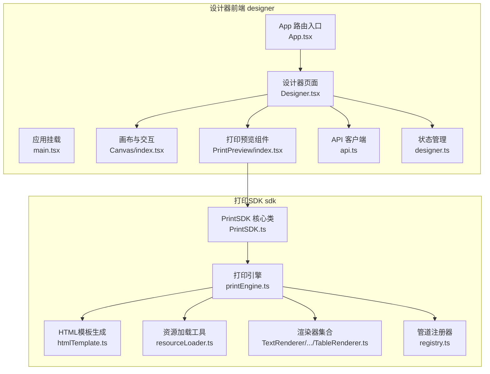
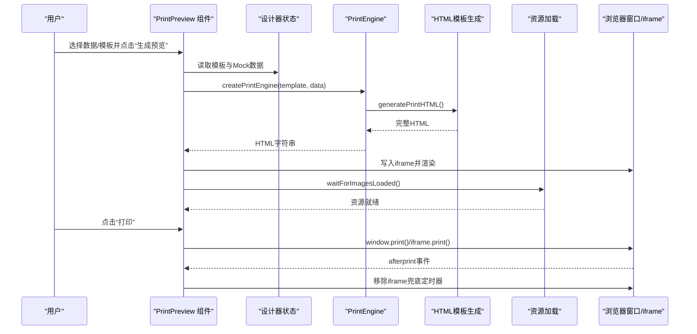
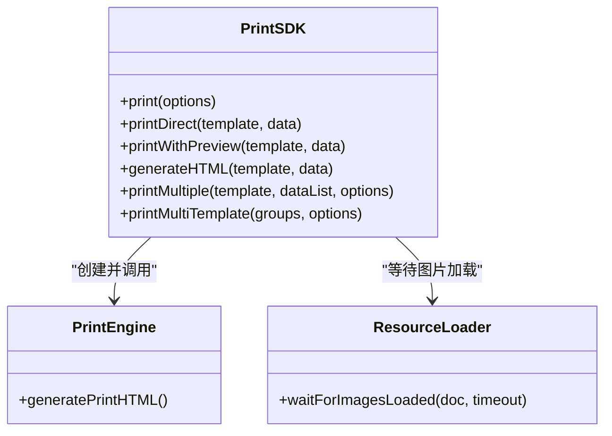
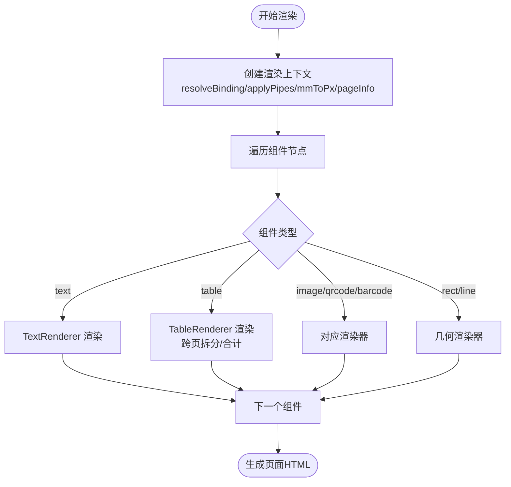
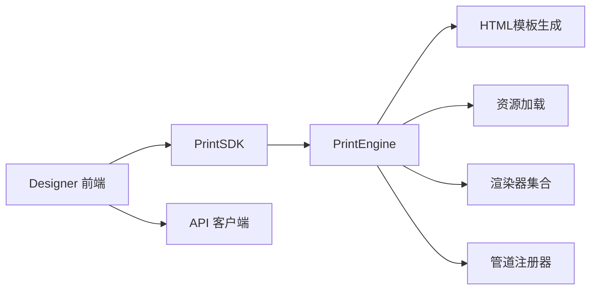

# 最佳实践案例

<cite>
**本文引用的文件**
- [App.tsx](file://designer/src/App.tsx)
- [main.tsx](file://designer/src/main.tsx)
- [Designer.tsx](file://designer/src/pages/Designer/index.tsx)
- [api.ts](file://designer/src/services/api.ts)
- [designer.ts](file://designer/src/store/designer.ts)
- [Canvas/index.tsx](file://designer/src/pages/Designer/components/Canvas/index.tsx)
- [PrintPreview/index.tsx](file://designer/src/components/PrintPreview/index.tsx)
- [PrintSDK.ts](file://sdk/src/PrintSDK.ts)
- [printEngine.ts](file://sdk/src/printEngine.ts)
- [htmlTemplate.ts](file://sdk/src/printEngine/htmlTemplate.ts)
- [resourceLoader.ts](file://sdk/src/utils/resourceLoader.ts)
- [TextRenderer.ts](file://sdk/src/printEngine/renderers/TextRenderer.ts)
- [TableRenderer.ts](file://sdk/src/printEngine/renderers/TableRenderer.ts)
- [registry.ts](file://sdk/src/pipes/registry.ts)
- [package.json](file://designer/package.json)
</cite>

## 目录
1. [简介](#简介)
2. [项目结构](#项目结构)
3. [核心组件](#核心组件)
4. [架构总览](#架构总览)
5. [详细组件分析](#详细组件分析)
6. [依赖关系分析](#依赖关系分析)
7. [性能考量](#性能考量)
8. [故障排查指南](#故障排查指南)
9. [结论](#结论)
10. [附录](#附录)

## 简介
本最佳实践案例面向“打印设计器”项目，聚焦于典型业务场景（订单打印、发票打印、标签打印）的落地方法，系统梳理渲染优化、内存管理、网络请求优化等性能实践，总结代码组织与项目结构、团队协作与开发流程、安全注意事项与防护措施、常见问题预防与解决方案，以及质量保证与测试策略。文档以循序渐进的方式呈现，既适合初学者快速上手，也为资深工程师提供深入的技术洞察。

## 项目结构
项目采用前后端分离的双仓结构：
- designer：可视化设计器前端，负责模板设计、属性配置、打印预览与交互。
- sdk：打印引擎与SDK，负责模板解析、组件渲染、HTML生成、批量打印与打印控制。

图示来源
- [App.tsx:1-31](file://designer/src/App.tsx#L1-L31)
- [main.tsx:1-8](file://designer/src/main.tsx#L1-L8)
- [Designer.tsx:1-365](file://designer/src/pages/Designer/index.tsx#L1-L365)
- [Canvas/index.tsx:1-800](file://designer/src/pages/Designer/components/Canvas/index.tsx#L1-L800)
- [PrintPreview/index.tsx:1-624](file://designer/src/components/PrintPreview/index.tsx#L1-L624)
- [api.ts:1-134](file://designer/src/services/api.ts#L1-L134)
- [designer.ts:1-773](file://designer/src/store/designer.ts#L1-L773)
- [PrintSDK.ts:1-477](file://sdk/src/PrintSDK.ts#L1-L477)
- [printEngine.ts:1-800](file://sdk/src/printEngine.ts#L1-L800)
- [htmlTemplate.ts:1-281](file://sdk/src/printEngine/htmlTemplate.ts#L1-L281)
- [resourceLoader.ts:1-90](file://sdk/src/utils/resourceLoader.ts#L1-L90)
- [TextRenderer.ts:1-60](file://sdk/src/printEngine/renderers/TextRenderer.ts#L1-L60)
- [TableRenderer.ts:1-602](file://sdk/src/printEngine/renderers/TableRenderer.ts#L1-L602)
- [registry.ts:1-65](file://sdk/src/pipes/registry.ts#L1-L65)

章节来源
- [App.tsx:1-31](file://designer/src/App.tsx#L1-L31)
- [main.tsx:1-8](file://designer/src/main.tsx#L1-L8)
- [package.json:1-46](file://designer/package.json#L1-L46)

## 核心组件
- 打印SDK（PrintSDK）：封装打印入口，支持预览、直接打印、批量打印、多模板批量打印，内置图片资源等待与打印完成清理。
- 打印引擎（PrintEngine）：插件化渲染器体系，支持文本、表格、图片、矩形、线条、二维码、条形码等组件，提供数据绑定、管道转换、虚拟分页与跨页表格拆分。
- HTML模板生成器（htmlTemplate）：统一管理打印样式与页面结构，支持预览与直接打印两种模式。
- 资源加载工具（resourceLoader）：等待图片资源加载完成，避免打印时图片未就绪。
- 状态与交互（Designer Store + Canvas/PrintPreview）：设计器状态管理、画布拖拽/缩放/对齐、打印预览与批量生成。

章节来源
- [PrintSDK.ts:100-467](file://sdk/src/PrintSDK.ts#L100-L467)
- [printEngine.ts:30-620](file://sdk/src/printEngine.ts#L30-L620)
- [htmlTemplate.ts:81-225](file://sdk/src/printEngine/htmlTemplate.ts#L81-L225)
- [resourceLoader.ts:12-89](file://sdk/src/utils/resourceLoader.ts#L12-L89)
- [designer.ts:108-772](file://designer/src/store/designer.ts#L108-L772)
- [Canvas/index.tsx:22-750](file://designer/src/pages/Designer/components/Canvas/index.tsx#L22-L750)
- [PrintPreview/index.tsx:25-418](file://designer/src/components/PrintPreview/index.tsx#L25-L418)

## 架构总览
整体流程：设计器生成模板与数据，通过SDK调用引擎渲染为HTML，再由浏览器打印或预览。SDK在打印前等待图片资源加载，打印完成后清理临时iframe，避免内存泄漏。

图示来源
- [PrintPreview/index.tsx:174-304](file://designer/src/components/PrintPreview/index.tsx#L174-L304)
- [PrintSDK.ts:110-172](file://sdk/src/PrintSDK.ts#L110-L172)
- [printEngine.ts:389-420](file://sdk/src/printEngine.ts#L389-L420)
- [htmlTemplate.ts:230-252](file://sdk/src/printEngine/htmlTemplate.ts#L230-L252)
- [resourceLoader.ts:12-73](file://sdk/src/utils/resourceLoader.ts#L12-L73)

## 详细组件分析

### 打印SDK（PrintSDK）
- 功能要点
  - 预览打印：打开新窗口写入HTML并等待图片加载后打印。
  - 直接打印：隐藏iframe写入HTML，等待图片加载后打印，监听afterprint事件清理。
  - 批量打印：聚合多份文档为单一HTML，一次性打印确认。
  - 多模板批量打印：支持多模板+多数据组合，统一生成并打印。
  - 进度回调：批量/多模板打印提供进度上报。
- 关键实现
  - DOMParser提取body内容，兼容性处理。
  - 图片资源等待与超时策略。
  - 打印完成清理与兜底定时器。

图示来源
- [PrintSDK.ts:100-467](file://sdk/src/PrintSDK.ts#L100-L467)
- [resourceLoader.ts:12-89](file://sdk/src/utils/resourceLoader.ts#L12-L89)

章节来源
- [PrintSDK.ts:110-467](file://sdk/src/PrintSDK.ts#L110-L467)

### 打印引擎（PrintEngine）
- 插件化渲染器：文本、表格、图片、矩形、线条、二维码、条形码。
- 数据绑定与管道：支持路径取值、管道链式转换（日期、货币、中文大写等）。
- 虚拟分页与跨页表格：基于相对间距累加，表格跨页拆分与表头重复。
- 页面信息与页码：根据配置计算页头/页脚高度与页码位置。

图示来源
- [printEngine.ts:169-213](file://sdk/src/printEngine.ts#L169-L213)
- [TextRenderer.ts:13-53](file://sdk/src/printEngine/renderers/TextRenderer.ts#L13-L53)
- [TableRenderer.ts:150-327](file://sdk/src/printEngine/renderers/TableRenderer.ts#L150-L327)

章节来源
- [printEngine.ts:30-620](file://sdk/src/printEngine.ts#L30-L620)
- [TextRenderer.ts:10-60](file://sdk/src/printEngine/renderers/TextRenderer.ts#L10-L60)
- [TableRenderer.ts:147-602](file://sdk/src/printEngine/renderers/TableRenderer.ts#L147-L602)

### HTML模板生成器（htmlTemplate）
- 统一样式与页面结构，区分预览与直接打印模式。
- 连续纸与标准页尺寸适配，媒体查询与@page规则。
- 组件基础样式集中管理，避免重复代码。

章节来源
- [htmlTemplate.ts:81-225](file://sdk/src/printEngine/htmlTemplate.ts#L81-L225)

### 资源加载工具（resourceLoader）
- 等待文档中所有图片加载完成，支持超时与错误统计。
- 二维码/条形码已转为base64，主要等待外部图片资源。

章节来源
- [resourceLoader.ts:12-89](file://sdk/src/utils/resourceLoader.ts#L12-L89)

### 设计器状态与画布（Designer Store + Canvas）
- 状态管理：组件增删改、选中、复制/粘贴/克隆、撤销/重做、层级管理、对齐与分布。
- 画布交互：拖拽、缩放、网格吸附、智能对齐、区域移动（页头/页脚/内容）。
- 打印预览：单模板/多模板模式、批量数据预览与打印。

章节来源
- [designer.ts:108-772](file://designer/src/store/designer.ts#L108-L772)
- [Canvas/index.tsx:22-750](file://designer/src/pages/Designer/components/Canvas/index.tsx#L22-L750)
- [PrintPreview/index.tsx:25-418](file://designer/src/components/PrintPreview/index.tsx#L25-L418)

### API客户端（api.ts）
- 基于Axios封装，支持Mock模式与真实HTTP请求切换。
- 统一基地址与请求头，暴露Schema/模板/Mock数据API。

章节来源
- [api.ts:1-134](file://designer/src/services/api.ts#L1-L134)

## 依赖关系分析
- 设计器前端依赖SDK进行打印，同时通过API客户端访问后端或Mock数据。
- SDK内部依赖引擎、HTML模板生成器、资源加载工具与渲染器/管道注册器。
- 依赖耦合清晰，模块职责明确，便于扩展与维护。

图示来源
- [package.json:13-29](file://designer/package.json#L13-L29)
- [PrintSDK.ts:7-14](file://sdk/src/PrintSDK.ts#L7-L14)
- [printEngine.ts:6-28](file://sdk/src/printEngine.ts#L6-L28)

章节来源
- [package.json:13-29](file://designer/package.json#L13-L29)

## 性能考量
- 渲染优化
  - 组件渲染采用插件化，避免在主流程中做过多条件分支，提升可维护性与可扩展性。
  - 表格跨页拆分与合计计算使用Decimal.js避免浮点误差，提高精度与稳定性。
  - 表格列宽计算与溢出保护，避免渲染异常与布局错乱。
- 内存管理
  - 打印完成后清理临时iframe，监听afterprint事件并设置兜底定时器，防止内存泄漏。
  - 预览组件对模板与数据进行缓存，避免重复请求与重复渲染。
- 网络请求优化
  - Mock模式与真实HTTP模式通过环境变量切换，演示站点可直接在前端内存运行，降低网络延迟。
  - API客户端统一基地址与请求头，减少重复配置。
- 用户体验
  - 画布缩放与网格吸附，配合键盘快捷键（复制、粘贴、撤销/重做、缩放），提升设计效率。
  - 打印预览支持单模板/多模板与批量数据，一键生成并打印。

章节来源
- [PrintSDK.ts:150-171](file://sdk/src/PrintSDK.ts#L150-L171)
- [PrintPreview/index.tsx:137-153](file://designer/src/components/PrintPreview/index.tsx#L137-L153)
- [api.ts:131-134](file://designer/src/services/api.ts#L131-L134)
- [Canvas/index.tsx:146-220](file://designer/src/pages/Designer/components/Canvas/index.tsx#L146-L220)

## 故障排查指南
- 打印预览空白或图片未显示
  - 检查图片资源是否加载完成，确认已调用资源等待函数。
  - 若超时，查看控制台日志与错误统计。
- 打印完成后页面残留iframe
  - 确认afterprint事件是否触发，若未触发，检查兜底定时器是否执行。
- 表格跨页异常或合计错误
  - 检查表格数据绑定路径与列配置，确认Decimal.js计算与管道格式化是否正确。
- 模板/数据加载失败
  - 切换Mock模式或检查真实API连通性与权限。
- 组件拖拽越界
  - 检查页面尺寸与边距配置，确认连续纸模式下的宽度限制。

章节来源
- [resourceLoader.ts:28-43](file://sdk/src/utils/resourceLoader.ts#L28-L43)
- [PrintSDK.ts:164-171](file://sdk/src/PrintSDK.ts#L164-L171)
- [TableRenderer.ts:390-463](file://sdk/src/printEngine/renderers/TableRenderer.ts#L390-L463)
- [api.ts:131-134](file://designer/src/services/api.ts#L131-L134)
- [Canvas/index.tsx:222-279](file://designer/src/pages/Designer/components/Canvas/index.tsx#L222-L279)

## 结论
本项目通过“设计器前端 + 打印SDK”的架构实现了高内聚、低耦合的打印能力。SDK以插件化渲染器为核心，结合HTML模板生成与资源等待机制，提供了稳定可靠的打印体验。配合状态管理与画布交互，能够高效支撑订单、发票、标签等典型打印场景。建议在实际项目中持续关注渲染性能、内存回收与网络优化，并建立完善的测试与监控体系，以保障生产环境的稳定性与可维护性。

## 附录

### 典型业务场景与解决方案
- 订单打印
  - 使用文本与表格组件绑定订单字段，启用页头/页脚展示公司信息与页码。
  - 批量打印：将订单列表作为数据源，统一生成并打印。
- 发票打印
  - 使用表格渲染明细，启用合计与额外行（税费、总计），设置页码与页脚备注。
  - 多模板：发票模板与收据模板分别配置，统一打印。
- 标签打印
  - 使用连续纸配置，组件布局贴近标签尺寸，避免跨页拆分。
  - 二维码/条形码组件用于商品标识，确保生成为base64避免外部依赖。

章节来源
- [PrintSDK.ts:210-322](file://sdk/src/PrintSDK.ts#L210-L322)
- [PrintSDK.ts:332-467](file://sdk/src/PrintSDK.ts#L332-L467)
- [htmlTemplate.ts:93-119](file://sdk/src/printEngine/htmlTemplate.ts#L93-L119)
- [TableRenderer.ts:329-385](file://sdk/src/printEngine/renderers/TableRenderer.ts#L329-L385)

### 代码组织与项目结构最佳实践
- 分层清晰：UI层（Designer/PrintPreview）、状态层（Zustand）、引擎层（PrintEngine）、工具层（ResourceLoader/HTML模板）。
- 插件化扩展：渲染器与管道注册器便于新增组件与转换器。
- 统一入口：SDK作为打印唯一入口，屏蔽复杂实现细节。

章节来源
- [printEngine.ts:30-65](file://sdk/src/printEngine.ts#L30-L65)
- [registry.ts:44-65](file://sdk/src/pipes/registry.ts#L44-L65)
- [PrintSDK.ts:100-108](file://sdk/src/PrintSDK.ts#L100-L108)

### 团队协作与开发流程最佳实践
- 环境变量控制：通过VITE_USE_MOCK切换Mock模式，便于本地联调与演示。
- 统一API：前端通过api.ts统一封装，后端接口变更只需调整此处。
- 快捷键与交互：提供复制/粘贴、撤销/重做、缩放等快捷键，提升协作效率。

章节来源
- [api.ts:13-20](file://designer/src/services/api.ts#L13-L20)
- [Canvas/index.tsx:198-220](file://designer/src/pages/Designer/components/Canvas/index.tsx#L198-L220)

### 安全注意事项与防护措施
- HTML转义：表格渲染器对单元格内容进行转义，防止XSS注入。
- 合计计算：使用Decimal.js避免浮点误差，格式化前进行有效性校验。
- 资源加载：图片加载失败与超时处理，避免阻塞打印流程。

章节来源
- [TableRenderer.ts:15-22](file://sdk/src/printEngine/renderers/TableRenderer.ts#L15-L22)
- [TableRenderer.ts:407-463](file://sdk/src/printEngine/renderers/TableRenderer.ts#L407-L463)
- [resourceLoader.ts:28-43](file://sdk/src/utils/resourceLoader.ts#L28-L43)

### 常见问题预防与解决方案
- 预览空白：确认DOMParser提取body内容与图片资源等待。
- 跨页表格：启用表头重复与跨页拆分，合理设置页头/页脚高度。
- 连续纸：宽度受限，组件布局需考虑最大宽度与边距。

章节来源
- [PrintSDK.ts:21-42](file://sdk/src/PrintSDK.ts#L21-L42)
- [printEngine.ts:499-547](file://sdk/src/printEngine.ts#L499-L547)
- [Canvas/index.tsx:227-248](file://designer/src/pages/Designer/components/Canvas/index.tsx#L227-L248)

### 质量保证与测试策略最佳实践
- 单元测试：针对渲染器与管道执行器编写测试，覆盖边界与异常路径。
- 集成测试：模拟多模板/批量打印场景，验证HTML生成与打印流程。
- 端到端测试：通过PrintPreview组件模拟真实用户操作，验证预览与打印。
- 性能测试：对大表格与大量图片场景进行压力测试，评估渲染与打印耗时。

[本节为通用指导，不直接分析具体文件，故不列出章节来源]