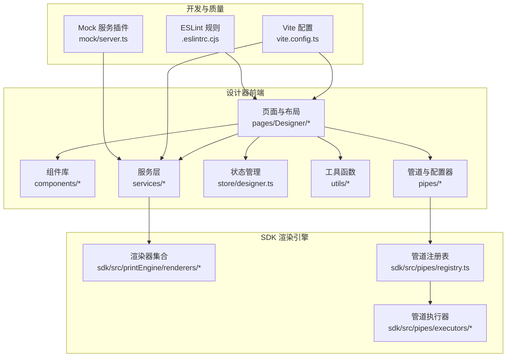
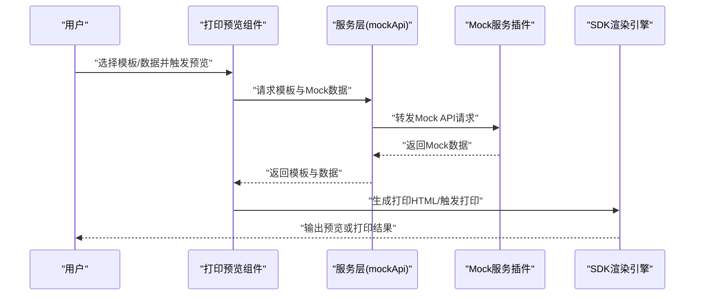
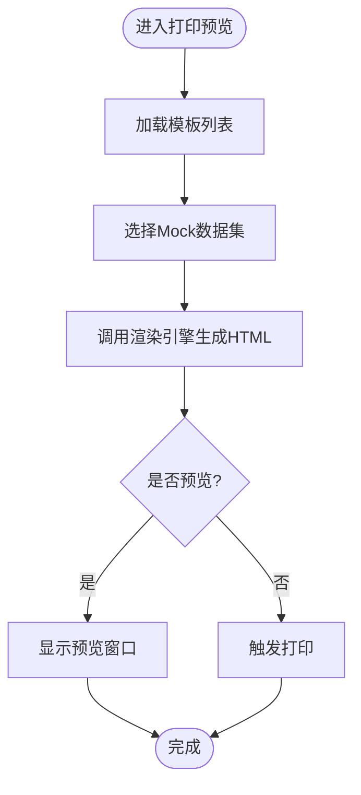
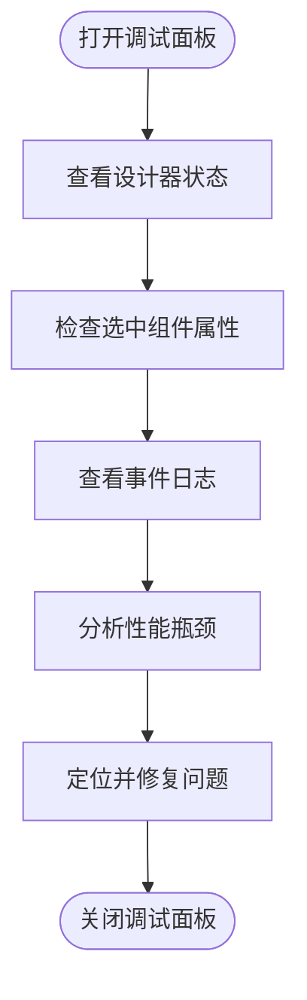
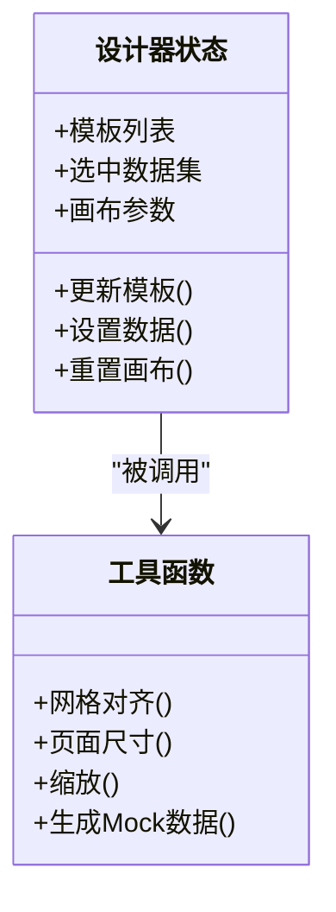
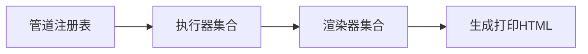
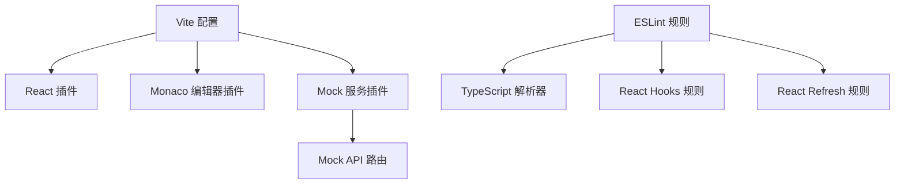

# 质量保证实践

<cite>
**本文引用的文件**
- [package.json](file://designer/package.json)
- [vite.config.ts](file://designer/vite.config.ts)
- [.eslintrc.cjs](file://designer/.eslintrc.cjs)
- [mock/server.ts](file://designer/mock/server.ts)
- [src/components/PrintPreview/index.tsx](file://designer/src/components/PrintPreview/index.tsx)
- [src/pages/Designer/components/DebugPanel/index.tsx](file://designer/src/pages/Designer/components/DebugPanel/index.tsx)
- [src/services/mockApi.ts](file://designer/src/services/mockApi.ts)
- [src/services/mockStore.ts](file://designer/src/services/mockStore.ts)
- [src/store/designer.ts](file://designer/src/store/designer.ts)
- [src/utils/grid.ts](file://designer/src/utils/grid.ts)
- [src/utils/mockDataGenerator.ts](file://designer/src/utils/mockDataGenerator.ts)
- [src/utils/pageSize.ts](file://designer/src/utils/pageSize.ts)
- [src/utils/zoom.ts](file://designer/src/utils/zoom.ts)
- [src/pipes/configurators/index.tsx](file://designer/src/pipes/configurators/index.tsx)
- [src/pipes/executors/index.ts](file://designer/src/pipes/executors/index.ts)
- [sdk/src/printEngine/renderers/index.ts](file://sdk/src/printEngine/renderers/index.ts)
- [sdk/src/pipes/registry.ts](file://sdk/src/pipes/registry.ts)
- [sdk/src/pipes/executors/index.ts](file://sdk/src/pipes/executors/index.ts)
- [README.md](file://README.md)
</cite>

## 目录
1. [引言](#引言)
2. [项目结构](#项目结构)
3. [核心组件](#核心组件)
4. [架构总览](#架构总览)
5. [详细组件分析](#详细组件分析)
6. [依赖分析](#依赖分析)
7. [性能考虑](#性能考虑)
8. [故障排查指南](#故障排查指南)
9. [结论](#结论)
10. [附录](#附录)

## 引言
本文件面向打印设计器项目的质量保证与测试实践，系统化梳理测试策略（单元测试、集成测试、端到端测试）、调试与问题定位、组件与渲染测试最佳实践、性能与压力测试方案、代码质量检查与静态分析工具、持续集成与自动化测试配置、缺陷跟踪与修复验证流程，以及用户体验测试与可用性评估方法。内容以仓库现有实现为基础，结合可扩展建议，帮助团队建立稳定、高效的质量保障体系。

## 项目结构
该项目采用前端单页应用架构，核心由设计器页面、组件库、服务层、状态管理、工具函数与SDK渲染引擎组成。构建与开发环境通过Vite配置，代码规范通过ESLint配置，Mock服务通过自定义插件集成。

图表来源
- [vite.config.ts:1-29](file://designer/vite.config.ts#L1-L29)
- [.eslintrc.cjs:1-19](file://designer/.eslintrc.cjs#L1-L19)
- [mock/server.ts:181-185](file://designer/mock/server.ts#L181-L185)

章节来源
- [vite.config.ts:1-29](file://designer/vite.config.ts#L1-L29)
- [.eslintrc.cjs:1-19](file://designer/.eslintrc.cjs#L1-L19)
- [mock/server.ts:181-185](file://designer/mock/server.ts#L181-L185)

## 核心组件
- 页面与布局：包含主布局、设计画布、属性面板、资产面板、调试面板等模块，支撑模板设计与预览。
- 组件库：如条形码、二维码、打印预览等基础组件。
- 服务层：封装API调用与Mock数据，支持模板、Schema、Mock数据管理。
- 状态管理：集中管理设计器状态，便于组件间共享与同步。
- 工具函数：网格对齐、页面尺寸、缩放、Mock数据生成等辅助能力。
- 管道与配置器：数据处理管道的注册与执行器，支持多种格式转换。
- SDK 渲染引擎：负责将模板与数据渲染为可打印HTML或直接打印。

章节来源
- [src/components/PrintPreview/index.tsx:114-225](file://designer/src/components/PrintPreview/index.tsx#L114-L225)
- [src/services/mockApi.ts:1-50](file://designer/src/services/mockApi.ts#L1-L50)
- [src/services/mockStore.ts:1-50](file://designer/src/services/mockStore.ts#L1-L50)
- [src/store/designer.ts:1-50](file://designer/src/store/designer.ts#L1-L50)
- [src/utils/grid.ts:1-50](file://designer/src/utils/grid.ts#L1-L50)
- [src/utils/mockDataGenerator.ts:1-50](file://designer/src/utils/mockDataGenerator.ts#L1-L50)
- [src/utils/pageSize.ts:1-50](file://designer/src/utils/pageSize.ts#L1-L50)
- [src/utils/zoom.ts:1-50](file://designer/src/utils/zoom.ts#L1-L50)
- [src/pipes/configurators/index.tsx:1-50](file://designer/src/pipes/configurators/index.tsx#L1-L50)
- [src/pipes/executors/index.ts:1-50](file://designer/src/pipes/executors/index.ts#L1-L50)
- [sdk/src/printEngine/renderers/index.ts:1-50](file://sdk/src/printEngine/renderers/index.ts#L1-L50)
- [sdk/src/pipes/registry.ts:1-50](file://sdk/src/pipes/registry.ts#L1-L50)
- [sdk/src/pipes/executors/index.ts:1-50](file://sdk/src/pipes/executors/index.ts#L1-L50)

## 架构总览
下图展示从页面到服务、再到SDK渲染引擎的整体调用链路，以及Mock服务在开发阶段的作用。

图表来源
- [src/components/PrintPreview/index.tsx:114-225](file://designer/src/components/PrintPreview/index.tsx#L114-L225)
- [mock/server.ts:181-185](file://designer/mock/server.ts#L181-L185)

章节来源
- [src/components/PrintPreview/index.tsx:114-225](file://designer/src/components/PrintPreview/index.tsx#L114-L225)
- [mock/server.ts:181-185](file://designer/mock/server.ts#L181-L185)

## 详细组件分析

### 打印预览组件（组件测试与渲染测试）
- 功能职责：加载模板与Mock数据，生成打印HTML，支持单张/多张预览与打印。
- 关键交互：模板列表获取、数据集选择、渲染引擎调用、打印触发。
- 测试要点：
  - 单元测试：拆分模板获取、数据匹配、渲染引擎调用等逻辑，分别断言输入输出。
  - 集成测试：Mock服务与渲染引擎组合，验证模板+数据到HTML的完整链路。
  - 渲染测试：对关键DOM节点与样式进行快照对比，确保UI一致性。
  - 可访问性测试：键盘导航、焦点顺序、语义标签校验。

图表来源
- [src/components/PrintPreview/index.tsx:114-225](file://designer/src/components/PrintPreview/index.tsx#L114-L225)

章节来源
- [src/components/PrintPreview/index.tsx:114-225](file://designer/src/components/PrintPreview/index.tsx#L114-L225)

### 调试面板（调试技巧与问题定位）
- 功能职责：提供设计过程中的状态查看、事件日志、性能指标等调试信息。
- 使用建议：
  - 在关键流程（模板加载、数据绑定、渲染）插入调试输出。
  - 结合浏览器开发者工具的网络面板、性能面板与元素面板进行交叉验证。
  - 对异常路径增加兜底提示与错误上报，便于快速定位。

图表来源
- [src/pages/Designer/components/DebugPanel/index.tsx:1-50](file://designer/src/pages/Designer/components/DebugPanel/index.tsx#L1-L50)

章节来源
- [src/pages/Designer/components/DebugPanel/index.tsx:1-50](file://designer/src/pages/Designer/components/DebugPanel/index.tsx#L1-L50)

### 状态管理与工具函数（单元测试）
- 状态管理：集中存储模板、数据、画布参数等，便于组件共享与回放。
- 工具函数：网格对齐、页面尺寸、缩放、Mock数据生成等，建议按纯函数拆分并独立测试。
- 测试策略：
  - 状态变更：断言状态转换前后值与副作用。
  - 工具函数：覆盖边界值、异常输入与典型场景。

图表来源
- [src/store/designer.ts:1-50](file://designer/src/store/designer.ts#L1-L50)
- [src/utils/grid.ts:1-50](file://designer/src/utils/grid.ts#L1-L50)
- [src/utils/pageSize.ts:1-50](file://designer/src/utils/pageSize.ts#L1-L50)
- [src/utils/zoom.ts:1-50](file://designer/src/utils/zoom.ts#L1-L50)
- [src/utils/mockDataGenerator.ts:1-50](file://designer/src/utils/mockDataGenerator.ts#L1-L50)

章节来源
- [src/store/designer.ts:1-50](file://designer/src/store/designer.ts#L1-L50)
- [src/utils/grid.ts:1-50](file://designer/src/utils/grid.ts#L1-L50)
- [src/utils/pageSize.ts:1-50](file://designer/src/utils/pageSize.ts#L1-L50)
- [src/utils/zoom.ts:1-50](file://designer/src/utils/zoom.ts#L1-L50)
- [src/utils/mockDataGenerator.ts:1-50](file://designer/src/utils/mockDataGenerator.ts#L1-L50)

### 管道与渲染引擎（集成测试）
- 管道注册与执行：通过注册表统一管理执行器，便于扩展与替换。
- 渲染器集合：针对不同组件类型（文本、表格、图像、条形码、二维码等）提供渲染实现。
- 测试策略：
  - 单元测试：执行器输入输出校验、注册表解析正确性。
  - 集成测试：模板+数据+渲染器组合，验证最终HTML结构与样式。

图表来源
- [sdk/src/pipes/registry.ts:1-50](file://sdk/src/pipes/registry.ts#L1-L50)
- [sdk/src/pipes/executors/index.ts:1-50](file://sdk/src/pipes/executors/index.ts#L1-L50)
- [sdk/src/printEngine/renderers/index.ts:1-50](file://sdk/src/printEngine/renderers/index.ts#L1-L50)

章节来源
- [sdk/src/pipes/registry.ts:1-50](file://sdk/src/pipes/registry.ts#L1-L50)
- [sdk/src/pipes/executors/index.ts:1-50](file://sdk/src/pipes/executors/index.ts#L1-L50)
- [sdk/src/printEngine/renderers/index.ts:1-50](file://sdk/src/printEngine/renderers/index.ts#L1-L50)

## 依赖分析
- 构建与开发：Vite配置启用React插件与Monaco编辑器插件，并通过插件注入Mock开关；开发模式下将SDK源码作为别名指向本地源码，便于联调。
- 代码规范：ESLint继承推荐规则与TypeScript插件，配合React Hooks与刷新插件，约束组件导出与刷新行为。
- Mock服务：自定义Vite插件提供Mock API路由与请求解析，支持GET/POST等常见方法。

图表来源
- [vite.config.ts:1-29](file://designer/vite.config.ts#L1-L29)
- [.eslintrc.cjs:1-19](file://designer/.eslintrc.cjs#L1-L19)
- [mock/server.ts:181-185](file://designer/mock/server.ts#L181-L185)

章节来源
- [vite.config.ts:1-29](file://designer/vite.config.ts#L1-L29)
- [.eslintrc.cjs:1-19](file://designer/.eslintrc.cjs#L1-L19)
- [mock/server.ts:181-185](file://designer/mock/server.ts#L181-L185)

## 性能考虑
- 渲染性能：避免在渲染过程中进行昂贵计算，优先使用缓存与节流；对大量组件采用虚拟化或分页渲染。
- 数据加载：模板与Mock数据应分批加载与懒执行，减少首屏阻塞。
- 网络请求：合并请求、启用缓存与CDN，合理设置超时与重试策略。
- 压力测试：模拟高并发场景，测量响应时间、吞吐量与资源占用，识别瓶颈点。

## 故障排查指南
- 调试面板：用于查看状态、日志与性能，定位异常路径。
- Mock服务：确认Mock路由与数据格式，避免与真实API冲突。
- 渲染引擎：核对模板结构与数据绑定，确保渲染器正确匹配组件类型。
- 错误上报：在关键流程捕获异常并记录上下文，便于复现与修复。

章节来源
- [src/pages/Designer/components/DebugPanel/index.tsx:1-50](file://designer/src/pages/Designer/components/DebugPanel/index.tsx#L1-L50)
- [mock/server.ts:181-185](file://designer/mock/server.ts#L181-L185)
- [src/components/PrintPreview/index.tsx:114-225](file://designer/src/components/PrintPreview/index.tsx#L114-L225)

## 结论
通过明确的测试策略、完善的调试机制、严谨的代码质量检查与持续集成流程，可以有效提升打印设计器的稳定性与可维护性。建议在现有基础上逐步完善单元测试覆盖率、引入端到端测试与性能压测，并建立缺陷跟踪与修复验证闭环，持续优化用户体验与可用性。

## 附录

### 测试策略与实施清单
- 单元测试
  - 对纯函数与工具函数进行覆盖，重点校验边界与异常分支。
  - 对状态管理的Action与Selector进行断言。
- 集成测试
  - Mock服务与渲染引擎组合验证，确保模板+数据到HTML的正确性。
  - 管道注册表与执行器联动测试。
- 端到端测试
  - 基于真实浏览器驱动，模拟用户操作（选择模板、绑定数据、预览与打印），记录关键步骤与期望结果。
- 组件与渲染测试
  - 对关键组件进行快照对比，确保UI一致性；对复杂布局进行布局回归测试。
- 性能与压力测试
  - 使用性能分析工具定位瓶颈；构造高并发场景评估系统承载能力。
- 代码质量与静态分析
  - 使用ESLint规则集与TypeScript解析器，结合自动修复与CI强制检查。
- 持续集成与自动化测试
  - 在CI中执行安装、构建、Lint、单元测试、集成测试与端到端测试流水线。
- 缺陷跟踪与修复验证
  - 建立缺陷分类与优先级，追踪修复进度并进行回归验证。
- 用户体验测试与可用性评估
  - 收集真实用户反馈，关注易用性、可访问性与跨设备兼容性。

### 质量检查与静态分析工具使用
- ESLint：遵循推荐规则与TypeScript插件，确保代码风格与类型安全。
- TypeScript：启用严格模式与合理编译选项，减少运行时风险。
- 自动修复：在本地与CI中优先应用自动修复，降低人工成本。

章节来源
- [.eslintrc.cjs:1-19](file://designer/.eslintrc.cjs#L1-L19)
- [package.json:10-11](file://designer/package.json#L10-L11)

### 持续集成与自动化测试配置指南
- 构建脚本：使用Vite进行开发与生产构建，确保依赖安装与打包一致。
- Lint脚本：在CI中强制执行，限制告警数量，保证代码质量门槛。
- 测试脚本：在CI中串联单元测试、集成测试与端到端测试，失败即阻断发布。

章节来源
- [package.json:6-11](file://designer/package.json#L6-L11)
- [vite.config.ts:1-29](file://designer/vite.config.ts#L1-L29)

### 用户体验测试与可用性评估
- 可访问性：确保键盘可达、焦点可见、语义标签正确。
- 跨设备兼容：在主流浏览器与移动设备上验证布局与交互。
- 用户反馈：收集真实使用场景下的痛点与改进建议，持续迭代。