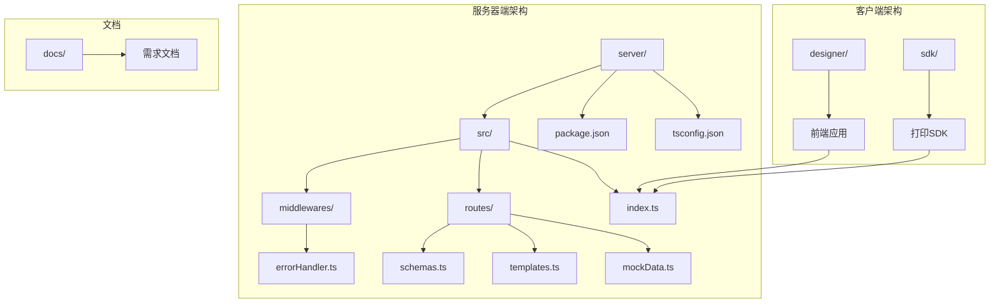
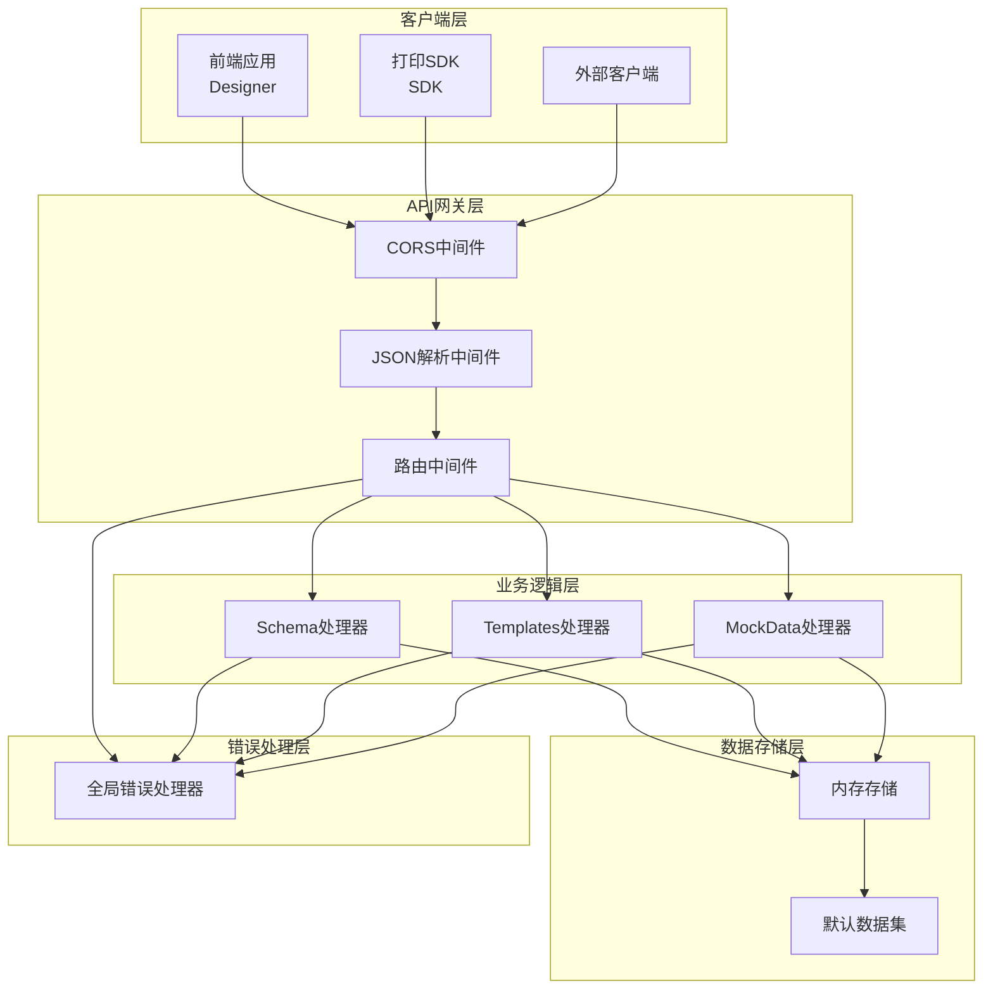
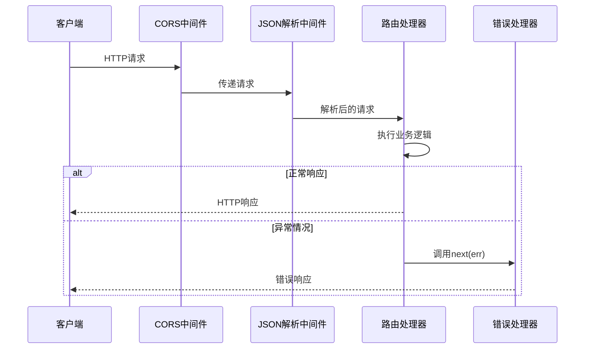

# API架构设计

<cite>
**本文档引用的文件**
- [server/src/index.ts](file://server/src/index.ts)
- [server/src/middlewares/errorHandler.ts](file://server/src/middlewares/errorHandler.ts)
- [server/src/routes/schemas.ts](file://server/src/routes/schemas.ts)
- [server/src/routes/templates.ts](file://server/src/routes/templates.ts)
- [server/src/routes/mockData.ts](file://server/src/routes/mockData.ts)
- [server/package.json](file://server/package.json)
- [server/tsconfig.json](file://server/tsconfig.json)
</cite>

## 目录
1. [简介](#简介)
2. [项目结构](#项目结构)
3. [核心组件](#核心组件)
4. [架构概览](#架构概览)
5. [详细组件分析](#详细组件分析)
6. [依赖分析](#依赖分析)
7. [性能考虑](#性能考虑)
8. [故障排除指南](#故障排除指南)
9. [结论](#结论)

## 简介

本项目是一个基于Express.js的RESTful API服务，专门为打印模板管理而设计。该服务提供了三个核心资源的完整CRUD操作：Schema（数据结构定义）、Templates（打印模板）和MockData（模拟数据）。系统采用模块化的路由组织结构，实现了清晰的中间件链式调用和统一的错误处理机制。

该API架构设计遵循现代Express最佳实践，通过分层架构实现了关注点分离，确保了代码的可维护性和扩展性。系统支持CORS跨域访问，具备完整的JSON请求体解析能力，并提供了健壮的错误处理机制。

## 项目结构

服务器端采用模块化目录结构，按照功能层次进行组织：



**图表来源**
- [server/src/index.ts:1-25](file://server/src/index.ts#L1-L25)
- [server/src/middlewares/errorHandler.ts:1-10](file://server/src/middlewares/errorHandler.ts#L1-L10)
- [server/src/routes/schemas.ts:1-178](file://server/src/routes/schemas.ts#L1-L178)
- [server/src/routes/templates.ts:1-1081](file://server/src/routes/templates.ts#L1-L1081)
- [server/src/routes/mockData.ts:1-448](file://server/src/routes/mockData.ts#L1-L448)

**章节来源**
- [server/src/index.ts:1-25](file://server/src/index.ts#L1-L25)
- [server/package.json:1-25](file://server/package.json#L1-L25)
- [server/tsconfig.json:1-13](file://server/tsconfig.json#L1-L13)

## 核心组件

### 应用入口与配置

主应用程序文件负责初始化Express实例、配置中间件和路由，并启动HTTP服务器。

### 中间件层

系统实现了统一的错误处理中间件，确保所有未捕获的异常都能得到一致的处理。

### 路由层

三个核心业务模块的路由处理器：
- **Schema路由**：管理数据结构定义
- **Templates路由**：管理打印模板
- **MockData路由**：管理模拟数据

每个路由模块都实现了标准的RESTful CRUD操作。

**章节来源**
- [server/src/index.ts:1-25](file://server/src/index.ts#L1-L25)
- [server/src/middlewares/errorHandler.ts:1-10](file://server/src/middlewares/errorHandler.ts#L1-L10)

## 架构概览

该API采用经典的三层架构设计，实现了清晰的关注点分离：



**图表来源**
- [server/src/index.ts:9-18](file://server/src/index.ts#L9-L18)
- [server/src/middlewares/errorHandler.ts:3-9](file://server/src/middlewares/errorHandler.ts#L3-L9)

### 中间件链式调用流程



**图表来源**
- [server/src/index.ts:11-18](file://server/src/index.ts#L11-L18)
- [server/src/middlewares/errorHandler.ts:3-9](file://server/src/middlewares/errorHandler.ts#L3-L9)

## 详细组件分析

### 应用入口组件

应用入口文件是整个系统的启动点，负责：

1. **依赖导入**：引入Express、CORS、BodyParser和各个路由模块
2. **中间件配置**：设置CORS跨域和JSON解析
3. **路由注册**：将各模块路由挂载到指定路径前缀
4. **错误处理**：注册全局错误处理中间件
5. **服务器启动**：监听指定端口

### CORS跨域配置

系统使用默认配置的CORS中间件，允许来自任何源的跨域请求。这种配置适用于开发环境和内部服务通信。

### JSON请求体解析

通过body-parser中间件实现JSON请求体的自动解析，支持：
- 自动识别Content-Type: application/json
- 将JSON数据转换为JavaScript对象
- 提供req.body访问解析后的数据

### 全局错误处理机制

错误处理中间件实现了统一的错误响应格式：
- 捕获所有未处理的异常
- 记录错误日志
- 返回标准化的错误响应
- 设置适当的HTTP状态码

**章节来源**
- [server/src/index.ts:1-25](file://server/src/index.ts#L1-L25)
- [server/src/middlewares/errorHandler.ts:1-10](file://server/src/middlewares/errorHandler.ts#L1-L10)

### Schema路由模块

Schema模块管理数据结构定义，支持以下操作：

#### 数据模型
- **SchemaDictionary**：完整的Schema定义
- **SchemaField**：字段定义，支持嵌套结构
- **SchemaFieldType**：字段类型枚举

#### 核心功能
- **创建**：POST /api/schemas - 创建新的Schema定义
- **查询**：GET /api/schemas - 获取所有Schema或按名称过滤
- **详情**：GET /api/schemas/:id - 获取特定Schema
- **更新**：PUT /api/schemas/:id - 更新现有Schema
- **删除**：DELETE /api/schemas/:id - 删除Schema

#### 查询参数
- **name**：按名称模糊匹配
- **支持大小写不敏感的字符串匹配**

**章节来源**
- [server/src/routes/schemas.ts:1-178](file://server/src/routes/schemas.ts#L1-L178)

### Templates路由模块

Templates模块管理打印模板，提供完整的模板生命周期管理：

#### 数据模型
- **PrintTemplate**：完整的打印模板定义
- **ComponentNode**：模板组件节点
- **PageConfig**：页面配置
- **DataBinding**：数据绑定配置

#### 核心功能
- **创建**：POST /api/templates - 创建新模板
- **查询**：GET /api/templates - 获取模板列表或按条件过滤
- **详情**：GET /api/templates/:id - 获取模板详情
- **更新**：PUT /api/templates/:id - 更新模板
- **删除**：DELETE /api/templates/:id - 删除模板

#### 查询参数
- **name**：按名称过滤
- **schemaId**：按关联Schema ID过滤

#### 内置模板
系统包含多个预定义模板：
- **订单打印模板**：完整的销售订单布局
- **快递面单模板**：物流快递单布局
- **产品标签模板**：工业产品标签布局

**章节来源**
- [server/src/routes/templates.ts:1-1081](file://server/src/routes/templates.ts#L1-L1081)

### MockData路由模块

MockData模块管理模拟数据，为模板渲染提供测试数据：

#### 数据模型
- **MockData**：模拟数据对象
- 支持单个对象和数组两种数据格式

#### 核心功能
- **创建**：POST /api/mock-data - 创建模拟数据
- **查询**：GET /api/mock-data - 获取模拟数据列表或按条件过滤
- **详情**：GET /api/mock-data/:id - 获取特定数据
- **更新**：PUT /api/mock-data/:id - 更新数据
- **删除**：DELETE /api/mock-data/:id - 删除数据

#### 查询参数
- **name**：按名称过滤
- **schemaId**：按关联Schema ID过滤
- **templateId**：按关联模板ID过滤

#### 内置数据
系统包含多种预定义的模拟数据：
- **销售出库单示例**：标准格式的销售单据
- **大数据量示例**：包含大量明细项的报表
- **简单测试数据**：最小化数据集
- **批量打印数据**：多份订单的组合数据

**章节来源**
- [server/src/routes/mockData.ts:1-448](file://server/src/routes/mockData.ts#L1-L448)

### 错误处理中间件

全局错误处理中间件实现了统一的错误响应机制：

```mermaid
flowchart TD
A[请求到达] --> B{是否发生错误?}
B --> |否| C[正常响应]
B --> |是| D[调用next(err)]
D --> E[错误处理中间件捕获]
E --> F[记录错误日志]
F --> G[返回标准化错误响应]
G --> H[设置500状态码]
H --> I[结束请求]
```

**图表来源**
- [server/src/middlewares/errorHandler.ts:3-9](file://server/src/middlewares/errorHandler.ts#L3-L9)

**章节来源**
- [server/src/middlewares/errorHandler.ts:1-10](file://server/src/middlewares/errorHandler.ts#L1-L10)

## 依赖分析

### 核心依赖关系

```mermaid
graph TB
subgraph "运行时依赖"
A[express] --> B[核心Web框架]
C[cors] --> D[跨域处理]
E[uuid] --> F[唯一标识符生成]
end
subgraph "开发时依赖"
G[typescript] --> H[类型安全]
I[@types/express] --> J[类型定义]
K[@types/node] --> L[Node.js类型]
M[ts-node-dev] --> N[开发服务器]
end
subgraph "应用架构"
O[server/src/index.ts] --> P[路由注册]
O --> Q[中间件配置]
R[server/src/routes/] --> S[业务逻辑]
T[server/src/middlewares/] --> U[错误处理]
end
A --> O
C --> O
E --> R
G --> O
I --> O
K --> O
M --> O
```

**图表来源**
- [server/package.json:11-23](file://server/package.json#L11-L23)
- [server/src/index.ts:1-7](file://server/src/index.ts#L1-L7)

### 模块耦合分析

系统采用了松耦合的设计模式：

- **路由模块独立**：每个路由模块都有明确的职责边界
- **中间件解耦**：中间件与业务逻辑分离
- **数据存储抽象**：使用内存存储，便于替换为持久化存储
- **错误处理集中**：全局错误处理避免了重复代码

**章节来源**
- [server/package.json:1-25](file://server/package.json#L1-L25)

## 性能考虑

### 内存存储优化

当前实现使用内存存储，适合开发和测试场景。对于生产环境，建议：

1. **数据库集成**：替换内存存储为持久化数据库
2. **缓存策略**：实现Redis等缓存层
3. **分页查询**：对大量数据的查询实现分页
4. **索引优化**：为常用查询字段建立索引

### 中间件性能

- **CORS中间件**：默认配置，性能开销极小
- **JSON解析**：仅解析application/json类型的请求
- **错误处理**：只在异常情况下执行

### 扩展性建议

1. **负载均衡**：部署多个实例以支持水平扩展
2. **API版本控制**：实现语义化版本控制
3. **监控指标**：添加请求计数、响应时间等指标
4. **限流机制**：防止恶意请求和DDoS攻击

## 故障排除指南

### 常见问题诊断

#### 服务器启动失败
- 检查端口占用情况
- 验证Node.js版本兼容性
- 确认依赖包安装完成

#### 跨域请求失败
- 检查CORS配置
- 验证预检请求处理
- 确认浏览器开发者工具中的错误信息

#### JSON解析错误
- 检查请求头Content-Type
- 验证JSON格式的有效性
- 确认请求体编码正确

#### 路由404错误
- 验证URL路径前缀
- 检查路由注册顺序
- 确认HTTP方法匹配

### 日志和调试

系统提供了基本的日志记录功能：
- 错误处理中间件会记录错误堆栈
- 服务器启动时输出监听信息
- 可通过环境变量调整日志级别

**章节来源**
- [server/src/middlewares/errorHandler.ts:4](file://server/src/middlewares/errorHandler.ts#L4)
- [server/src/index.ts:22-24](file://server/src/index.ts#L22-L24)

## 结论

该基于Express的RESTful API架构设计体现了现代Web服务的最佳实践：

### 设计优势

1. **模块化架构**：清晰的职责分离和模块边界
2. **中间件链**：灵活的请求处理管道
3. **统一错误处理**：一致的错误响应格式
4. **类型安全**：完整的TypeScript支持
5. **易于扩展**：良好的架构基础支持功能扩展

### 技术特点

- **轻量级**：基于Express的核心特性
- **高性能**：中间件链式调用减少不必要的处理
- **易维护**：清晰的代码结构和注释
- **可测试**：模块化设计便于单元测试

### 发展建议

1. **生产环境优化**：集成数据库和缓存层
2. **安全增强**：添加身份验证和授权机制
3. **API文档**：集成Swagger/OpenAPI文档
4. **监控完善**：添加完整的性能监控和日志系统

该架构为打印模板管理系统提供了坚实的技术基础，能够支持从原型开发到生产部署的各种需求。