# Mock数据管理API

<cite>
**本文档引用的文件**
- [server/src/routes/mockData.ts](file://server/src/routes/mockData.ts)
- [server/src/routes/schemas.ts](file://server/src/routes/schemas.ts)
- [server/src/index.ts](file://server/src/index.ts)
- [designer/src/services/api.ts](file://designer/src/services/api.ts)
- [designer/src/pages/MockDataManagement/index.tsx](file://designer/src/pages/MockDataManagement/index.tsx)
- [designer/src/utils/mockDataGenerator.ts](file://designer/src/utils/mockDataGenerator.ts)
- [designer/src/types/index.ts](file://designer/src/types/index.ts)
- [README.md](file://README.md)
</cite>

## 目录
1. [简介](#简介)
2. [项目结构](#项目结构)
3. [核心组件](#核心组件)
4. [架构概览](#架构概览)
5. [详细组件分析](#详细组件分析)
6. [依赖关系分析](#依赖关系分析)
7. [性能考虑](#性能考虑)
8. [故障排除指南](#故障排除指南)
9. [结论](#结论)
10. [附录](#附录)

## 简介

Mock数据管理API是打印服务平台的重要组成部分，负责管理用于测试和演示的模拟数据。该API提供了完整的CRUD操作接口，支持Mock数据的增删改查、批量操作和条件查询功能。系统采用前后端分离架构，前端使用React + TypeScript开发可视化管理界面，后端基于Express.js提供RESTful API服务。

该系统的核心价值在于：
- **数据驱动的测试**：通过Mock数据验证模板设计和打印功能
- **Schema驱动**：基于Schema定义的数据结构，确保数据的一致性和完整性
- **智能生成**：根据Schema自动生成符合规范的Mock数据
- **灵活导入导出**：支持JSON格式的数据导入导出，便于数据迁移和备份

## 项目结构

该项目采用模块化的三层架构设计：

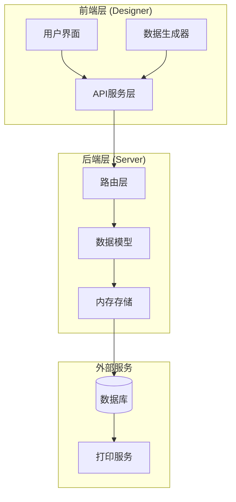

**图表来源**
- [server/src/index.ts:1-25](file://server/src/index.ts#L1-L25)
- [designer/src/services/api.ts:1-97](file://designer/src/services/api.ts#L1-L97)

**章节来源**
- [README.md:191-234](file://README.md#L191-L234)

## 核心组件

### MockData数据模型

Mock数据采用统一的数据结构，支持灵活的嵌套对象和数组结构：

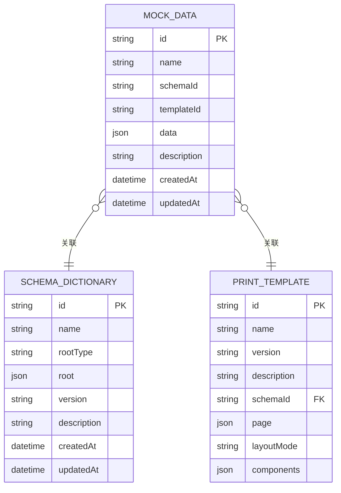

**图表来源**
- [designer/src/types/index.ts:151-160](file://designer/src/types/index.ts#L151-L160)
- [server/src/routes/schemas.ts:25-32](file://server/src/routes/schemas.ts#L25-L32)

### API路由结构

系统提供RESTful API接口，遵循HTTP标准和REST设计原则：

| 方法 | 路径 | 功能 | 请求体 | 响应 |
|------|------|------|--------|------|
| GET | /api/mock-data | 获取Mock数据列表 | 查询参数 | MockData数组 |
| GET | /api/mock-data/:id | 获取指定Mock数据 | - | MockData |
| POST | /api/mock-data | 创建新的Mock数据 | MockData | MockData |
| PUT | /api/mock-data/:id | 更新Mock数据 | MockData | MockData |
| DELETE | /api/mock-data/:id | 删除Mock数据 | - | 204 No Content |

**章节来源**
- [server/src/routes/mockData.ts:382-445](file://server/src/routes/mockData.ts#L382-L445)

## 架构概览

系统采用前后端分离架构，通过API进行数据交互：

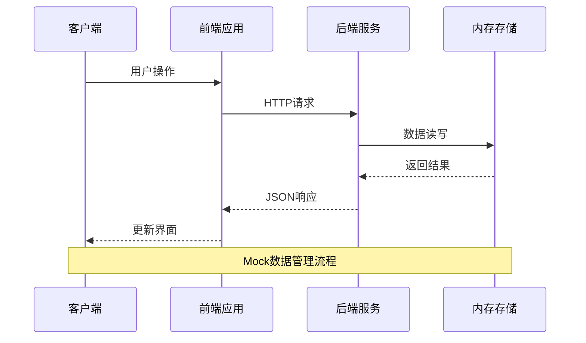

**图表来源**
- [server/src/index.ts:14-16](file://server/src/index.ts#L14-L16)
- [designer/src/services/api.ts:67-96](file://designer/src/services/api.ts#L67-L96)

### 数据流图

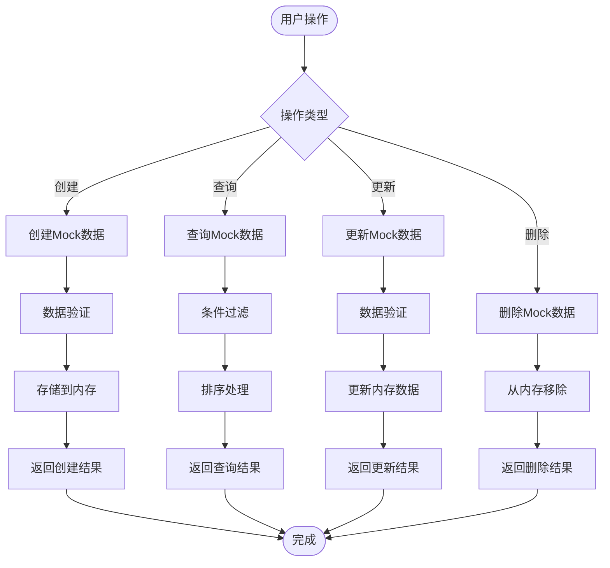

**图表来源**
- [server/src/routes/mockData.ts:394-409](file://server/src/routes/mockData.ts#L394-L409)

## 详细组件分析

### Mock数据管理界面

前端提供了完整的Mock数据管理界面，支持多种操作模式：

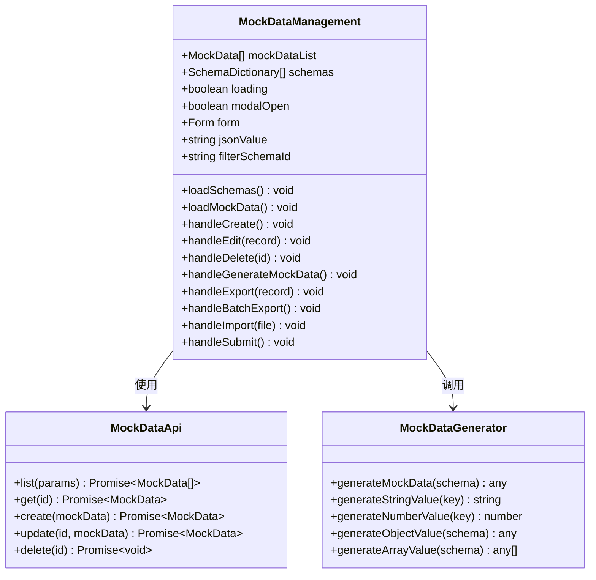

**图表来源**
- [designer/src/pages/MockDataManagement/index.tsx:31-411](file://designer/src/pages/MockDataManagement/index.tsx#L31-L411)
- [designer/src/services/api.ts:67-96](file://designer/src/services/api.ts#L67-L96)
- [designer/src/utils/mockDataGenerator.ts:4-113](file://designer/src/utils/mockDataGenerator.ts#L4-L113)

### Mock数据生成策略

系统提供了多种Mock数据生成策略，确保数据的多样性和实用性：

#### 随机数据生成

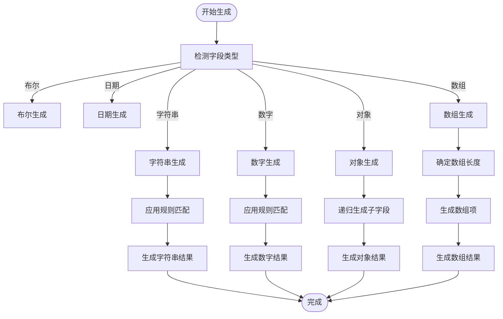

**图表来源**
- [designer/src/utils/mockDataGenerator.ts:24-51](file://designer/src/utils/mockDataGenerator.ts#L24-L51)
- [designer/src/utils/mockDataGenerator.ts:54-71](file://designer/src/utils/mockDataGenerator.ts#L54-L71)

#### 智能数据填充

系统根据字段名称智能推断数据内容：

| 字段关键词 | 推断类型 | 示例值 |
|-----------|----------|--------|
| name, 名称 | 文本 | "示例名称" |
| phone, 电话 | 电话号码 | "13800138000" |
| email, 邮箱 | 邮箱地址 | "example@email.com" |
| address, 地址 | 地址 | "北京市朝阳区示例街道123号" |
| code, 编号 | 编码 | "CODE1234" |
| url, link | URL链接 | "https://example.com" |
| status, 状态 | 状态值 | "正常" |
| price, 金额 | 金额 | 100.00 |
| quantity, 数量 | 数量 | 10 |
| age, 年龄 | 年龄 | 25 |
| percent, 百分比 | 百分比 | 95.50 |

**章节来源**
- [designer/src/utils/mockDataGenerator.ts:24-51](file://designer/src/utils/mockDataGenerator.ts#L24-L51)
- [designer/src/utils/mockDataGenerator.ts:54-71](file://designer/src/utils/mockDataGenerator.ts#L54-L71)

### 数据导入导出机制

#### JSON格式导入

系统支持从JSON文件导入Mock数据，提供灵活的数据迁移能力：

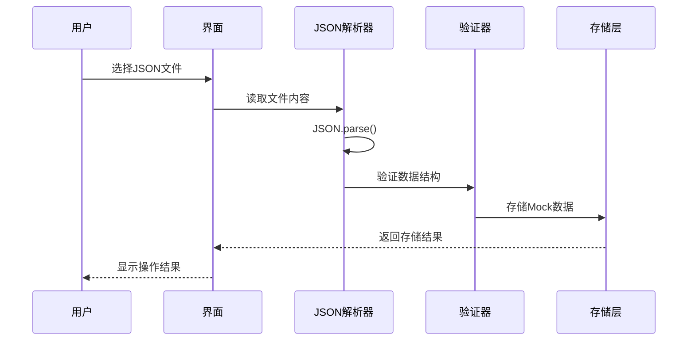

**图表来源**
- [designer/src/pages/MockDataManagement/index.tsx:155-184](file://designer/src/pages/MockDataManagement/index.tsx#L155-L184)

#### 批量导出功能

系统支持批量导出所有Mock数据，便于数据备份和迁移：

| 导出类型 | 文件格式 | 数据范围 | 文件命名 |
|---------|----------|----------|----------|
| 单条导出 | JSON | 单个Mock数据 | `{数据名称}.json` |
| 批量导出 | JSON | 所有Mock数据 | `mock-data-batch.json` |
| Schema导出 | JSON | 所有Schema | `schemas-batch.json` |

**章节来源**
- [designer/src/pages/MockDataManagement/index.tsx:125-152](file://designer/src/pages/MockDataManagement/index.tsx#L125-L152)

### 查询和过滤功能

系统提供了灵活的查询和过滤机制：

#### 条件查询

| 查询参数 | 类型 | 说明 | 示例 |
|---------|------|------|------|
| name | string | 按名称模糊查询 | `?name=销售` |
| schemaId | string | 按Schema ID过滤 | `?schemaId=schema-001` |
| templateId | string | 按模板ID过滤 | `?templateId=template-001` |

#### 分页查询

系统支持分页查询，提高大数据量下的查询性能：

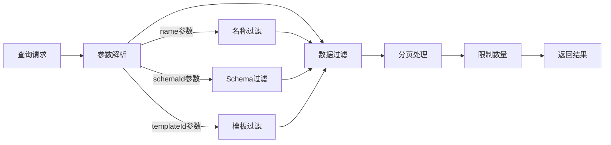

**图表来源**
- [server/src/routes/mockData.ts:394-409](file://server/src/routes/mockData.ts#L394-L409)

**章节来源**
- [server/src/routes/mockData.ts:394-409](file://server/src/routes/mockData.ts#L394-L409)

## 依赖关系分析

### 技术栈依赖

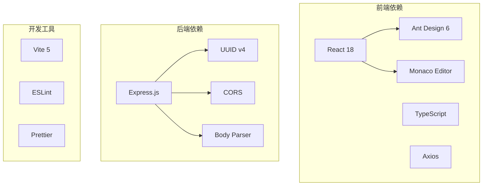

**图表来源**
- [README.md:165-187](file://README.md#L165-L187)

### 组件间依赖

系统各组件间的依赖关系清晰明确：

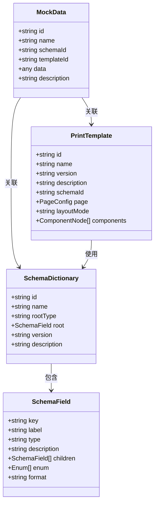

**图表来源**
- [designer/src/types/index.ts:21-28](file://designer/src/types/index.ts#L21-L28)
- [designer/src/types/index.ts:151-160](file://designer/src/types/index.ts#L151-L160)

**章节来源**
- [designer/src/types/index.ts:1-160](file://designer/src/types/index.ts#L1-L160)

## 性能考虑

### 内存存储优化

系统采用内存存储方案，适用于中小型应用场景：

- **存储容量**：受服务器内存限制
- **访问速度**：内存访问速度极快
- **持久性**：重启后数据丢失，适合测试环境

### 查询性能优化

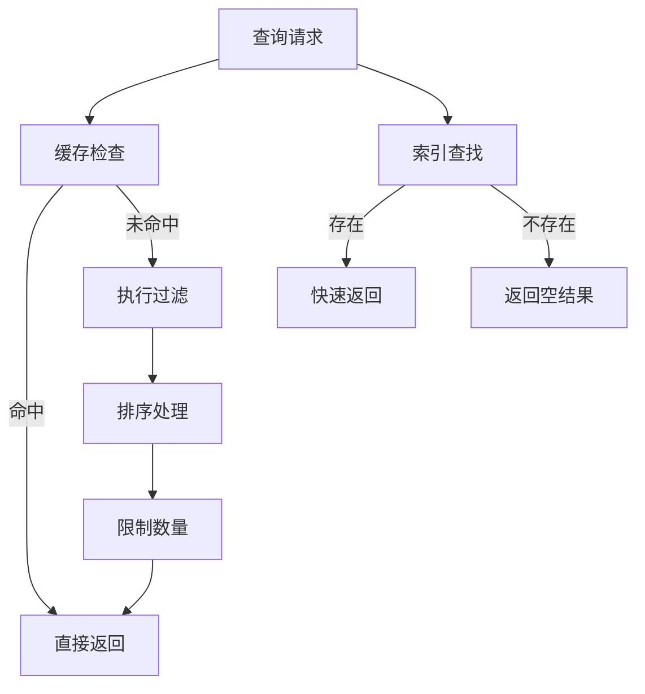

### 批量操作优化

系统支持批量导入导出功能，提高数据处理效率：

| 操作类型 | 性能特点 | 适用场景 |
|---------|----------|----------|
| 单条操作 | 实时响应 | 个别数据管理 |
| 批量导入 | 高效处理 | 数据迁移 |
| 批量导出 | 快速下载 | 数据备份 |
| 条件查询 | 精确过滤 | 数据检索 |

## 故障排除指南

### 常见问题及解决方案

#### API调用失败

**问题症状**：前端无法连接到后端API服务

**可能原因**：
1. 后端服务未启动
2. 端口被占用
3. CORS跨域问题
4. 网络连接异常

**解决方案**：
1. 检查后端服务状态：`npm start`
2. 验证端口占用情况：`netstat -tulpn | grep 3000`
3. 检查CORS配置：确保允许前端域名访问
4. 测试网络连通性：`ping localhost:3000`

#### Mock数据导入失败

**问题症状**：JSON文件导入时报错

**可能原因**：
1. JSON格式不正确
2. 缺少必需字段
3. 数据类型不匹配
4. 文件损坏

**解决方案**：
1. 使用在线JSON验证工具检查格式
2. 确保包含必需字段：`name`、`data`
3. 验证数据类型与Schema定义一致
4. 重新生成或修复JSON文件

#### 数据生成异常

**问题症状**：智能生成的Mock数据不符合预期

**可能原因**：
1. Schema定义不完整
2. 字段名称不匹配规则
3. 数据类型推断错误
4. 生成算法限制

**解决方案**：
1. 完善Schema定义，添加详细说明
2. 调整字段名称以匹配期望规则
3. 手动修改生成结果
4. 扩展生成算法支持更多类型

**章节来源**
- [designer/src/pages/MockDataManagement/index.tsx:176-184](file://designer/src/pages/MockDataManagement/index.tsx#L176-L184)

### 调试技巧

#### 前端调试

1. **开发者工具**：使用浏览器开发者工具监控网络请求
2. **状态检查**：验证Redux状态管理和数据流
3. **组件调试**：使用React DevTools检查组件状态
4. **API测试**：使用Postman或curl测试API接口

#### 后端调试

1. **日志记录**：启用详细的日志输出
2. **错误处理**：实现完善的错误捕获和处理
3. **单元测试**：编写测试用例验证核心功能
4. **性能监控**：监控内存使用和响应时间

## 结论

Mock数据管理API为打印服务平台提供了完整的数据测试和演示能力。系统采用现代化的技术栈和架构设计，具有以下优势：

### 技术优势

- **模块化设计**：清晰的前后端分离架构
- **Schema驱动**：确保数据结构的一致性和完整性
- **智能生成**：基于规则的自动化数据生成
- **灵活扩展**：支持多种数据格式和操作模式

### 应用价值

- **开发效率**：快速生成测试数据，提高开发效率
- **质量保证**：通过Mock数据验证系统功能
- **用户体验**：直观的可视化管理界面
- **数据迁移**：便捷的导入导出功能

### 未来展望

系统具备良好的扩展基础，可以进一步完善：
- 增加数据库持久化支持
- 扩展更多的数据生成策略
- 优化大数据量下的性能表现
- 增强数据验证和错误处理机制

## 附录

### API使用示例

#### 基本CRUD操作

**创建Mock数据**
```javascript
// POST /api/mock-data
const mockData = {
  name: "测试订单数据",
  schemaId: "schema-demo-sales",
  description: "用于测试的订单数据",
  data: {
    title: "销售出库单",
    amount: 1000.00,
    items: []
  }
};
```

**查询Mock数据**
```javascript
// GET /api/mock-data?name=测试&schemaId=schema-demo-sales
const response = await fetch('/api/mock-data?name=测试&schemaId=schema-demo-sales');
const mockDataList = await response.json();
```

**更新Mock数据**
```javascript
// PUT /api/mock-data/{id}
const updatedData = {
  name: "更新后的测试数据",
  description: "更新后的描述"
};
```

**删除Mock数据**
```javascript
// DELETE /api/mock-data/{id}
await fetch(`/api/mock-data/${id}`, { method: 'DELETE' });
```

### 数据格式规范

#### Mock数据结构

```json
{
  "id": "string",
  "name": "string",
  "schemaId": "string",
  "templateId": "string",
  "data": "any",
  "description": "string"
}
```

#### Schema数据结构

```json
{
  "id": "string",
  "name": "string", 
  "rootType": "object|array",
  "root": "SchemaField",
  "version": "string",
  "description": "string"
}
```

### 最佳实践指南

#### 数据设计原则

1. **Schema先行**：先定义Schema再生成数据
2. **语义化命名**：使用有意义的字段名称
3. **类型一致性**：确保数据类型与Schema定义一致
4. **数据完整性**：包含必要的业务字段

#### 性能优化建议

1. **合理分页**：大数据量时使用分页查询
2. **条件过滤**：使用适当的查询条件减少数据传输
3. **缓存策略**：对频繁访问的数据实施缓存
4. **批量操作**：大量数据操作时使用批量接口

#### 安全注意事项

1. **输入验证**：对所有用户输入进行严格验证
2. **权限控制**：实施适当的访问权限控制
3. **数据隔离**：确保不同用户数据的隔离性
4. **错误处理**：提供友好的错误信息但不泄露敏感数据